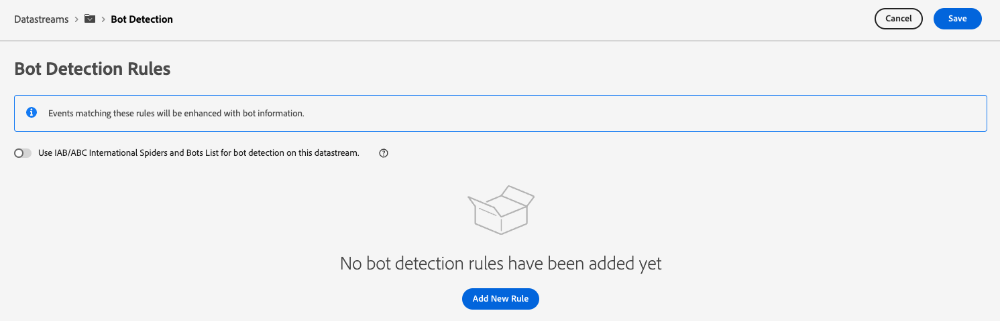

# データストリームのボット検出の設定

自動プログラム、Web スクレーパー、スパイダー、スクリプト化されたスキャナーなど、人間以外のエンティティから発生するトラフィックによって、人間の訪問者から発生するイベントの特定がより困難になる場合があります。 このタイプのトラフィックは、重要なビジネス指標に悪影響を与え、誤ったトラフィックレポートにつながる可能性があります。

ボット検出を使用すると、によって生成されたイベントを識別できます。 [Web SDK](../web-sdk/home.md), [Mobile SDK](https://developer.adobe.com/client-sdks/home/) および [[!DNL Server API]](../server-api/overview.md) 既知のクモやボットによって生成されるものです。

データストリームのボット検出を設定することで、ボットイベントとして分類したい特定の IP アドレス、IP 範囲およびリクエストヘッダーを識別できます。

ボットトラフィックを識別することで、サイトまたはモバイルアプリケーションのユーザーアクティビティをより正確に測定できます。

Edge Networkへのリクエストが任意のボット検出ルールに一致すると、以下に示すように、XDM スキーマがボットスコアリングを使用して更新されます（常に 1 に設定されます）。

```json
{
  "botDetection": {
    "score": 1
  }
}
```

このボットスコアリングは、リクエストを受信したソリューションがボットトラフィックを正しく識別するのに役立ちます。

>[!IMPORTANT]
>
>ボット検出は、ボットリクエストをドロップしません。 ボットスコアリングを使用した XDM スキーマのみを更新し、イベントをに転送します [datastream サービス](configure.md) 設定した。
>
>Adobeソリューションは、様々な方法でボットスコアリングを処理できます。 例えば、Adobe Analyticsは独自の [ボットフィルタリングサービス](https://experienceleague.adobe.com/docs/analytics/admin/admin-tools/manage-report-suites/edit-report-suite/report-suite-general/bot-removal/bot-rules.html) Edge Networkで設定されたスコアを使用しません。 2 つのサービスは同じを使用します [IAB ボットリスト](https://www.iab.com/guidelines/iab-abc-international-spiders-bots-list/)したがって、ボットスコアリングは同じです。

ボット検出ルールは、作成後、Edge Network全体に反映されるまでに最大 15 分かかる場合があります。

## 前提条件 {#prerequisites}

ボット検出がデータストリームで機能するには、 **[!UICONTROL ボット検出情報]** フィールドグループをスキーマに追加します。 を参照してください。 [XDM スキーマ](../xdm/ui/resources/schemas.md#add-field-groups) スキーマにフィールドグループを追加する方法について説明するドキュメント。

## データストリームのボット検出の設定 {#configure}

データストリーム設定を作成した後で、ボット検出を設定できます。 方法については、ドキュメントを参照してください。 [データストリームの作成と設定](configure.md)次に、以下の手順に従ってデータストリームにボット検出機能を追加します。

データストリームリストに移動し、ボット検出を追加するデータストリームを選択します。


データストリームの詳細ページで、 **[!UICONTROL ボットの検出]** 右側のパネルの「」オプションをクリックします。


この **[!UICONTROL ボット検出ルール]** ページが表示されます。



ボット検出ルール ページで、次の機能を使用してボット検出を設定できます。

* 使用， [!DNL [IAB/ABC International Spiders and Bots List]](https://www.iab.com/guidelines/iab-abc-international-spiders-bots-list/).
* 独自のボット検出ルールの作成。

### IAB/ABC International Spiders and Bot List の使用 {#iab-list}

この [IAB/ABC International Spiders and Bot List](https://www.iab.com/guidelines/iab-abc-international-spiders-bots-list/) は、サードパーティの業界標準のインターネットスパイダーとボットのリストです。検索エンジンクローラーや監視ツールなどの自動トラフィックや、analytics カウントに表示したくない人とは異なるトラフィックを特定するのに役立ちます。

を使用するようにデータストリームを設定するには [!DNL IAB/ABC International Spiders and Bots List]、を切り替えます **[!UICONTROL このデータストリームでのボット検出には、IAB/ABC International Spiders and Bot List を使用します。]** オプションを選択してから、「保存」を選択して、データストリームにボット検出設定を適用します。


### ボット検出ルールの作成 {#rules}

を使用するほか、 [IAB/ABC International Spiders and Bot List](https://www.iab.com/guidelines/iab-abc-international-spiders-bots-list/)を使用すると、データストリームごとに独自のボット検出ルールを定義できます。

に基づいてボット検出ルールを作成できます **IP アドレス** および **IP アドレスの範囲**.

より詳細なボット検出ルールが必要な場合は、IP 条件とリクエストヘッダー条件を組み合わせることができます。 ボット検出ルールでは、次のヘッダーを使用できます。

| HTTP ヘッダー | 説明 |
| --- | --- |
| `user-agent` | サーバーやネットワークピアが、要求元のユーザーエージェントのアプリケーション、オペレーティングシステム、ベンダー、バージョンを特定できるヘッダー。 |
| `content-type` | （送信にコンテンツエンコーディングが適用される前の）リソースの元のメディアタイプを示します。 |
| `referer` | リソースがリクエストされた web ページのアドレスを識別します。 |
| `sec-ch-ua` | ブラウザーに関連付けられている各ブランドのブランドと重要なバージョンをコンマ区切りリストで提供します。 |
| `sec-ch-ua-mobile` | ブラウザーがモバイルデバイス上にあるかどうかを示します。 また、デスクトップブラウザーでモバイルユーザーエクスペリエンスの環境設定を示すためにも使用できます。 |
| `sec-ch-ua-platform` | ユーザーエージェントが実行されているプラットフォームまたはオペレーティングシステムを提供します。 例：「Windows」または「Android」。 |
| `sec-ch-ua-platform-version` | ユーザーエージェントが実行されているオペレーティングシステムのバージョンを提供します。 |
| `sec-ch-ua-arch` | ユーザーエージェントの基盤となる CPU アーキテクチャ （ARM、x86 など）を提供します。 |
| `sec-ch-ua-model` | ブラウザーが実行されているデバイスモデルを示します。 |
| `sec-ch-ua-bitness` | user-agent の基盤となる CPU アーキテクチャの「ビット数」を提供します。 これは、整数またはメモリアドレスのビット単位のサイズで、通常は 64 ビットまたは 32 ビットです。 |
| `sec-ch-ua-wow64` | ユーザーエージェント バイナリが 64 ビット Windows 上の 32 ビット モードで実行されているかどうかを示します。 |

ボット検出ルールを作成するには、次の手順に従います。

1. を選択 **[!UICONTROL 新規ルールの追加]**.

   

2. ルールの名前を **[!UICONTROL ルール名]** フィールド。

   

3. を選択 **[!UICONTROL 新しい IP 条件を追加]** 新しい IP ベースのルールを追加する場合 ルールは、IP アドレスまたは IP アドレスの範囲で定義できます。

   

   

   >[!TIP]
   >
   >IP 条件は、論理に基づいています `OR` 操作。 定義したいずれかの IP 条件に一致する場合、リクエストはボットからの発信元としてマークされます。

4. ルールにヘッダー条件を追加する場合は、 **[!UICONTROL ヘッダー条件グループの追加]**&#x200B;ルールで使用するヘッダーを選択します。

   

   次に、選択したヘッダーに使用する条件を追加します。

   

5. 目的のボット検出ルールを設定したら、以下を選択します。 **[!UICONTROL 保存]** ルールをデータストリームに適用する。

   


## ボット検出ルールの例 {#examples}

ボット検出を開始する際に役立つように、以下に説明する例を使用して、ボット検出ルールを作成できます。

### 1 つの IP アドレスに基づくボット検出 {#one-ip}

特定の IP アドレスから発生するすべてのリクエストをボットトラフィックとしてマークするには、単一の IP アドレスを評価する新しいボット検出ルールを作成します（下図を参照）。


### 2 つの IP アドレスに基づくボット検出 {#two-ip}

2 つの特定の IP アドレスのいずれかから発生するすべての要求をボットトラフィックとしてマークするには、次の画像に示すように、2 つの IP アドレスを評価する新しいボット検出ルールを作成します。


### IP アドレスの範囲に基づくボット検出 {#range}

特定の範囲の任意の IP アドレスから発生するすべての要求をボットトラフィックとしてマークするには、以下の画像に示すように、IP アドレス範囲全体を評価する新しいボット検出ルールを作成します。


### IP アドレスとリクエストヘッダーに基づくボット検出 {#ip-header}

特定の IP アドレスから発生し、特定のリクエストヘッダーを含むすべてのリクエストをボットトラフィックとしてマークするには、次の画像に示すように、新しいボット検出ルールを作成します。

このルールは、リクエストが特定の IP アドレスから発生しているかどうか、および `referer` リクエストヘッダーがで始まる `www.adobe.com`.


### 複数の条件に基づくボット検出 {#multiple-conditions}

次の項目に基づいてボット検出ルールを作成できます。

* **複数の異なる条件**：様々な条件が論理として評価されます `AND` 操作：リクエストがボットから発生したものとして識別されるためには、条件を同時に満たす必要があります。
* **同じタイプの複数の条件**：同じタイプの条件が論理として評価されます `OR` 操作。つまり、いずれかの条件が満たされた場合、リクエストは、ボットから生じたものとして識別されます。

以下の画像に示すルールは、次の条件を満たす場合、ボット起点のリクエストを識別します。

リクエストは、2 つの IP アドレスのどちらか（ `referer` ヘッダーがで始まる `www.adobe.com`、および `sec-ch-ua-mobile` ヘッダーは、リクエストの発信元がデスクトップブラウザーであることを識別します。


