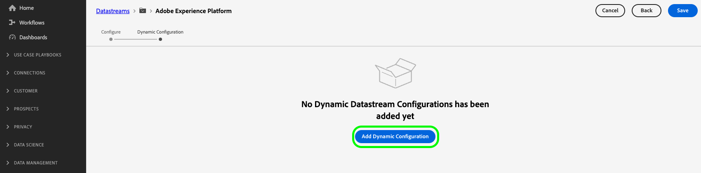

# 動的データストリーム設定の作成

>[!AVAILABILITY]
>
>* 動的データストリーム設定を定義するオプションは、現在Betaにあり、限られた数のお客様が利用できます。 この機能へのアクセス権を取得するには、Adobe担当者にお問い合わせください。 ドキュメントと機能は変更される場合があります。

デフォルトでは、Experience PlatformEdge Networkはデータストリームに到達するすべてのイベントを、データストリームに対して有効にしたすべてのExperience Cloud[ サービス ](configure.md#add-services) に送信します。 ユースケースによっては、これが常に理想的なワークフローであるとは限りません。

動的データストリーム設定は、データストリームに対して有効な各サービスに対してユーザーが設定可能な一連のルールを使用して、この問題に対処します。このルールは、各タイプのデータを受け取るExperience Cloudソリューションを指定します。

## 前提条件 {#prerequisites}

データストリームの動的設定を作成するには、次の 2 つの条件を満たす必要があります。

* 操作するデータストリームを *少なくとも* 1 つ作成している必要があります。 詳しくは、[ データストリームの作成 ](configure.md) 方法に関するドキュメントを参照してください。
* データストリームに *少なくとも* 1 つのExperience Cloudサービスを追加する必要があります。 詳しくは、データストリームに [ サービスを追加 ](configure.md#add-services) する方法のドキュメントを参照してください。

データストリームを作成し、Experience Cloudサービスを追加したら、[ 動的設定を作成 ](#create-dynamic-configuration) できます。

## 動的データストリーム設定の作成 {#create-dynamic-configuration}

[ データストリームを作成 ](configure.md) して [ サービスを追加 ](configure.md#add-services) した後、次の手順に従ってサービスに動的設定を追加します。

1. **[!UICONTROL データ収集]**/**[!UICONTROL データストリーム]** ページに移動し、作成したデータストリームを選択します。

   

1. 動的設定を定義するサービスの **[!UICONTROL 編集]** オプションを選択します。

   

1. **[!UICONTROL 設定]** ページで、「**[!UICONTROL 動的設定を保存して編集]**」を選択します。

   

1. 「**[!UICONTROL 動的設定を追加]**」を選択します。

   

1. **[!UICONTROL リソース]** パネルから、ルールを作成する項目をウィンドウの右側にドラッグ&amp;ドロップします。 複数のリソースを組み合わせて、複雑なルールを作成できます。

   各リソースのオプション（**[!UICONTROL equals]**、**[!UICONTROL not equal]**、**[!UICONTROL exists]** など）を使用して、ルールを微調整します。

   

1. 「**[!UICONTROL 設定]**」セクションでは、データを各サービスに送信するかどうかに応じて、ルールごとに有効または無効にするサービスを切り替えます。 トグルをオフにすると、サービスのルーティングが無効になり、アップストリームサービスに *データなし* が送信されます。

   

1. ルールの設定が完了したら、「**[!UICONTROL 保存]**」を選択します。

## ルールの優先度の考慮事項 {#considerations}

動的データストリーム設定ごとに複数のルールを定義できます。 ただし、データが複数のルールの条件に一致する場合は、リスト内の最初の一致するルールのみが考慮され、他のすべての一致するルールは無視されます。

目的のデータのルーティング動作を実現するには、ルールを配置する順序に注意を払います。

ルールの順序を設定するには、目的の順序でルールウィンドウをドラッグ&amp;ドロップします。

