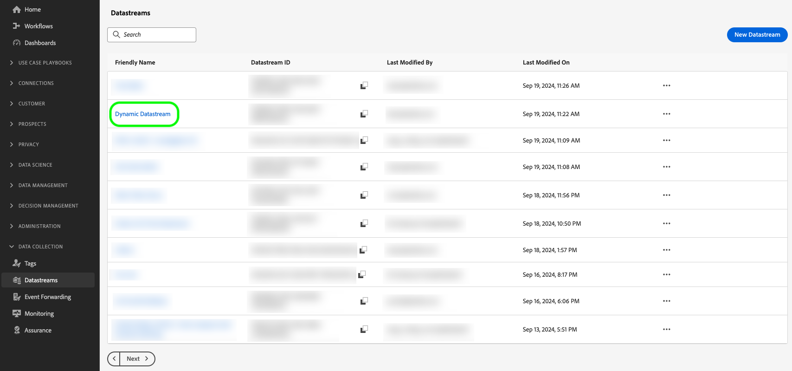

# 動的データストリーム設定の作成

デフォルトでは、Experience Platform Edge Networkは、データストリームにリーチするすべてのイベントを、データストリームに対して有効にしたすべてのExperience Cloud [ サービス ](configure.md#add-services)に送信します。 ユースケースによっては、必ずしも理想的なワークフローではない可能性があります。

動的データストリーム設定では、データストリームに対して有効な各サービスに対して定義する、ユーザーが設定できる一連のルールを通じて、この懸念に対処します。このルールは、Experience Cloud ソリューションが各タイプのデータを受け取る必要がある内容を決定します。

## 前提条件 {#prerequisites}

データストリームの動的設定を作成するには、次の2つの条件を満たす必要があります。

* *少なくとも*&#x200B;個のデータストリームを作成しておく必要があります。 詳しくは、[ データストリームの作成方法](configure.md)に関するドキュメントを参照してください。
* データストリームに&#x200B;*少なくとも*&#x200B;個のExperience Cloud サービスを追加する必要があります。 詳しくは、[ データストリームにサービス ](configure.md#add-services)を追加する方法に関するドキュメントを参照してください。

データストリームを作成してExperience Cloud サービスを追加したら、次に[動的設定を作成できます](#create-dynamic-configuration)。

## ガードレール {#guardrails}

動的データストリーム設定には、最適なシステムパフォーマンスとデータ処理効率を確保するために、特定の制限とパフォーマンスの制約があります。 動的データストリームルールを設定する場合は、次のガードレールが適用されます。

| ガードレール | 上限 | 制限タイプ |
|---------|------------|------|
| Experience Platform サービスのデータストリームごとの動的データストリーム設定の最大数 | 5 | パフォーマンスガードレール |
| イベント転送用データストリームごとの動的データストリーム設定の最大数 | 5 | パフォーマンスガードレール |
| Adobe Analyticsのデータストリームごとの動的データストリーム設定の最大数 | 5 | パフォーマンスガードレール |
| Adobe Targetのデータストリームごとの動的データストリーム設定の最大数 | 5 | パフォーマンスガードレール |
| Adobe Audience Managerのデータストリームごとの動的データストリーム設定の最大数 | 5 | パフォーマンスガードレール |
| 1つのルール内で結合できる条件（述語）の最大数 | 100 | パフォーマンスガードレール |
| タイムアウトする前に、データストリームごとにすべての動的データストリーム設定を評価するために許可される最大時間 | 25 ミリ秒 | システム強制ガードレール |

## 動的データストリーム設定とデータストリーム設定の上書き {#dynamic-versus-overrides}

動的データストリーム設定と[ データストリーム設定オーバーライド ](overrides.md)は、相互に排他的な機能です。

つまり、動的データストリーム設定をデータストリーム設定のオーバーライドと共に使用することはできません。 どちらか一方を選ばなければなりません。

動的データストリーム設定とデータストリーム設定の上書きの両方を有効にすると、設定の上書きが優先され、動的データストリーム設定ルールは無視されます。

## 動的データストリーム設定の作成 {#create-dynamic-configuration}

[ データストリーム ](configure.md)を作成し、[ サービス ](configure.md#add-services)を追加した後、次の手順に従ってサービスに動的設定を追加します。

1. **[!UICONTROL Data Collection]** > **[!UICONTROL Datastreams]** ページに移動し、作成したデータストリームを選択します。

   

1. 動的設定を定義するサービスの&#x200B;**[!UICONTROL Edit]** オプションを選択します。

   

1. **[!UICONTROL Configure]** ページで、**[!UICONTROL Save and Edit Dynamic Configuration]**&#x200B;を選択します。

   

1. **[!UICONTROL Add Dynamic Configuration]** を選択します。

   

1. **[!UICONTROL Resources]** パネルから、ルールを作成するアイテムをウィンドウの右側にドラッグ&amp;ドロップします。 複数のリソースを組み合わせて、複雑なルールを構築できます。

   各リソースのオプション（**[!UICONTROL equals]**、**[!UICONTROL does not equal]**、**[!UICONTROL exists]**&#x200B;など）を使用して、ルールを微調整します。

   

1. 「**[!UICONTROL Configuration]**」セクションで、データを各サービスに送信するかどうかに応じて、各ルールに対して有効または無効にするサービスを切り替えます。 トグルをオフにすると、サービス ルーティングは無効になり、*データはアップストリーム サービスに送信されません*。

   

1. ルールの設定が完了したら、**[!UICONTROL Save]**&#x200B;を選択します。

## ルールの優先度に関する考慮事項 {#considerations}

動的データストリーム設定ごとに複数のルールを定義できます。 ただし、データが複数のルールの条件に一致する場合、リストの最初の一致するルールのみが考慮され、他のすべての一致するルールは無視されます。

目的のデータルーティング動作を実現するには、ルールを配置する順序に注意してください。

ルールの順序を設定するには、ルールウィンドウを目的の順序でドラッグ&amp;ドロップします。

ドラッグ&amp;ドロップでルールの順序を変更する方法を示す

## ルールの適格性の基準 {#eligibility-criteria}

動的データストリームの設定は、高いパフォーマンス、メンテナンス性、明瞭性を確保するために、特定の適格性基準を満たす必要があります。 ルールを定義するための主な要件とベストプラクティスを以下に示します。

### サポートされているデータタイプ {#supported-data-types}

動的データストリーム設定ルールは、特定のデータタイプと連携して、最適なパフォーマンスと信頼性の高いデータルーティングを実現します。 サポートされているデータタイプを把握することで、データを効率的に処理するための効果的なルールを作成できます。

| データタイプ | ステータス | メモ |
|-----------|--------|-------|
| 文字列 | 許可 | - |
| 数値（整数、ロング、ショート、バイト） | 許可 | - |
| 列挙 | 許可 | - |
| ブール | 許可 | - |
| 日付 | 許可 | - |
| 配列 | 許可されていません | 配列に基づくルールは、パフォーマンスを低下させる可能性があるため、サポートされていません。 |
| マップ | 許可されていません | マップに基づくルールは、パフォーマンスが低下する可能性があるため、サポートされていません。 |

### サポートされている演算子 {#supported-operators}

ルールでは、データ型に応じて次の演算子を使用できます。

| データタイプ | サポートされている演算子 |
|-----------|-------------------|
| **文字列** | `equals`, `starts with`, `ends with`, `contains`, `exists`, `does not equal`, `does not start with`, `does not end with`, `does not contain`, `does not exist` |
| **数値（長、整数、短、バイト）** | `equals`、`does not equal`、`greater than`、`less than`、`greater than or equal to`、`less than or equal to`、`exists`、`does not exist` |
| **ブール値** | `equals true/false`, `does not equal true/false` |
| **列挙** | `equals`、`does not equal`、`exists`、`does not exist` |
| **日付** | `today`, `yesterday`, `this month`, `this year`, `custom date`, `in last`, `from`, `during`, `within`, `before`, `after`, `rolling range`, `in next`, `exists`, `does not exist` |
| **論理** | `INCLUDE`, `ANY/ALL` （AND/ORと同等） |

>[!NOTE]
>
>**[!UICONTROL EXCLUDE]**&#x200B;演算子は直接サポートされていませんが、**[!UICONTROL INCLUDE]**&#x200B;を使用して、否定的な比較演算子を使用して同等のロジックを実現できます（例：「次と等しくない」）。

### ルール構造 {#rule-structure}

動的データストリーム設定のルールを作成する場合は、最適なパフォーマンスとシステムの互換性を確保するための構造要件を理解することが重要です。 ルール構造は、データを処理し、システム内をルーティングする効率に直接影響します。

**フラット式のみを使用**。 ルールをフラットな論理式として定義する必要があります。 ネストされた論理式（コンテナまたは複数レベルのAND/ORを使用）はサポートされていません。 複雑なロジックが必要な場合は、それを複数のフラットルールに分割します。

例えば、次の画像に示す複雑なルールを考えてみましょう。

複雑なルールを示す

このルールは、次のシンプルなルールに分割できます。

複雑なルールを示す

複雑なルールを示す

**複雑なルールを避ける**。 シンプルなルールにより、評価を迅速化し、メンテナンス性を向上できます。

### ベストプラクティス {#best-practices}

動的データストリーム設定ルールを作成する際のベストプラクティスに従うことで、最適なパフォーマンス、システムの信頼性、および保守に適した設定を実現できます。 これらのガイドラインは、陥りがちな落とし穴を回避し、プラットフォームのアーキテクチャとシームレスに連携する効率的なルールを構築するのに役立ちます。

* **ルールをシンプルかつフラットに保つ。**&#x200B;複雑なロジックを表現する必要がある場合は、ネストではなく複数のルールを使用します。
* **サポートされているデータ型[と](#supported-data-types)演算子[のみを使用](#supported-operators)**
* **ルールのパフォーマンスをテストします。**&#x200B;過度に複雑なルールまたはサポートされていないルールは、システムがそれらを拒否するか、システムのパフォーマンスに影響を与える可能性があります。

