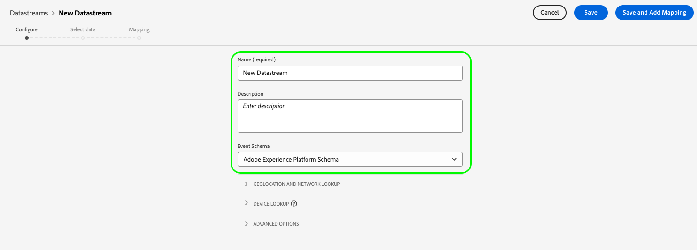

# データストリームの作成と設定

このドキュメントでは、UI で[データストリーム](./overview.md)を設定する手順を説明します。

## [!UICONTROL データストリーム]ワークスペースへのアクセス

左側のナビゲーションで&#x200B;**[!UICONTROL データストリーム]**&#x200B;を選択することで、データ収集 UI または Experience Platform UI でデータストリームを作成および管理できます。

「**[!UICONTROL データストリーム]**」タブには、わかりやすい名前、ID および最終更新日を含む、既存のデータストリームのリストが表示されます。データストリームの名前を選択して、[その詳細および設定サービスを表示](#view-details)します。

特定のデータストリームの「その他」アイコン（**...**）を選択して、その他のオプションを表示します。データストリームの[基本設定](#configure)を更新するには&#x200B;**[!UICONTROL 編集]**&#x200B;を選択し、データストリームを削除するには&#x200B;**[!UICONTROL 削除]**&#x200B;を選択します。

## 新しいデータストリームの作成 {#create}

データストリームを作成するには、最初に「**[!UICONTROL 新規データストリーム]**」を選択します。

設定手順から始まる、データストリーム作成ワークフローが表示されます。ここから、データストリームの名前およびオプションで説明を指定する必要があります。

Experience Platform で使用するためにこのデータストリームを設定していて、Platform Web SDK を使用している場合、取り込みを予定しているデータを表すために、[イベントベースのエクスペリエンスデータモデル（XDM）スキーマ](../xdm/classes/experienceevent.md)も選択する必要があります。

### 位置情報とネットワーク参照の設定 {#geolocation-network-lookup}

位置情報とネットワーク検索の設定は、収集する地理的データとネットワークレベルのデータの精度を定義するのに役立ちます。

を展開します。 **[!UICONTROL 位置情報とネットワーク参照]** 以下に説明する設定を行う場合は、「 」セクションを参照してください。

| 設定 | 説明 |
| --- | --- |
| [!UICONTROL 位置情報の検索] | 訪問者の IP アドレスに基づいて、選択したオプションの位置情報を検索できるようにします。 次のオプションを使用できます。 <ul><li>**国**：に値を入力します `xdm.placeContext.geo.countryCode`</li><li>**郵便番号**：に値を入力します `xdm.placeContext.geo.postalCode`</li><li>**都道府県**：に値を入力します `xdm.placeContext.geo.stateProvince`</li><li>**DMA**：に値を入力します `xdm.placeContext.geo.dmaID`</li><li>**市区町村**：に値を入力します `xdm.placeContext.geo.city`</li><li>**緯度**：に値を入力します `xdm.placeContext.geo._schema.latitude`</li><li>**経度**：に値を入力します `xdm.placeContext.geo._schema.longitude`</li></ul>**[!UICONTROL 市区町村]**、**[!UICONTROL 緯度]**&#x200B;または&#x200B;**[!UICONTROL 経度]**&#x200B;を選択すると、他にどのようなオプションが選択されているかに関係なく、小数第 2 位までの座標が表示されます。これは、市区町村レベルの精度と見なされます。   オプションを選択しないと、位置情報の参照が無効になります。 位置情報は次の前に発生します： [!UICONTROL IP Obfuscation（IP の不明化）]：これは、 [!UICONTROL IP Obfuscation（IP の不明化）] 設定。 |
| [!UICONTROL ネットワークの検索] | 訪問者の IP アドレスに基づいて、選択したオプションに関するネットワーク検索を有効にします。 次のオプションを使用できます。 <ul><li>**通信事業者**：に値を入力します `xdm.environment.carrier`</li><li>**ドメイン**：に値を入力します `xdm.environment.domain`</li><li>**ISP**：に値を入力します `xdm.environment.ISP`</li></ul> |

データ収集用に上記のいずれかのフィールドを有効にした場合、 [`context`](../edge/data-collection/automatic-information.md) 配列プロパティ [Web SDK の設定](../edge/fundamentals/configuring-the-sdk.md).

位置情報検索フィールドでは、 `context` 配列文字列 `"placeContext"`ネットワーク検索フィールドは `context` 配列文字列 `"environment"`.

さらに、スキーマに必要な各 XDM フィールドが存在することを確認します。 表示されない場合は、指定されたAdobeを追加できます `Environment Details` フィールドグループをスキーマに追加します。

### デバイス参照の設定 {#geolocation-device-lookup}

The **[!UICONTROL デバイス参照]** 「 」設定では、収集するデバイス固有の情報を選択できます。

を展開します。 **[!UICONTROL デバイス参照]** 以下に説明する設定を行う場合は、「 」セクションを参照してください。

>[!IMPORTANT]
>
>以下の表で説明する設定は、相互に排他的です。 ユーザーエージェント情報とデバイス参照データの両方を同時に選択することはできません。

| 設定 | 説明 |
| --- | --- |
| **[!UICONTROL ユーザーエージェントヘッダーとクライアントヒントヘッダーを保持する]** | ユーザーエージェント文字列に保存されている情報のみを収集する場合は、このオプションを選択します。 この設定はデフォルトで選択されています。 入力 `xdm.environment.browserDetails.userAgent` |
| **[!UICONTROL デバイス参照を使用して、次の情報を収集します]** | 次のデバイス固有の情報を 1 つ以上収集する場合は、このオプションを選択します。 <ul><li>**[!UICONTROL デバイス]** 情報：<ul><li>**デバイスの製造元**：に値を入力します `xdm.device.manufacturer`</li><li>**デバイスモデル**：に値を入力します `xdm.device.modelNumber`</li><li>**マーケティング名**：に値を入力します `xdm.device.model`</li></ul></li><li>**[!UICONTROL ハードウェア]** 情報： <ul><li>**ハードウェアの種類**：に値を入力します `xdm.device.type`</li><li>**表示の高さ**：に値を入力します `xdm.device.screenHeight`</li><li>**幅を表示**：に値を入力します `xdm.device.screenWidth`</li><li>**画面の色**：に値を入力します `xdm.device.colorDepth`</li></ul></li><li>**[!UICONTROL ブラウザー]** 情報： <ul><li>**ブラウザーベンダー**：に値を入力します `xdm.environment.browserDetails.vendor`</li><li>**ブラウザー名**：に値を入力します `xdm.environment.browserDetails.name`</li><li>**ブラウザーのバージョン**：に値を入力します `xdm.environment.browserDetails.version`</li></ul></li><li>**[!UICONTROL オペレーティングシステム]** 情報： <ul><li>**OS ベンダー**：に値を入力します `xdm.environment.operatingSystemVendor`</li><li>**OS 名**：に値を入力します `xdm.environment.operatingSystem`</li><li>**OS バージョン**：に値を入力します `xdm.environment.operatingSystemVersion`</li></ul></li></ul>ユーザーエージェントやクライアントヒントと共に、デバイス参照情報を収集することはできません。 デバイス情報の収集を選択すると、ユーザーエージェントとクライアントヒントの収集が無効になり、その逆も無効になります。 |
| **[!UICONTROL デバイス情報を収集しない]** | デバイス参照情報を収集しない場合は、このオプションを選択します。 デバイス、ハードウェア、ブラウザー、オペレーティングシステム、ユーザーエージェント、クライアントヒントのデータは収集されません。 |

データ収集用に上記のいずれかのフィールドを有効にした場合、 [`context`](../edge/data-collection/automatic-information.md) 配列プロパティ [Web SDK の設定](../edge/fundamentals/configuring-the-sdk.md).

デバイスとハードウェアの情報は、 `context` 配列文字列 `"device"`ブラウザーとオペレーティングシステムの情報は `context` 配列文字列 `"environment"`.

さらに、スキーマに必要な各 XDM フィールドが存在することを確認します。 表示されない場合は、指定されたAdobeを追加できます `Environment Details` フィールドグループをスキーマに追加します。

### 詳細オプションの設定 {#@advanced-options}

選択 **[!UICONTROL 詳細オプション]** :IP の難読化、ファーストパーティ ID cookie など、データストリームを設定する追加のコントロールを表示します。

>[!IMPORTANT]
>
> 正確な位置情報を含む個人データを収集、処理および送信するには、適用される法律および規制の下で必要なすべての権限、同意、許可および承認を、責任を持って確実に取得しておく必要があります。
> 
> IP アドレスの不明化を選択しても、IP アドレスから導き出されて設定済みのアドビソリューションに送信される位置情報のレベルには影響しません。位置情報の参照は、個別に制限するか無効にする必要があります。

| 設定 | 説明 |
| --- | --- |
| [!UICONTROL IP の不明化] | データストリームに適用される IP 不明化のタイプを示します。顧客 IP に基づく処理は、IP の不明化設定の影響を受けます。これには、データストリームからデータを受信するすべての Experience Cloud サービスが含まれます。 
選択可能なオプションは次のとおりです。
 <ul><li>**[!UICONTROL なし]**：IP の不明化を無効にします。ユーザーの完全な IP アドレスがデータストリームを介して送信されます。</li><li>**[!UICONTROL 部分的]**：IPv4 アドレスの場合、ユーザー IP アドレスの最後のオクテットを不明化します。IPv6 アドレスの場合、アドレスの最後の 80 ビットを不明化します。 
例：
 <ul><li>IPv4：`1.2.3.4` -> `1.2.3.0`</li><li>IPv6：`2001:0db8:1345:fd27:0000:ff00:0042:8329` -> `2001:0db8:1345:0000:0000:0000:0000:0000`</li></ul></li><li>**[!UICONTROL 完全]**：IP アドレス全体を不明化します。 
例：
 <ul><li>IPv4：`1.2.3.4` -> `0.0.0.0`</li><li>IPv6：`2001:0db8:1345:fd27:0000:ff00:0042:8329` -> `0:0:0:0:0:0:0:0`</li></ul></li></ul> 他のアドビ製品に対する IP の不明化の影響は次のとおりです。 <ul><li>**Adobe Target**：データストリームレベル。 [!UICONTROL IP Obfuscation（IP の不明化）] が [!UICONTROL IP Obfuscation（IP の不明化）] Adobe Targetで実行され、リクエストに存在するすべての IP アドレスに対して実行されます。 例えば、データストリームレベルの場合、 [!UICONTROL IP Obfuscation（IP の不明化）] オプションが **[!UICONTROL 完全]** Adobe Target IP obfuscation（ IP の不明化）オプションが **[!UICONTROL 最終オクテットの難読化]**&#x200B;を指定すると、Adobe Targetは完全に不明化された IP を受け取ります。 データストリームレベルの場合 [!UICONTROL IP Obfuscation（IP の不明化）] オプションが **[!UICONTROL 部分的]** Adobe Target IP obfuscation（ IP の不明化）オプションが **[!UICONTROL 完全]**&#x200B;を指定した場合、Adobe Targetは部分的に不明化された IP を受け取り、その IP に完全な不明化を適用します。 Adobe Target IP の不明化は、データストリームとは独立して管理されます。 詳しくは、[IP の不明化](https://developer.adobe.com/target/before-implement/privacy/privacy/)および[位置情報](https://experienceleague.adobe.com/docs/target/using/audiences/create-audiences/categories-audiences/geo.html?lang=ja)に関する Adobe Target ドキュメントを参照してください。</li><li>**Audience Manager**：データストリームレベル。 [!UICONTROL IP Obfuscation（IP の不明化）] 設定が適用される前に [!UICONTROL IP Obfuscation（IP の不明化）] Audience Managerで実行され、リクエストに存在するすべての IP アドレスに対して実行されます。 Audience Manager で実行される位置情報検索は、データストリームレベルの [!UICONTROL IP 不明化]オプションの影響を受けます。Audience Manager で、完全に不明化された IP に基づいて位置情報の検索が行われると、不明な地域が発生し、結果として得られた位置情報データに基づくすべてのセグメントは実現されません。詳しくは、[IP の不明化](https://experienceleague.adobe.com/docs/audience-manager/user-guide/features/administration/ip-obfuscation.html?lang=ja)に関する Audience Manager のドキュメントを参照してください。</li><li>**Adobe Analytics**：Adobe Analytics は、現在のところ、「なし」以外の IP 不明化オプションが選択されている場合、部分的に不明化された IP アドレスを受け取ります。完全に不明化された IP アドレスを Analytics で受け取るには、Adobe Analytics で IP の不明化を別途設定する必要があります。この動作は、今後のリリースで更新される予定です。Analytics で IP の不明化を有効にする方法について詳しくは、Adobe Analytics の[ドキュメント](https://experienceleague.adobe.com/docs/analytics/admin/admin-tools/manage-report-suites/edit-report-suite/report-suite-general/general-acct-settings-admin.html?lang=ja)を参照してください。</li></ul> |
| [!UICONTROL ファーストパーティ ID Cookie] | この設定を有効にすると、Edge Network は[ファーストパーティデバイス ID](../edge/identity/first-party-device-ids.md) を参照する際に、この値を ID Map で参照するのではなく、指定された Cookie を参照するように指示します。  この設定を有効にする場合、ID が保存されていると期待される Cookie の名前を指定する必要があります。 |
| [!UICONTROL サードパーティ ID 同期] | ID 同期は、コンテナにグループ化して、異なる ID 同期を異なる時間に実行できます。この設定を有効にすると、どの ID 同期のコンテナがこのデータストリームに対して実行されるかを指定できます。 |
| [!UICONTROL サードパーティ ID 同期のコンテナ ID] | サードパーティ ID 同期に使用されるコンテナの数値 ID。 |
| [!UICONTROL コンテナ ID の上書き] | このセクションでは、デフォルト ID の上書きに使用できる、追加のサードパーティ ID 同期コンテナ ID を定義できます。 |
| [!UICONTROL アクセスタイプ] | Edge Network がデータストリームに受け入れる認証タイプを定義します。 <ul><li>**[!UICONTROL 混合認証]**：このオプションを選択すると、Edge Network は認証済みリクエストと未認証リクエストの両方を受け入れます。[Server API](../server-api/overview.md) と一緒に Web SDK または [Mobile SDK](https://developer.adobe.com/client-sdks/documentation/) を使用する場合は、このオプションを選択してください。 </li><li>**[!UICONTROL 認証済みのみ]**：このオプションを選択すると、Edge Network は認証済みのリクエストのみを受け入れます。Server API のみを使用する予定で、未認証のリクエストが Edge Network で処理されないようにする場合は、このオプションを選択します。</li></ul> |
| [!UICONTROL Media Analytics] | Experience PlatformSDK または Media Edge API を介した Edge ネットワーク統合のためのストリーミングトラッキングデータの処理を有効にするには、このオプションを選択します。 Media Analytics については、 [ドキュメント](https://experienceleague.adobe.com/docs/media-analytics/using/media-overview.html?lang=ja). |

ここから、Experience Platform のデータストリームを設定している場合は、[データ収集のためのデータ準備](./data-prep.md)に関するチュートリアルに従って、Platform イベントスキーマにデータをマッピングしてから、このガイドに戻ってください。それ以外の場合は、「**[!UICONTROL 保存]**」を選択して、次の節を続行します。

## データストリームの詳細の表示 {#view-details}

新しいデータストリームを設定したり、表示するために既存のデータストリームを選択したりすると、そのデータストリームの詳細ページが表示されます。ここでは、データストリームの詳細情報（ID など）を確認できます。

データストリームの詳細画面から、[サービスを追加](#add-services)して、アクセス権のある Adobe Experience Cloud 製品の機能を有効にできます。また、データストリームの[基本設定](#create)を編集したり、その[マッピングルール](./data-prep.md)を更新したり、[データストリームをコピー](#copy)したり、完全に削除したりできます。

## データストリームへのサービスの追加 {#add-services}

データストリームの詳細ページで、「**[!UICONTROL サービスを追加]**」を選択して、そのデータストリームで使用可能なサービスの追加を開始します。

次の画面で、ドロップダウンメニューを使用して、このデータストリームで設定するサービスを選択します。アクセス権のあるサービスのみが、このリストに表示されます。

目的のサービスを選択し、表示される設定オプションに入力してから、「**[!UICONTROL 保存]**」を選択してデータストリームにサービスを追加します。データストリームの詳細表示に、追加されたすべてのサービスが表示されます。

次の項では、各サービスの設定オプションを説明します。

>[!NOTE]
>
>各サービス設定には、サービスが選択されると自動的にアクティブ化される「**[!UICONTROL 有効]**」トグルが含まれます。このデータストリーム用に選択されたサービスを無効にするには、もう一度「**[!UICONTROL 有効]**」トグルを選択します。

### Adobe Analytics 設定 {#analytics}

このサービスは、Adobe Analytics にデータを送信するかどうかと、どのように送信するかを制御します。追加情報については、[Analytics へのデータの送信](../edge/data-collection/adobe-analytics/analytics-overview.md)に関するガイドを参照してください。

| 設定 | 説明 |
| --- | --- |
| [!UICONTROL レポートスイート ID] | **（必須）**&#x200B;データの送信先の Analytics レポートスイートの ID。この ID は、Adobe Analytics UI の[!UICONTROL 管理者]／[!UICONTROL レポートスイート]にあります。複数のレポートスイートが指定された場合、データは各レポートスイートにコピーされます。 |
| [!UICONTROL レポートスイートの上書き] | このセクションでは、デフォルトのレポートスイート ID を上書きするために使用できるレポートスイート ID を追加できます。 |

### Adobe Audience Manager 設定 {#audience-manager}

このサービスは、Adobe Audience Manager にデータを送信するかどうかと、どのように送信するかを制御します。Audience Manager にデータを送信するために必要なのは、このセクションを有効にすることだけです。その他の設定は、オプションですが推奨されます。

| 設定 | 説明 |
| --- | --- |
| [!UICONTROL Cookie 宛先が有効] | SDK で、[!DNL Audience Manager] から [Cookie 宛先](https://experienceleague.adobe.com/docs/audience-manager/user-guide/features/destinations/custom-destinations/create-cookie-destination.html?lang=ja)経由でセグメント情報を共有できるようにします。 |
| [!UICONTROL URL 宛先が有効] | SDK で、[!DNL Audience Manager] から [URL 宛先](https://experienceleague.adobe.com/docs/audience-manager/user-guide/features/destinations/custom-destinations/create-url-destination.html?lang=ja)経由でセグメント情報を共有できるようにします。 |

### Adobe Experience Platform 設定 {#aep}

>[!IMPORTANT]
>
>Platform のデータストリームを有効にする場合、UI の上部リボンに表示されている、現在使用中の Platform サンドボックスに注意してください。
>
>
>
>サンドボックスは、Adobe Experience Platform の仮想パーティションで、組織内の他のユーザーからデータおよび実装を分離できます。一旦データストリームが作成されると、そのサンドボックスは変更できません。Experience Platform のサンドボックスの役割について詳しくは、[サンドボックスのドキュメント](../sandboxes/home.md)を参照してください。

このサービスは、Adobe Experience Platform にデータを送信するかどうかと、どのように送信するかを制御します。

| 設定 | 説明 |
|---| --- |
| [!UICONTROL イベントデータセット] | **（必須）**&#x200B;顧客イベントデータのストリーミング先となる Platform データセットを選択します。このスキーマは、[XDM ExperienceEvent クラス](../xdm/classes/experienceevent.md)を使用する必要があります。データセットを追加するには、**[!UICONTROL イベントデータセットを追加]**&#x200B;を選択します。 |
| [!UICONTROL プロファイルデータセット] | 顧客属性データの送信先となる Platform データセットを選択します。このスキーマは、[XDM Individual Profile クラス](../xdm/classes/individual-profile.md)を使用する必要があります。 |
| [!UICONTROL Offer Decisioning] | このチェックボックスを選択して、Platform Web SDK 実装用の Offer Decisioning を有効にします。実装について詳しくは、[Platform Web SDK での Offer Decisioning の使用](../edge/personalization/offer-decisioning/offer-decisioning-overview.md)に関するガイドを参照してください。  Offer Decisioning 機能について詳しくは、[Adobe Journey Optimizer のドキュメント](https://experienceleague.adobe.com/docs/journey-optimizer/using/offer-decisioniong/get-started/starting-offer-decisioning.html?lang=ja)を参照してください。 |
| [!UICONTROL エッジのセグメント化] | このチェックボックスを選択して、このデータストリームの[エッジのセグメント化](../segmentation/ui/edge-segmentation.md)を有効にします。SDK がエッジセグメント化対応データストリームでデータを送信すると、当該プロファイルの更新されたセグメントメンバーシップが応答で返されます。  このオプションは、[次のページパーソナライゼーションのユースケース](../destinations/ui/activate-edge-personalization-destinations.md)の[!UICONTROL パーソナライゼーションの宛先]と組み合わせて使用できます。 |
| [!UICONTROL パーソナライゼーションの宛先] | 「[!UICONTROL エッジセグメント化]」チェックボックスを有効にした後でこの項目を有効にすると、[カスタムパーソナライゼーション](../destinations/catalog/personalization/custom-personalization.md)などのパーソナライゼーションの宛先にデータストリームが接続できるようになります。  [パーソナライゼーションの宛先の設定](../destinations/ui/activate-edge-personalization-destinations.md)に関する特定の手順については、宛先のドキュメントを参照してください。 |
| [!UICONTROL Adobe Journey Optimizer] | このチェックボックスを選択すると、このデータストリームに対して [Adobe Journey Optimizer](https://experienceleague.adobe.com/docs/journey-optimizer/using/ajo-home.html?lang=ja) を有効にすることができます。   このオプションを有効にすると、データストリームは [!DNL Adobe Journey Optimizer] の web およびアプリベースのインバウンドキャンペーンからパーソナライズされたコンテンツを返すことができるようになります。このオプションを使用するには、[!UICONTROL エッジセグメント化]をアクティブにする必要があります。[!UICONTROL エッジセグメント化]がオフの場合、このオプションはグレー表示されます。 |

### Adobe Target 設定 {#target}

このサービスは、Adobe Target にデータを送信するかどうかと、どのように送信するかを制御します。

| 設定 | 説明 |
| --- | --- |
| [!UICONTROL プロパティトークン] | [!DNL Target] を使用すると、お客様は、プロパティの使用を通じて権限を制御できます。プロパティについて詳しくは、[!DNL Target] ドキュメントの[エンタープライズ権限の設定](https://experienceleague.adobe.com/docs/target/using/administer/manage-users/enterprise/properties-overview.html?lang=ja)に関するガイドを参照してください。  プロパティトークンは、Adobe Target UI の[!UICONTROL 設定]／[!UICONTROL プロパティ]にあります。 |
| [!UICONTROL Target 環境 ID] | [Adobe Target の環境](https://experienceleague.adobe.com/docs/target/using/administer/hosts.html?lang=ja)を使用すると、開発のすべてのステージを通じて実装を管理できます。この設定は、このデータストリームで使用しようとしている環境を指定します。  ベストプラクティスは、`dev`、`stage`、`prod` の各データストリーム環境ごとに異なる設定を行って、物事をシンプルに保つことです。ただし、既に Adobe Target 環境を定義している場合は、それを使用できます。 |
| [!UICONTROL Target サードパーティ ID 名前空間] | このデータストリームに使用する `mbox3rdPartyId` の ID 名前空間。詳しくは、[Web SDK を使用した `mbox3rdPartyId` の実装](../edge/personalization/adobe-target/using-mbox-3rdpartyid.md)に関するガイドを参照してください。 |
| [!UICONTROL プロパティトークンの上書き] | このセクションでは、デフォルトのプロパティトークンを上書きするために使用できる、追加のプロパティトークンを定義できます。 |

### [!UICONTROL イベント転送]設定

このサービスは、[イベント転送](../tags/ui/event-forwarding/overview.md)にデータを送信するかどうかと、どのように送信するかを制御します。

| 設定 | 説明 |
| --- | --- |
| [!UICONTROL Launch プロパティ] | **（必須）**&#x200B;データの送信先のイベント転送プロパティ。 |
| [!UICONTROL Launch 環境] | **（必須）**&#x200B;データの送信先の選択されたプロパティ内の環境。 |

>[!NOTE]
>
>「**[!UICONTROL 手動で ID を入力]**」を選択すると、ドロップダウンメニューを使用せずに、プロパティ名および環境名を入力できます。

## データストリームのコピー {#copy}

既存のデータストリームのコピーを作成し、必要に応じて、その詳細を変更できます。

>[!NOTE]
>
>データストリームは、同じ[サンドボックス](../sandboxes/home.md)内でのみコピーできます。つまり、あるサンドボックスから別のサンドボックスにデータストリームをコピーすることはできません。

[!UICONTROL データストリーム]ワークスペースのメインページから、当該データストリームの省略記号（**...**）を選択してから、「**[!UICONTROL コピー]**」を選択します。

![データストリームリスト表示から「[!UICONTROL コピー]」オプションが選択されていることを示す画像](assets/configure/copy-datastream-list.png)

または、指定されたデータストリームの詳細表示から「**[!UICONTROL データストリームをコピー]**」を選択することもできます。

![データストリームの詳細表示から「[!UICONTROL コピー]」オプションが選択されていることを示す画像](assets/configure/copy-datastream-details.png)

作成する新しいデータストリームの一意の名前を指定するよう促す確認ダイアログが表示され、上書きされる設定オプションに関する詳細が表示されます。準備ができたら、「**[!UICONTROL コピー]**」を選択します。

[!UICONTROL データストリーム]ワークスペースのメインページが再表示され、新しいデータストリームがリスト表示されます。

## 次の手順

このガイドでは、データ収集 UI でのデータストリームの管理方法について説明しました。データストリーム設定後の Web SDK のインストールおよび設定方法について詳しくは、[データ収集 E2E ガイド](../collection/e2e.md#install)を参照してください。
