# データストリームの作成と設定

このドキュメントでは、UI で[データストリーム](./overview.md)を設定する手順を説明します。

## [!UICONTROL Datastreams] ワークスペースへのアクセス

左側のナビゲーションで「**[!UICONTROL Datastreams]**」を選択すると、データ収集UIまたはExperience Platform UIでデータストリームを作成および管理できます。

データ収集UIの「

「**[!UICONTROL Datastreams]**」タブには、既存のデータストリームのリストが表示され、そのリストには、わかりやすい名前、ID、最終変更日が含まれます。 [詳細を表示してサービスを設定](#view-details)するには、データストリームの名前を選択します。

特定のデータストリームのオプションをさらに表示するには、「詳細」アイコン（**...**）を選択します。 データストリームの[基本設定](#configure)を更新するには、**[!UICONTROL Edit]**&#x200B;を選択します。 データストリームを削除するには、**[!UICONTROL Delete]**&#x200B;を選択します。

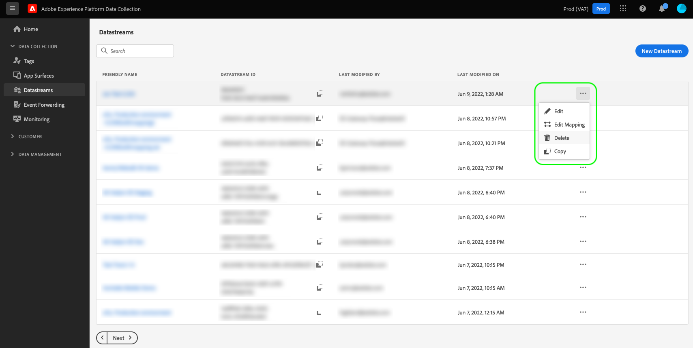

## データストリームの作成 {#create}

データストリームを作成するには、まず&#x200B;**[!UICONTROL New Datastream]**&#x200B;を選択します。

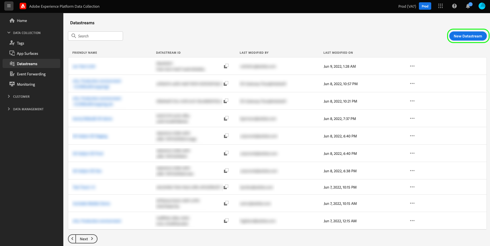

設定手順から始まる、データストリーム作成ワークフローが表示されます。ここから、データストリームの名前およびオプションで説明を指定する必要があります。

Experience Platformで使用するデータストリームを設定し、Web SDKも使用する場合は、取り込む予定のデータを表す[&#x200B; イベントベースのExperience Data Model （XDM） スキーマ &#x200B;](../xdm/classes/experienceevent.md)も選択する必要があります。

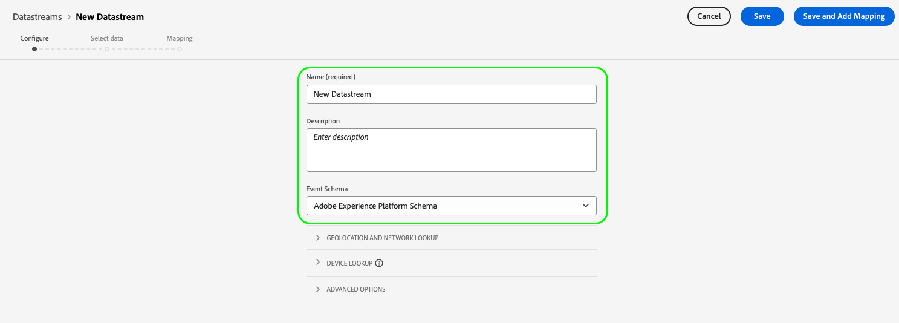

### 位置情報とネットワーク検索の設定 {#geolocation-network-lookup}

位置情報とネットワーク検索設定は、収集する地理的およびネットワークレベルのデータの詳細レベルを定義するのに役立ちます。

「**[!UICONTROL Geolocation and network lookup]**」セクションを展開して、以下に説明する設定を構成します。

位置情報とネットワーク検索設定がハイライト表示された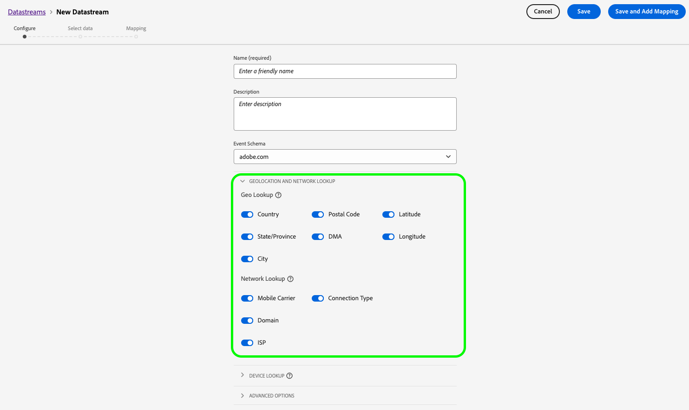

| 設定 | 説明 |
| --- | --- |
| [!UICONTROL Geo Lookup] | 訪問者のIP アドレスに基づいて、選択したオプションの位置情報の検索を有効にします。 使用可能なオプションは次のとおりです。 <ul><li>**国**：入力：`xdm.placeContext.geo.countryCode`</li><li>**郵便番号**: `xdm.placeContext.geo.postalCode`に入力します</li><li>**州/県**：入力：`xdm.placeContext.geo.stateProvince`</li><li>**DMA**: `xdm.placeContext.geo.dmaID`を入力します</li><li>**City**: `xdm.placeContext.geo.city`に入力します</li><li>**Latitude**: `xdm.placeContext.geo._schema.latitude`に入力します</li><li>**経度**: `xdm.placeContext.geo._schema.longitude`に入力します</li></ul>**[!UICONTROL City]**、**[!UICONTROL Latitude]**、または&#x200B;**[!UICONTROL Longitude]**&#x200B;を選択すると、他のオプションの選択に関係なく、座標は最大2つの小数点で指定されます。 これは市区町村レベルの精度と見なされます。   いずれかのオプションを選択しないと、位置情報の検索が無効になります。 位置情報は[!UICONTROL IP Obfuscation]より前に行われます。つまり、[!UICONTROL IP Obfuscation]設定の影響を受けません。 |
| [!UICONTROL Network Lookup] | 訪問者のIP アドレスに基づいて、選択したオプションのネットワーク検索を有効にします。 使用可能なオプションは次のとおりです。 <ul><li>**携帯電話会社**: `xdm.environment.carrier`に入力します</li><li>**ドメイン**: `xdm.environment.domain`を入力します</li><li>**ISP**: `xdm.environment.ISP`に入力します</li><li>**接続タイプ**: `xdm.environment.connectionType`を入力します</li></ul> |

上記のフィールドのいずれかをデータ収集に対して有効にする場合は、Web SDKの設定時に[`context`](/help/collection/js/commands/configure/context.md)配列プロパティを正しく設定してください。

位置情報ルックアップフィールドは`context`配列文字列`"placeContext"`を使用し、ネットワーク検索フィールドは`context`配列文字列`"environment"`を使用します。

また、各XDM フィールドがスキーマに存在することを確認します。 そうでない場合は、Adobeが提供する`Environment Details` フィールドグループをスキーマに追加できます。

### デバイス検索の設定 {#geolocation-device-lookup}

**[!UICONTROL Device Lookup]**&#x200B;設定を使用して、収集するデバイス固有の情報を選択します。

「**[!UICONTROL Device Lookup]**」セクションを展開して、以下に説明する設定を構成します。

デバイス検索設定がハイライト表示された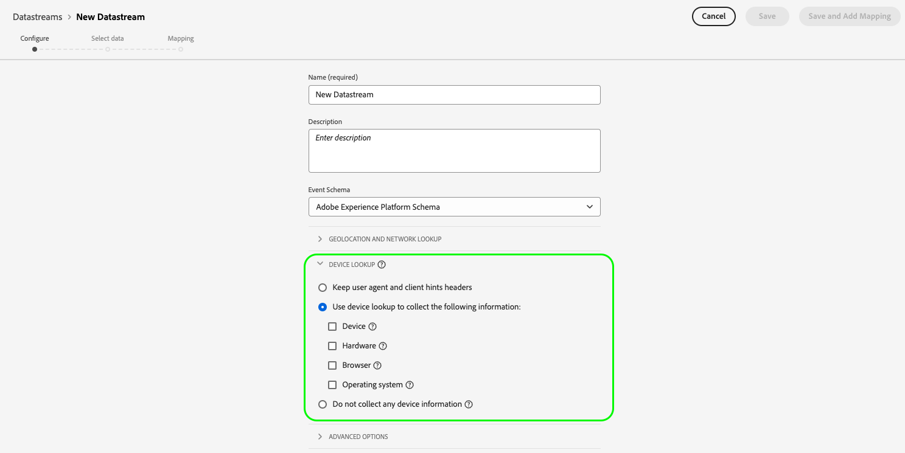

>[!IMPORTANT]
>
>以下の表に示す設定は、相互に排他的です。 ユーザーエージェント情報&#x200B;*と* デバイス検索データの両方を同時に選択することはできません。

| 設定 | 説明 |
| --- | --- |
| **[!UICONTROL Keep user agent and client hints headers]** | ユーザーエージェント文字列に格納されている情報のみを収集する場合は、このオプションを選択します。 この設定はデフォルトで選択されています。 `xdm.environment.browserDetails.userAgent`を自動入力 |
| **[!UICONTROL Use device lookup to collect the following information]** | 次の1つ以上のデバイス固有の情報を収集する場合は、このオプションを選択します。 <ul><li>**[!UICONTROL Device]**&#x200B;情報：<ul><li>**デバイスの製造元**: `xdm.device.manufacturer`に入力します</li><li>**デバイスモデル**: `xdm.device.modelNumber`を入力します</li><li>**マーケティング名**: `xdm.device.model`を入力します</li></ul></li><li>**[!UICONTROL Hardware]**&#x200B;情報： <ul><li>**ハードウェアの種類**: `xdm.device.type`を入力します</li><li>**表示の高さ**: `xdm.device.screenHeight`を入力します</li><li>**表示幅**: `xdm.device.screenWidth`に入力します</li><li>**色深度を表示**: `xdm.device.colorDepth`を入力します</li></ul></li><li>**[!UICONTROL Browser]**&#x200B;情報： <ul><li>**ブラウザーベンダー**: `xdm.environment.browserDetails.vendor`に入力します</li><li>**ブラウザー名**: `xdm.environment.browserDetails.name`を入力します</li><li>**ブラウザーのバージョン**: `xdm.environment.browserDetails.version`を入力します</li></ul></li><li>**[!UICONTROL Operating system]**&#x200B;情報： <ul><li>**OS ベンダー**: `xdm.environment.operatingSystemVendor`に入力します</li><li>**OS名**: `xdm.environment.operatingSystem`を入力します</li><li>**OS バージョン**: `xdm.environment.operatingSystemVersion`を入力します</li></ul></li></ul>デバイスのルックアップ情報は、ユーザーエージェントおよびクライアントヒントと共に収集できません。 デバイス情報の収集を選択すると、ユーザーエージェントとクライアントヒントの収集が無効になり、その逆も無効になります。 |
| **[!UICONTROL Do not collect any device information]** | デバイスのルックアップ情報を収集しない場合は、このオプションを選択します。 デバイス、ハードウェア、ブラウザー、オペレーティングシステム、ユーザーエージェント、またはクライアントヒントデータは収集されません。 |

上記のフィールドのいずれかをデータ収集に対して有効にする場合は、Web SDKの設定時に[`context`](/help/collection/js/commands/configure/context.md)配列プロパティを正しく設定してください。

デバイス情報とハードウェア情報では`context`配列文字列`"device"`を使用し、ブラウザー情報とオペレーティングシステム情報では`context`配列文字列`"environment"`を使用します。

また、各XDM フィールドがスキーマに存在することを確認します。 そうでない場合は、Adobeが提供する`Environment Details` フィールドグループをスキーマに追加できます。

### 詳細オプションの設定 {#advanced-options}

詳細設定オプションを表示するには、**[!UICONTROL Advanced Options]**&#x200B;を選択します。 ここでは、IPの難読化、ファーストパーティ ID Cookieなどの追加のデータストリーム設定を行うことができます。

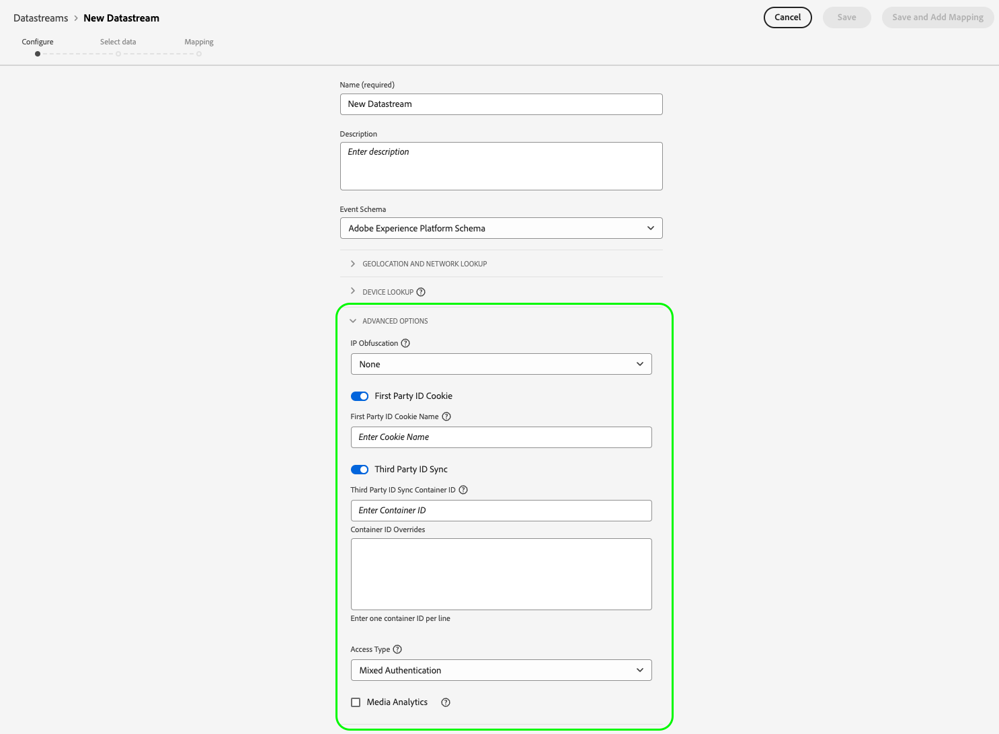

>[!IMPORTANT]
>
>お客様は、正確な位置情報を含む個人データの収集、処理、および送信に適用される法律および規制に基づいて必要なすべての許可、同意、許可を取得していることを確認する責任があります。
>
>IP アドレスの難読化の選択は、IP アドレスから派生し、設定したAdobe ソリューションに送信される位置情報のレベルには影響しません。 位置情報の参照は、個別に制限するか無効にする必要があります。

| 設定 | 説明 |
| --- | --- |
| [!UICONTROL IP Obfuscation] | データストリームに適用される IP 不明化のタイプを示します。顧客IPに基づく処理は、IP難読化設定の影響を受けます。 これには、データストリームからデータを受け取るすべてのExperience Cloud サービスが含まれます。 IPの難読化は、イベントがデータ準備などの任意のダウンストリームサービスに送信される前に行われます。 
選択可能なオプションは次のとおりです。
 <ul><li>**[!UICONTROL None]**: IPの難読化を無効にします。 完全なユーザーIP アドレスは、データストリームを介して送信されます。</li><li>**[!UICONTROL Partial]**: IPv4 アドレスの場合、ユーザーIP アドレスの最後のオクテットが難読化されます。 IPv6 アドレスの場合、アドレスの最後の 80 ビットを不明化します。 
例：
 <ul><li>IPv4：`1.2.3.4` -> `1.2.3.0`</li><li>IPv6：`2001:0db8:1345:fd27:0000:ff00:0042:8329` -> `2001:0db8:1345:0000:0000:0000:0000:0000`</li></ul></li><li>**[!UICONTROL Full]**: IP アドレス全体を難読化します。 
例：
 <ul><li>IPv4：`1.2.3.4` -> `0.0.0.0`</li><li>IPv6：`2001:0db8:1345:fd27:0000:ff00:0042:8329` -> `0:0:0:0:0:0:0:0`</li></ul></li></ul> 他のアドビ製品に対する IP の不明化の影響は次のとおりです。 <ul><li>**Adobe Target**: データストリームレベル [!UICONTROL IP obfuscation]は、Adobe Targetで実行された[!UICONTROL IP obfuscation]の前に、リクエストに存在するすべてのIP アドレスに適用されます。 例えば、データストリームレベル [!UICONTROL IP obfuscation] オプションが&#x200B;**[!UICONTROL Full]**&#x200B;に設定され、Adobe Target IP難読化オプションが&#x200B;**[!UICONTROL Last octet obfuscation]**&#x200B;に設定されている場合、Adobe Targetは完全に難読化されたIPを受け取ります。 データストリームレベル [!UICONTROL IP obfuscation] オプションが&#x200B;**[!UICONTROL Partial]**&#x200B;に設定され、Adobe Target IP難読化オプションが&#x200B;**[!UICONTROL Full]**&#x200B;に設定されている場合、Adobe Targetは部分的に難読化されたIPを受け取り、そのIPに完全な難読化を適用します。 Adobe Target IPの難読化は、データストリームとは独立して管理されます。 詳しくは、[IP の不明化](https://experienceleague.adobe.com/docs/target-dev/developer/implementation/privacy/privacy.html)および[位置情報](https://experienceleague.adobe.com/docs/target/using/audiences/create-audiences/categories-audiences/geo.html)に関する Adobe Target ドキュメントを参照してください。</li><li>**Audience Manager**: データストリームレベル [!UICONTROL IP obfuscation]の設定は、Audience Managerで実行された[!UICONTROL IP obfuscation]の前に、リクエストに存在するすべてのIP アドレスに適用されます。 Audience Managerによる位置情報の検索は、データストリームレベルの[!UICONTROL IP obfuscation] オプションの影響を受けます。 Audience Managerで位置情報の検索を行うと、難読化されたIPに基づいて不明な領域が生成され、結果として得られる位置情報データに基づくセグメントは認識されません。 詳しくは、[IP の不明化](https://experienceleague.adobe.com/docs/audience-manager/user-guide/features/administration/ip-obfuscation.html)に関する Audience Manager のドキュメントを参照してください。</li><li>**Adobe Analytics**: データストリームレベルのIP難読化設定が&#x200B;**[!UICONTROL Full]**&#x200B;に設定されている場合、Adobe AnalyticsはIP アドレスを空白として扱います。 これは、位置情報の検索やIP フィルタリングなど、IP アドレスに依存するAnalytics処理に影響します。 Analyticsが難読化されていないIP アドレスまたは部分的に難読化されたIP アドレスを受信するには、IP難読化設定を&#x200B;**[!UICONTROL Partial]**&#x200B;または&#x200B;**[!UICONTROL None]**&#x200B;に設定します。 部分的に不明化されたIP アドレスと不明化されていないIP アドレスは、Analytics内でさらに不明化できます。 AnalyticsでIP難読化を有効にする方法について詳しくは、Adobe Analytics [&#x200B; ドキュメント &#x200B;](https://experienceleague.adobe.com/docs/analytics/admin/admin-tools/manage-report-suites/edit-report-suite/report-suite-general/general-acct-settings-admin.html?lang=ja)を参照してください。 IP アドレスが完全に難読化され、ページヒットに[!DNL ECID]も[!DNL VisitorID]も含まれていない場合、Analyticsは、IP アドレスに部分的に基づく[&#x200B; フォールバック ID](https://experienceleague.adobe.com/docs/id-service/using/reference/analytics-reference/analytics-ids.html?lang=en)を生成するのではなく、ヒットをドロップします。</li><li>**Adobe Advertising**: データストリームレベルのIP難読化が[!UICONTROL Partial]または[!UICONTROL Full]に設定されている場合、コネクテッド TV広告を除き、Advertising DSPでは地理的レポートと機能（測定とリターゲティングを含む）が無効になります。</li></ul> |
| [!UICONTROL First Party ID Cookie] | この設定を有効にすると、Edge Network は[ファーストパーティデバイス ID](/help/collection/identity/fpid.md) を参照する際に、この値を ID Map で参照するのではなく、指定された Cookie を参照するように指示します。  この設定を有効にする場合は、IDを保存するCookieの名前を指定する必要があります。 |
| [!UICONTROL Third Party ID Sync] | ID 同期は、コンテナにグループ化して、異なる ID 同期を異なる時間に実行できます。この設定を有効にすると、どの ID 同期のコンテナがこのデータストリームに対して実行されるかを指定できます。 |
| [!UICONTROL Third Party ID Sync Container ID] | サードパーティ ID 同期に使用されるコンテナの数値 ID。  **注：** データストリームは、デフォルトのAudience Manager コンテナ IDを参照しています。これは0です。 複数のAudience Manager ID同期コンテナ IDがある場合は、Audience Manager コンサルタントと協力して、ID同期設定を適切に識別して解決します。 |
| [!UICONTROL Container ID Overrides] | この節では、デフォルトのIDを上書きするために使用できる、追加のサードパーティ ID同期コンテナ IDを定義できます。 |
| [!UICONTROL Access Type] | Edge Network がデータストリームに受け入れる認証タイプを定義します。 <ul><li>**[!UICONTROL Mixed Authentication]**：このオプションを選択すると、Edge Networkは認証済みリクエストと未認証リクエストの両方を受け入れます。 Web SDKまたは[&#x200B; モバイル SDK](https://developer.adobe.com/client-sdks/home/)と[Edge Network API](https://developer.adobe.com/data-collection-apis/docs/api/)を使用する場合は、このオプションを選択します。 </li><li>**[!UICONTROL Authenticated Only]**：このオプションを選択すると、Edge Networkは認証済みリクエストのみを受け入れます。 Edge Network APIのみを使用し、未認証のリクエストがEdge Networkで処理されないようにする場合は、このオプションを選択します。</li></ul> |
| [!UICONTROL Media Analytics] | Experience Platform SDKまたは[Media Edge API](https://developer.adobe.com/cja-apis/docs/endpoints/media-edge/getting-started/)を介したEdge Network統合用のストリーミングトラッキングデータの処理を有効にします。 [&#x200B; ドキュメント &#x200B;](https://experienceleague.adobe.com/docs/media-analytics/using/media-overview.html?lang=ja)でMedia Analyticsについて説明します。 |

ここから、Experience Platformのデータストリームを設定する場合は、このガイドに戻る前に、[Data Prep for Data Collection](./data-prep.md)のチュートリアルに従って、データをExperience Platform イベントスキーマにマッピングしてください。 それ以外は、**[!UICONTROL Save]**&#x200B;を選択して次のセクションに進みます。

>[!NOTE]
>
>データストリーム設定に変更を保存した後、変更内容をEdge Network全体に反映するには、最大35分かかります。 この伝搬ウィンドウ中でも、リクエストは以前の設定で提供される場合があります。

## データストリームの詳細の表示 {#view-details}

新しいデータストリームを設定したり、表示するために既存のデータストリームを選択したりすると、そのデータストリームの詳細ページが表示されます。ここでは、データストリームの詳細情報（ID など）を確認できます。

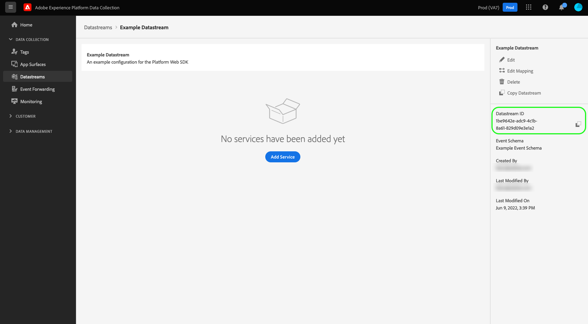

データストリームの詳細画面から、[サービスを追加](#add-services)して、アクセス権のある Adobe Experience Cloud 製品の機能を有効にできます。また、データストリームの[基本設定](#create)を編集したり、その[マッピングルール](./data-prep.md)を更新したり、[データストリームをコピー](#copy)したり、完全に削除したりできます。

## データストリームへのサービスの追加 {#add-services}

データストリームの詳細ページで、**[!UICONTROL Add Service]**&#x200B;を選択して、そのデータストリームに使用可能なサービスの追加を開始します。

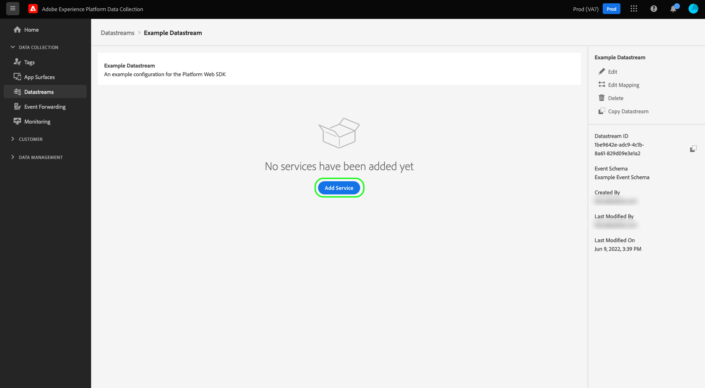

次の画面で、ドロップダウンメニューを使用して、このデータストリームで設定するサービスを選択します。アクセス権のあるサービスのみが、このリストに表示されます。

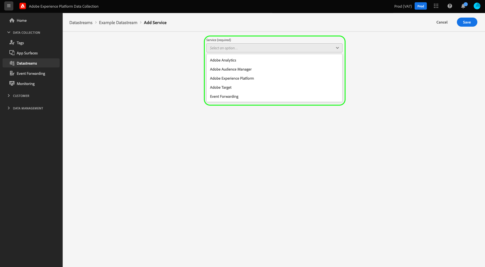

目的のサービスを選択し、表示される設定オプションを入力し、**[!UICONTROL Save]**&#x200B;を選択してデータストリームにサービスを追加します。 データストリームの詳細表示に、追加されたすべてのサービスが表示されます。

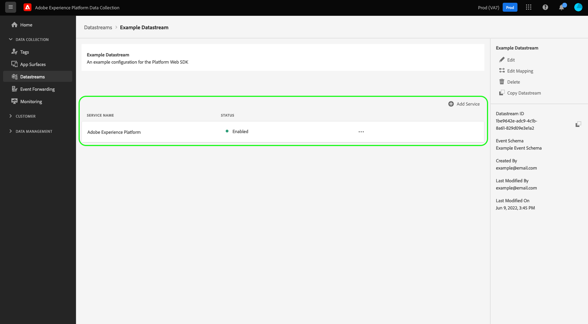

次の項では、各サービスの設定オプションを説明します。

>[!NOTE]
>
>各サービス設定には、サービスが選択されたときに自動的にアクティブ化される&#x200B;**[!UICONTROL Enabled]** トグルが含まれています。 このデータストリームに対して選択したサービスを無効にするには、**[!UICONTROL Enabled]** トグルをもう一度選択します。

### Adobe Advertisingの設定 {#advertising}

このサービスは、Adobe AdvertisingとCustomer Journey Analyticsの統合に必要です。

### Adobe Analytics 設定 {#analytics}

このサービスは、Adobe Analyticsにデータを送信するかどうか、どのように送信するかを制御します。

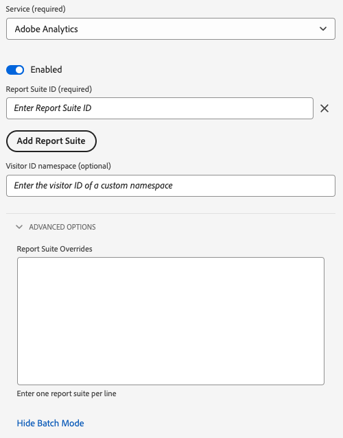

| 設定 | 説明 |
| --- | --- |
| [!UICONTROL Report Suite ID] | **（必須）**&#x200B;データの送信先の Analytics レポートスイートの ID。このIDは、Adobe Analytics UIの[!UICONTROL Admin] > [!UICONTROL ReportSuites]にあります。 複数のレポートスイートが指定された場合、データは各レポートスイートにコピーされます。 |
| [!UICONTROL Visitor ID namespace] | （オプション）Adobe Analytics [visitorID](https://experienceleague.adobe.com/docs/analytics/implementation/vars/config-vars/visitorid.html?lang=ja)に使用する名前空間。 この名前空間に指定された値を持つイベントを送信すると、Analyticsで`visitorID`として自動的に使用されます。   フィールドが入力されると、データストリームは`visitorID`値をAdobe Analyticsに送信します。 訪問者IDが`identityMap`に含まれているかどうかに関係なく、`ECID`は引き続き生成され、送信リクエストに含まれます。 Analyticsでは、複数のIDを含めることができます。 IDは、このページに記載されている順序で評価されます。[Adobe Analyticsのオペレーションの識別順序](https://experienceleague.adobe.com/en/docs/analytics/implementation/id/overview#adobe-analytics-identification-order-of-operations)。 |
| [!UICONTROL Report Suite Overrides] | このセクションでは、デフォルトのレポートスイート ID を上書きするために使用できるレポートスイート ID を追加できます。 |

詳しくは、Analytics実装ガイドの「[Edge Networkを使用したAdobe Analyticsの実装](https://experienceleague.adobe.com/en/docs/analytics/implementation/aep-edge/overview)」を参照してください。

### Adobe Audience Manager 設定 {#audience-manager}

このサービスは、Adobe Audience Manager にデータを送信するかどうかと、どのように送信するかを制御します。Audience Manager にデータを送信するために必要なのは、このセクションを有効にすることだけです。その他の設定は、オプションですが推奨されます。

| 設定 | 説明 |
| --- | --- |
| [!UICONTROL Cookie Destinations Enabled] | SDK で、[!DNL Audience Manager] から [Cookie 宛先](https://experienceleague.adobe.com/docs/audience-manager/user-guide/features/destinations/custom-destinations/create-cookie-destination.html?lang=ja)経由でセグメント情報を共有できるようにします。 |
| [!UICONTROL URL Destinations Enabled] | SDK で、[!DNL Audience Manager] から [URL 宛先](https://experienceleague.adobe.com/docs/audience-manager/user-guide/features/destinations/custom-destinations/create-url-destination.html?lang=ja)経由でセグメント情報を共有できるようにします。 |

### Adobe Experience Platform 設定 {#aep}

>[!IMPORTANT]
>
>Experience Platformのデータストリームを有効にする場合は、UIの上部リボンに表示されている、現在使用しているExperience Platform サンドボックスに注意してください。
>
>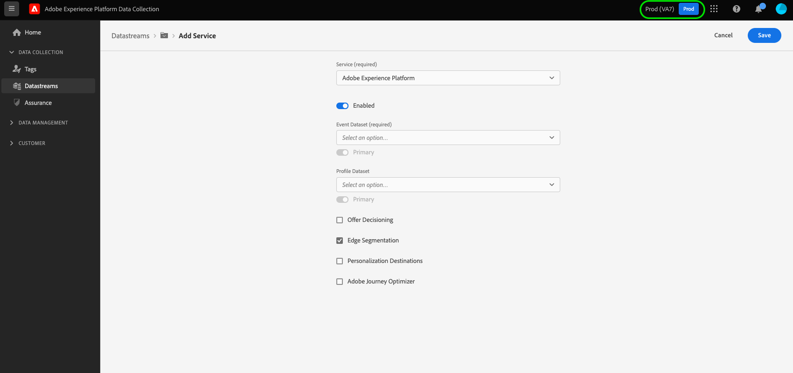
>
>サンドボックスは、Adobe Experience Platform の仮想パーティションで、組織内の他のユーザーからデータおよび実装を分離できます。一旦データストリームが作成されると、そのサンドボックスは変更できません。Experience Platform のサンドボックスの役割について詳しくは、[サンドボックスのドキュメント](../sandboxes/home.md)を参照してください。

このサービスは、Adobe Experience Platform にデータを送信するかどうかと、どのように送信するかを制御します。

| 設定 | 説明 |
|---| --- |
| [!UICONTROL Event Dataset] | **（必須）**&#x200B;顧客イベントデータのストリーミング先となるExperience Platform データセットを選択します。 このスキーマは、[XDM ExperienceEvent クラス](../xdm/classes/experienceevent.md)を使用する必要があります。データセットを追加するには、**[!UICONTROL Add Event Dataset]**&#x200B;を選択します。 |
| [!UICONTROL Profile Dataset] | **同意**、**プッシュトークン**、**ユーザーアクティビティ領域**&#x200B;のお客様属性の送信に使用するExperience Platform データセットを選択します。 このスキーマは、[XDM Individual Profile クラス](../xdm/classes/individual-profile.md)を使用する必要があります。 |
| [!UICONTROL Offer Decisioning] | Web SDK実装の[Offer Decisioning](https://experienceleague.adobe.com/docs/journey-optimizer/using/offer-decisioning/get-started-decision/starting-offer-decisioning.html?lang=ja)を有効にします。 |
| [!UICONTROL Edge Segmentation] | このデータストリームの[&#x200B; エッジセグメント化](../segmentation/methods/edge-segmentation.md)を有効にします。 Web SDKまたは[Edge Network API](https://developer.adobe.com/data-collection-apis/docs/api/)がエッジセグメント化が有効になっているデータストリームを介してデータを送信すると、該当するプロファイルの更新されたオーディエンスメンバーシップが応答で返されます。  このオプションを&#x200B;**Personalization Destinations**&#x200B;と組み合わせて、[edge destinations](../destinations/ui/activate-edge-personalization-destinations.md)、[Offer Decisioning](https://experienceleague.adobe.com/ja/docs/journey-optimizer/using/decisioning/offer-decisioning/get-started-decision/starting-offer-decisioning)、[Adobe Target](https://experienceleague.adobe.com/en/docs/target)または[Adobe Journey Optimizer](https://experienceleague.adobe.com/ja/docs/journey-optimizer/using/ajo-home)を通じて、同ページと次ページのパーソナライゼーションのユースケースに使用できます |
| [!UICONTROL Personalization Destinations] | このデータストリームに対して[&#x200B; カスタム Personalization](../destinations/catalog/personalization/custom-personalization.md)を有効にします。 Web SDKまたは[Edge Network API](https://developer.adobe.com/data-collection-apis/docs/api/)がパーソナライゼーションの宛先を有効にしたデータストリームを介してデータを送信すると、対象のプロファイルに対するオーディエンスメンバーシップとマッピングされたプロファイル属性（認証済み[Edge Network API](https://developer.adobe.com/data-collection-apis/docs/api/) リクエストのみ）が応答で返されます。 |
| [!UICONTROL Adobe Journey Optimizer] | このデータストリームに対して[Adobe Journey Optimizer](https://experienceleague.adobe.com/ja/docs/journey-optimizer/using/ajo-home)を有効にします。  このオプションを有効にすると、データストリームは、Adobe Journey Optimizerでwebおよびアプリベースのインバウンドキャンペーンからパーソナライズされたコンテンツを返すことができます。  このオプションでは、選択したデータセットが&#x200B;**[!UICONTROL Experience Event - Proposition Interactions]** [&#x200B; フィールドグループ &#x200B;](../xdm/ui/resources/schemas.md#add-field-groups)を含むスキーマを使用する必要があります。 このフィールドグループは、Adobe Journey Optimizerのキャンペーンとエクスペリエンスに対するすべてのユーザーインタラクションを記録するために使用されます。 |

### Adobe Target 設定 {#target}

このサービスは、Adobe Target にデータを送信するかどうかと、どのように送信するかを制御します。

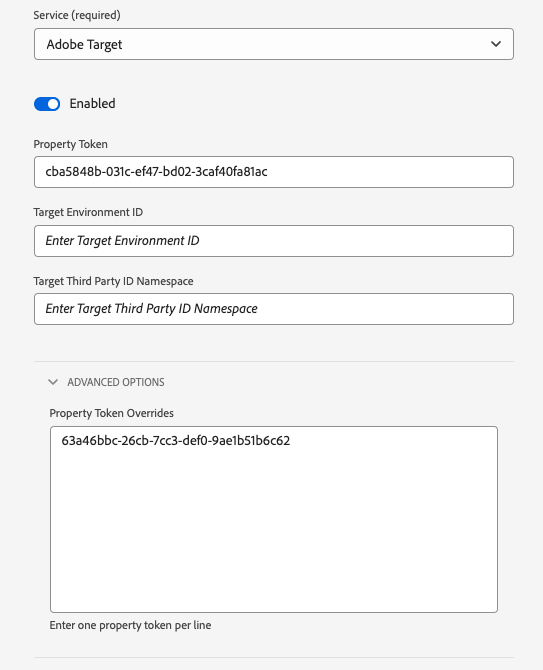

| 設定 | 説明 |
| --- | --- |
| [!UICONTROL Property Token] | [!DNL Target]では、プロパティを使用して権限を制御できます。 プロパティについて詳しくは、[!DNL Target] ドキュメントの[エンタープライズ権限の設定](https://experienceleague.adobe.com/docs/target/using/administer/manage-users/enterprise/properties-overview.html?lang=ja)に関するガイドを参照してください。   プロパティトークンは、[!UICONTROL Setup] > [!UICONTROL Properties]の下のAdobe Target UIにあります。 |
| [!UICONTROL Target Environment ID] | [Adobe Target の環境](https://experienceleague.adobe.com/docs/target/using/administer/hosts.html?lang=ja)を使用すると、開発のすべてのステージを通じて実装を管理できます。この設定は、このデータストリームで使用しようとしている環境を指定します。  ベストプラクティスは、`dev`、`stage`、`prod` の各データストリーム環境ごとに異なる設定を行って、物事をシンプルに保つことです。ただし、既に Adobe Target 環境を定義している場合は、それを使用できます。 |
| [!UICONTROL Target Third Party ID namespace] | このデータストリームに使用する `mbox3rdPartyId` の ID 名前空間。[!DNL Customer Attributes]とAdobe Targetの統合を使用するか、`thirdPartyId`を使用して[Adobe Target Profiles API](https://experienceleague.adobe.com/en/docs/target-dev/developer/api/profile-apis/profiles-api)を介してプロファイルを更新または作成する場合は、任意の名前空間値を指定する必要があります。 顧客属性ファイルのアップロードまたはプロファイル更新API呼び出しで使用される`IdentityMap`または`customerID`を送信するには、XDM スキーマの`thirdPartyId` セクションでこの名前空間を使用する必要があります。 |
| [!UICONTROL Property Token Overrides] | この節では、デフォルトのプロパティトークンを上書きするために使用できる追加のプロパティトークンを定義できます。 |

### [!UICONTROL Event Forwarding]設定

このサービスは、[イベント転送](../tags/ui/event-forwarding/overview.md)にデータを送信するかどうかと、どのように送信するかを制御します。

データストリーム設定画面の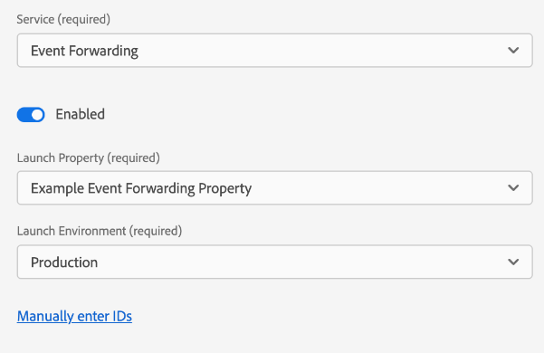

| 設定 | 説明 |
| --- | --- |
| [!UICONTROL Launch Property] | **（必須）**&#x200B;データの送信先のイベント転送プロパティ。 |
| [!UICONTROL Launch Environment] | **（必須）**&#x200B;データの送信先の選択されたプロパティ内の環境。 |

>[!NOTE]
>
>ドロップダウンメニューを使用する代わりに、プロパティ名と環境名を入力するには、**[!UICONTROL Manually enter IDs]**&#x200B;を選択します。

## データストリームのコピー {#copy}

既存のデータストリームのコピーを作成し、必要に応じて、その詳細を変更できます。

>[!NOTE]
>
>データストリームは、同じ[サンドボックス](../sandboxes/home.md)内でのみコピーできます。つまり、あるサンドボックスから別のサンドボックスにデータストリームをコピーすることはできません。

[!UICONTROL Datastreams] ワークスペースのメインページから、省略記号（**....を選択します**）を選択してから、**[!UICONTROL Copy]**&#x200B;を選択します。

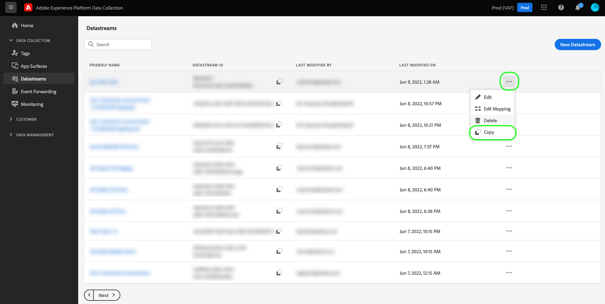

または、特定のデータストリームの詳細ビューから&#x200B;**[!UICONTROL Copy Datastream]**&#x200B;を選択することもできます。

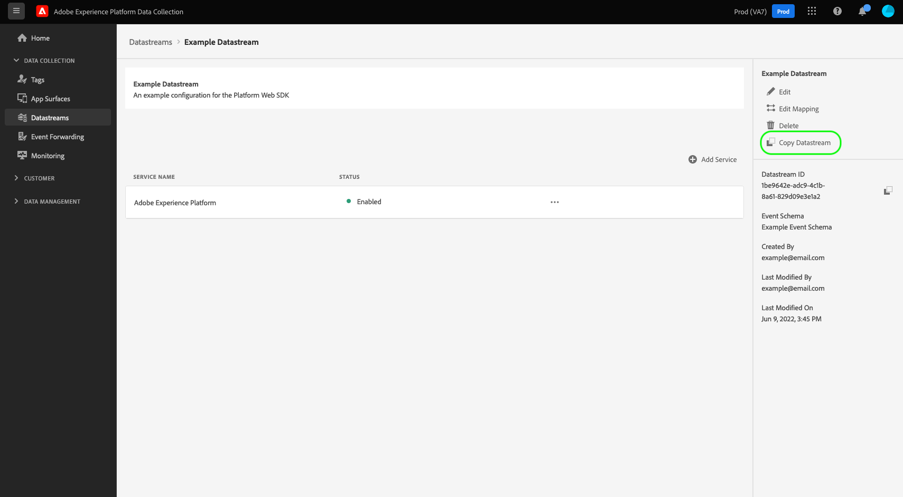

作成する新しいデータストリームの一意の名前を指定するよう促す確認ダイアログが表示され、上書きされる設定オプションに関する詳細が表示されます。準備ができたら、**[!UICONTROL Copy]**&#x200B;を選択します。

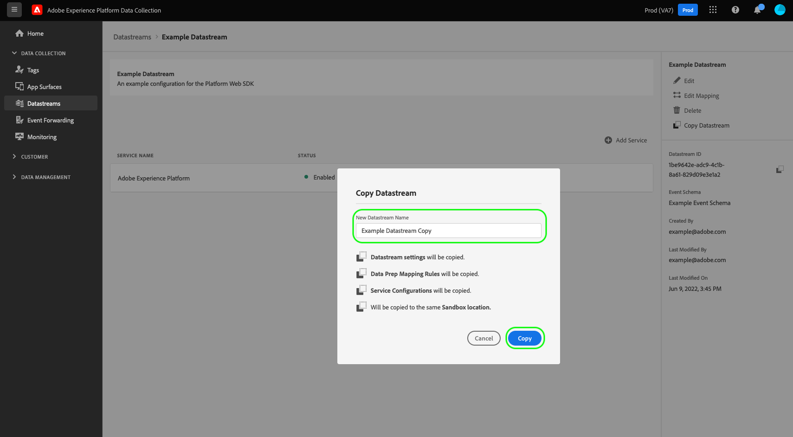

[!UICONTROL Datastreams] ワークスペースのメインページが再び表示され、新しいデータストリームが一覧表示されます。

## 次の手順

このガイドでは、データ収集 UI でのデータストリームの管理方法について説明しました。データストリームを設定した後にWeb SDKをインストールして設定する方法について詳しくは、[Web SDK タグ拡張機能の概要](../tags/extensions/client/web-sdk/getting-started.md)を参照してください。
