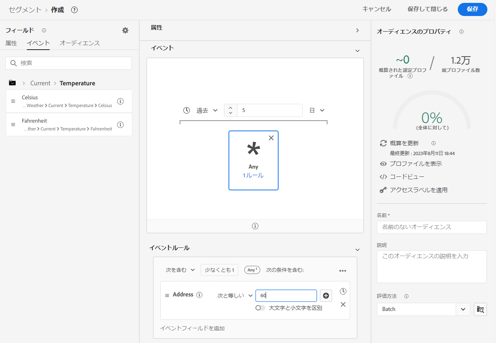
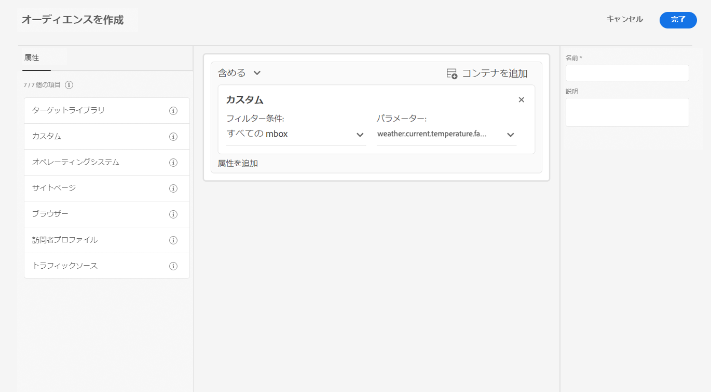

# からの気象データを使用してデータ収集を強化する [!DNL The Weather Channel]

アドビは [!DNL [The Weather Company]](https://www.ibm.com/weather) と提携し、データストリームを通じて収集されたデータに、米国の気象に関するコンテキストを追加しました。このデータは、分析、ターゲティングおよびExperience Platformでのオーディエンス作成に使用できます。

次の 3 種類のデータを使用できます。 [!DNL The Weather Channel]:

* **[!UICONTROL 現在の天候]**：ユーザーの所在地に基づく、ユーザーの現在の気象状況。これには、現在の温度、降水、雲の範囲などが含まれます。
* **[!UICONTROL 予測天気]**：予測には、ユーザーの所在地の 1 日、2 日、3 日、5 日、7 日および 10 日の予測が含まれます。
* **[!UICONTROL トリガー]**：トリガーとは、違った意味での気象条件に対応する、特定の組み合わせのことです。天候トリガーは 3 種類あります。

   * **[!UICONTROL 天候トリガー]**：寒い日や雨の日など、天候として意味のある条件。これらの定義は、気候によって異なる場合があります。
   * **[!UICONTROL 製品トリガー]**：様々な種類の製品の購入につながる条件。例えば、寒気予報は、雨のコートの購入の可能性が高いことを意味する可能性があります。
   * **[!UICONTROL 荒天トリガー]**：荒天の警告（冬の嵐や台風の警告など）。

## 前提条件 {#prerequisites}

気象データを使用する前に、次の前提条件を満たしていることを確認してください。

* 使用する天気データのライセンスを取得する必要があります [!DNL The Weather Channel]. その後、アカウントで有効にします。
* 気象データは、データストリームを通じてのみ使用できます。天気データを使用するには、 [!DNL Web SDK], [!DNL Mobile Edge Extension] または [サーバー API](../../server-api/overview.md) を追加してこのデータを含めます。
* データストリームは、[[!UICONTROL 位置情報]](../configure.md#advanced-options)を有効にしておく必要があります。
* 次を追加： [気象場群](#schema-configuration) を使用しているスキーマに追加します。

## プロビジョニング {#provisioning}

[!DNL The Weather Channel] からデータのライセンスを取得すると、ご利用のアカウントでデータにアクセスできるようになります。次に、データストリームでデータを有効にするには、Adobe カスタマーケアに問い合わせる必要があります。有効になると、データが自動的に追加されます。

追加されたことを検証するには、デバッガーでエッジトレースを実行するか、Assurance を使用して [!DNL Edge Network] を介してヒットをトレースします。

### スキーマ設定 {#schema-configuration}

データストリームで使用するイベントデータセットに対応する気象フィールドグループを Experience Platform スキーマに追加する必要があります。次の 5 つのフィールドグループを使用できます。

* [!UICONTROL 予測された天気]
* [!UICONTROL 現在の天気]
* [!UICONTROL 製品トリガー]
* [!UICONTROL 相対トリガー]
* [!UICONTROL 荒天トリガー]

## 気象データへのアクセス {#access-weather-data}

データのライセンスが取得され、使用可能になると、Adobe サービス全体で様々な方法でデータにアクセスできます。

### Adobe Analytics {#analytics}

[!DNL Adobe Analytics] では、[!DNL XDM] スキーマの残りの部分と一緒に、処理ルールによって気象データをマッピングできます。

マッピングできるフィールドのリストについては、「[気象リファレンス](weather-reference.md)」のページを参照してください。すべての [!DNL XDM] スキーマと同様、キーには `a.x` というプレフィックスが付けられます。例えば、`weather.current.temperature.farenheit` という名前のフィールドは、[!DNL Analytics] では `a.x.weather.current.temperature.farenheit` として表示されます。

### Adobe Customer Journey Analytics {#cja}

[!DNL Adobe Customer Journey Analytics] では、データストリームで指定されたデータセットで気象データを利用できます。天気属性が [をスキーマに追加しました](#prerequisites-prerequisites)を使用する場合、 [データビューに追加](https://experienceleague.adobe.com/docs/analytics-platform/using/cja-dataviews/create-dataview.html?lang=ja) in [!DNL Customer Journey Analytics].

### Real-Time Customer Data Platform {#rtcdp}

天気データは [Real-time Customer Data Platform](../../rtcdp/overview.md)：オーディエンスで使用します。 気象データはイベントに関連付けられます。

天候の状況は頻繁に変化するので、Adobeでは、上の例に示すように、オーディエンスに対して時間制限を設定することをお勧めします。 ここ 1 ～ 2 日の気温が低くなることは、6 か月前に気温が低いことよりもはるかに影響が大きくなります。

利用可能なフィールドについては、[気象リファレンス](weather-reference.md)を参照してください。

### Adobe Target {#target}

[!DNL Adobe Target] では、気象データを使用してリアルタイムでパーソナライゼーションを推進できます。気象データは [!UICONTROL mBox] パラメーターとして [!DNL Target] に渡され、カスタムの [!UICONTROL mBox] パラメーターを介してアクセスできます。

パラメーターは、特定のフィールドへの [!DNL XDM] パスです。利用可能なフィールドとそれらに対応するパスについては、[気象リファレンス](weather-reference.md)を参照してください。

## 次の手順 {#next-steps}

このドキュメントを読み、アドビの様々なソリューションで気象データを使用する方法について理解できたでしょう。気象データのフィールドマッピングについて詳しくは、[フィールドマッピングリファレンス](weather-reference.md)を参照してください。
