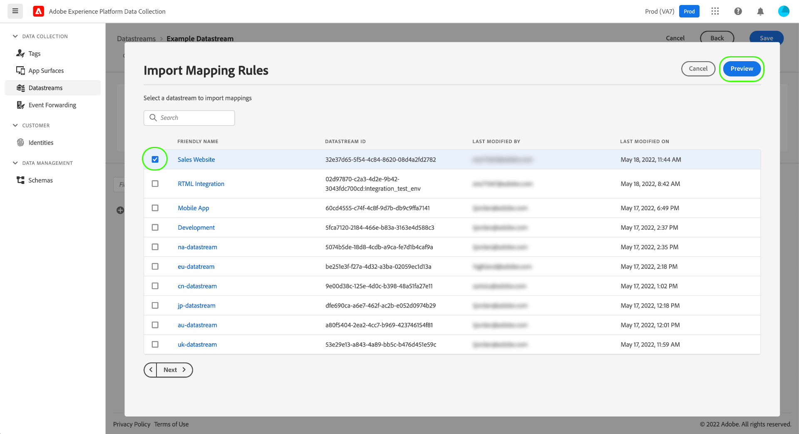
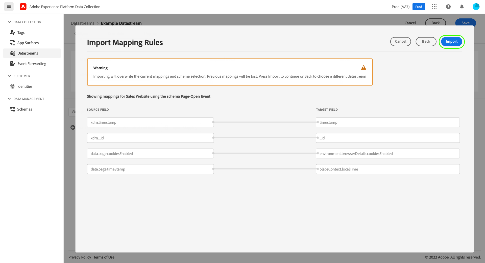

# データ収集のためのデータ準備

データ準備は、[エクスペリエンスデータモデル（XDM）](../xdm/home.md)との間でデータのマッピング、変換、検証を可能にする、Adobe Experience Platform サービスです。Platform 対応の[データストリーム](./overview.md)を設定する場合、データ準備機能を使用して、Platform Edge Network に送信する際にソースデータを XDM にマッピングできます。

Web ページから送信されるすべてのデータは、XDM としてExperience Platformにランディングする必要があります。 ページ上のデータレイヤーのデータを、Experience Platformが受け入れる XDM に変換する方法は 3 つあります。

1. Web ページ自体のデータレイヤーを XDM に再フォーマットします。
2. Web ページの既存のデータレイヤー形式を XDM に書式変更するには、タグネイティブデータ要素機能を使用します。
3. Data Prep for Data Collection を使用して、Edge ネットワークを介して Web ページの既存のデータレイヤー形式を XDM に再フォーマットします。

このガイドでは、3 番目のオプションに焦点を当てています。

## Data Prep for Data Collection を使用するタイミング {#when-to-use-data-prep}

Data Prep for Data Collection が役立つ使用例は 2 つあります。

1. Web サイトのデータレイヤーは整形式で管理され、維持されます。JavaScript 操作を使用して（タグのデータ要素を介してまたは手動の JavaScript 操作を介して）ページ上の XDM に変換するのではなく、Edge Network に直接送信する方が望ましいです。
2. サイトには、タグ以外のタグ付けシステムが導入されます。

## WebSDK を使用して、既存のデータレイヤーを Edge ネットワークに送信する {#send-datalayer-via-websdk}

既存のデータレイヤーは、 `data` オプション `sendEvent` コマンドを使用します。 [Web SDK ドキュメント](https://experienceleague.adobe.com/docs/experience-platform/edge/fundamentals/tracking-events.html#sending-non-xdm-data).

タグを使用する場合は、 **[!UICONTROL データ]** フィールドの **[!UICONTROL イベントの送信]** アクションタイプ (「 [Web SDK タグ拡張機能ドキュメント](https://experienceleague.adobe.com/docs/experience-platform/tags/extensions/client/web-sdk/action-types.html).

このガイドの残りの部分では、WebSDK からデータレイヤーが送信された後に、データレイヤーを XDM 標準にマッピングする方法に焦点を当てます。

>[!NOTE]
>
>計算フィールドの変換機能を含む、すべてのデータ準備機能に関する包括的なガイダンスについては、次のドキュメントを参照してください。
>
>* [データ準備の概要](../data-prep/home.md)
>* [データ準備のマッピング機能](../data-prep/functions.md)
>* [Data Prep でのデータ形式の取り扱い](../data-prep/data-handling.md)

このガイドでは、UI 内のデータのマッピング方法を説明します。手順に従って、データストリームの作成から[基本設定手順](./overview.md#create)までのプロセスを開始します。

データ収集のためのデータ準備プロセスの簡単なデモについては、次のビデオを参照してください。

>[!VIDEO](https://video.tv.adobe.com/v/342120?quality=12&enable10seconds=on&speedcontrol=on)

## [!UICONTROL データの選択] {#select-data}

データストリームの基本設定が完了してから「**[!UICONTROL 保存してマッピングを追加]**」を選択すると、**[!UICONTROL データを選択]**&#x200B;手順が表示されます。ここから、Platform に送信する予定のデータの構造を表す、サンプル JSON オブジェクトを指定する必要があります。

データレイヤーから直接プロパティを取得するには、JSON オブジェクが単一のルートプロパティ `data` を持つ必要があります。のサブプロパティ `data` オブジェクトは、取り込むデータレイヤーのプロパティにマッピングする方法で構築する必要があります。 次のセクションを選択すると、`data` ルートを持つ適切にフォーマットされた JSON オブジェクトの例が表示されます。

+++ `data` ルートを持つサンプル JSON ファイル

```json
{
  "data": {
    "eventMergeId": "cce1b53c-571f-4f36-b3c1-153d85be6602",
    "eventType": "view:load",
    "timestamp": "2021-09-30T14:50:09.604Z",
    "web": {
      "webPageDetails": {
        "siteSection": "Product section",
        "server": "example.com",
        "name": "product home",
        "URL": "https://www.example.com"
      },
      "webReferrer": {
        "URL": "https://www.adobe.com/index2.html",
        "type": "external"
      }
    },
    "commerce": {
      "purchase": 1,
      "order": {
        "orderID": "1234"
      }
    },
    "product": [
      {
        "productInfo": {
          "productID": "123"
        }
      },
      {
        "productInfo": {
          "productID": "1234"
        }
      }
    ],
    "reservation": {
      "id": "anc45123xlm",
      "name": "Embassy Suits",
      "SKU": "12345-L",
      "skuVariant": "12345-LG-R",
      "priceTotal": "112.99",
      "currencyCode": "USD",
      "adults": 2,
      "children": 3,
      "productAddMethod": "PDP",
      "_namespace": {
        "test": 1,
        "priceTotal": "112.99",
        "category": "Overnight Stay"
      },
      "freeCancellation": false,
      "cancellationFee": 20,
      "refundable": true
    }
  }
}
```

+++

XDM オブジェクトデータ要素からプロパティを取得するには、同じルールを JSON オブジェクトに適用しますが、ルートプロパティは、変わりに `xdm` としてキーにする必要があります。次のセクションを選択すると、`xdm` ルートを持つ適切にフォーマットされた JSON オブジェクトの例が表示されます。

+++ `xdm` ルートを持つサンプル JSON ファイル

```json
{
  "xdm": {
    "environment": {
      "type": "browser",
      "browserDetails": {
        "userAgent": "Mozilla/5.0 (Macintosh; Intel Mac OS X 10_7_5) AppleWebkit/537.36 (KHTML, like Gecko) Chrome/49.0.2623.112 Safari/537.36",
        "javaScriptEnabled": true,
        "javaScriptVersion": "1.8.5",
        "cookiesEnabled": true,
        "viewportHeight": 900,
        "viewportWidth": 1680,
        "javaEnabled": true
      },
      "domain": "adobe.com",
      "colorDepth": 24,
      "viewportHeight": 1050,
      "viewportWidth": 1680
    },
    "device": {
      "screenHeight": 1050,
      "screenWidth": 1680
    }
  }
}
```

+++

オブジェクトをファイルとしてアップロードするオプションを選択するか、提供されたテキストボックスに生のオブジェクトを代わりに貼り付けることができます。JSON が有効な場合、右側のパネルにプレビュースキーマが表示されます。「**[!UICONTROL 次へ]**」をクリックして続行します。


>[!NOTE]
>
> 任意のページで使用できるすべてのデータレイヤー要素を表すサンプル JSON オブジェクトを使用します。 例えば、一部のページで買い物かごのデータレイヤー要素が使用されているわけではありません。 ただし、買い物かごのデータレイヤー要素は、このサンプル JSON オブジェクトに含める必要があります。

## [!UICONTROL マッピング]

**[!UICONTROL マッピング]**&#x200B;手順が表示され、ソースデータフィールドを Platform のターゲットイベントスキーマのフィールドにマッピングできます。ここから、2 つの方法でマッピングを設定できます。

* [マッピングルールの作成](#create-mapping) 手動プロセスを通じて、このデータストリームに対して。
* 既存のデータストリームから[マッピングルールを読み込みます](#import-mapping)。

### マッピングルールの作成 {#create-mapping}

マッピング・ルールを作成するには、「 **[!UICONTROL 新しいマッピングを追加]**.


ソースアイコン（）を選択して、表示されるダイアログで、提供されたキャンバスにマッピングするソースフィールドを選択します。フィールドを選択したら、「**[!UICONTROL 選択]**」ボタンを使用して続行します。


次に、スキーマアイコン（）を選択して、ターゲットイベントスキーマ用の同様のダイアログを開きます。データをマッピングするフィールドを選択してから、「**[!UICONTROL 選択]**」で確定します。


マッピングページが再表示され、完成したフィールドマッピングが表示されます。「**[!UICONTROL マッピングの進行状況]**」セクションが更新され、正常にマッピングされたフィールドの合計数が反映されます。


>[!TIP]
>
>オブジェクトの配列（ソースフィールド）を異なるオブジェクトの配列（ターゲットフィールド）にマッピングする場合は、次に示すように、ソースフィールドとターゲットフィールドのパスの配列名の後に `[*]` を追加します。
>
>

### 既存のマッピングルールを読み込む {#import-mapping}

以前にデータストリームを作成した場合は、設定済みのマッピング・ルールを新しいデータストリームに再利用できます。

>[!WARNING]
>
>別のデータストリームからマッピングルールをインポートすると、インポート前に追加したフィールドマッピングが上書きされます。

開始するには、「**[!UICONTROL マッピングをインポート]**」を選択します。

![「[!UICONTROL マッピングをインポート]」ボタンが選択されていることを示す画像](assets/data-prep/import-mapping-button.png)

表示されるダイアログで、マッピングルールを読み込むデータストリームを選択します。データストリームを選択したら、「**[!UICONTROL プレビュー]**」を選択します。



>[!NOTE]
>
>データストリームは、同じ[サンドボックス](../sandboxes/home.md)内でのみ読み込むことができます。つまり、あるサンドボックスから別のサンドボックスにデータストリームを読み込むことはできません。

次の画面に、選択したデータストリームの保存されたマッピングルールのプレビューを示します。表示されたマッピングが期待どおりのものであることを確認してから、「**[!UICONTROL インポート]**」を選択して確定すると、新しいデータストリームにマッピングが追加されます。



>[!NOTE]
>
>読み込まれたマッピングルールのソースフィールドが、[以前に提供した](#select-data)サンプル JSON データに含まれていない場合、それらのフィールドのマッピングは読み込みに含まれません。

### マッピングの完了

前述の手順を続行して、残りのフィールドをターゲットスキーマにマッピングします。使用可能なすべてのソースフィールドをマッピングする必要はありませんが、この手順を完了するには、必要に応じて設定されたターゲットスキーマ内のフィールドをマッピングする必要があります。 **[!UICONTROL 必須フィールド]**&#x200B;カウンターは、現在の設定でまだマッピングされていない必須フィールドの数を示します。

必須フィールドの数が 0 に達し、マッピングに満足したら、「 」を選択します。 **[!UICONTROL 保存]** 変更を確定します。


## 次の手順

このガイドでは、UI でデータストリームを設定する際の、データの XDM へのマッピング方法について説明しました。一般的なデータストリームのチュートリアルを行っていた場合は、[データストリームの詳細の表示](./overview.md)に関する手順に戻ることができます。
