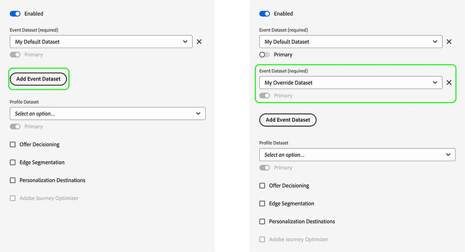
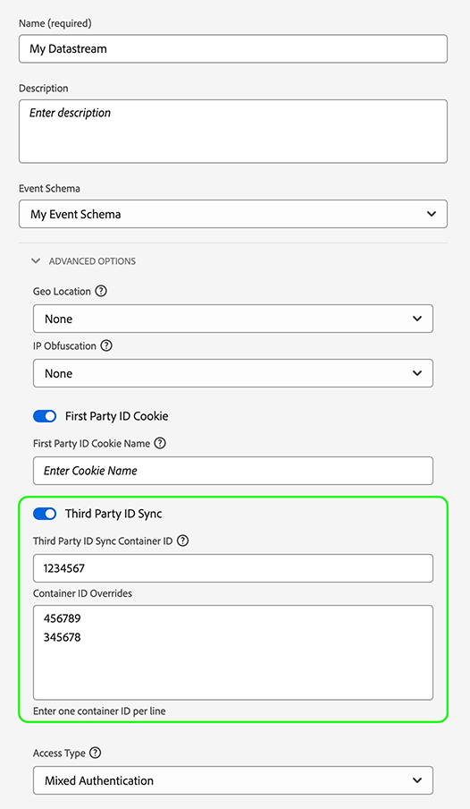

# データストリームの上書きの設定

データストリームのオーバーライドを使用して、データストリームの追加の設定を定義します。この設定は、Web SDKまたはモバイル SDKを介して[!DNL Edge Network]に渡されます。

新しいデータストリームを作成したり、既存のトリガーを変更したりすることなく、異なるデータストリームビヘイビアーを設定できます。

データストリーム設定の上書きは、次の2つの手順で行います。

1. まず、[ データストリーム設定ページ ](/help/datastreams/configure.md)でデータストリーム設定の上書きを定義する必要があります。
2. 次に、次のいずれかの方法で上書きを[!DNL Edge Network]に送信する必要があります。
   * `sendEvent`または`configure` [Web SDK](#send-overrides) コマンドを使用します。
   * Web SDK [ タグ拡張機能](/help/tags/extensions/client/web-sdk/configure/configuration-overrides.md)を使用します。
   * モバイル SDK [sendEvent](#send-overrides) APIを使用するか、[ ルール ](#send-overrides)を使用します。

この記事では、サポートされているすべてのタイプの上書きに対するエンドツーエンドのデータストリーム設定の上書きプロセスについて説明します。

>[!IMPORTANT]
>
>[!DNL Edge Network] API統合は現在、データストリームの上書きをサポートしていません。
>
>異なるデータストリームに異なるデータを送信する必要がある場合は、データストリームの上書きを使用する必要があります。 パーソナライゼーションのユースケースや同意データにデータストリームの上書きを使用しないでください。

## ユースケース {#use-cases}

次のユースケースは、データストリームの上書きを使用する方法とタイミングを示しています。

### 複数地域でのデータ収集 {#multi-region}

会社は、事業を展開する国ごとに異なる web サイトまたはサブドメインを持っています。 対応する分析固有のレポートスイート、国固有の[!DNL Adobe Target] プロパティトークン、国固有のスキーマ、データセット、[!DNL Journey Optimizer]設定などを含む[設定された](/help/datastreams/configure.md)個の個別のデータストリームがあります。 また、会社は、国別のすべてのデータを集計するグローバルな設定も用意されています。

データストリームの上書きを使用すると、会社は、1 つのデータストリームにデータを送信するデフォルトの動作ではなく、異なるデータストリームにデータのフローを動的に切り替えることができます。

一般的なユースケースとしては、顧客が注文やユーザープロファイルの更新などの重要なアクションを実行する際に、国別データストリームやグローバルデータストリームにデータを送信することが挙げられます。

### それぞれの事業部門のプロファイルとIDの差別化 {#multiple-business-units}

複数の事業部門を持つ企業は、複数のExperience Platformサンドボックスを利用して、各事業部門に固有のデータを保存したいと考えています。

会社は、デフォルトのデータストリームにデータを送信する代わりに、データストリームの上書きを使用して、各ビジネスユニットがデータを受け取るデータストリームを独自に持つようにすることができます。

## データストリーム UI でのデータストリームの上書きの設定 {#configure-overrides}

データストリーム設定の上書きにより、次のデータストリーム設定を変更できます。

* Experience Platform イベントデータセット
* [!DNL Adobe Target] プロパティトークン
* Audience Manager ID 同期コンテナ
* [!DNL Adobe Analytics]件のレポートスイート

### Adobe Target のデータストリームの上書き {#target-overrides}

[!DNL Adobe Target] データストリームのデータストリームの上書きを設定するには、まず[!DNL Adobe Target] データストリームを作成する必要があります。 手順に従って、[Adobe Target](/help/datastreams/configure.md#target) サービスで[データストリームを設定](/help/datastreams/configure.md)します。

データストリームを作成したら、追加した[Adobe Target](/help/datastreams/configure.md#target) サービスを編集し、**[!UICONTROL Property Token Overrides]** セクションを使用して、目的のデータストリームの上書きを追加します。 1 行につき 1 つのプロパティトークンを追加します。


目的のオーバーライドを追加したら、データストリーム設定を保存します。

[!DNL Adobe Target] データストリームの上書きが設定されました。 Web SDKまたはモバイル SDK](#send-overrides)経由で [!DNL Edge Network] に上書きを送信できるようになりました。[

### Adobe Analytics のデータストリームの上書き {#analytics-overrides}

[!DNL Adobe Analytics] データストリームのデータストリームの上書きを設定するには、まず[Adobe Analytics](/help/datastreams/configure.md#analytics) データストリームを作成する必要があります。 手順に従って、[Adobe Analytics](/help/datastreams/configure.md#analytics) サービスで[データストリームを設定](/help/datastreams/configure.md)します。

データストリームを作成したら、追加した[Adobe Analytics](/help/datastreams/configure.md#analytics) サービスを編集し、**[!UICONTROL Report Suite Overrides]** セクションを使用して、目的のデータストリームの上書きを追加します。

レポートスイートの上書きのバッチ編集を有効にするには、**[!UICONTROL Show Batch Mode]**&#x200B;を選択します。 1 行に 1 つのレポートスイートを入力して、レポートスイートの上書きのリストをコピー＆ペーストできます。


目的のオーバーライドを追加したら、データストリーム設定を保存します。

[!DNL Adobe Analytics] データストリームの上書きが設定されました。 Web SDKまたはモバイル SDK](#send-overrides)経由で [!DNL Edge Network] に上書きを送信できるようになりました。[

### Experience Platform イベントデータセットのデータストリームの上書き {#event-dataset-overrides}

Experience Platform イベントデータセットのデータストリームの上書きを設定するには、まず [Adobe Experience Platform](/help/datastreams/configure.md#aep) データストリームを作成する必要があります。 手順に従って、[Adobe Experience Platform](/help/datastreams/configure.md#aep) サービスで[データストリームを設定](/help/datastreams/configure.md)します。

データストリームを作成したら、追加した[Adobe Experience Platform](/help/datastreams/configure.md#aep) サービスを編集し、**[!UICONTROL Add Event Dataset]** オプションを選択して、1つ以上のオーバーライドイベントデータセットを追加します。



目的のオーバーライドを追加したら、データストリーム設定を保存します。

[!DNL Adobe Experience Platform] データストリームの上書きが設定されました。 Web SDKまたはモバイル SDK](#send-overrides)経由で [!DNL Edge Network] に上書きを送信できるようになりました。[

### サードパーティ ID 同期コンテナのデータストリームの上書き {#container-overrides}

サードパーティの ID 同期コンテナに対してデータストリームの上書きを設定するには、まずデータストリームを作成する必要があります。 手順に従って、[データストリームを設定](/help/datastreams/configure.md)して作成します。

データストリームを作成したら、**[!UICONTROL Advanced Options]**&#x200B;に移動し、**[!UICONTROL Third Party ID Sync]** オプションを有効にします。

次に、**[!UICONTROL Container ID Overrides]** セクションを使用して、デフォルト設定を上書きするコンテナ IDを追加します。

>[!IMPORTANT]
>
>コンテナ ID は、`"1234567"` などの文字列ではなく、`1234567` のような数値である必要があります。 Web SDK を介してコンテナ ID の上書きとして文字列値を送信した場合、エラーが表示されます。



目的のオーバーライドを追加したら、データストリーム設定を保存します。

ID同期コンテナの上書きが設定されました。 Web SDKまたはモバイル SDK](#send-overrides)経由で [!DNL Edge Network] に上書きを送信できるようになりました。[

## Edge Networkにオーバーライドを送信する {#send-overrides}

データ収集UIでデータストリームの上書きを設定した後、Web SDKまたはモバイル SDKを介して[!DNL Edge Network]に上書きを送信できます。

* **Web SDK**: JavaScript ライブラリのコード例については、[ データストリーム設定の上書き](/help/collection/js/commands/configure/edgeconfigoverrides.md)を参照してください。
* **モバイル SDK**: [sendEvent API](https://developer.adobe.com/client-sdks/edge/edge-network/tutorials/send-overrides-sendevent/)を使用するか、[ ルール ](https://developer.adobe.com/client-sdks/edge/edge-network/tutorials/send-overrides-rules/)を使用して、データストリーム IDの上書きを送信できます。

## ペイロードの例 {#payload-example}

上記の例では、次のような[!DNL Edge Network] ペイロードが生成されます。

```json
{
  "meta": {
    "configOverrides": {
      "com_adobe_experience_platform": {
        "datasets": {
          "event": {
            "datasetId": "SampleProfileDatasetIdOverride"
          }
        }
      },
      "com_adobe_analytics": {
        "reportSuites": [
        "MyFirstOverrideReportSuite",
        "MySecondOverrideReportSuite",
        "MyThirdOverrideReportSuite"
        ]
      },
      "com_adobe_identity": {
        "idSyncContainerId": "1234567"
      },
      "com_adobe_target": {
        "propertyToken": "63a46bbc-26cb-7cc3-def0-9ae1b51b6c62"
      }
    },
    "state": {  }
  },
  "events": [  ]
}
```
