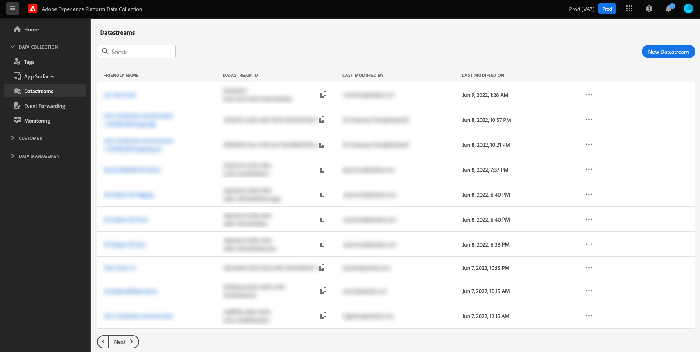

# データストリームの概要

データストリームは、[!DNL Adobe Experience Platform] Web SDKおよびMobile SDKのサーバーサイド設定を表します。 SDKの[`configure`](/help/collection/js/commands/configure/overview.md) コマンドがクライアントサイド設定（`edgeDomain`など）を処理する一方で、データストリームは他のすべての設定を管理します。

[!DNL Edge Network]にリクエストを送信すると、`datastreamId`はデータが送信されるデータストリームを参照します。 web サイトのコードを変更することなく、サーバーサイド設定を更新できます。

[!DNL Adobe Experience Platform] UIまたはデータ収集UI内の左側のナビゲーションで&#x200B;**[!UICONTROL Datastreams]**&#x200B;を選択することで、データストリームを作成および管理できます。

Adobe Experience Platform UIの「データストリーム」タブの

UI でのデータストリームの設定方法について詳しくは、[設定ガイド](/help/datastreams/configure.md)を参照してください。

## データストリーム内の機密データの取り扱い {#sensitive}

>[!IMPORTANT]
>
>このドキュメントの内容は法的な助言ではなく、法的な助言に代わるものでもありません。 機密データの取り扱いに関するアドバイスについては、会社の法務部門に相談してください。

企業のデータ管理ポリシーおよび規制要件では、機密性の高い顧客データを収集、処理、使用する方法に関する制限が増えています。 これには、健康保険の相互運用性と説明責任に関する法律（HIPAA）などの規制の対象となる、保護された医療データ（PHI）の収集、処理、使用が含まれます。

データストリームは、機密データを安全に処理するための3つの方法を提供します。

* [暗号化の強化](#encryption)
* [データガバナンス](#governance)
* [監査ログ](#audit-logs)

### 暗号化の強化 {#encryption}

[!DNL Edge Network]経由で転送されるすべてのデータは、[HTTPS TLS 1.2](https://datatracker.ietf.org/doc/html/rfc5246)を使用して、暗号化された安全な接続を通じて実行されます。 データストリームがデータを Experience Platform に取り込む場合、データは、Experience Platform データレイクでの保管時に暗号化されます。 詳しくは、[Experience Platform でのデータ暗号化](/help/landing/governance-privacy-security/encryption.md)のドキュメントを参照してください。

### データガバナンス {#governance}

データストリームは、Experience Platformに組み込まれたデータガバナンス機能を使用して、機密データがHIPAA対応でないサービスに送信されるのを防ぎます。 データストリームスキーマ内の機密データを含む特定のフィールドにラベルを付けることで、どのデータフィールドを特定の目的に使用できるかなどきめ細かく制御できます。

次のビデオでは、UI のデータストリームに対するデータ使用制限の設定と適用の仕組みについて簡単に説明します。

>[!VIDEO](https://video.tv.adobe.com/v/3413104/?captions=jpn&quality=12&learn=on&speedcontrol=on)

Experience Platform で、組織で機密性が高いと見なすデータを含むスキーマおよびフィールドに[機密データ使用ラベル](/help/data-governance/labels/reference.md#sensitive)を適用できます。 例えば、`RHD` ラベルは保護対象保健情報（PHI）を表すために使用され、`S1` ラベルは位置情報データを表します。

>[!NOTE]
>
>Experience Platform UIまたはData Collection UIの[!UICONTROL Schemas] タブ内でデータ使用ラベルを適用する方法について詳しくは、[&#x200B; スキーマラベル付けチュートリアル &#x200B;](/help/xdm/tutorials/labels.md)を参照してください。

データストリームを作成する場合、選択したスキーマに機密データ使用ラベルが含まれている場合は、そのデータをHIPAA対応の宛先に送信するようにデータストリームを設定することしかできません。 現在、データストリームでサポートされているHIPAA対応の宛先は[!DNL Adobe Experience Platform]のみです。 機密データ使用ラベルを含むデータストリームでは、[!DNL Adobe Target]、[!DNL Adobe Analytics]、[!DNL Adobe Audience Manager]、イベント転送、およびエッジ宛先を含むその他の宛先サービスは無効になっています。

HIPAA 非対応のサービスを持つ既存のデータストリームでスキーマが使用されている場合、機密データ使用ラベルをスキーマに追加しようとすると、ポリシー違反メッセージが表示され、操作は阻止されます。 メッセージは、違反をトリガーしたデータストリームを指定し、問題を解決するために、データストリームからHIPAA対応でないサービスを削除することを提案します。

### 監査ログ {#audit-logs}

Experience Platform では、データストリームアクティビティを監査ログの形式でモニターできます。 監査ログには、**who**&#x200B;が&#x200B;**what** アクションを実行し、**when**&#x200B;が示されます。また、データストリームに関連する問題のトラブルシューティングに役立つ他のコンテキストデータも表示され、企業が企業のデータ管理ポリシーと規制要件に準拠するのに役立ちます。

ユーザーがデータストリームを作成、更新または削除するたびに、アクションを記録する監査ログが作成されます。 [データ収集用のデータ準備](/help/datastreams/data-prep.md)を介してユーザーがマッピングを作成、更新または削除するたびに、同じことが発生します。 データストリームであるかマッピングであるかを問わず、更新された監査ログは[!UICONTROL Datastreams] リソースタイプの下に分類されます。

データストリームやその他のサポート対象サービスからのログの解釈方法について詳しくは、[監査ログ](/help/landing/governance-privacy-security/audit-logs/overview.md)のドキュメントを参照してください。

## 次の手順 {#next-steps}

このガイドでは、データストリームとデータ収集でのデータストリームの使用および機密データの処理に関する概要を説明します。 新しいデータストリームの設定手順について詳しく、[データストリーム設定ガイド](/help/datastreams/configure.md)を参照してください。
