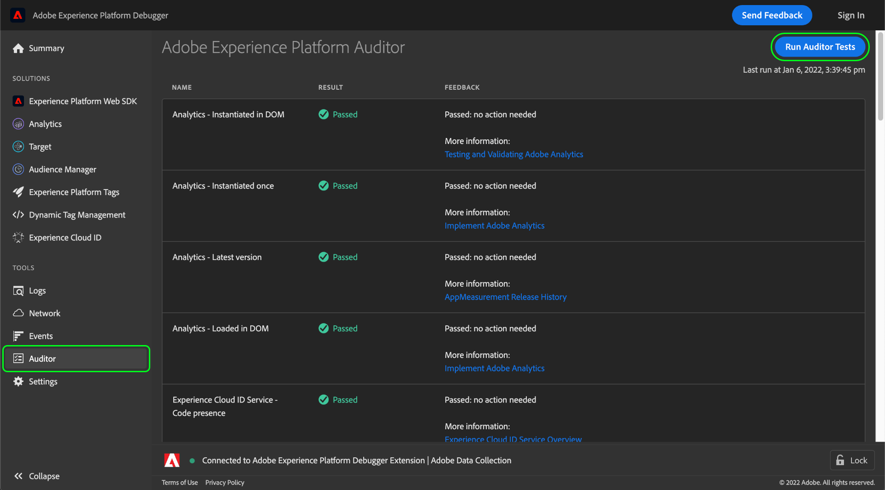

# 「Auditor」タブ

Adobe Experience Platform Debugger で、 **[!UICONTROL Auditor]** タブを使用して、ページに対して一連の監査テストを実行します。

この機能を使用するには：

1. 選択 **[!UICONTROL Auditor]** をクリックします。
1. 選択 **[!UICONTROL Auditor テストの実行]**. テストが完了すると、その結果は次のように表示されます。

結果リストには、テストとその結果が表示され、問題を解決するための提案が示されます。

## テスト結果の解釈

各テストは重み付けされ、テストスコアは割り当てられた重み付けと等しくなります。 重み付けが 5 のテストに合格すると、5 ポイントを獲得します。

| スコア | 説明 |
| --- | --- |
| 0 | 認識する必要があるが、スコアには影響しない問題を警告します。 |
| 1 | 最適化を推奨します。 データの正確性には影響しません。 |
| 2 | このテストで不合格となると、Adobe Experience Cloudの最新の機能や修正にアクセスできなくなります。 |
| 3 | 効率をテストし、実装がベストプラクティスに従っているかどうかをテストします。 |
| 4 | 失敗とは、信頼性の低いデータを収集する可能性があることを意味します。 |
| 5 | 失敗とは、データが失われる可能性があることを意味します。 |

すべてのテストが合格または不合格です。 テスト条件に対する準拠または違反をテストするので、一部準拠している場合でも部分的にスコアが提供されるわけではありません。例えば、テストでアドビソリューションの最新バージョンを確認し、1 つ前のバージョンを使用していることがわかった場合、5 つ前のバージョンを使用している場合と同じスコアが付けられます。最新バージョンには、パフォーマンスの改善とバグの修正が含まれているので、最新バージョンにすることをお勧めします。

レベル 4 または 5 の結果を修正することを&#x200B;**強くお勧めします**。

レベル 1 から 3 の結果を修正することを&#x200B;**お勧めします**。

## サポートされるAdobeテクノロジ

Auditor 機能を使用すると、次のAdobeテクノロジーを評価できます。

* Adobe Advertising Cloud DSP
* Adobe Advertising Cloud Search
* Adobe Analytics
* Adobe Experience Cloud ID サービス
* Adobe Target
* タグ ( 旧称Adobe Experience Platform Launch)

## ルーブリックをテスト

この機能で提供されるテストルーブリックの詳細については、次のドキュメントを参照してください。

* [タグの整合性](./tag-consistency.md)
* [タグの有無](./tag-presence.md)
* [設定](./configuration.md)
* [アラート](./alerts.md)
