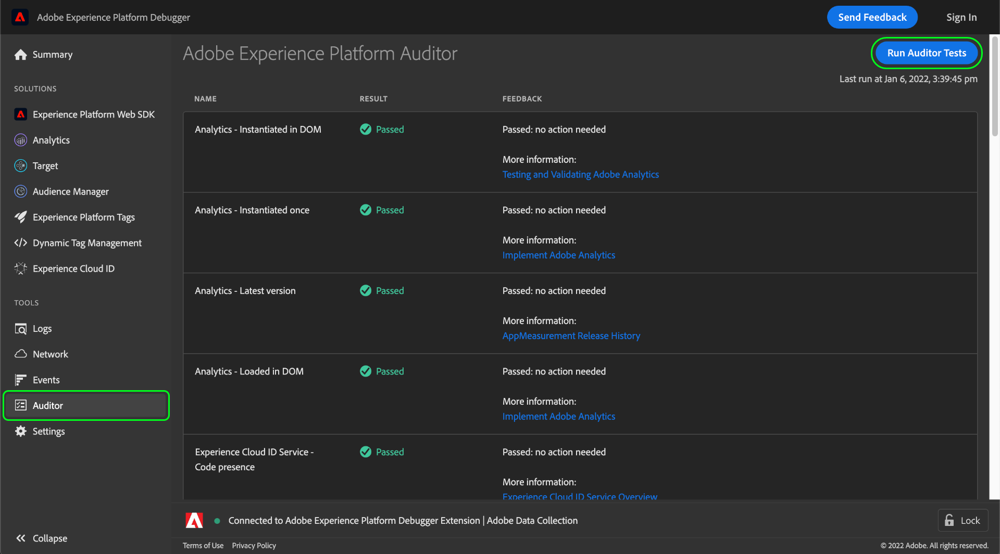

# 「監査」タブ

Adobe Experience Platform Debuggerでは、「**[!UICONTROL Auditor]**」タブを使用して、ページで一連の監査テストを実行できます。

この機能を使用するには：

1. 左側のナビゲーションで「**[!UICONTROL Auditor]**」を選択します。
1. 「**[!UICONTROL Run Auditor Tests]**」を選択します。テストが完了すると、その結果が以下に表示されます。

結果リストには、テストとその結果が表示され、問題を解決するための提案が示されます。

## テスト結果の解釈

各テストは重み付けされ、テストスコアは割り当てられた重みと等しくなります。 体重5のテストに合格すると、5 ポイントを獲得できます。

| スコア | 説明 |
| --- | --- |
| 0 | 注意すべき課題を特定し、スコアに影響を与えないようにしましょう。 |
| 1 | 最適化を提案： データの正確性には影響しません。 |
| 2 | このテストに失敗すると、Adobe Experience Cloudの最新の機能と修正プログラムにアクセスできなくなります。 |
| 3 | 効率性を検証し、ベストプラクティスに従って導入しているかどうかを確認します。 |
| 4 | 失敗とは、信頼できないデータを収集している可能性があることを意味します。 |
| 5 | 失敗すると、データが失われる可能性があります。 |

すべてのテストは成功するか失敗します。 テスト条件に対する準拠または違反をテストするので、一部準拠している場合でも部分的にスコアが提供されるわけではありません。例えば、テストでアドビソリューションの最新バージョンを確認し、1 つ前のバージョンを使用していることがわかった場合、5 つ前のバージョンを使用している場合と同じスコアが付けられます。最新バージョンにはパフォーマンスの改善とバグ修正が含まれているため、最新バージョンを使用することをお勧めします。

レベル 4 または 5 の結果を修正することを&#x200B;**強くお勧めします**。

レベル 1 から 3 の結果を修正することを&#x200B;**お勧めします**。

## サポートされているAdobe テクノロジー

監査機能では、次のAdobe テクノロジを評価できます。

* Adobe Advertising DSP
* Adobe Advertising Search
* Adobe Analytics
* Adobe Experience Cloud ID サービス
* Adobe Target
* Tags （旧Adobe Experience Platform Launch）

## ルーブリックのテスト

この機能で提供されるテストルーブリックについて詳しくは、次のドキュメントを参照してください。

* [タグの整合性](./tag-consistency.md)
* [タグの有無](./tag-presence.md)
* [設定](./configuration.md)
* [アラート](./alerts.md)
