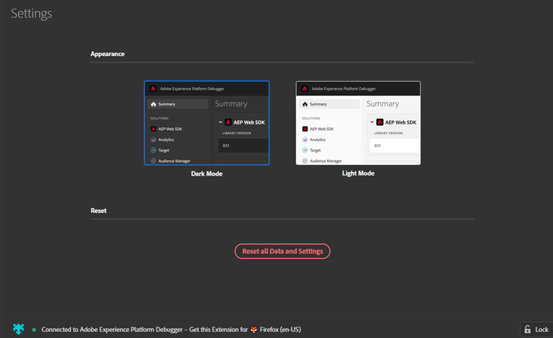

# Platform Debugger の設定

Adobe Experience Platform Debugger の外観と動作に関する特定の要素を設定できます。

## ライトモードとダークモード

Platform Debugger が開いたら、 **[!UICONTROL 設定]** を選択し、 **ダークモード** （デフォルト）または **ライトモード**.

## リセット

選択 **[!UICONTROL すべてのデータと設定をリセット]** をクリアしてデフォルト設定に戻す。

## あるページに Experience Platform Debugger をロックする

サイト上のページを変更すると、Experience Platform Debugger ウィンドウが更新され、そのページの情報が表示されます。接続しているページの名前が画面の下部に表示されます。1 つのページでExperience Platformデバッガーをロックしたままにするには、「 」を選択します。 **[!UICONTROL ロック]** をクリックします。

これは、ページのデバッグ中に、ドキュメントを読んだり、別のページの情報を表示したりする場合に役立ちます。
