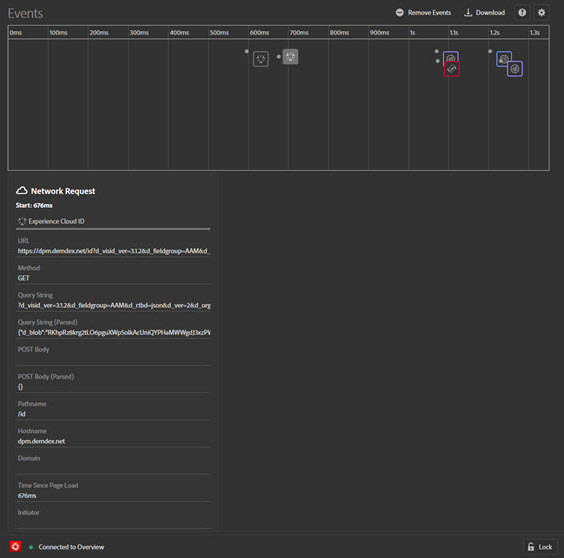

# 「イベント」タブ

「**イベント**」タブには、発生したイベントがタイムラインにグラフィック表示されます。

各イベントに対して、該当する ソリューションのアイコンがタイムラインに表示されます。アイコンは、データレイヤーに対する変更も表示するようになりました（有効になっている場合）。イベントの概要を表示するアイコンの上にマウスポインターを置きます。詳細については、イベントを選択してください。 Shift キーまたは Control キーを押しながら選択すると、複数のイベントを表示できます。

詳細を選択してください。

## データレイヤーの変更の追跡

タイムラインでデータレイヤーの変更の追跡を有効にするには、次の手順を実行します。

1. 右上の歯車アイコンを選択します。
1. データレイヤーの名前を入力します。

   

1. 「**[!UICONTROL 保存]**」を選択します。

データレイヤーの変更の詳細には、削除または追加された内容が表示されます。**{}** を選択すると、データレイヤーをより深く掘り下げることができます。

## イベント情報のダウンロード

「**[!UICONTROL ダウンロード]**」を選択して、ページ呼び出しに関する情報を示す Excel ファイルをダウンロードします。
