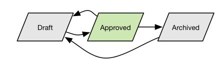

# API を使用した判定オブジェクトとルールの管理

This document provides a tutorial for working with the business entities of [!DNL Decisioning Service] using Adobe Experience Platform APIs.

このチュートリアルは、次の 2 つの部分で構成されています。

- [最初の部分で](#managing-repository-entities-using-apis)では、ビジネスオブジェクトを管理する汎用リポジトリー API が導入されます。これらの API は、**あらゆる**&#x200B;種類のビジネスオブジェクトの作成、読み取り、更新、削除および検索機能を提供するという意味で、汎用的です。一般的な API モデルが説明され、ハイパーテキストアプリケーション言語（HAL）との関係が説明されます。

- [第 2 部](#creating-and-managing-offer-decisioning-entities-using-apis)では、リポジトリー API に関する知識を適用し、リポジトリ API を介して管理されるビジネスエンティティに焦点を当てます。同じ API を適用した場合、アクティビティやビジネスルールなどの 2 つの異なるエンティティの管理における唯一の違いは、リクエストと応答のペイロード、および管理されるオブジェクトの種類を示す必要なヘッダー値です。

## はじめに

This tutorial requires a working understanding of the [!DNL Experience Platform] services and the API conventions. The [!DNL Platform] repository is a service used by several other [!DNL Platform] services to store business objects and various types of metadata. これらのオブジェクトを管理およびクエリして、いくつかのランタイムサービスで使用するための安全で柔軟な方法を提供します。そ [!DNL Decisioning Service] の一つ。 このチュートリアルを開始する前に、次のドキュメントを確認してください。

- [!DNL Experience Data Model (XDM)](../../xdm/home.md):プラットフォームが顧客体験データを編成する際に使用する標準化されたフレームワーク。
- [!DNL Decisioning Service](./../home.md):Experience Decisioningの一般的な方法と、特にオファー判定に使用される概念とコンポーネントについて説明します。 顧客のエクスペリエンスで提示する最適なオプションを選択するために使用される戦略を示します。
- [!DNL Profile Query Language (PQL)](../../segmentation/pql/overview.md):PQLはXDMインスタンスを使って式を書く強力な言語です。 PQL は、判定ルールの定義に使用されます。

The following sections provide additional information that you will need to know in order to successfully make calls to the [!DNL Platform] APIs.

### API 呼び出し例の読み取り

このチュートリアルでは、API 呼び出しの例を提供し、リクエストの形式を設定する方法を示します。この中には、パス、必須ヘッダー、適切な形式のリクエストペイロードが含まれます。また、API レスポンスで返されるサンプル JSON も示されています。ドキュメントで使用される API 呼び出し例の表記について詳しくは、 トラブルシューテングガイドの[API 呼び出し例の読み方](../../landing/troubleshooting.md#how-do-i-format-an-api-request)に関する節を参照してください。[!DNL Experience Platform]

### 必須ヘッダーの値の収集

In order to make calls to [!DNL Platform] APIs, you must first complete the [authentication tutorial](../../tutorials/authentication.md). Completing the authentication tutorial provides the values for each of the required headers in all [!DNL Experience Platform] API calls, as shown below:

- Authorization: Bearer `{ACCESS_TOKEN}`
- x-api-key: `{API_KEY}`
- x-gw-ims-org-id: `{IMS_ORG}`

All resources in [!DNL Experience Platform] are isolated to specific virtual sandboxes. All requests to [!DNL Platform] APIs require a header that specifies the name of the sandbox the operation will take place in:

- x-sandbox-name: `{SANDBOX_NAME}`

>[!NOTE]
>
>For more information on sandboxes in [!DNL Platform], see the [sandbox overview documentation](../../sandboxes/home.md).

ペイロード（POST、PUT、PATCH）を含むすべてのリクエストには、以下のような追加ヘッダーが必要です。

- Content-Type: application/json

## リポジトリ API の規則

[!DNL Decisioning Service] は、互いに関連する多数のビジネスオブジェクトによって制御されます。 All business objects are stored in the [!DNL Platform’s] Business Object Repository. このリポジトリーの主な特長は、API がビジネスオブジェクトのタイプと直交していることです。API エンドポイントのリソースのタイプを示す POST、GET、PUT、PATCH、DELETE API を使用する代わりに、6 つの汎用エンドポイントしかありませんが、あいまいさ解消が必要なときにオブジェクトのタイプを示すパラメーターを受け入れるまたは返します。スキーマはリポジトリーに登録する必要がありますが、その後、リポジトリをオープンエンドなオブジェクト型のセットに対して使用できます。

上記のヘッダーに加え、リポジトリオブジェクトを作成、読み取り、更新、削除およびクエリする API には、次の規則があります。

- すべてのリポジトリ API のエンドポイントパスは `https://platform.adobe.io/data/core/xcore/` で始まります。

API ペイロード形式は、`Accept` または `Content-Type` ヘッダーでネゴシエートされます。`Accept` または `Content-Type` ヘッダー内のメッセージ形式は `application/vnd.adobe.platform.xcore.{FORMAT}+json` 値で示されます。ここで、{FORMAT}は、次の表に従って、特定のリポジトリ API リクエストまたは応答メッセージに依存します。

| 形式のバリアント | リクエストまたは応答エンティティの説明 |
| --- | --- |
| Hal <br> にパラメーター `schema={schemaId}` が続く | メッセージには、形式パラメータースキーマによって示される JSON スキーマによって記述されたインスタンスが含まれています。インスタンスは JSON プロパティ `_instance` でラップされます。応答ペイロードの他の最上位プロパティは、すべてのリソースで使用できるリポジトリ情報を指定します。  HAL 形式に準拠するメッセージには、HAL 形式の参照を含む `_links` プロパティが含まれています。 |
| `patch.hal` | メッセージには JSON パッチペイロードが含まれ、パッチ適用対象のインスタンスが HAL に準拠していると想定しています。つまり、インスタンスの固有のインスタンスプロパティだけでなく、インスタンスの HAL リンクにもパッチを適用できます。クライアントが更新できるプロパティには制限があります。 |
| `home.hal` | メッセージには、リポジトリのホームリソースの JSON 形式でのドキュメント表現が含まれています。 |
| xdm.receipt | メッセージには、作成、更新（完全およびパッチ）、削除操作に対する JSON 形式の応答が含まれます。受信には、ETag 形式でインスタンスのリビジョンを示す制御データが含まれます。 |

各&#x200B;**形式のバリエーション**&#x200B;の使用方法は、特定の API によって異なります。

| API | Content-Type ヘッダー | Accept ヘッダー |
| --- | --- | --- |
| インスタンス作成<br/>コンテナ作成 | `hal`<br/> とスキーマ | `xdm.receipt` |
| インスタンス更新<br/>コンテナ更新 | `hal`<br/> とスキーマ | `xdm.receipt` |
| インスタンスパッチ | `patch.hal` | `xdm.receipt` |
| インスタンス削除<br/>コンテナ削除 | なし | `xdm.receipt` |
| インスタンス読み取り<br/>コンテナ読み取り | なし | `hal` と `schema` パラメーター |
| インスタンスリスト<br/>コンテナリスト | なし | `hal` と特別な `schema` パラメーター `https://ns.adobe.com/experience/xcore/hal/results` |
| インスタンス検索 | なし | HAL と特別な `schema` パラメーター`https://ns.adobe.com/experience/xcore/hal/results` |
| リポジトリルート読み取り | なし | `home.hal` |

コンテナの作成、更新、読み取り API の場合、形式パラメーターのスキーマーに `https://ns.adobe.com/experience/xcore/container` 値が含まれます。

`ContainerId` は、インスタンス API の最初のパスパラメーターです。Ｗすべてのビジネスエンティティは、「コンテナ」内に存在します。コンテナとは、異なる懸念を分離するための分離メカニズムです。一般的なエンドポイントに続くリポジトリインスタンス API の最初のパス要素は `containerId` です。識別子は、呼び出し元がアクセス可能なコンテナのリストから取得されます。例えば、コンテナでインスタンスを作成する API は `POST https://platform.adobe.io/data/core/xcore/{containerId}/instances` です。

アクセス可能なコンテナのリストは、標準のヘッダーを使用して HTTP GET リクエストでリポジトリのルートエンドポイント「/」を呼び出すことで取得されます。

## コンテナへのアクセスの管理

管理者は、類似したプリンシパル、リソースおよびアクセス権限をプロファイルにグループ化できます。 これにより、管理の負担が軽減され、[アドビの Admin Console UI](https://adminconsole.adobe.com) でサポートされます。プロファイルを作成し、ユーザを割り当てるには、組織内のAdobe Experience Platformの製品管理者である必要があります。

1 回限りの手順で特定の権限に一致する製品プロファイルを作成し、その後、それらのユーザーにプロファイルを追加するだけで十分です。プロファイルは、権限が付与されたグループとして機能し、そのグループ内のすべての実際のユーザーまたは技術ユーザーは、権限を継承します。

### ユーザーおよび統合にアクセス可能なコンテナーのリスト

管理者が通常のユーザーまたは統合にコンテナへのアクセスを許可すると、それらのコンテナはリポジトリのいわゆる「ホーム」リストに表示されます。リストは、呼び出し元がアクセスできるすべてのコンテナのサブセットなので、ユーザーや統合によって異なる場合があります。コンテナのリストは、製品コンテキストとの関連付けによってフィルターできます。フィルターパラメーターは `product` と呼ばれ、繰り返し使用できます。複数の製品コンテキストフィルターが指定されている場合、指定された製品コンテキストのいずれかに関連付けられているコンテナの和集合が返されます。単一のコンテナを複数の製品コンテキストに関連付けることができます。

現在、 [!DNL Platform] コンテナのコンテキスト [!DNL Decisioning Service]`dma_offers`です。

>[!NOTE]
>
>のコンテキスト [!DNL Platform Decisioning Containers] は、まもなくに変更され `acp`ます。 フィルタリングはオプションですが、`dma_offers` のみによるフィルターは、将来のリリースで編集が必要になります。この変更に備えるには、クライアントはフィルターを使用しないか、両方の製品コンテキストをフィルターとして適用するべきです。

**リクエスト**

```shell
curl -X GET {ENDPOINT_PATH}/?product=dma_offers&product=acp \ 
  -H 'Accept: application/vnd.adobe.platform.xcore.home.hal+json' \ 
  -H 'Authorization: Bearer {ACCESS_TOKEN}' \ 
  -H 'x-api-key: {API_KEY}' \ 
  -H 'x-gw-ims-org-id: {IMS_ORG}' \
  _H 'x-sandbox-name: {SANDBOX_NAME}' \ 
  -H 'x-request-id: {NEW_UUID}' 
```

**応答** 

```json
{ 
    "_embedded": { 
        "https://ns.adobe.com/experience/xcore/container": [ 
            { 
              "instanceId": "82d1f250-85b6-11e9-ac80-99ba4655b277", 
              "schemas": [ 
                "https://ns.adobe.com/experience/xcore/container;version=0.1" 
              ], 
              "productContexts": [ 
                "dma_offers" 
              ], 
              "repo:etag": 1, 
              "repo:createdDate": "2019-06-03T04:17:33.684Z", 
              "repo:lastModifiedDate": "2019-06-03T04:17:33.684Z", 
              "repo:createdBy": "CREATOR_ACCOUNT_ID", 
              "repo:lastModifiedBy": "LAST_UPDATE_ACCOUNT_ID", 
              "repo:createdByClientId": "CLIENT_ID_OR_API_KEY", 
              "repo:lastModifiedByClientId": "CLIENT_ID_OR_API_KEY", 
              "_instance": { 
                "repo:name": "My Organization's container", 
                "dataCenter": "VA7" 
              }, 
              "_links": { 
                "self": { 
                  "href": "/containers/82d1f250-85b6-11e9-ac80-99ba4655b277" 
                } 
              } 
            } 
        ] 
    }, 
    "_links": { 
        "self": { 
            "href": "/"  
        } 
    } 
}  
```

結果項目に一覧表示されている `instanceId` に注意してください。これは、通常のビジネスオブジェクトの読み取りと操作を実行するために、API の `containerId` パラメーターとして使用されています。

リストは、アクセス権限に基づいて既にユーザーに対してフィルターされていますが、プロパティクエリでもフィルターできます。

## エンティティを管理する汎用 API

### インスタンスの作成

リポジトリで新しいインスタンスを作成する API は、`containerId` パスパラメーターを使用し、`Content-Type` ヘッダー内のインスタンスのタイプを、そのインスタンスのスキーマパラメーターで識別します。

インスタンスプロパティは、`_instance` プロパティでラップされたペイロードで提供されます。インスタンスプロパティは、指定したスキーマ識別子を持つ JSON スキーマに対して有効である必要があります。

HAL `_links` プロパティは存在する必要がありますが、空にすることができます。つまり、このインスタンスに対してカスタムリンクが定義されていません。

**リクエスト**

```shell
curl -X POST {ENDPOINT_PATH}/{CONTAINER_ID}/instances \ 
  -H 'Content-Type: application/vnd.adobe.platform.xcore.hal+json; schema="{SCHEMA_ID}"' \  
  -H 'Accept: application/vnd.adobe.platform.xcore.xdm.receipt+json \ 
  -H 'x-api-key: {API_KEY}' \ 
  -H 'x-gw-ims-org-id: {IMS_ORG}' \
  _H 'x-sandbox-name: {SANDBOX_NAME}' \ 
  -H 'x-request-id: {NEW_UUID}' \ 
  -d '{ 
    "_instance": { 
        {JSON_PAYLOAD} 
    }, 
    "_links": { 
    } 
}' 
```

**応答** 

```json
{ 
  "instanceId": "3684ceb0-8744-11e9-a989-89f60b24f6cc", 
  "@id": "GENERATED_URI", 
  "repo:etag": 1, 
  "repo:createdDate": "2019-06-05T03:44:25.343Z", 
  "repo:lastModifiedDate": "2019-06-05T03:44:25.343Z", 
  "repo:createdBy": "YOUR_TECHNICAL_ACCOUNT_ID", 
  "repo:lastModifiedBy": "YOUR_TECHNICAL_ACCOUNT_ID", 
  "repo:createdByClientId": "YOUR_API_KEY", 
  "repo:lastModifiedByClientId": "YOUR_API_KEY" 
}
```

応答には、作成されたばかりのオブジェクトの instanceId が含まれます。この instanceId は不変で、常にリポジトリによって割り当てられ、グローバルに一意です。この値は、物理的な識別子として機能します。

さらに、スキーマにそのようなプロパティがある場合、ユニバーサルリソース識別子（URI）が応答ペイロードの `@id` プロパティで返されます。各インスタンスには、インスタンスの URI とプライマリキーとして機能するプロパティが必要です。この識別子は、別のインスタンスが使用して、異なるタイプを含む新しいインスタンスとの関係を形成します。現在のリリースでは、URI はリポジトリーによって生成され、`@id` プロパティに含まれます。将来のバージョンでは、このルールが緩和され、クライアントが独自の URI 値を管理し、その URI を含むプロパティに名前を付けることができるようになる可能性があります。

これらの URI は URL ではなく、リソースを直接取得する方法を提供しないことに注意してください。その側面を示すために、URI の前には、検索プロトコルを指定しない URI スキームが付いています。ただし、URI を使用して、クエリでインスタンスを検索することはできます。

REST 応答には、作成されたばかりのインスタンスの取得に使用できる URL コンポーネントを含む Location ヘッダーが含まれます。このコンポーネントは相対 URI 参照で、リポジトリーのベース URI に適用する必要があります。ベース URI が `Content-Base` ヘッダーに返されます。

この `repo:etag` プロパティは、インスタンスのリビジョンを指定します。この値は、整合性を強化するために、更新操作で使用できます。`If-Match` HTTP ヘッダーを使用して、PUT または PATCH API 呼び出しに条件を追加し、誤って上書きされる可能性のあるインスタンスに対する他の変更がないようにします。`repo:etag` 値は、作成、読み取り、更新、削除およびクエリの呼び出しごとに返されます。この値は、[RFC7232 3.1 節](https://tools.ietf.org/html/rfc7232#section-3.1)に従って、` If-Match` ヘッダーの値として使用されます。

残りのプロパティは、インスタンスの作成と最後の変更に使用されたアカウントと API キーを示します。この呼び出しによってインスタンスが作成されたので、それぞれの値がリクエストの値になります。

### ID によるインスタンスの参照

作成呼び出しで返される Location ヘッダーの URL を使用して、アプリケーションはインスタンスを検索できます。

**リクエスト**

```shell
curl -X GET {ENDPOINT_PATH}/{CONTAINER_ID}/instances/{INSTANCE_ID} \ 
  -H 'Accept: *, application/vnd.adobe.platform.xcore.hal+json; schema="{SCHEMA_ID}" \ 
  -H 'x-api-key: {API_KEY}' \ 
  -H 'x-gw-ims-org-id: {IMS_ORG}' \
  _H 'x-sandbox-name: {SANDBOX_NAME}' \ 
  -H 'x-request-id: {NEW_UUID}'  
```

>[!NOTE]
>
> `instanceId` がパスパラメーターとして指定されている場合でも、可能な限り、アプリケーションはパス自体を構築せず、リストや検索操作に含まれるインスタンスへのリンクに従う必要があります。詳しくは‎、6.4.4 と 6.4.6 の節を参照してください。

**応答** 

```json
{ 
  "instanceId": "ID_OF_THIS_INSTANCE", 
  "schemas": [ 
    "SCHEMA_ID_OF_INSTANCE" 
  ], 
  "repo:etag": 1, 
  "repo:createdDate": "2019-03-24T15:52:12.725Z", 
  "repo:lastModifiedDate": "2019-03-24T15:52:12.725Z", 
  "repo:createdBy": "CREATOR_ACCOUNT_ID", 
  "repo:lastModifiedBy": "LAST_UPDATE_ACCOUNT_ID", 
  "_instance": { 
    JSON_PROPERTIES_OF_THIS_INSTANCE 
  }, 
  "_links": { 
    "self": { 
      "name": "GENERATED_UNIQUE_LINK_NAME", 
      "href": "RELATIVE_URL_TO_INSTANCE" 
    } 
  } 
} 
```

インスタンスの JSON プロパティは `_instance` プロパティに含まれ、他のルートレベルのプロパティはインスタンスに関するメタデータを保持します。

リソースには、JSON スキーマ ID の配列も含まれます。この配列は、このインスタンスが検証される JSON スキーマを示します。

各インスタンスには、IANA 登録済み自己関係（[RFC5988] で定義）に対応する関係タイプ自体の HAL リンクが含まれています。

**インスタンスの新しいリビジョンのテスト**

インスタンスの現在の `eTag` 値が応答と共に返され、クライアントはインスタンスに対して条件演算を実行できます。これにより、同じリソース状態を再度取得しないか、クライアントの知識なしに後のリビジョンの値を上書きしないようにできます。

検索 API を使用すると、クライアントは `If-None-Match` ヘッダーパラメーターを指定できます。この標準 HTTP パラメーター [RFC2616] の定義を参照してください。クライアントが指定するエンティティタグ値は、更新、読み取り、リスト、または検索 API 呼び出しからの最新の応答で受け取った値です。`etag` 値はクライアントに対して不透明で、引用符で囲まれた文字列として指定する必要があります。

**リクエスト**

```shell
curl -X GET {ENDPOINT_PATH}/{CONTAINER_ID}/instances/{INSTANCE_ID} \ 
  -H 'Accept: *, application/vnd.adobe.platform.xcore.hal+json; schema="{SCHEMA_ID}" \ 
  -H 'If-None-Match: "{LAST_RECEIVED_ETAG}" \ 
  -H 'x-api-key: {API_KEY}' \ 
  -H 'x-gw-ims-org-id: {IMS_ORG}' \
  _H 'x-sandbox-name: {SANDBOX_NAME}' \ 
  -H 'x-request-id: {NEW_UUID}'  
```

インスタンスの最後のリビジョンが ETag が指定されたものである場合、リポジトリー API はステータス 304（未更新）で応答します。

### スキーマインスタンスをリスト — 並べ替えとページング

クライアントは、作成中のインスタンスを追跡できないので、物理 instanceId を使用してそれらのインスタンスにアクセスします。インスタンス読み取り API の使用は例外です。また、クライアントは、他のクライアントが作成したインスタンスを認識しません。

より一般的なアクセスのパターンは、すべてのインスタンスのセットをページごとに表示することです。

**リクエスト**

```shell
curl -X GET {ENDPOINT_PATH}/{CONTAINER_ID}/instances?schema="{SCHEMA_ID}" \ 
  -H 'Accept: *, application/vnd.adobe.platform.xcore.hal+json; schema="https://ns.adobe.com/experience/xcore/hal/results" \ 
  -H 'x-api-key: {API_KEY}' \ 
  -H 'x-gw-ims-org-id: {IMS_ORG}' \
  _H 'x-sandbox-name: {SANDBOX_NAME}' \ 
  -H 'x-request-id: {NEW_UUID}'  
```

**応答** 

応答は指定した `{schemaId}` 値に依存します。例えば、「https<span></span>://ns.adobe.com/experience/offer-management/offer-activity&amp;id=xcore:offer-activity:fa24f9e8fc15c73」の応答は、次のようになります。

```json
{
"requestTime": "2019-06-28T06:54:05.606Z",
"_embedded": {
  "results": [],
  "total": 0,
  "count": 0
  },
  "_links": {
  "self": {
  "href": "/653da250-71b8-11e9-a3fe-9b1d0913f3ed/instances?schema=https://ns.adobe.com/experience/offer-management/offer-activity&id=xcore:offer-activity:fa24f9e8fc15c73",
"@type": "https://ns.adobe.com/experience/xcore/hal/results"
  }
  },
  "containerId": "653da250-71b8-11e9-a3fe-9b1d0913f3ed",
  "schemaNs": "https://ns.adobe.com/experience/offer-management/offer-activity;version=0.1"
}
```

>[!NOTE]
>
> 結果には、指定されたスキーマまたはこのリストの最初のページのインスタンスが含まれます。インスタンスは複数のスキーマに準拠できるので、複数のインスタンスに表示されることがあります。

ページリソースは一時的で読み取り専用です。更新や削除はできません。ページングモデルは、クライアントごとの状態を維持することなく、長期間にわたって大きなリストのサブセットへのランダムアクセスを提供します。

この方法でページごとにインスタンスリストにアクセスするには、そのインスタンスリストによって列挙されたエントリに対して安定した並び替えを定義できる必要があります。「安定」とは、インスタンスが事前に決められたページに表示されることではありません。実際、インスタンスをプロパティ P に従って並べ替えてページ順が形成され、クライアントがこのプロパティ P を更新すると、別のクライアントがリストをページングしながら、別のページでこのインスタンスに再び到達できます。つまり、モデルでは、より最新の結果を返すことが優先されます。

ただし、並べ替え順序が変更不可能なプロパティに基づく場合、「安定した」並べ替え順序により、ページ操作の最初に存在したすべてのインスタンスに到達することが保証されます（ページに到達した時点までに削除された場合を除く）。この並べ替え順が単調に増加するプロパティに対して行われる場合、ページング操作の開始後に作成されるインスタンスにも到達します。

クライアントは、必要なページサイズについてのヒントを提供できますが、返すページでインスタンスを提供するかどうかは、完全にリポジトリー次第です。安定した順序を保証するために、ページの並び替えプロパティの値がページの境界で異なるように、サービスはページの項目を追加または削除する必要があります。この方法を使用すると、次のページに最後のページの一部の項目が再度含まれなくなるか、最悪のシナリオでは、各ページに同じ項目が表示されます。

ページングは、次のパラメーターで制御します。

- **`orderBy`**：インスタンスリストの並べ替えに使用するプロパティのカンマ区切りの順序付きリストが含まれます。最初のプロパティはプライマリ並べ替えに使用され、2 番目のプロパティはプライマリ並べ替えでの関係を解決するなどに使用される、などです。インスタンスごとに一意の値を持つプロパティを指定した場合、結び付けはできず、各項目の後に改ページが発生する可能性があります。プロパティの名前の先頭には、そのプロパティによる並び替えが昇順であることを示す `+` 接頭辞、または、降順であることを示す `-` 接頭辞を付けることができます。プロパティ名の前に接頭辞が付いていない場合、結果は昇順で並べ替えられます。リクエストで `orderBy` が指定されていない場合、リポジトリーは代わりに物理的な instanceId プロパティを使用します。
- **`start`**：クライアントは開始パラメーターを使用して、取得するページを定義します。開始パラメーターは、目的のページの開始を決定します。応答には、`orderBy` プロパティ値が厳密により大きい（昇順の場合）か、または厳密により小さい（降順の場合）インスタンスを先頭としたインスタンスが含まれます。クエリパラメーターが指定されていない場合、デフォルトでは、可能な最初のインスタンス識別子の前に並び替えられる instanceId 値が使用されるため、この値は最初のページから省略されます。
- **`limit`**：特定のリクエストに対して返す最大アイテム数に関するヒントとして正の整数を指定します。開始パラメーターの信頼性の高い操作を提供する必要があるため、実際の応答サイズはこれよりも小さい場合と大きい場合があります。

### リストのフィルタリング

リスト結果のフィルタリングは可能で、ページングメカニズムとは無関係に発生します。フィルターは、リストの順序でインスタンスをスキップするか、特定の条件を満たすインスタンスのみを含めるよう明示的に求めます。クライアントは、プロパティ式をフィルターとして使用するようにリクエストしたり、インスタンスのプライマリキーの値として使用する URI のリストを指定したりできます。

- **`property`**:プロパティ名パスの後に比較演算子と値が続くパスが含まれます。<br/>
返されるリストのインスタンスには、式が true と評価されるインスタンスが含まれます。例えば、インスタンスにペイロードプロパティがあると仮定します 
`status` との値が可能です。 `draft`との値が `approved`、 `archived` クエリパラメーターはステータスが承認されたインスタンスのみを `deleted``property=_instance.status==approved` 返します。 <br/>
<br/>
渡された値と比較されるプロパティは、パスとして識別されます。個々のパスコンポーネントは、「_instance.xdm:prop1.xdm:prop1_1.xdm:prop1_1_1」のように「.」で区切られます。<br/>

文字列、数値、または日付/時間値を持つプロパティの場合、`==`、`!=`、`<`、`<=`、`>`、`>=` の演算子を使用できます。また、文字列値を持つプロパティの場合は、`~` 演算子を使用できます。`~` 演算子は、正規表現に従って指定されたプロパティに一致します。プロパティの文字列値は、エンティティがフィルターされた結果に含まれるように、式&#x200B;**全体**&#x200B;と一致する必要があります。例えば、プロパティ値内の任意の場所で文字列 `cars` を検索する場合、正規式 `.*cars.*` が必要です。先頭または末尾に `.*` がない場合、プロパティ値がそれぞれ `cars` で始まるまたは終わるエンティティのみが一致します。`~` 演算子の場合、文字の比較では大文字と小文字が区別されません。その他の演算子の場合は、大文字と小文字が区別されます。<br/><br/>
インスタンスのペイロードプロパティだけでなく、フィルター式でも使用できます。エンベローププロパティは同じように比較されます（例：`property=repo:lastModifiedDate>=2019-02-23T16:30:00.000Z`）。<br/>
<br/>
`property`クエリパラメーターを繰り返して、複数のフィルター条件を適用できます（例：特定の日付の後と別の特定の日付の前に最後に変更されたすべてのインスタンスを返す）。これらの式の値は、URL エンコードする必要があります。式が指定されておらず、プロパティ名が簡単にリストされている場合、指定された名前のプロパティを持つ項目が該当します。<br/>
<br/>

- **`id`**：場合によっては、リストをインスタンスの URI でフィルターする必要があります。`property` クエリパラメーターを使用すると 1 つのインスタンスをフィルターして除外できますが、複数のインスタンスを取得する場合は、URI のリストをリクエストに渡すことができます。`id` パラメーターを繰り返し、それぞれで 1 つの URI 値を指定します。`id={URI_1}&id={URI_2},…` は URL エンコードする必要があります。

ページ化された結果は、特別な MIME タイプ `application/vnd.adobe.platform.xcore.hal+json; schema="https://ns.adobe.com/experience/xcore/hal/results"` として返されます。

**リクエスト**

```shell
curl -X GET {ENDPOINT_PATH}/{CONTAINER_ID}/instances?schema="{SCHEMA_ID}"&orderby${ORDER_BY_PROPERTY_PATH}&property={TIMESTAMP_PROPERTY_PATH}>=2019-02-19T03:19:03.627Z&property${TIMESTAMP_PROPERTY_PATH}<=2019-06-19T03:19:03.627Z \ 
  -H 'Accept: *, application/vnd.adobe.platform.xcore.hal+json; schema="https://ns.adobe.com/experience/xcore/hal/results" \ 
  -H 'x-api-key: {API_KEY}' \ 
  -H 'x-gw-ims-org-id: {IMS_ORG}' \
  _H 'x-sandbox-name: {SANDBOX_NAME}' \ 
  -H 'x-request-id: {NEW_UUID}'  
```

**応答** 

```json
{ 
  "requestTime": "2019-06-10T22:12:13.642Z", 
  "_embedded": { 
    "results": [ 
      { 
        "instanceId": "ID_OF_THIS_INSTANCE", 
        "schemas": [ 
          "SCHEMA_ID_OF_INSTANCE" 
        ], 
        "repo:etag": 1, 
        "repo:createdDate": "2019-04-19T03:19:03.627Z", 
        "repo:lastModifiedDate": "2019-04-19T03:19:03.627Z", 
        "repo:createdBy": "CREATOR_ACCOUNT_ID", 
        "repo:lastModifiedBy": "LAST_UPDATE_ACCOUNT_ID", 
        "_instance": { 
          JSON_PROPERTIES_OF_THIS_INSTANCE 
        }, 
        "_links": { 
          "self": { 
            "name": "GENERATED_UNIQUE_LINK_NAME", 
            "href": "RELATIVE_URL_TO_INSTANCE" 
          } 
        } 
      }, 
      { 
        "instanceId": "ID_OF_THIS_INSTANCE", 
        "schemas": [ 
          "SCHEMA_ID_OF_INSTANCE" 
        ], 
        "repo:etag": 1, 
        "repo:createdDate": "2019-04-19T20:30:31.361Z", 
        "repo:lastModifiedDate": "2019-04-19T20:30:31.361Z", 
        "repo:createdBy": "CREATOR_ACCOUNT_ID", 
        "repo:lastModifiedBy": "LAST_UPDATE_ACCOUNT_ID", 
        "_instance": { 
          JSON_PROPERTIES_OF_THIS_INSTANCE 
        }, 

        "_links": { 
          "self": { 
            "name": "GENERATED_UNIQUE_LINK_NAME", 
            "href": "RELATIVE_URL_TO_INSTANCE" 
          } 
        } 
      } 
    ], 
    "total": 2, 
    "count": 2 
  }, 
  "_links": { 
    "self": { 
      "href": "RELATIVE_URL_TO_THIS_RESULT" 
    } 
  }, 
  "containerId": "CONTAINER_ID_OF_THIS_LIST", 
  "schemaNs": "SCHEMA_ID_OF_INSTANCE_LIST" 
} 
```

応答には、JSON プロパティの結果内の結果項目のリストが含まれています。このページの結果の数と、返されたページから始まるフィルターされたリスト内の項目の総数を示す 2 つのプロパティの隣にあります。

### 全文検索と構造クエリ

クライアントがより複雑なフィルター条件を提供し、文字列プロパティに含まれる用語でインスタンスを検索する場合、リポジトリーはより強力な検索 API を備えています。

**リクエスト**

```shell
curl -X GET {ENDPOINT_PATH}/{CONTAINER_ID}/queries/core/search?schema="{SCHEMA_ID}"&… \ 
  -H 'Accept: *, application/vnd.adobe.platform.xcore.hal+json; schema="https://ns.adobe.com/experience/xcore/hal/results" \ 
  -H 'x-api-key: {API_KEY}' \ 
  -H 'x-gw-ims-org-id: {IMS_ORG}' \
  _H 'x-sandbox-name: {SANDBOX_NAME}' \ 
  -H 'x-request-id: {NEW_UUID}'  
```

<!-- TODO: needs example response -->

リスト API のページングパラメーターとフィルタリングパラメーターに加えて、この API を使用すると、クライアントは全文とブールクエリパラメーターを追加できます。

全文検索は、次のパラメーターで制御します。

- **`q`**：インスタンスの文字列プロパティと照合される前に正規化される、スペースで区切られた用語のリストが含まれます。文字列プロパティが用語に対して分析され、それらの用語も正規化されます。検索クエリは、`q` パラメーターで指定された 1 つ以上の用語の照合を試みます。+、-、=、&amp;&amp;、||、>、&lt;、!、(、)、{、}、[、]、^、&quot;、～、*、?、:、/ は、クエリ文字列内の単語の境界を特定する特別な意味を持ち、文字と一致するトークン内に出現する場合はバックスラッシュでエスケープする必要があります。クエリ文字列を重複引用符で囲むと、特殊文字はエスケープされ、完全に一致する文字列が検索されます。
- **`field`**：検索語句がプロパティのサブセットに対してのみ一致する必要がある場合、フィールドパラメーターでそのプロパティのパスを示します。このパラメーターを繰り返して、一致する必要のある複数のプロパティを示すことができます。
- **`qop`**：検索の一致動作を変更するために使用される制御パラメーターが含まれます。パラメーターが設定されている場合、すべての検索語句が一致する必要がありますが、パラメーターが存在しないかその値が設定されている場合、いずれかの語句の一致が一致と見なされます。

### インスタンスの更新およびパッチ適用

インスタンスを更新するには、クライアントは、プロパティの完全なリストを一度に上書きするか、JSON パッチリクエストを使用してリストを含む個々のプロパティ値を操作します。

どちらの場合も、リクエストの URL は物理インスタンスへのパスを指定し、応答は[作成操作](#create-instances)から返されるのと同様の JSON 受信ペイロードになります。この API の完全な URL パスとして、このオブジェクトに対する以前の API 呼び出しから受け取った `Location` ヘッダーまたは HAL リンクを使用することをお勧めしますが、これができない場合は、`containerId` と `instanceId` から URL を構築できます 。

**リクエスト**（PUT）

```shell
curl -X PUT {ENDPOINT_PATH}/{CONTAINER_ID}/instances/{INSTANCE_ID} \ 
  -H 'Content-Type: application/vnd.adobe.platform.xcore.hal+json; schema="{SCHEMA_ID}"' \  
  -H 'Accept: application/vnd.adobe.platform.xcore.xdm.receipt+json \ 
  -H 'x-api-key: {API_KEY}' \ 
  -H 'x-gw-ims-org-id: {IMS_ORG}' \
  _H 'x-sandbox-name: {SANDBOX_NAME}' \ 
  -H 'x-request-id: {NEW_UUID}'\ 
  -d '{ 
  "_instance": { 
    {JSON_PROPERTIES_OF_THIS_INSTANCE} 
  }, 
  "_links": { 
    {HAL_LINKS_OF_THIS_INSTANCE} 
  } 
}'  
```

**リクエスト**（PATCH）

```shell
curl -X PATCH {ENDPOINT_PATH}/{CONTAINER_ID}/instances/{INSTANCE_ID} \ 
  -H 'Content-Type: application/vnd.adobe.platform.xcore.patch.hal+json; schema="{SCHEMA_ID}"' \  
  -H 'Accept: application/vnd.adobe.platform.xcore.xdm.receipt+json \ 
  -H 'x-api-key: {API_KEY}' \ 
  -H 'x-gw-ims-org-id: {IMS_ORG}' \
  _H 'x-sandbox-name: {SANDBOX_NAME}' \ 
  -H 'x-request-id: {NEW_UUID}' \ 
  -d '[ 
  { 
    {JSON_PATCH_INSTRUCTIONS_FOR_THIS_INSTANCE} 
  } 
]'
```

PATCH リクエストは命令を適用し、結果のエンティティをスキーマと同じエンティティおよび PUT リクエストと同じ参照整合性ルールに対して検証します。

**プロパティ値の編集の制御**

次の注釈を使用して、作成時や更新時にプロパティが設定されないようにすることができます。

- **`"meta:usereditable"`**：ブール型 — リクエスト元がユーザーまたは技術アカウントのアクセストークンで呼び出し元を識別するユーザーエージェントである場合、`"meta:usereditable": false` で注釈付けされたプロパティはペイロードに存在しないはずです。存在する場合は、現在設定されている値と異なる値を持つことはできません。値が異なると、更新またはパッチリクエストは、ステータス 422（処理できないエンティティ）で拒否されます。
- **`"meta:immutable"`**：ブール — `"meta:immutable": true` で注釈が付けられたプロパティは、一度設定すると変更できなくなります。これは、エンドユーザー、技術アカウントの統合、または特別なサービスからのリクエストに適用されます。

**同時更新のテスト**

複数のクライアントが同時にインスタンスを更新しようとする場合があります。リポジトリーは、中央のトランザクション管理をおこなわない計算ノードのクラスタ上で動作します。別のクライアントが書き込んでいるインスタンスに同時に書き込むのを防ぐために、クライアントは条件付き更新またはパッチリクエストを使用できます。`If-Match` ヘッダーで `etag` 文字列を指定することにより、リポジトリーは最初のリクエストのみが成功し、同じ `etag` 値を使用する他のクライアントによる後続のリクエストが失敗することを保証します。`etag` 値は、インスタンスを変更するたびに変更されます。クライアントは、最新の `etag` 値を取得するためにインスタンスを取得する必要があります。その後、多数のクライアントが試みた更新のうち、1 つのみが、その値で成功します。他のクライアントは、「409 競合」というメッセージで拒否されます。

### インスタンスの削除

インスタンスは、DELETE 呼び出しで削除できます。以前に API 呼び出しから受け取った `Location` ヘッダーまたは HAL リンクを、完全な URL パスとして使用することが望ましいですが、これができない場合は、`containerId` および物理的な `instanceId` から URL を構築できます 。

**リクエスト**

```shell
curl -X DELETE {ENDPOINT_PATH}/{CONTAINER_ID}/instances/{INSTANCE_ID} \ 
  -H 'Accept: application/vnd.adobe.platform.xcore.xdm.receipt+json \ 
  -H 'x-api-key: {API_KEY}' \ 
  -H 'x-gw-ims-org-id: {IMS_ORG}' \
  _H 'x-sandbox-name: {SANDBOX_NAME}' \ 
  -H 'x-request-id: {NEW_UUID}'  
```

**応答** 

```json
{ 
  "instanceId": "3684ceb0-8744-11e9-a989-89f60b24f6cc", 
  "@id": "INSTANCE_URI", 
  "repo:etag": 1, 
  "repo:createdDate": "2019-06-05T03:44:25.343Z", 
  "repo:lastModifiedDate": "2019-06-05T03:44:25.343Z", 
  "repo:createdBy": "CREATOR_ACCOUNT_ID", 
  "repo:lastModifiedBy": "YOUR_TECHNICAL_ACCOUNT_ID", 
  "repo:createdByClientId": "CREATOR_API_KEY", 
  "repo:lastModifiedByClientId": "YOUR_API_KEY" 
} 
```

削除リクエストを受け取ると、リポジトリーは削除対象のインスタンスを参照し続ける他のスキーマのインスタンスをチェックします。分散された高可用性システムでは、参照整合性を即座にチェックすることはできません。外部キーの関係が定義されている場合、チェックは非同期で実行されます。その結果、削除リクエストの結果に対する応答が少し遅れます。これらのチェックが実行されると、即時応答には、ステータス 202（受理）と、`Location` ヘッダー内の削除操作の結果を確認するリンクが含まれます。その後、クライアントはそのリンクをチェックして結果を確認する必要があります。

削除されているインスタンスを参照するインスタンスが見つかった場合、結果として削除操作が拒否されます。他の外部キー参照が見つからない場合は、削除が完了します。結果がまだ決定されていない場合、応答は同じ `Location` ヘッダーを持つ別の「202 受理」の応答を示し、クライアントに確認を続けるよう求めます。結果が決定されると、応答はステータス 200 （OK）でこれを示し、応答のペイロードに元の削除リクエストの結果が含まます。「200 OK」の応答は、結果が既知で、応答本文に削除リクエストの確認または拒否が含まれることを意味します。

## オファーとそのサブコンポーネントの作成

前の節で説明した API は、すべてのタイプのビジネスオブジェクトに一様に適用されます。例えば、オファーの作成とアクティビティの違いは、スキーマに準拠するリクエストの JSON ペイロードが JSON スキーマであることを示す `content-type` ヘッダーだけです。したがって、以降の節では、これらのスキーマとそれらの間の関係に焦点を当てるだけですみます。

`application/vnd.adobe.platform.xcore.hal+json; schema="{SCHEMA_ID}"` コンテンツタイプで API を使用する場合、インスタンス独自のプロパティが、`_links` プロパティの隣にある `_instance` プロパティに埋め込まれます。これは、すべてのインスタンスが表される一般的な形式です。

```json
{ 
  … ENVELOPE PROPERTIES 
  "_instance": { 
    INSTANCE PROPERTIES 
  }, 
  "_links": {
    HAL PROPERTIES 
  } 
}
```

>[!NOTE]
>
> 簡潔にするため、すべての JSON スニペットでは、インスタンスプロパティのみが示され、必要な場合にのみエンベローププロパティと _links セクションが示されます。

### 一般的なオファープロパティ

オファーは判定オプションの一種で、オファーの JSON スキーマは各オプションインスタンスが持つ標準のオプションプロパティを継承します。

- **`@id`** — プライマリキーであり、他のオブジェクトからオプションを参照するために使用される各オプションの一意の識別子。このプロパティは、インスタンスの作成時に割り当てられて不変で、編集できません。
- **`xdm:name`** — すべてのオプションには、検索や表示の目的で使用される名前が付けられます。この名前は不変ではなく、インスタンスを一意に識別するために使用することはできません。名前は自由に選択できますが、複数のオファーインスタンスで一意である必要があります。

```json
{ 
  "@id": "INSTANCE_URI",                         // meta:immutable=true, meta:usereditable=false 
  "xdm:name": "A name for the Decision Option",  // meta:immutable=false 
  "xdm:characteristics": { 
    properties specific to this instance         // property names can vary per instance 
  } 
}
```

完全な cURL 構文については、「[インスタンスの更新およびパッチ適用](#updating-and-patching-instances)」を参照してください。`schemaId` パラメーターは、`https://ns.adobe.com/experience/offer-management/personalized-offer` またはオファーがフォールバックオファーの場合には `https://ns.adobe.com/experience/offer-management/fallback-offer` である必要があります。

各オファーインスタンスには、そのインスタンスに固有のプロパティのオプションのセットを含めることができます。各オファーは、これらのプロパティに異なるキーを持つことができます。ただし、値は文字列である必要があります。これらのプロパティは、判定ルールとセグメント化ルールで使用できるとともに、メッセージをさらにカスタマイズするために決定されたエクスペリエンスを組み立てるためにアクセス可能です。

### オファーライフサイクル

すべてのオプションは、シンプルなステートトランジションフローをたどります。ステートは「ドラフト」から始まり、準備が整うと「承認」に設定されます。終了日が過ぎると、「アーカイブ」ステートに移動できます。このステートでは、オプションを削除する、または再び「ドラフト」ステートに移動することで再利用することができます。



- **`xdm:status`** — このプロパティは、インスタンスのライフサイクル管理に使用されます。値は、オファーがまだ作成中である（値=ドラフト）、一般にランタイムで検討できる（値=承認）か、それ以上使用しない（値=アーカイブ）かを示すために使用されるワークフローの状態を表します 。

インスタンスの単純な PATCH 操作は、通常、`xdm:status` プロパティを操作する目的で使用されます。

```json
[
  {
    "op":    "replace",
    "path":  "/_instance/xdm:status",
    "value": "approved" 
  }
]
```

完全な cURL 構文については、「[インスタンスの更新およびパッチ適用](#updating-and-patching-instances)」を参照してください。`schemaId` パラメーターは、`https://ns.adobe.com/experience/offer-management/personalized-offer` またはオファーがフォールバックオファーの場合には `https://ns.adobe.com/experience/offer-management/fallback-offer` である必要があります。

### 表示域と配置

オファーは、コンテンツの表示域を持つ判定オプションです。決定が下されると、オプションが選択され、その識別子を使用して、提供する必要がある配置のコンテンツまたはコンテンツ参照が取得されます。1 つのオファ-は複数の表示域を持つことはできますが、それぞれが異なる配置参照を持つ必要があります。これにより、特定の配置で、表示域を明確に決定できます。
判定の操作中に、配置はアクティビティオブジェクトと組み合わせて判定されます。その配置を参照として使用した表示域を持たないオファーは、アクティビティオブジェクトとともに選択のリストから自動的に削除されます。

表示域をオファーに追加する前に、配置インスタンスが存在する必要があります。これらのインスタンスはスキーマ識別子 
`https://ns.adobe.com/experience/offer-management/offer-placement` で作成されます。

```json
{
  "xdm:name": "Kiosk Placement 1",
  "xdm:channel": "https://ns.adobe.com/xdm/channels/web",
  "xdm:componentType": 
     "https://ns.adobe.com/experience/offer-management/content-component-imagelink",
  "xdm:contentTypes": [
    "image/png", "image/png"
  ],
  "xdm:description": "Generic placeholder for offers in the Kiosk application. \nTechnical constraints: max width 530dpi, min width 480 dpi, aspect ratio 12:5. \nStylistic constraints: single background color with text block in complementary colors, \nNo magenta, please!"
} 
```

完全な cURL 構文については、「[インスタンスの更新およびパッチ適用](#updating-and-patching-instances)」を参照してください。`schemaId` パラメーターは、`https://ns.adobe.com/experience/offer-management/personalized-offer` またはオファーがフォールバックオファーの場合には `https://ns.adobe.com/experience/offer-management/fallback-offer` である必要があります。

**配置**&#x200B;インスタンスは、次のプロパティを持つことができます。

- **`xdm:name`** — ヒューマンインタラクションやユーザーインターフェイスで配置を参照するために割り当てられた名前が含まれています。
- **`xdm:description`** — この配置のコンテンツがメッセージ配信全体でどのように使用されるかについて、人間が判読できる意図を伝えるために使用されます。配信チャネルが新しい配置を定義すると、コンテンツクリエーターがそれに応じてコンテンツを作成または選択できるように、このプロパティにさらに情報を追加できます。これらの指示は、正式に解釈されたり、強制されたりはしません。このプロパティは単に意図を伝える場所としての役割を果たします。
- **`xdm:channel`** - チャネルの URI。チャネルは、動的コンテンツの配信先を示します。チャネル制約は、オファーが使用される場所を伝達するだけでなく、エクスペリエンスに使用されるコンテンツエディターやバリデーターを判断する目的にも使用されます。
- **`xdm:componentType`** — この配置で説明される場所に表示できるコンテンツのモデル識別子（URI）。コンポーネントのタイプは、画像リンク、html、プレーンテキストのいずれかです。各コンポーネントタイプは、コンテンツアイテムに含まれる特定のプロパティのセット（モデル）を意味する場合があります。コンポーネントタイプのリストは拡張できます。次の 3 つの定義済みコンポーネントタイプ値があります。
   - `https://ns.adobe.com/experience/offer-management/content-component-imagelink`
   - `https://ns.adobe.com/experience/offer-management/content-component-text`
   - `https://ns.adobe.com/experience/offer-management/content-component-html`
- **`xdm:contentTypes`** - この配置に必要なコンポーネントのメディアタイプの制約。異なる画像形式など、1 つのコンポーネントの種類に対して複数のメディアタイプが存在する場合があります。

オファーの&#x200B;**表示域**&#x200B;項目は、配列プロパティ `xdm:representations` にオブジェクト構造を持っています。各項目には、次のプロパティを設定できます。

- **`xdm:placement`** — このプロパティには、配置インスタンスへの参照が含まれます。この値は、表示域がオファーに追加されるときに確認されます。その URI を持つ配置インスタンスが存在し、削除済みとして指定されていてはいけません。また、配置参照の値が同じである 2 つの表示域がオファーインスタンスに含まれていないことを確認するチェックも実行されます。
- **`xdm:components`** — コンテンツコンポーネントは、特定のオファー表示域に関連付けられたフラグメントです。これらのフラグメントは、後でエンドユーザーエクスペリエンスの構成に使用されます。判定サービス自体は、エンドユーザーのフルエクスペリエンスを構成するわけではありません。次のプロパティは、各コンポーネントのモデルの一部です。
   - **`@type`** — このプロパティはコンポーネントタイプを識別します。この概念の別の名前は、コンテンツフラグメントモデルです。コンポーネントの `@type` は、エンドユーザーエクスペリエンスを組み立てるアプリケーションまたはサービスによって定義されるモデルの URI です。
   - **`repo:id`** — このプロパティには、アセットが保存されるリポジトリー内のコンポーネントのメインリソースに対する、グローバルに一意の不変識別子が含まれます。
   - **`repo:name`** — このプロパティには、リポジトリー内のアセットの読み取り可能な名前が含まれます。この名前はユーザー定義で、一意であることは保証されません。
   - **`repo:resolveURL`** — このプロパティには、コンテンツリポジトリー内のアセットを読み取るための一意のリソースロケーターが含まれます。これにより、呼び出す API をクライアントが把握しなくても、アセットを取得しやすくなります。URL は、アセットのプライマリリソースのバイトを返します。
   - **`dc:format`** — このプロパティは、DCMI（Dublin Core Metadata Initiative）から取得されます。形式は、リソースの表示や操作に必要なソフトウェア、ハードウェア、その他の機器を特定するために使用できます。ベストプラクティスは、制御された語彙から値を選択することです（例えば、コンピューターのメディア形式を定義するインターネットメディアタイプのリスト）。
   - **`dc:language`** — このプロパティには、リソースの言語が含まれます。言語は、IETF RFC 3066 で定義されている言語コードで指定されています。

`@type` プロパティには、次の 3 つの定義済みコンポーネントタイプがあります。

- https<span></span>://ns.adobe.com/experience/offer-management/content-component-imagelink
- https<span></span>://ns.adobe.com/experience/offer-management/content-component-text
- https<span></span>://ns.adobe.com/experience/offer-management/content-component-html

`@type` プロパティの値に応じて、`xdm:components` には追加のプロパティが含まれます。

- **`xdm:linkURL`** — コンポーネントが画像リンクの場合に存在します。このプロパティには、画像に関連付けられた、エンドユーザーがオファーのコンテンツを操作したときに `user-agent` の移動先となるリンクが含まれます。
- **`xdm:copyline`** — コンポーネントがテキストの場合に使用されます。テキストアセットを参照する（例えば、書式を含む長いフォームのテキストオファーの場合）に加えて、短いテキスト文字列を xdm:copyline プロパティに直接格納できます。

追加のプロパティは、クライアントがコンテキスト処理命令を設定および評価するために使用できます。例えば、オファー UI ライブラリクライアントは、表示をより簡単に処理するために、次のオプションのプロパティを追加します。

- `xdm:components` 配列の各項目内に、オファーライブラリ UI クライアントが次のプロパティを追加します。UI への影響を理解しない限り、これらのプロパティを削除または操作しないでください。
   - **`offerui:previewThumbnail`** — これは、アセットのレンダリングを表示するためにオファーライブラリの UI で使用されるオプションのプロパティです。このレンディションは、アセット自体とは異なります。例えば、コンテンツは HTML で、レンディションはその近似を示すビットマップ画像のみです。この（低品質の）レンディションは、オファーの表示域ブロック内に表示されます。

オファーインスタンスでの PATCH 操作の例は、表示域を操作する方法を示します。

```json
[
  {
    "op":    "add",
    "path":  "/_instance/xdm:representations/-",
    "value": {
      "xdm:placement": "xcore:offer-placement:e51944a87919861",
      "xdm:components": [
        {
          "xdm:copyline": "Get what you want!",
          "@type": "https://ns.adobe.com/experience/offer-management/content-component-text",
          "dc:format": "text/plain"
        }
      ]
    } 
  }
]' 
```

完全な cURL 構文については、「[インスタンスの更新およびパッチ適用](#updating-and-patching-instances)」を参照してください。`schemaId` パラメーターは、`https://ns.adobe.com/experience/offer-management/personalized-offer` またはオファーがフォールバックオファーの場合には `https://ns.adobe.com/experience/offer-management/fallback-offer` である必要があります。

プロパティ `xdm:representations` がまだない場合は、PATCH 操作が失敗する場合があります。この場合、上記の追加操作の前に、配列を作成する別の追加操作が続くか、または単一の追加操作が `xdm:representations` 配列を直接設定する可能性があります。
説明したスキーマとプロパティは、すべてのオファータイプ、パーソナライズ機能オファー、フォールバックオファーで使用されます。次の 2 つの節で、パーソナライズ機能オファーの特徴を説明するコンストレイントと判定ルールについて説明します。

## オファーコンストレイントの設定

### カレンダーの制約

一般的な判定オプションには、カレンダーコンストレイントとして機能する開始日時と終了日時を指定できます。プロパティは `xdm:selectionConstraint` プロパティに埋め込まれます。

- **`xdm:startDate`** — このプロパティは開始日時を示します。値は、RFC 3339 規則に従って形式設定された文字列です。タイムスタンプの例は「2019-06-13T11:21:23.356Z」です。
開始日時に達していない判定オプションは、まだ判定の対象とは見なされていません。
- **`xdm:endDate`** — このプロパティは、終了日時を示します。値は、RFC 3339 規則に従って形式設定された文字列で、タイムスタンプの例は「2019-07-13T11:00:00.000Z」です。
終了日時を過ぎた判定オプションは、判定対象外となります。

カレンダーの制約の変更は、次の PATCH 呼び出しを使用して実行できます。

```json
[
  {
    "op":   "replace",
    "path": "/_instance/xdm:selectionConstraint",
    "value": {
      "xdm:startDate": "2019-06-13T00:00:00.000Z",
      "xdm:endDate":   "2019-07-13T00:00:00.000Z"
    } 
  }
]' 
```

完全な cURL 構文については、「[インスタンスの更新およびパッチ適用](#updating-and-patching-instances)」を参照してください。`schemaId` パラメーターは `https://ns.adobe.com/experience/offer-management/personalized-offer` である必要があります。フォールバックオファーにはコンストレイントはありません。

### キャッピングの制約

キャッピングの制約は、キャッピングのパラメーターを定義する判定オプションのコンポーネントです。キャッピングとは、個々のプロファイルおよびすべてのプロファイルに対して、オプションを提案できる回数を制限するプロセスです。プロパティには 1 以上の整数値を指定する必要があります。プロパティは `xdm:cappingConstraint` プロパティ内にネストされます。

- **`xdm:globalCap`** — グローバルキャップとは、オファーが提案される合計回数に対してのコンストレイントです。
- **`xdm:profileCap`** - プロファイルキャップとは、オファーが特定のプロファイルに対して提案される回数に対してのコンストレイントです。

パーソナライズ機能オファーのコンストレイントの設定または変更は、次の PATCH 呼び出しを使用して実行できます。

```json
[
  {
    "op":   "add",
    "path": "/_instance/xdm:cappingConstraint",
    "value": {
      "xdm:globalCap":  1000000,
      "xdm:profileCap": 5
    } 
  }
]' 
```

完全な cURL 構文については、「[インスタンスの更新およびパッチ適用](#updating-and-patching-instances)」を参照してください。`schemaId` パラメーターは `https://ns.adobe.com/experience/offer-management/personalized-offer` である必要があります。フォールバックオファーにはコンストレイントはありません。

キャッピング値を削除するには、「add」操作を「remove」操作に置き換えます。キャッピング値は個別に存在し、個別に設定または削除することもできます。

### 実施要件コンストレイント

オファーは、判定プロセスで条件付きで選択できます。パーソナライズ機能オファーが実施要件ルールへの参照を持つ場合、オファーオブジェクトが特定のプロファイルで考慮されるためには、ルールの条件が true と評価される必要があります。実施要件ルールは、判定オプションとは独立して作成および管理され、同じルールを複数のパーソナライズ機能オファーから参照できます。

ルールへの参照は、`xdm:selectionConstraint` プロパティに埋め込まれます。

- **`xdm:eligibilityRule`** — このプロパティは、実施要件ルールへの参照を保持します。値は、https://ns.adobe.com/experience/offer-management/eligibility-rule スキーマのインスタンスの `@id` です。

ルールの追加と削除は、次の PATCH 操作でも実行できます。

```json
[
  {
    "op":   "replace",
    "path": "/_instance/xdm:selectionConstraint/xdm:eligibilityRule",
    "value": "xcore:eligibility-rule:f84c6b33cc63c65" 
  }
]'
```

完全な cURL 構文については、「[インスタンスの更新およびパッチ適用](#updating-and-patching-instances)」を参照してください。`schemaId` パラメーターは `https://ns.adobe.com/experience/offer-management/personalized-offer` である必要があります。フォールバックオファーにはコンストレイントはありません。

この実施要件ルールは、カレンダーコンストレイントと共に `xdm:selectionConstraint` プロパティに埋め込まれます。PATCH 操作では、`SelectionConstraint` プロパティ全体の削除を試みないでください。

## オファー優先度の設定

適切な判定オプションがランク付けされ、特定のプロファイルに最適なオプションが決まります。ランキングをサポートし、別のメカニズムでランキングを決定できない場合にデフォルトを提供するために、各パーソナライズ機能オファーに基本優先度を設定できます。
基本の優先度は、`xdm:rank` プロパティに埋め込まれます。

- **`xdm:priority`** — このプロパティは、プロファイル固有のランキング順序がわからない場合に、あるオファーが別のオファーよりも優先されるデフォルトの順序を表します。優先度の値を比較した後で、2 つ以上のパーソナライズ機能オファーが結び付けられたままの場合、いずれかがランダムに選択されてオファーの提案で使用されます。このプロパティの値は、0 以上の整数である必要があります。

基本優先度の調整は、次の PATCH 呼び出しを使用しておこなうことができます。

```shell
curl -X PATCH {ENDPOINT_PATH}/{CONTAINER_ID}/instances/{INSTANCE_ID} \
  -H 'Content-Type: application/vnd.adobe.platform.xcore.patch.hal+json; schema="{SCHEMA_ID}"' \ 
  -H 'Accept: application/vnd.adobe.platform.xcore.xdm.receipt+json \
  -H 'x-api-key: {API_KEY}' \
  -H 'x-gw-ims-org-id: {IMS_ORG}' \
  _H 'x-sandbox-name: {SANDBOX_NAME}' \
  -H 'x-request-id: {NEW_UUID}' \
  -d '[
  {
    "op":   "replace",
    "path": "/_instance/xdm:rank/xdm:priority",
    "value": 0 
  }
]'
```

完全な cURL 構文については、「[インスタンスの更新およびパッチ適用](#updating-and-patching-instances)」を参照してください。`schemaId` パラメーターは `https://ns.adobe.com/experience/offer-management/personalized-offer` である必要があります。フォールバックオファーには、ランク付けプロパティはありません。

## 判定ルールの管理

実施要件ルールは、特定の判定オプションが特定のプロファイルに適格かどうかを判断するために評価される条件を保持します。ルールを 1 つ以上の判定オプションに付加すると、このユーザーに対してオプションが考慮されるためには、そのオプションのルールが true と評価される必要があることが暗黙的に定義されます。ルールには、プロファイル属性のテストを含め、このプロファイルのエクスペリエンスイベントを含む式を評価し、判定リクエストに渡されたコンテキストデータを含めることができます。例えば、次のような条件を記述できます。

> 「エリートステータスを持ち、現在の便と同じ便番号に過去 6 か月に 3 回搭乗した人を含める。」

インスタンスは、スキーマ識別子 
https://ns.adobe.com/experience/offer-management/eligibility-rule を使用して作成されます。作成または更新呼び出しの `_instance` プロパティは次のようになります。

```json
{
  "xdm:name": "Eligible for a free flight upgrade",
  "xdm:condition": {
    "xdm:value": 
      "membership.status = \"elite\" 
       and (select e from xEvent 
            where e.type = \"flight\" 
              and e.flightnumber = @{{SCHEMA_ID}}.flightnumber
              and (e.timestamp occurs <= 6 months before now).count() > 3
           )",
    "xdm:format": "pql/text",
    "xdm:type": "PQL"
  }
}
```

完全な cURL 構文については、「[インスタンスの更新およびパッチ適用](#updating-and-patching-instances)」を参照してください。`schemaId` パラメーターは `https://ns.adobe.com/experience/offer-management/eligibility-rule` である必要があります。

ルールの条件プロパティの値には、PQL 式が含まれます。コンテキストデータは、特殊パス式「@{schemaID}」を介して参照されます。

Rules naturally align with segments in the [!DNL Experience Platform] and often a rule will simply reuse a segment’s intent by testing a profile’s `segmentMembership` property. `segmentMembership` プロパティには、既に評価されたセグメント条件の結果が含まれます。これにより、組織はドメイン固有のオーディエンスを 1 回定義し、名前を付けて、条件を 1 回評価できます。

## オファーコレクションの管理

### タグの作成とオファーのタグ付け

オファーは、コレクションに編成できます。各コレクションは、適用されるフィルター条件を定義します。現在、コレクションのフィルター式には、次の 2 つの形式のいずれかを使用できます。

1. コレクションにオファーを含めるには、オファーの `@id` パラメーターが ID リストのものと一致する必要があります。このフィルターは、単にコレクション内オファーの URI の列挙です。
2. オファーはタグ参照のリストを持つことができ、コレクションのフィルターはタグのリストで構成されます。オファーは、次の場合にコレクションに含まれます。\
   a. フィルターのタグのいずれかが、オファーのタグのいずれかと一致する\
   b. すべてのフィルターのタグが、オファーのタグのいずれかと一致する

タグは、オファーインスタンスをリンクできる単純なインスタンスです。これらは、表示名を持つ独自のインスタンスです。ユーザーインターフェイスで表示しやすくするために、名前はインスタンス間で一意にする必要があります。

タグオブジェクトは、判定オプション（オファー）間の分類を確立します。タグは多くのオファーによってリンクでき、オファーは多くのタグ参照を持つことができます。オファーのカテゴリは、特定のタグインスタンスのセットに関連するすべてのオファーを参照することで確立されます。

タグインスタンスは、スキーマ識別子
https://ns.adobe.com/experience/offer-management/tag を使用して作成されます。作成または更新呼び出しの `_instance` プロパティは次のようになります。

```json
{
  "xdm:name": "credit card"
} 
```

完全な cURL 構文については、「[インスタンスの更新およびパッチ適用](#updating-and-patching-instances)」を参照してください。`schemaId` パラメーターは `https://ns.adobe.com/experience/offer-management/tag` である必要があります。


オファーインスタンスは、次のようなタグ参照のリストを使用して作成できます。

```json
{
  "xdm:name": "ABC Bank Credit Card",
  "xdm:tags": [
    "xcore:tag:f66f67dbe6d6ee1",
    "xcore:tag:f2df943c428b6f7"
  ]
}
```

または、オファーにパッチを適用してタグのリストを変更できます。

```json
[
  {
    "op":    "add",
    "path":  "/_instance/xdm:tags/-",
    "value": "xcore:tag:f66f677ad3c0ba7" 
  }
]' 
```

どちらの場合も、完全な cURL 構文については、「[インスタンスの更新およびパッチ適用](#updating-and-patching-instances)」を参照してください。`schemaId` パラメーターは `https://ns.adobe.com/experience/offer-management/personalized-offer` である必要があります。

追加操作を正常に実行するには、`xdm:tags` プロパティが既存している必要があります。インスタンスにタグが存在しない場合、PATCH 操作は最初に配列プロパティを追加してから、その配列へのタグ参照を追加できます。

### オファーコレクションに対するフィルターの定義

フィルターインスタンスは、スキーマ識別子
https://ns.adobe.com/experience/offer-management/offer-filter を使用して作成されます。作成または更新呼び出しの `_instance` プロパティは次のようになります。

```json
{
  "xdm:name": "All Upgrade offers",
  "xdm:filterType": "allTags",
  "ids": [
    "xcore:tag:f66f67dbe6d6ee1",
    "xcore:tag:f66f677ad3c0ba7"
  ]
}
```

完全な cURL 構文については、「[インスタンスの更新およびパッチ適用](#updating-and-patching-instances)」を参照してください。`schemaId` パラメーターは `https://ns.adobe.com/experience/offer-management/offer-filter` である必要があります。

- **`xdm:filterType`** — このプロパティは、フィルターがタグを使用して設定されるか、ID によってオファーを直接参照するかを示します。フィルターがタグを使用するように設定されている場合、フィルタータイプは、オファーがフィルターに適格であるには、すべてのタグが特定のオファーのタグと一致する必要があるか、またはいずれかのタグが一致するので十分であるかをさらに示すことができます。この列挙プロパティの有効な値は次のとおりです。
   - `offers`
   - `anyTags`
   - `allTags`
- **`ids`** — プロパティには、`xdm:filterType` の値に応じて、オファーインスタンスまたはタグインスタンスへの参照である URI の配列が含まれます。.

次の呼び出しは、オファーが直接参照されている場合に、作成または更新呼び出しの `_instance` プロパティがどのように表示されるかを示しています。

```json
{
  "xdm:name": "All Upgrade offers",
  "xdm:filterType": "offers",
  "ids": [
    "xcore:personalized-offer:f85e8298e53398d",
    "xcore:personalized-offer:f83a85c2bca3f1f",
    "xcore:personalized-offer:f9195bd412180b1",
    "xcore:personalized-offer:f67be37b6ad6ee6",
    "xcore:personalized-offer:f87bcc710ba6e93",
    "xcore:personalized-offer:f8855c30c0b20f8",
    "xcore:personalized-offer:f67bca7032d6ee5",
    "xcore:personalized-offer:f67bab756ed6ee4",
    "xcore:personalized-offer:f65281d506d6edf"
  ] 
} 
```

## アクティビティの管理

オファーアクティビティは、判定プロセスの制御に使用されます。これは、トピック／カテゴリごとにオファーを絞り込むために、総在庫に適用されるオファーフィルターと予約済みスペースに収まるオファーに在庫を絞り込むための配置を指定します。また、組み合わせた制約がすべての利用可能なパーソナライズ機能オプション（オファー）を不適格にする場合のフォールバックオプションを指定します。

アクティビティインスタンスは、スキーマ ID
`https://ns.adobe.com/experience/offer-management/offer-activity` を使用して作成されます。作成または更新呼び出しの `_instance` プロパティは次のようになります。

```json
{
  "xdm:name": "Call center IVR Personalization",
  "xdm:startDate": "2019-03-01T05:59:59.999Z",
  "xdm:endDate":   "2019-12-27T00:00:00.000Z",
  "xdm:status":    "live",
  "xdm:placement": "xcore:offer-placement:f652486959731ff",
  "xdm:filter":    "xcore:offer-filter:f6998eb62ed6f15",
  "xdm:fallback":  "xcore:fallback-offer:f6529b31b3c0ba6"
}
```

完全な cURL 構文については、「[インスタンスの更新およびパッチ適用](#updating-and-patching-instances)」を参照してください。`schemaId` パラメーターは `https://ns.adobe.com/experience/offer-management/offer-activity` である必要があります。

- **`xdm:name`** — この必須プロパティにはアクティビティ名が含まれます。この名前は、様々なユーザーインターフェイスで表示されます。
- **`xdm:status`** — このプロパティは、インスタンスのライフサイクル管理に使用されます。値は、アクティビティがまだ作成中である（値=ドラフト）、一般にランタイムで検討できる（値=承認済み）か、それ以上使用しない（値=アーカイブ済み）かを示すために使用されるワークフローの状態を表します。
- **`xdm:placement`** - 判定がこのアクティビティのコンテキストになされたときに在庫に適用されるオファー配置への参照を含む必須プロパティ。値は、使用されるオファー配置の URI（`@id`）です。
- **`xdm:filter`** — 判定がこのアクティビティのコンテキストになされたときに在庫に適用されるオファーフィルターへの参照を含む必須プロパティ。値は、使用されるオファーフィルターの URI（`@id`）です。
- **`xdm:fallback`** — フォールバックオファーへの参照を含む必須プロパティ。フォールバックオファーは、このアクティビティの判定がパーソナライズ機能オファーを満たさない場合に使用されます。値は、フォールバックオファーインスタンスの URI（`@id`）です。

### フォールバックオファー

アクティビティインスタンスを作成する前に、オファーの配置に適したフォールバックインスタンスが存在する必要があります。フォールバックオファーインスタンスは、スキーマ識別子
`https://ns.adobe.com/experience/offer-management/fallback-offer` を使用して作成されます。作成または更新呼び出しの `_instance` プロパティには、パーソナライズ機能オファーと同じ一般的なプロパティが含まれていますが、その他のコンストレイントはありません。

```json
{
  "xdm:name": "Default for Kiosk Placements",
  "xdm:status": "approved",
  "xdm:representations": [
    {
      "xdm:placement": "xcore:offer-placement:e91afcf81bad130"
      "xdm:components": [
        {
          "dc:language": ["en" ],
          "@type": "https://ns.adobe.com/experience/offer-management/content-component-html",
          "dc:format": "text/html"
        }
      ]
    }
  ]
}  
```

完全な cURL 構文については、「[インスタンスの更新およびパッチ適用](#updating-and-patching-instances)」を参照してください。`schemaId` パラメーターは `https://ns.adobe.com/experience/offer-management/fallback-offer` である必要があります。

