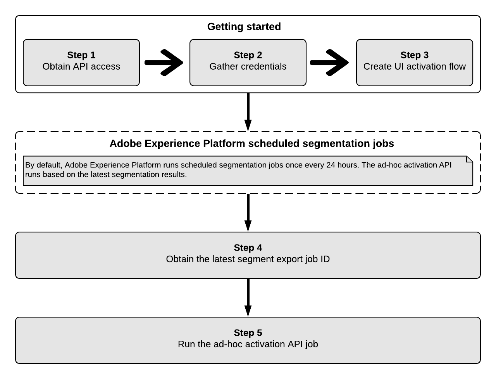
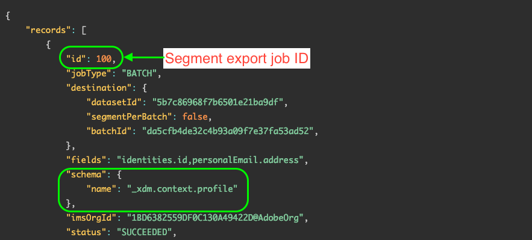
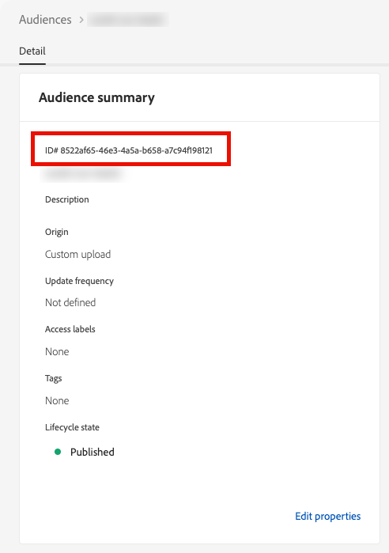

# アドホックアクティベーション APIを使用して、バッチ宛先にオンデマンドでオーディエンスをアクティベートできます

>[!IMPORTANT]
>
>Beta フェーズが完了すると、[!DNL ad-hoc activation API]がすべてのExperience Platformのお客様に一般公開（GA）されるようになりました。 GA版では、APIがバージョン 2にアップグレードされました。 手順4 （[APIではエクスポート IDが不要になったため、最新のオーディエンス書き出しジョブ ID](#segment-export-id)）の取得は不要になりました。
>
>詳しくは、このチュートリアルの下にある「[&#x200B; アドホックアクティベーションジョブを実行](#activation-job)」を参照してください。

## 概要 {#overview}

アドホックアクティベーション APIを使用すると、マーケターは、即座のアクティベーションが必要な状況に応じて、オーディエンスをプログラムによって宛先に迅速かつ効率的にアクティベートできます。

アドホックアクティベーション APIを使用して、フルファイルを目的のファイル受信システムに書き出します。 アドホックオーディエンスのアクティベーションは、[&#x200B; バッチファイルベースの宛先](../destination-types.md#file-based)でのみサポートされています。

次の図は、24時間ごとにExperience Platformで行われるセグメンテーションジョブを含む、アドホックアクティベーション APIを介してオーディエンスをアクティベートするエンドツーエンドのワークフローを示しています。



## ユースケース {#use-cases}

### フラッシュセールまたはプロモーション {#flash-sales}

オンラインのretailerは、期間限定のフラッシュセールを準備しており、短期間でお客様に通知したいと考えています。 Experience Platformのアドホックアクティベーション APIを使用することで、マーケティング部門はオーディエンスをオンデマンドで書き出し、顧客基盤にすばやくプロモーションメールを送信できます。

### 最新の出来事や速報 {#current-events}

ホテルは翌日の悪天候を予想しており、チームは到着するゲストに迅速に通知したいので、それに応じて計画を立てることができます。 マーケティング部門は、Experience Platformのアドホックアクティベーション APIを使用して、オーディエンスをオンデマンドで書き出し、ゲストに通知できます。

### 統合テスト {#integration-testing}

IT担当者は、Experience Platformのアドホックアクティベーション APIを使用してオーディエンスをオンデマンドで書き出すことができるため、[!DNL Adobe Experience Platform]とのカスタム統合をテストして、すべてが正しく動作していることを確認できます。

## ガードレール {#guardrails}

アドホックアクティベーション APIを使用する場合は、次のガードレールに注意してください。

* 現在、各アドホックアクティベーションジョブでは、最大80のオーディエンスをアクティベートできます。 1つのジョブにつき80を超えるオーディエンスをアクティベートしようとすると、ジョブが失敗します。 この動作は、今後のリリースで変更される可能性があります。
* スケジュールされた[&#x200B; オーディエンス書き出しジョブ &#x200B;](../../segmentation/api/export-jobs.md)と並行してアドホックアクティベーションジョブを実行することはできません。 アドホックアクティベーションジョブを実行する前に、スケジュールされたオーディエンス書き出しジョブが完了していることを確認します。 アクティベーションフローのステータスを監視する方法については、[宛先データフロー監視](../../dataflows/ui/monitor-destinations.md)を参照してください。 例えば、アクティベーションデータフローに&#x200B;**[!UICONTROL Processing]** ステータスが表示されている場合は、アドホックアクティベーションジョブを実行する前に、アクティベーションデータフローが終了するのを待ちます。
* オーディエンスごとに複数の同時アドホックアクティベーションジョブを実行しないでください。

## セグメント化の考慮事項 {#segmentation-considerations}

[!DNL Adobe Experience Platform]は、スケジュールされたセグメント化ジョブを24時間ごとに1回実行します。 アドホックアクティベーション APIは、最新のセグメント化結果に基づいて実行されます。

## ステップ 1：前提条件 {#prerequisites}

[!DNL Adobe Experience Platform] APIを呼び出す前に、次の前提条件を満たしていることを確認してください。

* [!DNL Adobe Experience Platform]へのアクセス権を持つ組織アカウントがあります。
* お使いのExperience Platform アカウントでは、`developer` API製品プロファイルに対して`user`および[!DNL Adobe Experience Platform]の役割が有効になっています。 アカウントでこれらのロールを有効にするには、[Admin Console](../../access-control/home.md)管理者にお問い合わせください。
* Adobe IDがあります。 Adobe IDをお持ちでない場合は、[Adobe Developer Console](https://developer.adobe.com/console)に移動して、新しいアカウントを作成してください。

## 手順2：資格情報の収集 {#credentials}

Experience Platform APIを呼び出すには、まず[認証チュートリアル &#x200B;](https://experienceleague.adobe.com/docs/experience-platform/landing/platform-apis/api-authentication.html?lang=ja)を完了する必要があります。 認証に関するチュートリアルを完了すると、すべての Experience Platform API 呼び出しで使用する、以下のような各必須ヘッダーの値が提供されます。

* Authorization: Bearer `{ACCESS_TOKEN}`
* x-api-key： `{API_KEY}`
* x-gw-ims-org-id: `{ORG_ID}`

Experience Platform のリソースは、特定の仮想サンドボックスに分離することができます。Experience Platform APIへのリクエストでは、操作を実行するサンドボックスの名前とIDを指定できます。 次に、オプションのパラメーターを示します。

* x-sandbox-name: `{SANDBOX_NAME}`

>[!NOTE]
>
>Experience Platform のサンドボックスについて詳しくは、[サンドボックスの概要ドキュメ ント](../../sandboxes/home.md)を参照してください。

ペイロード（POST、PUT、PATCH）を含むすべてのリクエストには、メディアのタイプを指定する以下のような追加ヘッダーが必要です。

* Content-Type: `application/json`

## 手順3:Experience Platform UIでのアクティベーションフローの作成 {#activation-flow}

アドホックアクティベーション APIを使用してオーディエンスをアクティベートするには、まず、選択した宛先に対してExperience Platform UIでアクティベーションフローを設定する必要があります。

これには、アクティベーションワークフローに入り、オーディエンスを選択し、スケジュールを設定して、アクティベートすることなどが含まれます。 UIまたはAPIを使用して、アクティベーションフローを作成できます。

* [Experience Platform UIを使用して、バッチプロファイル書き出し宛先へのアクティベーションフローを作成します](../ui/activate-batch-profile-destinations.md)
* [Flow Service APIを使用して、バッチプロファイル書き出し宛先に接続し、データをアクティベートします](../api/connect-activate-batch-destinations.md)

## 手順4：最新のオーディエンス書き出しジョブ IDの取得（v2では不要） {#segment-export-id}

>[!IMPORTANT]
>
>アドホックアクティベーション APIのv2では、最新のオーディエンス書き出しジョブ IDを取得する必要はありません。 この手順をスキップして、次の手順に進むことができます。

バッチ宛先のアクティベーションフローを設定すると、スケジュールされたセグメンテーションジョブが24時間ごとに自動的に実行され始めます。

アドホックアクティベーションジョブを実行する前に、最新のオーディエンス書き出しジョブのIDを取得する必要があります。 このIDは、アドホックアクティベーションジョブリクエストで渡す必要があります。

すべてのオーディエンス書き出しジョブのリストを取得するには、[ここ](../../segmentation/api/export-jobs.md#retrieve-list)で説明した手順に従います。

応答で、以下のスキーマプロパティを含む最初のレコードを探します。

```json
"schema":{
   "name":"_xdm.context.profile"
}
```

オーディエンス書き出しジョブ IDは、次に示すように`id` プロパティにあります。




## 手順5：アドホックアクティベーションジョブの実行 {#activation-job}

[!DNL Adobe Experience Platform]は、スケジュールされたセグメント化ジョブを24時間ごとに1回実行します。 アドホックアクティベーション APIは、最新のセグメント化結果に基づいて実行されます。

>[!IMPORTANT]
>
>次の1回限りの制約に注意してください。アドホックアクティベーションジョブを実行する前に、[手順3 - Experience Platform UIでアクティベーションフローを作成](#activation-flow)で設定したスケジュールに従って、オーディエンスが最初にアクティベートされた時点から少なくとも1時間が経過していることを確認します。

アドホックアクティベーションジョブを実行する前に、オーディエンスのスケジュールされたオーディエンス書き出しジョブが完了していることを確認します。 アクティベーションフローのステータスを監視する方法については、[宛先データフロー監視](../../dataflows/ui/monitor-destinations.md)を参照してください。 例えば、アクティベーションデータフローに&#x200B;**[!UICONTROL Processing]** ステータスが表示されている場合は、アドホックアクティベーションジョブを実行して完全なファイルを書き出す前に、アクティベーションデータフローが終了するのを待ちます。

オーディエンスの書き出しジョブが完了したら、アクティベーションをトリガーできます。

>[!NOTE]
>
>現在、各アドホックアクティベーションジョブでは、最大80のオーディエンスをアクティベートできます。 1つのジョブにつき80を超えるオーディエンスをアクティベートしようとすると、ジョブが失敗します。 この動作は、今後のリリースで変更される可能性があります。

### リクエスト {#request}

>[!IMPORTANT]
>
>アドホックアクティベーション APIのv2を使用するには、リクエストに`Accept: application/vnd.adobe.adhoc.activation+json; version=2` ヘッダーを含める必要があります。

セグメント化サービス以外のオーディエンス（例：[外部オーディエンスまたはカスタムアップロードオーディエンス &#x200B;](../../segmentation/ui/audience-portal.md#import-audience)）の場合は、外部オーディエンス IDではなく、リクエストでExperience Platformによって生成されたオーディエンス IDを指定する必要があります。 オーディエンス UIでオーディエンスの詳細ページを開くと、[&#x200B; オーディエンスの概要パネル &#x200B;](../../segmentation/ui/audience-portal.md#audience-summary)の上部に&#x200B;**ID#**&#x200B;と表示され、その後UUIDが表示されます。



```shell
curl --location --request POST 'https://platform.adobe.io/data/core/activation/disflowprovider/adhocrun' \
--header 'x-gw-ims-org-id: 5555467B5D8013E50A494220@AdobeOrg' \
--header 'Authorization: Bearer {{token}}' \
--header 'x-sandbox-id: 6ef74723-3ee7-46a4-b747-233ee7a6a41a' \
--header 'x-sandbox-name: {sandbox-id}' \
--header 'Accept: application/vnd.adobe.adhoc.activation+json; version=2' \
--header 'Content-Type: application/json' \
--data-raw '{
   "activationInfo":{
      "destinationId1":[
         "segmentId1",
         "segmentId2"
      ],
      "destinationId2":[
         "segmentId2",
         "segmentId3"
      ]
   }
}'
```

| プロパティ | 説明 |
| -------- | ----------- |
| <ul><li>`destinationId1`</li><li>`destinationId2`</li></ul> | オーディエンスをアクティブ化する宛先インスタンスのID。 これらのIDは、Experience Platform UIから取得できます。「**[!UICONTROL Destinations]** > **[!UICONTROL Browse]**」タブに移動し、目的の宛先行をクリックして、右側のパネルで宛先IDを表示します。 詳しくは、[宛先ワークスペースのドキュメント &#x200B;](/help/destinations/ui/destinations-workspace.md#browse)を参照してください。 |
| <ul><li>`segmentId1`</li><li>`segmentId2`</li><li>`segmentId3`</li></ul> | 選択した宛先に対してアクティブ化するオーディエンスのID。 アドホック APIを使用して、Experience Platformで生成されたオーディエンスと、外部（カスタムアップロード）オーディエンスを書き出すことができます。 外部オーディエンスをアクティブ化する場合は、オーディエンス IDの代わりにシステム生成IDを使用します。 システムで生成されたIDは、オーディエンス UIのオーディエンス概要ビューで確認できます。<br> 選択しないオーディエンス IDの{width="100" zoomable="yes"} <br> 使用するシステム生成オーディエンス IDの{width="100" zoomable="yes"} |

{style="table-layout:auto"}

### 書き出しIDを使用したリクエスト {#request-export-ids}

<!--

>[!IMPORTANT]
>
>**Deprecated request type**. This example type describes the request type for the API version 1. In the v2 of the ad-hoc activation API, you do not need to include the latest audience export job ID.

-->

```shell
curl -X POST https://platform.adobe.io/data/core/activation/disflowprovider/adhocrun \
 -H 'Authorization: Bearer {ACCESS_TOKEN}' \
 -H 'Content-Type: application/json' \
 -H 'x-gw-ims-org-id: {ORG_ID}' \
 -H 'x-api-key: {API_KEY}' \
 -d '
{
   "activationInfo":{
      "destinationId1":[
         "segmentId1",
         "segmentId2"
      ],
      "destinationId2":[
         "segmentId2",
         "segmentId3"
      ]
   },
   "exportIds":[
      "exportId1"
   ]
}
```

| プロパティ | 説明 |
| -------- | ----------- |
| <ul><li>`destinationId1`</li><li>`destinationId2`</li></ul> | オーディエンスをアクティブ化する宛先インスタンスのID。 これらのIDは、Experience Platform UIから取得できます。「**[!UICONTROL Destinations]** > **[!UICONTROL Browse]**」タブに移動し、目的の宛先行をクリックして、右側のパネルで宛先IDを表示します。 詳しくは、[宛先ワークスペースのドキュメント &#x200B;](/help/destinations/ui/destinations-workspace.md#browse)を参照してください。 |
| <ul><li>`segmentId1`</li><li>`segmentId2`</li><li>`segmentId3`</li></ul> | 選択した宛先に対してアクティブ化するオーディエンスのID。 |
| <ul><li>`exportId1`</li></ul> | [&#x200B; オーディエンス書き出し](../../segmentation/api/export-jobs.md#retrieve-list) ジョブの応答で返されたID。 このIDの検索方法については、[手順4：最新のオーディエンス書き出しジョブ ID](#segment-export-id)を取得するを参照してください。 |

{style="table-layout:auto"}

### 応答 {#response}

応答が成功すると、HTTP ステータス 200が返されます。

```shell
{
   "order":[
      {
         "segment":"db8961e9-d52f-45bc-b3fb-76d0382a6851",
         "order":"ef2dcbd6-36fc-49a3-afed-d7b8e8f724eb",
         "statusURL":"https://platform.adobe.io/data/foundation/flowservice/runs/88d6da63-dc97-460e-b781-fc795a7386d9"
      }
   ]
}
```

| プロパティ | 説明 |
| -------- | ----------- |
| `segment` | アクティブ化されたオーディエンスのID。 |
| `order` | オーディエンスがアクティブ化された宛先のID。 |
| `statusURL` | アクティベーションフローのステータス URL。 フローの進行状況は、[Flow Service API](../../sources/tutorials/api/monitor.md)を使用して追跡できます。 |

{style="table-layout:auto"}

## API エラー処理 {#api-error-handling}

Destination SDK API エンドポイントは、一般的な Experience Platform API エラーメッセージの原則に従います。Experience Platform トラブルシューティングガイドの[API ステータスコード &#x200B;](../../landing/troubleshooting.md#api-status-codes)および[&#x200B; リクエストヘッダーエラー](../../landing/troubleshooting.md#request-header-errors)を参照してください。

### アドホックアクティベーション APIに固有のAPI エラーコードとメッセージ {#specific-error-messages}

アドホックアクティベーション APIを使用する場合、このAPI エンドポイントに固有のエラーメッセージが表示される可能性があります。 表を確認して、それらの対処方法を確認します。

| エラーメッセージ | 解決策 |
|---------|----------|
| 実行ID `segment ID`の注文`dataflow ID`のオーディエンス `flow run ID`に対して、既に実行が行われています | このエラーメッセージは、オーディエンスに対してアドホックアクティベーションフローが現在進行中であることを示します。 ジョブが終了するのを待ってから、アクティベーションジョブを再度トリガーします。 |
| セグメント `<segment name>`は、このデータフローに含まれていないか、スケジュール範囲外です。 | このエラーメッセージは、アクティブ化するために選択したオーディエンスがデータフローにマッピングされていないか、オーディエンス用に設定されたアクティベーションスケジュールが期限切れであるか、まだ開始されていないことを示します。 オーディエンスが実際にデータフローにマッピングされているかどうかを確認し、オーディエンスアクティベーションスケジュールが現在の日付と重複していることを確認します。 |

## 関連情報 {#related-information}

* [Flow Service API を使用したバッチ宛先への接続とデータの有効化](/help/destinations/api/connect-activate-batch-destinations.md)
* [Experience Platform UIを使用して、オンデマンドでファイルをバッチ宛先に書き出します](/help/destinations/ui/export-file-now.md)