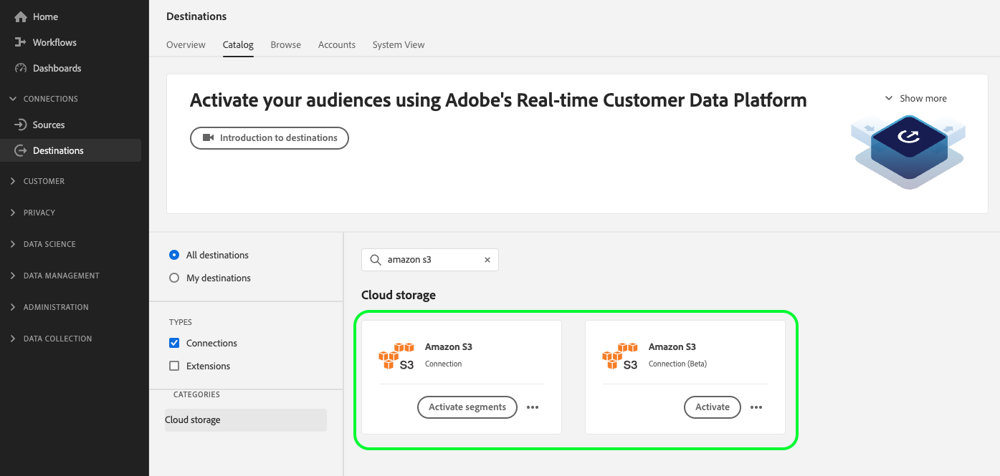

# クラウドストレージ宛先向けAPI移行ガイド

>[!IMPORTANT]
>
>* このページに記載されている機能は、[!DNL Real-Time CDP] PrimeおよびUltimate パッケージを購入したお客様が利用できます。 詳しくは、アドビ担当者にお問い合わせください。

## 移行コンテキスト {#migration-context}

[2022年10月](/help/release-notes/2022/october-2022.md#new-or-updated-destinations)以降、新しいファイル書き出し機能を使用して、Experience Platformからファイルを書き出す際に強化されたカスタマイズ機能にアクセスできます。

* 追加の[ファイル命名オプション](/help/destinations/ui/activate-batch-profile-destinations.md#configure-file-names)。
* [新しいマッピング手順](/help/destinations/ui/activate-batch-profile-destinations.md#mapping)を使用して、書き出したファイルにカスタムファイルヘッダーを設定できます。
* 書き出されたファイルの[ ファイルタイプ ](/help/destinations/ui/connect-destination.md#file-formatting-and-compression-options)を選択できます。
* 書き出されたCSV データファイルの形式を[ カスタマイズできます](/help/destinations/ui/batch-destinations-file-formatting-options.md)。

この機能は、以下に示すベータ版のクラウドストレージカードでサポートされています。

* [[!DNL (Beta) Amazon S3]](../../destinations/catalog/cloud-storage/amazon-s3.md#changelog)
* [[!DNL (Beta) Azure Blob]](../../destinations/catalog/cloud-storage/azure-blob.md#changelog)
* [[!DNL (Beta) SFTP]](../../destinations/catalog/cloud-storage/sftp.md#changelog)

<!--

Commenting out the three net new cloud storage destinations

* [[!DNL (Beta) Azure Data Lake Storage Gen2]](../../destinations/catalog/cloud-storage/adls-gen2.md)
* [[!DNL (Beta) Data Landing Zone]](../../destinations/catalog/cloud-storage/data-landing-zone.md)
* [[!DNL (Beta) Google Cloud Storage]](../../destinations/catalog/cloud-storage/google-cloud-storage.md)

-->

現在、Experience Platform UIでは、3つの宛先の2つの宛先カードが並べて表示されます。 以下に、[!DNL Amazon S3]のレガシーと新しい宛先を示します。 いずれの場合も、**Beta**&#x200B;とマークされたカードが新しい宛先カードになります。



これらの強化機能を備えた配信先は当初ベータ版として提供されましたが、*Adobeでは現在、すべての[!DNL Real-Time CDP]のお客様を新しいクラウドストレージの配信先*&#x200B;に移行しています。 既に[!DNL Amazon S3]、[!DNL Azure Blob]、またはSFTPを使用していたお客様の場合、既存のデータフローが新しいカードに移行されます。 移行の一部としての特定の変更について詳しくは、この節を参照してください。

## このページの適用先 {#who-this-applies-to}

既に[Flow Service API](https://developer.adobe.com/experience-platform-apis/references/destinations/)を使用してプロファイルをAmazon S3、Azure Blob、またはSFTP クラウドストレージに書き出している場合は、このAPI移行ガイドが適用されます。

Experience Platformから書き出されたファイルの上にある[!DNL Amazon S3]、[!DNL Azure Blob]、またはSFTP クラウドストレージの場所でスクリプトを実行している場合、新しいカードの接続とフロー仕様、およびマッピング手順に関して、一部のパラメーターが変更されていることに注意してください。

例えば、スクリプトを使用して、[!DNL Amazon S3]宛先の接続仕様に基づいて[!DNL Amazon S3]宛先への宛先データフローをフィルタリングする場合、接続仕様が変更されるため、フィルターを更新する必要があります。

## 関連ドキュメントリンク {#relevant-documentation-links}

この節では、クラウドストレージの宛先にデータを書き出す強化機能に関する関連するAPI チュートリアルとリファレンスドキュメントを示します。

* [クラウドストレージの宛先にオーディエンスを書き出すAPI チュートリアル](/help/destinations/api/activate-segments-file-based-destinations.md)
* [宛先フローサービス API リファレンスドキュメント ](https://developer.adobe.com/experience-platform-apis/references/destinations/)

## 後方互換性のない変更の概要 {#summary-backwards-incompatible-changes}

新しい宛先への移行を行うと、既存の[!DNL Amazon S3]、[!DNL Azure Blob]、およびSFTP宛先へのすべてのデータフローに、新しいターゲット接続とベース接続が割り当てられるようになりました。 プロファイルマッピングステップも変更されます。 後方互換性のない変更は、各宛先について以下の節で要約されています。 以下の図の用語について詳しくは、[宛先の用語集](https://developer.adobe.com/experience-platform-apis/references/destinations/#tag/Glossary)も参照してください。


### 下位互換性のない[!DNL Amazon S3]宛先への変更 {#changes-amazon-s3-destination}

API ユーザーの後方互換性のない変更は、次の表に示すように、更新された`connection spec ID`および`flow spec ID`です。

| [!DNL Amazon S3] | レガシー | 新規 |
|---------|----------|---------|
| フロー仕様 | 71471eba-b620-49e4-90fd-23f1fa0174d8 | 1a0514a6-33d4-4c7f-aff8-594799c47549 |
| 接続仕様 | 4890fc95-5a1f-4983-94bb-e060c08e3f81 | 4fce964d-3f37-408f-9778-e597338a21ee |

[!DNL Amazon S3]の完全なレガシーおよび新しいベース接続とターゲット接続の例を以下のタブで表示します。 [!DNL Amazon S3]宛先のベース接続を作成するために必要なパラメーターは変更されません。

同様に、ターゲット接続の作成に必要なパラメーターに、後方互換性のない変更はありません。

>[!BEGINTABS]

>[!TAB 従来のベース接続とターゲット接続]

+++[!DNL base connection]のレガシー[!DNL Amazon S3]を表示

```json {line-numbers="true" start-line="1" highlight="5"}
{
  ...
  "name": "amazon-s3",
  "connectionSpec": {
    "id": "4890fc95-5a1f-4983-94bb-e060c08e3f81",
    "version": "1.0"
  },
  "state": "enabled",
  "auth": {
    "specName": "Access Key",
    "params": {
      "authorizedDate": "2022-10-26",
      "s3SecretKey": "<your-secret-key>",
      "s3AccessKey": "<your-access-key>"
    }
  },
  "encryption": {
    "specName": "File Encryption",
    "params": {
      "encryptionAlgo": "PGP/GPG",
      "publicKey": "<publicKey>"
    }
  },
  "version": "\"640418e2-0000-0200-0000-6359b9ef0000\"",
  "etag": "\"640418e2-0000-0200-0000-6359b9ef0000\""
}
```

+++

+++[!DNL target connection]のレガシー[!DNL Amazon S3]を表示

```json {line-numbers="true" start-line="1" highlight="12"}
{
  ...
  "name": "test 121",
  "baseConnectionId": "ee86d122-10d3-434b-81c7-7252e4d747a7",
  "state": "enabled",
  "data": {
    "format": "CSV",
    "schema": null,
    "properties": null
  },
  "connectionSpec": {
    "id": "4890fc95-5a1f-4983-94bb-e060c08e3f81",
    "version": "1.0"
  },
  "params": {
    "mode": "S3",
    "path": "testpath",
    "bucketName": "test"
  },
  "version": "\"1609cd86-0000-0200-0000-63892cbb0000\"",
  "etag": "\"1609cd86-0000-0200-0000-63892cbb0000\"",
  "inheritedAttributes": {
    "baseConnection": {
      "id": "ee86d122-10d3-434b-81c7-7252e4d747a7",
      "connectionSpec": {
        "id": "4890fc95-5a1f-4983-94bb-e060c08e3f81",
        "version": "1.0"
      }
    }
  }
}
```

+++

>[!TAB 新しいベース接続とターゲット接続]

+++[!DNL base connection]の新しい[!DNL Amazon S3]を表示

```json {line-numbers="true" start-line="1" highlight="5"}
{
  ...
  "name": "Amazon S3",
  "connectionSpec": {
    "id": "4fce964d-3f37-408f-9778-e597338a21ee",
    "version": "1.0"
  },
  "state": "enabled",
  "auth": {
    "specName": "Access Key",
    "params": {
      "authorizedDate": "2022-10-26",
      "s3SecretKey": "<your-secret-key>",
      "s3AccessKey": "<your-access-key>"
    }
  },
  "encryption": {
    "specName": "File Encryption",
    "params": {
      "encryptionAlgo": "PGP/GPG",
      "publicKey": "<publicKey>"
    }
  },
  "version": "\"3708da21-0000-0200-0000-638940b10000\"",
  "etag": "\"3708da21-0000-0200-0000-638940b10000\""
}
```

+++

+++[!DNL target connection]の新しい[!DNL Amazon S3]を表示

```json {line-numbers="true" start-line="1" highlight="12, 16-27"}
{
  ...
  "name": "test 121",
  "baseConnectionId": "d114c86f-fd47-4bb6-846c-cb1d15a00fe9",
  "state": "enabled",
  "data": {
    "format": "CSV",
    "schema": null,
    "properties": null
  },
  "connectionSpec": {
    "id": "4fce964d-3f37-408f-9778-e597338a21ee",
    "version": "1.0"
  },
  "params": {
    "csvOptions": {
      "nullValue": "null",
      "emptyValue": "",
      "escape": "\\",
      "quote": "",
      "delimiter": ","
    },
    "compression": "NONE",
    "fileType": "CSV",
    "mode": "Server-to-server",
    "path": "testpath",
    "bucketName": "test"
  },
  "version": "\"1b0985c6-0000-0200-0000-638940b10000\"",
  "etag": "\"1b0985c6-0000-0200-0000-638940b10000\"",
  "inheritedAttributes": {
    "baseConnection": {
      "id": "d114c86f-fd47-4bb6-846c-cb1d15a00fe9",
      "connectionSpec": {
        "id": "4fce964d-3f37-408f-9778-e597338a21ee",
        "version": "1.0"
      }
    }
  }
}
```

+++

>[!ENDTABS]

### 後方互換性のない[!DNL Azure Blob]宛先への変更 {#changes-azure-blob-destination}

API ユーザーの後方互換性のない変更は、次の表に示すように、更新された`connection spec ID`および`flow spec ID`です。

| [!DNL Azure Blob] | レガシー | 新規 |
|---------|----------|---------|
| フロー仕様 | 71471eba-b620-49e4-90fd-23f1fa0174d8 | 752d422f-b16f-4f0d-b1c6-26e448e3b388 |
| 接続仕様 | e258278b-a4cf-43ac-b158-4fa0ca0d948b | 6d6b59bf-fb58-4107-9064-4d246c0e5bb2 |

[!DNL Azure Blob]の完全なレガシーおよび新しいベース接続とターゲット接続の例を以下のタブで表示します。 Azure Blobの宛先のベース接続を作成するために必要なパラメーターは変更されません。

同様に、ターゲット接続の作成に必要なパラメーターに、後方互換性のない変更はありません。

>[!BEGINTABS]

>[!TAB 従来のベース接続とターゲット接続]

+++[!DNL base connection]のレガシー[!DNL Azure Blob]を表示

```json {line-numbers="true" start-line="1" highlight="5"}
{
  ...
  "name": "azure-blob",
  "connectionSpec": {
    "id": "e258278b-a4cf-43ac-b158-4fa0ca0d948b",
    "version": "1.0"
  },
  "state": "enabled",
  "auth": {
    "specName": "ConnectionString",
    "params": {
      "authorizedDate": "2022-06-02",
      "connectionString": "<your-connection-string>"
    }
  },
  "encryption": {
    "specName": "File Encryption",
    "params": {
      "encryptionAlgo": "PGP/GPG",
      "publicKey": "<publicKey>"
    }
  }, 
  "version": "\"d000d23c-0000-0200-0000-6299051c0000\"",
  "etag": "\"d000d23c-0000-0200-0000-6299051c0000\""
}
```

+++

+++[!DNL target connection]のレガシー[!DNL Azure Blob]を表示

```json {line-numbers="true" start-line="1" highlight="13"}
{
  ...
  "name": "v1",
  "description": "v2",
  "baseConnectionId": "d10fcecf-9963-4062-820c-0f878be98805",
  "state": "enabled",
  "data": {
    "format": "CSV",
    "schema": null,
    "properties": null
  },
  "connectionSpec": {
    "id": "e258278b-a4cf-43ac-b158-4fa0ca0d948b",
    "version": "1.0"
  },
  "params": {
    "mode": "AZURE_BLOB",
    "container": "usdasda",
    "path": "v3"
  },
  "version": "\"cb0468ba-0000-0200-0000-631ab0790000\"",
  "etag": "\"cb0468ba-0000-0200-0000-631ab0790000\"",
  "inheritedAttributes": {
    "baseConnection": {
      "id": "d10fcecf-9963-4062-820c-0f878be98805",
      "connectionSpec": {
        "id": "e258278b-a4cf-43ac-b158-4fa0ca0d948b",
        "version": "1.0"
      }
    }
  }
}
```

+++

>[!TAB 新しいベース接続とターゲット接続]

+++[!DNL base connection]の新しい[!DNL Azure Blob]を表示

```json {line-numbers="true" start-line="1" highlight="5"}
{
  ...
  "name": "Azure Blob Storage",
  "connectionSpec": {
    "id": "6d6b59bf-fb58-4107-9064-4d246c0e5bb2",
    "version": "1.0"
  },
  "state": "enabled",
  "auth": {
    "specName": "ConnectionString",
    "params": {
      "authorizedDate": "2022-06-02",      
      "connectionString": "<your-connection-string>"
    }
  },
  "encryption": {
    "specName": "File Encryption",
    "params": {
      "encryptionAlgo": "PGP/GPG",
      "publicKey": "<publicKey>"
    }
  },
  "version": "\"4008a892-0000-0200-0000-6389890d0000\"",
  "etag": "\"4008a892-0000-0200-0000-6389890d0000\""
}
```

+++

+++[!DNL target connection]の新しい[!DNL Azure Blob]を表示

```json {line-numbers="true" start-line="1" highlight="13, 17-25"}
{
  ...
  "name": "v1",
  "description": "v2",
  "baseConnectionId": "1329d183-a3ee-4454-ab3f-e2388082bf29",
  "state": "enabled",
  "data": {
    "format": "CSV",
    "schema": null,
    "properties": null
  },
  "connectionSpec": {
    "id": "6d6b59bf-fb58-4107-9064-4d246c0e5bb2",
    "version": "1.0"
  },
  "params": {
    "csvOptions": {
      "nullValue": "null",
      "emptyValue": "",
      "escape": "\\",
      "quote": "",
      "delimiter": ","
    },
    "compression": "NONE",
    "fileType": "CSV",
    "mode": "Server-to-server",
    "container": "usdasda",
    "path": "v3"
  },
  "version": "\"5509fe3f-0000-0200-0000-638a28880000\"",
  "etag": "\"5509fe3f-0000-0200-0000-638a28880000\"",
  "inheritedAttributes": {
    "baseConnection": {
      "id": "1329d183-a3ee-4454-ab3f-e2388082bf29",
      "connectionSpec": {
        "id": "6d6b59bf-fb58-4107-9064-4d246c0e5bb2",
        "version": "1.0"
      }
    }
  }
}
```

+++

>[!ENDTABS]

### 後方互換性のないSFTP宛先への変更 {#changes-sftp-destination}

API ユーザーの後方互換性のない変更は、次の表に示すように、更新された`connection spec ID`および`flow spec ID`です。

| SFTP | レガシー | 新規 |
|---------|----------|---------|
| フロー仕様 | 71471eba-b620-49e4-90fd-23f1fa0174d8 | fd36aaa4-bf2b-43fb-9387-43785eeb799 |
| 接続仕様 | 64ef4b8b-a6e0-41b5-9677-3805d1ee5dd0 | 36965a81-b1c6-401b-99f8-22508f1e6a26 |

上記の更新されたフローと接続仕様に加えて、SFTP ベース接続の作成時に必要なパラメーターに変更があります。

* 以前は、SFTP宛先のベース接続には`host` パラメーターが必要でした。 このパラメーターの名前が`domain`に変更されました。

以下のタブで、レガシーおよび新しいベース接続とターゲット接続の例をすべて表示し、変更された行を強調表示します。 SFTP宛先のターゲット接続を作成するために必要なパラメーターは変更されません。

>[!BEGINTABS]

>[!TAB 従来のベース接続とターゲット接続]

+++SFTP - パスワード認証のレガシー[!DNL base connection]を表示

```json {line-numbers="true" start-line="1" highlight="5,15"}
{
  ...
  "name": "sftp",
  "connectionSpec": {
    "id": "64ef4b8b-a6e0-41b5-9677-3805d1ee5dd0",
    "version": "1.0"
  },
  "state": "enabled",
  "auth": {
    "specName": "Basic Authentication for sftp",
    "params": {
      "authorizedDate": "2022-06-02",
      "password": "<your-password>",
      "userName": "DPID12345",
      "host": "ftp-out.demdex.com"
    }
  },
  "encryption": {
    "specName": "File Encryption",
    "params": {
      "encryptionAlgo": "PGP/GPG",
      "publicKey": "<publicKey>"
    }
  },
  "version": "\"d000013c-0000-0200-0000-629903bd0000\"",
  "etag": "\"d000013c-0000-0200-0000-629903bd0000\""
}
```

+++

+++[!DNL base connection]認証のレガシー[!DNL SFTP - SSH key]を表示

```json {line-numbers="true" start-line="1" highlight="5,15"}
{
  ...
  "name": "sftp",
  "connectionSpec": {
    "id": "64ef4b8b-a6e0-41b5-9677-3805d1ee5dd0",
    "version": "1.0"
  },
  "state": "enabled",
  "auth": {
    "specName": "Basic Authentication for sftp",
    "params": {
      "authorizedDate": "2022-06-02",
      "sshKey": "<your-ssh-key>",
      "userName": "DPID12345",
      "port": 22
      "domain": "ftp-out.demdex.com"
    }
  },
  "encryption": {
    "specName": "File Encryption",
    "params": {
      "encryptionAlgo": "PGP/GPG",
      "publicKey": "<publicKey>"
    }
  },
  "version": "\"d000013c-0000-0200-0000-629903bd0000\"",
  "etag": "\"d000013c-0000-0200-0000-629903bd0000\""
}
```

+++

+++SFTPのレガシー[!DNL target connection]を表示

```json {line-numbers="true" start-line="1" highlight="13"}
{
  ...
  "name": "test sftp 6/2",
  "description": "",
  "baseConnectionId": "e6f3a300-0bf7-4755-b7f8-308dc2a99133",
  "state": "enabled",
  "data": {
    "format": "CSV",
    "schema": null,
    "properties": null
  },
  "connectionSpec": {
    "id": "64ef4b8b-a6e0-41b5-9677-3805d1ee5dd0",
    "version": "1.0"
  },
  "params": {
    "mode": "FTP",
    "remotePath": "test"
  },
  "version": "\"8503ab91-0000-0200-0000-629903ce0000\"",
  "etag": "\"8503ab91-0000-0200-0000-629903ce0000\"",
  "inheritedAttributes": {
    "baseConnection": {
      "id": "e6f3a300-0bf7-4755-b7f8-308dc2a99133",
      "connectionSpec": {
        "id": "64ef4b8b-a6e0-41b5-9677-3805d1ee5dd0",
        "version": "1.0"
      }
    }
  }
}
```

+++

>[!TAB 新しいベース接続とターゲット接続]

+++[!DNL base connection]の新しい[!DNL SFTP - password authentication]を表示

```json {line-numbers="true" start-line="1" highlight="5"}
{
  ...
  "name": "SFTP",
  "connectionSpec": {
    "id": "36965a81-b1c6-401b-99f8-22508f1e6a26",
    "version": "1.0"
  },
  "state": "enabled",
  "auth": {
    "specName": "SFTP with Password",
    "params": {
      "authorizedDate": "2022-06-02",
      "domain": "ftp-out.demdex.com",
      "username": "DPID12345",
      "password": "<your-password>",
      "port": 22      
    }
  },
  "encryption": {
    "specName": "File Encryption",
    "params": {
      "encryptionAlgo": "PGP/GPG",
      "publicKey": "<publicKey>"
    }
  },
  "version": "\"420826cc-0000-0200-0000-638999a60000\"",
  "etag": "\"420826cc-0000-0200-0000-638999a60000\""
}
```

+++

+++[!DNL base connection]認証用の新しい[!DNL SFTP - SSH key]を表示

```json {line-numbers="true" start-line="1" highlight="5,12"}
{
  ...
  "name": "SFTP",
  "connectionSpec": {
    "id": "36965a81-b1c6-401b-99f8-22508f1e6a26",
    "version": "1.0"
  },
  "state": "enabled",
  "auth": {
    "specName": "Basic Authentication for sftp",
    "params": {
      "authorizedDate": "2022-06-02",
      "domain": "ftp-out.demdex.com",
      "username": "DPID12345",
      "sshKey": "<your-ssh-key>",
    }
  },
  "encryption": {
    "specName": "File Encryption",
    "params": {
      "encryptionAlgo": "PGP/GPG",
      "publicKey": "<publicKey>"
    }
  },
  "version": "\"420826cc-0000-0200-0000-638999a60000\"",
  "etag": "\"420826cc-0000-0200-0000-638999a60000\""
}
```

+++

+++SFTPの新しい[!DNL target connection]を表示

```json {line-numbers="true" start-line="1" highlight="13, 17-25"}
{
  ...
  "name": "test sftp 6/2",
  "description": "",
  "baseConnectionId": "af63fbe1-45ff-4722-a9de-fbbe789dc7b0",
  "state": "enabled",
  "data": {
    "format": "CSV",
    "schema": null,
    "properties": null
  },
  "connectionSpec": {
    "id": "36965a81-b1c6-401b-99f8-22508f1e6a26",
    "version": "1.0"
  },
  "params": {
    "csvOptions": {
      "nullValue": "null",
      "emptyValue": "",
      "escape": "\\",
      "quote": "",
      "delimiter": ","
    },
    "compression": "NONE",
    "fileType": "CSV",
    "mode": "FTP",
    "remotePath": "test"
  },
  "version": "\"5509b5cf-0000-0200-0000-638a2ab60000\"",
  "etag": "\"5509b5cf-0000-0200-0000-638a2ab60000\"",
  "inheritedAttributes": {
    "baseConnection": {
      "id": "af63fbe1-45ff-4722-a9de-fbbe789dc7b0",
      "connectionSpec": {
        "id": "36965a81-b1c6-401b-99f8-22508f1e6a26",
        "version": "1.0"
      }
    }
  }
}
```

+++

>[!ENDTABS]

### [!DNL Amazon S3]、[!DNL Azure Blob]、およびSFTPの宛先に共通する後方互換性のない変更 {#changes-all-destinations}

3つすべての宛先のプロファイルセレクターステップは、必要に応じて、書き出したファイルの列ヘッダーの名前を変更するためのマッピングステップに置き換えられます。 左側に古い属性セレクターステップ、右側に新しいマッピングステップを配置した下の画像を並べて見てみましょう。


従来の例の`profileSelectors` オブジェクトが新しい`profileMapping` オブジェクトに置き換えられることに注意してください。

データをクラウドストレージの宛先に書き出すための`profileMapping`API チュートリアルで、[ オブジェクトの設定に関する詳細を確認してください](/help/destinations/api/activate-segments-file-based-destinations.md#attribute-and-identity-mapping)。

>[!BEGINTABS]

>[!TAB 古い変換パラメーター]

+++古い変換パラメーターの例を表示

```json{line-numbers="true" start-line="1" highlight="4-40, 45-53"}
{
  "segmentSelectors": { // shortened for brevity since nothing changes in the audience selectors
  },  
  "profileSelectors": {
    "selectors": [
      {
        "type": "JSON_PATH",
        "value": {
          "path": "CORE",
          "operator": "EXISTS",
          "mapping": {
            "sourceType": "text/x.schema-path",
            "source": "CORE",
            "destination": "CORE",
            "identity": false,
            "primaryIdentity": false,
            "functionVersion": 0,
            "sourceAttribute": "CORE",
            "destinationXdmPath": "CORE"
          },
          "identity": {
            "namespace": "CORE"
          }
        }
      },
      ...
      {
        "type": "JSON_PATH",
        "value": {
          "path": "segmentMembership.status",
          "operator": "EXISTS",
          "mapping": {
            "sourceType": "text/x.schema-path",
            "source": "segmentMembership.status",
            "destination": "segmentMembership.status",
            "identity": false,
            "primaryIdentity": false,
            "functionVersion": 0,
            "sourceAttribute": "segmentMembership.status",
            "destinationXdmPath": "segmentMembership.status"
          }
        }
      }
    ],
    "mandatoryFields": [
      "CORE",
      "person.name.lastName",
      "personalEmail.address"
    ],
    "primaryFields": [
      {
        "identityNamespace": "CORE",
        "fieldType": "IDENTITY"
      }
    ]
  }
}
```

+++

>[!TAB 新しい変換パラメーター]

+++移行後の変換パラメーターの例を表示

以下の設定例では、`profileSelectors` フィールドが`profileMapping` オブジェクトに置き換えられたことに注意してください。

```json {line-numbers="true" start-line="1" highlight="4-12, 18-20"}
{
  "segmentSelectors": { // shortened for brevity since nothing changes in the audience selectors
  },  
  "mandatoryFields": [
    "CORE",
    "person_name_lastName",
    "personalEmail_address"
  ],
  "primaryFields": [
    {
      "identityNamespace": "CORE",
      "fieldType": "IDENTITY"
    }
  ],
  "identityMapping": {
    "mappings": []
  },
  "profileMapping": {
    "mappingId": "40dfd952fe09498ba65145c7a5de3e07",
    "mappingVersion": 0
  },
  "attributeMapping": {}
}
```

+++

>[!ENDTABS]

## 移行のタイムラインとアクション項目 {#timeline-and-action-items}

レガシーデータフローを[!DNL Amazon S3]、[!DNL Azure Blob]およびSFTP宛先の新しい宛先カードに移行する場合は、組織の移行準備が整い次第、2023年7月26日&#x200B;**までに行われます。**

移行日が近づくと、Adobeからリマインダーメールが届きます。 移行の準備を整えるには、以下のアクション項目の節を参照してください。

### アクションアイテム {#action-items}

[!DNL Amazon S3]、[!DNL Azure Blob]、およびSFTP クラウドストレージの宛先を新しいカードに移行する前に、以下の提案に従ってスクリプトと自動API呼び出しを更新する準備をしてください。

1. 2023年7月26日（PT）までに、既存の[!DNL Amazon S3]、[!DNL Azure Blob]、またはSFTP クラウドストレージの宛先に対するスクリプトまたは自動API呼び出しを更新します。 従来の接続仕様またはフロー仕様を活用する自動API呼び出しまたはスクリプトは、新しい接続仕様またはフロー仕様に更新する必要があります。
2. 7月26日より前にスクリプトが更新された場合は、Adobe アカウント担当者にお問い合わせください。
3. 例えば、`targetConnectionSpecId`は、データフローが新しい宛先カードに移行されたかどうかを判断するためのフラグとして使用できます。 `if`条件でスクリプトを更新して、`flow.inheritedAttributes.targetConnections[0].connectionSpec.id`のレガシーおよび更新されたターゲット接続仕様を確認し、データフローが移行されたかどうかを判断できます。 このページの各宛先の特定のセクションで、従来の接続仕様と新しい接続仕様IDを確認できます。
4. Adobe アカウントチームは、データフローがいつ移行されるかについてさらに詳しく連絡します。
5. 7月26日以降、すべてのデータフローが移行されます。 既存のすべてのデータフローに、新しいフローエンティティ（接続仕様、フロー仕様、ベース接続、ターゲット接続）が追加されます。 従来のフローエンティティを使用する側のスクリプトまたはAPI呼び出しは、動作しなくなります。

## 移行に関するその他の考慮事項 {#other-considerations}

移行中または移行後の書き出しに関する既存のスケジュールには影響されないことに注意してください。

## 次の手順 {#next-steps}

クラウドストレージの宛先の移行に備えて、必要なアクションを実行する必要があるかどうかを確認できました。 また、Experience Platformから任意のクラウドストレージの宛先にファイルを書き出すために、API ベースのワークフローを設定する際に参照すべきドキュメントページも把握できます。 次に、API チュートリアルを表示して、[ データをクラウドストレージの宛先](/help/destinations/api/activate-segments-file-based-destinations.md)に書き出すことができます。
