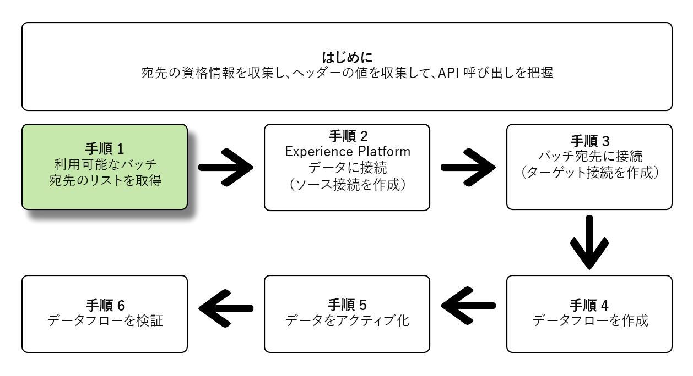
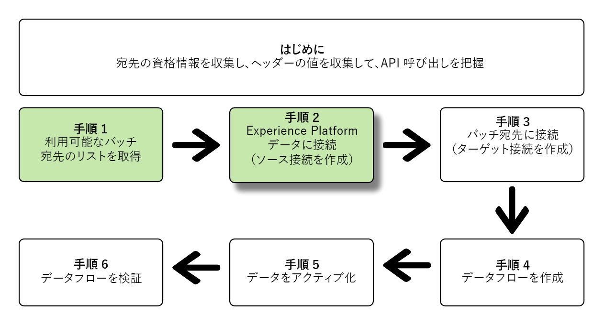
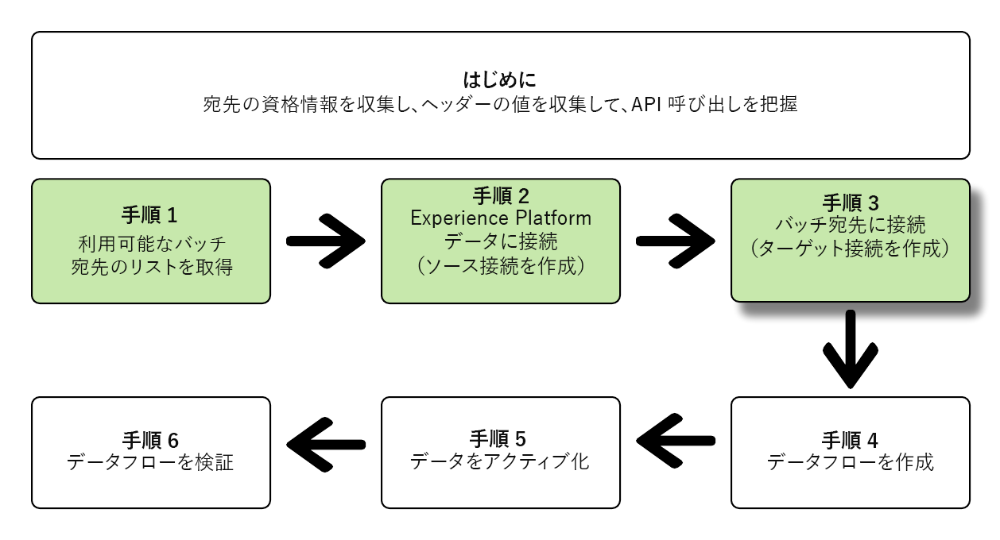
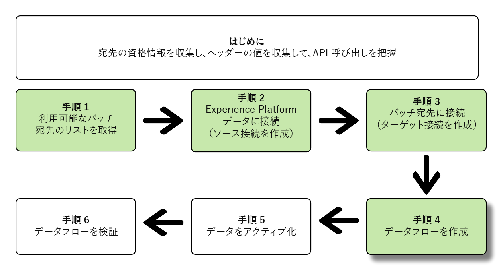
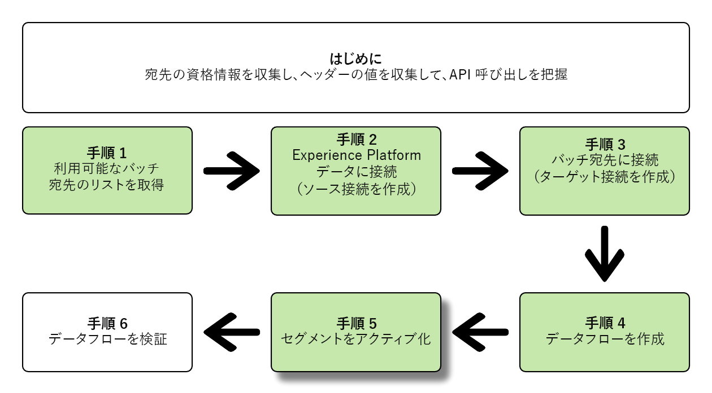
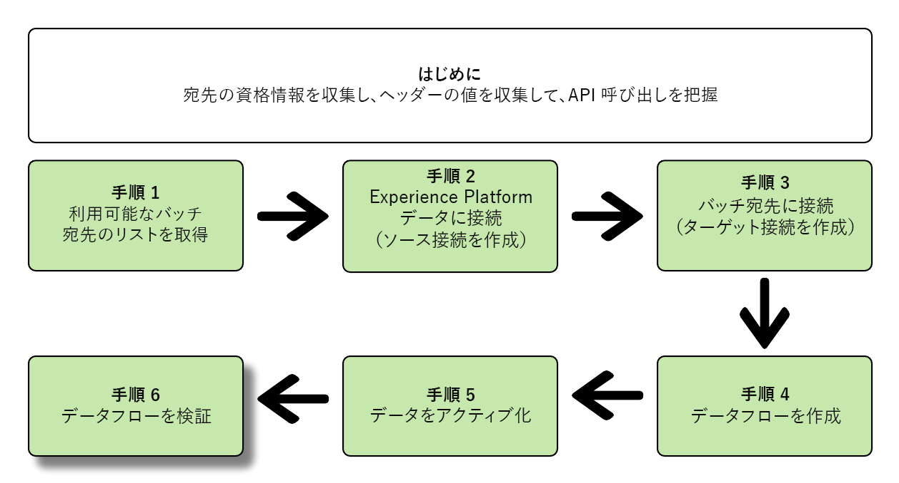

# Flow Service API を使用したバッチ宛先への接続とデータの有効化

>[!IMPORTANT]
> 
>宛先に接続するには、 **[!UICONTROL 宛先の管理]** [アクセス制御権限](/help/access-control/home.md#permissions).
>
>データをアクティブ化するには、 **[!UICONTROL 宛先の管理]**, **[!UICONTROL 宛先のアクティブ化]**, **[!UICONTROL プロファイルの表示]**、および **[!UICONTROL セグメントを表示]** [アクセス制御権限](/help/access-control/home.md#permissions).
>
>詳しくは、 [アクセス制御の概要](/help/access-control/ui/overview.md) または製品管理者に問い合わせて、必要な権限を取得してください。

このチュートリアルでは、Flow Service API を使用して、[クラウドストレージ](../catalog/cloud-storage/overview.md)または[メールマーケティングのバッチ宛先](../catalog/email-marketing/overview.md)を作成し、新しく作成した宛先にデータフローを作成し、CSV ファイルを使用してデータを書き出す方法を実演します。

このチュートリアルでは、すべての例で [!DNL Adobe Campaign] 宛先を使用しますが、どのクラウドストレージおよびメールマーケティングのバッチ宛先でも手順は同じです。


Platform ユーザーインターフェイスを使用して宛先に接続し、データを有効化する場合は、[宛先の接続](../ui/connect-destination.md)および[プロファイル書き出しのバッチ宛先に対するオーディエンスデータの有効化](../ui/activate-batch-profile-destinations.md)に関するチュートリアルを参照してください。

## はじめに {#get-started}

このガイドでは、Adobe Experience Platform の次のコンポーネントに関する十分な知識が必要です。

* [[!DNL Experience Data Model (XDM) System]](../../xdm/home.md)：[!DNL Experience Platform] がカスタマーエクスペリエンスのデータの整理に使用する、標準化されたフレームワーク。
* [[!DNL Segmentation Service]](../../segmentation/api/overview.md)：[!DNL Adobe Experience Platform Segmentation Service] により、[!DNL Adobe Experience Platform] で [!DNL Real-time Customer Profile] のデータからセグメントを作成し、オーディエンスを生成できます。
* [[!DNL Sandboxes]](../../sandboxes/home.md)：[!DNL Experience Platform] には、単一の [!DNL Platform] インスタンスを別々の仮想環境に分割し、デジタルエクスペリエンスアプリケーションの開発と発展に役立つ仮想サンドボックスが用意されています。

以下の節では、Platform でバッチ宛先に対してデータを有効化するために必要な追加情報を示します。

### 必要な認証情報の収集 {#gather-required-credentials}

このチュートリアルの手順を完了するには、接続してセグメントを有効化する宛先の種類に応じて、次の資格情報を準備しておく必要があります。

* [!DNL Amazon S3] 接続：`accessId`、`secretKey`
* [!DNL Adobe Campaign] への [!DNL Amazon S3] 接続：`accessId`、`secretKey`
* SFTP 接続：`domain`、`port`、`username`、`password` または `sshKey`（FTP ロケーションへの接続方法による）
* [!DNL Azure Blob] 接続：`connectionString`

>[!NOTE]
>
>[!DNL Adobe Campaign] への [!DNL Amazon S3] 接続の資格情報 `accessId`、`secretKey` と、[!DNL Amazon S3] 接続の資格情報 `accessId`、`secretKey` は同一です。

### API 呼び出し例の読み取り {#reading-sample-api-calls}

このチュートリアルでは、API 呼び出しの例を提供し、リクエストの形式を設定する方法を示します。この中には、パス、必須ヘッダー、適切な形式のリクエストペイロードが含まれます。また、API レスポンスで返されるサンプル JSON も示されています。ドキュメントで使用される API 呼び出し例の表記について詳しくは、 トラブルシューテングガイドの[API 呼び出し例の読み方](../../landing/troubleshooting.md#how-do-i-format-an-api-request)に関する節を参照してください[!DNL Experience Platform]。

### 必須ヘッダーおよびオプションヘッダーの値の収集 {#gather-values-headers}

[!DNL Platform] API を呼び出すには、まず[認証チュートリアル](https://experienceleague.adobe.com/docs/experience-platform/landing/platform-apis/api-authentication.html?lang=ja)を完了する必要があります。次に示すように、すべての [!DNL Experience Platform] API 呼び出しに必要な各ヘッダーの値は認証チュートリアルで説明されています。

* Authorization： Bearer `{ACCESS_TOKEN}`
* x-api-key： `{API_KEY}`
* x-gw-ims-org-id： `{ORG_ID}`

[!DNL Experience Platform] のリソースは、特定の仮想サンドボックスに分離できます。[!DNL Platform] API へのリクエストでは、操作を実行するサンドボックスの名前と ID を指定できます。次に、オプションのパラメーターを示します。

* x-sandbox-name：`{SANDBOX_NAME}`

>[!NOTE]
>
>[!DNL Experience Platform] のサンドボックスについて詳しくは、[サンドボックスの概要に関するドキュメント](../../sandboxes/home.md)を参照してください。

ペイロード（POST、PUT、PATCH）を含むすべてのリクエストには、メディアのタイプを指定する以下のような追加ヘッダーが必要です。

* Content-Type: `application/json`

### API リファレンスドキュメント {#api-reference-documentation}

このチュートリアルに含まれるすべての API 操作について、付属リファレンスドキュメントが用意されています。詳しくは、[Adobe I/O にある Flow Service API ドキュメント](https://www.adobe.io/experience-platform-apis/references/flow-service/)を参照してください。このチュートリアルと API リファレンスのドキュメントを並行して使用することをお勧めします。

## 使用可能な宛先のリストの取得 {#get-the-list-of-available-destinations}



最初の手順として、データを有効化する宛先を決定する必要があります。最初に、接続してセグメントをアクティブ化できる、使用可能な宛先のリストを要求する呼び出しを実行します。`connectionSpecs` エンドポイントに次の GET リクエストを実行すると、使用可能な宛先のリストが返されます。

**API 形式**

```http
GET /connectionSpecs
```

**リクエスト**

```shell
curl --location --request GET 'https://platform.adobe.io/data/foundation/flowservice/connectionSpecs' \
--header 'accept: application/json' \
--header 'x-gw-ims-org-id: {ORG_ID}' \
--header 'x-api-key: {API_KEY}' \
--header 'x-sandbox-name: {SANDBOX_NAME}' \
--header 'Authorization: Bearer {ACCESS_TOKEN}'
```


**応答** 

リクエストが成功した場合、使用可能な宛先のリストと、その一意の ID（`id`）が返されます。使用する宛先の値を保存します。この値は、以降の手順で必要になります。例えば、[!DNL Adobe Campaign] に接続してセグメントを提供する場合、レスポンス内で次のスニペットを探します。

```json
{
    "id": "0b23e41a-cb4a-4321-a78f-3b654f5d7d97",
  "name": "Adobe Campaign",
  ...
  ...
}
```

参考までに、一般的に使用されるバッチ宛先の接続仕様 ID を次の表に示します。

| 宛先 | 接続仕様 ID |
---------|----------|
| [!DNL Adobe Campaign] | `0b23e41a-cb4a-4321-a78f-3b654f5d7d97` |
| [!DNL Amazon S3] | `4890fc95-5a1f-4983-94bb-e060c08e3f81` |
| [!DNL Azure Blob] | `e258278b-a4cf-43ac-b158-4fa0ca0d948b` |
| [!DNL Oracle Eloqua] | `c1e44b6b-e7c8-404b-9031-58f0ef760604` |
| [!DNL Oracle Responsys] | `a5e28ddf-e265-426e-83a1-9d03a3a6822b` |
| [!DNL Salesforce Marketing Cloud] | `f599a5b3-60a7-4951-950a-cc4115c7ea27` |
| SFTP | `64ef4b8b-a6e0-41b5-9677-3805d1ee5dd0` |

{style=&quot;table-layout:auto&quot;}

## [!DNL Experience Platform] データへの接続 {#connect-to-your-experience-platform-data}



次に、[!DNL Experience Platform] データに接続し、目的の宛先にプロファイルデータを書き出して有効化できるようにする必要があります。そのためには、以下に示す 2 つの手順を実行します。

1. 最初に、[!DNL Experience Platform] のデータへのアクセスを認証する呼び出しを実行します。そのためには、ベース接続を設定します。
2. 次に、ベース接続 ID を使用して、*ソース接続*&#x200B;を作成する別の呼び出しを実行します。これで、[!DNL Experience Platform] データへの接続が確立されます。

### [!DNL Experience Platform] のデータへのアクセスの認証

**API 形式**

```http
POST /connections
```

**リクエスト**

```shell
curl --location --request POST 'https://platform.adobe.io/data/foundation/flowservice/connections' \
--header 'Authorization: Bearer {ACCESS_TOKEN}' \
--header 'x-api-key: {API_KEY}' \
--header 'x-gw-ims-org-id: {ORG_ID}' \
--header 'x-sandbox-name: {SANDBOX_NAME}' \
--header 'Content-Type: application/json' \
--data-raw '{
            "name": "Base connection to Experience Platform",
            "description": "This call establishes the connection to Experience Platform data",
            "connectionSpec": {
                "id": "{CONNECTION_SPEC_ID}",
                "version": "1.0"
            }
}'
```

| プロパティ | 説明 |
| --------- | ----------- |
| `name` | Experience Platform [!DNL Profile Store] へのベース接続の名前を指定します。 |
| `description` | オプションで、ベース接続の説明を指定できます。 |
| `connectionSpec.id` | [Experience Platform Profile Store](/help/profile/home.md#profile-data-store) の接続仕様 ID（`8a9c3494-9708-43d7-ae3f-cda01e5030e1`）を使用します。 |

{style=&quot;table-layout:auto&quot;}

**応答**

リクエストが成功した場合、ベース接続の一意の ID（`id`）が返されます。この値は、次の手順でソース接続を作成する際に必要になるため保存します。

```json
{
    "id": "1ed86558-59b5-42f7-9865-5859b552f7f4"
}
```

### [!DNL Experience Platform] データへの接続 {#connect-to-platform-data}

**API 形式**

```http
POST /sourceConnections
```

**リクエスト**

```shell
curl --location --request POST 'https://platform.adobe.io/data/foundation/flowservice/sourceConnections' \
--header 'Authorization: Bearer {ACCESS_TOKEN}' \
--header 'x-api-key: {API_KEY}' \
--header 'x-gw-ims-org-id: {ORG_ID}' \
--header 'x-sandbox-name: {SANDBOX_NAME}' \
--header 'Content-Type: application/json' \
--data-raw '{
            "name": "Connecting to Profile Store",
            "description": "Optional",
            "connectionSpec": {
                "id": "{CONNECTION_SPEC_ID}",
                "version": "1.0"
            },
            "baseConnectionId": "{BASE_CONNECTION_ID}",
            "data": {
                "format": "CSV",
                "schema": null
            },
            "params" : {}
}'
```

| プロパティ | 説明 |
| --------- | ----------- |
| `name` | Adobe Experience Platform [!DNL Profile Store] へのソース接続の名前を指定します。 |
| `description` | オプションで、ソース接続の説明を指定できます。 |
| `connectionSpec.id` | [Adobe Experience Platform Profile Store](/help/profile/home.md#profile-data-store) の接続仕様 ID（`8a9c3494-9708-43d7-ae3f-cda01e5030e1`）を使用します。 |
| `baseConnectionId` | 前の手順で取得したベース接続 ID を使用します。 |
| `data.format` | `CSV` は現時点で、サポートされている唯一のファイル書き出し形式です。 |

{style=&quot;table-layout:auto&quot;}

**応答**

リクエストが成功した場合は、新しく作成した [!DNL Profile Store] へのソース接続を表す一意の ID（`id`）が返されます。これにより、[!DNL Experience Platform] データに正常に接続できたことを確認します。後の手順で必要になるため、この値を控えておきます。

```json
{
    "id": "ed48ae9b-c774-4b6e-88ae-9bc7748b6e97"
}
```

## バッチ宛先への接続 {#connect-to-batch-destination}



この手順では、目的のバッチのクラウドストレージまたはメールマーケティングの宛先への接続を設定します。そのためには、以下に示す 2 つの手順を実行します。

1. 最初に、宛先のプラットフォームへのアクセスを認証する呼び出しを実行します。そのためには、ベース接続を設定します。
2. 次に、ベース接続 ID を使用して、*ターゲット接続*&#x200B;を作成する別の呼び出しを実行します。これにより、書き出されたデータファイルが送信されるストレージアカウント内の場所と、書き出されるデータの形式を指定します。

### バッチ宛先へのアクセスの認証 {#authorize-access-to-batch-destination}

**API 形式**

```http
POST /connections
```

**リクエスト**

以下のリクエストにより、[!DNL Adobe Campaign] 宛先へのベース接続が確立されます。ファイルの書き出し先のストレージの場所（[!DNL Amazon S3]、SFTP、[!DNL Azure Blob]）に応じて、適切な `auth` 仕様を残し、その他を削除します。

```shell
curl --location --request POST 'https://platform.adobe.io/data/foundation/flowservice/connections' \
--header 'Authorization: Bearer {ACCESS_TOKEN}' \
--header 'x-api-key: {API_KEY}' \
--header 'x-gw-ims-org-id: {ORG_ID}' \
--header 'x-sandbox-name: {SANDBOX_NAME}' \
--header 'Content-Type: application/json' \
--data-raw '{
    "name": "S3 Connection for Adobe Campaign",
    "description": "summer advertising campaign",
    "connectionSpec": {
        "id": "0b23e41a-cb4a-4321-a78f-3b654f5d7d97",
        "version": "1.0"
    },
    "auth": {
        "specName": "S3",
        "params": {
            "accessId": "{ACCESS_ID}",
            "secretKey": "{SECRET_KEY}"
        }
    }
    "auth": {
        "specName": "SFTP with Password",
        "params": {
            "domain": "{DOMAIN}",
            "host": "{HOST}",
            "username": "{USERNAME}",
            "password": "{PASSWORD}"
        }
    }
    "auth": {
        "specName": "SFTP with SSH Key",
        "params": {
            "domain": "{DOMAIN}",
            "host": "{HOST}",
            "username": "{USERNAME}",
            "sshKey": "{SSH_KEY}"
        }
    }        
    "auth": {
        "specName": "Azure Blob",
        "params": {
            "connectionString": "{AZURE_BLOB_CONNECTION_STRING}"
        }
    }    
}'
```

サポートしている他のクラウドストレージおよびメールマーケティングのバッチの宛先について、接続リクエストの例を以下に示します。

+++ [!DNL Amazon S3] 宛先への接続リクエストの例

以下のリクエストでは、[!DNL Amazon S3] 宛先へのベース接続が確立されます。

```shell
curl --location --request POST 'https://platform.adobe.io/data/foundation/flowservice/connections' \
--header 'Authorization: Bearer {ACCESS_TOKEN}' \
--header 'x-api-key: {API_KEY}' \
--header 'x-gw-ims-org-id: {ORG_ID}' \
--header 'x-sandbox-name: {SANDBOX_NAME}' \
--header 'Content-Type: application/json' \
--data-raw '{
    "name": "Connect to Amazon S3",
    "description": "summer advertising campaign",
    "connectionSpec": {
        "id": "4890fc95-5a1f-4983-94bb-e060c08e3f81",
        "version": "1.0"
    },
    "auth": {
        "specName": "Access Key",
        "params": {
            "s3AccessKey": "{AMAZON_S3_ACCESS_KEY}",
            "s3SecretKey": "{AMAZON_S3_SECRET_KEY}"
        }
    }
}'
```

+++

+++ [!DNL Azure Blob] 宛先への接続リクエストの例

以下のリクエストでは、[!DNL Azure Blob] 宛先へのベース接続が確立されます。

```shell
curl --location --request POST 'https://platform.adobe.io/data/foundation/flowservice/connections' \
--header 'Authorization: Bearer {ACCESS_TOKEN}' \
--header 'x-api-key: {API_KEY}' \
--header 'x-gw-ims-org-id: {ORG_ID}' \
--header 'x-sandbox-name: {SANDBOX_NAME}' \
--header 'Content-Type: application/json' \
--data-raw '{
    "name": "Connect to Azure Blob",
    "description": "Summer advertising campaign",
    "connectionSpec": {
        "id": "e258278b-a4cf-43ac-b158-4fa0ca0d948b",
        "version": "1.0"
    },
    "auth": {
        "specName": "ConnectionString",
        "params": {
            "connectionString": "{AZURE_BLOB_CONNECTION_STRING}"
        }
    }
}'
```

+++

+++ [!DNL Oracle Eloqua] 宛先への接続リクエストの例

以下のリクエストでは、[!DNL Oracle Eloqua] 宛先へのベース接続が確立されます。ファイルの書き出し先のストレージの場所に応じて、適切な `auth` 仕様を残し、その他を削除します。

```shell
curl --location --request POST 'https://platform.adobe.io/data/foundation/flowservice/connections' \
--header 'Authorization: Bearer {ACCESS_TOKEN}' \
--header 'x-api-key: {API_KEY}' \
--header 'x-gw-ims-org-id: {ORG_ID}' \
--header 'x-sandbox-name: {SANDBOX_NAME}' \
--header 'Content-Type: application/json' \
--data-raw '{
    "name": "Connect to Eloqua destination",
    "description": "summer advertising campaign",
    "connectionSpec": {
        "id": "c1e44b6b-e7c8-404b-9031-58f0ef760604",
        "version": "1.0"
    },
    "auth": {
        "specName": "SFTP with Password",
        "params": {
            "domain": "{DOMAIN}",
            "host": "{HOST}",
            "username": "{USERNAME}",
            "password": "{PASSWORD}"
        }
    }
    "auth": {
        "specName": "SFTP with SSH Key",
        "params": {
            "domain": "{DOMAIN}",
            "host": "{HOST}",
            "username": "{USERNAME}",
            "sshKey": "{SSH_KEY}"
        }
    }    
}'
```

+++

+++ [!DNL Oracle Responsys] 宛先への接続リクエストの例

以下のリクエストでは、[!DNL Oracle Responsys] 宛先へのベース接続が確立されます。ファイルの書き出し先のストレージの場所に応じて、適切な `auth` 仕様を残し、その他を削除します。

```shell
curl --location --request POST 'https://platform.adobe.io/data/foundation/flowservice/connections' \
--header 'Authorization: Bearer {ACCESS_TOKEN}' \
--header 'x-api-key: {API_KEY}' \
--header 'x-gw-ims-org-id: {ORG_ID}' \
--header 'x-sandbox-name: {SANDBOX_NAME}' \
--header 'Content-Type: application/json' \
--data-raw '{
    "name": "Connect to Responsys destination",
    "description": "summer advertising campaign",
    "connectionSpec": {
        "id": "a5e28ddf-e265-426e-83a1-9d03a3a6822b",
        "version": "1.0"
    },
    "auth": {
        "specName": "SFTP with Password",
        "params": {
            "domain": "{DOMAIN}",
            "host": "{HOST}",
            "username": "{USERNAME}",
            "password": "{PASSWORD}"
        }
    }
    "auth": {
        "specName": "SFTP with SSH Key",
        "params": {
            "domain": "{DOMAIN}",
            "host": "{HOST}",
            "username": "{USERNAME}",
            "sshKey": "{SSH_KEY}"
        }
    }    
}'
```

+++

+++ [!DNL Salesforce Marketing Cloud] 宛先への接続リクエストの例

以下のリクエストでは、[!DNL Salesforce Marketing Cloud] 宛先へのベース接続が確立されます。ファイルの書き出し先のストレージの場所に応じて、適切な `auth` 仕様を残し、その他を削除します。

```shell
curl --location --request POST 'https://platform.adobe.io/data/foundation/flowservice/connections' \
--header 'Authorization: Bearer {ACCESS_TOKEN}' \
--header 'x-api-key: {API_KEY}' \
--header 'x-gw-ims-org-id: {ORG_ID}' \
--header 'x-sandbox-name: {SANDBOX_NAME}' \
--header 'Content-Type: application/json' \
--data-raw '{
    "name": "Connect to Salesforce Marketing Cloud",
    "description": "summer advertising campaign",
    "connectionSpec": {
        "id": "f599a5b3-60a7-4951-950a-cc4115c7ea27",
        "version": "1.0"
    },
    "auth": {
        "specName": "SFTP with Password",
        "params": {
            "domain": "{DOMAIN}",
            "host": "{HOST}",
            "username": "{USERNAME}",
            "password": "{PASSWORD}"
        }
    }
    "auth": {
        "specName": "SFTP with SSH Key",
        "params": {
            "domain": "{DOMAIN}",
            "host": "{HOST}",
            "username": "{USERNAME}",
            "sshKey": "{SSH_KEY}"
        }
    }    
}'
```

+++

+++ パスワードを使用した SFTP 宛先への接続リクエストの例

以下のリクエストでは、SFTP 宛先へのベース接続が確立されます。

```shell
curl --location --request POST 'https://platform.adobe.io/data/foundation/flowservice/connections' \
--header 'Authorization: Bearer {ACCESS_TOKEN}' \
--header 'x-api-key: {API_KEY}' \
--header 'x-gw-ims-org-id: {ORG_ID}' \
--header 'x-sandbox-name: {SANDBOX_NAME}' \
--header 'Content-Type: application/json' \
--data-raw '{
    "name": "Connect to SFTP with password",
    "description": "summer advertising campaign",
    "connectionSpec": {
        "id": "64ef4b8b-a6e0-41b5-9677-3805d1ee5dd0",
        "version": "1.0"
    },
    "auth": {
        "specName": "Basic Authentication for sftp",
        "params": {
            "host": "{HOST}",
            "username": "{USERNAME}",
            "password": "{PASSWORD}"
        }
    }
}'
```

+++

| プロパティ | 説明 |
| --------- | ----------- |
| `name` | バッチ宛先へのベース接続の名前を指定します。 |
| `description` | オプションで、ベース接続の説明を指定できます。 |
| `connectionSpec.id` | 目的のバッチ宛先の接続仕様 ID を使用します。この ID は[使用可能な宛先のリストを取得する](#get-the-list-of-available-destinations)手順で取得済みです。 |
| `auth.specname` | 宛先の認証形式を示します。宛先の specName を調べるには、[接続仕様エンドポイントへの GET 呼び出し](https://developer.adobe.com/experience-platform-apis/references/flow-service/#operation/retrieveConnectionSpec)を実行し、その際に目的の宛先の接続仕様を指定します。応答でパラメーター `authSpec.name` を確認します。<br> 例えば、Adobe Campaign 宛先の場合は、`S3`、`SFTP with Password` または `SFTP with SSH Key` のいずれも使用できます。 |
| `params` | 接続する宛先に応じて、異なる必須の認証パラメーターを指定する必要があります。Amazon S3 接続の場合、Amazon S3 ストレージの場所へのアクセス ID と秘密鍵を渡す必要があります。<br> 宛先に必要なパラメーターを調べるには、[接続仕様エンドポイントへの GET 呼び出し](https://developer.adobe.com/experience-platform-apis/references/flow-service/#operation/retrieveConnectionSpec)を実行し、その際に目的の宛先の接続仕様を指定します。応答でパラメーター `authSpec.spec.required` を確認します。 |

{style=&quot;table-layout:auto&quot;}

**応答**

リクエストが成功した場合、ベース接続の一意の ID（`id`）が返されます。この値は、次の手順でターゲット接続を作成する際に必要になるため保存します。

```json
{
    "id": "1ed86558-59b5-42f7-9865-5859b552f7f4"
}
```

### ストレージの場所とデータ形式を指定する {#specify-storage-location-data-format}

[!DNL Adobe Experience Platform] は、メールマーケティングおよびクラウドストレージのバッチ宛先のデータを [!DNL CSV] ファイルの形式で書き出します。この手順では、ファイルが書き出されるストレージの場所のパスを指定できます。

>[!IMPORTANT]
> 
>[!DNL Adobe Experience Platform] では、ファイルあたり 500 万件のレコード（行）で書き出しファイルが自動的に分割されます。各行は 1 つのプロファイルを表します。
>
>分割ファイル名には、`filename.csv`、`filename_2.csv`、`filename_3.csv` のように、ファイルが大きな書き出しの一部であることを示す数字が付加されます。

**API 形式**

```http
POST /targetConnections
```

**リクエスト**

以下のリクエストにより、[!DNL Adobe Campaign] の宛先へのターゲット接続が確立され、書き出されたファイルが配置されるストレージの場所が決定されます。ファイルの書き出し先のストレージの場所に応じて、適切な `params` 仕様を残し、その他を削除します。

```shell
curl --location --request POST 'https://platform.adobe.io/data/foundation/flowservice/targetConnections' \
--header 'Authorization: Bearer {ACCESS_TOKEN}' \
--header 'x-api-key: {API_KEY}' \
--header 'x-gw-ims-org-id: {ORG_ID}' \
--header 'Content-Type: application/json' \
--data-raw '{
    "name": "TargetConnection for Adobe Campaign",
    "description": "Connection to Adobe Campaign",
    "baseConnectionId": "{BASE_CONNECTION_ID}",
    "connectionSpec": {
        "id": "0b23e41a-cb4a-4321-a78f-3b654f5d7d97",
        "version": "1.0"
    },
    "data": {
        "format": "json",
        "schema": {
            "id": "1.0",
            "version": "1.0"
        }
    },
    "params": {
        "mode": "S3",
        "bucketName": "{BUCKET_NAME}",
        "path": "{FILEPATH}",
        "format": "CSV"
    }
    "params": {
        "mode": "AZURE_BLOB",
        "container": "{CONTAINER}",
        "path": "{FILEPATH}",
        "format": "CSV"
    }
    "params": {
        "mode": "FTP",
        "remotePath": "{REMOTE_PATH}",
        "format": "CSV"
    }        
}'
```

サポートしている他のクラウドストレージおよびメールマーケティングのバッチ宛先について、ストレージの場所を設定するリクエストの例を以下に示します。

+++ [!DNL Amazon S3] 宛先のストレージの場所を設定するリクエストの例

以下のリクエストにより、[!DNL Amazon S3] 宛先へのターゲット接続が確立され、書き出されたファイルが配置されるストレージの場所が決定されます。

```shell
curl --location --request POST 'https://platform.adobe.io/data/foundation/flowservice/targetConnections' \
--header 'Authorization: Bearer {ACCESS_TOKEN}' \
--header 'x-api-key: {API_KEY}' \
--header 'x-gw-ims-org-id: {ORG_ID}' \
--header 'Content-Type: application/json' \
--data-raw '{
    "name": "TargetConnection for Amazon S3",
    "description": "Connection to Amazon S3",
    "baseConnectionId": "{BASE_CONNECTION_ID}",
    "connectionSpec": {
        "id": "4890fc95-5a1f-4983-94bb-e060c08e3f81",
        "version": "1.0"
    },
    "data": {
        "format": "json",
        "schema": {
            "id": "1.0",
            "version": "1.0"
        }
    },
    "params": {
        "mode": "Cloud Storage",
        "bucketName": "{BUCKET_NAME}",
        "path": "{FILEPATH}",
        "format": "CSV"
    }
}'
```

+++

+++ [!DNL Azure Blob] 宛先のストレージの場所を設定するリクエストの例

以下のリクエストにより、[!DNL Azure Blob] 宛先へのターゲット接続が確立され、書き出されたファイルが配置されるストレージの場所が決定されます。

```shell
curl --location --request POST 'https://platform.adobe.io/data/foundation/flowservice/targetConnections' \
--header 'Authorization: Bearer {ACCESS_TOKEN}' \
--header 'x-api-key: {API_KEY}' \
--header 'x-gw-ims-org-id: {ORG_ID}' \
--header 'Content-Type: application/json' \
--data-raw '{
    "name": "TargetConnection for Azure Blob",
    "description": "Connection to Azure Blob",
    "baseConnectionId": "{BASE_CONNECTION_ID}",
    "connectionSpec": {
        "id": "e258278b-a4cf-43ac-b158-4fa0ca0d948b",
        "version": "1.0"
    },
    "data": {
        "format": "json",
        "schema": {
            "id": "1.0",
            "version": "1.0"
        }
    },
    "params": {
        "mode": "Cloud Storage",
        "container": "{CONTAINER}",
        "path": "{FILEPATH}",
        "format": "CSV"
    }
}'
```

+++

+++ [!DNL Oracle Eloqua] 宛先のストレージの場所を設定するリクエストの例 

以下のリクエストにより、[!DNL Oracle Eloqua] 宛先へのターゲット接続が確立され、書き出されたファイルが配置されるストレージの場所が決定されます。ファイルの書き出し先のストレージの場所に応じて、適切な `params` 仕様を残し、その他を削除します。

```shell
curl --location --request POST 'https://platform.adobe.io/data/foundation/flowservice/targetConnections' \
--header 'Authorization: Bearer {ACCESS_TOKEN}' \
--header 'x-api-key: {API_KEY}' \
--header 'x-gw-ims-org-id: {ORG_ID}' \
--header 'Content-Type: application/json' \
--data-raw '{
    "name": "TargetConnection for Oracle Eloqua",
    "description": "Connection to Oracle Eloqua",
    "baseConnectionId": "{BASE_CONNECTION_ID}",
    "connectionSpec": {
        "id": "c1e44b6b-e7c8-404b-9031-58f0ef760604",
        "version": "1.0"
    },
    "data": {
        "format": "json",
        "schema": {
            "id": "1.0",
            "version": "1.0"
        }
    },
    "params": {
        "mode": "S3",
        "bucketName": "{BUCKET_NAME}",
        "path": "{FILEPATH}",
        "format": "CSV"
    }
    "params": {
        "mode": "FTP",
        "remotePath": "{REMOTE_PATH}",
        "format": "CSV"
    }        
}'
```

+++

+++ [!DNL Oracle Responsys] 宛先のストレージの場所を設定するリクエストの例

以下のリクエストにより、[!DNL Oracle Responsys] 宛先へのターゲット接続が確立され、書き出されたファイルが配置されるストレージの場所が決定されます。ファイルの書き出し先のストレージの場所に応じて、適切な `params` 仕様を残し、その他を削除します。

```shell
curl --location --request POST 'https://platform.adobe.io/data/foundation/flowservice/targetConnections' \
--header 'Authorization: Bearer {ACCESS_TOKEN}' \
--header 'x-api-key: {API_KEY}' \
--header 'x-gw-ims-org-id: {ORG_ID}' \
--header 'Content-Type: application/json' \
--data-raw '{
    "name": "TargetConnection for Oracle Responsys",
    "description": "Connection to Oracle Responsys",
    "baseConnectionId": "{BASE_CONNECTION_ID}",
    "connectionSpec": {
        "id": "a5e28ddf-e265-426e-83a1-9d03a3a6822b",
        "version": "1.0"
    },
    "data": {
        "format": "json",
        "schema": {
            "id": "1.0",
            "version": "1.0"
        }
    },
    "params": {
        "mode": "S3",
        "bucketName": "{BUCKET_NAME}",
        "path": "{FILEPATH}",
        "format": "CSV"
    }
    "params": {
        "mode": "FTP",
        "remotePath": "{REMOTE_PATH}",
        "format": "CSV"
    }        
}'
```

+++

+++ [!DNL Salesforce Marketing Cloud] 宛先のストレージの場所を設定するリクエストの例

以下のリクエストにより、[!DNL Salesforce Marketing Cloud] 宛先へのターゲット接続が確立され、書き出されたファイルが配置されるストレージの場所が決定されます。ファイルの書き出し先のストレージの場所に応じて、適切な `params` 仕様を残し、その他を削除します。

```shell
curl --location --request POST 'https://platform.adobe.io/data/foundation/flowservice/targetConnections' \
--header 'Authorization: Bearer {ACCESS_TOKEN}' \
--header 'x-api-key: {API_KEY}' \
--header 'x-gw-ims-org-id: {ORG_ID}' \
--header 'Content-Type: application/json' \
--data-raw '{
    "name": "TargetConnection for Salesforce Marketing Cloud",
    "description": "Connection to Salesforce Marketing Cloud",
    "baseConnectionId": "{BASE_CONNECTION_ID}",
    "connectionSpec": {
        "id": "f599a5b3-60a7-4951-950a-cc4115c7ea27",
        "version": "1.0"
    },
    "data": {
        "format": "json",
        "schema": {
            "id": "1.0",
            "version": "1.0"
        }
    },
    "params": {
        "mode": "S3",
        "bucketName": "{BUCKET_NAME}",
        "path": "{FILEPATH}",
        "format": "CSV"
    }
    "params": {
        "mode": "FTP",
        "remotePath": "{REMOTE_PATH}",
        "format": "CSV"
    }        
}'
```

+++

+++ SFTP 宛先のストレージの場所を設定するリクエストの例

以下のリクエストにより、SFTP 宛先へのターゲット接続が確立され、書き出されたファイルが配置されるストレージの場所が決定されます。

```shell
curl --location --request POST 'https://platform.adobe.io/data/foundation/flowservice/targetConnections' \
--header 'Authorization: Bearer {ACCESS_TOKEN}' \
--header 'x-api-key: {API_KEY}' \
--header 'x-gw-ims-org-id: {ORG_ID}' \
--header 'Content-Type: application/json' \
--data-raw '{
    "name": "TargetConnection for SFTP",
    "description": "Connection to SFTP",
    "baseConnectionId": "{BASE_CONNECTION_ID}",
    "connectionSpec": {
        "id": "64ef4b8b-a6e0-41b5-9677-3805d1ee5dd0",
        "version": "1.0"
    },
    "data": {
        "format": "json",
        "schema": {
            "id": "1.0",
            "version": "1.0"
        }
    },
    "params": {
        "mode": "Cloud Storage",
        "remotePath": "{REMOTE_PATH}",
    }
}'
```

+++


| プロパティ | 説明 |
| --------- | ----------- |
| `name` | バッチ宛先へのターゲット接続の名前を指定します。 |
| `description` | オプションで、ターゲット接続の説明を指定できます。 |
| `baseConnectionId` | 上記の手順で作成したベース接続の ID を使用します。 |
| `connectionSpec.id` | 目的のバッチ宛先の接続仕様 ID を使用します。この ID は[使用可能な宛先のリストを取得する](#get-the-list-of-available-destinations)手順で取得済みです。 |
| `params` | 接続する宛先に応じて、ストレージの場所に異なる必須パラメーターを指定する必要があります。Amazon S3 接続の場合、Amazon S3 ストレージの場所へのアクセス ID と秘密鍵を渡す必要があります。<br> 宛先に必要なパラメーターを調べるには、[接続仕様エンドポイントへの GET 呼び出し](https://developer.adobe.com/experience-platform-apis/references/flow-service/#operation/retrieveConnectionSpec)を実行し、その際に目的の宛先の接続仕様を指定します。応答でパラメーター `targetSpec.spec.required` を探します。 |
| `params.mode` | 宛先でサポートされているモードに応じて、ここでは異なる値を指定する必要があります。宛先に必要なパラメーターを調べるには、[接続仕様エンドポイントへの GET 呼び出し](https://developer.adobe.com/experience-platform-apis/references/flow-service/#operation/retrieveConnectionSpec)を実行し、その際に目的の宛先の接続仕様を指定します。応答でパラメーター `targetSpec.spec.properties.mode.enum` を探し、目的のモードを選択します。 |
| `params.bucketName` | S3 接続の場合、ファイルの書き出し先のバケットの名前を指定します。 |
| `params.path` | S3 接続の場合、ファイルの書き出し先となるストレージの場所のファイルパスを指定します。 |
| `params.format` | `CSV` は現時点で、サポートされている唯一のファイル書き出しタイプです。 |

{style=&quot;table-layout:auto&quot;}

**応答**

リクエストが成功した場合は、新しく作成したバッチ宛先へのターゲット接続を表す一意の ID（`id`）が返されます。この値は、後の手順で必要になるため保存します。

```json
{
    "id": "12ab90c7-519c-4291-bd20-d64186b62da8"
}
```

## データフローの作成 {#create-dataflow}



前の手順で取得したフロー仕様、ソース接続、ターゲット接続 ID を使用することで、[!DNL Experience Platform] データと、データファイルを書き出す宛先との間のデータフローを作成できます。この手順は、[!DNL Experience Platform] と目的の宛先との間で、データが流れるパイプラインを構築する手順と考えることができます。

データフローを作成するには、以下の POST リクエストを行います。このとき、ペイロード内で以下に示す値を指定します。

**API 形式**

```http
POST /flows
```

**リクエスト**

```shell
curl -X POST \
'https://platform.adobe.io/data/foundation/flowservice/flows' \
-H 'Authorization: Bearer {ACCESS_TOKEN}' \
-H 'x-api-key: {API_KEY}' \
-H 'x-gw-ims-org-id: {ORG_ID}' \
-H 'x-sandbox-name: {SANDBOX_NAME}' \
-H 'Content-Type: application/json' \
-d  '{
   
        "name": "Activate segments to Adobe Campaign",
        "description": "This operation creates a dataflow which we will later use to activate segments to Adobe Campaign",
        "flowSpec": {
            "id": "{FLOW_SPEC_ID}",
            "version": "1.0"
        },
        "sourceConnectionIds": [
            "{SOURCE_CONNECTION_ID}"
        ],
        "targetConnectionIds": [
            "{TARGET_CONNECTION_ID}"
        ],
        "transformations": [
            {
                "name": "GeneralTransform",
                "params": {
                    "segmentSelectors": {
                        "selectors": []
                    },
                    "profileSelectors": {
                        "selectors": []
                    }
                }
            }
        ]
    }
```

| プロパティ | 説明 |
| --------- | ----------- |
| `name` | 作成するデータフローの名前を指定します。 |
| `description` | オプションで、データフローの説明を指定できます。 |
| `flowSpec.Id` | 接続先のバッチ宛先のフロー仕様 ID を使用します。フロー仕様 ID を取得するには、`flowspecs` エンドポイントで GET 操作を実行します。詳しくは、[フロー仕様 API リファレンスドキュメント](https://www.adobe.io/experience-platform-apis/references/flow-service/#operation/retrieveFlowSpec)を参照してください。応答で `upsTo` を探し、接続先のバッチ宛先の対応する ID をコピーします。例えば、Adobe Campaign の場合、`upsToCampaign` を探し、`id` パラメーターをコピーします。 |
| `sourceConnectionIds` | 手順「[Experience Platform データへの接続](#connect-to-your-experience-platform-data)」で取得したソース接続 ID を使用します。 |
| `targetConnectionIds` | 手順「[バッチ宛先への接続](#connect-to-batch-destination)」で取得したターゲット接続 ID を使用します。 |
| `transformations` | 次の手順で、有効化するセグメントとプロファイル属性をこのセクションに入力します。 |

参考までに、一般的に使用されるバッチ宛先のフロー仕様 ID を次の表に示します。

| 宛先 | フロー仕様 ID |
---------|----------|
| すべてのクラウドストレージの宛先（[!DNL Amazon S3]、SFTP、[!DNL Azure Blob]）および [!DNL Oracle Eloqua] | `71471eba-b620-49e4-90fd-23f1fa0174d8` |
| [!DNL Oracle Responsys] | `51d675ce-e270-408d-91fc-22717bdf2148` |
| [!DNL Salesforce Marketing Cloud] | `493b2bd6-26e4-4167-ab3b-5e910bba44f0` |

**応答** 

リクエストが成功した場合は、新しく作成したデータフローの ID（`id`）と `etag` が返されます。両方の値を控えておきます。これらは次の手順で、セグメントを有効化し、データファイルを書き出すために必要になります。

```json
{
    "id": "8256cfb4-17e6-432c-a469-6aedafb16cd5",
    "etag": "8256cfb4-17e6-432c-a469-6aedafb16cd5"
}
```


## 新しい宛先に対してデータをアクティブ化にする {#activate-data}



ここまで、すべての接続とデータフローを作成しました。これで、宛先プラットフォームに対してプロファイルデータを有効化できます。この手順では、宛先に書き出すセグメントとプロファイル属性を選択します。

また、書き出すファイルのファイル命名形式や、どの属性を[重複排除キー](../ui/activate-batch-profile-destinations.md#mandatory-keys)または[必須属性](../ui/activate-batch-profile-destinations.md#mandatory-attributes)として使用するかを指定することもできます。この手順では、宛先にデータを送信するスケジュールも指定できます。

新しい宛先に対してセグメントをアクティブ化するには、次の例のような JSON パッチ操作を実行する必要があります。1 回の呼び出しで、複数のセグメントとプロファイル属性をアクティブ化できます。JSON パッチについて詳しくは、[RFC 仕様](https://tools.ietf.org/html/rfc6902)を参照してください。

**API 形式**

```http
PATCH /flows
```

**リクエスト**

```shell
curl --location --request PATCH 'https://platform.adobe.io/data/foundation/flowservice/flows/{DATAFLOW_ID}' \
--header 'Authorization: Bearer {ACCESS_TOKEN}' \
--header 'x-api-key: {API_KEY}' \
--header 'x-gw-ims-org-id: {ORG_ID}' \
--header 'Content-Type: application/json' \
--header 'x-sandbox-name: {SANDBOX_NAME}' \
--header 'If-Match: "{ETAG}"' \
--data-raw '[
    {
        "op": "add",
        "path": "/transformations/0/params/segmentSelectors/selectors/-",
        "value": {
            "type": "PLATFORM_SEGMENT",
            "value": {
                "name": "Name of the segment that you are activating",
                "description": "Description of the segment that you are activating",
                "id": "{SEGMENT_ID}",
                "filenameTemplate": "%DESTINATION_NAME%_%SEGMENT_ID%_%DATETIME(YYYYMMdd_HHmmss)%",
                "exportMode": "DAILY_FULL_EXPORT",
                "schedule": {
                    "frequency": "ONCE",
                    "startDate": "2021-12-20",
                    "startTime": "17:00"
                } 
            }
        }
    },
{
        "op": "add",
        "path": "/transformations/0/params/segmentSelectors/selectors/-",
        "value": {
            "type": "PLATFORM_SEGMENT",
            "value": {
                "name": "Name of the segment that you are activating",
                "description": "Description of the segment that you are activating",
                "id": "{SEGMENT_ID}",
                "filenameTemplate": "%DESTINATION_NAME%_%SEGMENT_ID%_%DATETIME(YYYYMMdd_HHmmss)%",
                "exportMode": "DAILY_FULL_EXPORT",
                "schedule": {
                    "frequency": "ONCE",
                    "startDate": "2021-12-20",
                    "startTime": "17:00"
                },   
            }
        }
    },
{
        "op": "add",
        "path": "/transformations/0/params/profileSelectors/selectors/-",
        "value": {
            "type": "JSON_PATH",
            "value": {
                "path": "{PROFILE_ATTRIBUTE}"
            }
        }
    }
]
```

| プロパティ | 説明 |
| --------- | ----------- |
| `{DATAFLOW_ID}` | URL 内で、前の手順で作成したデータフローの ID を使用します。 |
| `{ETAG}` | 前の手順で取得した etag を使用します。 |
| `{SEGMENT_ID}` | この宛先に書き出すセグメント ID を指定します。有効化したいセグメントのセグメント ID の取得方法については、Adobe Experience Platform API リファレンスの[セグメント定義の取得](https://www.adobe.io/experience-platform-apis/references/segmentation/#operation/retrieveSegmentDefinitionById)を参照してください。 |
| `{PROFILE_ATTRIBUTE}` | 例：`"person.lastName"` |
| `op` | データフローの更新に必要なアクションを定義するために使用される操作呼び出し。操作には、`add`、`replace`、`remove` があります。セグメントをデータフローに追加するには、`add` 操作を使用します。 |
| `path` | 更新するフローの部分を定義します。セグメントをデータフローに追加する場合は、例で指定したパスを使用します。 |
| `value` | パラメーターの更新に使用する新しい値。 |
| `id` | 宛先データフローに追加するセグメントの ID を指定します。 |
| `name` | *オプション*。宛先データフローに追加するセグメントの名前を指定します。このフィールドは必須ではなく、名前を指定しなくてもセグメントを宛先データフローに正常に追加できます。 |
| `filenameTemplate` | このフィールドは、宛先に書き出すファイルのファイル名の形式を決定します。<br> 以下のオプションを利用できます。<br> <ul><li>`%DESTINATION_NAME%`：必須。書き出されるファイルには、宛先名が含まれます。</li><li>`%SEGMENT_ID%`：必須。書き出されるファイルには、書き出されたセグメントの ID が含まれます。</li><li>`%SEGMENT_NAME%`：オプション。書き出されるファイルには、書き出されたセグメントの名前が含まれます。</li><li>`DATETIME(YYYYMMdd_HHmmss)` または `%TIMESTAMP%`：オプション。ファイルが Experience Platform で生成された時刻を含めるには、これら 2 つのオプションのいずれかを選択します。</li><li>`custom-text`：オプション。ファイル名の末尾に追加したいカスタムテキストでこのプレースホルダーを置き換えます。</li></ul> <br> ファイル名の設定について詳しくは、バッチ宛先の有効化に関するチュートリアルの「[ファイル名の設定](/help/destinations/ui/activate-batch-profile-destinations.md#file-names)」の節を参照してください。 |
| `exportMode` | 必須。`"DAILY_FULL_EXPORT"` または `"FIRST_FULL_THEN_INCREMENTAL"` を選択します。この 2 つのオプションについて詳しくは、バッチ宛先の有効化に関するチュートリアルの「[完全なファイルのエクスポート](/help/destinations/ui/activate-batch-profile-destinations.md#export-full-files)」および「[増分ファイルのエクスポート](/help/destinations/ui/activate-batch-profile-destinations.md#export-incremental-files)」を参照してください。 |
| `startDate` | セグメントが宛先へのプロファイルの書き出しを開始する日付を選択します。 |
| `frequency` | 必須。<br> <ul><li>`"DAILY_FULL_EXPORT"` エクスポートモードの場合は、`ONCE` または `DAILY` を選択できます。</li><li>`"FIRST_FULL_THEN_INCREMENTAL"` エクスポートモードの場合は、`"DAILY"`、`"EVERY_3_HOURS"`、`"EVERY_6_HOURS"`、`"EVERY_8_HOURS"`、`"EVERY_12_HOURS"` を選択できます。</li></ul> |
| `endDate` | `"exportMode":"DAILY_FULL_EXPORT"` かつ `"frequency":"ONCE"` を選択している場合は適用されません。<br> セグメントメンバーが宛先への書き出しを停止する日付を設定します。 |
| `startTime` | 必須。セグメントのメンバーを含むファイルを生成し、宛先に書き出す時間を選択します。 |

{style=&quot;table-layout:auto&quot;}

**応答**

202 Accepted レスポンスを探します。レスポンスの本文は返されません。リクエストが正しいことを検証するには、次の手順「[データフローの検証](#validate-dataflow)」を参照してください。

## データフローの検証 {#validate-dataflow}



このチュートリアルの最後の手順として、セグメントとプロファイル属性が正しくデータフローにマッピングされたことを検証する必要があります。

検証するには、次の GET リクエストを実行します。

**API 形式**

```http
GET /flows
```

**リクエスト**

```shell
curl --location --request PATCH 'https://platform.adobe.io/data/foundation/flowservice/flows/{DATAFLOW_ID}' \
--header 'Authorization: Bearer {ACCESS_TOKEN}' \
--header 'x-api-key: {API_KEY}' \
--header 'x-gw-ims-org-id: {ORG_ID}' \
--header 'Content-Type: application/json' \
--header 'x-sandbox-name: prod' \
--header 'If-Match: "{ETAG}"' 
```

* `{DATAFLOW_ID}`：前の手順で取得したデータフローを使用します。
* `{ETAG}`：前述の手順で取得した etag を使用します。

**応答** 

返されたレスポンスの `transformations` パラメーターに、前述の手順で送信したセグメントとプロファイル属性が含まれています。レスポンス内のサンプル `transformations` パラメーターは次のようになります。

```json
"transformations":[
   {
      "name":"GeneralTransform",
      "params":{
         "profileSelectors":{
            "selectors":[
               {
                  "type":"JSON_PATH",
                  "value":{
                     "path":"homeAddress.countryCode",
                     "operator":"EXISTS",
                     "mapping":{
                        "sourceType":"text/x.schema-path",
                        "source":"homeAddress.countryCode",
                        "destination":"homeAddress.countryCode",
                        "identity":false,
                        "primaryIdentity":false,
                        "functionVersion":0,
                        "copyModeMapping":false,
                        "sourceAttribute":"homeAddress.countryCode",
                        "destinationXdmPath":"homeAddress.countryCode"
                     }
                  }
               },
               {
                  "type":"JSON_PATH",
                  "value":{
                     "path":"person.name.firstName",
                     "operator":"EXISTS",
                     "mapping":{
                        "sourceType":"text/x.schema-path",
                        "source":"person.name.firstName",
                        "destination":"person.name.firstName",
                        "identity":false,
                        "primaryIdentity":false,
                        "functionVersion":0,
                        "copyModeMapping":false,
                        "sourceAttribute":"person.name.firstName",
                        "destinationXdmPath":"person.name.firstName"
                     }
                  }
               },
               {
                  "type":"JSON_PATH",
                  "value":{
                     "path":"person.name.lastName",
                     "operator":"EXISTS",
                     "mapping":{
                        "sourceType":"text/x.schema-path",
                        "source":"person.name.lastName",
                        "destination":"person.name.lastName",
                        "identity":false,
                        "primaryIdentity":false,
                        "functionVersion":0,
                        "copyModeMapping":false,
                        "sourceAttribute":"person.name.lastName",
                        "destinationXdmPath":"person.name.lastName"
                     }
                  }
               },
               {
                  "type":"JSON_PATH",
                  "value":{
                     "path":"personalEmail.address",
                     "operator":"EXISTS",
                     "mapping":{
                        "sourceType":"text/x.schema-path",
                        "source":"personalEmail.address",
                        "destination":"personalEmail.address",
                        "identity":false,
                        "primaryIdentity":false,
                        "functionVersion":0,
                        "copyModeMapping":false,
                        "sourceAttribute":"personalEmail.address",
                        "destinationXdmPath":"personalEmail.address"
                     }
                  }
               },
               {
                  "type":"JSON_PATH",
                  "value":{
                     "path":"segmentMembership.status",
                     "operator":"EXISTS",
                     "mapping":{
                        "sourceType":"text/x.schema-path",
                        "source":"segmentMembership.status",
                        "destination":"segmentMembership.status",
                        "identity":false,
                        "primaryIdentity":false,
                        "functionVersion":0,
                        "copyModeMapping":false,
                        "sourceAttribute":"segmentMembership.status",
                        "destinationXdmPath":"segmentMembership.status"
                     }
                  }
               }
            ],
            "mandatoryFields":[
               "person.name.firstName",
               "person.name.lastName"
            ],
            "primaryFields":[
               {
                  "fieldType":"ATTRIBUTE",
                  "attributePath":"personalEmail.address"
               }
            ]
         },
         "segmentSelectors":{
            "selectors":[
               {
                  "type":"PLATFORM_SEGMENT",
                  "value":{
                     "id":"9f7d37fd-7039-4454-94ef-2b0cd6c3206a",
                     "name":"Interested in Mountain Biking",
                     "filenameTemplate":"%DESTINATION_NAME%_%SEGMENT_ID%_%DATETIME(YYYYMMdd_HHmmss)%",
                     "exportMode":"DAILY_FULL_EXPORT",
                     "schedule":{
                        "frequency":"ONCE",
                        "startDate":"2021-12-20",
                        "startTime":"17:00"
                     },
                     "createTime":"1640016962",
                     "updateTime":"1642534355"
                  }
               },
               {
                  "type":"PLATFORM_SEGMENT",
                  "value":{
                     "id":"25768be6-ebd5-45cc-8913-12fb3f348613",
                     "name":"Loyalty Segment",
                     "filenameTemplate":"%DESTINATION_NAME%_%SEGMENT_ID%_%DATETIME(YYYYMMdd_HHmmss)%",
                     "exportMode":"FIRST_FULL_THEN_INCREMENTAL",
                     "schedule":{
                        "frequency":"EVERY_6_HOURS",
                        "startDate":"2021-12-22",
                        "endDate":"2021-12-31",
                        "startTime":"17:00"
                     },
                     "createTime":"1640016962",
                     "updateTime":"1642534355"
                  }
               }
            ]
         }
      }
   }
]
```

## 次の手順

このチュートリアルでは、目的のクラウドストレージまたはメールマーケティングのバッチ宛先の 1 つに Platform を正常に接続し、データファイルをエクスポートする各宛先へのデータフローを設定しました。これで、メールキャンペーン、ターゲット広告、その他の多くのユースケースで、発信データを宛先で使用できるようになりました。次のページでは、Flow Service API を使用した既存のデータフローの編集方法などの詳細を確認します。

* [宛先の概要](../home.md)
* [宛先カタログの概要](../catalog/overview.md)
* [Flow Service API を使用した宛先データフローの更新](../api/update-destination-dataflows.md)
