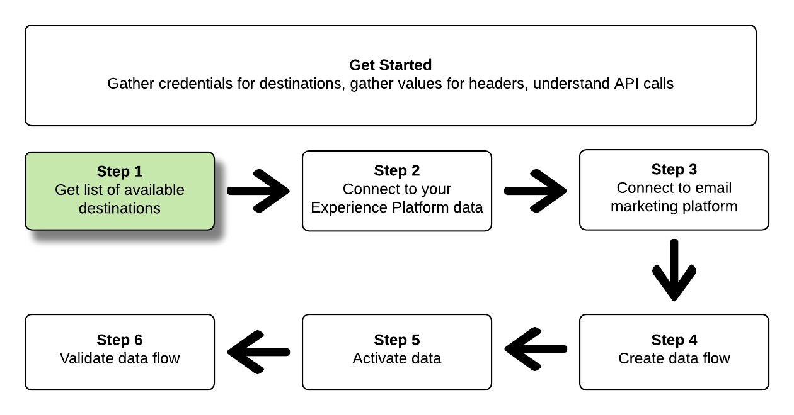

# Adobeの [!DNL Real-time Customer Data Platform]

このチュートリアルでは、API 呼び出しを使用して Adobe Experience Platform のデータに接続する方法、[電子メールマーケティングの宛先](../catalog/email-marketing/overview.md)を作成する方法、新しく作成した宛先へのデータフローを作成する方法および新しく作成した宛先へのデータをアクティブ化する方法を説明します。

このチュートリアルでは、すべての例で Adobe Campaign の宛先を使用しますが、手順はどの電子メールマーケティングの宛先でも同じです。


アドビのリアルタイム CDP のユーザーインターフェイスを使用して宛先を接続し、データをアクティブ化する場合は、[宛先の接続](../ui/connect-destination.md)に関するチュートリアル、および[宛先に対するプロファイルとセグメントのアクティブ化](../ui/activate-destinations.md)に関するチュートリアルを参照してください。

## はじめに

このガイドは、Adobe Experience Platform の次のコンポーネントを実際に利用および理解しているユーザーを対象としています。

* [[!DNL Experience Data Model (XDM) System]](../../xdm/home.md):顧客体験データを [!DNL Experience Platform] 整理する際に使用される標準化されたフレームワーク。
* [[!DNL Catalog Service]](../../catalog/home.md): [!DNL Catalog] は、内のデータの場所と系列のレコードシステムで [!DNL Experience Platform]す。
* [[!DNL Sandboxes]](../../sandboxes/home.md): [!DNL Experience Platform] は、1つの [!DNL Platform] インスタンスを別々の仮想環境に分割し、デジタルエクスペリエンスアプリケーションの開発と発展に役立つ仮想サンドボックスを提供します。

以下のセクションでは、Real-time CDP内の電子メールマーケティング先に対してデータをアクティブ化するために知っておく必要がある追加情報について説明します。

### 必要な資格情報の収集

このチュートリアルの手順を完了するには、接続してセグメントをアクティブ化する宛先の種類に応じて、次の資格情報を準備しておく必要があります。

* For [!DNL Amazon] S3 connections to email marketing platforms: `accessId`, `secretKey`
* 電子メールマーケティングプラットフォームへの SFTP 接続：`domain`、`port`、`username`、`password`または`ssh key`（FTP ロケーションへの接続方法による）

### API 呼び出し例の読み取り

このチュートリアルでは、API 呼び出しの例を提供し、リクエストの形式を設定する方法を示します。この中には、パス、必須ヘッダー、適切な形式のリクエストペイロードが含まれます。また、API レスポンスで返されるサンプル JSON も示されています。ドキュメントで使用される API 呼び出し例の表記について詳しくは、 トラブルシューテングガイドの[API 呼び出し例の読み方](../../landing/troubleshooting.md#how-do-i-format-an-api-request)に関する節を参照してください。[!DNL Experience Platform]

### 必須ヘッダーおよびオプションヘッダーの値の収集

In order to make calls to [!DNL Platform] APIs, you must first complete the [authentication tutorial](../../tutorials/authentication.md). Completing the authentication tutorial provides the values for each of the required headers in all [!DNL Experience Platform] API calls, as shown below:

* Authorization: Bearer `{ACCESS_TOKEN}`
* x-api-key: `{API_KEY}`
* x-gw-ims-org-id: `{IMS_ORG}`

Resources in [!DNL Experience Platform] can be isolated to specific virtual sandboxes. In requests to [!DNL Platform] APIs, you can specify the name and ID of the sandbox that the operation will take place in. 次に、オプションのパラメーターを示します。

* x-sandbox-name: `{SANDBOX_NAME}`

>[!NOTE]
>
>For more information on sandboxes in [!DNL Experience Platform], see the [sandbox overview documentation](../../sandboxes/home.md).

ペイロード（POST、PUT、PATCH）を含むすべてのリクエストには、メディアのタイプを指定する以下のような追加ヘッダーが必要です。

* Content-Type: `application/json`

### Swagger のドキュメント

このチュートリアルに含まれるすべての API 呼び出しについての参照ドキュメンは、Swagger のホームページにあります。Adobe.ioの [フローサービスAPIドキュメントを参照してください](https://www.adobe.io/apis/experienceplatform/home/api-reference.html#!acpdr/swagger-specs/flow-service.yaml)。 このチュートリアルと Swagger のドキュメントページを並行して使用することをお勧めします。

## 使用可能な宛先のリストを取得する {#get-the-list-of-available-destinations}



最初の手順として、データをアクティブ化する電子メールマーケティングの宛先を決定する必要があります。最初に、接続してセグメントをアクティブ化できる、使用可能な宛先のリストを要求する呼び出しを実行します。`connectionSpecs` エンドポイントに次の GET リクエストを実行すると、使用可能な宛先のリストが返されます。

**API 形式**

```http
GET /connectionSpecs
```

**リクエスト**

<!--

```shell
curl -X GET \
    'http://platform.adobe.io/data/foundation/flowservice/connectionSpecs' \
    -H 'Authorization: Bearer {ACCESS_TOKEN}' \
    -H 'x-api-key: {API_KEY}' \
    -H 'x-gw-ims-org-id: {IMS_ORG}' \
    -H 'x-sandbox-name: {SANDBOX_NAME}' \
    -H 'x-sandbox-id: {SANDBOX_ID}' \    
    -H 'Content-Type: application/json' \
```

-->

```shell
curl --location --request GET 'https://platform.adobe.io/data/foundation/flowservice/connectionSpecs' \
--header 'accept: application/json' \
--header 'x-gw-ims-org-id: {IMS_ORG}' \
--header 'x-api-key: {API_KEY}' \
--header 'x-sandbox-name: {SANDBOX_NAME}' \
--header 'Authorization: Bearer {ACCESS_TOKEN}'
```


**応答** 

リクエストが成功した場合、使用可能な宛先のリストと、その一意の識別子（`id`）が返されます。使用する宛先の値を保存します。この値は、以降の手順で必要になります。例えば、Adobe Campaign に接続してセグメントを提供する場合、レスポンス内で次のスニペットを探します。

```json
{
    "id": "0b23e41a-cb4a-4321-a78f-3b654f5d7d97",
  "name": "Adobe Campaign",
  ...
  ...
}
```

## Connect to your [!DNL Experience Platform] data {#connect-to-your-experience-platform-data}


Next, you must connect to your [!DNL Experience Platform] data, so you can export profile data and activate it in your preferred destination. そのためには、以下に示す 2 つの手順を実行します。

1. First, you must perform a call to authorize access to your data in [!DNL Experience Platform], by setting up a base connection.
2. Then, using the base connection ID, you will make another call in which you create a source connection, which establishes the connection to your [!DNL Experience Platform] data.


### Authorize access to your data in [!DNL Experience Platform]

**API 形式**

```http
POST /connections
```

**リクエスト**

<!--

```shell
curl -X POST \
    'http://platform.adobe.io/data/foundation/flowservice/connections' \
    -H 'Authorization: Bearer {ACCESS_TOKEN}' \
    -H 'x-api-key: {API_KEY}' \
    -H 'x-gw-ims-org-id: {IMS_ORG}' \
    -H 'x-sandbox-name: {SANDBOX_NAME}' \
    -H 'x-sandbox-id: {SANDBOX_ID}' \ 
    -H 'Content-Type: application/json' \
    -d  '{
            
            "name": "Base connection to Experience Platform",
            "description": "This call establishes the connection to Experience Platform data",
            "connectionSpec": {
                "id": "{CONNECTION_SPEC}",
                "version": "1.0"
            }
           }'
```

-->

```shell
curl --location --request POST 'https://platform.adobe.io/data/foundation/flowservice/connections' \
--header 'Authorization: Bearer {ACCESS_TOKEN}' \
--header 'x-api-key: {API_KEY}' \
--header 'x-gw-ims-org-id: {IMS_ORG}' \
--header 'x-sandbox-name: {SANDBOX_NAME}' \
--header 'Content-Type: application/json' \
--data-raw '{
            "name": "Base connection to Experience Platform",
            "description": "This call establishes the connection to Experience Platform data",
            "connectionSpec": {
                "id": "{CONNECTION_SPEC_ID}",
                "version": "1.0"
            }
}'
```


* `{CONNECTION_SPEC_ID}`：統合プロファイルサービスの接続仕様 ID（`8a9c3494-9708-43d7-ae3f-cda01e5030e1`）を使用します。

**応答** 

リクエストが成功した場合、ベース接続の一意の識別子（`id`）が返されます。この値は、次の手順でソース接続を作成する際に必要になるため保存します。

```json
{
    "id": "1ed86558-59b5-42f7-9865-5859b552f7f4"
}
```

### Connect to your [!DNL Experience Platform] data {#connect-to-platform-data}

**API 形式**

```http
POST /sourceConnections
```

**リクエスト**

<!--

```shell
curl -X POST \
    'http://platform.adobe.io/data/foundation/flowservice/sourceConnections' \
    -H 'Authorization: Bearer {ACCESS_TOKEN}' \
    -H 'x-api-key: {API_KEY}' \
    -H 'x-gw-ims-org-id: {IMS_ORG}' \
    -H 'x-sandbox-id: {SANDBOX_ID}' \ 
    -H 'x-sandbox-name: {SANDBOX_NAME}' \
    -H 'Content-Type: application/json' \
    -d  '{
  "name": "Connecting to Unified Profile Service",
  "description": "Optional",
  "baseConnectionId": "{BASE_CONNECTION_ID}",
  "connectionSpec": {
    "id": "{CONNECTION_SPEC}",
    "version": "1.0"
  },
  "data": {
    "format": "CSV",
    "schema": null
  }
  }
```

-->

```shell
curl --location --request POST 'https://platform.adobe.io/data/foundation/flowservice/sourceConnections' \
--header 'Authorization: Bearer {ACCESS_TOKEN}' \
--header 'x-api-key: {API_KEY}' \
--header 'x-gw-ims-org-id: {IMS_ORG}' \
--header 'x-sandbox-name: {SANDBOX_NAME}' \
--header 'Content-Type: application/json' \
--data-raw '{
            "name": "Connecting to Unified Profile Service",
            "description": "Optional",
            "connectionSpec": {
                "id": "{CONNECTION_SPEC_ID}",
                "version": "1.0"
            },
            "baseConnectionId": "{BASE_CONNECTION_ID}",
            "data": {
                "format": "CSV",
                "schema": null
            },
            "params" : {}
}'
```

* `{BASE_CONNECTION_ID}`：前述の手順で取得した ID を使用します。
* `{CONNECTION_SPEC_ID}`:接続仕様IDを — に使用 [!DNL Unified Profile Service] し `8a9c3494-9708-43d7-ae3f-cda01e5030e1`ます。

**応答** 

A successful response returns the unique identifier (`id`) for the newly created source connection to [!DNL Unified Profile Service]. This confirms that you have successfully connected to your [!DNL Experience Platform] data. この値は、後の手順で必要になるため保存します。

```json
{
    "id": "ed48ae9b-c774-4b6e-88ae-9bc7748b6e97"
}
```


## 電子メールマーケティングの宛先への接続 {#connect-to-email-marketing-destination}


この手順では、目的の電子メールマーケティングの宛先への接続を設定します。そのためには、以下に示す 2 つの手順を実行します。

1. 最初に、電子メールサービスプロバイダーへのアクセスを認証する呼び出しを実行します。そのためには、ベース接続を設定します。
2. 次に、ベース接続 ID を使用して、ターゲット接続を作成する別の呼び出しを実行します。これで、書き出されたデータが送信されるストレージアカウント内の場所と、書き出されるデータの形式が指定されます。

### 電子メールマーケティングの宛先へのアクセスを認証する

**API 形式**

```http
POST /connections
```

**リクエスト**

<!--

```shell
curl -X POST \
    'http://platform.adobe.io/data/foundation/flowservice/connections' \
    -H 'Authorization: Bearer {ACCESS_TOKEN}' \
    -H 'x-api-key: {API_KEY}' \
    -H 'x-gw-ims-org-id: {IMS_ORG}' \
    -H 'x-sandbox-name: {SANDBOX_NAME}' \
    -H 'x-sandbox-id: {SANDBOX_ID}' \ 
    -H 'Content-Type: application/json' \
    -d  '{
            
            "name": "S3 Connection for Adobe Campaign",
            "description": "ACME company holiday campaign",
            "connectionSpec": {
                "id": "{CONNECTION_SPEC}",
                "version": "1.0"
            },
            "auth": {
                "specName": "{S3 or SFTP}",
                "params": {
                    "accessId": "{ACCESS_ID}",
                    "secretKey": "{SECRET_KEY}"
                }
            }
           }'
```

-->

```shell
curl --location --request POST 'https://platform.adobe.io/data/foundation/flowservice/connections' \
--header 'Authorization: Bearer {ACCESS_TOKEN}' \
--header 'x-api-key: {API_KEY}' \
--header 'x-gw-ims-org-id: {IMS_ORG}' \
--header 'x-sandbox-name: {SANDBOX_NAME}' \
--header 'Content-Type: application/json' \
--data-raw '{
    "name": "S3 Connection for Adobe Campaign",
    "description": "summer advertising campaign",
    "connectionSpec": {
        "id": "{_CONNECTION_SPEC_ID}",
        "version": "1.0"
    },
    "auth": {
        "specName": "{S3 or SFTP}",
        "params": {
            "accessId": "{ACCESS_ID}",
            "secretKey": "{SECRET_KEY}"
        }
    }
}'
```

* `{CONNECTION_SPEC_ID}`：手順「[使用可能な宛先のリストを取得する](#get-the-list-of-available-destinations)」で取得した接続仕様 ID を使用します。
* `{S3 or SFTP}`：この宛先の接続タイプを入力します。[宛先カタログ](../catalog/overview.md)で、目的の宛先までスクロールして、S3 または SFTP の接続タイプ、あるいはその両方がサポートされているかどうかを確認します。
* `{ACCESS_ID}`[!DNL Amazon]： S3 ストレージの場所のアクセス ID
* `{SECRET_KEY}`[!DNL Amazon]： S3 ストレージの場所の秘密鍵

**応答** 

リクエストが成功した場合、ベース接続の一意の識別子（`id`）が返されます。この値は、次の手順でターゲット接続を作成する際に必要になるため保存します。

```json
{
    "id": "1ed86558-59b5-42f7-9865-5859b552f7f4"
}
```

### ストレージの場所とデータ形式を指定する

**API 形式**

```http
POST /targetConnections
```

**リクエスト**

<!--

```shell
curl -X POST \
    'http://platform.adobe.io/data/foundation/flowservice/targetConnections' \
    -H 'Authorization: Bearer {ACCESS_TOKEN}' \
    -H 'x-api-key: {API_KEY}' \
    -H 'x-gw-ims-org-id: {IMS_ORG}' \
    -H 'x-sandbox-name: {SANDBOX_NAME}' \    
    -H 'x-sandbox-id: {SANDBOX_ID}' \ 
    -H 'Content-Type: application/json' \
    -d  '{
   "baseConnectionId": "{BASE_CONNECTION_ID}",
   "name": "TargetConnection for Adobe Campaign",
   "data": {
       "format": "CSV",
       "schema": {
           "id": "1.0",
           "version": "1.0"
       },
    "connectionSpec": {
    "id": "{CONNECTION_SPEC_ID}",
    "version": "1.0"
   },
   "params": {
       "mode": "S3",
       "bucketName": "{BUCKETNAME}",
       "path": "{FILEPATH}"
    }
    }
```

-->

```shell
curl --location --request POST 'https://platform.adobe.io/data/foundation/flowservice/targetConnections' \
--header 'Authorization: Bearer {ACCESS_TOKEN}' \
--header 'x-api-key: {API_KEY}' \
--header 'x-gw-ims-org-id: {IMS_ORG}' \
--header 'Content-Type: application/json' \
--data-raw '{
    "name": "TargetConnection for Adobe Campaign",
    "description": "Connection to Adobe Campaign",
    "baseConnectionId": "{BASE_CONNECTION_ID}",
    "connectionSpec": {
        "id": "{CONNECTION_SPEC_ID}",
        "version": "1.0"
    },
    "data": {
        "format": "json",
        "schema": {
            "id": "1.0",
            "version": "1.0"
        }
    },
    "params": {
        "mode": "S3",
        "bucketName": "{BUCKETNAME}",
        "path": "{FILEPATH}",
        "format": "CSV"
    }
}'
```

* `{BASE_CONNECTION_ID}`：前述の手順で取得したベース接続 ID を使用します。
* `{CONNECTION_SPEC_ID}`：手順「[使用可能な宛先のリストを取得する](#get-the-list-of-available-destinations)」で取得した接続仕様 ID を使用します。
* `{BUCKETNAME}`[!DNL Amazon]：リアルタイム CDP がデータ書き出しを格納する S3 バケット。
* `{FILEPATH}`[!DNL Amazon]：リアルタイム CDP がデータ書き出しを格納する S3 バケットディレクトリのパス。

**応答** 

リクエストが成功した場合は、新しく作成した、電子メールマーケティングの宛先へのターゲット接続を表す一意の識別子（`id`）が返されます。この値は、後の手順で必要になるため保存します。

```json
{
    "id": "12ab90c7-519c-4291-bd20-d64186b62da8"
}
```

## データフローの作成


Using the IDs you obtained in the previous steps, you can now create a dataflow between your [!DNL Experience Platform] data and the destination where you will activate data to. Think of this step as constructing the pipeline, through which data will later flow, between [!DNL Experience Platform] and your desired destination.

データフローを作成するには、以下のような POST リクエストを実行します。このとき、ペイロード内で以下に示す値を指定します。

次の POST リクエストを実行して、データフローを作成します。

**API 形式**

```http
POST /flows
```

**リクエスト**

```shell
curl -X POST \
'https://platform.adobe.io/data/foundation/flowservice/flows' \
-H 'Authorization: Bearer {ACCESS_TOKEN}' \
-H 'x-api-key: {API_KEY}' \
-H 'x-gw-ims-org-id: {IMS_ORG}' \
-H 'x-sandbox-name: {SANDBOX_NAME}' \
-H 'Content-Type: application/json' \
-d  '{
   
        "name": "Activate segments to Adobe Campaign",
        "description": "This operation creates a dataflow which we will later use to activate segments to Adobe Campaign",
        "flowSpec": {
            "id": "{FLOW_SPEC_ID}",
            "version": "1.0"
        },
        "sourceConnectionIds": [
            "{SOURCE_CONNECTION_ID}"
        ],
        "targetConnectionIds": [
            "{TARGET_CONNECTION_ID}"
        ],
        "transformations": [
            {
                "name": "GeneralTransform",
                "params": {
                    "segmentSelectors": {
                        "selectors": []
                    },
                    "profileSelectors": {
                        "selectors": []
                    }
                }
            }
        ]
    }
```

* `{FLOW_SPEC_ID}`：接続先の電子メールマーケティングの宛先にフローを使用します。フロー仕様を取得するには、`flowspecs` エンドポイントで GET 操作を実行します。Swagger のドキュメントは、https://platform.adobe.io/data/foundation/flowservice/swagger#/Flow%20Specs%20API/getFlowSpecs で入手できます。レスポンスで `upsTo` を探して、接続先の電子メールマーケティングの宛先に対応する ID をコピーします。例えば、Adobe Campaign の場合は、`upsToCampaign` を探して、`id` パラメーターをコピーします。
* `{SOURCE_CONNECTION_ID}`：手順「[Experience Platform データへの接続](#connect-to-your-experience-platform-data)」で取得したソース接続 ID を使用します。
* `{TARGET_CONNECTION_ID}`：手順「[電子メールマーケティングの宛先への接続](#connect-to-email-marketing-destination)」で取得したターゲット接続 ID を使用します。

**応答** 

リクエストが成功した場合は、新しく作成したデータフローの ID（`id`）と `etag` が返されます。両方の値をメモしておきます。これらの値は、次の手順でセグメントをアクティブ化する際に使用します。

```json
{
    "id": "8256cfb4-17e6-432c-a469-6aedafb16cd5",
    "etag": "8256cfb4-17e6-432c-a469-6aedafb16cd5"
}
```


## 新しい宛先に対してデータをアクティブ化にする


ここまで、すべての接続とデータフローを作成しました。これで、電子メールマーケティングプラットフォームに対してプロファイルデータをアクティブ化できます。この手順では、宛先に送信するセグメントとプロファイル属性を選択し、スケジュールを設定して宛先にデータを送信します。

新しい宛先に対してセグメントをアクティブ化するには、次の例のような JSON パッチ操作を実行する必要があります。1 回の呼び出しで、複数のセグメントとプロファイル属性をアクティブ化できます。JSON パッチについて詳しくは、[RFC 仕様](https://tools.ietf.org/html/rfc6902)を参照してください。

**API 形式**

```http
PATCH /flows
```

**リクエスト**

```shell
curl --location --request PATCH 'https://platform.adobe.io/data/foundation/flowservice/flows/{DATAFLOW_ID}' \
--header 'Authorization: Bearer {ACCESS_TOKEN}' \
--header 'x-api-key: {API_KEY}' \
--header 'x-gw-ims-org-id: {IMS_ORG}' \
--header 'Content-Type: application/json' \
--header 'x-sandbox-name: {SANDBOX_NAME}' \
--header 'If-Match: "{ETAG}"' \
--data-raw '[
    {
        "op": "add",
        "path": "/transformations/0/params/segmentSelectors/selectors/-",
        "value": {
            "type": "PLATFORM_SEGMENT",
            "value": {
                "name": "Name of the segment that you are activating",
                "description": "Description of the segment that you are activating",
                "id": "{SEGMENT_ID}"
            }
        }
    },
        {
        "op": "add",
        "path": "/transformations/0/params/segmentSelectors/selectors/-",
        "value": {
            "type": "PLATFORM_SEGMENT",
            "value": {
                "name": "Name of the segment that you are activating",
                "description": "Description of the segment that you are activating",
                "id": "{SEGMENT_ID}"
            }
        }
    },
        {
        "op": "add",
        "path": "/transformations/0/params/profileSelectors/selectors/-",
        "value": {
            "type": "JSON_PATH",
            "value": {
                "operator": "EXISTS",
                "path": "{PROFILE_ATTRIBUTE}"
            }
        }
    }
]
```

* `{DATAFLOW_ID}`：前述の手順で取得したデータフローを使用します。
* `{ETAG}`：前述の手順で取得した ETag を使用します。
* `{SEGMENT_ID}`：この宛先に書き出すセグメント ID を指定します。アクティブ化するセグメントのセグメントIDを取得するには、https://www.adobe.io/apis/experienceplatform/home/api-reference.html#/ **に移動し**、左側のナビゲーションメニューで **[!UICONTROL Segmentation Service API]** ( `GET /segment/definitions` Segment Definitions **[!UICONTROL )を選択し、「]** Segment Definitions」で操作を探します。
* `{PROFILE_ATTRIBUTE}`：例えば、`"person.lastName"` などです。

**応答** 

202 OK レスポンスを探します。レスポンスの本文は返されません。リクエストが正しいことを検証する方法については、次の手順「データフローの検証」を参照してください。

## データフローの検証


このチュートリアルの最後の手順では、セグメントとプロファイル属性が実際にデータフローに正しくマッピングされたことを検証する必要があります。

検証するには、次の GET リクエストを実行します。

**API 形式**

```http
GET /flows
```

**リクエスト**

```shell
curl --location --request PATCH 'https://platform.adobe.io/data/foundation/flowservice/flows/{DATAFLOW_ID}' \
--header 'Authorization: Bearer {ACCESS_TOKEN}' \
--header 'x-api-key: {API_KEY}' \
--header 'x-gw-ims-org-id: {IMS_ORG}' \
--header 'Content-Type: application/json' \
--header 'x-sandbox-name: prod' \
--header 'If-Match: "{ETAG}"' 
```

* `{DATAFLOW_ID}`：前述の手順で作成したデータフローを使用します。
* `{ETAG}`：前述の手順で取得した Etag を使用します。

**応答** 

返されたレスポンスの `transformations` パラメーターに、前述の手順で送信したセグメントとプロファイル属性が含まれています。レスポンス内のサンプル `transformations` パラメーターは次のようになります。

```json
"transformations": [
    {
        "name": "GeneralTransform",
        "params": {
            "profileSelectors": {
                "selectors": []
            },
            "segmentSelectors": {
                "selectors": [
                    {
                        "type": "PLATFORM_SEGMENT",
                        "value": {
                            "name": "Men over 50",
                            "description": "",
                            "id": "72ddd79b-6b0a-4e97-a8d2-112ccd81bd02"
                        }
                    }
                ]
            }
        }
    }
],
```

## 次の手順

このチュートリアルに従って、リアルタイム CDP を目的の電子メールマーケティングの宛先の 1 つに接続し、宛先へのデータフローを設定しました。これで、発信データを電子メールキャンペーン、ターゲット広告、ほかの多くの使用事例の宛先で使用することができます。詳しくは、以下のページを参照してください。

* [Destinations overview](../home.md)
* [宛先カタログの概要](../catalog/overview.md)