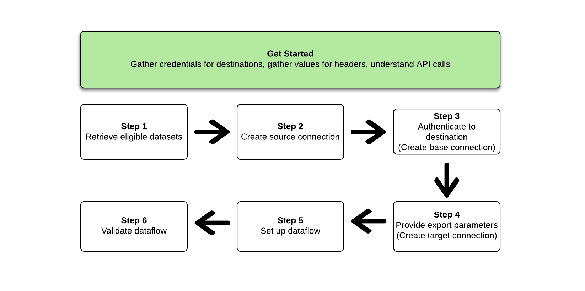
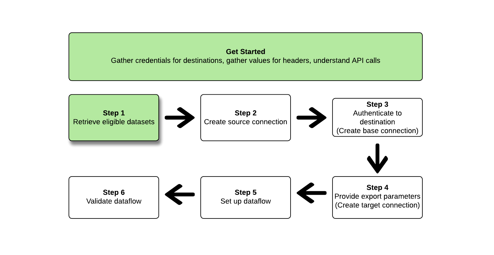
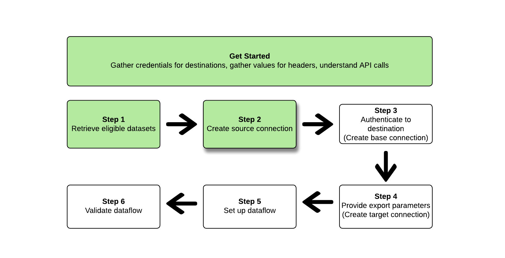
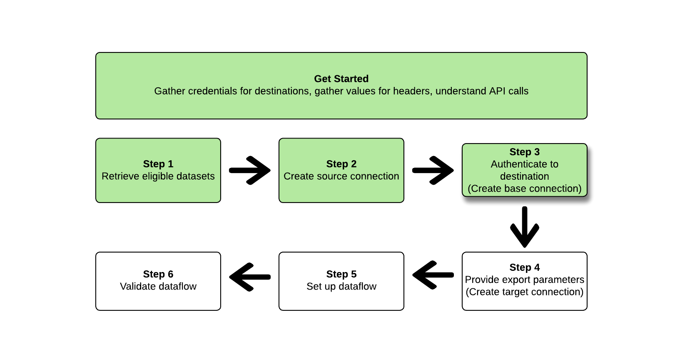
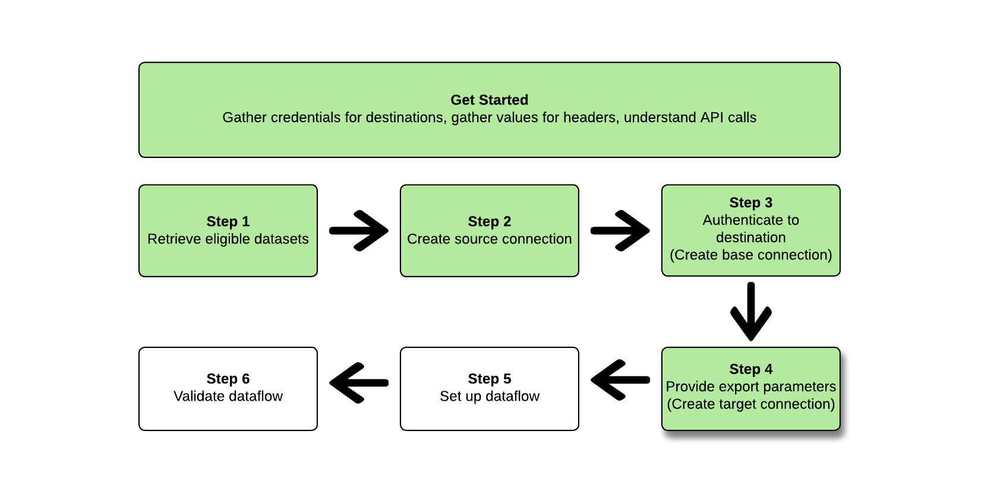
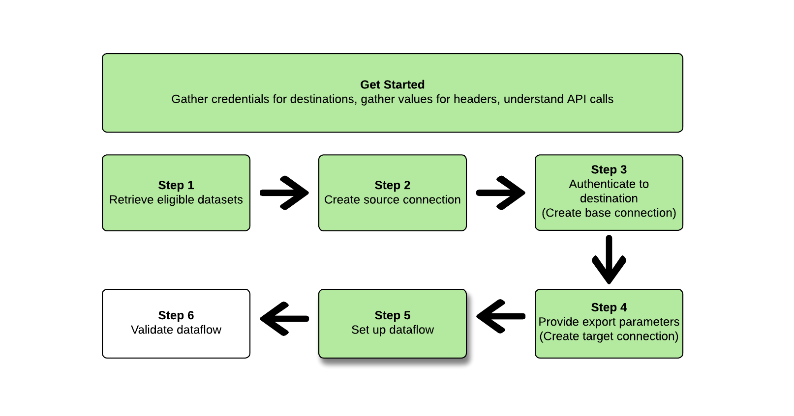
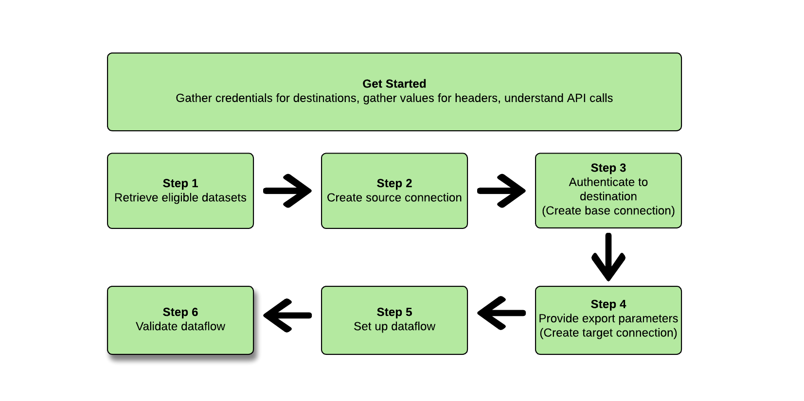

# [!DNL Flow Service API]を使用したデータセットのエクスポート

>[!AVAILABILITY]
>
>* この機能は、[!DNL Real-Time CDP] PrimeおよびUltimate パッケージ、[!DNL Adobe Journey Optimizer]、またはCustomer Journey Analyticsを購入したお客様が利用できます。 詳しくは、アドビ担当者にお問い合わせください。

>[!IMPORTANT]
>
>**アクション項目**: Experience Platform[の2024年9月2日リリースでは、データセットの書き出しデータフローの日付を](/help/release-notes/latest/latest.md#destinations)に設定するオプションが導入されました。 `endTime`Adobeでは、2024年9月リリース *より前に作成されたすべてのデータセット書き出しデータフローについて、2025年9月1日のデフォルトの終了日も導入されました。*
>
>これらのデータフローのいずれかで、データフローの終了日を終了日より前に手動で更新する必要があります。そうしないと、書き出しはその日に停止します。 Experience Platform UIを使用して、2025年9月1日に停止するように設定されているデータフローを表示します。
>
>同様に、`endTime`日を指定せずに作成したデータフローの場合、作成日から6か月の終了時間がデフォルトになります。

<!--

>You can retrieve a list of such dataflows by performing the following API call: `https://platform.adobe.io/data/foundation/flowservice/flows?property=scheduleParams.endTime==UNIXTIMESTAMPTHATWEWILLUSE`
>

-->

この記事では、[!DNL Flow Service API]を使用して[ データセット ](/help/catalog/datasets/overview.md)を[!DNL Adobe Experience Platform]から任意のクラウドストレージの場所（[!DNL Amazon S3]、SFTPの場所、または[!DNL Google Cloud Storage]など）に書き出すために必要なワークフローについて説明します。

>[!TIP]
>
>Experience Platformのユーザーインターフェイスを使用して、データセットを書き出すこともできます。 詳しくは、[ データセットの書き出しUI チュートリアル ](/help/destinations/ui/export-datasets.md)を参照してください。

## 書き出しに使用できるデータセット {#datasets-to-export}

書き出すことができるデータセットは、Experience Platform アプリケーション （[!DNL Real-Time CDP]、[!DNL Adobe Journey Optimizer]）、階層（PrimeまたはUltimate）、および購入したアドオン （例：Data Distiller）によって異なります。

書き出すことができるデータセットについては、UI チュートリアルページ [の](/help/destinations/ui/export-datasets.md#datasets-to-export)の表を参照してください。

## サポートされる宛先 {#supported-destinations}

現在、スクリーンショットで強調表示され、以下に示すクラウドストレージの宛先にデータセットを書き出すことができます。


* [[!DNL Azure Data Lake Storage Gen2]](../../destinations/catalog/cloud-storage/adls-gen2.md)
* [[!DNL Data Landing Zone]](../../destinations/catalog/cloud-storage/data-landing-zone.md)
* [[!DNL Google Cloud Storage]](../../destinations/catalog/cloud-storage/google-cloud-storage.md)
* [[!DNL Amazon S3]](../../destinations/catalog/cloud-storage/amazon-s3.md#changelog)
* [[!DNL Azure Blob]](../../destinations/catalog/cloud-storage/azure-blob.md#changelog)
* [[!DNL SFTP]](../../destinations/catalog/cloud-storage/sftp.md#changelog)

## 前提条件 {#prerequisites}

データセットを書き出すには、次の前提条件に注意してください。

* データセットをクラウドストレージ宛先に書き出すには、正常に[宛先に接続されている](/help/destinations/ui/connect-destination.md)必要があります。まだ接続していない場合は、[宛先カタログ](/help/destinations/catalog/overview.md)に移動し、サポートされている宛先を参照し、使用する宛先を設定します。
* リアルタイム顧客プロファイルで使用するには、プロファイルデータセットを有効にする必要があります。 このオプションを有効にする方法について[詳細](/help/ingestion/tutorials/ingest-batch-data.md#enable-for-profile)を読む。

## はじめに {#get-started}



このガイドでは、[!DNL Adobe Experience Platform]の次のコンポーネントについて実際に理解する必要があります。

* [[!DNL Experience Platform datasets]](/help/catalog/datasets/overview.md): [!DNL Adobe Experience Platform]に正常に取り込まれたすべてのデータは、データセットとして[!DNL Data Lake]内に保持されます。 データセットは、スキーマ（列）とフィールド（行）で構成されるデータコレクション（通常はテーブル）を格納し管理するための構造です。データセットには、保存するデータの様々な側面を記述したメタデータも含まれます。
   * [[!DNL Sandboxes]](../../sandboxes/home.md)：[!DNL Experience Platform] には、単一の [!DNL Experience Platform] インスタンスを別々の仮想環境に分割し、デジタルエクスペリエンスアプリケーションの開発と発展に役立つ仮想サンドボックスが用意されています。

次の節では、Experience Platformでデータセットをクラウドストレージの宛先に書き出すために知っておく必要がある追加情報を提供します。

### 必要な権限 {#permissions}

データセットをエクスポートするには、**[!UICONTROL View Destinations]**、**[!UICONTROL View Datasets]**&#x200B;および&#x200B;**[!UICONTROL Manage and Activate Dataset Destinations]** [ アクセス制御権限](/help/access-control/home.md#permissions)が必要です。 必要な権限を取得するには、[アクセス制御の概要](/help/access-control/ui/overview.md)を参照するか、製品管理者に問い合わせてください。

データセットの書き出しに必要な権限があることと、宛先でデータセットの書き出しがサポートされていることを確認するには、宛先カタログを参照します。 宛先に&#x200B;**[!UICONTROL Activate]**&#x200B;または&#x200B;**[!UICONTROL Export datasets]** コントロールがある場合は、適切な権限を持っています。

### API 呼び出し例の読み取り {#reading-sample-api-calls}

このチュートリアルでは、API 呼び出しの例を提供し、リクエストの形式を設定する方法を示します。これには、パス、必須ヘッダー、適切な形式のリクエストペイロードが含まれます。また、API レスポンスで返されるサンプル JSON も示されています。ドキュメントで使用される API 呼び出し例の表記について詳しくは、 トラブルシューテングガイドの[API 呼び出し例の読み方](../../landing/troubleshooting.md#how-do-i-format-an-api-request)に関する節を参照してください[!DNL Experience Platform]。

### 必須ヘッダーおよびオプションヘッダーの値の収集 {#gather-values-headers}

[!DNL Experience Platform]個のAPIを呼び出すには、まず[Experience Platform認証チュートリアル ](https://experienceleague.adobe.com/docs/experience-platform/landing/platform-apis/api-authentication.html?lang=ja)を完了する必要があります。 次に示すように、すべての [!DNL Experience Platform] API 呼び出しに必要な各ヘッダーの値は認証チュートリアルで説明されています。

* Authorization： Bearer `{ACCESS_TOKEN}`
* x-api-key： `{API_KEY}`
* x-gw-ims-org-id： `{ORG_ID}`

[!DNL Experience Platform] のリソースは、特定の仮想サンドボックスに分離できます。[!DNL Experience Platform] API へのリクエストでは、操作を実行するサンドボックスの名前と ID を指定できます。次に、オプションのパラメーターを示します。

* x-sandbox-name：`{SANDBOX_NAME}`

>[!NOTE]
>
>[!DNL Experience Platform] のサンドボックスについて詳しくは、[サンドボックスの概要に関するドキュメント](../../sandboxes/home.md)を参照してください。

ペイロード（POST、PUT、PATCH）を含むすべてのリクエストには、メディアのタイプを指定する以下のような追加ヘッダーが必要です。

* Content-Type: `application/json`

### API リファレンスドキュメント {#api-reference-documentation}

このチュートリアルに含まれるすべての API 操作について、付属リファレンスドキュメントが用意されています。Adobe Developer web サイト [[!DNL Flow Service] の](https://developer.adobe.com/experience-platform-apis/references/destinations/)- Destinations API ドキュメントを参照してください。 このチュートリアルと API リファレンスのドキュメントを並行して使用することをお勧めします。

### 用語集 {#glossary}

このAPI チュートリアルで使用される用語については、API リファレンスドキュメントの[用語集セクション ](https://developer.adobe.com/experience-platform-apis/references/destinations/#tag/Glossary)を参照してください。

### 目的の宛先の接続仕様とフロー仕様の収集 {#gather-connection-spec-flow-spec}

データセットをエクスポートするワークフローを開始する前に、データセットをエクスポートする宛先の接続仕様とフロー仕様IDを特定します。 参考までに、以下の表を使用してください。


| 宛先 | 接続仕様 | フロー仕様 |
|---------|----------|---------|
| [!DNL Amazon S3] | `4fce964d-3f37-408f-9778-e597338a21ee` | `269ba276-16fc-47db-92b0-c1049a3c131f` |
| [!DNL Azure Blob Storage] | `6d6b59bf-fb58-4107-9064-4d246c0e5bb2` | `95bd8965-fc8a-4119-b9c3-944c2c2df6d2` |
| [!DNL Azure Data Lake Gen 2(ADLS Gen2)] | `be2c3209-53bc-47e7-ab25-145db8b873e1` | `17be2013-2549-41ce-96e7-a70363bec293` |
| [!DNL Data Landing Zone(DLZ)] | `10440537-2a7b-4583-ac39-ed38d4b848e8` | `cd2fc47e-e838-4f38-a581-8fff2f99b63a` |
| [!DNL Google Cloud Storage] | `c5d93acb-ea8b-4b14-8f53-02138444ae99` | `585c15c4-6cbf-4126-8f87-e26bff78b657` |
| SFTP | `36965a81-b1c6-401b-99f8-22508f1e6a26` | `354d6aad-4754-46e4-a576-1b384561c440` |

{style="table-layout:auto"}

様々な[!DNL Flow Service] エンティティを構築するには、これらのIDが必要です。 [!DNL Connection Spec]から[!DNL Connection Spec]を取得できるように、特定のエンティティを設定するために[!DNL Flow Service APIs]自体の一部を参照する必要もあります。 以下の例では、テーブル内のすべての宛先の接続仕様を取得しています。

>[!BEGINTABS]

>[!TAB Amazon S3]

**リクエスト**

+++[!DNL connection spec]の[!DNL Amazon S3]を取得

```shell
curl --location --request GET 'https://platform.adobe.io/data/foundation/flowservice/connectionSpecs/4fce964d-3f37-408f-9778-e597338a21ee' \
--header 'accept: application/json' \
--header 'x-api-key: {API_KEY}' \
--header 'x-gw-ims-org-id: {ORG_ID}' \
--header 'x-sandbox-name: {SANDBOX_NAME}' \
--header 'Authorization: Bearer {ACCESS_TOKEN}'
```

+++

**応答**

+++[!DNL Amazon S3] – 接続仕様

```json
{
    "items": [
        {
            "id": "4fce964d-3f37-408f-9778-e597338a21ee",
            "name": "Amazon S3",
            "providerId": "14e34fac-d307-11e9-bb65-2a2ae2dbcce4",
            "version": "1.0",
//...
```

+++

>[!TAB Azure Blob Storage]

**リクエスト**

+++[!DNL connection spec]の[!DNL Azure Blob Storage]を取得

```shell
curl --location --request GET 'https://platform.adobe.io/data/foundation/flowservice/connectionSpecs/6d6b59bf-fb58-4107-9064-4d246c0e5bb2' \
--header 'accept: application/json' \
--header 'x-api-key: {API_KEY}' \
--header 'x-gw-ims-org-id: {ORG_ID}' \
--header 'x-sandbox-name: {SANDBOX_NAME}' \
--header 'Authorization: Bearer {ACCESS_TOKEN}'
```

+++

**応答**

+++[!DNL Azure Blob Storage] - [!DNL Connection spec]

```json
{
    "items": [
        {
            "id": "6d6b59bf-fb58-4107-9064-4d246c0e5bb2",
            "name": "Azure Blob Storage",
            "providerId": "14e34fac-d307-11e9-bb65-2a2ae2dbcce4",
            "version": "1.0",
//...
```

+++

>[!TAB Azure Data Lake Gen 2 （ADLS Gen2） ]

**リクエスト**

+++[!DNL connection spec]の[!DNL Azure Data Lake Gen 2(ADLS Gen2]を取得）

```shell
curl --location --request GET 'https://platform.adobe.io/data/foundation/flowservice/connectionSpecs/be2c3209-53bc-47e7-ab25-145db8b873e1' \
--header 'accept: application/json' \
--header 'x-api-key: {API_KEY}' \
--header 'x-gw-ims-org-id: {ORG_ID}' \
--header 'x-sandbox-name: {SANDBOX_NAME}' \
--header 'Authorization: Bearer {ACCESS_TOKEN}'
```

+++

**応答**

+++[!DNL Azure Data Lake Gen 2(ADLS Gen2)] - [!DNL Connection spec]

```json
{
    "items": [
        {
            "id": "be2c3209-53bc-47e7-ab25-145db8b873e1",
            "name": "Azure Data Lake Gen2",
            "providerId": "14e34fac-d307-11e9-bb65-2a2ae2dbcce4",
            "version": "1.0",
//...
```

+++

>[!TAB  データランディングゾーン（DLZ） ]

**リクエスト**

+++[!DNL connection spec]の[!DNL Data Landing Zone(DLZ)]を取得

```shell
curl --location --request GET 'https://platform.adobe.io/data/foundation/flowservice/connectionSpecs/10440537-2a7b-4583-ac39-ed38d4b848e8' \
--header 'accept: application/json' \
--header 'x-api-key: {API_KEY}' \
--header 'x-gw-ims-org-id: {ORG_ID}' \
--header 'x-sandbox-name: {SANDBOX_NAME}' \
--header 'Authorization: Bearer {ACCESS_TOKEN}'
```

+++

**応答**

+++[!DNL Data Landing Zone(DLZ)] - [!DNL Connection spec]

```json
{
    "items": [
        {
            "id": "10440537-2a7b-4583-ac39-ed38d4b848e8",
            "name": "Data Landing Zone",
            "providerId": "14e34fac-d307-11e9-bb65-2a2ae2dbcce4",
            "version": "1.0",
//...
```

+++

>[!TAB Google Cloud Storage]

**リクエスト**

+++[!DNL connection spec]の[!DNL Google Cloud Storage]を取得

```shell
curl --location --request GET 'https://platform.adobe.io/data/foundation/flowservice/connectionSpecs/c5d93acb-ea8b-4b14-8f53-02138444ae99' \
--header 'accept: application/json' \
--header 'x-api-key: {API_KEY}' \
--header 'x-gw-ims-org-id: {ORG_ID}' \
--header 'x-sandbox-name: {SANDBOX_NAME}' \
--header 'Authorization: Bearer {ACCESS_TOKEN}'
```

+++

**応答**

+++[!DNL Google Cloud Storage] - [!DNL Connection spec]

```json
{
    "items": [
        {
            "id": "c5d93acb-ea8b-4b14-8f53-02138444ae99",
            "name": "Google Cloud Storage",
            "providerId": "14e34fac-d307-11e9-bb65-2a2ae2dbcce4",
            "version": "1.0",
//...
```

+++

>[!TAB SFTP]

**リクエスト**

+++SFTP用に[!DNL connection spec]を取得

```shell
curl --location --request GET 'https://platform.adobe.io/data/foundation/flowservice/connectionSpecs/36965a81-b1c6-401b-99f8-22508f1e6a26' \
--header 'accept: application/json' \
--header 'x-api-key: {API_KEY}' \
--header 'x-gw-ims-org-id: {ORG_ID}' \
--header 'x-sandbox-name: {SANDBOX_NAME}' \
--header 'Authorization: Bearer {ACCESS_TOKEN}'
```

+++

**応答**

+++SFTP - [!DNL Connection spec]

```json
{
    "items": [
        {
            "id": "36965a81-b1c6-401b-99f8-22508f1e6a26",
            "name": "SFTP",
            "providerId": "14e34fac-d307-11e9-bb65-2a2ae2dbcce4",
            "version": "1.0",
//...
```

+++

>[!ENDTABS]

クラウドストレージ宛先へのデータセットデータフローを設定するには、次の手順に従います。 一部の手順では、様々なクラウドストレージの宛先間でリクエストと応答が異なります。 そのような場合は、ページ上のタブを使用して、データセットを接続して書き出す宛先に固有のリクエストと応答を取得します。 設定する宛先に対して、正しい[!DNL connection spec]と[!DNL flow spec]を使用してください。

## データセットのリストの取得 {#retrieve-list-of-available-datasets}

データセットの書き出しワークフローの手順1を示す

アクティベーションの対象となるデータセットのリストを取得するには、まず、以下のエンドポイントにAPI呼び出しを行います。

>[!BEGINSHADEBOX]

**リクエスト**

+++適格なデータセットの取得 – リクエスト

```shell
curl --location --request GET 'https://platform.adobe.io/data/foundation/flowservice/connectionSpecs/23598e46-f560-407b-88d5-ea6207e49db0/configs?outputType=activationDatasets&outputField=datasets&start=0&limit=20&properties=name,state' \
--header 'accept: application/json' \
--header 'x-gw-ims-org-id: {ORG_ID}' \
--header 'x-api-key: {API_KEY}' \
--header 'x-sandbox-name: {SANDBOX_NAME}' \
--header 'Authorization: Bearer {ACCESS_TOKEN}'
```

適格なデータセットを取得するには、リクエスト URLで使用される[!DNL connection spec] IDがデータレイクソース接続仕様ID、`23598e46-f560-407b-88d5-ea6207e49db0`である必要があり、2つのクエリパラメーター`outputField=datasets`と`outputType=activationDatasets`を指定する必要があります。 その他のすべてのクエリパラメーターは、[ カタログサービス API](https://developer.adobe.com/experience-platform-apis/references/catalog/)でサポートされている標準のクエリパラメーターです。

+++

**応答**

+++データセットの取得 – 応答

```json
{
    "items": [
        {
            "id": "5ef3e324052581191aa6a466",
            "name": "AAM Authenticated Profiles Meta Data",
            "description": "Activation profile export dataset",
            "fileDescription": {
                "persisted": true,
                "containerFormat": "parquet",
                "format": "parquet"
            },
            "aspect": "production",
            "state": "DRAFT"
        },
        {
            "id": "5ef3e3259ad2a1191ab7dd7d",
            "name": "AAM Devices Data",
            "description": "Activation profile export dataset",
            "fileDescription": {
                "persisted": true,
                "containerFormat": "parquet",
                "format": "parquet"
            },
            "aspect": "production",
            "state": "DRAFT"
        },
        {
            "id": "5ef3e325582424191b1beb42",
            "name": "AAM Devices Profile Meta Data",
            "description": "Activation profile export dataset",
            "fileDescription": {
                "persisted": true,
                "containerFormat": "parquet",
                "format": "parquet"
            },
            "aspect": "production",
            "state": "DRAFT"
        },
        {
            "id": "5ef3e328582424191b1beb44",
            "name": "AAM Realtime",
            "description": "Activation profile export dataset",
            "fileDescription": {
                "persisted": true,
                "containerFormat": "parquet",
                "format": "parquet"
            },
            "aspect": "production",
            "state": "DRAFT"
        },
        {
            "id": "5ef3e328fe742a191b2b3ea5",
            "name": "AAM Realtime Profile Updates",
            "description": "Activation profile export dataset",
            "fileDescription": {
                "persisted": true,
                "containerFormat": "parquet",
                "format": "parquet"
            },
            "aspect": "production",
            "state": "DRAFT"
        }
    ],
    "pageInfo": {
        "start": 0,
        "end": 4,
        "total": 149,
        "hasNext": true
    }
}
```

+++

>[!ENDSHADEBOX]

応答が成功すると、アクティベーションの対象となるデータセットのリストが含まれます。 これらのデータセットは、次の手順でソース接続を構築する際に使用できます。

返される各データセットの様々な応答パラメーターについて詳しくは、[ データセット API開発者ドキュメント ](https://developer.adobe.com/experience-platform-apis/references/catalog/#tag/Datasets/operation/listDatasets)を参照してください。

## ソース接続の作成 {#create-source-connection}

データセットの書き出しワークフローの手順2を示す

書き出すデータセットのリストを取得した後、これらのデータセット IDを使用してソース接続を作成できます。

>[!BEGINSHADEBOX]

**リクエスト**

+++ソース接続の作成 – リクエスト

リクエストサンプルのインラインコメントを含むハイライト表示された行に注意してください。これにより、追加情報が提供されます。 リクエストを任意の端末にコピー&amp;ペーストする際に、リクエスト内のインラインコメントを削除します。

```shell {line-numbers="true" start-line="1" highlight="12,16"}
curl --location --request POST 'https://platform.adobe.io/data/foundation/flowservice/sourceConnections' \
--header 'accept: application/json' \
--header 'x-api-key: {API_KEY}' \
--header 'x-gw-ims-org-id: {ORG_ID}' \
--header 'x-sandbox-name: {SANDBOX_NAME}' \
--header 'Content-Type: application/json' \
--header 'Authorization: Bearer {ACCESS_TOKEN}' \
--data-raw '{
  "name": "Connecting to Data Lake",
  "description": "Data Lake source connection to export datasets",
  "connectionSpec": {
    "id": "23598e46-f560-407b-88d5-ea6207e49db0", // this connection spec ID is always the same for Source Connections
    "version": "1.0"
  },
  "params": {
    "datasets": [ // datasets to activate
      {
        "dataSetId": "5ef3e3259ad2a1191ab7dd7d",
        "name": "AAM Devices Data"
      }
    ]
  }
}'
```

+++


**応答**

+++ソース接続の作成 – 応答

```json
{
    "id": "900df191-b983-45cd-90d5-4c7a0326d650",
    "etag": "\"0500ebe1-0000-0200-0000-63e28d060000\""
}
```

+++

>[!ENDSHADEBOX]

応答が成功すると、新しく作成されたソース接続のID （`id`）と`etag`が返されます。 データフローの作成時に後で必要になるソース接続IDをメモします。

また、次の点にも注意してください。

* この手順で作成したソース接続は、データセットを宛先にアクティベートするために、データフローにリンクする必要があります。 ソース接続をデータフローにリンクする方法については、[ データフローの作成](#create-dataflow)の節を参照してください。
* ソース接続のデータセット IDは、作成後に変更できません。 ソース接続からデータセットを追加または削除する必要がある場合は、新しいソース接続を作成し、新しいソース接続のIDをデータフローにリンクする必要があります。

## （ターゲット）ベース接続の作成 {#create-base-connection}

データセットの書き出しワークフローの手順3を示す

ベース接続は、資格情報を宛先に安全に保存します。 宛先のタイプに応じて、その宛先に対して認証するために必要な資格情報は異なる場合があります。 これらの認証パラメーターを見つけるには、[!DNL connection spec]接続仕様とフロー仕様[の節で説明されているように、まず目的の宛先の](#gather-connection-spec-flow-spec)を取得し、応答の`authSpec`を確認します。 サポートされているすべての宛先の`authSpec` プロパティについては、以下のタブを参照してください。

>[!BEGINTABS]

>[!TAB Amazon S3]

+++[!DNL Amazon S3] - [!DNL Connection spec]に[!DNL auth spec]が表示されています

以下の[!DNL connection spec]例のインラインコメントを含む強調表示された行に注意してください。この行は、[!DNL connection spec]の認証パラメーターの検索場所に関する追加情報を提供します。

```json {line-numbers="true" start-line="1" highlight="8"}
{
    "items": [
        {
            "id": "4fce964d-3f37-408f-9778-e597338a21ee",
            "name": "Amazon S3",
            "providerId": "14e34fac-d307-11e9-bb65-2a2ae2dbcce4",
            "version": "1.0",
            "authSpec": [ // describes the authentication parameters
                {
                    "name": "Access Key",
                    "type": "KeyBased",
                    "spec": {
                        "$schema": "http://json-schema.org/draft-07/schema#",
                        "description": "Defines auth params required for connecting to amazon-s3",
                        "type": "object",
                        "properties": {
                            "s3AccessKey": {
                                "description": "Access key id",
                                "type": "string",
                                "pattern": "^[A-Z2-7]{20}$"
                            },
                            "s3SecretKey": {
                                "description": "Secret access key for the user account",
                                "type": "string",
                                "format": "password",
                                "pattern": "^[A-Za-z0-9\/\\+]{40}$"
                            }
                        },
                        "required": [
                            "s3SecretKey",
                            "s3AccessKey"
                        ]
                    }
                }
            ],
//...
```

+++

>[!TAB Azure Blob Storage]

+++[!DNL Azure Blob Storage] - [!DNL Connection spec]に[!DNL auth spec]が表示されています

以下の[!DNL connection spec]例のインラインコメントを含む強調表示された行に注意してください。この行は、[!DNL connection spec]の認証パラメーターの検索場所に関する追加情報を提供します。

```json {line-numbers="true" start-line="1" highlight="8"}
{
    "items": [
        {
            "id": "6d6b59bf-fb58-4107-9064-4d246c0e5bb2",
            "name": "Azure Blob Storage",
            "providerId": "14e34fac-d307-11e9-bb65-2a2ae2dbcce4",
            "version": "1.0",
            "authSpec": [ // describes the authentication parameters
                {
                    "name": "ConnectionString",
                    "type": "ConnectionString",
                    "spec": {
                        "$schema": "http://json-schema.org/draft-07/schema#",
                        "description": "Connection String for Azure Blob based destinations",
                        "type": "object",
                        "properties": {
                            "connectionString": {
                                "description": "connection string for login",
                                "type": "string",
                                "format": "password"
                            }
                        },
                        "required": [
                            "connectionString"
                        ]
                    }
                }
            ],
//...
```

+++


>[!TAB Azure Data Lake Gen 2 （ADLS Gen2） ]

+++[!DNL Azure Data Lake Gen 2(ADLS Gen2)] - [!DNL Connection spec]に[!DNL auth spec]が表示されています

以下の[!DNL connection spec]例のインラインコメントを含む強調表示された行に注意してください。この行は、[!DNL connection spec]の認証パラメーターの検索場所に関する追加情報を提供します。

```json {line-numbers="true" start-line="1" highlight="8"}
{
    "items": [
        {
            "id": "be2c3209-53bc-47e7-ab25-145db8b873e1",
            "name": "Azure Data Lake Gen2",
            "providerId": "14e34fac-d307-11e9-bb65-2a2ae2dbcce4",
            "version": "1.0",
            "authSpec": [ // describes the authentication parameters
                {
                    "name": "Azure Service Principal Auth",
                    "type": "AzureServicePrincipal",
                    "spec": {
                        "$schema": "http://json-schema.org/draft-07/schema#",
                        "description": "defines auth params required for connecting to adlsgen2 using service principal",
                        "type": "object",
                        "properties": {
                            "url": {
                                "description": "Endpoint for Azure Data Lake Storage Gen2.",
                                "type": "string"
                            },
                            "servicePrincipalId": {
                                "description": "Service Principal Id to connect to ADLSGen2.",
                                "type": "string"
                            },
                            "servicePrincipalKey": {
                                "description": "Service Principal Key to connect to ADLSGen2.",
                                "type": "string",
                                "format": "password"
                            },
                            "tenant": {
                                "description": "Tenant information(domain name or tenant ID).",
                                "type": "string"
                            }
                        },
                        "required": [
                            "servicePrincipalKey",
                            "url",
                            "tenant",
                            "servicePrincipalId"
                        ]
                    }
                }
            ],
//...
```

+++


>[!TAB  データランディングゾーン（DLZ） ]

+++[!DNL Data Landing Zone(DLZ)] - [!DNL Connection spec]に[!DNL auth spec]が表示されています

>[!NOTE]
>
>データランディングゾーンの宛先に[!DNL auth spec]は必要ありません。

```json
{
    "items": [
        {
            "id": "10440537-2a7b-4583-ac39-ed38d4b848e8",
            "name": "Data Landing Zone",
            "providerId": "14e34fac-d307-11e9-bb65-2a2ae2dbcce4",
            "version": "1.0",
            "authSpec": [],
//...
```

+++

>[!TAB Google Cloud Storage]

+++[!DNL Google Cloud Storage] - [!DNL Connection spec]に[!DNL auth spec]が表示されています

以下の[!DNL connection spec]例のインラインコメントを含む強調表示された行に注意してください。この行は、[!DNL connection spec]の認証パラメーターの検索場所に関する追加情報を提供します。

```json {line-numbers="true" start-line="1" highlight="8"}
{
    "items": [
        {
            "id": "c5d93acb-ea8b-4b14-8f53-02138444ae99",
            "name": "Google Cloud Storage",
            "providerId": "14e34fac-d307-11e9-bb65-2a2ae2dbcce4",
            "version": "1.0",
            "authSpec": [ // describes the authentication parameters
                {
                    "name": "Google Cloud Storage authentication credentials",
                    "type": "GoogleCloudStorageAuth",
                    "spec": {
                        "$schema": "http://json-schema.org/draft-07/schema#",
                        "description": "defines auth params required for connecting to google cloud storage connector.",
                        "type": "object",
                        "properties": {
                            "accessKeyId": {
                                "description": "Access Key Id for the user account",
                                "type": "string"
                            },
                            "secretAccessKey": {
                                "description": "Secret Access Key for the user account",
                                "type": "string",
                                "format": "password"
                            }
                        },
                        "required": [
                            "accessKeyId",
                            "secretAccessKey"
                        ]
                    }
                }
            ],
//...
```

+++

>[!TAB SFTP]

+++SFTP - [!DNL Connection spec] （[!DNL auth spec]を表示）

>[!NOTE]
>
>SFTP宛先には、パスワードとSSH キーの両方をサポートしているため、[!DNL auth spec]に2つの別々の項目が含まれています。

以下の[!DNL connection spec]例のインラインコメントを含む強調表示された行に注意してください。この行は、[!DNL connection spec]の認証パラメーターの検索場所に関する追加情報を提供します。

```json {line-numbers="true" start-line="1" highlight="8"}
{
    "items": [
        {
            "id": "36965a81-b1c6-401b-99f8-22508f1e6a26",
            "name": "SFTP",
            "providerId": "14e34fac-d307-11e9-bb65-2a2ae2dbcce4",
            "version": "1.0",
            "authSpec": [ // describes the authentication parameters
                {
                    "name": "SFTP with Password",
                    "type": "SFTP",
                    "spec": {
                        "$schema": "http://json-schema.org/draft-07/schema#",
                        "description": "defines auth params required for connecting to sftp locations with a password",
                        "type": "object",
                        "properties": {
                            "domain": {
                                "description": "Domain of server",
                                "type": "string"
                            },
                            "username": {
                                "description": "Username",
                                "type": "string"
                            },
                            "password": {
                                "description": "Password",
                                "type": "string",
                                "format": "password"
                            }
                        },
                        "required": [
                            "password",
                            "domain",
                            "username"
                        ]
                    }
                },
                {
                    "name": "SFTP with SSH Key",
                    "type": "SFTP",
                    "spec": {
                        "$schema": "http://json-schema.org/draft-07/schema#",
                        "description": "defines auth params required for connecting to sftp locations using SSH Key",
                        "type": "object",
                        "properties": {
                            "domain": {
                                "description": "Domain of server",
                                "type": "string"
                            },
                            "username": {
                                "description": "Username",
                                "type": "string"
                            },
                            "sshKey": {
                                "description": "Base64 string of the private SSH key",
                                "type": "string",
                                "format": "password",
                                "contentEncoding": "base64",
                                "uiAttributes": {
                                    "tooltip": {
                                        "id": "platform_destinations_connect_sftp_ssh",
                                        "fallbackUrl": "http://www.adobe.com/go/destinations-sftp-connection-parameters-en "
                                    }
                                }
                            }
                        },
                        "required": [
                            "sshKey",
                            "domain",
                            "username"
                        ]
                    }
                }
            ],
//...
```

+++

>[!ENDTABS]

認証仕様で指定されたプロパティ（応答から`authSpec`です）を使用して、以下の例に示すように、各宛先タイプに固有の必要な資格情報を含むベース接続を作成できます。

>[!BEGINTABS]

>[!TAB Amazon S3]

**リクエスト**

+++[!DNL Amazon S3] - ベース接続リクエスト

>[!TIP]
>
>必要な認証資格情報を取得する方法について詳しくは、Amazon S3宛先ドキュメント ページの「[宛先への認証](/help/destinations/catalog/cloud-storage/amazon-s3.md#authenticate)」セクションを参照してください。

リクエストサンプルのインラインコメントを含むハイライト表示された行に注意してください。これにより、追加情報が提供されます。 リクエストを任意の端末にコピー&amp;ペーストする際に、リクエスト内のインラインコメントを削除します。

```shell {line-numbers="true" start-line="1" highlight="18"}
curl --location --request POST 'https://platform.adobe.io/data/foundation/flowservice/connections' \
--header 'accept: application/json' \
--header 'Authorization: Bearer {ACCESS_TOKEN}' \
--header 'x-api-key: <API-KEY>' \
--header 'x-gw-ims-org-id: <IMS-ORG-ID>' \
--header 'x-sandbox-name: <SANDBOX-NAME>' \
--header 'Content-Type: application/json' \
--data-raw '{
  "name": "Amazon S3 Base Connection",
  "auth": {
    "specName": "Access Key",
    "params": {
      "s3SecretKey": "<Add secret key>",
      "s3AccessKey": "<Add access key>"
    }
  },
  "connectionSpec": {
    "id": "4fce964d-3f37-408f-9778-e597338a21ee", // Amazon S3 connection spec
    "version": "1.0"
  }
}'
```

+++

**応答**

+++[!DNL Amazon S3] ベース接続応答

```json
{
    "id": "12401496-2573-4ca7-8137-fef1aeb9dd4c",
    "etag": "\"0000d781-0000-0200-0000-63e29f420000\""
}
```

+++

>[!TAB Azure Blob Storage]

**リクエスト**

+++[!DNL Azure Blob Storage] - ベース接続リクエスト

>[!TIP]
>
>必要な認証資格情報を取得する方法について詳しくは、Azure Blob Storageの宛先ドキュメント ページの「[宛先への認証](/help/destinations/catalog/cloud-storage/azure-blob.md#authenticate)」セクションを参照してください。

リクエストサンプルのインラインコメントを含むハイライト表示された行に注意してください。これにより、追加情報が提供されます。 リクエストを任意の端末にコピー&amp;ペーストする際に、リクエスト内のインラインコメントを削除します。

```shell {line-numbers="true" start-line="1" highlight="16"}
curl --location --request POST 'https://platform.adobe.io/data/foundation/flowservice/connections' \
--header 'accept: application/json' \
--header 'Authorization: Bearer {ACCESS_TOKEN}' \
--header 'x-api-key: <API-KEY>' \
--header 'x-gw-ims-org-id: <IMS-ORG-ID>' \
--header 'x-sandbox-name: <SANDBOX-NAME>' \
--header 'Content-Type: application/json' \
--data-raw '{
  "name": "Azure Blob Storage Base Connection",
  "auth": {
    "specName": "ConnectionString",
    "params": {
      "connectionString": "<Add Azure Blob connection string>"
    }
  },
  "connectionSpec": {
    "id": "6d6b59bf-fb58-4107-9064-4d246c0e5bb2", // Azure Blob Storage connection spec
    "version": "1.0"
  }
}'
```

+++

**応答**

+++[!DNL Azure Blob Storage] - ベース接続応答

```json
{
    "id": "12401496-2573-4ca7-8137-fef1aeb9dd4c",
    "etag": "\"0000d781-0000-0200-0000-63e29f420000\""
}
```

+++

>[!TAB Azure Data Lake Gen 2 （ADLS Gen2） ]

**リクエスト**

+++[!DNL Azure Data Lake Gen 2(ADLS Gen2)] - ベース接続リクエスト

>[!TIP]
>
>必要な認証資格情報を取得する方法について詳しくは、Azure Data Lake Gen 2 （ADLS Gen2）宛先ドキュメントページの「[宛先への認証](/help/destinations/catalog/cloud-storage/adls-gen2.md#authenticate)」セクションを参照してください。

リクエストサンプルのインラインコメントを含むハイライト表示された行に注意してください。これにより、追加情報が提供されます。 リクエストを任意の端末にコピー&amp;ペーストする際に、リクエスト内のインラインコメントを削除します。

```shell {line-numbers="true" start-line="1" highlight="20"}
curl --location --request POST 'https://platform.adobe.io/data/foundation/flowservice/connections' \
--header 'accept: application/json' \
--header 'Authorization: Bearer {ACCESS_TOKEN}' \
--header 'x-api-key: <API-KEY>' \
--header 'x-gw-ims-org-id: <IMS-ORG-ID>' \
--header 'x-sandbox-name: <SANDBOX-NAME>' \
--header 'Content-Type: application/json' \
--data-raw '{
  "name": "Azure Data Lake Gen 2(ADLS Gen2) Base Connection",
  "auth": {
    "specName": "Azure Service Principal Auth",
    "params": {
      "servicePrincipalKey": "<Add servicePrincipalKey>",
      "url": "<Add url>",
      "tenant": "<Add tenant>",
      "servicePrincipalId": "<Add servicePrincipalId>"
    }
  },
  "connectionSpec": {
    "id": "be2c3209-53bc-47e7-ab25-145db8b873e1", // Azure Data Lake Gen 2(ADLS Gen2) connection spec
    "version": "1.0"
  }
}'
```

+++

**応答**

+++[!DNL Azure Data Lake Gen 2(ADLS Gen2)] - ベース接続応答

```json
{
    "id": "12401496-2573-4ca7-8137-fef1aeb9dd4c",
    "etag": "\"0000d781-0000-0200-0000-63e29f420000\""
}
```

+++

>[!TAB  データランディングゾーン（DLZ） ]

**リクエスト**

+++[!DNL Data Landing Zone(DLZ)] - ベース接続リクエスト

>[!TIP]
>
>データランディングゾーンの宛先に認証資格情報は必要ありません。 詳しくは、データランディングゾーンの宛先ドキュメントページの「[宛先への認証](/help/destinations/catalog/cloud-storage/data-landing-zone.md#authenticate)」セクションを参照してください。

```shell
curl --location --request POST 'https://platform.adobe.io/data/foundation/flowservice/connections' \
--header 'accept: application/json' \
--header 'Authorization: Bearer {ACCESS_TOKEN}' \
--header 'x-api-key: <API-KEY>' \
--header 'x-gw-ims-org-id: <IMS-ORG-ID>' \
--header 'x-sandbox-name: <SANDBOX-NAME>' \
--header 'Content-Type: application/json' \
--data-raw '{
  "name": "Data Landing Zone Base Connection",
  "connectionSpec": {
    "id": "3567r537-2a7b-4583-ac39-ed38d4b848e8",
    "version": "1.0"
  }
}'
```

+++

**応答**

+++[!DNL Data Landing Zone] - ベース接続応答

```json
{
    "id": "12401496-2573-4ca7-8137-fef1aeb9dd4c",
    "etag": "\"0000d781-0000-0200-0000-63e29f420000\""
}
```

+++

>[!TAB Google Cloud Storage]

**リクエスト**

+++[!DNL Google Cloud Storage] - ベース接続リクエスト

>[!TIP]
>
>必要な認証資格情報を取得する方法について詳しくは、Google Cloud Storageの宛先ドキュメントページの「[宛先への認証](/help/destinations/catalog/cloud-storage/google-cloud-storage.md#authenticate)」セクションを参照してください。

リクエストサンプルのインラインコメントを含むハイライト表示された行に注意してください。これにより、追加情報が提供されます。 リクエストを任意の端末にコピー&amp;ペーストする際に、リクエスト内のインラインコメントを削除します。

```shell {line-numbers="true" start-line="1" highlight="18"}
curl --location --request POST 'https://platform.adobe.io/data/foundation/flowservice/connections' \
--header 'accept: application/json' \
--header 'Authorization: Bearer {ACCESS_TOKEN}' \
--header 'x-api-key: <API-KEY>' \
--header 'x-gw-ims-org-id: <IMS-ORG-ID>' \
--header 'x-sandbox-name: <SANDBOX-NAME>' \
--header 'Content-Type: application/json' \
--data-raw '{
  "name": "Google Cloud Storage Base Connection",
  "auth": {
    "specName": "Google Cloud Storage authentication credentials",
    "params": {
      "accessKeyId": "<Add accessKeyId>",
      "secretAccessKey": "<Add secret Access Key>"
    }
  },
  "connectionSpec": {
    "id": "c5d93acb-ea8b-4b14-8f53-02138444ae99", // Google Cloud Storage connection spec
    "version": "1.0"
  }
}'
```

+++

**応答**

+++[!DNL Google Cloud Storage] - ベース接続応答

```json
{
    "id": "12401496-2573-4ca7-8137-fef1aeb9dd4c",
    "etag": "\"0000d781-0000-0200-0000-63e29f420000\""
}
```

+++

>[!TAB SFTP]

**リクエスト**

+++パスワード付きSFTP - ベース接続リクエスト

>[!TIP]
>
>必要な認証資格情報を取得する方法について詳しくは、SFTP宛先ドキュメントページの「[宛先への認証](/help/destinations/catalog/cloud-storage/sftp.md#authentication-information)」セクションを参照してください。

リクエストサンプルのインラインコメントを含むハイライト表示された行に注意してください。これにより、追加情報が提供されます。 リクエストを任意の端末にコピー&amp;ペーストする際に、リクエスト内のインラインコメントを削除します。

```shell {line-numbers="true" start-line="1" highlight="19"}
curl --location --request POST 'https://platform.adobe.io/data/foundation/flowservice/connections' \
--header 'accept: application/json' \
--header 'Authorization: Bearer {ACCESS_TOKEN}' \
--header 'x-api-key: <API-KEY>' \
--header 'x-gw-ims-org-id: <IMS-ORG-ID>' \
--header 'x-sandbox-name: <SANDBOX-NAME>' \
--header 'Content-Type: application/json' \
--data-raw '{
  "name": "SFTP with password Base Connection",
  "auth": {
    "specName": "SFTP with Password",
    "params": {
      "domain": "<Add domain>",
      "username": "<Add username>",
      "password": "<Add password>"
    }
  },
  "connectionSpec": {
    "id": "36965a81-b1c6-401b-99f8-22508f1e6a26", // SFTP connection spec
    "version": "1.0"
  }
}'
```

+++

+++SSH キーを使用したSFTP - ベース接続リクエスト

>[!TIP]
>
>必要な認証資格情報を取得する方法について詳しくは、SFTP宛先ドキュメントページの「[宛先への認証](/help/destinations/catalog/cloud-storage/sftp.md#authentication-information)」セクションを参照してください。

リクエストサンプルのインラインコメントを含むハイライト表示された行に注意してください。これにより、追加情報が提供されます。 リクエストを任意の端末にコピー&amp;ペーストする際に、リクエスト内のインラインコメントを削除します。

```shell {line-numbers="true" start-line="1" highlight="19"}
curl --location --request POST 'https://platform.adobe.io/data/foundation/flowservice/connections' \
--header 'accept: application/json' \
--header 'Authorization: Bearer {ACCESS_TOKEN}' \
--header 'x-api-key: <API-KEY>' \
--header 'x-gw-ims-org-id: <IMS-ORG-ID>' \
--header 'x-sandbox-name: <SANDBOX-NAME>' \
--header 'Content-Type: application/json' \
--data-raw '{
  "name": "SFTP with SSH key Base Connection",
  "auth": {
    "specName": "SFTP with SSH Key",
    "params": {
      "domain": "<Add domain>",
      "username": "<Add username>",
      "sshKey": "<Add SSH key>"
    }
  },
  "connectionSpec": {
    "id": "36965a81-b1c6-401b-99f8-22508f1e6a26", // SFTP connection spec
    "version": "1.0"
  }
}'
```

+++

**応答**

+++SFTP - ベース接続応答

```json
{
    "id": "12401496-2573-4ca7-8137-fef1aeb9dd4c",
    "etag": "\"0000d781-0000-0200-0000-63e29f420000\""
}
```

+++

>[!ENDTABS]

応答の接続IDをメモします。 このIDは、ターゲット接続の作成時に次の手順で必要になります。

## ターゲット接続の作成 {#create-target-connection}

データセットの書き出しワークフローの手順4を示す

次に、データセットの書き出しパラメーターを格納するターゲット接続を作成する必要があります。 エクスポートパラメーターには、場所、ファイル形式、圧縮などの詳細が含まれます。 宛先の接続仕様で提供されている`targetSpec` プロパティを参照して、各宛先タイプでサポートされているプロパティを確認してください。 サポートされているすべての宛先の`targetSpec` プロパティについては、以下のタブを参照してください。

>[!IMPORTANT]
>
>JSON ファイルへの書き出しは、圧縮モードでのみサポートされます。 [!DNL Parquet] ファイルへの書き出しは、圧縮モードと非圧縮モードの両方でサポートされています。
>
>書き出されたJSON ファイルの形式はNDJSONで、ビッグデータエコシステムの標準的な交換形式です。 Adobeでは、書き出されたファイルを読み取るために、NDJSON互換クライアントを使用することをお勧めします。

>[!BEGINTABS]

>[!TAB Amazon S3]

+++ターゲット接続パラメーターを示す[!DNL Amazon S3] ～ [!DNL Connection spec]

以下の[!DNL connection spec]例のインラインコメントを含む強調表示された行に注意してください。これにより、接続仕様の[!DNL target spec] パラメーターの検索場所に関する追加情報が提供されます。 以下の例では、データセットの書き出し先に適用できるターゲットパラメーターが&#x200B;*not*&#x200B;であることも確認できます。

```json {line-numbers="true" start-line="1" highlight="10,41,56"}
{
    "items": [
        {
            "id": "4fce964d-3f37-408f-9778-e597338a21ee",
            "name": "Amazon S3",
            "providerId": "14e34fac-d307-11e9-bb65-2a2ae2dbcce4",
            "version": "1.0",
            "authSpec": [...],
            "encryptionSpecs": [...],
            "targetSpec": { // describes the target connection parameters
                "name": "User based target",
                "type": "UserNamespace",
                "spec": {
                    "$schema": "http://json-schema.org/draft-07/schema#",
                    "type": "object",
                    "properties": {
                        "bucketName": {
                            "title": "Bucket name",
                            "description": "Bucket name",
                            "type": "string",
                            "pattern": "(?=^.{3,63}$)(?!^(\\d+\\.)+\\d+$)(^(([a-z0-9]|[a-z0-9][a-z0-9\\-]*[a-z0-9])\\.)*([a-z0-9]|[a-z0-9][a-z0-9\\-]*[a-z0-9])$)",
                            "uiAttributes": {
                                "tooltip": {
                                    "id": "platform_destinations_connect_s3_bucket",
                                    "fallbackUrl": "http://www.adobe.com/go/destinations-amazon-s3-connection-parameters-en"
                                }
                            }
                        },
                        "path": {
                            "title": "Folder path",
                            "description": "Output path for copying files",
                            "type": "string",
                            "pattern": "^[0-9a-zA-Z\/\\!\\-_\\.\\*\\''\\(\\)]*((\\%SEGMENT_(NAME|ID)\\%)?\/?)+$",
                            "uiAttributes": {
                                "tooltip": {
                                    "id": "platform_destinations_connect_s3_folderpath",
                                    "fallbackUrl": "http://www.adobe.com/go/destinations-amazon-s3-connection-parameters-en"
                                }
                            }
                        },
                        "fileType": {...}, // not applicable to dataset destinations
                        "datasetFileType": {
                            "conditional": {
                                "field": "flowSpec.attributes._workflow",
                                "operator": "CONTAINS",
                                "value": "DATASETS"
                            },
                            "title": "File Type",
                            "description": "Select file format",
                            "type": "string",
                            "enum": [
                                "JSON",
                                "PARQUET"
                            ]
                        },
                        "csvOptions": {...}, // not applicable to dataset destinations
                        "compression": {
                            "title": "Compression format",
                            "description": "Select the desired file compression format.",
                            "type": "string",
                            "enum": [
                                "NONE",
                                "GZIP"
                            ]
                        }
                    },
                    "required": [
                        "bucketName",
                        "path",
                        "datasetFileType",
                        "compression",
                        "fileType"
                    ]
                }
//...
```

+++

>[!TAB Azure Blob Storage]

+++ターゲット接続パラメーターを示す[!DNL Azure Blob Storage] ～ [!DNL Connection spec]

以下の[!DNL connection spec]例のインラインコメントを含む強調表示された行に注意してください。これにより、接続仕様の[!DNL target spec] パラメーターの検索場所に関する追加情報が提供されます。 以下の例では、データセットの書き出し先に適用できるターゲットパラメーターが&#x200B;*not*&#x200B;であることも確認できます。

```json {line-numbers="true" start-line="1" highlight="10,29,44"}
{
    "items": [
        {
            "id": "6d6b59bf-fb58-4107-9064-4d246c0e5bb2",
            "name": "Azure Blob Storage",
            "providerId": "14e34fac-d307-11e9-bb65-2a2ae2dbcce4",
            "version": "1.0",
            "authSpec": [...],
            "encryptionSpecs": [...],
            "targetSpec": { // describes the target connection parameters
                "name": "User based target",
                "type": "UserNamespace",
                "spec": {
                    "$schema": "http://json-schema.org/draft-07/schema#",
                    "type": "object",
                    "properties": {
                        "path": {
                            "title": "Folder path",
                            "description": "Output path (relative) indicating where to upload the data",
                            "type": "string",
                            "pattern": "^[0-9a-zA-Z\/\\!\\-_\\.\\*\\'\\(\\)]+$"
                        },
                        "container": {
                            "title": "Container",
                            "description": "Container within the storage where to upload the data",
                            "type": "string",
                            "pattern": "^[a-z0-9](?!.*--)[a-z0-9-]{1,61}[a-z0-9]$"
                        },
                        "fileType": {...}, // not applicable to dataset destinations
                        "datasetFileType": {
                            "conditional": {
                                "field": "flowSpec.attributes._workflow",
                                "operator": "CONTAINS",
                                "value": "DATASETS"
                            },
                            "title": "File Type",
                            "description": "Select file format",
                            "type": "string",
                            "enum": [
                                "JSON",
                                "PARQUET"
                            ]
                        },
                        "csvOptions": {...}, // not applicable to dataset destinations
                        "compression": {
                            "title": "Compression format",
                            "description": "Select the desired file compression format.",
                            "type": "string",
                            "enum": [
                                "NONE",
                                "GZIP"
                            ]
                        }
                    },
                    "required": [
                        "container",
                        "path",
                        "datasetFileType",
                        "compression",
                        "fileType"
                    ]
                }
//...
```

+++


>[!TAB Azure Data Lake Gen 2 （ADLS Gen2） ]

+++ターゲット接続パラメーターを示す[!DNL Azure Data Lake Gen 2(ADLS Gen2)] ～ [!DNL Connection spec]

以下の[!DNL connection spec]例のインラインコメントを含む強調表示された行に注意してください。これにより、接続仕様の[!DNL target spec] パラメーターの検索場所に関する追加情報が提供されます。 以下の例では、データセットの書き出し先に適用できるターゲットパラメーターが&#x200B;*not*&#x200B;であることも確認できます。

```json {line-numbers="true" start-line="1" highlight="10,22,37"}
{
    "items": [
        {
            "id": "be2c3209-53bc-47e7-ab25-145db8b873e1",
            "name": "Azure Data Lake Gen2",
            "providerId": "14e34fac-d307-11e9-bb65-2a2ae2dbcce4",
            "version": "1.0",
            "authSpec": [...],
            "encryptionSpecs": [...],
            "targetSpec": { // describes the target connection parameters
                "name": "User based target",
                "type": "UserNamespace",
                "spec": {
                    "$schema": "http://json-schema.org/draft-07/schema#",
                    "type": "object",
                    "properties": {
                        "path": {
                            "title": "Folder path",
                            "description": "Enter the path to your Azure Data Lake Storage folder",
                            "type": "string"
                        },
                        "fileType": {...}, // not applicable to dataset destinations
                        "datasetFileType": {
                            "conditional": {
                                "field": "flowSpec.attributes._workflow",
                                "operator": "CONTAINS",
                                "value": "DATASETS"
                            },
                            "title": "File Type",
                            "description": "Select file format",
                            "type": "string",
                            "enum": [
                                "JSON",
                                "PARQUET"
                            ]
                        },
                        "csvOptions":{...}, // not applicable to dataset destinations
                        "compression": {
                            "title": "Compression format",
                            "description": "Select the desired file compression format.",
                            "type": "string",
                            "enum": [
                                "NONE",
                                "GZIP"
                            ]
                        }
                    },
                    "required": [
                        "path",
                        "datasetFileType",
                        "compression",
                        "fileType"
                    ]
                }
//...
```

+++

>[!TAB  データランディングゾーン（DLZ） ]

+++ターゲット接続パラメーターを示す[!DNL Data Landing Zone(DLZ)] ～ [!DNL Connection spec]

以下の[!DNL connection spec]例のインラインコメントを含む強調表示された行に注意してください。これにより、接続仕様の[!DNL target spec] パラメーターの検索場所に関する追加情報が提供されます。 以下の例では、データセットの書き出し先に適用できるターゲットパラメーターが&#x200B;*not*&#x200B;であることも確認できます。

```json {line-numbers="true" start-line="1" highlight="9,21,36"}
"items": [
    {
        "id": "10440537-2a7b-4583-ac39-ed38d4b848e8",
        "name": "Data Landing Zone",
        "providerId": "14e34fac-d307-11e9-bb65-2a2ae2dbcce4",
        "version": "1.0",
        "authSpec": [],
        "encryptionSpecs": [],
        "targetSpec": { // describes the target connection parameters
            "name": "User based target",
            "type": "UserNamespace",
            "spec": {
                "$schema": "http://json-schema.org/draft-07/schema#",
                "type": "object",
                "properties": {
                    "path": {
                        "title": "Folder path",
                        "description": "Enter the path to your Azure Data Lake Storage folder",
                        "type": "string"
                    },
                    "fileType": {...}, // not applicable to dataset destinations
                    "datasetFileType": {
                        "conditional": {
                            "field": "flowSpec.attributes._workflow",
                            "operator": "CONTAINS",
                            "value": "DATASETS"
                        },
                        "title": "File Type",
                        "description": "Select file format",
                        "type": "string",
                        "enum": [
                            "JSON",
                            "PARQUET"
                        ]
                    },
                    "csvOptions": {...}, // not applicable to dataset destinations
                    "compression": {
                        "title": "Compression format",
                        "description": "Select the desired file compression format.",
                        "type": "string",
                        "enum": [
                            "NONE",
                            "GZIP"
                        ]
                    }
                },
                "required": [
                    "path",
                    "datasetFileType",
                    "compression",
                    "fileType"
                ]
            }
//...
```

+++

>[!TAB Google Cloud Storage]

+++ターゲット接続パラメーターを示す[!DNL Google Cloud Storage] ～ [!DNL Connection spec]

以下の[!DNL connection spec]例のインラインコメントを含む強調表示された行に注意してください。これにより、接続仕様の[!DNL target spec] パラメーターの検索場所に関する追加情報が提供されます。 以下の例では、データセットの書き出し先に適用できるターゲットパラメーターが&#x200B;*not*&#x200B;であることも確認できます。

```json {line-numbers="true" start-line="1" highlight="10,29,44"}
{
    "items": [
        {
            "id": "c5d93acb-ea8b-4b14-8f53-02138444ae99",
            "name": "Google Cloud Storage",
            "providerId": "14e34fac-d307-11e9-bb65-2a2ae2dbcce4",
            "version": "1.0",
            "authSpec": [...],
            "encryptionSpecs": [...],
            "targetSpec": { // describes the target connection parameters
                "name": "User based target",
                "type": "UserNamespace",
                "spec": {
                    "$schema": "http://json-schema.org/draft-07/schema#",
                    "type": "object",
                    "properties": {
                        "bucketName": {
                            "title": "Bucket name",
                            "description": "Bucket name",
                            "type": "string",
                            "pattern": "(?!^goog.*$)(?!^.*g(o|0)(o|0)gle.*$)(((?=^.{3,63}$)(^([a-z0-9]|[a-z0-9][a-z0-9\\-_]*)[a-z0-9]$))|((?=^.{3,222}$)(?!^(\\d+\\.)+\\d+$)(^(([a-z0-9]{1,63}|[a-z0-9][a-z0-9\\-_]{1,61}[a-z0-9])\\.)*([a-z0-9]{1,63}|[a-z0-9][a-z0-9\\-_]{1,61}[a-z0-9])$)))"
                        },
                        "path": {
                            "title": "Folder path",
                            "description": "Output path for copying files",
                            "type": "string",
                            "pattern": "^[0-9a-zA-Z\/\\!\\-_\\.\\*\\''\\(\\)]*((\\%SEGMENT_(NAME|ID)\\%)?\/?)+$"
                        },
                        "fileType": {...}, // not applicable to dataset destinations
                        "datasetFileType": {
                            "conditional": {
                                "field": "flowSpec.attributes._workflow",
                                "operator": "CONTAINS",
                                "value": "DATASETS"
                            },
                            "title": "File Type",
                            "description": "Select file format",
                            "type": "string",
                            "enum": [
                                "JSON",
                                "PARQUET"
                            ]
                        },
                        "csvOptions": {...}, // not applicable to dataset destinations
                        "compression": {
                            "title": "Compression format",
                            "description": "Select the desired file compression format.",
                            "type": "string",
                            "enum": [
                                "NONE",
                                "GZIP"
                            ]
                        }
                    },
                    "required": [
                        "bucketName",
                        "path",
                        "datasetFileType",
                        "compression",
                        "fileType"
                    ]
                }
//...
```

+++

>[!TAB SFTP]

+++SFTP - ターゲット接続パラメーターを示す[!DNL Connection spec]

以下の[!DNL connection spec]例のインラインコメントを含む強調表示された行に注意してください。これにより、接続仕様の[!DNL target spec] パラメーターの検索場所に関する追加情報が提供されます。 以下の例では、データセットの書き出し先に適用できるターゲットパラメーターが&#x200B;*not*&#x200B;であることも確認できます。

```json {line-numbers="true" start-line="1" highlight="10,22,37"}
{
    "items": [
        {
            "id": "36965a81-b1c6-401b-99f8-22508f1e6a26",
            "name": "SFTP",
            "providerId": "14e34fac-d307-11e9-bb65-2a2ae2dbcce4",
            "version": "1.0",
            "authSpec": [...],
            "encryptionSpecs": [...],
            "targetSpec": { // describes the target connection parameters
                "name": "User based target",
                "type": "UserNamespace",
                "spec": {
                    "$schema": "http://json-schema.org/draft-07/schema#",
                    "type": "object",
                    "properties": {
                        "remotePath": {
                            "title": "Folder path",
                            "description": "Enter your folder path",
                            "type": "string"
                        },
                        "fileType": {...}, // not applicable to dataset destinations
                        "datasetFileType": {
                            "conditional": {
                                "field": "flowSpec.attributes._workflow",
                                "operator": "CONTAINS",
                                "value": "DATASETS"
                            },
                            "title": "File Type",
                            "description": "Select file format",
                            "type": "string",
                            "enum": [
                                "JSON",
                                "PARQUET"
                            ]
                        },
                        "csvOptions": {...}, // not applicable to dataset destinations
                        "compression": {
                            "title": "Compression format",
                            "description": "Select the desired file compression format.",
                            "type": "string",
                            "enum": [
                                "GZIP",
                                "NONE"
                            ]
                        }
                    },
                    "required": [
                        "remotePath",
                        "datasetFileType",
                        "compression",
                        "fileType"
                    ]
                },
//...
```

+++

>[!ENDTABS]


上記の仕様を使用すると、以下のタブに示すように、目的のクラウドストレージ宛先に固有のターゲット接続リクエストを作成できます。

>[!BEGINTABS]

>[!TAB Amazon S3]

**リクエスト**

+++[!DNL Amazon S3] - Target接続リクエスト

>[!TIP]
>
>必要なターゲットパラメーターの取得方法について詳しくは、[宛先ドキュメントページの「](/help/destinations/catalog/cloud-storage/amazon-s3.md#destination-details)宛先の詳細を入力[!DNL Amazon S3]」セクションを参照してください。
>サポートされているその他の値`datasetFileType`については、API リファレンスドキュメントを参照してください。

リクエストサンプルのインラインコメントを含むハイライト表示された行に注意してください。これにより、追加情報が提供されます。 リクエストを任意の端末にコピー&amp;ペーストする際に、リクエスト内のインラインコメントを削除します。

```shell {line-numbers="true" start-line="1" highlight="19"}
curl --location --request POST 'https://platform.adobe.io/data/foundation/flowservice/targetConnections' \
--header 'accept: application/json' \
--header 'x-api-key: {API_KEY}' \
--header 'x-gw-ims-org-id: {ORG_ID}' \
--header 'x-sandbox-name: {SANDBOX_NAME}' \
--header 'Content-Type: application/json' \
--header 'Authorization: Bearer {ACCESS_TOKEN}' \
--data-raw '{
    "name": "Amazon S3 Target Connection",
    "baseConnectionId": "<FROM_STEP_CREATE_TARGET_BASE_CONNECTION>",
    "params": {
        "mode": "Server-to-server",
        "bucketName": "your-bucket-name",
        "path": "folder/subfolder",
        "compression": "NONE",
        "datasetFileType": "JSON"
    },
    "connectionSpec": {
        "id": "4fce964d-3f37-408f-9778-e597338a21ee", // Amazon S3 connection spec id
        "version": "1.0"
    }
}'
```

+++

**応答**

+++ターゲット接続 – 応答

```json
{
    "id": "12401496-2573-4ca7-8137-fef1aeb9dd4c",
    "etag": "\"0000d781-0000-0200-0000-63e29f420000\""
}
```

+++

>[!TAB Azure Blob Storage]

**リクエスト**

+++[!DNL Azure Blob Storage] - Target接続リクエスト

>[!TIP]
>
>必要なターゲットパラメーターの取得方法について詳しくは、[宛先ドキュメントページの「](/help/destinations/catalog/cloud-storage/azure-blob.md#destination-details)宛先の詳細を入力[!DNL Azure Blob Storage]」セクションを参照してください。
>サポートされているその他の値`datasetFileType`については、API リファレンスドキュメントを参照してください。


リクエストサンプルのインラインコメントを含むハイライト表示された行に注意してください。これにより、追加情報が提供されます。 リクエストを任意の端末にコピー&amp;ペーストする際に、リクエスト内のインラインコメントを削除します。

```shell {line-numbers="true" start-line="1" highlight="19"}
curl --location --request POST 'https://platform.adobe.io/data/foundation/flowservice/targetConnections' \
--header 'accept: application/json' \
--header 'x-api-key: {API_KEY}' \
--header 'x-gw-ims-org-id: {ORG_ID}' \
--header 'x-sandbox-name: {SANDBOX_NAME}' \
--header 'Content-Type: application/json' \
--header 'Authorization: Bearer {ACCESS_TOKEN}' \
--data-raw '{
    "name": "Azure Blob Storage Target Connection",
    "baseConnectionId": "<FROM_STEP_CREATE_TARGET_BASE_CONNECTION>",
    "params": {
        "mode": "Server-to-server",
        "container": "your-container-name",
        "path": "folder/subfolder",
        "compression": "NONE",
        "datasetFileType": "JSON"
    },
    "connectionSpec": {
        "id": "6d6b59bf-fb58-4107-9064-4d246c0e5bb2", // Azure Blob Storage connection spec id
        "version": "1.0"
    }
}'
```

+++

**応答**

+++ターゲット接続 – 応答

```json
{
    "id": "12401496-2573-4ca7-8137-fef1aeb9dd4c",
    "etag": "\"0000d781-0000-0200-0000-63e29f420000\""
}
```

+++

>[!TAB Azure Data Lake Gen 2 （ADLS Gen2） ]

**リクエスト**

+++[!DNL Azure Blob Storage] - Target接続リクエスト

>[!TIP]
>
>必要なターゲットパラメーターの取得方法について詳しくは、Azure [宛先ドキュメント ページの「](/help/destinations/catalog/cloud-storage/adls-gen2.md#destination-details)宛先の詳細を入力[!DNL Data Lake Gen 2(ADLS Gen2)]」セクションを参照してください。
>サポートされているその他の値`datasetFileType`については、API リファレンスドキュメントを参照してください。

リクエストサンプルのインラインコメントを含むハイライト表示された行に注意してください。これにより、追加情報が提供されます。 リクエストを任意の端末にコピー&amp;ペーストする際に、リクエスト内のインラインコメントを削除します。

```shell {line-numbers="true" start-line="1" highlight="18"}
curl --location --request POST 'https://platform.adobe.io/data/foundation/flowservice/targetConnections' \
--header 'accept: application/json' \
--header 'x-api-key: {API_KEY}' \
--header 'x-gw-ims-org-id: {ORG_ID}' \
--header 'x-sandbox-name: {SANDBOX_NAME}' \
--header 'Content-Type: application/json' \
--header 'Authorization: Bearer {ACCESS_TOKEN}' \
--data-raw '{
    "name": "Azure Data Lake Gen 2(ADLS Gen2) Target Connection",
    "baseConnectionId": "<FROM_STEP_CREATE_TARGET_BASE_CONNECTION>",
    "params": {
        "mode": "Server-to-server",
        "path": "folder/subfolder",
        "compression": "NONE",
        "datasetFileType": "JSON"
    },
    "connectionSpec": {
        "id": "be2c3209-53bc-47e7-ab25-145db8b873e1", // Azure Data Lake Gen 2(ADLS Gen2) connection spec id
        "version": "1.0"
    }
}'
```

+++

**応答**

+++ターゲット接続 – 応答

```json
{
    "id": "12401496-2573-4ca7-8137-fef1aeb9dd4c",
    "etag": "\"0000d781-0000-0200-0000-63e29f420000\""
}
```

+++

>[!TAB  データランディングゾーン（DLZ） ]

**リクエスト**

+++[!DNL Data Landing Zone] - Target接続リクエスト

>[!TIP]
>
>必要なターゲットパラメーターの取得方法について詳しくは、[宛先ドキュメントページの「](/help/destinations/catalog/cloud-storage/data-landing-zone.md#destination-details)宛先の詳細を入力[!DNL Data Landing Zone]」セクションを参照してください。
>サポートされているその他の値`datasetFileType`については、API リファレンスドキュメントを参照してください。

リクエストサンプルのインラインコメントを含むハイライト表示された行に注意してください。これにより、追加情報が提供されます。 リクエストを任意の端末にコピー&amp;ペーストする際に、リクエスト内のインラインコメントを削除します。

```shell {line-numbers="true" start-line="1" highlight="18"}
curl --location --request POST 'https://platform.adobe.io/data/foundation/flowservice/targetConnections' \
--header 'accept: application/json' \
--header 'x-api-key: {API_KEY}' \
--header 'x-gw-ims-org-id: {ORG_ID}' \
--header 'x-sandbox-name: {SANDBOX_NAME}' \
--header 'Content-Type: application/json' \
--header 'Authorization: Bearer {ACCESS_TOKEN}' \
--data-raw '{
    "name": "Data Landing Zone Target Connection",
    "baseConnectionId": "<FROM_STEP_CREATE_TARGET_BASE_CONNECTION>",
    "params": {
        "mode": "Server-to-server",
        "path": "folder/subfolder",
        "compression": "NONE",
        "datasetFileType": "JSON"
    },
    "connectionSpec": {
        "id": "10440537-2a7b-4583-ac39-ed38d4b848e8", // Data Landing Zone connection spec id
        "version": "1.0"
    }
}'
```

+++

**応答**

+++ターゲット接続 – 応答

```json
{
    "id": "12401496-2573-4ca7-8137-fef1aeb9dd4c",
    "etag": "\"0000d781-0000-0200-0000-63e29f420000\""
}
```

+++

>[!TAB Google Cloud Storage]

**リクエスト**

+++[!DNL Google Cloud Storage] - Target接続リクエスト

>[!TIP]
>
>必要なターゲットパラメーターの取得方法について詳しくは、[宛先ドキュメントページの「](/help/destinations/catalog/cloud-storage/google-cloud-storage.md#destination-details)宛先の詳細を入力[!DNL Google Cloud Storage]」セクションを参照してください。
>サポートされているその他の値`datasetFileType`については、API リファレンスドキュメントを参照してください。


リクエストサンプルのインラインコメントを含むハイライト表示された行に注意してください。これにより、追加情報が提供されます。 リクエストを任意の端末にコピー&amp;ペーストする際に、リクエスト内のインラインコメントを削除します。

```shell {line-numbers="true" start-line="1" highlight="19"}
curl --location --request POST 'https://platform.adobe.io/data/foundation/flowservice/targetConnections' \
--header 'accept: application/json' \
--header 'x-api-key: {API_KEY}' \
--header 'x-gw-ims-org-id: {ORG_ID}' \
--header 'x-sandbox-name: {SANDBOX_NAME}' \
--header 'Content-Type: application/json' \
--header 'Authorization: Bearer {ACCESS_TOKEN}' \
--data-raw '{
    "name": "Google Cloud Storage Target Connection",
    "baseConnectionId": "<FROM_STEP_CREATE_TARGET_BASE_CONNECTION>",
    "params": {
        "mode": "Server-to-server",
        "bucketName": "your-bucket-name",
        "path": "folder/subfolder",
        "compression": "NONE",
        "datasetFileType": "JSON"
    },
    "connectionSpec": {
        "id": "c5d93acb-ea8b-4b14-8f53-02138444ae99", // Google Cloud Storage connection spec id
        "version": "1.0"
    }
}'
```

+++

**応答**

+++ターゲット接続 – 応答

```json
{
    "id": "12401496-2573-4ca7-8137-fef1aeb9dd4c",
    "etag": "\"0000d781-0000-0200-0000-63e29f420000\""
}
```

+++

>[!TAB SFTP]

**リクエスト**

+++SFTP - Target接続リクエスト

>[!TIP]
>
>必要なターゲットパラメーターの取得方法について詳しくは、SFTP宛先ドキュメントページの「[宛先の詳細を入力](/help/destinations/catalog/cloud-storage/google-cloud-storage.md#destination-details)」セクションを参照してください。
>サポートされているその他の値`datasetFileType`については、API リファレンスドキュメントを参照してください。

リクエストサンプルのインラインコメントを含むハイライト表示された行に注意してください。これにより、追加情報が提供されます。 リクエストを任意の端末にコピー&amp;ペーストする際に、リクエスト内のインラインコメントを削除します。

```shell {line-numbers="true" start-line="1" highlight="18"}
curl --location --request POST 'https://platform.adobe.io/data/foundation/flowservice/targetConnections' \
--header 'accept: application/json' \
--header 'x-api-key: {API_KEY}' \
--header 'x-gw-ims-org-id: {ORG_ID}' \
--header 'x-sandbox-name: {SANDBOX_NAME}' \
--header 'Content-Type: application/json' \
--header 'Authorization: Bearer {ACCESS_TOKEN}' \
--data-raw '{
    "name": "SFTP Target Connection",
    "baseConnectionId": "<FROM_STEP_CREATE_TARGET_BASE_CONNECTION>",
    "params": {
        "mode": "Server-to-server",
        "remotePath": "folder/subfolder",
        "compression": "NONE",
        "datasetFileType": "JSON"
    },
    "connectionSpec": {
        "id": "36965a81-b1c6-401b-99f8-22508f1e6a26", // SFTP connection spec id
        "version": "1.0"
    }
}'
```

+++

**応答**

+++Target接続 – 応答

```json
{
    "id": "12401496-2573-4ca7-8137-fef1aeb9dd4c",
    "etag": "\"0000d781-0000-0200-0000-63e29f420000\""
}
```

+++

>[!ENDTABS]

応答のTarget接続IDをメモします。 このIDは、データセットを書き出すデータフローを作成する際に、次の手順で必要になります。

## データフローの作成 {#create-dataflow}

データセットの書き出しワークフローの手順5を示す

宛先設定の最後の手順は、データフローを設定することです。 データフローは、以前に作成したエンティティを結びつけ、データセット書き出しスケジュールを設定するためのオプションも提供します。 データフローを作成するには、目的のクラウドストレージの宛先に応じて、以下のペイロードを使用し、以前の手順で作成したエンティティ IDを置き換えます。

>[!BEGINTABS]

>[!TAB Amazon S3]

**リクエスト**

+++[!DNL Amazon S3]宛先へのデータセットデータフローの作成 – リクエスト

リクエストサンプルのインラインコメントを含むハイライト表示された行に注意してください。これにより、追加情報が提供されます。 リクエストを任意の端末にコピー&amp;ペーストする際に、リクエスト内のインラインコメントを削除します。

```shell {line-numbers="true" start-line="1" highlight="12,22-25"}
curl --location --request POST 'https://platform.adobe.io/data/foundation/flowservice/flows' \
--header 'accept: application/json' \
--header 'x-api-key: {API_KEY}' \
--header 'x-gw-ims-org-id: {ORG_ID}' \
--header 'x-sandbox-name: {SANDBOX_NAME}' \
--header 'Content-Type: application/json' \
--header 'Authorization: Bearer {ACCESS_TOKEN}' \
--data-raw '{
    "name": "Activate datasets to an Amazon S3 cloud storage destination",
    "description": "This operation creates a dataflow to export datasets to an Amazon S3 cloud storage destination",
    "flowSpec": {
        "id": "269ba276-16fc-47db-92b0-c1049a3c131f", // Amazon S3 flow spec ID
        "version": "1.0"
    },
    "sourceConnectionIds": [
        "<FROM_STEP_CREATE_SOURCE_CONNECTION>"
    ],
    "targetConnectionIds": [
        "<FROM_STEP_CREATE_TARGET_CONNECTION>"
    ],
    "transformations": [],
    "scheduleParams": { // specify the scheduling info
        "exportMode": DAILY_FULL_EXPORT or FIRST_FULL_THEN_INCREMENTAL
        "interval": 3, // also supports 6, 9, 12 hour increments
        "timeUnit": "hour", // also supports "day" for daily increments. 
        "interval": 1, // when you select "timeUnit": "day"
        "startTime": 1675901210, // UNIX timestamp start time (in seconds)
        "endTime": 1975901210, // UNIX timestamp end time (in seconds)
        "foldernameTemplate": "%DESTINATION%_%DATASET_ID%_%DATETIME(YYYYMMdd_HHmmss)%"
    }
}'
```

次の表では、データセットの書き出しに関する書き出し時間、頻度、場所などをカスタマイズするための`scheduleParams` セクションのすべてのパラメーターについて説明します。

| パラメーター | 説明 |
|---------|----------|
| `exportMode` | `"DAILY_FULL_EXPORT"` または `"FIRST_FULL_THEN_INCREMENTAL"` を選択します。2つのオプションについて詳しくは、バッチ宛先アクティベーションのチュートリアルの「[完全ファイルを書き出し](/help/destinations/ui/activate-batch-profile-destinations.md#export-full-files)」と「[増分ファイルを書き出し](/help/destinations/ui/activate-batch-profile-destinations.md#export-incremental-files)」を参照してください。 使用可能な3つの書き出しオプションは次のとおりです。<br> **完全ファイル - 1回**: `"DAILY_FULL_EXPORT"`は、データセットの1回限りの完全な書き出しに`timeUnit`:`day`および`interval`:`0`と組み合わせてのみ使用できます。 データセットの1日の完全な書き出しはサポートされていません。 毎日の書き出しが必要な場合は、「増分書き出し」オプションを使用します。<br> **日次の増分書き出し**：日次の増分書き出しの場合は、`"FIRST_FULL_THEN_INCREMENTAL"`、`timeUnit`:`day`および`interval` :`1`を選択します。<br> **時間単位の増分書き出し**：時間単位の増分書き出しでは、`"FIRST_FULL_THEN_INCREMENTAL"`、`timeUnit`:`hour`および`interval` :`3`、`6`、`9`または`12`を選択します。 |
| `timeUnit` | データセット ファイルを書き出す頻度に応じて、`day`または`hour`を選択します。 |
| `interval` | `1`が日の場合は`timeUnit`、時間単位が`3`の場合は`6`,`9`,`12`,`hour`を選択します。 |
| `startTime` | データセットの書き出しを開始する必要があるUNIX秒単位の日時。 |
| `endTime` | データセットの書き出しが終了する日時（UNIX秒単位）。 |
| `foldernameTemplate` | 書き出されたファイルが格納される保存場所に、想定されるフォルダー名構造を指定します。 <ul><li><code>DATASET_ID</code> = <span> データセットの一意のID。</span></li><li><code>宛先</code> = <span>宛先の名前。</span></li><li><code>日時</code> = <span>yyyyMMdd_HHmmss形式の日時。</span></li><li><code>EXPORT_TIME</code> = <span> データ書き出しのスケジュール時間が`exportTime=YYYYMMDDHHMM`.</span>にフォーマットされました</li><li><code>DESTINATION_INSTANCE_NAME</code> = <span>宛先の特定のインスタンスの名前。</span></li><li><code>DESTINATION_INSTANCE_ID</code> = <span>宛先インスタンスの一意のID。</span></li><li><code>SANDBOX_NAME</code> = <span> サンドボックス環境の名前。</span></li><li><code>ORGANIZATION_NAME</code> = <span>組織の名前。</span></li></ul> |

{style="table-layout:auto"}
+++

**応答**

+++データフローの作成 – 応答

```json
{
    "id": "eb54b3b3-3949-4f12-89c8-64eafaba858f",
    "etag": "\"0000d781-0000-0200-0000-63e29f420000\""
}
```

+++

>[!TAB Azure Blob Storage]

**リクエスト**

+++[!DNL Azure Blob Storage]宛先へのデータセットデータフローの作成 – リクエスト

リクエストサンプルのインラインコメントを含むハイライト表示された行に注意してください。これにより、追加情報が提供されます。 リクエストを任意の端末にコピー&amp;ペーストする際に、リクエスト内のインラインコメントを削除します。

```shell {line-numbers="true" start-line="1" highlight="12,22-25"}
curl --location --request POST 'https://platform.adobe.io/data/foundation/flowservice/flows' \
--header 'accept: application/json' \
--header 'x-api-key: {API_KEY}' \
--header 'x-gw-ims-org-id: {ORG_ID}' \
--header 'x-sandbox-name: {SANDBOX_NAME}' \
--header 'Content-Type: application/json' \
--header 'Authorization: Bearer {ACCESS_TOKEN}' \
--data-raw '{
    "name": "Activate datasets to an Azure Blob Storage cloud storage destination",
    "description": "This operation creates a dataflow to export datasets to an Azure Blob Storage cloud storage destination",
    "flowSpec": {
        "id": "95bd8965-fc8a-4119-b9c3-944c2c2df6d2", // Azure Blob Storage flow spec ID
        "version": "1.0"
    },
    "sourceConnectionIds": [
        "<FROM_STEP_CREATE_SOURCE_CONNECTION>"
    ],
    "targetConnectionIds": [
        "<FROM_STEP_CREATE_TARGET_CONNECTION>"
    ],
    "transformations": [],
    "scheduleParams": { // specify the scheduling info
        "exportMode": DAILY_FULL_EXPORT or FIRST_FULL_THEN_INCREMENTAL
        "interval": 3, // also supports 6, 9, 12 hour increments
        "timeUnit": "hour", // also supports "day" for daily increments. 
        "interval": 1, // when you select "timeUnit": "day"
        "startTime": 1675901210, // UNIX timestamp start time (in seconds)
        "endTime": 1975901210, // UNIX timestamp end time (in seconds)
        "foldernameTemplate": "%DESTINATION%_%DATASET_ID%_%DATETIME(YYYYMMdd_HHmmss)%"
    }
}'
```

次の表では、データセットの書き出しに関する書き出し時間、頻度、場所などをカスタマイズするための`scheduleParams` セクションのすべてのパラメーターについて説明します。

| パラメーター | 説明 |
|---------|----------|
| `exportMode` | `"DAILY_FULL_EXPORT"` または `"FIRST_FULL_THEN_INCREMENTAL"` を選択します。2つのオプションについて詳しくは、バッチ宛先アクティベーションのチュートリアルの「[完全ファイルを書き出し](/help/destinations/ui/activate-batch-profile-destinations.md#export-full-files)」と「[増分ファイルを書き出し](/help/destinations/ui/activate-batch-profile-destinations.md#export-incremental-files)」を参照してください。 使用可能な3つの書き出しオプションは次のとおりです。<br> **完全ファイル - 1回**: `"DAILY_FULL_EXPORT"`は、データセットの1回限りの完全な書き出しに`timeUnit`:`day`および`interval`:`0`と組み合わせてのみ使用できます。 データセットの1日の完全な書き出しはサポートされていません。 毎日の書き出しが必要な場合は、「増分書き出し」オプションを使用します。<br> **日次の増分書き出し**：日次の増分書き出しの場合は、`"FIRST_FULL_THEN_INCREMENTAL"`、`timeUnit`:`day`および`interval` :`1`を選択します。<br> **時間単位の増分書き出し**：時間単位の増分書き出しでは、`"FIRST_FULL_THEN_INCREMENTAL"`、`timeUnit`:`hour`および`interval` :`3`、`6`、`9`または`12`を選択します。 |
| `timeUnit` | データセット ファイルを書き出す頻度に応じて、`day`または`hour`を選択します。 |
| `interval` | `1`が日の場合は`timeUnit`、時間単位が`3`の場合は`6`,`9`,`12`,`hour`を選択します。 |
| `startTime` | データセットの書き出しを開始する必要があるUNIX秒単位の日時。 |
| `endTime` | データセットの書き出しが終了する日時（UNIX秒単位）。 |
| `foldernameTemplate` | 書き出されたファイルが格納される保存場所に、想定されるフォルダー名構造を指定します。 <ul><li><code>DATASET_ID</code> = <span> データセットの一意のID。</span></li><li><code>宛先</code> = <span>宛先の名前。</span></li><li><code>日時</code> = <span>yyyyMMdd_HHmmss形式の日時。</span></li><li><code>EXPORT_TIME</code> = <span> データ書き出しのスケジュール時間が`exportTime=YYYYMMDDHHMM`.</span>にフォーマットされました</li><li><code>DESTINATION_INSTANCE_NAME</code> = <span>宛先の特定のインスタンスの名前。</span></li><li><code>DESTINATION_INSTANCE_ID</code> = <span>宛先インスタンスの一意のID。</span></li><li><code>SANDBOX_NAME</code> = <span> サンドボックス環境の名前。</span></li><li><code>ORGANIZATION_NAME</code> = <span>組織の名前。</span></li></ul> |

{style="table-layout:auto"}

+++

**応答**

+++データフローの作成 – 応答

```json
{
    "id": "eb54b3b3-3949-4f12-89c8-64eafaba858f",
    "etag": "\"0000d781-0000-0200-0000-63e29f420000\""
}
```

+++

>[!TAB Azure Data Lake Gen 2 （ADLS Gen2） ]

**リクエスト**

+++[!DNL Azure Data Lake Gen 2(ADLS Gen2)]宛先へのデータセットデータフローの作成 – リクエスト

リクエストサンプルのインラインコメントを含むハイライト表示された行に注意してください。これにより、追加情報が提供されます。 リクエストを任意の端末にコピー&amp;ペーストする際に、リクエスト内のインラインコメントを削除します。

```shell {line-numbers="true" start-line="1" highlight="12,22-25"}
curl --location --request POST 'https://platform.adobe.io/data/foundation/flowservice/flows' \
--header 'accept: application/json' \
--header 'x-api-key: {API_KEY}' \
--header 'x-gw-ims-org-id: {ORG_ID}' \
--header 'x-sandbox-name: {SANDBOX_NAME}' \
--header 'Content-Type: application/json' \
--header 'Authorization: Bearer {ACCESS_TOKEN}' \
--data-raw '{
    "name": "Activate datasets to an Azure Data Lake Gen 2(ADLS Gen2) cloud storage destination",
    "description": "This operation creates a dataflow to export datasets to an Azure Data Lake Gen 2(ADLS Gen2) cloud storage destination",
    "flowSpec": {
        "id": "17be2013-2549-41ce-96e7-a70363bec293", // Azure Data Lake Gen 2(ADLS Gen2) flow spec ID
        "version": "1.0"
    },
    "sourceConnectionIds": [
        "<FROM_STEP_CREATE_SOURCE_CONNECTION>"
    ],
    "targetConnectionIds": [
        "<FROM_STEP_CREATE_TARGET_CONNECTION>"
    ],
    "transformations": [],
    "scheduleParams": { // specify the scheduling info
        "exportMode": DAILY_FULL_EXPORT or FIRST_FULL_THEN_INCREMENTAL
        "interval": 3, // also supports 6, 9, 12 hour increments
        "timeUnit": "hour", // also supports "day" for daily increments. 
        "interval": 1, // when you select "timeUnit": "day"
        "startTime": 1675901210, // UNIX timestamp start time (in seconds)
        "endTime": 1975901210, // UNIX timestamp end time (in seconds)
        "foldernameTemplate": "%DESTINATION%_%DATASET_ID%_%DATETIME(YYYYMMdd_HHmmss)%"
    }
}'
```

次の表では、データセットの書き出しに関する書き出し時間、頻度、場所などをカスタマイズするための`scheduleParams` セクションのすべてのパラメーターについて説明します。

| パラメーター | 説明 |
|---------|----------|
| `exportMode` | `"DAILY_FULL_EXPORT"` または `"FIRST_FULL_THEN_INCREMENTAL"` を選択します。2つのオプションについて詳しくは、バッチ宛先アクティベーションのチュートリアルの「[完全ファイルを書き出し](/help/destinations/ui/activate-batch-profile-destinations.md#export-full-files)」と「[増分ファイルを書き出し](/help/destinations/ui/activate-batch-profile-destinations.md#export-incremental-files)」を参照してください。 使用可能な3つの書き出しオプションは次のとおりです。<br> **完全ファイル - 1回**: `"DAILY_FULL_EXPORT"`は、データセットの1回限りの完全な書き出しに`timeUnit`:`day`および`interval`:`0`と組み合わせてのみ使用できます。 データセットの1日の完全な書き出しはサポートされていません。 毎日の書き出しが必要な場合は、「増分書き出し」オプションを使用します。<br> **日次の増分書き出し**：日次の増分書き出しの場合は、`"FIRST_FULL_THEN_INCREMENTAL"`、`timeUnit`:`day`および`interval` :`1`を選択します。<br> **時間単位の増分書き出し**：時間単位の増分書き出しでは、`"FIRST_FULL_THEN_INCREMENTAL"`、`timeUnit`:`hour`および`interval` :`3`、`6`、`9`または`12`を選択します。 |
| `timeUnit` | データセット ファイルを書き出す頻度に応じて、`day`または`hour`を選択します。 |
| `interval` | `1`が日の場合は`timeUnit`、時間単位が`3`の場合は`6`,`9`,`12`,`hour`を選択します。 |
| `startTime` | データセットの書き出しを開始する必要があるUNIX秒単位の日時。 |
| `endTime` | データセットの書き出しが終了する日時（UNIX秒単位）。 |
| `foldernameTemplate` | 書き出されたファイルが格納される保存場所に、想定されるフォルダー名構造を指定します。 <ul><li><code>DATASET_ID</code> = <span> データセットの一意のID。</span></li><li><code>宛先</code> = <span>宛先の名前。</span></li><li><code>日時</code> = <span>yyyyMMdd_HHmmss形式の日時。</span></li><li><code>EXPORT_TIME</code> = <span> データ書き出しのスケジュール時間が`exportTime=YYYYMMDDHHMM`.</span>にフォーマットされました</li><li><code>DESTINATION_INSTANCE_NAME</code> = <span>宛先の特定のインスタンスの名前。</span></li><li><code>DESTINATION_INSTANCE_ID</code> = <span>宛先インスタンスの一意のID。</span></li><li><code>SANDBOX_NAME</code> = <span> サンドボックス環境の名前。</span></li><li><code>ORGANIZATION_NAME</code> = <span>組織の名前。</span></li></ul> |

{style="table-layout:auto"}

+++

**応答**

+++データフローの作成 – 応答

```json
{
    "id": "eb54b3b3-3949-4f12-89c8-64eafaba858f",
    "etag": "\"0000d781-0000-0200-0000-63e29f420000\""
}
```

+++

>[!TAB  データランディングゾーン（DLZ） ]

**リクエスト**

+++[!DNL Data Landing Zone]宛先へのデータセットデータフローの作成 – リクエスト

リクエストサンプルのインラインコメントを含むハイライト表示された行に注意してください。これにより、追加情報が提供されます。 リクエストを任意の端末にコピー&amp;ペーストする際に、リクエスト内のインラインコメントを削除します。

```shell {line-numbers="true" start-line="1" highlight="12,22-25"}
curl --location --request POST 'https://platform.adobe.io/data/foundation/flowservice/flows' \
--header 'accept: application/json' \
--header 'x-api-key: {API_KEY}' \
--header 'x-gw-ims-org-id: {ORG_ID}' \
--header 'x-sandbox-name: {SANDBOX_NAME}' \
--header 'Content-Type: application/json' \
--header 'Authorization: Bearer {ACCESS_TOKEN}' \
--data-raw '{
    "name": "Activate datasets to a Data Landing Zone cloud storage destination",
    "description": "This operation creates a dataflow to export datasets to a Data Landing Zone cloud storage destination",
    "flowSpec": {
        "id": "cd2fc47e-e838-4f38-a581-8fff2f99b63a", // Data Landing Zone flow spec ID
        "version": "1.0"
    },
    "sourceConnectionIds": [
        "<FROM_STEP_CREATE_SOURCE_CONNECTION>"
    ],
    "targetConnectionIds": [
        "<FROM_STEP_CREATE_TARGET_CONNECTION>"
    ],
    "transformations": [],
    "scheduleParams": { // specify the scheduling info
        "exportMode": DAILY_FULL_EXPORT or FIRST_FULL_THEN_INCREMENTAL
        "interval": 3, // also supports 6, 9, 12 hour increments
        "timeUnit": "hour", // also supports "day" for daily increments. 
        "interval": 1, // when you select "timeUnit": "day"
        "startTime": 1675901210, // UNIX timestamp start time (in seconds)
        "endTime": 1975901210, // UNIX timestamp end time (in seconds)
        "foldernameTemplate": "%DESTINATION%_%DATASET_ID%_%DATETIME(YYYYMMdd_HHmmss)%"
    }
}'
```

次の表では、データセットの書き出しに関する書き出し時間、頻度、場所などをカスタマイズするための`scheduleParams` セクションのすべてのパラメーターについて説明します。

| パラメーター | 説明 |
|---------|----------|
| `exportMode` | `"DAILY_FULL_EXPORT"` または `"FIRST_FULL_THEN_INCREMENTAL"` を選択します。2つのオプションについて詳しくは、バッチ宛先アクティベーションのチュートリアルの「[完全ファイルを書き出し](/help/destinations/ui/activate-batch-profile-destinations.md#export-full-files)」と「[増分ファイルを書き出し](/help/destinations/ui/activate-batch-profile-destinations.md#export-incremental-files)」を参照してください。 使用可能な3つの書き出しオプションは次のとおりです。<br> **完全ファイル - 1回**: `"DAILY_FULL_EXPORT"`は、データセットの1回限りの完全な書き出しに`timeUnit`:`day`および`interval`:`0`と組み合わせてのみ使用できます。 データセットの1日の完全な書き出しはサポートされていません。 毎日の書き出しが必要な場合は、「増分書き出し」オプションを使用します。<br> **日次の増分書き出し**：日次の増分書き出しの場合は、`"FIRST_FULL_THEN_INCREMENTAL"`、`timeUnit`:`day`および`interval` :`1`を選択します。<br> **時間単位の増分書き出し**：時間単位の増分書き出しでは、`"FIRST_FULL_THEN_INCREMENTAL"`、`timeUnit`:`hour`および`interval` :`3`、`6`、`9`または`12`を選択します。 |
| `timeUnit` | データセット ファイルを書き出す頻度に応じて、`day`または`hour`を選択します。 |
| `interval` | `1`が日の場合は`timeUnit`、時間単位が`3`の場合は`6`,`9`,`12`,`hour`を選択します。 |
| `startTime` | データセットの書き出しを開始する必要があるUNIX秒単位の日時。 |
| `endTime` | データセットの書き出しが終了する日時（UNIX秒単位）。 |
| `foldernameTemplate` | 書き出されたファイルが格納される保存場所に、想定されるフォルダー名構造を指定します。 <ul><li><code>DATASET_ID</code> = <span> データセットの一意のID。</span></li><li><code>宛先</code> = <span>宛先の名前。</span></li><li><code>日時</code> = <span>yyyyMMdd_HHmmss形式の日時。</span></li><li><code>EXPORT_TIME</code> = <span> データ書き出しのスケジュール時間が`exportTime=YYYYMMDDHHMM`.</span>にフォーマットされました</li><li><code>DESTINATION_INSTANCE_NAME</code> = <span>宛先の特定のインスタンスの名前。</span></li><li><code>DESTINATION_INSTANCE_ID</code> = <span>宛先インスタンスの一意のID。</span></li><li><code>SANDBOX_NAME</code> = <span> サンドボックス環境の名前。</span></li><li><code>ORGANIZATION_NAME</code> = <span>組織の名前。</span></li></ul> |

{style="table-layout:auto"}
+++

**応答**

+++データフローの作成 – 応答

```json
{
    "id": "eb54b3b3-3949-4f12-89c8-64eafaba858f",
    "etag": "\"0000d781-0000-0200-0000-63e29f420000\""
}
```

+++

>[!TAB Google Cloud Storage]

**リクエスト**

+++[!DNL Google Cloud Storage]宛先へのデータセットデータフローの作成 – リクエスト

リクエストサンプルのインラインコメントを含むハイライト表示された行に注意してください。これにより、追加情報が提供されます。 リクエストを任意の端末にコピー&amp;ペーストする際に、リクエスト内のインラインコメントを削除します。

```shell {line-numbers="true" start-line="1" highlight="12,22-25"}
curl --location --request POST 'https://platform.adobe.io/data/foundation/flowservice/flows' \
--header 'accept: application/json' \
--header 'x-api-key: {API_KEY}' \
--header 'x-gw-ims-org-id: {ORG_ID}' \
--header 'x-sandbox-name: {SANDBOX_NAME}' \
--header 'Content-Type: application/json' \
--header 'Authorization: Bearer {ACCESS_TOKEN}' \
--data-raw '{
    "name": "Activate datasets to a Google Cloud Storage cloud storage destination",
    "description": "This operation creates a dataflow to export datasets to a Google Cloud Storage destination",
    "flowSpec": {
        "id": "585c15c4-6cbf-4126-8f87-e26bff78b657", // Google Cloud Storage flow spec ID
        "version": "1.0"
    },
    "sourceConnectionIds": [
        "<FROM_STEP_CREATE_SOURCE_CONNECTION>"
    ],
    "targetConnectionIds": [
        "<FROM_STEP_CREATE_TARGET_CONNECTION>"
    ],
    "transformations": [],
    "scheduleParams": { // specify the scheduling info
        "exportMode": DAILY_FULL_EXPORT or FIRST_FULL_THEN_INCREMENTAL
        "interval": 3, // also supports 6, 9, 12 hour increments
        "timeUnit": "hour", // also supports "day" for daily increments. 
        "interval": 1, // when you select "timeUnit": "day"
        "startTime": 1675901210, // UNIX timestamp start time (in seconds)
        "endTime": 1975901210, // UNIX timestamp end time (in seconds)
        "foldernameTemplate": "%DESTINATION%_%DATASET_ID%_%DATETIME(YYYYMMdd_HHmmss)%"
    }
}'
```

次の表では、データセットの書き出しに関する書き出し時間、頻度、場所などをカスタマイズするための`scheduleParams` セクションのすべてのパラメーターについて説明します。

| パラメーター | 説明 |
|---------|----------|
| `exportMode` | `"DAILY_FULL_EXPORT"` または `"FIRST_FULL_THEN_INCREMENTAL"` を選択します。2つのオプションについて詳しくは、バッチ宛先アクティベーションのチュートリアルの「[完全ファイルを書き出し](/help/destinations/ui/activate-batch-profile-destinations.md#export-full-files)」と「[増分ファイルを書き出し](/help/destinations/ui/activate-batch-profile-destinations.md#export-incremental-files)」を参照してください。 使用可能な3つの書き出しオプションは次のとおりです。<br> **完全ファイル - 1回**: `"DAILY_FULL_EXPORT"`は、データセットの1回限りの完全な書き出しに`timeUnit`:`day`および`interval`:`0`と組み合わせてのみ使用できます。 データセットの1日の完全な書き出しはサポートされていません。 毎日の書き出しが必要な場合は、「増分書き出し」オプションを使用します。<br> **日次の増分書き出し**：日次の増分書き出しの場合は、`"FIRST_FULL_THEN_INCREMENTAL"`、`timeUnit`:`day`および`interval` :`1`を選択します。<br> **時間単位の増分書き出し**：時間単位の増分書き出しでは、`"FIRST_FULL_THEN_INCREMENTAL"`、`timeUnit`:`hour`および`interval` :`3`、`6`、`9`または`12`を選択します。 |
| `timeUnit` | データセット ファイルを書き出す頻度に応じて、`day`または`hour`を選択します。 |
| `interval` | `1`が日の場合は`timeUnit`、時間単位が`3`の場合は`6`,`9`,`12`,`hour`を選択します。 |
| `startTime` | データセットの書き出しを開始する必要があるUNIX秒単位の日時。 |
| `endTime` | データセットの書き出しが終了する日時（UNIX秒単位）。 |
| `foldernameTemplate` | 書き出されたファイルが格納される保存場所に、想定されるフォルダー名構造を指定します。 <ul><li><code>DATASET_ID</code> = <span> データセットの一意のID。</span></li><li><code>宛先</code> = <span>宛先の名前。</span></li><li><code>日時</code> = <span>yyyyMMdd_HHmmss形式の日時。</span></li><li><code>EXPORT_TIME</code> = <span> データ書き出しのスケジュール時間が`exportTime=YYYYMMDDHHMM`.</span>にフォーマットされました</li><li><code>DESTINATION_INSTANCE_NAME</code> = <span>宛先の特定のインスタンスの名前。</span></li><li><code>DESTINATION_INSTANCE_ID</code> = <span>宛先インスタンスの一意のID。</span></li><li><code>SANDBOX_NAME</code> = <span> サンドボックス環境の名前。</span></li><li><code>ORGANIZATION_NAME</code> = <span>組織の名前。</span></li></ul> |

{style="table-layout:auto"}

+++

**応答**

+++データフローの作成 – 応答

```json
{
    "id": "eb54b3b3-3949-4f12-89c8-64eafaba858f",
    "etag": "\"0000d781-0000-0200-0000-63e29f420000\""
}
```

+++

>[!TAB SFTP]

**リクエスト**

+++SFTP宛先へのデータセットデータフローの作成 – リクエスト

リクエストサンプルのインラインコメントを含むハイライト表示された行に注意してください。これにより、追加情報が提供されます。 リクエストを任意の端末にコピー&amp;ペーストする際に、リクエスト内のインラインコメントを削除します。

```shell {line-numbers="true" start-line="1" highlight="12,22-25"}
curl --location --request POST 'https://platform.adobe.io/data/foundation/flowservice/flows' \
--header 'accept: application/json' \
--header 'x-api-key: {API_KEY}' \
--header 'x-gw-ims-org-id: {ORG_ID}' \
--header 'x-sandbox-name: {SANDBOX_NAME}' \
--header 'Content-Type: application/json' \
--header 'Authorization: Bearer {ACCESS_TOKEN}' \
--data-raw '{
    "name": "Activate datasets to an SFTP cloud storage destination",
    "description": "This operation creates a dataflow to export datasets to an SFTP cloud storage destination",
    "flowSpec": {
        "id": "354d6aad-4754-46e4-a576-1b384561c440", // SFTP flow spec ID
        "version": "1.0"
    },
    "sourceConnectionIds": [
        "<FROM_STEP_CREATE_SOURCE_CONNECTION>"
    ],
    "targetConnectionIds": [
        "<FROM_STEP_CREATE_TARGET_CONNECTION>"
    ],
    "transformations": [],
    "scheduleParams": { // specify the scheduling info
        "exportMode": DAILY_FULL_EXPORT or FIRST_FULL_THEN_INCREMENTAL
        "interval": 3, // also supports 6, 9, 12 hour increments
        "timeUnit": "hour", // also supports "day" for daily increments. 
        "interval": 1, // when you select "timeUnit": "day"
        "startTime": 1675901210, // UNIX timestamp start time (in seconds)
        "endTime": 1975901210, // UNIX timestamp end time (in seconds)
        "foldernameTemplate": "%DESTINATION%_%DATASET_ID%_%DATETIME(YYYYMMdd_HHmmss)%"
    }
}'
```

次の表では、データセットの書き出しに関する書き出し時間、頻度、場所などをカスタマイズするための`scheduleParams` セクションのすべてのパラメーターについて説明します。

| パラメーター | 説明 |
|---------|----------|
| `exportMode` | `"DAILY_FULL_EXPORT"` または `"FIRST_FULL_THEN_INCREMENTAL"` を選択します。2つのオプションについて詳しくは、バッチ宛先アクティベーションのチュートリアルの「[完全ファイルを書き出し](/help/destinations/ui/activate-batch-profile-destinations.md#export-full-files)」と「[増分ファイルを書き出し](/help/destinations/ui/activate-batch-profile-destinations.md#export-incremental-files)」を参照してください。 使用可能な3つの書き出しオプションは次のとおりです。<br> **完全ファイル - 1回**: `"DAILY_FULL_EXPORT"`は、データセットの1回限りの完全な書き出しに`timeUnit`:`day`および`interval`:`0`と組み合わせてのみ使用できます。 データセットの1日の完全な書き出しはサポートされていません。 毎日の書き出しが必要な場合は、「増分書き出し」オプションを使用します。<br> **日次の増分書き出し**：日次の増分書き出しの場合は、`"FIRST_FULL_THEN_INCREMENTAL"`、`timeUnit`:`day`および`interval` :`1`を選択します。<br> **時間単位の増分書き出し**：時間単位の増分書き出しでは、`"FIRST_FULL_THEN_INCREMENTAL"`、`timeUnit`:`hour`および`interval` :`3`、`6`、`9`または`12`を選択します。 |
| `timeUnit` | データセット ファイルを書き出す頻度に応じて、`day`または`hour`を選択します。 |
| `interval` | `1`が日の場合は`timeUnit`、時間単位が`3`の場合は`6`,`9`,`12`,`hour`を選択します。 |
| `startTime` | データセットの書き出しを開始する必要があるUNIX秒単位の日時。 |
| `endTime` | データセットの書き出しが終了する日時（UNIX秒単位）。 |
| `foldernameTemplate` | 書き出されたファイルが格納される保存場所に、想定されるフォルダー名構造を指定します。 <ul><li><code>DATASET_ID</code> = <span> データセットの一意のID。</span></li><li><code>宛先</code> = <span>宛先の名前。</span></li><li><code>日時</code> = <span>yyyyMMdd_HHmmss形式の日時。</span></li><li><code>EXPORT_TIME</code> = <span> データ書き出しのスケジュール時間が`exportTime=YYYYMMDDHHMM`.</span>にフォーマットされました</li><li><code>DESTINATION_INSTANCE_NAME</code> = <span>宛先の特定のインスタンスの名前。</span></li><li><code>DESTINATION_INSTANCE_ID</code> = <span>宛先インスタンスの一意のID。</span></li><li><code>SANDBOX_NAME</code> = <span> サンドボックス環境の名前。</span></li><li><code>ORGANIZATION_NAME</code> = <span>組織の名前。</span></li></ul> |

{style="table-layout:auto"}

+++

**応答**

+++データフローの作成 – 応答

```json
{
    "id": "eb54b3b3-3949-4f12-89c8-64eafaba858f",
    "etag": "\"0000d781-0000-0200-0000-63e29f420000\""
}
```

+++

>[!ENDTABS]

応答のデータフローIDをメモします。 このIDは、成功したデータセットの書き出しを検証するためにデータフロー実行を取得する際に、次の手順で必要になります。

## データフロー実行の取得 {#get-dataflow-runs}

データセットの書き出しワークフローの手順6を示す

データフローの実行を確認するには、Dataflow Runs APIを使用します。

>[!BEGINSHADEBOX]

**リクエスト**

+++データフロー実行の取得 – リクエスト

データフロー実行を取得するリクエストで、データフローの作成時に前の手順で取得したデータフローIDをクエリパラメーターとして追加します。

```shell
curl --location --request GET 'https://platform.adobe.io/data/foundation/flowservice/runs?property=flowId==eb54b3b3-3949-4f12-89c8-64eafaba858f' \
--header 'accept: application/json' \
--header 'x-api-key: {API_KEY}' \
--header 'x-gw-ims-org-id: {ORG_ID}' \
--header 'x-sandbox-name: {SANDBOX_NAME}' \
--header 'Authorization: Bearer {ACCESS_TOKEN}' \
```

+++

**応答**

+++データフロー実行の取得 – 応答

```json
{
    "items": [
        {
            "id": "4b7728dd-83c9-4c38-95a4-24ddab545404",
            "createdAt": 1675807718296,
            "updatedAt": 1675807731834,
            "createdBy": "aep_activation_batch@AdobeID",
            "updatedBy": "acp_foundation_connectors@AdobeID",
            "createdClient": "aep_activation_batch",
            "updatedClient": "acp_foundation_connectors",
            "sandboxId": "7dfdcd30-0a09-11ea-8ea6-7bf93ce86c28",
            "sandboxName": "sand-1",
            "imsOrgId": "5555467B5D8013E50A494220@AdobeOrg",
            "flowId": "aae5ec63-b0ac-4808-9a44-abf2ea67bd5a",
            "flowSpec": {
                "id": "615d3489-36d2-4671-9467-4ae1129facd3",
                "version": "1.0"
            },
            "providerRefId": "ba56f98e0c49b572adb249980c39b1c7",
            "etag": "\"08005e9e-0000-0200-0000-63e2cbf30000\"",
            "metrics": {
                "durationSummary": {
                    "startedAtUTC": 1675807719411,
                    "completedAtUTC": 1675807719416
                },
                "sizeSummary": {
                    "inputBytes": 0
                },
                "recordSummary": {
                    "inputRecordCount": 0,
                    "skippedRecordCount": 0,
                    "sourceSummaries": [
                        {
                            "id": "ea2b1205-4692-49de-b448-ebf75b1d188a",
                            "inputRecordCount": 0,
                            "skippedRecordCount": 0,
                            "entitySummaries": [
                                {
//...
```

+++

>[!ENDSHADEBOX]

データフロー実行API[によって返される](https://developer.adobe.com/experience-platform-apis/references/destinations/#tag/Dataflow-runs/operation/getFlowRuns)様々なパラメーターに関する情報は、API リファレンスドキュメントで確認できます。

## データセットの正常な書き出しの確認 {#verify}

データセットを書き出す際、Experience Platform は、指定されたストレージの場所に `.json` または `.parquet` ファイルを保存します。[ データフローの作成時](#create-dataflow)に指定した書き出しスケジュールに従って、新しいファイルがストレージの場所に格納されることを期待します。

Experience Platform は、指定されたストレージの場所にフォルダー構造を作成し、書き出されたデータセットファイルを格納します。 書き出しのたびに、次のパターンに従って新しいフォルダーが作成されます。

`folder-name-you-provided/datasetID/exportTime=YYYYMMDDHHMM`

デフォルトのファイル名はランダムに生成され、書き出されたファイルの名前は必ず一意になります。

### サンプルデータセットファイル {#sample-files}

これらのファイルがストレージの場所に存在すれば、書き出しは成功しています。書き出されたファイルの構造を理解するには、サンプルの [.parquet ファイル](../assets/common/part-00000-tid-253136349007858095-a93bcf2e-d8c5-4dd6-8619-5c662e261097-672704-1-c000.parquet)または [.json ファイル](../assets/common/part-00000-tid-4172098795867639101-0b8c5520-9999-4cff-bdf5-1f32c8c47cb9-451986-1-c000.json)をダウンロードできます。

#### 圧縮されたデータセットファイル {#compressed-dataset-files}

ターゲット接続を[作成](#create-target-connection)する手順では、圧縮する書き出されたデータセット ファイルを選択できます。

圧縮した場合、2つのファイルタイプ間のファイル形式の違いに注意してください。

* 圧縮されたJSON ファイルを書き出す場合、書き出されるファイル形式は`json.gz`です
* 圧縮されたparquet ファイルを書き出す場合、書き出されたファイル形式は`gz.parquet`です
* JSON ファイルは、圧縮モードでのみ書き出すことができます。

## API エラー処理 {#api-error-handling}

このチュートリアルのAPI エンドポイントは、一般的なExperience Platform API エラーメッセージの原則に従っています。 エラー応答の解釈について詳しくは、Experience Platform トラブルシューティングガイドの[API ステータスコード ](/help/landing/troubleshooting.md#api-status-codes)および[ リクエストヘッダーエラー](/help/landing/troubleshooting.md#request-header-errors)を参照してください。

## 既知の制限事項 {#known-limitations}

データセットの書き出しに関する[既知の制限事項](/help/destinations/ui/export-datasets.md#known-limitations)を表示します。

## よくある質問 {#faq}

データセットの書き出しに関するよくある質問[のリストを](/help/destinations/ui/export-datasets.md#faq)表示します。

## 次の手順 {#next-steps}

Experience Platformを任意のバッチクラウドストレージの宛先に正常に接続し、データセットを書き出すために各宛先にデータフローを設定しました。 次のページでは、Flow Service API を使用した既存のデータフローの編集方法などの詳細を確認します。

* [宛先の概要](../home.md)
* [宛先カタログの概要](../catalog/overview.md)
* [Flow Service API を使用した宛先データフローの更新](../api/update-destination-dataflows.md)