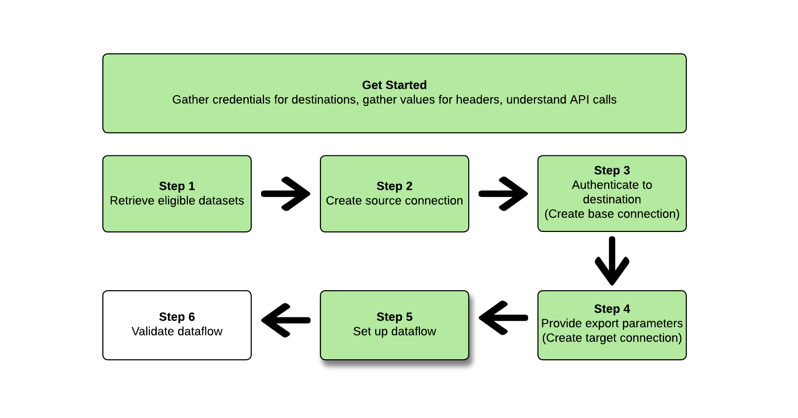

# （ベータ版）を使用してデータセットを書き出す [!DNL Flow Service API]

>[!IMPORTANT]
>
>* データセットの書き出し機能は現在ベータ版で、すべてのユーザーが利用できるわけではありません。ドキュメントと機能は変更される場合があります。
>* このベータ版機能では、Real-time Customer Data Platform の[製品説明](https://helpx.adobe.com/jp/legal/product-descriptions/real-time-customer-data-platform-b2c-edition-prime-and-ultimate-packages.html)で定義されている第 1 世代データの書き出しをサポートしています。
>* この機能は、Real-Time CDP Prime または Ultimate パッケージを購入したお客様が利用できます。 詳しくは、アドビ担当者にお問い合わせください。


この記事では、 [!DNL Flow Service API] エクスポート [データセット](/help/catalog/datasets/overview.md) Adobe Experience Platformから目的のクラウドストレージの場所 ( [!DNL Amazon S3]、SFTP の場所、または [!DNL Google Cloud Storage].

>[!TIP]
>
>また、Experience Platformユーザーインターフェイスを使用してデータセットを書き出すこともできます。 詳しくは、 [データセットの書き出し UI チュートリアル](/help/destinations/ui/export-datasets.md) を参照してください。

## はじめに {#get-started}


このガイドでは、Adobe Experience Platform の次のコンポーネントに関する十分な知識が必要です。

* [[!DNL Experience Platform datasets]](/help/catalog/datasets/overview.md):Adobe Experience Platformに正常に取り込まれたすべてのデータは、 [!DNL Data Lake] データセットとして。 データセットは、通常、スキーマ（列）とフィールド（行）を含むテーブルであるデータコレクションのストレージと管理をおこなう構成体です。データセットには、保存するデータの様々な側面を記述したメタデータも含まれます。
* [[!DNL Sandboxes]](../../sandboxes/home.md)：[!DNL Experience Platform] には、単一の [!DNL Platform] インスタンスを別々の仮想環境に分割し、デジタルエクスペリエンスアプリケーションの開発と発展に役立つ仮想サンドボックスが用意されています。

以下の節では、データセットを Platform のクラウドストレージの宛先に書き出す際に知っておく必要がある追加情報を示します。

### 必要な権限 {#permissions}

データセットを書き出すには、**[!UICONTROL 宛先の管理]**、**[!UICONTROL 宛先の表示]**、**[!UICONTROL 宛先のアクティブ化]**、**[!UICONTROL データセット宛先の管理とアクティブ化]**&#x200B;の各[アクセス制御権限](/help/access-control/home.md#permissions)が必要です。 必要な権限を取得するには、[アクセス制御の概要](/help/access-control/ui/overview.md)を参照するか、製品管理者に問い合わせてください。

データセットの書き出しに必要な権限があることと、宛先でデータセットの書き出しがサポートされていることを確認するには、宛先カタログを参照します。 宛先に「**[!UICONTROL アクティブ化]**」または「**[!UICONTROL データセットを書き出し]**」コントロールがある場合、適切な権限を持っています。

### API 呼び出し例の読み取り {#reading-sample-api-calls}

このチュートリアルでは、API 呼び出しの例を提供し、リクエストの形式を設定する方法を示します。これには、パス、必須ヘッダー、適切な形式のリクエストペイロードが含まれます。また、API レスポンスで返されるサンプル JSON も示されています。ドキュメントで使用される API 呼び出し例の表記について詳しくは、 トラブルシューテングガイドの[API 呼び出し例の読み方](../../landing/troubleshooting.md#how-do-i-format-an-api-request)に関する節を参照してください[!DNL Experience Platform]。

### 必須ヘッダーおよびオプションヘッダーの値の収集 {#gather-values-headers}

を呼び出すために [!DNL Platform] API の場合、最初に [Experience Platform認証のチュートリアル](https://experienceleague.adobe.com/docs/experience-platform/landing/platform-apis/api-authentication.html?lang=ja). 次に示すように、すべての [!DNL Experience Platform] API 呼び出しに必要な各ヘッダーの値は認証チュートリアルで説明されています。

* Authorization： Bearer `{ACCESS_TOKEN}`
* x-api-key： `{API_KEY}`
* x-gw-ims-org-id： `{ORG_ID}`

[!DNL Experience Platform] のリソースは、特定の仮想サンドボックスに分離できます。[!DNL Platform] API へのリクエストでは、操作を実行するサンドボックスの名前と ID を指定できます。次に、オプションのパラメーターを示します。

* x-sandbox-name：`{SANDBOX_NAME}`

>[!NOTE]
>
>[!DNL Experience Platform] のサンドボックスについて詳しくは、[サンドボックスの概要に関するドキュメント](../../sandboxes/home.md)を参照してください。

ペイロード（POST、PUT、PATCH）を含むすべてのリクエストには、メディアのタイプを指定する以下のような追加ヘッダーが必要です。

* Content-Type: `application/json`

### API リファレンスドキュメント {#api-reference-documentation}

このチュートリアルに含まれるすべての API 操作について、付属リファレンスドキュメントが用意されています。詳しくは、 [[!DNL Flow Service] - Adobe Developer Web サイトの宛先 API ドキュメント](https://developer.adobe.com/experience-platform-apis/references/destinations/). このチュートリアルと API リファレンスのドキュメントを並行して使用することをお勧めします。

### 用語集 {#glossary}

この API チュートリアルで遭遇する用語の説明については、 [用語集セクション](https://developer.adobe.com/experience-platform-apis/references/destinations/#tag/Glossary) API リファレンスドキュメントの

### 目的の宛先の接続仕様およびフロー仕様を収集します {#gather-connection-spec-flow-spec}

データセットの書き出しワークフローを開始する前に、データセットの書き出し先の接続仕様とフロー仕様 ID を特定します。 以下の表を参考にしてください。


| 宛先 | 接続仕様 | フロー仕様 |
---------|----------|---------|
| [!DNL Amazon S3] | `4fce964d-3f37-408f-9778-e597338a21ee` | `269ba276-16fc-47db-92b0-c1049a3c131f` |
| [!DNL Azure Blob Storage] | `6d6b59bf-fb58-4107-9064-4d246c0e5bb2` | `95bd8965-fc8a-4119-b9c3-944c2c2df6d2` |
| [!DNL Azure Data Lake Gen 2(ADLS Gen2)] | `be2c3209-53bc-47e7-ab25-145db8b873e1` | `17be2013-2549-41ce-96e7-a70363bec293` |
| [!DNL Data Landing Zone(DLZ)] | `10440537-2a7b-4583-ac39-ed38d4b848e8` | `cd2fc47e-e838-4f38-a581-8fff2f99b63a` |
| [!DNL Google Cloud Storage] | `c5d93acb-ea8b-4b14-8f53-02138444ae99` | `585c15c4-6cbf-4126-8f87-e26bff78b657` |
| SFTP | `36965a81-b1c6-401b-99f8-22508f1e6a26` | `354d6aad-4754-46e4-a576-1b384561c440` |

{style=&quot;table-layout:auto&quot;}

様々な ID を作成するには、これらの ID が必要です [!DNL Flow Service] エンティティ。 また、 [!DNL Connection Spec] 自身を使用して特定のエンティティを設定し、 [!DNL Connection Spec] から [!DNL Flow Service APIs]. この表のすべての宛先の接続仕様の取得については、以下の例を参照してください。

>[!BEGINTABS]

>[!TAB Amazon S3]

**リクエスト**

+++取得 [!DNL connection spec] 対象 [!DNL Amazon S3]

```shell
curl --location --request GET 'https://platform.adobe.io/data/foundation/flowservice/connectionSpecs/4fce964d-3f37-408f-9778-e597338a21ee' \
--header 'accept: application/json' \
--header 'x-api-key: {API_KEY}' \
--header 'x-gw-ims-org-id: {ORG_ID}' \
--header 'x-sandbox-name: {SANDBOX_NAME}' \
--header 'Authorization: Bearer {ACCESS_TOKEN}'
```

+++

**応答**

+++[!DNL Amazon S3] - 接続仕様

```json
{
    "items": [
        {
            "id": "4fce964d-3f37-408f-9778-e597338a21ee",
            "name": "Amazon S3",
            "providerId": "14e34fac-d307-11e9-bb65-2a2ae2dbcce4",
            "version": "1.0",
//...
```

+++

>[!TAB Azure Blob ストレージ]

**リクエスト**

+++取得 [!DNL connection spec] 対象 [!DNL Azure Blob Storage]

```shell
curl --location --request GET 'https://platform.adobe.io/data/foundation/flowservice/connectionSpecs/6d6b59bf-fb58-4107-9064-4d246c0e5bb2' \
--header 'accept: application/json' \
--header 'x-api-key: {API_KEY}' \
--header 'x-gw-ims-org-id: {ORG_ID}' \
--header 'x-sandbox-name: {SANDBOX_NAME}' \
--header 'Authorization: Bearer {ACCESS_TOKEN}'
```

+++

**応答**

+++[!DNL Azure Blob Storage] - [!DNL Connection spec]

```json
{
    "items": [
        {
            "id": "6d6b59bf-fb58-4107-9064-4d246c0e5bb2",
            "name": "Azure Blob Storage",
            "providerId": "14e34fac-d307-11e9-bb65-2a2ae2dbcce4",
            "version": "1.0",
//...
```

+++

>[!TAB Azure Data Lake Gen 2(ADLS Gen2)]

**リクエスト**

+++取得 [!DNL connection spec] 対象 [!DNL Azure Data Lake Gen 2(ADLS Gen2])

```shell
curl --location --request GET 'https://platform.adobe.io/data/foundation/flowservice/connectionSpecs/be2c3209-53bc-47e7-ab25-145db8b873e1' \
--header 'accept: application/json' \
--header 'x-api-key: {API_KEY}' \
--header 'x-gw-ims-org-id: {ORG_ID}' \
--header 'x-sandbox-name: {SANDBOX_NAME}' \
--header 'Authorization: Bearer {ACCESS_TOKEN}'
```

+++

**応答**

+++[!DNL Azure Data Lake Gen 2(ADLS Gen2)] - [!DNL Connection spec]

```json
{
    "items": [
        {
            "id": "be2c3209-53bc-47e7-ab25-145db8b873e1",
            "name": "Azure Data Lake Gen2",
            "providerId": "14e34fac-d307-11e9-bb65-2a2ae2dbcce4",
            "version": "1.0",
//...
```

+++

>[!TAB データランディングゾーン (DLZ)]

**リクエスト**

+++取得 [!DNL connection spec] 対象 [!DNL Data Landing Zone(DLZ)]

```shell
curl --location --request GET 'https://platform.adobe.io/data/foundation/flowservice/connectionSpecs/10440537-2a7b-4583-ac39-ed38d4b848e8' \
--header 'accept: application/json' \
--header 'x-api-key: {API_KEY}' \
--header 'x-gw-ims-org-id: {ORG_ID}' \
--header 'x-sandbox-name: {SANDBOX_NAME}' \
--header 'Authorization: Bearer {ACCESS_TOKEN}'
```

+++

**応答**

+++[!DNL Data Landing Zone(DLZ)] - [!DNL Connection spec]

```json
{
    "items": [
        {
            "id": "10440537-2a7b-4583-ac39-ed38d4b848e8",
            "name": "Data Landing Zone",
            "providerId": "14e34fac-d307-11e9-bb65-2a2ae2dbcce4",
            "version": "1.0",
//...
```

+++

>[!TAB Google Cloud Storage]

**リクエスト**

+++取得 [!DNL connection spec] 対象 [!DNL Google Cloud Storage]

```shell
curl --location --request GET 'https://platform.adobe.io/data/foundation/flowservice/connectionSpecs/c5d93acb-ea8b-4b14-8f53-02138444ae99' \
--header 'accept: application/json' \
--header 'x-api-key: {API_KEY}' \
--header 'x-gw-ims-org-id: {ORG_ID}' \
--header 'x-sandbox-name: {SANDBOX_NAME}' \
--header 'Authorization: Bearer {ACCESS_TOKEN}'
```

+++

**応答**

+++[!DNL Google Cloud Storage] - [!DNL Connection spec]

```json
{
    "items": [
        {
            "id": "c5d93acb-ea8b-4b14-8f53-02138444ae99",
            "name": "Google Cloud Storage",
            "providerId": "14e34fac-d307-11e9-bb65-2a2ae2dbcce4",
            "version": "1.0",
//...
```

+++

>[!TAB SFTP]

**リクエスト**

+++取得 [!DNL connection spec] （SFTP 用）

```shell
curl --location --request GET 'https://platform.adobe.io/data/foundation/flowservice/connectionSpecs/36965a81-b1c6-401b-99f8-22508f1e6a26' \
--header 'accept: application/json' \
--header 'x-api-key: {API_KEY}' \
--header 'x-gw-ims-org-id: {ORG_ID}' \
--header 'x-sandbox-name: {SANDBOX_NAME}' \
--header 'Authorization: Bearer {ACCESS_TOKEN}'
```

+++

**応答**

+++SFTP - [!DNL Connection spec]

```json
{
    "items": [
        {
            "id": "36965a81-b1c6-401b-99f8-22508f1e6a26",
            "name": "SFTP",
            "providerId": "14e34fac-d307-11e9-bb65-2a2ae2dbcce4",
            "version": "1.0",
//...
```

+++

>[!ENDTABS]

以下の手順に従って、クラウドストレージの宛先へのデータセットのデータフローを設定します。 一部の手順では、クラウドストレージの様々な宛先でリクエストと応答が異なります。 このような場合は、ページのタブを使用して、接続してデータセットを書き出す宛先に固有のリクエストと応答を取得します。 正しい [!DNL connection spec] および [!DNL flow spec] を設定します。

## データセットのリストの取得 {#retrieve-list-of-available-datasets}


アクティベーションの対象となるデータセットのリストを取得するには、まず以下のエンドポイントに対して API 呼び出しをおこないます。

>[!BEGINSHADEBOX]

**リクエスト**

+++適格なデータセットの取得 — リクエスト

```shell
curl --location --request GET 'https://platform.adobe.io/data/foundation/flowservice/connectionSpecs/23598e46-f560-407b-88d5-ea6207e49db0/configs?outputType=activationDatasets&outputField=datasets&start=0&limit=20&properties=name,state' \
--header 'accept: application/json' \
--header 'x-gw-ims-org-id: {ORG_ID}' \
--header 'x-api-key: {API_KEY}' \
--header 'x-sandbox-name: {SANDBOX_NAME}' \
--header 'Authorization: Bearer {ACCESS_TOKEN}'
```

適格なデータセットを取得するには、 [!DNL connection spec] 要求 URL で使用される ID は、データレイクソース接続仕様 ID である必要があります。 `23598e46-f560-407b-88d5-ea6207e49db0`、および 2 つのクエリパラメーター `outputField=datasets` および `outputType=activationDatasets` を指定する必要があります。 その他すべてのクエリパラメーターは、 [カタログサービス API](https://developer.adobe.com/experience-platform-apis/references/catalog/).

+++

**応答**

+++データセットの取得 — 応答

```json
{
    "items": [
        {
            "id": "5ef3e324052581191aa6a466",
            "name": "AAM Authenticated Profiles Meta Data",
            "description": "Activation profile export dataset",
            "fileDescription": {
                "persisted": true,
                "containerFormat": "parquet",
                "format": "parquet"
            },
            "aspect": "production",
            "state": "DRAFT"
        },
        {
            "id": "5ef3e3259ad2a1191ab7dd7d",
            "name": "AAM Devices Data",
            "description": "Activation profile export dataset",
            "fileDescription": {
                "persisted": true,
                "containerFormat": "parquet",
                "format": "parquet"
            },
            "aspect": "production",
            "state": "DRAFT"
        },
        {
            "id": "5ef3e325582424191b1beb42",
            "name": "AAM Devices Profile Meta Data",
            "description": "Activation profile export dataset",
            "fileDescription": {
                "persisted": true,
                "containerFormat": "parquet",
                "format": "parquet"
            },
            "aspect": "production",
            "state": "DRAFT"
        },
        {
            "id": "5ef3e328582424191b1beb44",
            "name": "AAM Realtime",
            "description": "Activation profile export dataset",
            "fileDescription": {
                "persisted": true,
                "containerFormat": "parquet",
                "format": "parquet"
            },
            "aspect": "production",
            "state": "DRAFT"
        },
        {
            "id": "5ef3e328fe742a191b2b3ea5",
            "name": "AAM Realtime Profile Updates",
            "description": "Activation profile export dataset",
            "fileDescription": {
                "persisted": true,
                "containerFormat": "parquet",
                "format": "parquet"
            },
            "aspect": "production",
            "state": "DRAFT"
        }
    ],
    "pageInfo": {
        "start": 0,
        "end": 4,
        "total": 149,
        "hasNext": true
    }
}
```

+++

>[!ENDSHADEBOX]

正常な応答は、アクティベーションの対象となるデータセットのリストを含みます。 次の手順でソース接続を構築する際に、これらのデータセットを使用できます。

返される各データセットの様々な応答パラメーターについて詳しくは、 [データセット API 開発者ドキュメント](https://developer.adobe.com/experience-platform-apis/references/catalog/#tag/Datasets/operation/listDatasets).

## ソース接続の作成 {#create-source-connection}


書き出すデータセットのリストを取得したら、それらのデータセット ID を使用してソース接続を作成できます。

>[!BEGINSHADEBOX]

**リクエスト**

+++ソース接続の作成 — リクエスト

リクエスト例で、インラインコメント付きの強調表示された行に注意してください。この行には、追加情報が示されています。 リクエストを任意のターミナルにコピー&amp;ペーストする際に、リクエスト内のインラインコメントを削除します。

```shell {line-numbers="true" start-line="1" highlight="12,16"}
curl --location --request POST 'https://platform.adobe.io/data/foundation/flowservice/sourceConnections' \
--header 'accept: application/json' \
--header 'x-api-key: {API_KEY}' \
--header 'x-gw-ims-org-id: {ORG_ID}' \
--header 'x-sandbox-name: {SANDBOX_NAME}' \
--header 'Content-Type: application/json' \
--header 'Authorization: Bearer {ACCESS_TOKEN}' \
--data-raw '{
  "name": "Connecting to Data Lake",
  "description": "Data Lake source connection to export datasets",
  "connectionSpec": {
    "id": "23598e46-f560-407b-88d5-ea6207e49db0", // this connection spec ID is always the same for Source Connections
    "version": "1.0"
  },
  "params": {
    "datasets": [ // datasets to activate
      {
        "dataSetId": "5ef3e3259ad2a1191ab7dd7d",
        "name": "AAM Devices Data"
      }
    ]
  }
}'
```

+++


**応答**

+++ソース接続の作成 — 応答

```json
{
    "id": "900df191-b983-45cd-90d5-4c7a0326d650",
    "etag": "\"0500ebe1-0000-0200-0000-63e28d060000\""
}
```

+++

>[!ENDSHADEBOX]

成功すると、ID(`id`) をクリックし、 `etag`. 後でデータフローを作成する際に必要になるので、ソース接続 ID をメモしておきます。

また、次の点にも注意してください。

* この手順で作成したソース接続を宛先に対してアクティブ化するには、データセットをデータフローにリンクする必要があります。 詳しくは、 [データフローの作成](#create-dataflow) ソース接続をデータフローにリンクする方法については、を参照してください。
* ソース接続のデータセット ID は、作成後に変更することはできません。 ソース接続にデータセットを追加または削除する必要がある場合は、新しいソース接続を作成し、新しいソース接続の ID をデータフローにリンクする必要があります。

## （ターゲット）ベース接続の作成 {#create-base-connection}


ベース接続は、宛先への資格情報を安全に保存します。 宛先のタイプに応じて、その宛先に対する認証に必要な資格情報が異なる場合があります。 これらの認証パラメーターを検索するには、まず [!DNL connection spec] を設定します。 [接続仕様およびフロー仕様を収集](#gather-connection-spec-flow-spec) そして、 `authSpec` 応答の。 以下のタブを参照して、 `authSpec` サポートされるすべての宛先のプロパティ。

>[!BEGINTABS]

>[!TAB Amazon S3]

+++[!DNL Amazon S3] - [!DNL Connection spec] 表示中 [!DNL auth spec]

インラインコメントが付いた強調表示された行に、 [!DNL connection spec] 次の例で、 [!DNL connection spec].

```json {line-numbers="true" start-line="1" highlight="8"}
{
    "items": [
        {
            "id": "4fce964d-3f37-408f-9778-e597338a21ee",
            "name": "Amazon S3",
            "providerId": "14e34fac-d307-11e9-bb65-2a2ae2dbcce4",
            "version": "1.0",
            "authSpec": [ // describes the authentication parameters
                {
                    "name": "Access Key",
                    "type": "KeyBased",
                    "spec": {
                        "$schema": "http://json-schema.org/draft-07/schema#",
                        "description": "Defines auth params required for connecting to amazon-s3",
                        "type": "object",
                        "properties": {
                            "s3AccessKey": {
                                "description": "Access key id",
                                "type": "string",
                                "pattern": "^[A-Z2-7]{20}$"
                            },
                            "s3SecretKey": {
                                "description": "Secret access key for the user account",
                                "type": "string",
                                "format": "password",
                                "pattern": "^[A-Za-z0-9\/\\+]{40}$"
                            }
                        },
                        "required": [
                            "s3SecretKey",
                            "s3AccessKey"
                        ]
                    }
                }
            ],
//...
```

+++

>[!TAB Azure Blob ストレージ]

+++[!DNL Azure Blob Storage] - [!DNL Connection spec] 表示中 [!DNL auth spec]

インラインコメントが付いた強調表示された行に、 [!DNL connection spec] 次の例で、 [!DNL connection spec].

```json {line-numbers="true" start-line="1" highlight="8"}
{
    "items": [
        {
            "id": "6d6b59bf-fb58-4107-9064-4d246c0e5bb2",
            "name": "Azure Blob Storage",
            "providerId": "14e34fac-d307-11e9-bb65-2a2ae2dbcce4",
            "version": "1.0",
            "authSpec": [ // describes the authentication parameters
                {
                    "name": "ConnectionString",
                    "type": "ConnectionString",
                    "spec": {
                        "$schema": "http://json-schema.org/draft-07/schema#",
                        "description": "Connection String for Azure Blob based destinations",
                        "type": "object",
                        "properties": {
                            "connectionString": {
                                "description": "connection string for login",
                                "type": "string",
                                "format": "password"
                            }
                        },
                        "required": [
                            "connectionString"
                        ]
                    }
                }
            ],
//...
```

+++


>[!TAB Azure Data Lake Gen 2(ADLS Gen2)]

+++[!DNL Azure Data Lake Gen 2(ADLS Gen2)] - [!DNL Connection spec] 表示中 [!DNL auth spec]

インラインコメントが付いた強調表示された行に、 [!DNL connection spec] 次の例で、 [!DNL connection spec].

```json {line-numbers="true" start-line="1" highlight="8"}
{
    "items": [
        {
            "id": "be2c3209-53bc-47e7-ab25-145db8b873e1",
            "name": "Azure Data Lake Gen2",
            "providerId": "14e34fac-d307-11e9-bb65-2a2ae2dbcce4",
            "version": "1.0",
            "authSpec": [ // describes the authentication parameters
                {
                    "name": "Azure Service Principal Auth",
                    "type": "AzureServicePrincipal",
                    "spec": {
                        "$schema": "http://json-schema.org/draft-07/schema#",
                        "description": "defines auth params required for connecting to adlsgen2 using service principal",
                        "type": "object",
                        "properties": {
                            "url": {
                                "description": "Endpoint for Azure Data Lake Storage Gen2.",
                                "type": "string"
                            },
                            "servicePrincipalId": {
                                "description": "Service Principal Id to connect to ADLSGen2.",
                                "type": "string"
                            },
                            "servicePrincipalKey": {
                                "description": "Service Principal Key to connect to ADLSGen2.",
                                "type": "string",
                                "format": "password"
                            },
                            "tenant": {
                                "description": "Tenant information(domain name or tenant ID).",
                                "type": "string"
                            }
                        },
                        "required": [
                            "servicePrincipalKey",
                            "url",
                            "tenant",
                            "servicePrincipalId"
                        ]
                    }
                }
            ],
//...
```

+++


>[!TAB データランディングゾーン (DLZ)]

+++[!DNL Data Landing Zone(DLZ)] - [!DNL Connection spec] 表示中 [!DNL auth spec]

>[!NOTE]
>
>データランディングゾーンの宛先には、 [!DNL auth spec].

```json
{
    "items": [
        {
            "id": "10440537-2a7b-4583-ac39-ed38d4b848e8",
            "name": "Data Landing Zone",
            "providerId": "14e34fac-d307-11e9-bb65-2a2ae2dbcce4",
            "version": "1.0",
            "authSpec": [],
//...
```

+++

>[!TAB Google Cloud Storage]

+++[!DNL Google Cloud Storage] - [!DNL Connection spec] 表示中 [!DNL auth spec]

インラインコメントが付いた強調表示された行に、 [!DNL connection spec] 次の例で、 [!DNL connection spec].

```json {line-numbers="true" start-line="1" highlight="8"}
{
    "items": [
        {
            "id": "c5d93acb-ea8b-4b14-8f53-02138444ae99",
            "name": "Google Cloud Storage",
            "providerId": "14e34fac-d307-11e9-bb65-2a2ae2dbcce4",
            "version": "1.0",
            "authSpec": [ // describes the authentication parameters
                {
                    "name": "Google Cloud Storage authentication credentials",
                    "type": "GoogleCloudStorageAuth",
                    "spec": {
                        "$schema": "http://json-schema.org/draft-07/schema#",
                        "description": "defines auth params required for connecting to google cloud storage connector.",
                        "type": "object",
                        "properties": {
                            "accessKeyId": {
                                "description": "Access Key Id for the user account",
                                "type": "string"
                            },
                            "secretAccessKey": {
                                "description": "Secret Access Key for the user account",
                                "type": "string",
                                "format": "password"
                            }
                        },
                        "required": [
                            "accessKeyId",
                            "secretAccessKey"
                        ]
                    }
                }
            ],
//...
```

+++

>[!TAB SFTP]

+++SFTP - [!DNL Connection spec] 表示中 [!DNL auth spec]

>[!NOTE]
>
>SFTP の宛先では、 [!DNL auth spec]（パスワードと SSH キー認証の両方をサポートするので）

インラインコメントが付いた強調表示された行に、 [!DNL connection spec] 次の例で、 [!DNL connection spec].

```json {line-numbers="true" start-line="1" highlight="8"}
{
    "items": [
        {
            "id": "36965a81-b1c6-401b-99f8-22508f1e6a26",
            "name": "SFTP",
            "providerId": "14e34fac-d307-11e9-bb65-2a2ae2dbcce4",
            "version": "1.0",
            "authSpec": [ // describes the authentication parameters
                {
                    "name": "SFTP with Password",
                    "type": "SFTP",
                    "spec": {
                        "$schema": "http://json-schema.org/draft-07/schema#",
                        "description": "defines auth params required for connecting to sftp locations with a password",
                        "type": "object",
                        "properties": {
                            "domain": {
                                "description": "Domain of server",
                                "type": "string"
                            },
                            "username": {
                                "description": "Username",
                                "type": "string"
                            },
                            "password": {
                                "description": "Password",
                                "type": "string",
                                "format": "password"
                            }
                        },
                        "required": [
                            "password",
                            "domain",
                            "username"
                        ]
                    }
                },
                {
                    "name": "SFTP with SSH Key",
                    "type": "SFTP",
                    "spec": {
                        "$schema": "http://json-schema.org/draft-07/schema#",
                        "description": "defines auth params required for connecting to sftp locations using SSH Key",
                        "type": "object",
                        "properties": {
                            "domain": {
                                "description": "Domain of server",
                                "type": "string"
                            },
                            "username": {
                                "description": "Username",
                                "type": "string"
                            },
                            "sshKey": {
                                "description": "Base64 string of the private SSH key",
                                "type": "string",
                                "format": "password",
                                "contentEncoding": "base64",
                                "uiAttributes": {
                                    "tooltip": {
                                        "id": "platform_destinations_connect_sftp_ssh",
                                        "fallbackUrl": "http://www.adobe.com/go/destinations-sftp-connection-parameters-en "
                                    }
                                }
                            }
                        },
                        "required": [
                            "sshKey",
                            "domain",
                            "username"
                        ]
                    }
                }
            ],
//...
```

+++

>[!ENDTABS]

認証仕様で指定されたプロパティ ( `authSpec` 応答から ) 必要な資格情報を使用して、以下の例に示すように、各宛先タイプに固有のベース接続を作成できます。

>[!BEGINTABS]

>[!TAB Amazon S3]

**リクエスト**

+++[!DNL Amazon S3]  — ベース接続リクエスト

>[!TIP]
>
>必要な認証資格情報の取得方法について詳しくは、 [宛先への認証](/help/destinations/catalog/cloud-storage/amazon-s3.md#authenticate) の節を参照してください。

リクエスト例で、インラインコメント付きの強調表示された行に注意してください。この行には、追加情報が示されています。 リクエストを任意のターミナルにコピー&amp;ペーストする際に、リクエスト内のインラインコメントを削除します。

```shell {line-numbers="true" start-line="1" highlight="18"}
curl --location --request POST 'https://platform.adobe.io/data/foundation/flowservice/connections' \
--header 'accept: application/json' \
--header 'Authorization: Bearer {ACCESS_TOKEN}' \
--header 'x-api-key: <API-KEY>' \
--header 'x-gw-ims-org-id: <IMS-ORG-ID>' \
--header 'x-sandbox-name: <SANDBOX-NAME>' \
--header 'Content-Type: application/json' \
--data-raw '{
  "name": "Amazon S3 Base Connection",
  "auth": {
    "specName": "Access Key",
    "params": {
      "s3SecretKey": "<Add secret key>",
      "s3AccessKey": "<Add access key>"
    }
  },
  "connectionSpec": {
    "id": "4fce964d-3f37-408f-9778-e597338a21ee", // Amazon S3 connection spec
    "version": "1.0"
  }
}'
```

+++

**応答**

+++[!DNL Amazon S3] ベース接続応答

```json
{
    "id": "12401496-2573-4ca7-8137-fef1aeb9dd4c",
    "etag": "\"0000d781-0000-0200-0000-63e29f420000\""
}
```

+++

>[!TAB Azure Blob ストレージ]

**リクエスト**

+++[!DNL Azure Blob Storage]  — ベース接続リクエスト

>[!TIP]
>
>必要な認証資格情報の取得方法について詳しくは、 [宛先への認証](/help/destinations/catalog/cloud-storage/azure-blob.md#authenticate) の節を参照してください。

リクエスト例で、インラインコメント付きの強調表示された行に注意してください。この行には、追加情報が示されています。 リクエストを任意のターミナルにコピー&amp;ペーストする際に、リクエスト内のインラインコメントを削除します。

```shell {line-numbers="true" start-line="1" highlight="16"}
curl --location --request POST 'https://platform.adobe.io/data/foundation/flowservice/connections' \
--header 'accept: application/json' \
--header 'Authorization: Bearer {ACCESS_TOKEN}' \
--header 'x-api-key: <API-KEY>' \
--header 'x-gw-ims-org-id: <IMS-ORG-ID>' \
--header 'x-sandbox-name: <SANDBOX-NAME>' \
--header 'Content-Type: application/json' \
--data-raw '{
  "name": "Azure Blob Storage Base Connection",
  "auth": {
    "specName": "ConnectionString",
    "params": {
      "connectionString": "<Add Azure Blob connection string>"
    }
  },
  "connectionSpec": {
    "id": "6d6b59bf-fb58-4107-9064-4d246c0e5bb2", // Azure Blob Storage connection spec
    "version": "1.0"
  }
}'
```

+++

**応答**

+++[!DNL Azure Blob Storage]  — ベース接続応答

```json
{
    "id": "12401496-2573-4ca7-8137-fef1aeb9dd4c",
    "etag": "\"0000d781-0000-0200-0000-63e29f420000\""
}
```

+++

>[!TAB Azure Data Lake Gen 2(ADLS Gen2)]

**リクエスト**

+++[!DNL Azure Data Lake Gen 2(ADLS Gen2)]  — ベース接続リクエスト

>[!TIP]
>
>必要な認証資格情報の取得方法について詳しくは、 [宛先への認証](/help/destinations/catalog/cloud-storage/adls-gen2.md#authenticate) Azure Data Lake Gen 2(ADLS Gen2) の宛先ドキュメントページの「 」セクションを参照してください。

リクエスト例で、インラインコメント付きの強調表示された行に注意してください。この行には、追加情報が示されています。 リクエストを任意のターミナルにコピー&amp;ペーストする際に、リクエスト内のインラインコメントを削除します。

```shell {line-numbers="true" start-line="1" highlight="20"}
curl --location --request POST 'https://platform.adobe.io/data/foundation/flowservice/connections' \
--header 'accept: application/json' \
--header 'Authorization: Bearer {ACCESS_TOKEN}' \
--header 'x-api-key: <API-KEY>' \
--header 'x-gw-ims-org-id: <IMS-ORG-ID>' \
--header 'x-sandbox-name: <SANDBOX-NAME>' \
--header 'Content-Type: application/json' \
--data-raw '{
  "name": "Azure Data Lake Gen 2(ADLS Gen2) Base Connection",
  "auth": {
    "specName": "Azure Service Principal Auth",
    "params": {
      "servicePrincipalKey": "<Add servicePrincipalKey>",
      "url": "<Add url>",
      "tenant": "<Add tenant>",
      "servicePrincipalId": "<Add servicePrincipalId>"
    }
  },
  "connectionSpec": {
    "id": "be2c3209-53bc-47e7-ab25-145db8b873e1", // Azure Data Lake Gen 2(ADLS Gen2) connection spec
    "version": "1.0"
  }
}'
```

+++

**応答**

+++[!DNL Azure Data Lake Gen 2(ADLS Gen2)]  — ベース接続応答

```json
{
    "id": "12401496-2573-4ca7-8137-fef1aeb9dd4c",
    "etag": "\"0000d781-0000-0200-0000-63e29f420000\""
}
```

+++

>[!TAB データランディングゾーン (DLZ)]

**リクエスト**

+++[!DNL Data Landing Zone(DLZ)]  — ベース接続リクエスト

>[!TIP]
>
>データランディングゾーンの宛先に認証資格情報は必要ありません。 詳しくは、 [宛先への認証](/help/destinations/catalog/cloud-storage/data-landing-zone.md#authenticate) の節を参照してください。

```shell
curl --location --request POST 'https://platform.adobe.io/data/foundation/flowservice/connections' \
--header 'accept: application/json' \
--header 'Authorization: Bearer {ACCESS_TOKEN}' \
--header 'x-api-key: <API-KEY>' \
--header 'x-gw-ims-org-id: <IMS-ORG-ID>' \
--header 'x-sandbox-name: <SANDBOX-NAME>' \
--header 'Content-Type: application/json' \
--data-raw '{
  "name": "Data Landing Zone(DLZ) Base Connection",
  "auth": {
    "name": "Data Landing Zone(DLZ) Base Connection",
    "description": "Data Landing Zone(DLZ) Base Connection",
    "connectionSpec": {
        "id": "10440537-2a7b-4583-ac39-ed38d4b848e8",
        "version": "1.0"
    }
}'
```

+++

**応答**

+++[!DNL Data Landing Zone]  — ベース接続応答

```json
{
    "id": "12401496-2573-4ca7-8137-fef1aeb9dd4c",
    "etag": "\"0000d781-0000-0200-0000-63e29f420000\""
}
```

+++

>[!TAB Google Cloud Storage]

**リクエスト**

+++[!DNL Google Cloud Storage]  — ベース接続リクエスト

>[!TIP]
>
>必要な認証資格情報の取得方法について詳しくは、 [宛先への認証](/help/destinations/catalog/cloud-storage/google-cloud-storage.md#authenticate) の節を参照してください。

リクエスト例で、インラインコメント付きの強調表示された行に注意してください。この行には、追加情報が示されています。 リクエストを任意のターミナルにコピー&amp;ペーストする際に、リクエスト内のインラインコメントを削除します。

```shell {line-numbers="true" start-line="1" highlight="18"}
curl --location --request POST 'https://platform.adobe.io/data/foundation/flowservice/connections' \
--header 'accept: application/json' \
--header 'Authorization: Bearer {ACCESS_TOKEN}' \
--header 'x-api-key: <API-KEY>' \
--header 'x-gw-ims-org-id: <IMS-ORG-ID>' \
--header 'x-sandbox-name: <SANDBOX-NAME>' \
--header 'Content-Type: application/json' \
--data-raw '{
  "name": "Google Cloud Storage Base Connection",
  "auth": {
    "specName": "Google Cloud Storage authentication credentials",
    "params": {
      "accessKeyId": "<Add accessKeyId>",
      "secretAccessKey": "<Add secret Access Key>"
    }
  },
  "connectionSpec": {
    "id": "c5d93acb-ea8b-4b14-8f53-02138444ae99", // Google Cloud Storage connection spec
    "version": "1.0"
  }
}'
```

+++

**応答**

+++[!DNL Google Cloud Storage]  — ベース接続応答

```json
{
    "id": "12401496-2573-4ca7-8137-fef1aeb9dd4c",
    "etag": "\"0000d781-0000-0200-0000-63e29f420000\""
}
```

+++

>[!TAB SFTP]

**リクエスト**

+++SFTP（パスワード） — ベース接続リクエスト

>[!TIP]
>
>必要な認証資格情報の取得方法について詳しくは、 [宛先への認証](/help/destinations/catalog/cloud-storage/sftp.md#authentication-information) の節を参照してください。

リクエスト例で、インラインコメント付きの強調表示された行に注意してください。この行には、追加情報が示されています。 リクエストを任意のターミナルにコピー&amp;ペーストする際に、リクエスト内のインラインコメントを削除します。

```shell {line-numbers="true" start-line="1" highlight="19"}
curl --location --request POST 'https://platform.adobe.io/data/foundation/flowservice/connections' \
--header 'accept: application/json' \
--header 'Authorization: Bearer {ACCESS_TOKEN}' \
--header 'x-api-key: <API-KEY>' \
--header 'x-gw-ims-org-id: <IMS-ORG-ID>' \
--header 'x-sandbox-name: <SANDBOX-NAME>' \
--header 'Content-Type: application/json' \
--data-raw '{
  "name": "SFTP with password Base Connection",
  "auth": {
    "specName": "SFTP with Password",
    "params": {
      "domain": "<Add domain>",
      "username": "<Add username>",
      "password": "<Add password>"
    }
  },
  "connectionSpec": {
    "id": "36965a81-b1c6-401b-99f8-22508f1e6a26", // SFTP connection spec
    "version": "1.0"
  }
}'
```

+++

+++SFTP（SSH キー） — ベース接続リクエスト

>[!TIP]
>
>必要な認証資格情報の取得方法について詳しくは、 [宛先への認証](/help/destinations/catalog/cloud-storage/sftp.md#authentication-information) の節を参照してください。

リクエスト例で、インラインコメント付きの強調表示された行に注意してください。この行には、追加情報が示されています。 リクエストを任意のターミナルにコピー&amp;ペーストする際に、リクエスト内のインラインコメントを削除します。

```shell {line-numbers="true" start-line="1" highlight="19"}
curl --location --request POST 'https://platform.adobe.io/data/foundation/flowservice/connections' \
--header 'accept: application/json' \
--header 'Authorization: Bearer {ACCESS_TOKEN}' \
--header 'x-api-key: <API-KEY>' \
--header 'x-gw-ims-org-id: <IMS-ORG-ID>' \
--header 'x-sandbox-name: <SANDBOX-NAME>' \
--header 'Content-Type: application/json' \
--data-raw '{
  "name": "SFTP with SSH key Base Connection",
  "auth": {
    "specName": "SFTP with SSH Key",
    "params": {
      "domain": "<Add domain>",
      "username": "<Add username>",
      "sshKey": "<Add SSH key>"
    }
  },
  "connectionSpec": {
    "id": "36965a81-b1c6-401b-99f8-22508f1e6a26", // SFTP connection spec
    "version": "1.0"
  }
}'
```

+++

**応答**

+++SFTP — ベース接続応答

```json
{
    "id": "12401496-2573-4ca7-8137-fef1aeb9dd4c",
    "etag": "\"0000d781-0000-0200-0000-63e29f420000\""
}
```

+++

>[!ENDTABS]

応答の接続 ID をメモします。 この ID は、次の手順でターゲット接続を作成する際に必要になります。

## ターゲット接続の作成 {#create-target-connection}


次に、データセットの書き出しパラメーターを保存するターゲット接続を作成する必要があります。 書き出しパラメーターには、場所、ファイル形式、圧縮、その他の詳細が含まれます。 詳しくは、 `targetSpec` 宛先の接続仕様で指定されたプロパティ。各宛先タイプでサポートされるプロパティを理解します。 以下のタブを参照して、 `targetSpec` サポートされるすべての宛先のプロパティ。

>[!BEGINTABS]

>[!TAB Amazon S3]

+++[!DNL Amazon S3] - [!DNL Connection spec] ターゲット接続パラメータの表示

強調表示された行に、 [!DNL connection spec] 以下の例。 [!DNL target spec] 接続仕様のパラメータ。 次の例でも、ターゲットパラメーターが示されています。 *not* データセットの書き出し先に適用できます。

```json {line-numbers="true" start-line="1" highlight="10,41,56"}
{
    "items": [
        {
            "id": "4fce964d-3f37-408f-9778-e597338a21ee",
            "name": "Amazon S3",
            "providerId": "14e34fac-d307-11e9-bb65-2a2ae2dbcce4",
            "version": "1.0",
            "authSpec": [...],
            "encryptionSpecs": [...],
            "targetSpec": { // describes the target connection parameters
                "name": "User based target",
                "type": "UserNamespace",
                "spec": {
                    "$schema": "http://json-schema.org/draft-07/schema#",
                    "type": "object",
                    "properties": {
                        "bucketName": {
                            "title": "Bucket name",
                            "description": "Bucket name",
                            "type": "string",
                            "pattern": "(?=^.{3,63}$)(?!^(\\d+\\.)+\\d+$)(^(([a-z0-9]|[a-z0-9][a-z0-9\\-]*[a-z0-9])\\.)*([a-z0-9]|[a-z0-9][a-z0-9\\-]*[a-z0-9])$)",
                            "uiAttributes": {
                                "tooltip": {
                                    "id": "platform_destinations_connect_s3_bucket",
                                    "fallbackUrl": "http://www.adobe.com/go/destinations-amazon-s3-connection-parameters-en"
                                }
                            }
                        },
                        "path": {
                            "title": "Folder path",
                            "description": "Output path for copying files",
                            "type": "string",
                            "pattern": "^[0-9a-zA-Z\/\\!\\-_\\.\\*\\''\\(\\)]*((\\%SEGMENT_(NAME|ID)\\%)?\/?)+$",
                            "uiAttributes": {
                                "tooltip": {
                                    "id": "platform_destinations_connect_s3_folderpath",
                                    "fallbackUrl": "http://www.adobe.com/go/destinations-amazon-s3-connection-parameters-en"
                                }
                            }
                        },
                        "fileType": {...}, // not applicable to dataset destinations
                        "datasetFileType": {
                            "conditional": {
                                "field": "flowSpec.attributes._workflow",
                                "operator": "CONTAINS",
                                "value": "DATASETS"
                            },
                            "title": "File Type",
                            "description": "Select file format",
                            "type": "string",
                            "enum": [
                                "JSON",
                                "PARQUET"
                            ]
                        },
                        "csvOptions": {...}, // not applicable to dataset destinations
                        "compression": {
                            "title": "Compression format",
                            "description": "Select the desired file compression format.",
                            "type": "string",
                            "enum": [
                                "NONE",
                                "GZIP"
                            ]
                        }
                    },
                    "required": [
                        "bucketName",
                        "path",
                        "datasetFileType",
                        "compression",
                        "fileType"
                    ]
                }
//...
```

+++

>[!TAB Azure Blob ストレージ]

+++[!DNL Azure Blob Storage] - [!DNL Connection spec] ターゲット接続パラメータの表示

強調表示された行に、 [!DNL connection spec] 以下の例。 [!DNL target spec] 接続仕様のパラメータ。 次の例でも、ターゲットパラメーターが示されています。 *not* データセットの書き出し先に適用できます。

```json {line-numbers="true" start-line="1" highlight="10,29,44"}
{
    "items": [
        {
            "id": "6d6b59bf-fb58-4107-9064-4d246c0e5bb2",
            "name": "Azure Blob Storage",
            "providerId": "14e34fac-d307-11e9-bb65-2a2ae2dbcce4",
            "version": "1.0",
            "authSpec": [...],
            "encryptionSpecs": [...],
            "targetSpec": { // describes the target connection parameters
                "name": "User based target",
                "type": "UserNamespace",
                "spec": {
                    "$schema": "http://json-schema.org/draft-07/schema#",
                    "type": "object",
                    "properties": {
                        "path": {
                            "title": "Folder path",
                            "description": "Output path (relative) indicating where to upload the data",
                            "type": "string",
                            "pattern": "^[0-9a-zA-Z\/\\!\\-_\\.\\*\\'\\(\\)]+$"
                        },
                        "container": {
                            "title": "Container",
                            "description": "Container within the storage where to upload the data",
                            "type": "string",
                            "pattern": "^[a-z0-9](?!.*--)[a-z0-9-]{1,61}[a-z0-9]$"
                        },
                        "fileType": {...}, // not applicable to dataset destinations
                        "datasetFileType": {
                            "conditional": {
                                "field": "flowSpec.attributes._workflow",
                                "operator": "CONTAINS",
                                "value": "DATASETS"
                            },
                            "title": "File Type",
                            "description": "Select file format",
                            "type": "string",
                            "enum": [
                                "JSON",
                                "PARQUET"
                            ]
                        },
                        "csvOptions": {...}, // not applicable to dataset destinations
                        "compression": {
                            "title": "Compression format",
                            "description": "Select the desired file compression format.",
                            "type": "string",
                            "enum": [
                                "NONE",
                                "GZIP"
                            ]
                        }
                    },
                    "required": [
                        "container",
                        "path",
                        "datasetFileType",
                        "compression",
                        "fileType"
                    ]
                }
//...
```

+++


>[!TAB Azure Data Lake Gen 2(ADLS Gen2)]

+++[!DNL Azure Data Lake Gen 2(ADLS Gen2)] - [!DNL Connection spec] ターゲット接続パラメータの表示

強調表示された行に、 [!DNL connection spec] 以下の例。 [!DNL target spec] 接続仕様のパラメータ。 次の例でも、ターゲットパラメーターが示されています。 *not* データセットの書き出し先に適用できます。

```json {line-numbers="true" start-line="1" highlight="10,22,37"}
{
    "items": [
        {
            "id": "be2c3209-53bc-47e7-ab25-145db8b873e1",
            "name": "Azure Data Lake Gen2",
            "providerId": "14e34fac-d307-11e9-bb65-2a2ae2dbcce4",
            "version": "1.0",
            "authSpec": [...],
            "encryptionSpecs": [...],
            "targetSpec": { // describes the target connection parameters
                "name": "User based target",
                "type": "UserNamespace",
                "spec": {
                    "$schema": "http://json-schema.org/draft-07/schema#",
                    "type": "object",
                    "properties": {
                        "path": {
                            "title": "Folder path",
                            "description": "Enter the path to your Azure Data Lake Storage folder",
                            "type": "string"
                        },
                        "fileType": {...}, // not applicable to dataset destinations
                        "datasetFileType": {
                            "conditional": {
                                "field": "flowSpec.attributes._workflow",
                                "operator": "CONTAINS",
                                "value": "DATASETS"
                            },
                            "title": "File Type",
                            "description": "Select file format",
                            "type": "string",
                            "enum": [
                                "JSON",
                                "PARQUET"
                            ]
                        },
                        "csvOptions":{...}, // not applicable to dataset destinations
                        "compression": {
                            "title": "Compression format",
                            "description": "Select the desired file compression format.",
                            "type": "string",
                            "enum": [
                                "NONE",
                                "GZIP"
                            ]
                        }
                    },
                    "required": [
                        "path",
                        "datasetFileType",
                        "compression",
                        "fileType"
                    ]
                }
//...
```

+++

>[!TAB データランディングゾーン (DLZ)]

+++[!DNL Data Landing Zone(DLZ)] - [!DNL Connection spec] ターゲット接続パラメータの表示

強調表示された行に、 [!DNL connection spec] 以下の例。 [!DNL target spec] 接続仕様のパラメータ。 次の例でも、ターゲットパラメーターが示されています。 *not* データセットの書き出し先に適用できます。

```json {line-numbers="true" start-line="1" highlight="9,21,36"}
"items": [
    {
        "id": "10440537-2a7b-4583-ac39-ed38d4b848e8",
        "name": "Data Landing Zone",
        "providerId": "14e34fac-d307-11e9-bb65-2a2ae2dbcce4",
        "version": "1.0",
        "authSpec": [],
        "encryptionSpecs": [],
        "targetSpec": { // describes the target connection parameters
            "name": "User based target",
            "type": "UserNamespace",
            "spec": {
                "$schema": "http://json-schema.org/draft-07/schema#",
                "type": "object",
                "properties": {
                    "path": {
                        "title": "Folder path",
                        "description": "Enter the path to your Azure Data Lake Storage folder",
                        "type": "string"
                    },
                    "fileType": {...}, // not applicable to dataset destinations
                    "datasetFileType": {
                        "conditional": {
                            "field": "flowSpec.attributes._workflow",
                            "operator": "CONTAINS",
                            "value": "DATASETS"
                        },
                        "title": "File Type",
                        "description": "Select file format",
                        "type": "string",
                        "enum": [
                            "JSON",
                            "PARQUET"
                        ]
                    },
                    "csvOptions": {...}, // not applicable to dataset destinations
                    "compression": {
                        "title": "Compression format",
                        "description": "Select the desired file compression format.",
                        "type": "string",
                        "enum": [
                            "NONE",
                            "GZIP"
                        ]
                    }
                },
                "required": [
                    "path",
                    "datasetFileType",
                    "compression",
                    "fileType"
                ]
            }
//...
```

+++

>[!TAB Google Cloud Storage]

+++[!DNL Google Cloud Storage] - [!DNL Connection spec] ターゲット接続パラメータの表示

強調表示された行に、 [!DNL connection spec] 以下の例。 [!DNL target spec] 接続仕様のパラメータ。 次の例でも、ターゲットパラメーターが示されています。 *not* データセットの書き出し先に適用できます。

```json {line-numbers="true" start-line="1" highlight="10,29,44"}
{
    "items": [
        {
            "id": "c5d93acb-ea8b-4b14-8f53-02138444ae99",
            "name": "Google Cloud Storage",
            "providerId": "14e34fac-d307-11e9-bb65-2a2ae2dbcce4",
            "version": "1.0",
            "authSpec": [...],
            "encryptionSpecs": [...],
            "targetSpec": { // describes the target connection parameters
                "name": "User based target",
                "type": "UserNamespace",
                "spec": {
                    "$schema": "http://json-schema.org/draft-07/schema#",
                    "type": "object",
                    "properties": {
                        "bucketName": {
                            "title": "Bucket name",
                            "description": "Bucket name",
                            "type": "string",
                            "pattern": "(?!^goog.*$)(?!^.*g(o|0)(o|0)gle.*$)(((?=^.{3,63}$)(^([a-z0-9]|[a-z0-9][a-z0-9\\-_]*)[a-z0-9]$))|((?=^.{3,222}$)(?!^(\\d+\\.)+\\d+$)(^(([a-z0-9]{1,63}|[a-z0-9][a-z0-9\\-_]{1,61}[a-z0-9])\\.)*([a-z0-9]{1,63}|[a-z0-9][a-z0-9\\-_]{1,61}[a-z0-9])$)))"
                        },
                        "path": {
                            "title": "Folder path",
                            "description": "Output path for copying files",
                            "type": "string",
                            "pattern": "^[0-9a-zA-Z\/\\!\\-_\\.\\*\\''\\(\\)]*((\\%SEGMENT_(NAME|ID)\\%)?\/?)+$"
                        },
                        "fileType": {...}, // not applicable to dataset destinations
                        "datasetFileType": {
                            "conditional": {
                                "field": "flowSpec.attributes._workflow",
                                "operator": "CONTAINS",
                                "value": "DATASETS"
                            },
                            "title": "File Type",
                            "description": "Select file format",
                            "type": "string",
                            "enum": [
                                "JSON",
                                "PARQUET"
                            ]
                        },
                        "csvOptions": {...}, // not applicable to dataset destinations
                        "compression": {
                            "title": "Compression format",
                            "description": "Select the desired file compression format.",
                            "type": "string",
                            "enum": [
                                "NONE",
                                "GZIP"
                            ]
                        }
                    },
                    "required": [
                        "bucketName",
                        "path",
                        "datasetFileType",
                        "compression",
                        "fileType"
                    ]
                }
//...
```

+++

>[!TAB SFTP]

+++SFTP - [!DNL Connection spec] ターゲット接続パラメータの表示

強調表示された行に、 [!DNL connection spec] 以下の例。 [!DNL target spec] 接続仕様のパラメータ。 次の例でも、ターゲットパラメーターが示されています。 *not* データセットの書き出し先に適用できます。

```json {line-numbers="true" start-line="1" highlight="10,22,37"}
{
    "items": [
        {
            "id": "36965a81-b1c6-401b-99f8-22508f1e6a26",
            "name": "SFTP",
            "providerId": "14e34fac-d307-11e9-bb65-2a2ae2dbcce4",
            "version": "1.0",
            "authSpec": [...],
            "encryptionSpecs": [...],
            "targetSpec": { // describes the target connection parameters
                "name": "User based target",
                "type": "UserNamespace",
                "spec": {
                    "$schema": "http://json-schema.org/draft-07/schema#",
                    "type": "object",
                    "properties": {
                        "remotePath": {
                            "title": "Folder path",
                            "description": "Enter your folder path",
                            "type": "string"
                        },
                        "fileType": {...}, // not applicable to dataset destinations
                        "datasetFileType": {
                            "conditional": {
                                "field": "flowSpec.attributes._workflow",
                                "operator": "CONTAINS",
                                "value": "DATASETS"
                            },
                            "title": "File Type",
                            "description": "Select file format",
                            "type": "string",
                            "enum": [
                                "JSON",
                                "PARQUET"
                            ]
                        },
                        "csvOptions": {...}, // not applicable to dataset destinations
                        "compression": {
                            "title": "Compression format",
                            "description": "Select the desired file compression format.",
                            "type": "string",
                            "enum": [
                                "GZIP",
                                "NONE"
                            ]
                        }
                    },
                    "required": [
                        "remotePath",
                        "datasetFileType",
                        "compression",
                        "fileType"
                    ]
                },
//...
```

+++

>[!ENDTABS]


上記の仕様を使用すると、次のタブに示すように、目的のクラウドストレージの宛先に固有のターゲット接続リクエストを作成できます。

>[!BEGINTABS]

>[!TAB Amazon S3]

**リクエスト**

+++[!DNL Amazon S3] - Target 接続リクエスト

>[!TIP]
>
>必要なターゲットパラメーターの取得方法について詳しくは、 [宛先の詳細を入力](/help/destinations/catalog/cloud-storage/amazon-s3.md#destination-details) セクション [!DNL Amazon S3] リンク先のドキュメントページ。
>( `datasetFileType`詳しくは、 API リファレンスドキュメントを参照してください。

リクエスト例で、インラインコメント付きの強調表示された行に注意してください。この行には、追加情報が示されています。 リクエストを任意のターミナルにコピー&amp;ペーストする際に、リクエスト内のインラインコメントを削除します。

```shell {line-numbers="true" start-line="1" highlight="19"}
curl --location --request POST 'https://platform.adobe.io/data/foundation/flowservice/targetConnections' \
--header 'accept: application/json' \
--header 'x-api-key: {API_KEY}' \
--header 'x-gw-ims-org-id: {ORG_ID}' \
--header 'x-sandbox-name: {SANDBOX_NAME}' \
--header 'Content-Type: application/json' \
--header 'Authorization: Bearer {ACCESS_TOKEN}' \
--data-raw '{
    "name": "Amazon S3 Beta Target Connection",
    "baseConnectionId": "<FROM_STEP_CREATE_TARGET_BASE_CONNECTION>",
    "params": {
        "mode": "Server-to-server",
        "bucketName": "your-bucket-name",
        "path": "folder/subfolder",
        "compression": "NONE",
        "datasetFileType": "JSON"
    },
    "connectionSpec": {
        "id": "4fce964d-3f37-408f-9778-e597338a21ee", // Amazon S3 connection spec id
        "version": "1.0"
    }
}'
```

+++

**応答**

+++Target 接続 — 応答

```json
{
    "id": "12401496-2573-4ca7-8137-fef1aeb9dd4c",
    "etag": "\"0000d781-0000-0200-0000-63e29f420000\""
}
```

+++

>[!TAB Azure Blob ストレージ]

**リクエスト**

+++[!DNL Azure Blob Storage] - Target 接続リクエスト

>[!TIP]
>
>必要なターゲットパラメーターの取得方法について詳しくは、 [宛先の詳細を入力](/help/destinations/catalog/cloud-storage/azure-blob.md#destination-details) セクション [!DNL Azure Blob Storage] リンク先のドキュメントページ。
>( `datasetFileType`詳しくは、 API リファレンスドキュメントを参照してください。


リクエスト例で、インラインコメント付きの強調表示された行に注意してください。この行には、追加情報が示されています。 リクエストを任意のターミナルにコピー&amp;ペーストする際に、リクエスト内のインラインコメントを削除します。

```shell {line-numbers="true" start-line="1" highlight="19"}
curl --location --request POST 'https://platform.adobe.io/data/foundation/flowservice/targetConnections' \
--header 'accept: application/json' \
--header 'x-api-key: {API_KEY}' \
--header 'x-gw-ims-org-id: {ORG_ID}' \
--header 'x-sandbox-name: {SANDBOX_NAME}' \
--header 'Content-Type: application/json' \
--header 'Authorization: Bearer {ACCESS_TOKEN}' \
--data-raw '{
    "name": "Azure Blob Storage Beta Target Connection",
    "baseConnectionId": "<FROM_STEP_CREATE_TARGET_BASE_CONNECTION>",
    "params": {
        "mode": "Server-to-server",
        "container": "your-container-name",
        "path": "folder/subfolder",
        "compression": "NONE",
        "datasetFileType": "JSON"
    },
    "connectionSpec": {
        "id": "6d6b59bf-fb58-4107-9064-4d246c0e5bb2", // Azure Blob Storage connection spec id
        "version": "1.0"
    }
}'
```

+++

**応答**

+++Target 接続 — 応答

```json
{
    "id": "12401496-2573-4ca7-8137-fef1aeb9dd4c",
    "etag": "\"0000d781-0000-0200-0000-63e29f420000\""
}
```

+++

>[!TAB Azure Data Lake Gen 2(ADLS Gen2)]

**リクエスト**

+++[!DNL Azure Blob Storage] - Target 接続リクエスト

>[!TIP]
>
>必要なターゲットパラメーターの取得方法について詳しくは、 [宛先の詳細を入力](/help/destinations/catalog/cloud-storage/adls-gen2.md#destination-details) Azure のセクション [!DNL Data Lake Gen 2(ADLS Gen2)] リンク先のドキュメントページ。
>( `datasetFileType`詳しくは、 API リファレンスドキュメントを参照してください。

リクエスト例で、インラインコメント付きの強調表示された行に注意してください。この行には、追加情報が示されています。 リクエストを任意のターミナルにコピー&amp;ペーストする際に、リクエスト内のインラインコメントを削除します。

```shell {line-numbers="true" start-line="1" highlight="18"}
curl --location --request POST 'https://platform.adobe.io/data/foundation/flowservice/targetConnections' \
--header 'accept: application/json' \
--header 'x-api-key: {API_KEY}' \
--header 'x-gw-ims-org-id: {ORG_ID}' \
--header 'x-sandbox-name: {SANDBOX_NAME}' \
--header 'Content-Type: application/json' \
--header 'Authorization: Bearer {ACCESS_TOKEN}' \
--data-raw '{
    "name": "Azure Data Lake Gen 2(ADLS Gen2) Target Connection",
    "baseConnectionId": "<FROM_STEP_CREATE_TARGET_BASE_CONNECTION>",
    "params": {
        "mode": "Server-to-server",
        "path": "folder/subfolder",
        "compression": "NONE",
        "datasetFileType": "JSON"
    },
    "connectionSpec": {
        "id": "be2c3209-53bc-47e7-ab25-145db8b873e1", // Azure Data Lake Gen 2(ADLS Gen2) connection spec id
        "version": "1.0"
    }
}'
```

+++

**応答**

+++Target 接続 — 応答

```json
{
    "id": "12401496-2573-4ca7-8137-fef1aeb9dd4c",
    "etag": "\"0000d781-0000-0200-0000-63e29f420000\""
}
```

+++

>[!TAB データランディングゾーン (DLZ)]

**リクエスト**

+++[!DNL Data Landing Zone] - Target 接続リクエスト

>[!TIP]
>
>必要なターゲットパラメーターの取得方法について詳しくは、 [宛先の詳細を入力](/help/destinations/catalog/cloud-storage/data-landing-zone.md#destination-details) セクション [!DNL Data Landing Zone] リンク先のドキュメントページ。
>( `datasetFileType`詳しくは、 API リファレンスドキュメントを参照してください。

リクエスト例で、インラインコメント付きの強調表示された行に注意してください。この行には、追加情報が示されています。 リクエストを任意のターミナルにコピー&amp;ペーストする際に、リクエスト内のインラインコメントを削除します。

```shell {line-numbers="true" start-line="1" highlight="18"}
curl --location --request POST 'https://platform.adobe.io/data/foundation/flowservice/targetConnections' \
--header 'accept: application/json' \
--header 'x-api-key: {API_KEY}' \
--header 'x-gw-ims-org-id: {ORG_ID}' \
--header 'x-sandbox-name: {SANDBOX_NAME}' \
--header 'Content-Type: application/json' \
--header 'Authorization: Bearer {ACCESS_TOKEN}' \
--data-raw '{
    "name": "Data Landing Zone Target Connection",
    "baseConnectionId": "<FROM_STEP_CREATE_TARGET_BASE_CONNECTION>",
    "params": {
        "mode": "Server-to-server",
        "path": "folder/subfolder",
        "compression": "NONE",
        "datasetFileType": "JSON"
    },
    "connectionSpec": {
        "id": "10440537-2a7b-4583-ac39-ed38d4b848e8", // Data Landing Zone connection spec id
        "version": "1.0"
    }
}'
```

+++

**応答**

+++Target 接続 — 応答

```json
{
    "id": "12401496-2573-4ca7-8137-fef1aeb9dd4c",
    "etag": "\"0000d781-0000-0200-0000-63e29f420000\""
}
```

+++

>[!TAB Google Cloud Storage]

**リクエスト**

+++[!DNL Google Cloud Storage] - Target 接続リクエスト

>[!TIP]
>
>必要なターゲットパラメーターの取得方法について詳しくは、 [宛先の詳細を入力](/help/destinations/catalog/cloud-storage/google-cloud-storage.md#destination-details) セクション [!DNL Google Cloud Storage] リンク先のドキュメントページ。
>( `datasetFileType`詳しくは、 API リファレンスドキュメントを参照してください。


リクエスト例で、インラインコメント付きの強調表示された行に注意してください。この行には、追加情報が示されています。 リクエストを任意のターミナルにコピー&amp;ペーストする際に、リクエスト内のインラインコメントを削除します。

```shell {line-numbers="true" start-line="1" highlight="19"}
curl --location --request POST 'https://platform.adobe.io/data/foundation/flowservice/targetConnections' \
--header 'accept: application/json' \
--header 'x-api-key: {API_KEY}' \
--header 'x-gw-ims-org-id: {ORG_ID}' \
--header 'x-sandbox-name: {SANDBOX_NAME}' \
--header 'Content-Type: application/json' \
--header 'Authorization: Bearer {ACCESS_TOKEN}' \
--data-raw '{
    "name": "Google Cloud Storage Target Connection",
    "baseConnectionId": "<FROM_STEP_CREATE_TARGET_BASE_CONNECTION>",
    "params": {
        "mode": "Server-to-server",
        "bucketName": "your-bucket-name",
        "path": "folder/subfolder",
        "compression": "NONE",
        "datasetFileType": "JSON"
    },
    "connectionSpec": {
        "id": "c5d93acb-ea8b-4b14-8f53-02138444ae99", // Google Cloud Storage connection spec id
        "version": "1.0"
    }
}'
```

+++

**応答**

+++Target 接続 — 応答

```json
{
    "id": "12401496-2573-4ca7-8137-fef1aeb9dd4c",
    "etag": "\"0000d781-0000-0200-0000-63e29f420000\""
}
```

+++

>[!TAB SFTP]

**リクエスト**

+++SFTP - Target 接続のリクエスト

>[!TIP]
>
>必要なターゲットパラメーターの取得方法について詳しくは、 [宛先の詳細を入力](/help/destinations/catalog/cloud-storage/google-cloud-storage.md#destination-details) の節を参照してください。
>( `datasetFileType`詳しくは、 API リファレンスドキュメントを参照してください。

リクエスト例で、インラインコメント付きの強調表示された行に注意してください。この行には、追加情報が示されています。 リクエストを任意のターミナルにコピー&amp;ペーストする際に、リクエスト内のインラインコメントを削除します。

```shell {line-numbers="true" start-line="1" highlight="18"}
curl --location --request POST 'https://platform.adobe.io/data/foundation/flowservice/targetConnections' \
--header 'accept: application/json' \
--header 'x-api-key: {API_KEY}' \
--header 'x-gw-ims-org-id: {ORG_ID}' \
--header 'x-sandbox-name: {SANDBOX_NAME}' \
--header 'Content-Type: application/json' \
--header 'Authorization: Bearer {ACCESS_TOKEN}' \
--data-raw '{
    "name": "SFTP Target Connection",
    "baseConnectionId": "<FROM_STEP_CREATE_TARGET_BASE_CONNECTION>",
    "params": {
        "mode": "Server-to-server",
        "remotePath": "folder/subfolder",
        "compression": "NONE",
        "datasetFileType": "JSON"
    },
    "connectionSpec": {
        "id": "36965a81-b1c6-401b-99f8-22508f1e6a26", // SFTP connection spec id
        "version": "1.0"
    }
}'
```

+++

**応答**

+++Target 接続 — 応答

```json
{
    "id": "12401496-2573-4ca7-8137-fef1aeb9dd4c",
    "etag": "\"0000d781-0000-0200-0000-63e29f420000\""
}
```

+++

>[!ENDTABS]

応答から Target 接続 ID をメモします。 この ID は、次の手順で、データセットをエクスポートするデータフローを作成する際に必要になります。

## データフローの作成 {#create-dataflow}



宛先設定の最後の手順は、データフローを設定することです。 データフローは、以前に作成したエンティティと結び付け、データセットの書き出しスケジュールを設定するオプションも提供します。 データフローを作成するには、目的のクラウドストレージの宛先に応じて、以下のペイロードを使用し、前の手順のエンティティ ID を置き換えます。

>[!BEGINTABS]

>[!TAB Amazon S3]

**リクエスト**

+++データセットのデータフローを次に作成： [!DNL Amazon S3] destination — リクエスト

リクエスト例で、インラインコメント付きの強調表示された行に注意してください。この行には、追加情報が示されています。 リクエストを任意のターミナルにコピー&amp;ペーストする際に、リクエスト内のインラインコメントを削除します。

```shell {line-numbers="true" start-line="1" highlight="12,22-25"}
curl --location --request POST 'https://platform.adobe.io/data/foundation/flowservice/flows' \
--header 'accept: application/json' \
--header 'x-api-key: {API_KEY}' \
--header 'x-gw-ims-org-id: {ORG_ID}' \
--header 'x-sandbox-name: {SANDBOX_NAME}' \
--header 'Content-Type: application/json' \
--header 'Authorization: Bearer {ACCESS_TOKEN}' \
--data-raw '{
    "name": "Activate datasets to an Amazon S3 cloud storage destination",
    "description": "This operation creates a dataflow to export datasets to an Amazon S3 cloud storage destination",
    "flowSpec": {
        "id": "269ba276-16fc-47db-92b0-c1049a3c131f", // Amazon S3 flow spec ID
        "version": "1.0"
    },
    "sourceConnectionIds": [
        "<FROM_STEP_CREATE_SOURCE_CONNECTION>"
    ],
    "targetConnectionIds": [
        "<FROM_STEP_CREATE_TARGET_CONNECTION>"
    ],
    "transformations": [],
    "scheduleParams": { // specify the scheduling info
        "interval": 3, // also supports 6, 9, 12 hour increments
        "timeUnit": "hour", // also supports "day" for daily increments. Use "interval": 1 when you select "timeUnit": "day"
        "startTime": 1675901210 // UNIX timestamp start time (in seconds)
    }
}'
```

+++

**応答**

+++データフローの作成 — 応答

```json
{
    "id": "eb54b3b3-3949-4f12-89c8-64eafaba858f",
    "etag": "\"0000d781-0000-0200-0000-63e29f420000\""
}
```

+++

>[!TAB Azure Blob ストレージ]

**リクエスト**

+++データセットのデータフローを次に作成： [!DNL Azure Blob Storage] destination — リクエスト

リクエスト例で、インラインコメント付きの強調表示された行に注意してください。この行には、追加情報が示されています。 リクエストを任意のターミナルにコピー&amp;ペーストする際に、リクエスト内のインラインコメントを削除します。

```shell {line-numbers="true" start-line="1" highlight="12,22-25"}
curl --location --request POST 'https://platform.adobe.io/data/foundation/flowservice/flows' \
--header 'accept: application/json' \
--header 'x-api-key: {API_KEY}' \
--header 'x-gw-ims-org-id: {ORG_ID}' \
--header 'x-sandbox-name: {SANDBOX_NAME}' \
--header 'Content-Type: application/json' \
--header 'Authorization: Bearer {ACCESS_TOKEN}' \
--data-raw '{
    "name": "Activate datasets to an Azure Blob Storage cloud storage destination",
    "description": "This operation creates a dataflow to export datasets to an Azure Blob Storage cloud storage destination",
    "flowSpec": {
        "id": "95bd8965-fc8a-4119-b9c3-944c2c2df6d2", // Azure Blob Storage flow spec ID
        "version": "1.0"
    },
    "sourceConnectionIds": [
        "<FROM_STEP_CREATE_SOURCE_CONNECTION>"
    ],
    "targetConnectionIds": [
        "<FROM_STEP_CREATE_TARGET_CONNECTION>"
    ],
    "transformations": [],
    "scheduleParams": { // specify the scheduling info
        "interval": 3, // also supports 6, 9, 12, 24 hour increments
        "timeUnit": "hour",
        "startTime": 1675901210 // UNIX timestamp start time(in seconds)
    }
}'
```

+++

**応答**

+++データフローの作成 — 応答

```json
{
    "id": "eb54b3b3-3949-4f12-89c8-64eafaba858f",
    "etag": "\"0000d781-0000-0200-0000-63e29f420000\""
}
```

+++

>[!TAB Azure Data Lake Gen 2(ADLS Gen2)]

**リクエスト**

+++データセットのデータフローを次に作成： [!DNL Azure Data Lake Gen 2(ADLS Gen2)] destination — リクエスト

リクエスト例で、インラインコメント付きの強調表示された行に注意してください。この行には、追加情報が示されています。 リクエストを任意のターミナルにコピー&amp;ペーストする際に、リクエスト内のインラインコメントを削除します。

```shell {line-numbers="true" start-line="1" highlight="12,22-25"}
curl --location --request POST 'https://platform.adobe.io/data/foundation/flowservice/flows' \
--header 'accept: application/json' \
--header 'x-api-key: {API_KEY}' \
--header 'x-gw-ims-org-id: {ORG_ID}' \
--header 'x-sandbox-name: {SANDBOX_NAME}' \
--header 'Content-Type: application/json' \
--header 'Authorization: Bearer {ACCESS_TOKEN}' \
--data-raw '{
    "name": "Activate datasets to an Azure Data Lake Gen 2(ADLS Gen2) cloud storage destination",
    "description": "This operation creates a dataflow to export datasets to an Azure Data Lake Gen 2(ADLS Gen2) cloud storage destination",
    "flowSpec": {
        "id": "17be2013-2549-41ce-96e7-a70363bec293", // Azure Data Lake Gen 2(ADLS Gen2) flow spec ID
        "version": "1.0"
    },
    "sourceConnectionIds": [
        "<FROM_STEP_CREATE_SOURCE_CONNECTION>"
    ],
    "targetConnectionIds": [
        "<FROM_STEP_CREATE_TARGET_CONNECTION>"
    ],
    "transformations": [],
    "scheduleParams": { // specify the scheduling info
        "interval": 3, // also supports 6, 9, 12, 24 hour increments
        "timeUnit": "hour",
        "startTime": 1675901210 // UNIX timestamp start time(in seconds)
    }
}'
```

+++

**応答**

+++データフローの作成 — 応答

```json
{
    "id": "eb54b3b3-3949-4f12-89c8-64eafaba858f",
    "etag": "\"0000d781-0000-0200-0000-63e29f420000\""
}
```

+++

>[!TAB データランディングゾーン (DLZ)]

**リクエスト**

+++データセットのデータフローを次に作成： [!DNL Data Landing Zone] destination — リクエスト

リクエスト例で、インラインコメント付きの強調表示された行に注意してください。この行には、追加情報が示されています。 リクエストを任意のターミナルにコピー&amp;ペーストする際に、リクエスト内のインラインコメントを削除します。

```shell {line-numbers="true" start-line="1" highlight="12,22-25"}
curl --location --request POST 'https://platform.adobe.io/data/foundation/flowservice/flows' \
--header 'accept: application/json' \
--header 'x-api-key: {API_KEY}' \
--header 'x-gw-ims-org-id: {ORG_ID}' \
--header 'x-sandbox-name: {SANDBOX_NAME}' \
--header 'Content-Type: application/json' \
--header 'Authorization: Bearer {ACCESS_TOKEN}' \
--data-raw '{
    "name": "Activate datasets to a Data Landing Zone cloud storage destination",
    "description": "This operation creates a dataflow to export datasets to a Data Landing Zone cloud storage destination",
    "flowSpec": {
        "id": "cd2fc47e-e838-4f38-a581-8fff2f99b63a", // Data Landing Zone flow spec ID
        "version": "1.0"
    },
    "sourceConnectionIds": [
        "<FROM_STEP_CREATE_SOURCE_CONNECTION>"
    ],
    "targetConnectionIds": [
        "<FROM_STEP_CREATE_TARGET_CONNECTION>"
    ],
    "transformations": [],
    "scheduleParams": { // specify the scheduling info
        "interval": 3, // also supports 6, 9, 12, 24 hour increments
        "timeUnit": "hour",
        "startTime": 1675901210 // UNIX timestamp start time(in seconds)
    }
}'
```

+++

**応答**

+++データフローの作成 — 応答

```json
{
    "id": "eb54b3b3-3949-4f12-89c8-64eafaba858f",
    "etag": "\"0000d781-0000-0200-0000-63e29f420000\""
}
```

+++

>[!TAB Google Cloud Storage]

**リクエスト**

+++データセットのデータフローを次に作成： [!DNL Google Cloud Storage] destination — リクエスト

リクエスト例で、インラインコメント付きの強調表示された行に注意してください。この行には、追加情報が示されています。 リクエストを任意のターミナルにコピー&amp;ペーストする際に、リクエスト内のインラインコメントを削除します。

```shell {line-numbers="true" start-line="1" highlight="12,22-25"}
curl --location --request POST 'https://platform.adobe.io/data/foundation/flowservice/flows' \
--header 'accept: application/json' \
--header 'x-api-key: {API_KEY}' \
--header 'x-gw-ims-org-id: {ORG_ID}' \
--header 'x-sandbox-name: {SANDBOX_NAME}' \
--header 'Content-Type: application/json' \
--header 'Authorization: Bearer {ACCESS_TOKEN}' \
--data-raw '{
    "name": "Activate datasets to a Google Cloud Storage cloud storage destination",
    "description": "This operation creates a dataflow to export datasets to a Google Cloud Storage destination",
    "flowSpec": {
        "id": "585c15c4-6cbf-4126-8f87-e26bff78b657", // Google Cloud Storage flow spec ID
        "version": "1.0"
    },
    "sourceConnectionIds": [
        "<FROM_STEP_CREATE_SOURCE_CONNECTION>"
    ],
    "targetConnectionIds": [
        "<FROM_STEP_CREATE_TARGET_CONNECTION>"
    ],
    "transformations": [],
    "scheduleParams": { // specify the scheduling info
        "interval": 3, // also supports 6, 9, 12, 24 hour increments
        "timeUnit": "hour",
        "startTime": 1675901210 // UNIX timestamp start time(in seconds)
    }
}'
```

+++

**応答**

+++データフローの作成 — 応答

```json
{
    "id": "eb54b3b3-3949-4f12-89c8-64eafaba858f",
    "etag": "\"0000d781-0000-0200-0000-63e29f420000\""
}
```

+++

>[!TAB SFTP]

**リクエスト**

+++SFTP 宛先へのデータセットデータフローの作成 — リクエスト

リクエスト例で、インラインコメント付きの強調表示された行に注意してください。この行には、追加情報が示されています。 リクエストを任意のターミナルにコピー&amp;ペーストする際に、リクエスト内のインラインコメントを削除します。

```shell {line-numbers="true" start-line="1" highlight="12,22-25"}
curl --location --request POST 'https://platform.adobe.io/data/foundation/flowservice/flows' \
--header 'accept: application/json' \
--header 'x-api-key: {API_KEY}' \
--header 'x-gw-ims-org-id: {ORG_ID}' \
--header 'x-sandbox-name: {SANDBOX_NAME}' \
--header 'Content-Type: application/json' \
--header 'Authorization: Bearer {ACCESS_TOKEN}' \
--data-raw '{
    "name": "Activate datasets to an SFTP cloud storage destination",
    "description": "This operation creates a dataflow to export datasets to an SFTP cloud storage destination",
    "flowSpec": {
        "id": "354d6aad-4754-46e4-a576-1b384561c440", // SFTP flow spec ID
        "version": "1.0"
    },
    "sourceConnectionIds": [
        "<FROM_STEP_CREATE_SOURCE_CONNECTION>"
    ],
    "targetConnectionIds": [
        "<FROM_STEP_CREATE_TARGET_CONNECTION>"
    ],
    "transformations": [],
    "scheduleParams": { // specify the scheduling info
        "interval": 3, // also supports 6, 9, 12, 24 hour increments
        "timeUnit": "hour",
        "startTime": 1675901210 // UNIX timestamp start time(in seconds)
    }
}'
```

+++

**応答**

+++データフローの作成 — 応答

```json
{
    "id": "eb54b3b3-3949-4f12-89c8-64eafaba858f",
    "etag": "\"0000d781-0000-0200-0000-63e29f420000\""
}
```

+++

>[!ENDTABS]

応答のデータフロー ID をメモします。 この ID は、データフロー実行を取得して正常な日付セットエクスポートを検証する際に、次の手順で必要になります。

## データフローの実行 {#get-dataflow-runs}


データフローの実行を確認するには、次の Dataflow Run API を使用します。

>[!BEGINSHADEBOX]

**リクエスト**

+++データフロー実行の取得 — リクエスト

データフローの実行を取得するリクエストで、前の手順で取得したデータフロー ID を、データフローの作成時にクエリパラメーターとして追加します。

```shell
curl --location --request GET 'https://platform.adobe.io/data/foundation/flowservice/runs?property=flowId==eb54b3b3-3949-4f12-89c8-64eafaba858f' \
--header 'accept: application/json' \
--header 'x-api-key: {API_KEY}' \
--header 'x-gw-ims-org-id: {ORG_ID}' \
--header 'x-sandbox-name: {SANDBOX_NAME}' \
--header 'Authorization: Bearer {ACCESS_TOKEN}' \
```

+++

**応答**

+++データフロー実行の取得 — 応答

```json
{
    "items": [
        {
            "id": "4b7728dd-83c9-4c38-95a4-24ddab545404",
            "createdAt": 1675807718296,
            "updatedAt": 1675807731834,
            "createdBy": "aep_activation_batch@AdobeID",
            "updatedBy": "acp_foundation_connectors@AdobeID",
            "createdClient": "aep_activation_batch",
            "updatedClient": "acp_foundation_connectors",
            "sandboxId": "7dfdcd30-0a09-11ea-8ea6-7bf93ce86c28",
            "sandboxName": "sand-1",
            "imsOrgId": "5555467B5D8013E50A494220@AdobeOrg",
            "flowId": "aae5ec63-b0ac-4808-9a44-abf2ea67bd5a",
            "flowSpec": {
                "id": "615d3489-36d2-4671-9467-4ae1129facd3",
                "version": "1.0"
            },
            "providerRefId": "ba56f98e0c49b572adb249980c39b1c7",
            "etag": "\"08005e9e-0000-0200-0000-63e2cbf30000\"",
            "metrics": {
                "durationSummary": {
                    "startedAtUTC": 1675807719411,
                    "completedAtUTC": 1675807719416
                },
                "sizeSummary": {
                    "inputBytes": 0
                },
                "recordSummary": {
                    "inputRecordCount": 0,
                    "skippedRecordCount": 0,
                    "sourceSummaries": [
                        {
                            "id": "ea2b1205-4692-49de-b448-ebf75b1d188a",
                            "inputRecordCount": 0,
                            "skippedRecordCount": 0,
                            "entitySummaries": [
                                {
//...
```

+++

>[!ENDSHADEBOX]

次の項目に関する情報を検索できます。 [データフロー実行 API から返される様々なパラメーター](https://developer.adobe.com/experience-platform-apis/references/destinations/#tag/Dataflow-runs/operation/getFlowRuns) （ API リファレンスドキュメント）を参照してください。

## API エラー処理 {#api-error-handling}

このチュートリアルの API エンドポイントは、Experience PlatformAPI エラーメッセージの一般的な原則に従います。 参照： [API ステータスコード](/help/landing/troubleshooting.md#api-status-codes) および [リクエストヘッダーエラー](/help/landing/troubleshooting.md#request-header-errors) エラー応答の解釈について詳しくは、『 Platform トラブルシューティングガイド』を参照してください。

## 次の手順 {#next-steps}

このチュートリアルでは、Platform を目的のバッチクラウドストレージの宛先の 1 つに接続し、データセットを書き出すための各宛先へのデータフローを設定しました。 次のページでは、Flow Service API を使用した既存のデータフローの編集方法などの詳細を確認します。

* [宛先の概要](../home.md)
* [宛先カタログの概要](../catalog/overview.md)
* [Flow Service API を使用した宛先データフローの更新](../api/update-destination-dataflows.md)