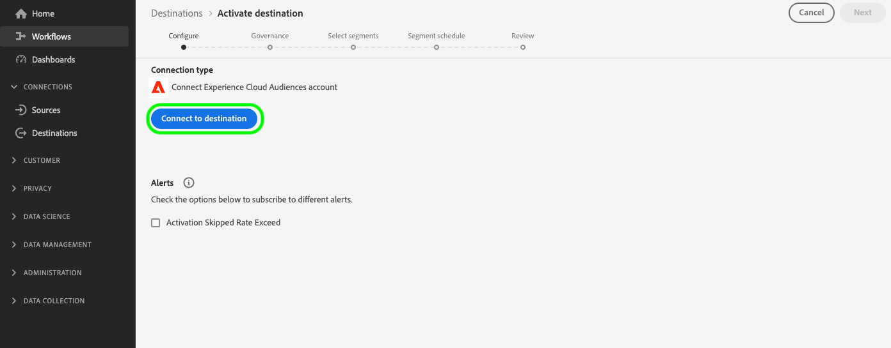
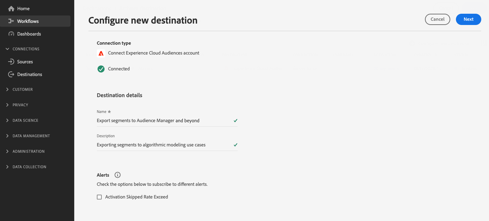

# [!UICONTROL Experience Cloud Audiences] 接続

>[!AVAILABILITY]
>
> この宛先は、[Adobe Real-Time Customer Data Platform PrimeおよびUltimate](https://helpx.adobe.com/jp/legal/product-descriptions/real-time-customer-data-platform.html)のお客様が利用できます。

この宛先を使用して、[!DNL Real-Time CDP]からAudience Managerおよび[!DNL Adobe Analytics]までオーディエンスをアクティブ化します。

オーディエンスを[!DNL Adobe Analytics]に送信するには、Audience Manager ライセンスが必要です。 詳しくは、[Audience Analyticsの概要](https://experienceleague.adobe.com/docs/analytics/integration/audience-analytics/mc-audiences-aam.html?lang=ja)を参照してください。

他のAdobe ソリューションにオーディエンスを送信するには、[!DNL Real-Time CDP]から[Adobe Target](../personalization/adobe-target-connection.md)、[Adobe Advertising](../advertising/adobe-advertising-dsp-connection.md)、[Adobe Campaign](../email-marketing/adobe-campaign.md)、[Marketo Engage](../adobe/marketo-engage.md)への直接接続を使用します。

>[!IMPORTANT]
>
>この宛先は、[から様々なExperience Cloud ソリューションへの](https://experienceleague.adobe.com/docs/audience-manager/user-guide/implementation-integration-guides/integration-experience-platform/aam-aep-audience-sharing.html?lang=ja#aep-segments-in-aam)従来のオーディエンス共有の統合[!DNL Real-Time Customer Data Platform]に代わるものです。
> 
>[!DNL Real-Time CDP]従来のaudience-sharing統合[を介して](https://experienceleague.adobe.com/docs/audience-manager/user-guide/implementation-integration-guides/integration-experience-platform/aam-aep-audience-sharing.html?lang=ja#aep-segments-in-aam)からAudience Managerやその他のExperience Cloud ソリューションにオーディエンスを既に共有している場合は、この宛先を使用する前に、カスタマーケアに連絡して従来の統合を無効にする必要があります。

## ユースケースと利点 {#use-cases}

[!UICONTROL Experience Cloud Audiences]宛先を使用する方法とタイミングをより理解しやすくするために、[!DNL Real-Time CDP]のお客様がこの宛先を使用して解決できるユースケースの例を次に示します。

### データ管理プラットフォームのユースケースを実現 {#dmp-use-cases}

Audience Managerでは、次のようなData Management Platform ユースケースに[!DNL Real-Time CDP] オーディエンスを使用できます。

* セグメントに[&#x200B; サードパーティデータ &#x200B;](https://experienceleague.adobe.com/docs/audience-manager/user-guide/overview/data-types-collected.html?lang=ja#third-party-data)を追加しています。
* [&#x200B; アルゴリズムモデリング &#x200B;](https://experienceleague.adobe.com/docs/audience-manager/user-guide/features/algorithmic-models/look-alike-modeling/understanding-models.html?lang=ja);
* [!DNL Real-Time CDP]宛先カタログでまだサポートされていないcookie ベースの宛先に対してオーディエンスをアクティブ化します。

### 書き出されたオーディエンスの詳細な制御 {#segments-control}

Audience Manager以降に書き出すオーディエンスを選択するには、Experience Cloud Audiencesの宛先を介した新しいセルフサービスのオーディエンス共有の統合を使用します。  これを使用して、他のExperience Cloud ソリューションと共有するオーディエンスと、[!DNL Real-Time CDP]内に保持するオーディエンスを決定します。

従来のオーディエンス共有の統合では、どのオーディエンスをAudience Manager以降に書き出すかを詳細に制御できませんでした。

### [!DNL Real-Time CDP]人のオーディエンスを[!DNL Adobe Analytics]さんと共有 {#share-audiences-with-analytics}

Experience Cloud Audiencesの宛先に送信したオーディエンスは、[!DNL Adobe Analytics]に自動的に表示されません。

オーディエンスを[!DNL Adobe Analytics]に送信する前に、[AnalyticsおよびAudience Manager用のExperience Cloud Identity Serviceを実装する必要があります](https://experienceleague.adobe.com/docs/id-service/using/implementation/setup-aam-analytics.html?lang=ja)。

>[!IMPORTANT]
>
>Experience Cloud Audiencesの宛先を通じて[!DNL Real-Time CDP]から[!DNL Adobe Analytics]までオーディエンスを送信するには、Audience Manager ライセンスが必要です。

### [!DNL Real-Time CDP]人のオーディエンスを他のExperience Cloud ソリューションと共有する {#share-segments-with-other-solutions}

[!DNL Real-Time CDP] Audiencesの宛先カードを使用して、他のExperience Cloud ソリューションとオーディエンスを共有できます。

ただし、これらのソリューションとオーディエンスを共有する場合は、次の専用の宛先カードを使用することを強くお勧めします。

* [Adobe Campaign](../email-marketing/adobe-campaign.md)
* [Adobe Target](../personalization/adobe-target-connection.md)
* [Adobe Advertising DSP](../advertising/adobe-advertising-dsp-connection.md)
* [Marketo](../adobe/marketo-engage.md)

## 前提条件 {#prerequisites}

>[!IMPORTANT]
>
> * 前述の[Data Management Platform ユースケース &#x200B;](#dmp-use-cases)を有効にするには、Audience Manager ライセンスが必要です。
> * *do*&#x200B;様は、[!DNL Real-Time CDP]件のオーディエンスを[!DNL Adobe Analytics]様と共有するためにAudience Manager ライセンスが必要です。
> * *上の*&#x200B;節[!DNL Real-Time CDP]で言及した[!DNL Adobe Advertising]、[!DNL Adobe Target]、Marketo、その他のExperience Cloud ソリューションと[のオーディエンスを共有するために](#share-segments-with-other-solutions)のAudience Manager ライセンスは必要ありません。

### 従来のオーディエンス共有ソリューションを使用している {#legacy-audience-sharing}

[!DNL Real-Time CDP]従来のオーディエンス共有の統合[を介して、](https://experienceleague.adobe.com/docs/audience-manager/user-guide/implementation-integration-guides/integration-experience-platform/aam-aep-audience-sharing.html?lang=ja#aep-segments-in-aam)からAudience Managerやその他のExperience Cloud ソリューションにオーディエンスを既に共有している場合は、カスタマーケアに連絡して従来の統合を無効にする必要があります。

プロビジョニングチケットの解決までの納期は6営業日以内です。 既存のレガシー統合を無効にした後、セルフサービス宛先カードを使用して[接続を作成](#connect)に進むことができます。

>[!IMPORTANT]
>
>チケット解決から宛先カードを介して新しい接続が確立されるまでの間に、[!DNL Real-Time CDP]から他のソリューションへのオーディエンスの書き出しは停止されます。 このダウンタイムを最小限に抑えるには、チケットのクローズ後に宛先カードを介して接続を作成します。

## 既知の制限事項とコールアウト {#known-limitations}

Experience Cloud Audiences カードの使用中は、次の既知の制限と重要なコールアウトに注意してください。

* 現在、Experience Cloud Audiencesの宛先は、組織ごとに1つのサンドボックスで設定できます。 別のサンドボックスで2番目の宛先接続を設定しようとすると、エラーが発生します。
* 宛先に接続すると、[&#x200B; データフローアラートを有効にする](../../ui/alerts.md) オプションが表示されます。 UIには表示されますが、**アラートを有効にするオプションは現在サポートされていません**。
* **オーディエンスのバックフィルのサポート**: Audience Managerまたはその他のExperience Cloud ソリューションへの最初の書き出しには、オーディエンスの履歴母集団が含まれます。 この宛先を設定している[従来のオーディエンス共有統合](https://experienceleague.adobe.com/docs/audience-manager/user-guide/implementation-integration-guides/integration-experience-platform/aam-aep-audience-sharing.html?lang=ja#aep-segments-in-aam)のユーザーは、バックフィルの差が約6時間あることを期待する必要があります。
* [Audience Composition](../../../segmentation/ui/audience-composition.md)から送信されたオーディエンスは、直接サポートされていません。 この宛先に複合オーディエンスをアクティブ化するには、複合オーディエンスに基づいて[&#x200B; セグメントビルダー](../../../segmentation/ui/segment-builder.md)を介してオーディエンス定義を作成し、新しく作成したオーディエンスをアクティブ化する必要があります。

### オーディエンスをアクティブ化する際の遅延 {#audience-activation-latency}

オーディエンスが[!DNL Real-Time CDP]で最初にアクティブ化されてから、Audience Managerやその他のExperience Cloud ソリューションでオーディエンスを使用する準備が整うまでの間には、4時間の待ち時間があります。

Audience Managerですべてのユースケースを完全に利用できるようになるには、最大で24時間かかります。 Experience Cloud AudiencesのオーディエンスがAudience Manager レポートに表示されるには、最大で48時間かかる場合があります。

オーディエンス名などのメタデータは、Experience Cloud オーディエンスへの書き出しを設定してから数分でAudience Managerで利用できます。

## サポートされている ID {#supported-identities}

[!UICONTROL Experience Cloud Audiences]宛先に書き出されたプロファイルは、次の表に示すIDにマッピングされます。 [ID](/help/identity-service/features/namespaces.md) についての詳細情報。

| ターゲット ID | 説明 | 注意点 |
|---|---|---|
| ECID | Experience Cloud ID | ECIDを表す名前空間。 この名前空間は、「Adobe Marketing Cloud ID」、「[!DNL Adobe Experience Cloud] ID」、「[!DNL Adobe Experience Platform] ID」というエイリアスでも参照できます。 詳しくは、[ECID](/help/identity-service/features/ecid.md)の次のドキュメントを参照してください。 |
| GAID | GOOGLE ADVERTISING ID | Google Advertising ID （GAID）のプライマリ IDで[!DNL Real-Time CDP]に取り込まれたプロファイルは、この宛先に書き出すことができます。 |
| IDFA | Apple の広告主 ID | Apple ID for Advertisers （IDFA）のプライマリ IDを持つ[!DNL Real-Time CDP]に取り込まれたプロファイルは、この宛先に書き出すことができます。 |
| email_lc_sha256 | SHA256 アルゴリズムでハッシュ化されたメールアドレス | ハッシュ化された電子メールアドレスのプライマリ IDを使用して[!DNL Real-Time CDP]に取り込まれたプロファイルは、この宛先に書き出すことができます。 |

{style="table-layout:auto"}

## サポートされるオーディエンス {#supported-audiences}

この節では、この宛先に書き出すことができるオーディエンスのタイプについて説明します。

| オーディエンスの由来 | サポートあり | 説明 |
|---------|----------|----------|
| [!DNL Segmentation Service] | ○ | Experience Platform [&#x200B; セグメント化サービス &#x200B;](../../../segmentation/home.md)を通じて生成されたオーディエンス。 |
| その他すべてのオーディエンスの生成元 | × | このカテゴリには、[!DNL Segmentation Service]を通じて生成されたオーディエンス以外のすべてのオーディエンスのオリジンが含まれます。 [様々なオーディエンスの起源](/help/segmentation/ui/audience-portal.md#customize)について読みます。 次に例を示します。 <ul><li> カスタムアップロードオーディエンス [がCSV ファイルからExperience Platformに](../../../segmentation/ui/audience-portal.md#import-audience)をインポートしました。</li><li> 類似オーディエンス， </li><li> 連合オーディエンス， </li><li> [!DNL Adobe Journey Optimizer]などの他のExperience Platform アプリで生成されたオーディエンス </li><li> その他。 </li></ul> |

{style="table-layout:auto"}

オーディエンスのデータタイプ別にサポートされるオーディエンス：

| オーディエンスのデータタイプ | サポートあり | 説明 | ユースケース |
|--------------------|-----------|-------------|-----------|
| [人物オーディエンス &#x200B;](/help/segmentation/types/people-audiences.md) | ○ | 顧客プロファイルにもとづいて、マーケティング施策の特定のグループをターゲットにすることができます。 | 買い物客やカートの放棄が多い |
| [&#x200B; アカウントオーディエンス &#x200B;](/help/segmentation/types/account-audiences.md) | × | アカウントベースドマーケティング戦略のために、特定の組織内の個人をターゲットにします。 | B2B マーケティング |
| [見込みオーディエンス &#x200B;](/help/segmentation/types/prospect-audiences.md) | × | まだ顧客ではないが、ターゲットオーディエンスと特徴を共有する個人をターゲットにします。 | サードパーティデータによる見込み顧客の開拓 |
| [&#x200B; データセットの書き出し](/help/catalog/datasets/overview.md) | × | [!DNL Adobe Experience Platform] データ レイクに保存されている構造化データのコレクション。 | レポート，データサイエンスワークフロー |

{style="table-layout:auto"}

## 書き出しのタイプと頻度 {#export-type-frequency}

宛先の書き出しのタイプと頻度について詳しくは、以下の表を参照してください。

| 項目 | タイプ | メモ |
|---------|----------|---------|
| 書き出しタイプ | **[!UICONTROL Audience export]** | 上記のセクションに記載されているIDにキーを設定したオーディエンスのすべてのメンバーを書き出します。 |
| 書き出し頻度 | **[!UICONTROL Streaming]** | ストリーミングの宛先は常に、API ベースの接続です。オーディエンス評価に基づいて[!DNL Real-Time CDP]でプロファイルが更新されると、コネクタはダウンストリームの更新を宛先プラットフォームに送信します。 詳しくは、[ストリーミングの宛先](/help/destinations/destination-types.md#streaming-destinations)を参照してください。 |

{style="table-layout:auto"}

## 宛先への接続 {#connect}

>[!IMPORTANT]
>
>宛先に接続するには、**[!UICONTROL View Destinations]**&#x200B;および&#x200B;**[!UICONTROL Manage Destinations]** [&#x200B; アクセス制御権限](/help/access-control/home.md#permissions)が必要です。 詳しくは、[アクセス制御の概要](/help/access-control/ui/overview.md)または製品管理者に問い合わせて、必要な権限を取得してください。

この宛先に接続するには、[宛先設定のチュートリアル](../../ui/connect-destination.md)の手順に従ってください。宛先の設定ワークフローで、以下の 2 つのセクションにリストされているフィールドに入力します。

### 宛先に対する認証 {#authenticate}

宛先に対して認証を行うには、カタログの宛先カードビューで「**[!UICONTROL Set up]**」を選択し、「**[!UICONTROL Connect to destination]**」を選択します。

Experience Cloud Audiencesの宛先に対する宛先への接続オプションの

### 宛先の詳細を入力 {#destination-details}

宛先の詳細を設定するには、以下の必須フィールドとオプションフィールドに入力します。UI のフィールドの横のアスタリスクは、そのフィールドが必須であることを示します。

* **[!UICONTROL Name]**：今後この宛先を認識する際に使用する名前。
* **[!UICONTROL Description]**：今後この宛先を特定するのに役立つ説明です。

## この宛先に対してオーディエンスをアクティブ化 {#activate}

>[!IMPORTANT]
>
>データをアクティブ化するには、**[!UICONTROL View Destinations]**、**[!UICONTROL Activate Destinations]**、**[!UICONTROL View Profiles]**&#x200B;および&#x200B;**[!UICONTROL View Segments]** [&#x200B; アクセス制御権限](/help/access-control/home.md#permissions)が必要です。 [アクセス制御の概要](/help/access-control/ui/overview.md)を参照するか、製品管理者に問い合わせて必要な権限を取得してください。

この宛先に対するオーディエンスのアクティブ化に関する手順については、[&#x200B; ストリーミングオーディエンス書き出し宛先へのプロファイルとオーディエンスのアクティブ化](/help/destinations/ui/activate-segment-streaming-destinations.md)を参照してください。 この宛先に対して[&#x200B; マッピング手順](/help/destinations/ui/activate-segment-streaming-destinations.md#mapping)は必要なく、[&#x200B; スケジュール手順](/help/destinations/ui/activate-segment-streaming-destinations.md#scheduling)は使用できません。

## データの書き出しを検証する {#exported-data}

成功したデータ書き出しを検証するには、オーディエンスが目的のExperience Cloud ソリューションに正常に移行したことを確認します。

### Audience Managerでのデータの検証 {#validate-audience-manager}

お客様の[!DNL Real-Time CDP]件のオーディエンスは、[&#x200B; シグナル &#x200B;](https://experienceleague.adobe.com/docs/audience-manager/user-guide/implementation-integration-guides/integration-experience-platform/aam-aep-audience-sharing.html?lang=ja#aep-segments-as-aam-signals)、[特性](https://experienceleague.adobe.com/docs/audience-manager/user-guide/implementation-integration-guides/integration-experience-platform/aam-aep-audience-sharing.html?lang=ja#aep-segments-as-aam-traits)、[&#x200B; セグメント &#x200B;](https://experienceleague.adobe.com/docs/audience-manager/user-guide/implementation-integration-guides/integration-experience-platform/aam-aep-audience-sharing.html?lang=ja#aep-segments-as-aam-segments)としてAudience Managerに表示されます。 上記のドキュメントリンクに記載されているようにデータが表示されているかどうかを、Audience Managerで確認できます。

オーディエンスが[!DNL Real-Time CDP]から送信されてから15分後に、Audience Managerでセグメント名の入力が開始されます。

セグメント母集団は、[!DNL Real-Time CDP]から送信されてから6時間以内にAudience Managerに流れ込み始め、Audience Managerでは24時間ごとに更新されます。

完全な母集団は72時間後にAudience Managerで表示され、オーディエンスが[!DNL Real-Time CDP]の宛先から削除されない限り、母集団はAudience Managerに引き続き流れます。

## データの使用とガバナンス {#data-usage-governance}

[!DNL Real-Time CDP] のすべての宛先は、データを処理する際のデータ使用ポリシーに準拠しています。[!DNL Adobe Experience Platform] がどのように データガバナンスを実施するかについて詳しくは、[データガバナンスの概要](/help/data-governance/home.md)を参照してください。

[!DNL Real-Time CDP]のデータガバナンスは、[&#x200B; データ使用ラベル &#x200B;](/help/data-governance/labels/reference.md)とマーケティングアクションの両方によって適用されます。
データ使用ラベルはアプリケーションに転送されますが、マーケティングアクションは転送されません。 つまり、Audience Managerに到着すると、[!DNL Real-Time CDP]のオーディエンスを任意の利用可能な宛先に書き出すことができます。 Audience Managerでは、[&#x200B; データ書き出し制御](https://experienceleague.adobe.com/docs/audience-manager/user-guide/features/data-export-controls.html?lang=ja)を使用して、オーディエンスを特定の宛先に書き出さないようにすることができます。

[!DNL HIPAA] マーケティングアクションでマークされたオーディエンスは、[!DNL Real-Time CDP]からAudience Managerに送信されません。

### Audience Managerでの権限管理 {#audience-manager-permissions}

Audience Managerのオーディエンスと特性には、[&#x200B; ロールベースのアクセス制御](https://experienceleague.adobe.com/docs/audience-manager/user-guide/features/administration/administration-overview.html?lang=ja) （RBAC）が適用されます。

[!DNL Real-Time CDP]から書き出されたオーディエンスは、**[!UICONTROL Experience Platform Segments]**&#x200B;というAudience Managerの特定のデータソースに割り当てられます。

特定のユーザーのみにオーディエンスへのアクセスを許可するには、[役割ベースのアクセス制御](https://experienceleague.adobe.com/docs/audience-manager/user-guide/features/administration/administration-overview.html?lang=ja)を使用して、[!DNL Real-Time CDP]人のオーディエンスから作成されたオーディエンスと特性へのユーザーアクセスを設定します。
