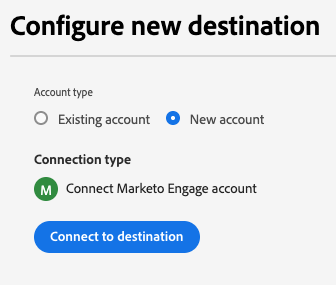
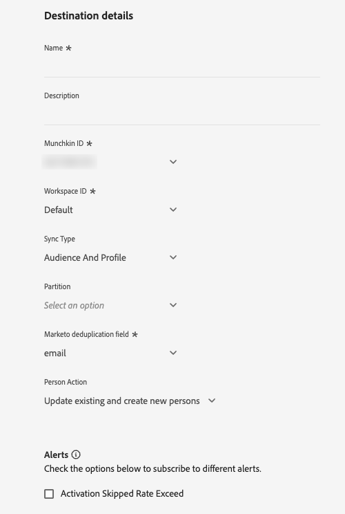
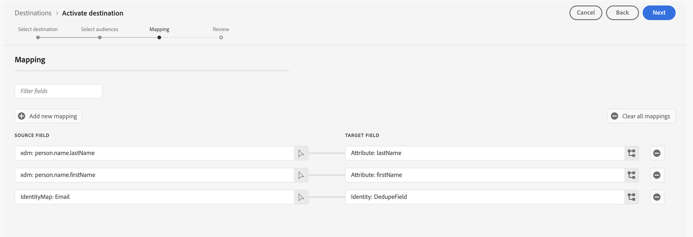
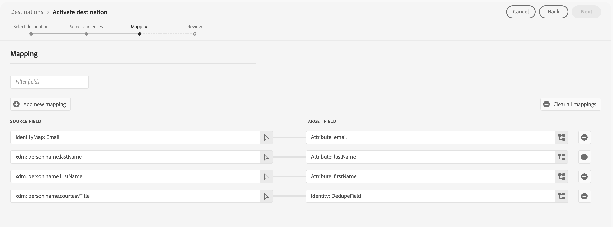

# Marketo Engage 接続

## 概要 {#overview}

[!DNL Marketo Engage]は、マーケティング、広告、分析、コマース向けのエンドツーエンドの顧客体験管理（CXM）ソリューションです。 このツールは、CRMのリード管理や顧客エンゲージメントから、ABM （アカウントベースドマーケティング）や売上への貢献度に至るまで、アクティビティを自動化および管理するために役立ちます。

この宛先を使用して、[!DNL Adobe Experience Platform]とMarketo Engageの間で、オーディエンスデータとプロファイル属性をリアルタイムで同期します。

## ユースケース {#use-cases}

[!DNL Marketo Engage]宛先を使用する方法とタイミングをより理解しやすくするために、[!DNL Adobe Experience Platform]のお客様がこの宛先を使用して解決できるユースケースの例を次に示します。

### オーディエンス同期のユースケース {#audience-sync-use-cases}

**既知のリードのみをリエンゲージメント**

マーケティング部門は、90日以上エンゲージメントしていないが、Adobe Marketoにすでに存在するリードをターゲットに、「ウィンバック」施策を実施したいと考えている。

Marketo Engageにオーディエンスをアクティブ化し、**[!UICONTROL Audience Only]**&#x200B;同期タイプを使用できます。

### オーディエンスとプロファイル同期のユースケース {#audience-profile-sync-use-cases}

**既知のリードとのリエンゲージメントとリードの更新**

マーケティング部門は、web サイトへの訪問にもとづいて興味を示した既存のMarketoコンタクトに対して、リエンゲージメントキャンペーンを立ち上げたいと考えています。 また、リードに関する情報（嗜好やデモグラフィック情報など）は更新しても、Marketoで新しいオーディエンスが作成されることはありません。

Marketo Engageに対してオーディエンスをアクティブ化し、**[!UICONTROL Audience and Profile]**&#x200B;同期タイプを&#x200B;**[!UICONTROL Update existing persons only]** アクションと組み合わせて使用して、Marketoに既に存在するオーディエンスのみをターゲットにすることができます。

**完全なプロファイル同期でリエンゲージしてリーチを拡大**

マーケティング部門は、新しいキャンペーンのために製品への関心を示すオーディエンスをアクティブ化したいと考えています。 多くのプロファイルは既にMarketoに存在していますが、一部は新しく、[!DNL Real-Time CDP]にのみ存在します。 既存顧客に対しては、Marketoで更新するだけでなく、新しいプロファイルを作成する必要があります。

Marketo Engageでオーディエンスをアクティブ化し、**[!UICONTROL Audience and Profile]**&#x200B;同期タイプを&#x200B;**[!UICONTROL Update existing and create new persons]** アクションと組み合わせて使用して、Marketoから既存のリードをターゲットにし、[!DNL Real-Time CDP]から書き出された新しいオーディエンスに対して新しいリードを作成します。

## 前提条件 {#prerequisites}

* 宛先を設定するユーザーは、Marketo インスタンスとパーティションで[&#x200B; ユーザーを編集](https://experienceleague.adobe.com/ja/docs/marketo/using/product-docs/administration/users-and-roles/descriptions-of-role-permissions#access-database)権限を持っている必要があります。
* 同じAdobe [!DNL Real-Time CDP]組織のMarketo Engage インスタンスのみが、この宛先を設定するときに使用できます。
* ユーザーをAdobe Admin Consoleで管理しているMarketo Engage インスタンスのみが、この宛先を使用できます。

## サポートされている ID {#supported-identities}

[!DNL Marketo Engage]は、次の表に示すIDのアクティブ化をサポートしています。 [ID](/help/identity-service/features/namespaces.md) についての詳細情報。

| ターゲット ID | 説明 | 注意点 |
|---|---|---|
| `DedupeField` | Marketoの既存のリードを識別して一致させるために使用されるフィールド。 | [&#x200B; マッピング &#x200B;](#mapping)手順で、重複排除フィールドとして使用するソースフィールド（`Email`またはその他のカスタム IDなど）をこのターゲット IDにマッピングします。 最適な結果を得るには、あらゆる顧客プロファイルで一貫して利用でき、独自のフィールドを選択します。 `ECID`は重複排除フィールドとしてサポートされていません。 |

{style="table-layout:auto"}

## サポートされるオーディエンス {#supported-audiences}

この節では、この宛先に書き出すことができるオーディエンスのタイプについて説明します。 以下の2つの表は、このコネクタがサポートするオーディエンスを示しています。オーディエンスの由来&#x200B;_と_ オーディエンスに含まれるプロファイルタイプ _:_

| オーディエンスの由来 | サポートあり | 説明 |
|---------|----------|----------|
| [!DNL Segmentation Service] | ○ | Experience Platform [&#x200B; セグメント化サービス &#x200B;](../../../segmentation/home.md)を通じて生成されたオーディエンス。 |
| その他すべてのオーディエンスの生成元 | ○ | このカテゴリには、[!DNL Segmentation Service]を通じて生成されたオーディエンス以外のすべてのオーディエンスのオリジンが含まれます。 [様々なオーディエンスの起源](/help/segmentation/ui/audience-portal.md#customize)について読みます。 次に例を示します。 <ul><li> カスタムアップロードオーディエンス [がCSV ファイルからExperience Platformに](../../../segmentation/ui/audience-portal.md#import-audience)をインポートしました。</li><li> 類似オーディエンス， </li><li> 連合オーディエンス， </li><li> [!DNL Adobe Journey Optimizer]などの他のExperience Platform アプリで生成されたオーディエンス </li><li> その他。 </li></ul>   |

{style="table-layout:auto"}

オーディエンスのデータタイプ別にサポートされるオーディエンス：

| オーディエンスのデータタイプ | サポートあり | 説明 | ユースケース |
|--------------------|-----------|-------------|-----------|
| [人物オーディエンス &#x200B;](/help/segmentation/types/people-audiences.md) | ○ | 顧客プロファイルにもとづいて、マーケティング施策の特定のグループをターゲットにすることができます。 | 買い物客やカートの放棄が多い |
| [&#x200B; アカウントオーディエンス &#x200B;](/help/segmentation/types/account-audiences.md) | × | アカウントベースドマーケティング戦略のために、特定の組織内の個人をターゲットにします。 | B2B マーケティング |
| [見込みオーディエンス &#x200B;](/help/segmentation/types/prospect-audiences.md) | × | まだ顧客ではないが、ターゲットオーディエンスと特徴を共有する個人をターゲットにします。 | サードパーティデータによる見込み顧客の開拓 |
| [&#x200B; データセットの書き出し](/help/catalog/datasets/overview.md) | × | [!DNL Adobe Experience Platform] データ レイクに保存されている構造化データのコレクション。 | レポート，データサイエンスワークフロー |

{style="table-layout:auto"}

## 書き出しのタイプと頻度 {#export-type-frequency}

宛先の書き出しのタイプと頻度について詳しくは、以下の表を参照してください。

| 項目 | タイプ | メモ |
|---------|----------|---------|
| 書き出しタイプ | **[!UICONTROL Audience export]** | [!DNL Marketo Engage]宛先で使用されている識別子（電子メール、ECID）を持つオーディエンスのすべてのメンバーを書き出しています。 |
| 書き出し頻度 | **[!UICONTROL Streaming]** | ストリーミングの宛先は常に、API ベースの接続です。オーディエンス評価に基づいて Experience Platform 内でプロファイルが更新されるとすぐに、コネクタは更新を宛先プラットフォームに送信します。[ストリーミングの宛先](/help/destinations/destination-types.md#streaming-destinations)の詳細についてはこちらを参照してください。 |

{style="table-layout:auto"}

## リードマッチング行動 {#lead-matching}

Marketoのリードマッチング機能を理解すれば、ユースケースに適した構成を選択できます。 一致する動作は、選択した&#x200B;**[!UICONTROL Sync Type]**&#x200B;および&#x200B;**[!UICONTROL Person Action]**&#x200B;設定によって異なります。

Marketoでは、選択した&#x200B;**[!UICONTROL Marketo deduplication field]**&#x200B;を使用して、Experience Platform プロファイルと既存のMarketo リードを照合します。 一致するプロセスでは、Marketo インスタンス内のすべてのパーティションを検索して、既存のリードを見つけます。 選択した設定に応じて、Marketo インスタンスでリードが作成および更新される方法については、次の表を参照してください。

| 同期タイプ | 顧客アクション | 一致する動作 |
|-----------|---------------|-------------------|
| **[!UICONTROL Profile only]** | **[!UICONTROL Update existing and create new persons]** | <ul><li>既存のリードを新しいプロファイルデータで更新</li><li>選択したパーティションに、一致しないプロファイルの新規リードを作成します</li></ul> |
| **[!UICONTROL Profile only]** | **[!UICONTROL Update existing persons only]** | <ul><li>既存のリードを新しいプロファイルデータで更新</li><li>一致しないプロファイルの新しいリードは作成されませんでした</li></ul> |
| **[!UICONTROL Audience only]** | なし | <ul><li>既存のリードをオーディエンスリストに追加</li><li>一致しないプロファイルの新しいリードは作成されませんでした</li></ul> |
| **[!UICONTROL Audience and profile]** | **[!UICONTROL Update existing and create new persons]** | <ul><li>既存のリードを新しいプロファイルデータで更新</li><li>既存のリードをオーディエンスリストに追加</li><li>選択したパーティションに、一致しないプロファイルの新規リードを作成します</li><li>オーディエンスリストに新しいリードを追加</li></ul> |
| **[!UICONTROL Audience and profile]** | **[!UICONTROL Update existing persons only]** | <ul><li>既存のリードを新しいプロファイルデータで更新</li><li>既存のリードをオーディエンスリストに追加</li><li>一致しないプロファイルの新しいリードは作成されませんでした</li></ul> |

{style="table-layout:auto"}

### 重要な検討事項 {#important-considerations}

* **重複排除フィールドの選択**：顧客プロファイル全体で一貫して使用可能で一意なフィールドを選択します（例：電子メールアドレス、顧客ID）
* **パーティション処理**：新しいリードを作成する際に、選択したパーティション（パーティションを選択しなかった場合は&#x200B;**[!UICONTROL Default]** パーティション）にリードが配置されます
* **重複した処理**：複数のMarketo リードが同じプロファイルに一致する場合、最新に更新されたリードのみが更新されます
* **クロスパーティションマッチング**：新しいリードに対して選択したパーティションに関係なく、システムはすべてのパーティションを検索して既存のリードを見つけます

## 宛先への接続 {#connect}

>[!IMPORTANT]
>
>* 宛先に接続するには、**[!UICONTROL View Destinations]**&#x200B;および&#x200B;**[!UICONTROL Manage Destinations]** [&#x200B; アクセス制御権限](/help/access-control/home.md#permissions)が必要です。
>
>* データをアクティブ化するには、**[!UICONTROL View Destinations]**、**[!UICONTROL Activate Destinations]**、**[!UICONTROL View Profiles]**&#x200B;および&#x200B;**[!UICONTROL View Segments]** [&#x200B; アクセス制御権限](/help/access-control/home.md#permissions)が必要です。 詳しくは、[アクセス制御の概要](/help/access-control/ui/overview.md)または製品管理者に問い合わせて、必要な権限を取得してください。

この宛先に接続するには、[宛先設定のチュートリアル](../../ui/connect-destination.md)の手順に従ってください。宛先の設定ワークフローで、以下の 2 つのセクションにリストされているフィールドに入力します。

### 宛先に対する認証 {#authenticate}

宛先に対する認証を行うには、**[!UICONTROL Connect to destination]**&#x200B;を選択します。

宛先への認証方法を示す

### 宛先の詳細を入力 {#destination-details}

宛先の詳細を設定するには、以下の必須フィールドとオプションフィールドに入力します。UI のフィールドの横のアスタリスクは、そのフィールドが必須であることを示します。

宛先の詳細を入力する方法を示す

* **[!UICONTROL Name]**：今後この宛先を認識する際に使用する名前。
* **[!UICONTROL Description]**：今後この宛先を特定するのに役立つ説明です。
* **[!UICONTROL Munchkin ID]**：この宛先に使用する[!DNL Marketo Munchkin ID]を選択します。
* **[!UICONTROL Workspace ID]**: Marketo Workspace IDを選択します。
* **[!UICONTROL Sync type]**：この宛先に使用する同期タイプを選択してください：
   * **[!UICONTROL Audience and profile]**: Marketo リストにオーディエンスメンバーを追加し、プロファイル情報を最新の状態に保つために、このオプションを選択します。
   * **[!UICONTROL Profile only]**: Experience Platformの最新の情報を使用してMarketoのリードプロファイルを最新の状態に保ちたい場合は、このオプションを選択します。
   * **[!UICONTROL Audience only]**: プロファイル情報を更新せずにMarketo リストにオーディエンスメンバーを追加する場合は、このオプションを選択します。
* **[!UICONTROL Partition]**: *パーティションの選択は、**[!UICONTROL Profile only]**&#x200B;または&#x200B;**[!UICONTROL Audience and profile]**&#x200B;同期タイプ*&#x200B;を選択した場合にのみ使用できます。 選択したワークスペースに関連付けられているMarketo パーティション IDを選択します。 これは、書き出されたデータを受け取るMarketoのリードパーティションを指定します。 特定のパーティションを選択しない場合、データはMarketoの&#x200B;**[!UICONTROL Default]** パーティションに送信されます。
* **[!UICONTROL Marketo deduplication field]**：既存のMarketo リードを更新する際に使用するMarketo重複排除フィールドを選択します。 このセレクターには、Marketoで重複排除フィールドとしてマークしたフィールドが表示されます。 Marketoの特定のフィールドを重複排除フィールドとして表示する場合は、そのフィールドをMarketoの[検索可能フィールド &#x200B;](https://experienceleague.adobe.com/ja/docs/marketo-developer/marketo/rest/lead-database/lead-database)としてマークする必要があります。

  >[!NOTE]
  >
  >Marketo `Lead ID`およびExperience Cloud ID （`ECID`）は、重複排除ではサポートされていません。

* **[!UICONTROL Person Action]**: データの書き出し時に実行するMarketo アクションを選択します。
   * **[!UICONTROL Update existing and create new persons]**：このオプションを選択すると、既存のMarketo リードを更新し、Marketoにまだ参加していないオーディエンスメンバーの新しいリードを作成します。 選択したパーティションに新しいリードが作成されます。 パーティションを選択しなかった場合は、新しいリードが&#x200B;**[!UICONTROL Default]** パーティションに作成されます。
   * **[!UICONTROL Update existing persons only]**：新しいリードを作成せずに既存のMarketo リードのみを更新する場合は、このオプションを選択します。 複数のリードが同じプロファイルに一致する場合、Experience Platform データで更新されるのは、最近更新されたMarketo リードのみです。

### アラートの有効化 {#enable-alerts}

アラートを有効にすると、宛先へのデータフローのステータスに関する通知を受け取ることができます。リストからアラートを選択して、データフローのステータスに関する通知を受け取るよう登録します。アラートについて詳しくは、[UI を使用した宛先アラートの購読](../../ui/alerts.md)に関するガイドを参照してください。

宛先接続の詳細の提供が完了したら、**[!UICONTROL Next]**&#x200B;を選択します。

## この宛先に対してオーディエンスをアクティブ化 {#activate}

>[!IMPORTANT]
>
>* データをアクティブ化するには、**[!UICONTROL View Destinations]**、**[!UICONTROL Activate Destinations]**、**[!UICONTROL View Profiles]**&#x200B;および&#x200B;**[!UICONTROL View Segments]** [&#x200B; アクセス制御権限](/help/access-control/home.md#permissions)が必要です。 [アクセス制御の概要](/help/access-control/ui/overview.md)を参照するか、製品管理者に問い合わせて必要な権限を取得してください。
>* *ID*&#x200B;をエクスポートするには、**[!UICONTROL View Identity Graph]** [&#x200B; アクセス制御権限](/help/access-control/home.md#permissions)が必要です。  {width="100" zoomable="yes"}

この宛先にオーディエンスをアクティベートする手順は、[ストリーミングオーディエンスの書き出し宛先へのプロファイルとオーディエンスのアクティベート](/help/destinations/ui/activate-segment-streaming-destinations.md)を参照してください。

### 必須のマッピング {#required-mappings}

マッピング手順で、重複排除フィールドとして使用するソースフィールド（`email`またはその他のカスタム IDなど）を`DedupeField` ターゲット IDにマッピングします。 最適な結果を得るには、あらゆる顧客プロファイルで一貫して利用でき、独自のフィールドを選択します。

Marketoでリードを正常に作成するには、次の必須ターゲット属性もマッピングする必要があります。

* `firstName`: リードの名
* `lastName`: リードの姓
* `email`: リードの電子メールアドレス

`email`を重複排除フィールドとして使用している場合は、次の画像に示すように、`firstName`属性と`lastName`属性もマッピングする必要があります。

重複排除フィールドとして電子メールを使用する場合に必要なマッピングを示す

別の重複排除フィールドを使用している場合は、次の画像に示すように、3つの必須属性（`firstName`、`lastName`、`email`）をすべて手動でマッピングする必要があります。

重複排除フィールドとして電子メールを使用しない場合に必要なマッピングを示す

## 書き出されたデータ／データ書き出しの検証 {#exported-data}

オーディエンスをMarketo Engageに書き出したら、Marketo アカウントにログインして、オーディエンスが期待どおりにアクティベートされていることを確認する必要があります。 Marketoの関連するリードパーティションとワークスペースを確認して、オーディエンスデータが正しく表示され、意図したアクション（人物の更新や作成など）が実行されたことを確認します。

予想されるデータが表示されない場合は、[!DNL Adobe Experience Platform]でマッピングと書き出しの設定を確認し、書き出しを再試行してください。

## データの使用とガバナンス {#data-usage-governance}

[!DNL Adobe Experience Platform] のすべての宛先は、データを処理する際のデータ使用ポリシーに準拠しています。[!DNL Adobe Experience Platform] がどのように データガバナンスを実施するかについて詳しくは、[データガバナンスの概要](/help/data-governance/home.md)を参照してください。
