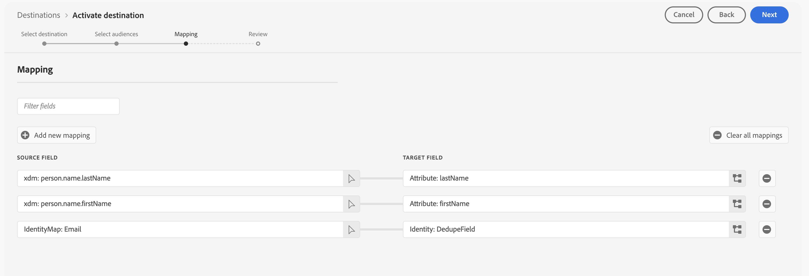

# Marketo Engage 接続

## 概要 {#overview}

[!DNL Marketo Engage] は、マーケティング、広告、分析およびコマース用の唯一のエンドツーエンドの顧客体験管理（CXM）ソリューションです。 CRM リード管理と顧客エンゲージメントから、アカウントベースのマーケティングと収益属性に至るまで、アクティビティを自動化および管理できます。

Adobe Experience PlatformとMarketo Engageの間でオーディエンスデータとプロファイル属性をリアルタイムに同期するには、この宛先を使用します。

## ユースケース {#use-cases}

[!DNL Marketo Engage] の宛先を使用する方法とタイミングをより深く理解するために、Adobe Experience Platformのお客様がこの宛先を使用して解決できるユースケースのサンプルを以下に示します。

### オーディエンス同期の使用例 {#audience-sync-use-cases}

**既知のリードのみを再エンゲージ**

マーケティングチームは、90 日以上エンゲージメントを行っていないがMarketoに既に存在するリードをターゲティングする勝者キャンペーンを実行したいと考えています。

Marketo Engageに対してオーディエンスをアクティブ化し、**[!UICONTROL オーディエンスのみ]** 同期タイプを使用できます。

### オーディエンスとプロファイルの同期の使用例 {#audience-profile-sync-use-cases}

**既知のリードの再エンゲージとリードの更新**

マーケティングチームは、web サイトの訪問に基づいて興味を示した既存のMarketo連絡先に対して再エンゲージメントキャンペーンを開始したいと考えています。 また、Marketo内に新しいユーザーを作成するのではなく、リード情報（環境設定や人口統計情報など）を更新したいと考えています。

Marketo Engageに対してオーディエンスをアクティブ化し、**[!UICONTROL オーディエンスとプロファイル]** 同期タイプと **[!UICONTROL 既存のユーザーのみを更新]** アクションを組み合わせて使用することで、Marketoに既に存在するオーディエンスのみをターゲットにすることができます。

**プロファイル全体を同期して再エンゲージメントとリーチの拡大を行う**

マーケティングチームは、新しいキャンペーンに対して製品の興味のあるオーディエンスをアクティブ化したいと考えています。 プロファイルの多くは既にMarketoに存在しますが、一部は新しく、Real-Time CDPにのみ存在します。 既存のユーザーは、Marketoで既存のユーザーを確実に更新するだけでなく、新しいプロファイルを作成したいと考えています。

Marketo Engageでオーディエンスをアクティブ化し、**[!UICONTROL オーディエンスとプロファイル]** 同期タイプと **[!UICONTROL 既存のリードの更新と新しいユーザーの作成]** アクションを組み合わせて使用することで、Real-Time CDPから書き出された既存のリードをターゲットにし、Marketoから書き出された新しいオーディエンス用に新しいリードを作成します。

## 前提条件 {#prerequisites}

* 宛先を設定するユーザーは、Marketo インスタンスおよびパーティションに [&#x200B; ユーザーを編集 &#x200B;](https://experienceleague.adobe.com/ja/docs/marketo/using/product-docs/administration/users-and-roles/descriptions-of-role-permissions#access-database) 権限が必要です。
* この出力先を設定する場合は、同じAdobe Real-Time CDP組織のMarketo Engage インスタンスのみを使用できます。
* この宛先を利用できるのは、Adobe Admin Consoleでユーザーが管理されているMarketo Engage インスタンスのみです。

## サポートされている ID {#supported-identities}

[!DNL Marketo Engage] では、以下の表で説明する ID のアクティブ化をサポートしています。 [ID](/help/identity-service/features/namespaces.md) についての詳細情報。

| ターゲット ID | 説明 | 注意点 |
|---|---|---|
| `DedupeField` | Marketoで既存のリードを識別して照合するために使用されるフィールド。 | [&#x200B; マッピング &#x200B;](#mapping) 手順で、重複排除フィールドとして使用する任意のソースフィールド（`Email` やその他のカスタム識別子など）をこのターゲット ID にマッピングします。 最良の結果を得るには、常に利用可能で、すべての顧客プロファイルで一意のフィールドを選択します。 `ECID` は重複排除フィールドとしてサポートされていません。 |

{style="table-layout:auto"}

## サポートされるオーディエンス {#supported-audiences}

この節では、この宛先に書き出すことができるオーディエンスのタイプについて説明します。 以下の 2 つの表は、このコネクタがサポートするオーディエンスを、_オーディエンスオリジン_ および _オーディエンスに含まれるプロファイルタイプ_ 別に示しています。

| オーディエンスオリジン | サポートあり | 説明 |
|---------|----------|----------|
| [!DNL Segmentation Service] | ✓ | Experience Platform [&#x200B; セグメント化サービス &#x200B;](../../../segmentation/home.md) を通じて生成されたオーディエンス。 |
| その他すべてのオーディエンスの接触チャネル | ✓ | このカテゴリには、[!DNL Segmentation Service] を通じて生成されたオーディエンス以外のすべてのオーディエンスの接触チャネルが含まれます。 [&#x200B; 様々なオーディエンスのオリジン &#x200B;](/help/segmentation/ui/audience-portal.md#customize) について確認する。 次に例を示します。 <ul><li> csv ファイルからExperience Platformへのカスタムアップロードオーディエンス [&#x200B; 読み込み &#x200B;](../../../segmentation/ui/audience-portal.md#import-audience)</li><li> 類似オーディエンス、 </li><li> 連合オーディエンス、 </li><li> Adobe Journey Optimizerなど、他のExperience Platform アプリで生成されたオーディエンス。 </li><li> その他。 </li></ul>   |

{style="table-layout:auto"}

オーディエンスデータタイプでサポートされるオーディエンス：

| オーディエンスデータタイプ | サポートあり | 説明 | ユースケース |
|--------------------|-----------|-------------|-----------|
| [&#x200B; 人物オーディエンス &#x200B;](/help/segmentation/types/people-audiences.md) | ○ | 顧客プロファイルに基づき、マーケティングキャンペーンの対象となる人物のグループを指定できます。 | 頻繁な購入、買い物かごの放棄 |
| [&#x200B; アカウントオーディエンス &#x200B;](/help/segmentation/types/account-audiences.md) | × | アカウントベースのマーケティング戦略では、特定の組織内の個人をターゲットに設定します。 | B2B マーケティング |
| [&#x200B; 見込み客オーディエンス &#x200B;](/help/segmentation/types/prospect-audiences.md) | × | まだ顧客ではないものの、ターゲットオーディエンスと特性を共有する個人をターゲットに設定します。 | サードパーティデータを使用した予測 |
| [&#x200B; データセットの書き出し &#x200B;](/help/catalog/datasets/overview.md) | × | Adobe Experience Platform Data Lake に保存された構造化データのコレクション。 | レポート、データサイエンスワークフロー |

{style="table-layout:auto"}

## 書き出しのタイプと頻度 {#export-type-frequency}

宛先の書き出しのタイプと頻度について詳しくは、以下の表を参照してください。

| 項目 | タイプ | メモ |
---------|----------|---------|
| 書き出しタイプ | **[!UICONTROL オーディエンスの書き出し]** | オーディ [!DNL Marketo Engage] ンスの宛先で使用される識別子（メール、ECID）を使用して、オーディエンスのすべてのメンバーを書き出します。 |
| 書き出し頻度 | **[!UICONTROL ストリーミング]** | ストリーミングの宛先は常に、API ベースの接続です。オーディエンス評価に基づいて Experience Platform 内でプロファイルが更新されるとすぐに、コネクタは更新を宛先プラットフォームに送信します。[ストリーミングの宛先](/help/destinations/destination-types.md#streaming-destinations)の詳細についてはこちらを参照してください。 |

{style="table-layout:auto"}

## リードのマッチング動作 {#lead-matching}

Marketoのリードマッチングの仕組みを理解すると、ユースケースに適した設定を選択するのに役立ちます。 一致する動作は、選択した **[!UICONTROL 同期タイプ]** と **[!UICONTROL 人物アクション]** の設定によって異なります。

Marketoでは、**[!UICONTROL Marketo重複排除フィールドを使用し]** す。Experience Platform プロファイルを既存のMarketo リードと照合するために選択します。 一致するプロセスは、Marketo インスタンス内のすべてのパーティションを検索し、既存のリードを見つけます。 選択した設定に応じてMarketo インスタンスでリードがどのように作成および更新されるかを理解するには、以下の表を参照してください。

| 同期タイプ | 人物アクション | マッチング動作 |
|-----------|---------------|-------------------|
| **[!UICONTROL プロファイルのみ]** | **[!UICONTROL 既存のユーザーの更新と新しいユーザーの作成]** | <ul><li>既存のリードを新しいプロファイルデータで更新する</li><li>一致しないプロファイルの選択したパーティションに新しいリードを作成します</li></ul> |
| **[!UICONTROL プロファイルのみ]** | **[!UICONTROL 既存のユーザーのみを更新]** | <ul><li>既存のリードを新しいプロファイルデータで更新する</li><li>一致しないプロファイルの新しいリードは作成されませんでした</li></ul> |
| **[!UICONTROL オーディエンスのみ]** | なし | <ul><li>既存のリードをオーディエンスリストに追加します</li><li>一致しないプロファイルの新しいリードは作成されませんでした</li></ul> |
| **[!UICONTROL オーディエンスとプロファイル]** | **[!UICONTROL 既存のユーザーの更新と新しいユーザーの作成]** | <ul><li>既存のリードを新しいプロファイルデータで更新する</li><li>既存のリードをオーディエンスリストに追加します</li><li>一致しないプロファイルの選択したパーティションに新しいリードを作成します</li><li>オーディエンスリストに新しいリードを追加します</li></ul> |
| **[!UICONTROL オーディエンスとプロファイル]** | **[!UICONTROL 既存のユーザーのみを更新]** | <ul><li>既存のリードを新しいプロファイルデータで更新する</li><li>既存のリードをオーディエンスリストに追加します</li><li>一致しないプロファイルの新しいリードは作成されませんでした</li></ul> |

{style="table-layout:auto"}

### 重要な考慮事項

* **重複排除フィールドの選択**：顧客プロファイル全体で一貫して使用可能で一意のフィールドを選択します（例：メールアドレス、顧客 ID）
* **パーティションの処理**：新しいリードを作成すると、選択したパーティション（パーティションを選択していない場合は **[!UICONTROL デフォルト]** パーティション）に配置されます
* **重複処理**：複数のMarketo リードが同じプロファイルに一致する場合、最近更新されたリードのみが更新されます
* **パーティション間のマッチング**：新しいリードに対して選択したパーティションに関係なく、システムはすべてのパーティションを検索して既存のリードを見つけます

## 宛先への接続 {#connect}

>[!IMPORTANT]
> 
>* 宛先に接続するには、**[!UICONTROL 宛先の表示]** および **[!UICONTROL 宛先の管理]**&#x200B;[&#x200B; アクセス制御権限 &#x200B;](/help/access-control/home.md#permissions) が必要です。
>
>* データをアクティブ化するには、**[!UICONTROL 宛先の表示]**、**[!UICONTROL 宛先のアクティブ化]**、**[!UICONTROL プロファイルの表示]** および **[!UICONTROL セグメントの表示]**&#x200B;[&#x200B; アクセス制御権限 &#x200B;](/help/access-control/home.md#permissions) が必要です。 詳しくは、[アクセス制御の概要](/help/access-control/ui/overview.md)または製品管理者に問い合わせて、必要な権限を取得してください。

この宛先に接続するには、[宛先設定のチュートリアル](../../ui/connect-destination.md)の手順に従ってください。宛先の設定ワークフローで、以下の 2 つのセクションにリストされているフィールドに入力します。

### 宛先に対する認証 {#authenticate}

宛先を認証するには、「**[!UICONTROL 宛先に接続]**」を選択します。

### 宛先の詳細を入力 {#destination-details}

宛先の詳細を設定するには、以下の必須フィールドとオプションフィールドに入力します。UI のフィールドの横のアスタリスクは、そのフィールドが必須であることを示します。

* **[!UICONTROL 名前]**：今後この宛先を認識するための名前。
* **[!UICONTROL 説明]**：今後この宛先を識別するのに役立つ説明。
* **[!UICONTROL Munchkin ID]**：この宛先に使用する [!DNL Marketo Munchkin ID] を選択します。
* **[!UICONTROL Workspace ID]**: Marketo Workspace ID を選択します。
* **[!UICONTROL 同期タイプ]**：この宛先に使用する同期タイプを選択します。
   * **[!UICONTROL オーディエンスとプロファイル]**:Marketo リストにオーディエンスメンバーを追加し、そのプロファイル情報を最新の状態に保つ場合は、このオプションを選択します。
   * **[!UICONTROL プロファイルのみ]**:Marketoのリードプロファイルを最新かつExperience Platformの最新情報で維持する場合、このオプションを選択します。
   * **[!UICONTROL オーディエンスのみ]**：プロファイル情報を更新せずにオーディエンスメンバーをMarketo リストに追加する場合は、このオプションを選択します。
* **[!UICONTROL パーティション]**: *パーティションの選択は、**[!UICONTROL プロファイルのみ]**&#x200B;または&#x200B;**[!UICONTROL オーディエンスとプロファイル]**&#x200B;同期タイプ* を選択している場合にのみ使用できます。 選択したワークスペースに関連付けられているMarketo パーティション ID を選択します。 これにより、書き出されたデータを受け取るMarketoのリードパーティションを指定できます。 特定のパーティションを選択しない場合、データはMarketoの **[!UICONTROL デフォルト]** パーティションに送信されます。
* **[!UICONTROL Marketoの重複排除フィールド]**：既存のMarketo リードを更新する際に使用するMarketoの重複排除フィールドを選択します。 このセレクターには、Marketoで重複排除フィールドとしてマークしたフィールドが表示されます。 Marketoの特定のフィールドを重複排除フィールドとして表示する場合は、Marketoでそのフィールドを [&#x200B; 検索可能なフィールド &#x200B;](https://experienceleague.adobe.com/ja/docs/marketo-developer/marketo/rest/lead-database/lead-database) としてマークする必要があります。

  >[!NOTE]
  >
  >Marketo `Lead ID` とExperience Cloud ID （`ECID`）は、重複排除ではサポートされていません。

* **[!UICONTROL 人物アクション]**：データの書き出し時に実行するMarketo アクションを選択します。
   * **[!UICONTROL 既存のリードを更新および新しいユーザーを作成]**:Marketoにまだないオーディエンスメンバーの既存のMarketo リードを更新し、新しいリードを作成する場合は、このオプションを選択します。 選択したパーティションに新しいリードが作成されます。 パーティションを選択しなかった場合、新しいリードが **[!UICONTROL デフォルト]** パーティションに作成されます。
   * **[!UICONTROL 既存のユーザーのみを更新]**：新しいユーザーを作成せずに既存のMarketo リードのみを更新する場合は、このオプションを選択します。 複数のリードが同じプロファイルに一致する場合、最近更新されたMarketo リードのみがExperience Platform データで更新されます。

### アラートの有効化 {#enable-alerts}

アラートを有効にすると、宛先へのデータフローのステータスに関する通知を受け取ることができます。リストからアラートを選択して、データフローのステータスに関する通知を受け取るよう登録します。アラートについて詳しくは、[UI を使用した宛先アラートの購読](../../ui/alerts.md)に関するガイドを参照してください。

宛先接続の詳細の入力を終えたら「**[!UICONTROL 次へ]**」を選択します。

## この宛先に対してオーディエンスをアクティブ化 {#activate}

>[!IMPORTANT]
> 
>* データをアクティブ化するには、**[!UICONTROL 宛先の表示]**、**[!UICONTROL 宛先のアクティブ化]**、**[!UICONTROL プロファイルの表示]** および **[!UICONTROL セグメントの表示]**&#x200B;[&#x200B; アクセス制御権限 &#x200B;](/help/access-control/home.md#permissions) が必要です。 [アクセス制御の概要](/help/access-control/ui/overview.md)を参照するか、製品管理者に問い合わせて必要な権限を取得してください。
>* *ID* を書き出すには、**[!UICONTROL ID グラフの表示]**&#x200B;[&#x200B; アクセス制御権限 &#x200B;](/help/access-control/home.md#permissions) が必要です。  {width="100" zoomable="yes"}

この宛先にオーディエンスをアクティベートする手順は、[ストリーミングオーディエンスの書き出し宛先へのプロファイルとオーディエンスのアクティベート](/help/destinations/ui/activate-segment-streaming-destinations.md)を参照してください。

### 必須のマッピング {#required-mappings}

マッピング手順で、重複排除フィールドとして使用する任意のソースフィールド（`email` やその他のカスタム識別子など）を、`DedupeField` のターゲット ID にマッピングします。 最良の結果を得るには、常に利用可能で、すべての顧客プロファイルで一意のフィールドを選択します。

Marketoでリードを正常に作成するには、次の必須ターゲット属性もマッピングする必要があります。

* `firstName`：リードの名
* `lastName`：リードの姓
* `email`: リードのメールアドレス

`email` を重複排除フィールドとして使用している場合は、以下の画像に示すように、`firstName` 属性と `lastName` 属性もマッピングする必要があります。

別の重複排除フィールドを使用している場合は、次の画像に示すように、3 つの必須属性（`firstName`、`lastName`、`email`）すべてを手動でマッピングする必要があります。

## 書き出されたデータ／データ書き出しの検証 {#exported-data}

オーディエンスをMarketo Engageに書き出した後、Marketo アカウントにログインして、オーディエンスが期待どおりにアクティブ化されていることを確認する必要があります。 Marketoで関連するリードパーティションおよびワークスペースを調べて、オーディエンスデータが正しく表示され、意図したアクション（人物の更新や作成など）が実行されたことを確認します。

期待されたデータが表示されない場合は、Adobe Experience Platformでマッピングと書き出しの設定を確認し、書き出しを再試行してください。

## データの使用とガバナンス {#data-usage-governance}

[!DNL Adobe Experience Platform] のすべての宛先は、データを処理する際のデータ使用ポリシーに準拠しています。[!DNL Adobe Experience Platform] がどのように データガバナンスを実施するかについて詳しくは、[データガバナンスの概要](/help/data-governance/home.md)を参照してください。
