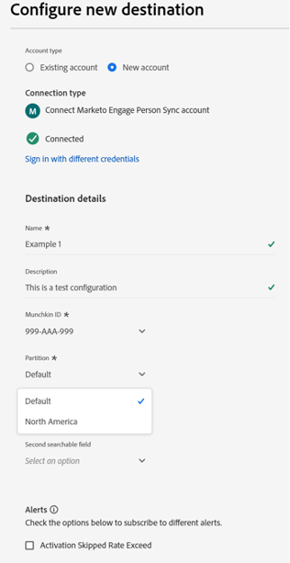
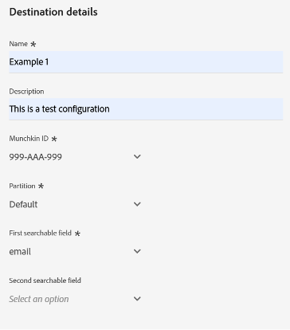
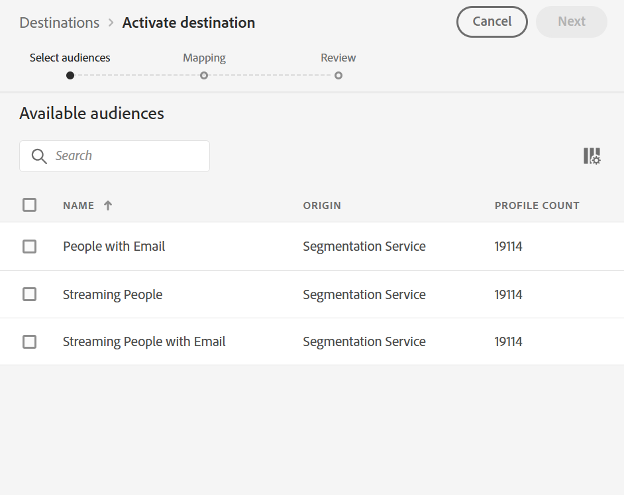
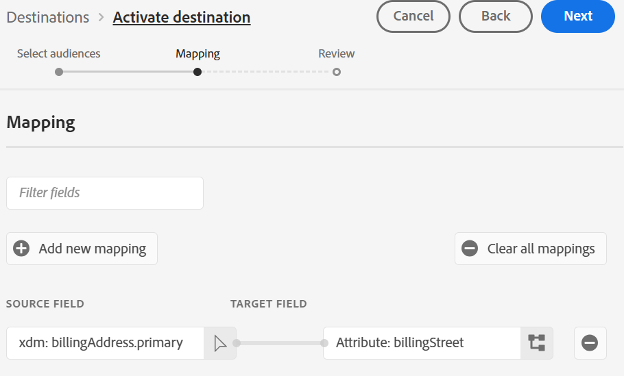
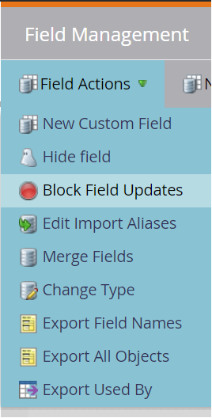
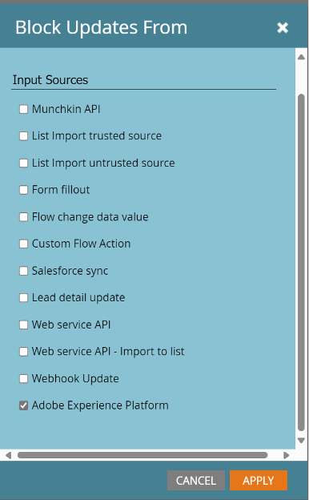

# Marketo Engage Person Syncとの連携 {#marketo-engage-person-sync}

>[!IMPORTANT]
>
>この宛先コネクタはベータ版で、一部のお客様のみが利用できます。 アクセスをリクエストするには、Adobe担当者にお問い合わせください。

>[!IMPORTANT]
>
>**[!UICONTROL Marketo Engage Person Sync]**&#x200B;宛先カードは、**2025年10月**&#x200B;に非推奨（廃止予定）になります。
>
>新しい&#x200B;**[[!UICONTROL Marketo Engage]](marketo-engage-connection.md)**&#x200B;宛先へのスムーズな移行を確実に行うには、次の重要なポイントと必要なアクションを確認してください。
>
>* すべてのユーザーは、2025年10月までに&#x200B;**Marketo Engage Person Syncの宛先**&#x200B;の使用を停止し、新しい&#x200B;**[[!UICONTROL Marketo Engage]](marketo-engage-connection.md)**&#x200B;の宛先に移行する必要があります。
>* **既存のデータフローは自動的に移行されません。**&#x200B;新しい[宛先への新しい接続](marketo-engage-connection.md#connect-to-the-destination)を&#x200B;**[!UICONTROL Marketo Engage]**&#x200B;設定し、そこにオーディエンスをアクティブ化する必要があります。

## 概要 {#overview}

Marketo Engage Person Sync コネクタを使用して、個人オーディエンスからMarketo Engage インスタンス内の対応するレコードに更新をストリーミングします。

>[!IMPORTANT]
>
>[Marketo V2 Audience Sync Connector](/help/destinations/catalog/adobe/marketo-engage.md)は、Profile Update Sync Connectorと組み合わせて作成モードで使用しないでください

## サポートされるIDと属性 {#support-identities-and-attributes}

### サポートされる ID {#supported-identities}

| ターゲット ID | 説明 |
| --------------- | ---------------------------------------------------------------------------------------------------------------------------------------------------------------------------------------- |
| メール | メールアドレスを表す名前空間。 このタイプの名前空間は、多くの場合、単一の人物に関連付けられているため、様々なチャネルをまたいでその人物を識別します。 |

{style="table-layout:auto"}

### サポートされる属性 {#supported-attributes}

Experience Platformの属性を、Marketoで組織がアクセスできる任意の属性にマッピングできます。 Marketoでは、[Describe API](https://developer.adobe.com/marketo-apis/api/mapi/#tag/Leads/operation/describeUsingGET_6) リクエストを使用して、組織がアクセスできる属性フィールドを取得できます。

## サポート対象オーディエンス {#supported-audiences}

この節では、この宛先に書き出すことができるオーディエンスのタイプについて説明します。

| オーディエンスの由来 | サポートあり | 説明 |
| -------------------- | :-------: | ------------------------------------------------------------------------------------------------------------------------------------------------------------- |
| セグメント化サービス | ○ | Experience Platform [&#x200B; セグメント化サービス &#x200B;](https://experienceleague.adobe.com/ja/docs/experience-platform/segmentation/home)を通じて生成されたオーディエンス。 |
| その他すべてのオーディエンスの生成元 | ○ | このカテゴリには、[!DNL Segmentation Service]を通じて生成されたオーディエンス以外のすべてのオーディエンスのオリジンが含まれます。 [様々なオーディエンスの起源](/help/segmentation/ui/audience-portal.md#customize)について読みます。 次に例を示します。 <ul><li> カスタムアップロードオーディエンス [がCSV ファイルからExperience Platformに](../../../segmentation/ui/audience-portal.md#import-audience)をインポートしました。</li><li> 類似オーディエンス， </li><li> 連合オーディエンス， </li><li> [!DNL Adobe Journey Optimizer]などの他のExperience Platform アプリで生成されたオーディエンス </li><li> その他。 </li></ul> |

{style="table-layout:auto"}

オーディエンスのデータタイプ別にサポートされるオーディエンス：

| オーディエンスのデータタイプ | サポートあり | 説明 | ユースケース |
|--------------------|-----------|-------------|-----------|
| [人物オーディエンス &#x200B;](/help/segmentation/types/people-audiences.md) | ○ | 顧客プロファイルにもとづいて、マーケティング施策の特定のグループをターゲットにすることができます。 | 買い物客やカートの放棄が多い |
| [&#x200B; アカウントオーディエンス &#x200B;](/help/segmentation/types/account-audiences.md) | × | アカウントベースドマーケティング戦略のために、特定の組織内の個人をターゲットにします。 | B2B マーケティング |
| [見込みオーディエンス &#x200B;](/help/segmentation/types/prospect-audiences.md) | × | まだ顧客ではないが、ターゲットオーディエンスと特徴を共有する個人をターゲットにします。 | サードパーティデータによる見込み顧客の開拓 |
| [&#x200B; データセットの書き出し](/help/catalog/datasets/overview.md) | × | [!DNL Adobe Experience Platform] データ レイクに保存されている構造化データのコレクション。 | レポート，データサイエンスワークフロー |

{style="table-layout:auto"}

## 書き出しのタイプと頻度 {#export-type-and-frequency}

宛先の書き出しのタイプと頻度について詳しくは、以下の表を参照してください。

| 項目 | タイプ | メモ |
| ---------------- | --------- | ----------------------------------------------------------------------------------------------------------------------------------------------------------------------------------------------------------------------------------------------------------------------------------------------------------------------------------------------------------------------------------------- |
| 書き出し頻度 | ストリーミング | ストリーミングの宛先は常に、API ベースの接続です。オーディエンス評価に基づいて Experience Platform 内でプロファイルが更新されるとすぐに、コネクタは更新を宛先プラットフォームに送信します。[ストリーミングの宛先](/help/destinations/destination-types.md#streaming-destinations)の詳細についてはこちらを参照してください。 |

{style="table-layout:auto"}

## 宛先の設定 {#set-up-destination}

>[!IMPORTANT]
>
>* 宛先に接続するには、**[!UICONTROL View Destinations]**&#x200B;および&#x200B;**[!UICONTROL Manage Destinations]** [&#x200B; アクセス制御権限](/help/access-control/home.md#permissions)が必要です。

会社が複数の組織にアクセスできる場合は、Marketoへの宛先コネクタを設定するMarketo Engageと[!DNL Real-Time CDP]の両方で同じ組織を使用してください。  宛先を既に設定している場合は、新しい設定で使用する既存のMarketo アカウントを選択できます。  そうでない場合は、「宛先へのコネクタ」プロンプトをクリックして、目的の宛先の名前、説明、およびMarketo Munchkin IDを設定します。  Marketo インスタンスのMunchkin IDは、管理者/Munchkin メニューにあります。

>[!IMPORTANT]
>
>宛先を設定するユーザーは、Marketo インスタンスおよびパーティションで[&#x200B; ユーザーを編集](https://experienceleague.adobe.com/en/docs/marketo/using/product-docs/administration/users-and-roles/descriptions-of-role-permissions#access-database)権限を持っている必要があります。

* **[!UICONTROL Name]**：今後この宛先を認識する際に使用する名前。
* **[!UICONTROL Description]**：今後この宛先を特定するのに役立つ説明です。
* **[!UICONTROL Munchkin ID]**: Munchkin IDは、特定のMarketo インスタンスの一意のIDです。
* **[!UICONTROL Partition]**: ビジネス上の懸念事項によってリード レコードを分離するために使用されるMarketo Engageの概念
* **[!UICONTROL First searchable field]**：重複排除するフィールド。 フィールドは、入力の各リードレコードに存在する必要があります。 デフォルトは電子メール
* **[!UICONTROL First searchable field]**：重複排除するセカンダリフィールド。 フィールドは、入力の各リードレコードに存在する必要があります。 オプション

インスタンスを選択したら、設定を統合するリードパーティションも選択する必要があります。 [&#x200B; リードパーティション &#x200B;](https://experienceleague.adobe.com/en/docs/marketo/using/product-docs/administration/workspaces-and-person-partitions/understanding-workspaces-and-person-partitions)は、Marketo Engageの概念で、企業や営業地域などのビジネス上の懸念事項によってリードレコードを分離するために使用されます。 Marketo サブスクリプションにワークスペースとパーティション機能がない場合、またはサブスクリプションに追加のパーティションが作成されていない場合は、デフォルトパーティションのみが使用できます。 単一の設定では、設定されたパーティションに存在するリードレコードのみを更新できます。

>[!IMPORTANT]
>
>オーディエンスが初めてMarketo宛先にアクティベートされた後、Marketo宛先アクティベーションの前に既にオーディエンスに存在していたプロファイルをバックフィルするには、*最大24時間*&#x200B;かかります。 今後、オーディエンスにプロファイルが追加されると、すぐにMarketoに追加されます。

### 重複の除外フィールド {#deduplication-fields}

Marketo engageに更新を送信する場合、選択したパーティションと1つまたは2つのユーザー選択フィールドに基づいてレコードが選択されます。 宛先が北米パーティションで設定され、重複排除フィールドとして電子メールアドレスと会社名が設定されている場合、既存のレコードに変更を適用するには、3つのフィールドがすべて一致する必要があります。 例：

* 宛先は北米パーティションで設定されます
* 電子メール <test@example.com>を持つ人物と、Experience Platformの会社名サンプル Inc.が宛先オーディエンスと一致する
* これらの値を持つレコードがMarketoの北米パーティションにすでに存在しない限り、新しいリードレコードが作成されます

一致するリードレコードが見つからない場合は、新しいレコードが作成されます。

## オーディエンスを活用 {#activate-audiences}

>[!IMPORTANT]
>
>* データをアクティブ化するには、**[!UICONTROL View Destinations]**、**[!UICONTROL Activate Destinations]**、**[!UICONTROL View Profiles]**&#x200B;および&#x200B;**[!UICONTROL View Segments]** [&#x200B; アクセス制御権限](/help/access-control/home.md#permissions)が必要です。 [アクセス制御の概要](/help/access-control/ui/overview.md)を参照するか、製品管理者に問い合わせて必要な権限を取得してください。

この宛先に対してオーディエンスをアクティブ化する手順については、[&#x200B; ストリーミング宛先に対するオーディエンスのアクティブ化](/help/destinations/ui/activate-segment-streaming-destinations.md)を参照してください。

オーディエンスをアクティブ化ステップでは、自分に表示されている任意の人物オーディエンスから選択できます。

## フィールドマッピング {#field-mapping}

特定のユーザー属性への変更をMarketo Engageに送信するには、フィールドを[!DNL Real-Time CDP] フィールドからMarketo フィールドにマッピングする必要があります。

Experience Platform データタイプとMarketo データタイプは、次の方法でマッピングできます。

| Experience Platform データタイプ | Marketo データタイプ |
| ----------------------------- | ------------------------------------ |
| 文字列 | 文字列、テキストエリア、Url、電話、メール |
| 列挙 | 文字列 |
| 日付 | 日付 |
| Date-time | 日時 |
| 整数 | 整数 |
| Short | 整数 |
| Long | 浮動小数点 |
| Double | 通貨、浮動小数、パーセント |
| ブール | ブール |
| 配列 | サポートなし |
| オブジェクト | サポートなし |
| マップ | サポートなし |
| Byte | サポートなし |

{style="table-layout:auto"}

統合が既に値を持つフィールドを更新するのを防ぎながら、統合がフィールドの値を設定することを許可することが望ましい場合があります。  宛先コネクタがMarketo Engage インスタンス内の既存の値を上書きしないように設定する必要がある場合は、Marketo インスタンスの管理/フィールド管理セクションで更新をブロックし、[!DNL Adobe Experience Platform] ソースタイプを切り替えるようにフィールドを設定できます。

## データの使用とガバナンス {#data-usage-and-governance}

[!DNL Adobe Experience Platform] のすべての宛先は、データを処理する際のデータ使用ポリシーに準拠しています。[!DNL Adobe Experience Platform]がデータガバナンスを適用する方法について詳しくは、[&#x200B; データガバナンスの概要](/help/data-governance/home.md)を参照してください。
