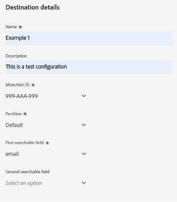

# Marketo Engage Person Sync 接続 {#marketo-engage-person-sync}

>[!IMPORTANT]
>
>この宛先コネクタはベータ版で、一部のお客様のみご利用いただけます。 アクセス権をリクエストするには、Adobe担当者にお問い合わせください。

>[!IMPORTANT]
>
>**[!UICONTROL Marketo Engage ユーザー同期]** の宛先カードは、**2026 年 3 月** に非推奨（廃止予定）になります。
>
>新しい **[[!UICONTROL 0&rbrace;Marketo Engage&rbrace; の宛先へのスムーズな移行を確実に行うには、次のポイントと必要な操作を確認します。]](marketo-engage-connection.md)**
>
>* **[!UICONTROL Marketo Engage Person Sync]** の宛先のすべてのユーザーは、2026 年 3 月までに新しい **[[!UICONTROL Marketo Engage]](marketo-engage-connection.md)** の宛先に移行する必要があります。
>* **既存のデータフローは、自動的には移行されません。** 新しい [3&rbrace;Marketo Engage&rbrace; の宛先への ](marketo-engage-connection.md#connect-to-the-destination) 新しい接続を設定 **[!UICONTROL し、そこでオーディエンスをアクティブ化する必要があります。]**

## 概要 {#overview}

Marketo Engage ユーザー同期コネクタを使用して、ユーザーオーディエンスからMarketo Engage インスタンスの対応するレコードに更新をストリーミングします。

>[!IMPORTANT]
> 
>[Marketo V2 オーディエンス同期コネクタ ](/help/destinations/catalog/adobe/marketo-engage.md) は、作成モードでプロファイル更新同期コネクタと組み合わせて使用しないでください

## サポートされる Id と属性 {#support-identities-and-attributes}

### サポートされる ID {#supported-identities}

| ターゲット ID | 説明 |
| --------------- | ---------------------------------------------------------------------------------------------------------------------------------------------------------------------------------------- |
| メール | メールアドレスを表す名前空間。 このタイプの名前空間は多くの場合、1 人の人物に関連付けられているので、様々なチャネルでその人物を識別するために使用できます。 |

{style="table-layout:auto"}

### サポートされる属性 {#supported-attributes}

Experience Platformから、組織がMarketoでアクセス権を持つ任意の属性に属性をマッピングできます。 Marketoでは、[Describe API](https://developer.adobe.com/marketo-apis/api/mapi/#tag/Leads/operation/describeUsingGET_6) リクエストを使用して、組織がアクセスできる属性フィールドを取得できます。

## サポートされるオーディエンス {#supported-audiences}

この節では、この宛先に書き出すことができるオーディエンスのタイプについて説明します。

| オーディエンスオリジン | サポートあり | 説明 |
| -------------------- | :-------: | ------------------------------------------------------------------------------------------------------------------------------------------------------------- |
| セグメント化サービス | ✓ | Experience Platform [ セグメント化サービス ](https://experienceleague.adobe.com/ja/docs/experience-platform/segmentation/home) を通じて生成されたオーディエンス。 |
| カスタムアップロード | ✓ | CSV ファイルからExperience Platformにインポートされたオーディエンス。 |

## 書き出しのタイプと頻度 {#export-type-and-frequency}

宛先の書き出しのタイプと頻度について詳しくは、以下の表を参照してください。

| 項目 | タイプ | メモ |
| ---------------- | --------- | ----------------------------------------------------------------------------------------------------------------------------------------------------------------------------------------------------------------------------------------------------------------------------------------------------------------------------------------------------------------------------------------- |
| 書き出し頻度 | ストリーミング | ストリーミングの宛先は常に、API ベースの接続です。オーディエンス評価に基づいて Experience Platform 内でプロファイルが更新されるとすぐに、コネクタは更新を宛先プラットフォームに送信します。[ストリーミングの宛先](/help/destinations/destination-types.md#streaming-destinations)の詳細についてはこちらを参照してください。 |

{style="table-layout:auto"}

## 宛先を設定 {#set-up-destination}

>[!IMPORTANT]
>
>* 宛先に接続するには、**[!UICONTROL 宛先の表示]** および **[!UICONTROL 宛先の管理]**&#x200B;[ アクセス制御権限 ](/help/access-control/home.md#permissions) が必要です。

会社が複数の組織にアクセスできる場合は、Marketoへの宛先コネクタを設定するMarketo EngageとReal-Time CDPの両方で同じ組織を使用していることを確認してください。  既に宛先を設定している場合は、新しい設定で使用する既存のMarketo アカウントを選択できます。  表示されない場合は、「コネクタを宛先に接続」プロンプトをクリックすると、目的の宛先の名前、説明、Marketo Munchkin ID を設定できます。  Marketo インスタンスのMunchkin ID は、管理者/Munchkin メニューに表示されます。

>[!IMPORTANT]
>
>宛先を設定するユーザーには、Marketoのインスタンスとパーティションで [ ユーザーの編集 ](https://experienceleague.adobe.com/en/docs/marketo/using/product-docs/administration/users-and-roles/descriptions-of-role-permissions#access-database) 権限が必要です。

* **[!UICONTROL 名前]**：今後この宛先を認識するための名前。
* **[!UICONTROL 説明]**：今後この宛先を識別するのに役立つ説明。
* **[!UICONTROL Munchkin ID]**: Munchkin ID は、特定のMarketo インスタンスの一意の ID です。
* **[!UICONTROL パーティション]**：ビジネス上の関心事ごとにリードレコードを分離するために使用される、Marketo Engageの概念
* **[!UICONTROL 最初の検索可能フィールド]**：重複排除するフィールド。 フィールドは、入力の各リードレコードに存在する必要があります。 デフォルトはメール
* **[!UICONTROL 最初の検索可能フィールド]**：重複排除するセカンダリフィールド。 フィールドは、入力の各リードレコードに存在する必要があります。 オプション

インスタンスを選択したら、設定を統合するリードパーティションも選択する必要があります。 [ リードパーティション ](https://experienceleague.adobe.com/en/docs/marketo/using/product-docs/administration/workspaces-and-person-partitions/understanding-workspaces-and-person-partitions) は、Marketo Engageの概念で、ブランドや販売地域など、ビジネス上の関心事ごとにリードレコードを分離するために使用されます。 Marketoのサブスクリプションに Workspaces and Partitions 機能がない場合、またはサブスクリプションに追加のパーティションが作成されていない場合は、デフォルトのパーティションのみが使用できます。 1 つの設定で更新できるのは、設定済みパーティションに存在するリードレコードのみです。

>[!IMPORTANT]
> 
>オーディエンスが初めてMarketoの宛先に対してアクティブ化された後、Marketoの宛先がアクティブ化される前にオーディエンスに既に存在していたプロファイルをバックフィルすると、*最大 24 時間* かかる場合があります。 今後、プロファイルは、オーディエンスに追加されるたびに直ちにMarketoに追加されます。

### 重複排除フィールド {#deduplication-fields}

Marketo engage に更新を送信すると、選択されたパーティションと、1 つまたは 2 つのユーザー選択フィールドに基づいてレコードが選択されます。 宛先に北米パーティションが設定され、メールアドレスと会社名が重複排除フィールドとして設定されている場合、既存のレコードに変更を適用するには、3 つのフィールドがすべて一致する必要があります。 例：

* 宛先は北米パーティションで設定されています
* Experience Platformで E メール <test@example.com> と会社名を持つ人物が宛先オーディエンスと一致する場合
* これらの値を持つレコードがMarketoの北米パーティションに既に存在しない場合、新しいリードレコードが作成されます

一致するリードレコードが見つからない場合は、新規レコードが作成されます。

## オーディエンスをアクティベート {#activate-audiences}

>[!IMPORTANT]
> 
>* データをアクティブ化するには、**[!UICONTROL 宛先の表示]**、**[!UICONTROL 宛先のアクティブ化]**、**[!UICONTROL プロファイルの表示]** および **[!UICONTROL セグメントの表示]**&#x200B;[ アクセス制御権限 ](/help/access-control/home.md#permissions) が必要です。 詳しくは、[アクセス制御の概要](/help/access-control/ui/overview.md)または製品管理者に問い合わせて、必要な権限を取得してください。

この宛先にオーディエンスセグメントをアクティベートする手順は、[ストリーミングセグメントの書き出し宛先へのプロファイルとセグメントのアクティベート](/help/destinations/ui/activate-segment-streaming-destinations.md)を参照してください。

オーディエンスをアクティベート手順では、表示されている任意のユーザーのオーディエンスから選択できます。

## フィールドマッピング {#field-mapping}

特定のユーザー属性に対する変更をMarketo Engageに送信するには、フィールドをReal-Time CDP フィールドからMarketo フィールドにマッピングする必要があります。

Experience PlatformのデータタイプとMarketoのデータタイプは、次の方法でマッピングできます。

| Experience Platform データタイプ | Marketo データタイプ |
| ----------------------------- | ------------------------------------ |
| 文字列 | 文字列，テキスト領域，Url，電話，メール |
| 列挙 | 文字列 |
| 日付 | Date |
| Date-time | 日時 |
| Integer | 整数 |
| Short | Integer |
| Long | 浮動小数点 |
| Double | 通貨、浮動小数点、パーセント |
| ブール値 | ブール値 |
| 配列 | サポートなし |
| オブジェクト | サポートなし |
| マップ | サポートなし |
| Byte | サポートなし |

{style="table-layout:auto"}

フィールドに値がない場合は、その値を設定できるようにし、既に値が存在するフィールドを統合が更新できないようにすることが望ましい場合もあります。  宛先コネクタがMarketo Engage インスタンス内の既存の値を上書きしないようにする必要がある場合は、Marketo インスタンスの管理者/フィールド管理セクションで更新をブロックするようにフィールドを設定し、Adobe Experience Platform ソースタイプを切り替えます。

## データの使用とガバナンス {#data-usage-and-governance}

Adobe Experience Platformのすべての宛先は、データを処理する際のデータ使用ポリシーに準拠しています。 Adobe Experience Platformによるデータガバナンスの実施方法について詳しくは、[ データガバナンスの概要 ](/help/data-governance/home.md) を参照してください。
