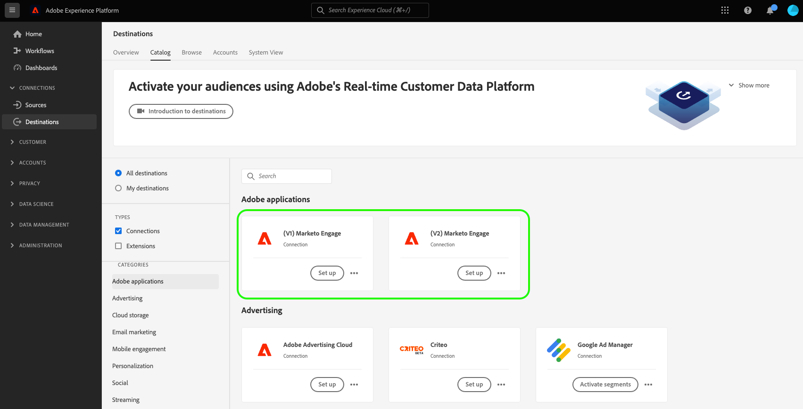

# （レガシー） （V2） Marketo Engageの宛先 {#beta-marketo-engage-destination}

## 宛先の変更ログ {#changelog}

<!--
>[!IMPORTANT]
>
>The **[!UICONTROL (Legacy) (V2) Marketo Engage]** will be deprecated in **March 2026**.
>
>To ensure a smooth transition to the new **[[!UICONTROL Marketo Engage]](marketo-engage-connection.md)** destination, review the following key points and required actions:
>
>* All users of the existing **[!UICONTROL (Legacy) (V2) Marketo Engage]** must migrate to the new **[!UICONTROL Marketo Engage]** destination by March 2026.
>* **Existing dataflows will not be migrated automatically.** You must [set up a new connection](../../ui/connect-destination.md) to the new **[!UICONTROL Marketo Engage]** destination and activate your audiences there.

-->

Marketo V2の宛先の機能強化は次のとおりです。

* アクティベーション ワークフローの&#x200B;**[!UICONTROL Schedule segment]** ステップであるMarketo V1では、データをMarketoに正常にエクスポートするために&#x200B;**マッピング ID**&#x200B;を手動で追加する必要がありました。 この手動の手順は、Marketo V2 では不要になりました。
* アクティベーション ワークフローの&#x200B;**[!UICONTROL Mapping]** ステップであるMarketo V1では、XDM フィールドをMarketoの3つのターゲットフィールド（`firstName`、`lastName`、および`companyName`）にマッピングすることができました。 Marketo V2 リリースで、XDM フィールドを Marketo の多数のフィールドにマッピングできるようになりました。 詳しくは、以下の「[ サポートされる属性](#supported-attributes)」の節を参照してください。

## 概要 {#overview}

[!DNL Marketo Engage]は、マーケティング、広告、分析、コマース向けのエンドツーエンドの顧客体験管理（CXM）ソリューションです。 このツールは、CRMのリード管理や顧客エンゲージメントから、ABM （アカウントベースドマーケティング）や売上への貢献度に至るまで、アクティビティを自動化および管理するために役立ちます。

宛先を使用すると、マーケターは[!DNL Adobe Experience Platform]で作成したオーディエンスをMarketoにプッシュし、静的リストとして表示できます。

## サポートされているIDと属性 {#supported-identities-attributes}

>[!NOTE]
>
>宛先をアクティブ化ワークフローの[ マッピング手順](/help/destinations/ui/activate-segment-streaming-destinations.md#mapping)では、IDをマッピングするには&#x200B;*必須*、属性をマッピングするには&#x200B;*オプション*&#x200B;です。 「ID名前空間」タブから電子メールやECIDをマッピングすることは、Marketoで個人が一致することを確認するために最も重要なことです。 マッピングメールは、最も高い一致率を保証します。

### サポートされている ID {#supported-identities}

| ターゲット ID | 説明 |
|---|---|
| ECID | ECIDを表す名前空間。 この名前空間は、「Adobe Marketing Cloud ID」、「[!DNL Adobe Experience Cloud] ID」、「[!DNL Adobe Experience Platform] ID」というエイリアスでも参照できます。 詳しくは、[ECID](/help/identity-service/features/ecid.md)の次のドキュメントを参照してください。 |
| メール | メールアドレスを表す名前空間。 このタイプの名前空間は、多くの場合、単一の人物に関連付けられているため、様々なチャネルをまたいでその人物を識別します。 |

{style="table-layout:auto"}

### サポートされる属性 {#supported-attributes}

Experience Platformの属性を、Marketoで組織がアクセスできる任意の属性にマッピングできます。 Marketoでは、[Describe API リクエスト ](https://developers.marketo.com/rest-api/lead-database/leads/#describe)を使用して、組織がアクセスできる属性フィールドを取得できます。

## サポートされるオーディエンス {#supported-audiences}

この節では、この宛先に書き出すことができるオーディエンスのタイプについて説明します。

| オーディエンスの由来 | サポートあり | 説明 |
|---------|----------|----------|
| [!DNL Segmentation Service] | ○ | Experience Platform [ セグメント化サービス ](../../../segmentation/home.md)を通じて生成されたオーディエンス。 |
| その他すべてのオーディエンスの生成元 | × | このカテゴリには、[!DNL Segmentation Service]を通じて生成されたオーディエンス以外のすべてのオーディエンスのオリジンが含まれます。 [様々なオーディエンスの起源](/help/segmentation/ui/audience-portal.md#customize)について読みます。 次に例を示します。 <ul><li> カスタムアップロードオーディエンス [がCSV ファイルからExperience Platformに](../../../segmentation/ui/audience-portal.md#import-audience)をインポートしました。</li><li> 類似オーディエンス， </li><li> 連合オーディエンス， </li><li> [!DNL Adobe Journey Optimizer]などの他のExperience Platform アプリで生成されたオーディエンス </li><li> その他。 </li></ul> |

{style="table-layout:auto"}

オーディエンスのデータタイプ別にサポートされるオーディエンス：

| オーディエンスのデータタイプ | サポートあり | 説明 | ユースケース |
|--------------------|-----------|-------------|-----------|
| [人物オーディエンス ](/help/segmentation/types/people-audiences.md) | ○ | 顧客プロファイルにもとづいて、マーケティング施策の特定のグループをターゲットにすることができます。 | 買い物客やカートの放棄が多い |
| [ アカウントオーディエンス ](/help/segmentation/types/account-audiences.md) | × | アカウントベースドマーケティング戦略のために、特定の組織内の個人をターゲットにします。 | B2B マーケティング |
| [見込みオーディエンス ](/help/segmentation/types/prospect-audiences.md) | × | まだ顧客ではないが、ターゲットオーディエンスと特徴を共有する個人をターゲットにします。 | サードパーティデータによる見込み顧客の開拓 |
| [ データセットの書き出し](/help/catalog/datasets/overview.md) | × | [!DNL Adobe Experience Platform] データ レイクに保存されている構造化データのコレクション。 | レポート，データサイエンスワークフロー |

{style="table-layout:auto"}

## 書き出しのタイプと頻度 {#export-type-frequency}

宛先の書き出しのタイプと頻度について詳しくは、以下の表を参照してください。

| 項目 | タイプ | メモ |
|---------|----------|---------|
| 書き出しタイプ | **[!UICONTROL Audience export]** | [!DNL Marketo Engage]宛先で使用されている識別子（電子メール、ECID）を持つオーディエンスのすべてのメンバーを書き出しています。 |
| 書き出し頻度 | **[!UICONTROL Streaming]** | ストリーミングの宛先は常に、API ベースの接続です。オーディエンス評価に基づいて Experience Platform 内でプロファイルが更新されるとすぐに、コネクタは更新を宛先プラットフォームに送信します。[ストリーミングの宛先](/help/destinations/destination-types.md#streaming-destinations)の詳細についてはこちらを参照してください。 |

{style="table-layout:auto"}

## 宛先の設定とオーディエンスのアクティブ化 {#set-up}

>[!IMPORTANT]
>
>* 宛先に接続するには、**[!UICONTROL View Destinations]**&#x200B;および&#x200B;**[!UICONTROL Manage Destinations]** [ アクセス制御権限](/help/access-control/home.md#permissions)が必要です。
>* データをアクティブ化するには、**[!UICONTROL View Destinations]**、**[!UICONTROL Activate Destinations]**、**[!UICONTROL View Profiles]**&#x200B;および&#x200B;**[!UICONTROL View Segments]** [ アクセス制御権限](/help/access-control/home.md#permissions)が必要です。 [アクセス制御の概要](/help/access-control/ui/overview.md)を参照するか、製品管理者に問い合わせて必要な権限を取得してください。

宛先の設定とオーディエンスのアクティベート方法について詳しくは、Marketo ドキュメントの[Adobe Experience Platform オーディエンスをMarketo静的リストにプッシュ ](https://experienceleague.adobe.com/docs/marketo/using/product-docs/core-marketo-concepts/smart-lists-and-static-lists/static-lists/push-an-adobe-experience-cloud-segment-to-a-marketo-static-list.html?lang=ja)を参照してください。

次のビデオでは、Marketoの宛先を設定し、オーディエンスをアクティベートする手順も示しています。

>[!IMPORTANT]
>
>このビデオは、現在の機能を完全に反映しているわけではありません。 最新の情報については、上記のリンク先のガイドを参照してください。 ビデオの次の部分は古くなっています。
> 
>* Experience Platform UIで使用する宛先カードは&#x200B;**[!UICONTROL Marketo V2]**&#x200B;です。
>* ビデオには、宛先に接続ワークフローの新しい&#x200B;**[!UICONTROL Person creation]** セレクターフィールドが表示されません。 このフィールドを使用するには、属性マッピング手順で名と姓の両方をマッピングする必要があります。
>* ビデオで指摘された2つの制限は、もはや適用されません。 ビデオの録画時にサポートされていたオーディエンスメンバーシップ情報に加えて、他の多くのプロファイル属性フィールドをマッピングできるようになりました。 Marketo静的リストにまだ存在しないMarketoにオーディエンスメンバーを書き出すこともできます。これらのメンバーはリストに追加されます。
>* ライセンス認証ワークフローの&#x200B;**[!UICONTROL Schedule audience step]**&#x200B;で、Marketo V1で、データをMarketoに正常にエクスポートするために&#x200B;**[!UICONTROL Mapping ID]**&#x200B;を手動で追加する必要がありました。 この手動の手順は、Marketo V2 では不要になりました。

>[!VIDEO](https://video.tv.adobe.com/v/338248?quality=12)

## 宛先の監視 {#monitor-destination}

宛先に接続して宛先データフローを確立した後、[の](/help/dataflows/ui/monitor-destinations.md)監視機能[!DNL Real-Time CDP]を使用して、各データフロー実行で宛先にアクティブ化されたプロファイルレコードに関する詳細な情報を取得できます。

[!DNL Marketo Engage]接続の監視情報には、各データフローおよびデータフロー実行でアクティブ化、除外、失敗したIDに関連するオーディエンスレベルの情報が含まれます。 [機能について詳しくは](/help/dataflows/ui/monitor-destinations.md#segment-level-view)を参照してください。

## データの使用とガバナンス {#data-usage-governance}

[!DNL Adobe Experience Platform] のすべての宛先は、データを処理する際のデータ使用ポリシーに準拠しています。[!DNL Adobe Experience Platform]がデータガバナンスを適用する方法について詳しくは、[ データガバナンスの概要](https://experienceleague.adobe.com/docs/experience-platform/data-governance/home.html?lang=ja)を参照してください。
