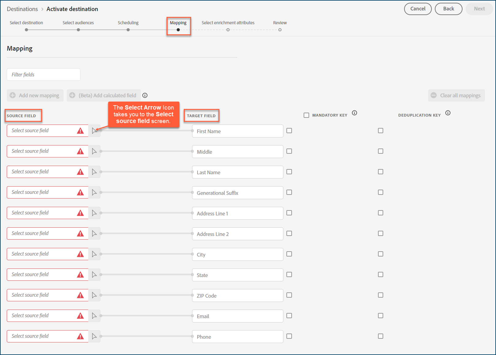
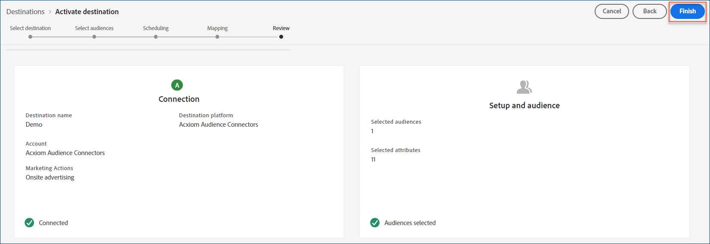

# [!DNL Acxiom Audience Connection]宛先

>[!NOTE]
>
>[!DNL Acxiom Audience Connection]宛先はベータ版です。 この宛先コネクタとドキュメント ページは、[!DNL Acxiom] チームによって作成および管理されています。 問い合わせやアップデートのリクエストについては、Acxiomに直接[こちら](mailto:acxiom-adobe-help@acxiom.com)までお問い合わせください。

[!DNL Acxiom Audience Connection]宛先を使用して、[!DNL Acxiom's] [Real ID™](https://www.acxiom.com/real-id/real-id/) テクノロジーでオーディエンスを強化し、[!DNL Altice]、[!DNL Ampersand]、[!DNL Comcast]などの複数のプラットフォームにオーディエンスをアクティブ化します。

このチュートリアルでは、[!DNL Acxiom Audience Connection] ユーザーインターフェイスを使用して[!DNL Adobe Experience Platform]宛先コネクタを作成する手順を説明します。 このコネクタは、選択した宛先にオーディエンスを構築および配布します。

## ユースケース {#use-cases}

[!DNL Acxiom Audience Connection]宛先を使用する方法とタイミングをより正確に把握するために、このコネクタを使用して[!DNL Adobe Experience Platform]のお客様が解決できる使用例を次に示します。

### Experience PlatformからAcxiom アカウントへのオーディエンスの送信 {#send-audiences}

クロスチャネル獲得のために[!DNL Experience Platform]から[!DNL Acxiom] アカウントにオーディエンスを送信するマーケティング担当者の場合は、この宛先コネクタを使用します。

たとえば、世界的な金融機関ブランドのマーケティングオペレーション部門は、複数の広告プラットフォームを通じたクロスチャネルの顧客獲得に関心を示しています。 [!DNL Acxiom Audience Connection]宛先コネクタを使用して、[!DNL Experience Platform]から[!DNL Acxiom]までのオーディエンスを送信し、[!DNL Acxiom's Real ID]技術でオーディエンスを強化し、[!DNL Altice]や[!DNL Ampersand]、[!DNL Comcast]などの複数のプラットフォームにオーディエンスをアクティブ化できます。

## 前提条件 {#prerequisites}

* **利用条件の確認：**&#x200B;新しい[!DNL Acxiom Audience Connection]宛先を設定する前に、[!DNL Acxiom's]利用条件に関する契約書を読んで署名する必要があります。 実行した販売注文が完了すると、契約書へのリンクが届きます。
* **お客様のAdobe組織IDについて：**&#x200B;お客様の[!DNL Adobe]組織IDは、利用条件を満たすために必要です。 組織ID[!DNL Adobe's]を&#x200B;*表示する方法について詳しくは、* [Experience Cloudの組織](https://experienceleague.adobe.com/ja/docs/core-services/interface/administration/organizations#concept_EA8AEE5B02CF46ACBDAD6A8508646255)のトピックを参照してください。

## サポートされる宛先 {#supported-destinations}

[!DNL Acxiom Audience Connection]宛先は、現在、次のプラットフォームへのオーディエンスのアクティブ化をサポートしています。 

* [!DNL Altice]
* [!DNL Ampersand]
* [!DNL Comcast]
* [!DNL Cox]
* [[!DNL LG Ads]](#lg-ads)
* [!DNL Spectrum]
* [!DNL Viant]

## サポートされるオーディエンス {#supported-audiences}

この節では、この宛先に書き出すことができるオーディエンスのタイプについて説明します。

| オーディエンスの由来 | サポートあり | 説明 |
|---------|----------|----------|
| [!DNL Segmentation Service] | ○ | Experience Platform [&#x200B; セグメント化サービス &#x200B;](../../../segmentation/home.md)を通じて生成されたオーディエンス。 |
| その他すべてのオーディエンスの生成元 | ○ | このカテゴリには、[!DNL Segmentation Service]を通じて生成されたオーディエンス以外のすべてのオーディエンスのオリジンが含まれます。 [様々なオーディエンスの起源](/help/segmentation/ui/audience-portal.md#customize)について読みます。 次に例を示します。 <ul><li> カスタムアップロードオーディエンス [がCSV ファイルからExperience Platformに](../../../segmentation/ui/audience-portal.md#import-audience)をインポートしました。</li><li> 類似オーディエンス， </li><li> 連合オーディエンス， </li><li> [!DNL Adobe Journey Optimizer]などの他のExperience Platform アプリで生成されたオーディエンス </li><li> その他。 </li></ul> |

{style="table-layout:auto"}

オーディエンスのデータタイプ別にサポートされるオーディエンス：

| オーディエンスのデータタイプ | サポートあり | 説明 | ユースケース |
|--------------------|-----------|-------------|-----------|
| [人物オーディエンス &#x200B;](/help/segmentation/types/people-audiences.md) | ○ | 顧客プロファイルにもとづいて、マーケティング施策の特定のグループをターゲットにすることができます。 | 買い物客やカートの放棄が多い |
| [&#x200B; アカウントオーディエンス &#x200B;](/help/segmentation/types/account-audiences.md) | × | アカウントベースドマーケティング戦略のために、特定の組織内の個人をターゲットにします。 | B2B マーケティング |
| [見込みオーディエンス &#x200B;](/help/segmentation/types/prospect-audiences.md) | × | まだ顧客ではないが、ターゲットオーディエンスと特徴を共有する個人をターゲットにします。 | サードパーティデータによる見込み顧客の開拓 |
| [&#x200B; データセットの書き出し](/help/catalog/datasets/overview.md) | × | [!DNL Adobe Experience Platform] データ レイクに保存されている構造化データのコレクション。 | レポート，データサイエンスワークフロー |

{style="table-layout:auto"}

## 宛先への接続 {#connect}

[!DNL Acxiom's Audience Connection]宛先への認証は、便利な方法で自動的にバックグラウンドで処理されます。

## 配信先固有の設定 {#destination-settings}

一部の[!DNL Acxiom Audience Connection]宛先には追加情報が必要です。 以下の節では、これらのオプションの設定方法に関する詳細なガイダンスを提供します。

### [!DNL LG Ads] {#lg-ads}

宛先の詳細を設定するには、以下のフィールドに入力します。

* **セグメント カテゴリ**: セグメントが属するターゲット カテゴリまたは垂直方向。 例：金融、自動車、医療など

## この宛先に対してオーディエンスをアクティブ化 {#activate}

>[!IMPORTANT]
>
>* データをアクティブ化するには、**[!UICONTROL View Destinations]**、**[!UICONTROL Activate Destinations]**、**[!UICONTROL View Profiles]**&#x200B;および&#x200B;**[!UICONTROL View Segments]** [&#x200B; アクセス制御権限](/help/access-control/home.md#permissions)が必要です。 [アクセス制御の概要](/help/access-control/ui/overview.md)を参照するか、製品管理者に問い合わせて必要な権限を取得してください。
>* *ID*&#x200B;をエクスポートするには、**[!UICONTROL View Identity Graph]** [&#x200B; アクセス制御権限](/help/access-control/home.md#permissions)が必要です。  {width="100" zoomable="yes"}

この宛先に対してオーディエンスをアクティブ化する手順については、[バッチプロファイル書き出し宛先に対するオーディエンスデータのアクティブ化](/help/destinations/ui/activate-batch-profile-destinations.md)を参照してください。

>[!NOTE]
>
>宛先[!DNL Acxiom Audience Connection]は、完全なファイル書き出しのみをサポートしています。

### 属性と ID のマッピング {#map}

宛先[!DNL Acxiom Audience Connection]がオーディエンスデータを正しく受け取るには、Experience Platformのソースフィールドを正しい[!DNL Acxiom Audience Connection] ターゲットフィールドにマッピングする必要があります。

[!DNL Acxiom Audience Connection]は、次のターゲットフィールドへのマッピングのみを許可します。 以下の表に記載されているターゲットフィールドは、以下に示す順序でマッピングする必要があります。

| フィールド名 | 説明 | 必須 | フィールドの順序 | 最大長 |
|---|---|---|---|---|          
| 名 | 個人の名前 | × | 1 | 255 |
| 中間 | 個人のミドルネームまたはイニシャル | × | 2 | 50 |
| 姓 | 個人の姓 | ○ | 3 | 255 |
| 生成接尾辞 | 個人の接尾辞 | × | 4 | 10 |
| 住所1 | 住所1主要住所のフィールド | ○ | 5 | 255 |
| 住所2 | 住所2主な居住地 | × | 6 | 255 |
| 市区町村 | 主な居住地 | ○ | 7 | 255 |
| 都道府県 | プライマリレジデンスの州の略語 | ○ | 8 | 2 |
| 郵便番号 | プライマリレジデンスの完全な郵便番号 | ○ | 9 | 10 |
| メール | プライマリメール デフォルトでは、このフィールドはレコードを一意にするために重複排除キーとして使用されます | × | 10 | 255 |
| Phone | 個人の電話番号（市外局番+ number）   デフォルトでは、このフィールドはレコードを一意にするために重複排除キーとして使用されます。 | × | 11 | 10 |

**[!UICONTROL Source Field]**&#x200B;列で、対応するターゲットフィールドにマッピングする各ソース属性の名前を入力するか、矢印アイコンを選択して&#x200B;**[!UICONTROL Select source field]**&#x200B;画面を開きます。 

すべてのフィールドをマッピングしたら、**[!UICONTROL Next]**&#x200B;を選択します。

[!DNL Adobe's]標準スキーマを使用していない場合は、クエリサービスを使用して[標準スキーマにフィールド名を入力する方法について、](../../../query-service/ui/overview.md) クエリサービス UI ガイド [!DNL Adobe]のドキュメントを参照してください。

### レビュー {#review}

上記のすべての手順を完了したら、宛先の接続ステータスとオーディエンスの詳細を確認してからアクティブ化（配信）することができます。 選択したオーディエンスがリストの下部に表示されます。 各オーディエンスは、[!DNL Acxiom Audience Connection] APIへの個別の呼び出しになります。

結果に問題がなければ、**[!UICONTROL Finish]**&#x200B;を選択して宛先をアクティブ化します。

## トラブルシューティング {#troubleshooting}

宛先の担当者がオーディエンスを見つけられない場合は、[!DNL Adobe]担当者にお問い合わせください。

次の情報を[!DNL Adobe]担当者に提供する必要があります：

* オーディエンス名
* 宛先名
* オーディエンスのアクティブ化日
* エクスポートされたファイル名

## 次の手順 {#next-steps}

選択した宛先プラットフォームに対するオーディエンスのアクティベートが完了しました。 次に、宛先プラットフォームの担当者に連絡して、キャンペーンの設定を開始します。

## データの使用とガバナンス {#data-usage-governance}

[!DNL Adobe Experience Platform] のすべての宛先は、データを処理する際のデータ使用ポリシーに準拠しています。[!DNL Adobe Experience Platform] がどのように データガバナンスを実施するかについて詳しくは、[データガバナンスの概要](https://experienceleague.adobe.com/en/docs/experience-platform/data-governance/home)を参照してください。
