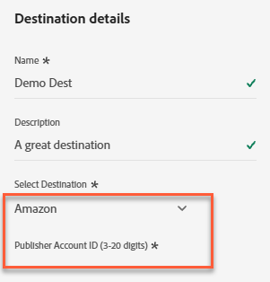
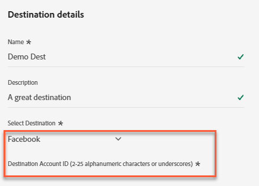
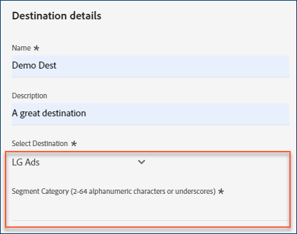
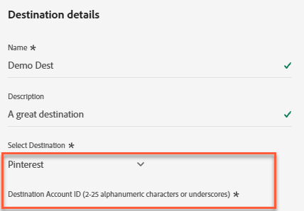
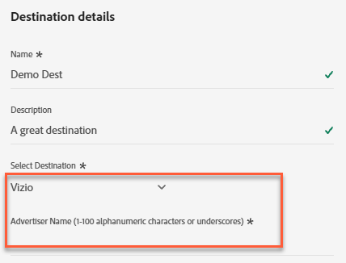
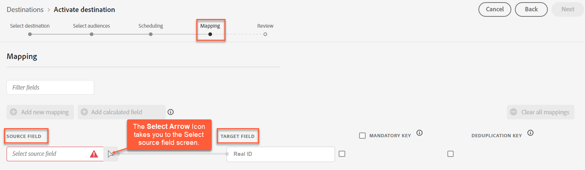

# [!DNL Acxiom Real ID™ Audience Connection]宛先

[!DNL Acxiom Real ID Audience Connection]宛先を使用して、[!DNL Acxiom]の[Real ID™](https://www.acxiom.com/real-id/real-id/) テクノロジーでオーディエンスを強化します。 そのオーディエンスを、[!DNL Altice]、[!DNL Ampersand]、[!DNL Comcast]などのプラットフォームでアクティブ化します。

>[!NOTE]
>
>この宛先コネクタとドキュメント ページは、[!DNL Acxiom] チームによって作成および管理されています。 問い合わせやアップデートのリクエストについては、[!DNL Acxiom]に直接[acxiom-adobe-help@acxiom.com](mailto:acxiom-adobe-help@acxiom.com)にお問い合わせください。

[!DNL Adobe Experience Platform] ユーザーインターフェイスを使用して[!DNL Acxiom Real ID Audience Connection]宛先コネクタを作成するには、次の手順に従います。 このコネクタを使用して、選択した宛先にオーディエンスを構築および配布します。

## ユースケース {#use-cases}

[!DNL Acxiom]の[!DNL Real ID]が識別子として[!DNL Real-Time CDP]に読み込まれている場合は、この宛先を使用します。 次の使用例は、[!DNL Acxiom Real ID Audience Connection]宛先の使用方法を示しています。

### [!DNL Experience Platform]から[!DNL Acxiom] アカウントにオーディエンスを送信 {#send-audiences}

この宛先コネクタを使用して、クロスチャネル獲得のために[!DNL Experience Platform]から[!DNL Acxiom] アカウントにオーディエンスを送信します。

たとえば、世界的な金融機関ブランドのマーケティングオペレーション部門は、複数の広告プラットフォームを通じたクロスチャネルの顧客獲得に関心を示しています。 [!DNL Acxiom Real ID Audience Connection]宛先コネクタを使用して、[!DNL Experience Platform]から[!DNL Acxiom]までのオーディエンスを送信し、[!DNL Acxiom]の[!DNL Real ID] テクノロジーでオーディエンスを強化し、[!DNL Altice]や[!DNL Ampersand]、[!DNL Comcast]などの複数のプラットフォームにオーディエンスをアクティブ化できます。

## 前提条件 {#prerequisites}

[!DNL Acxiom Real ID Audience Connection]宛先を設定する前に、次の前提条件を完了してください。

* **利用条件の確認：** [!DNL Acxiom]の利用条件に関する契約書を読み、署名します。 実行した販売注文が完了すると、契約書へのリンクが届きます。 契約書に署名するまで、[!DNL Acxiom Real ID Audience Connection]宛先カードは[!DNL Experience Platform]宛先カタログに表示されません。 契約書に同意して署名すると、[!DNL Adobe]が設定を完了し、[!DNL Acxiom Real ID Audience Connection]宛先カードが表示されます。
* **お客様の[!DNL Adobe]組織IDを知る：**&#x200B;お客様の[!DNL Adobe]組織IDは、利用条件を完了するために必要です。 組織ID](https://experienceleague.adobe.com/ja/docs/core-services/interface/administration/organizations#concept_EA8AEE5B02CF46ACBDAD6A8508646255)を[表示する方法について詳しくは、[!DNL Adobe]の&#x200B;*Experience Cloudの組織*&#x200B;のトピックを参照してください。
* **[!DNL Acxiom]の[!DNL Real ID]製品のライセンスを取得：** ライセンスを取得した後、[!DNL Real-Time CDP]以内に[!DNL Acxiom]の[!DNL Real ID]を利用できるようにします。 詳しくは、[Acxiom データの強化](/help/destinations/catalog/data-partner/acxiom-data-enhancement.md)を参照してください。

## サポートされている ID {#supported-identities}

[!DNL Acxiom]の[!DNL Real ID] Audience Connection宛先は、次のID アクティベーションをサポートしています。 [ID](/help/identity-service/features/namespaces.md) についての詳細情報。

| ターゲット ID | 説明 | 注意点 |
| --------------- | ----------- | -------------- |
| [!DNL Real ID] | [!DNL Real ID] | ソースフィールドをこのターゲット IDにマッピングします。 ソースフィールドには、[!DNL Acxiom] [!DNL Real ID]またはカスタム IDを指定できます。 |

{style="table-layout:auto"}

## サポートされるオーディエンス {#supported-audiences}

この節では、この宛先に書き出すことができるオーディエンスのタイプについて説明します。

| オーディエンスの由来 | サポートあり | 説明 |
| --------------- | --------- | ----------- |
| [!DNL Segmentation Service] | ○ | [!DNL Experience Platform] [ セグメント化サービス ](/help/segmentation/home.md)を通じて生成されたオーディエンス。 |
| その他すべてのオーディエンスの生成元 | ○ | このカテゴリには、[!DNL Segmentation Service]を通じて生成されたオーディエンス以外のすべてのオーディエンスのオリジンが含まれます。 [様々なオーディエンスの起源](/help/segmentation/ui/audience-portal.md#customize)について読みます。 次に例を示します。 <ul><li>カスタムアップロードオーディエンス [がCSV ファイルから[!DNL Experience Platform]に](/help/segmentation/ui/audience-portal.md#import-audience)をインポートしました。</li><li>類似オーディエンス，</li><li>連合オーディエンス，</li><li>[!DNL Adobe Journey Optimizer]などの他の[!DNL Experience Platform] アプリで生成されたオーディエンス，</li><li>その他。</li></ul> |

{style="table-layout:auto"}

### データタイプ別にサポートされているオーディエンス {#supported-audiences-data-type}

次の表に、この宛先に書き出すことができるオーディエンスデータタイプを示します。

| オーディエンスのデータタイプ | サポートあり | 説明 | ユースケース |
| -------------------- | --------- | ----------- | --------- |
| [人物オーディエンス ](/help/segmentation/types/people-audiences.md) | ○ | 最適な属性を選択できます。 マーケティングキャンペーンの特定のグループをターゲットにするのに使用できます。 | 買い物客やカートの放棄が多い |
| [ アカウントオーディエンス ](/help/segmentation/types/account-audiences.md) | × | アカウントベースドマーケティング戦略のために、特定の組織内の個人をターゲットにします。 | B2B マーケティング |
| [見込みオーディエンス ](/help/segmentation/types/prospect-audiences.md) | × | まだ顧客ではないが、ターゲットオーディエンスと特徴を共有する個人をターゲットにします。 | サードパーティデータによる見込み顧客の開拓 |
| [ データセットの書き出し](/help/catalog/datasets/overview.md) | × | [!DNL Adobe Experience Platform] データ レイクに保存されている構造化データのコレクション。 | レポート，データサイエンスワークフロー |

{style="table-layout:auto"}

## 書き出しのタイプと頻度 {#export-type-frequency}

次の表に、宛先の書き出しタイプと頻度を示します。

| 項目 | タイプ | メモ |
| ---- | ---- | ----- |
| 書き出しタイプ | **[!UICONTROL Audience export]** | [!DNL Acxiom Real ID Audience Connection]宛先で使用されている識別子を使用して、オーディエンスのすべてのメンバーを書き出します。 |
| 書き出し頻度 | **[!UICONTROL Batch]** | バッチ宛先では、ファイルが 3 時間、6 時間、8 時間、12 時間、24 時間の単位でダウンストリームプラットフォームに書き出されます。 詳しくは、[バッチ（ファイルベース）宛先](/help/destinations/destination-types.md#file-based)を参照してください。 |

{style="table-layout:auto"}

## サポートされる宛先 {#supported-destinations}

[!DNL Acxiom Real ID Audience Connection]宛先を介して、次のプラットフォームにオーディエンスをアクティブ化します。

* [!DNL Altice]
* [[!DNL Amazon]](#amazon)
* [!DNL Ampersand]
* [!DNL Comcast]
* [!DNL Cox]
* [[!DNL Facebook]](#facebook)
* [[!DNL LG Ads]](#lg-ads)
* [[!DNL Pinterest]](#pinterest)
* [!DNL Spectrum]
* [!DNL Viant]
* [[!DNL Vizio]](#vizio)

## 宛先への接続 {#connect}

[!DNL Experience Platform]は、[!DNL Acxiom Real ID Audience Connection]宛先の認証を自動的に処理します。

>[!IMPORTANT]
>
>宛先に接続するには、**[!UICONTROL View Destinations]**&#x200B;および&#x200B;**[!UICONTROL Manage Destinations]** [ アクセス制御権限](/help/access-control/home.md#permissions)が必要です。 詳しくは、[アクセス制御の概要](/help/access-control/ui/overview.md)または製品管理者に問い合わせて、必要な権限を取得してください。

## 配信先固有の設定 {#destination-settings}

一部の[!DNL Acxiom Real ID Audience Connection]宛先には追加情報が必要です。 次の節では、これらのオプションの設定方法に関する詳細なガイダンスを提供します。

### [!DNL Amazon] {#amazon}

宛先の詳細を設定するには、次のフィールドに入力します。

* **[!UICONTROL Publisher Account ID]**：この宛先に関連付けられている発行者アカウント IDを入力します。

  パブリッシャーアカウント ID フィールドを表示する[!DNL Amazon]宛先の詳細パネルの{zoomable="yes"}

### [!DNL Facebook] {#facebook}

宛先の詳細を設定するには、次のフィールドに入力します。

* **[!UICONTROL Destination Account ID]**：この宛先の宛先アカウント IDを入力します。

  宛先アカウント ID フィールドを表示する[!DNL Facebook]宛先の詳細パネルの{zoomable="yes"}

### [!DNL LG Ads] {#lg-ads}

宛先の詳細を設定するには、次のフィールドに入力します。

* **[!UICONTROL Segment Category]**: セグメントが属するターゲット カテゴリまたは垂直方向。 例：金融サービス、自動車、医療

  セグメントカテゴリフィールドを表示する[!DNL LG Ads]宛先の詳細パネルの{zoomable="yes"}

### [!DNL Pinterest] {#pinterest}

宛先の詳細を設定するには、次のフィールドに入力します。

* **[!UICONTROL Destination Account ID]**：この宛先の宛先アカウント IDを入力します。

  宛先アカウント ID フィールドを表示する[!DNL Pinterest]宛先の詳細パネルの{zoomable="yes"}

### [!DNL Vizio] {#vizio}

宛先の詳細を設定するには、次のフィールドに入力します。

* **[!UICONTROL Advertiser Name]**：この宛先の広告主の名前を入力します。

  広告主名フィールドを表示する[!DNL Vizio]宛先の詳細パネルの{zoomable="yes"}

## この宛先に対してオーディエンスをアクティブ化 {#activate}

この宛先に対してオーディエンスをアクティブ化する手順については、[バッチプロファイル書き出し宛先に対するオーディエンスデータのアクティブ化](/help/destinations/ui/activate-batch-profile-destinations.md)を参照してください。

>[!IMPORTANT]
>
>* データをアクティブ化するには、**[!UICONTROL View Destinations]**、**[!UICONTROL Activate Destinations]**、**[!UICONTROL View Profiles]**&#x200B;および&#x200B;**[!UICONTROL View Segments]** [ アクセス制御権限](/help/access-control/home.md#permissions)が必要です。 [アクセス制御の概要](/help/access-control/ui/overview.md)を参照するか、製品管理者に問い合わせて必要な権限を取得してください。
>* *ID*&#x200B;をエクスポートするには、**[!UICONTROL View Identity Graph]** [ アクセス制御権限](/help/access-control/home.md#permissions)が必要です。  {width="100" zoomable="yes"}

>[!NOTE]
>
>宛先[!DNL Acxiom Real ID Audience Connection]は、完全なファイル書き出しのみをサポートしています。

### 属性と ID のマッピング {#map}

[!DNL Acxiom Real ID Audience Connection]宛先がオーディエンスデータを正しく受信するには、[!DNL Experience Platform]のソースフィールドを正しい[!DNL Acxiom Real ID Audience Connection] ターゲットフィールドにマッピングします。

**[!UICONTROL Real ID]** ターゲットフィールドは、マッピングステップで自動的に事前入力されます。 ソースフィールドをプロファイルスキーマに格納されているカスタム ID名前空間または実際の[!DNL Acxiom] [!DNL Real ID]のいずれかにマッピングします。

| フィールド名 | 説明 | 必須 |
| ---------- | ----------- | -------- |
| [!DNL Real ID] | [!DNL Real ID]は、[!DNL Acxiom]独自のID解決グラフから取得した一意の36 バイトの英数字の識別子です。 個人、世帯、住所を表す識別子です。 | ○ |

{style="table-layout:auto"}

**[!UICONTROL Source Field]**&#x200B;列に、**[!UICONTROL Real ID]** ターゲットフィールドにマッピングするソース属性の名前を入力します。 または、**[!UICONTROL Select source field]**&#x200B;を選択して、使用可能なソースフィールドを参照します。 次に、**[!UICONTROL Next]**&#x200B;を選択します。

[!UICONTROL Source Field]列と[!UICONTROL Select source field] パネルを示すマッピング画面の{zoomable="yes"}

[!DNL Adobe]の標準スキーマを使用していない場合は、[ クエリサービス UI ガイド ](/help/query-service/ui/overview.md)を参照して、[!DNL Adobe]の標準スキーマにフィールド名を入力してください。

### 宛先を確認 {#review}

すべての手順を完了したら、宛先の接続ステータスとオーディエンスの詳細を確認してからアクティベートします。 選択したオーディエンスがリストに表示されます。 各オーディエンスは、[!DNL Acxiom Real ID Audience Connection] APIへの個別の呼び出しです。

結果が正しく表示されたら、**[!UICONTROL Finish]**&#x200B;を選択して宛先をアクティブ化します。

アクティブ化前の宛先接続ステータスと選択したオーディエンスを示すレビュー画面の{zoomable="yes"}

## トラブルシューティング {#troubleshooting}

宛先の担当者がオーディエンスを見つけられない場合は、[!DNL Adobe]担当者にお問い合わせください。

[!DNL Adobe]担当者に次の情報を提供してください：

* オーディエンス名
* 宛先名
* オーディエンスのアクティブ化日
* エクスポートされたファイル名

## 次の手順 {#next-steps}

選択した宛先プラットフォームに対するオーディエンスのアクティベートが完了しました。 次に、宛先プラットフォームの担当者に連絡して、キャンペーンの設定を開始します。

## データの使用とガバナンス {#data-usage-governance}

[!DNL Adobe Experience Platform] のすべての宛先は、データを処理する際のデータ使用ポリシーに準拠しています。 [!DNL Adobe Experience Platform] がどのように データガバナンスを実施するかについて詳しくは、[データガバナンスの概要](/help/data-governance/home.md)を参照してください。
