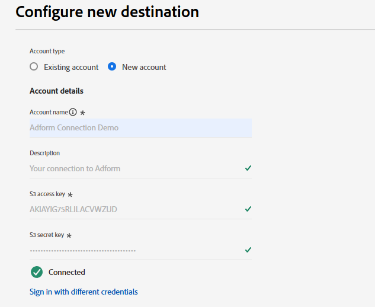
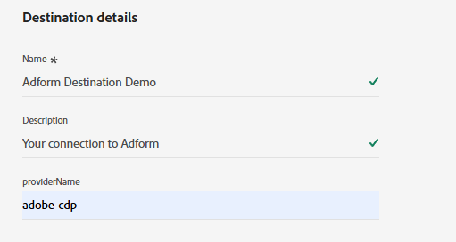

# Adform接続 {#adform}

## 概要 {#overview}

Adformは、プログラマティックメディアの売買ソリューションを提供する大手プロバイダーです。 Adformを[!DNL Adobe Experience Platform]に接続すると、Experience Cloud ID （ECID）に基づいて、Adformを通じて1st パーティオーディエンスをアクティブ化できます。

>[!IMPORTANT]
>
>宛先コネクタとドキュメントページは、Adform チームによって作成および管理されます。 問い合わせや更新のリクエストについては、`support@adform.com`から直接お問い合わせください。

## ユースケース {#use-cases}

Adformの宛先を使用する方法とタイミングをより深く理解するために、この宛先を使用して[!DNL Adobe Experience Platform]のお客様が解決できるユースケースの例を次に示します。

### Adobe [!DNL Real-Time CDP] オーディエンスのアクティベーション {#use-case-1}

この宛先を使用して、Experience Cloud ID （ECID）とAdformのID Fusionに基づいて、Adobe [!DNL Real-Time CDP] オーディエンスをAdformに送信してアクティベーションします。 AdformのID Fusionは、Experience Cloud ID （ECID）に基づいてファーストパーティオーディエンスをアクティブ化するためのAdformのID解決サービスです。

よくあるケースは、Experience Cloud ID （ECID）にもとづいて、web サイトやアプリへのweb サイト訪問者の再ターゲティングです。 必要な操作は、すぐに利用できる[ イベントストリーミング ](https://exchange.adobe.com/apps/ec/600102/adform-s2s-site-tracking)または[ クライアントサイド ](https://experienceleague.adobe.com/en/docs/experience-platform/destinations/catalog/analytics/adform)のAdform拡張機能を使用して、Experience Cloud ID （ECID）をAdformに送信することだけです。 その後、Experience Cloud ID （ECID）のみに基づいて、有効化のためにAdform宛先を介してAdformとオーディエンスを共有できます。

## 前提条件 {#prerequisites}

* この宛先を使用するには、既存のAdform顧客である必要があります。
* Adform Audience Base Data Connectionの資格情報が必要です。
   * Adform Audience Base Data Connectionの資格情報をお持ちでない場合は、Adform担当者にお問い合わせください。
* 適切に同期するには、[ イベントストリーミング ](https://exchange.adobe.com/apps/ec/600102/adform-s2s-site-tracking)または[ クライアントサイド ](https://experienceleague.adobe.com/en/docs/experience-platform/destinations/catalog/analytics/adform)の接続をエンティティからAdform Site Trackingに接続する必要があります。
   * エンティティからAdform Site Trackingへのイベントストリーミングまたはクライアントサイド接続がない場合は、Adform担当者にお問い合わせください。
   * Adformは、[!DNL Adobe Experience Cloud] イベントストリーミング [と](https://exchange.adobe.com/apps/ec/600102/adform-s2s-site-tracking) クライアントサイド [の両方に](https://experienceleague.adobe.com/en/docs/experience-platform/destinations/catalog/analytics/adform)個の拡張機能を提供しています。

## サポートされている ID {#supported-identities}

Adformは、次の表に示すIDのアクティベーションをサポートしています。 [ID](/help/identity-service/features/namespaces.md) についての詳細情報。

| ターゲット ID | 説明 | 注意点 |
|---|---|---|
| ECID | Experience Cloud ID | ECIDを表す名前空間。 この名前空間は、「Adobe Marketing Cloud ID」、「[!DNL Adobe Experience Cloud] ID」、「[!DNL Adobe Experience Platform] ID」というエイリアスでも参照できます。 詳しくは、[ECID](/help/identity-service/features/ecid.md)の次のドキュメントを参照してください。 |

{style="table-layout:auto"}

## サポートされるオーディエンス {#supported-audiences}

この節では、この宛先に書き出すことができるオーディエンスのタイプについて説明します。

| オーディエンスの由来 | サポートあり | 説明 |
|---------|----------|----------|
| [!DNL Segmentation Service] | ○ | Experience Platform [ セグメント化サービス ](../../../segmentation/home.md)を通じて生成されたオーディエンス。 |
| その他すべてのオーディエンスの生成元 | × | このカテゴリには、[!DNL Segmentation Service]を通じて生成されたオーディエンス以外のすべてのオーディエンスのオリジンが含まれます。 [様々なオーディエンスの起源](/help/segmentation/ui/audience-portal.md#customize)について読みます。 次に例を示します。 <ul><li> カスタムアップロードオーディエンス [がCSV ファイルからExperience Platformに](../../../segmentation/ui/audience-portal.md#import-audience)をインポートしました。</li><li> 類似オーディエンス， </li><li> 連合オーディエンス， </li><li> [!DNL Adobe Journey Optimizer]などの他のExperience Platform アプリで生成されたオーディエンス </li><li> その他。 </li></ul> |

{style="table-layout:auto"}

オーディエンスのデータタイプ別にサポートされるオーディエンス：

| オーディエンスのデータタイプ | サポートあり | 説明 | ユースケース |
|--------------------|-----------|-------------|-----------|
| [人物オーディエンス ](/help/segmentation/types/people-audiences.md) | ○ | 顧客プロファイルにもとづいて、マーケティング施策の特定のグループをターゲットにすることができます。 | 買い物客やカートの放棄が多い |
| [ アカウントオーディエンス ](/help/segmentation/types/account-audiences.md) | × | アカウントベースドマーケティング戦略のために、特定の組織内の個人をターゲットにします。 | B2B マーケティング |
| [見込みオーディエンス ](/help/segmentation/types/prospect-audiences.md) | × | まだ顧客ではないが、ターゲットオーディエンスと特徴を共有する個人をターゲットにします。 | サードパーティデータによる見込み顧客の開拓 |
| [ データセットの書き出し](/help/catalog/datasets/overview.md) | × | [!DNL Adobe Experience Platform] データ レイクに保存されている構造化データのコレクション。 | レポート，データサイエンスワークフロー |

{style="table-layout:auto"}

## 書き出しのタイプと頻度 {#export-type-frequency}

宛先の書き出しのタイプと頻度について詳しくは、以下の表を参照してください。

| 項目 | タイプ | メモ |
|---------|----------|---------|
| 書き出しタイプ | **[!UICONTROL Segment export]** | *YourDestination*&#x200B;宛先で使用されている識別子（名前、電話番号など）を含むセグメント（オーディエンス）のすべてのメンバーを書き出しています。 |
| 書き出し頻度 | **[!UICONTROL Batch]** | バッチ宛先では、ファイルが 3 時間、6 時間、8 時間、12 時間、24 時間の単位でダウンストリームプラットフォームに書き出されます。 詳しくは、[バッチ（ファイルベース）宛先](/help/destinations/destination-types.md#file-based)を参照してください。 |

{style="table-layout:auto"}

## 宛先への接続 {#connect}

>[!IMPORTANT]
>
>宛先に接続するには、**[!UICONTROL View Destinations]**&#x200B;および&#x200B;**[!UICONTROL Manage Destinations]** [ アクセス制御権限](/help/access-control/home.md#permissions)が必要です。 詳しくは、[アクセス制御の概要](/help/access-control/ui/overview.md)または製品管理者に問い合わせて、必要な権限を取得してください。

この宛先に接続するには、[宛先設定のチュートリアル](../../ui/connect-destination.md)の手順に従ってください。宛先の設定ワークフローで、以下の 2 つのセクションにリストされているフィールドに入力します。

### 宛先に対する認証 {#authenticate}

宛先に対して認証を行うには、必須フィールドに入力し、**[!UICONTROL Connect to destination]**&#x200B;を選択します。

* **[!UICONTROL Account name]**：今後この宛先接続を識別できるアカウント名を入力します。
* **[!UICONTROL S3 Access Key ID]**: Adformから提供されたS3 アクセス キーを入力します。
* **[!UICONTROL S3 Secret Access Key]**: Adformから提供されたS3 シークレット アクセス キーを入力します。

### 宛先の詳細を入力 {#destination-details}

宛先の詳細を設定するには、以下の必須フィールドとオプションフィールドに入力します。UI のフィールドの横のアスタリスクは、そのフィールドが必須であることを示します。

* **[!UICONTROL Name]**：今後この宛先を認識する際に使用する名前。
* **[!UICONTROL Description]**：今後この宛先を特定するのに役立つ説明です。
* **[!UICONTROL Provider Name]**: Adformから提供されたAdform アカウント名。

### アラートの有効化 {#enable-alerts}

アラートを有効にすると、宛先へのデータフローのステータスに関する通知を受け取ることができます。リストからアラートを選択して、データフローのステータスに関する通知を受け取るよう登録します。アラートについて詳しくは、[UI を使用した宛先アラートの購読](../../ui/alerts.md)についてのガイドを参照してください。

宛先接続の詳細の提供が完了したら、**[!UICONTROL Next]**&#x200B;を選択します。

## この宛先に対してオーディエンスをアクティブ化 {#activate}

>[!IMPORTANT]
>
>* データをアクティブ化するには、**[!UICONTROL View Destinations]**、**[!UICONTROL Activate Destinations]**、**[!UICONTROL View Profiles]**&#x200B;および&#x200B;**[!UICONTROL View Segments]** [ アクセス制御権限](/help/access-control/home.md#permissions)が必要です。 [アクセス制御の概要](/help/access-control/ui/overview.md)を参照するか、製品管理者に問い合わせて必要な権限を取得してください。
>* *ID*&#x200B;をエクスポートするには、**[!UICONTROL View Identity Graph]** [ アクセス制御権限](/help/access-control/home.md#permissions)が必要です。  {width="100" zoomable="yes"}

この宛先に対してオーディエンスセグメントをアクティブ化する手順については、[バッチプロファイル書き出し宛先に対するオーディエンスデータのアクティブ化](/help/destinations/ui/activate-batch-profile-destinations.md)を参照してください。

### 属性と ID のマッピング {#map}

* **ECID** （Experience Cloud ID）

マッピング手順では、[!DNL ECID] ターゲット ID マッピングのみを使用します。 他のID フィールドは含めないでください。これにより、アクティベーションが正常に完了できなくなります。

## 書き出されたデータ／データ書き出しの検証 {#exported-data}

宛先コネクタは、ECID IDのみを宛先に書き出します。 他のIDはエクスポートされません。 データの書き出しが成功したかどうかを確認するには、Adform Audience Base アカウントにログインし、オーディエンスが使用可能かどうかを確認してください。

## データの使用とガバナンス {#data-usage-governance}

[!DNL Adobe Experience Platform] のすべての宛先は、データを処理する際のデータ使用ポリシーに準拠しています。[!DNL Adobe Experience Platform] がどのように データガバナンスを実施するかについて詳しくは、[データガバナンスの概要](/help/data-governance/home.md)を参照してください。

## その他のリソース {#additional-resources}

Adform Audience Baseについて詳しくは、[Adform Audience Base ドキュメント ](https://www.adformhelp.com/hc/en-us/categories/9738365991697-Data-Management-Platform)を参照してください。
