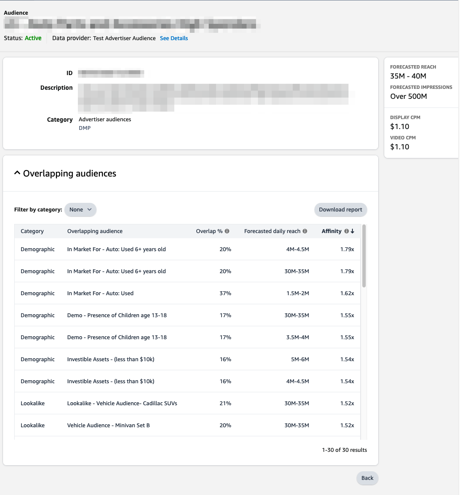

# （ベータ版）Amazon Ads 接続 {#amazon-ads}

## 概要 {#overview}

Amazon Ads には、登録販売者、ベンダー、書籍ベンダー、Kindle Direct Publishing(KDP) 作成者、アプリ開発者、代理店に対する広告目標の達成に役立つ様々なオプションが用意されています。

Amazon Ads とAdobe Experience Platformの統合により、Amazon DSP(ADSP) を含むAmazon Ads 製品に重要な統合が可能になります。 Adobe Experience PlatformのAmazon Ads の宛先を使用して、ユーザーは、Amazon DSPでのターゲティングとアクティブ化のための広告主オーディエンスを定義できます。

この接続は、次のAmazon Marketplaces でのオーディエンスの作成をサポートします。 `US`, `CA`, `MX`, `BR`.

>[!IMPORTANT]
>
>このドキュメントページは、 *Amazon Ads* チーム。 現在はベータ版の製品であり、機能は変更される場合があります。 お問い合わせや更新のご依頼は、直接 *`amc-support@amazon.com`.*

## ユースケース {#use-cases}

をいつどのように使用するかをより深く理解するのに役立ちます。 *Amazon Ads* の宛先について、Adobe Experience Platformのお客様がこの宛先を使用して解決できる使用例を以下に示します。

### Activation と Targeting {#activation-and-targeting}

このAmazon DSPとの統合により、Amazon Ads の広告主は、広告主 CDP セグメントをAdobe Experience PlatformからAmazonのDSPに渡して、広告ターゲティング用の広告主オーディエンスを作成できます。 オーディエンスは、Amazon DSP内で肯定的なターゲティング用と、否定的なターゲティング（抑制）用に選択できます。 さらに、AmazonMarketing Cloudを通じて生成されたシグナルを使用して、広告主のオーディエンスを最適化し、オーディエンスの変更をAmazon DSPと同期することができます。

## 前提条件 {#prerequisites}

Amazon Ads とAdobe Experience Platformの接続を使用するには、まずAmazon DSP Advertiser アカウントにアクセスできる必要があります。  これらのインスタンスをプロビジョニングするには、Amazon Ads Web サイトの次のページにアクセスしてください。

* [Amazon DSPの概要](https://advertising.amazon.com/solutions/products/amazon-dsp?ref_=a20m_us_hnav_p_dsp_adtech)

## サポートされる ID {#supported-identities}

この *Amazon Ads* 接続では、以下の表で説明する id のアクティブ化をサポートしています。 [ID](/help/identity-service/namespaces.md) についての詳細情報。Amazon Ads でサポートされる ID について詳しくは、 [Amazon DSP Support Center](https://advertising.amazon.com/dsp/help/ss/en/audiences#GA6BC9BW52YFXBNE).

| ターゲット ID | 説明 | 注意点 |
|---|---|---|
| phone_sha256 | SHA256 アルゴリズムでハッシュ化された電話番号 | プレーンテキストと SHA256 ハッシュ化された電話番号の両方が、Adobe Experience Platformでサポートされています。 ソースフィールドにハッシュ化されていない属性が含まれている場合は、 **[!UICONTROL 変換を適用]** オプション [!DNL Platform] 有効化時に、データを自動的にハッシュ化します。 |
| email_lc_sha256 | SHA256 アルゴリズムでハッシュ化された電子メールアドレス | プレーンテキストと SHA256 ハッシュ化された電子メールアドレスの両方が、Adobe Experience Platformでサポートされています。 ソースフィールドにハッシュ化されていない属性が含まれている場合は、 **[!UICONTROL 変換を適用]** オプション [!DNL Platform] 有効化時に、データを自動的にハッシュ化します。 |

{style="table-layout:auto"}

## 書き出しのタイプと頻度 {#export-type-frequency}

宛先の書き出しのタイプと頻度について詳しくは、以下の表を参照してください。

| 項目 | タイプ | メモ |
---------|----------|---------|
| 書き出しタイプ | **[!UICONTROL セグメントの書き出し]** | セグメント（オーディエンス）のすべてのメンバーを、 *Amazon Ads* 宛先。 |
| 書き出し頻度 | **[!UICONTROL ストリーミング]** | ストリーミングの宛先は常に、API ベースの接続です。セグメント評価に基づいて Experience Platform 内でプロファイルが更新されるとすぐに、コネクタは更新を宛先プラットフォームに送信します。[ストリーミングの宛先](/help/destinations/destination-types.md#streaming-destinations)の詳細についてはこちらを参照してください。 |

{style="table-layout:auto"}

## 宛先への接続 {#connect}

>[!IMPORTANT]
> 
>宛先に接続するには、**[!UICONTROL 宛先の管理]** [アクセス制御権限](/help/access-control/home.md#permissions)が必要です。詳しくは、[アクセス制御の概要](/help/access-control/ui/overview.md)または製品管理者に問い合わせて、必要な権限を取得してください。

この宛先に接続するには、[宛先設定のチュートリアル](../../ui/connect-destination.md)の手順に従ってください。宛先の設定ワークフローで、以下の 2 つのセクションにリストされているフィールドに入力します。

### 宛先に対する認証 {#authenticate}

宛先に対して認証するには、必須フィールドに入力し、「**[!UICONTROL 宛先に接続]**」を選択します。

Amazon Ads 接続インターフェイスに移動し、最初に接続先の広告主アカウントを選択します。  接続すると、選択した広告主アカウントの ID が付いた新しい接続で、Adobe Experience Platformにリダイレクトされます。 宛先の設定画面で適切な広告主アカウントを選択して続行します。

* **[!UICONTROL Bearer トークン]**:宛先への認証をおこなうために bearer トークンを入力します。

### 宛先の詳細を入力 {#destination-details}

宛先の詳細を設定するには、以下の必須フィールドとオプションフィールドに入力します。UI のフィールドの横のアスタリスクは、そのフィールドが必須であることを示します。

* **[!UICONTROL 名前]**：今後この宛先を認識するための名前。
* **[!UICONTROL 説明]**：今後この宛先を識別するのに役立つ説明。
* **[!UICONTROL Amazon Ads Advertiser ID]**:宛先に使用するターゲットAmazon Ads アカウントの ID を選択します。

注意：このAmazon Ads Advertiser ID を選択したら、新しい宛先を作成して変更する必要があります。 OAuth 資格情報を再認証し、新しい広告主 ID を選択した場合、変更は適用されません。

### アラートの有効化 {#enable-alerts}

アラートを有効にすると、宛先へのデータフローのステータスに関する通知を受け取ることができます。リストからアラートを選択して、データフローのステータスに関する通知を受け取るよう登録します。アラートについて詳しくは、[UI を使用した宛先アラートの購読](../../ui/alerts.md)についてのガイドを参照してください。

宛先接続の詳細の入力を終えたら「**[!UICONTROL 次へ]**」を選択します。

## この宛先に対してセグメントをアクティブ化 {#activate}

>[!IMPORTANT]
> 
>データをアクティブ化するには、**[!UICONTROL 宛先の管理]**、**[!UICONTROL 宛先のアクティブ化]**、**[!UICONTROL プロファイルの表示]**&#x200B;および&#x200B;**[!UICONTROL セグメントの表示]**[に対するアクセス制御権限](/help/access-control/home.md#permissions)が必要です。詳しくは、[アクセス制御の概要](/help/access-control/ui/overview.md)または製品管理者に問い合わせて、必要な権限を取得してください。

この宛先にオーディエンスセグメントをアクティベートする手順は、[ストリーミングセグメントの書き出し宛先へのプロファイルとセグメントのアクティベート](/help/destinations/ui/activate-segment-streaming-destinations.md)を参照してください。

### 属性と ID のマッピング {#map}

Amazon Ads 接続は、ID 照合のために、ハッシュ化された電子メールアドレスとハッシュ化された電話番号をサポートします。  以下のスクリーンショットは、Amazon Ads 接続と互換性のある照合の例を示しています。

* ハッシュ化された電子メールアドレスをマッピングするには、 `Email_LC_SHA256` ソースフィールドとしての id 名前空間。
* ハッシュ化された電話番号をマッピングするには、 `Phone_SHA256` ソースフィールドとしての id 名前空間。
* ハッシュ化されていない電子メールアドレスまたは電話番号をマッピングするには、対応する ID 名前空間をソースフィールドとして選択し、 `Apply Transformation` オプションを使用して、アクティベーション時に Platform で ID をハッシュ化する必要があります。

使用可能な数のフィールドをマッピングすることを強くお勧めします。 1 つのソース属性のみを使用できる場合、1 つのフィールドをマッピングできます。  Amazon Ads の宛先は、マッピングの目的ですべてのマッピングされたフィールドを利用し、より多くのフィールドが提供される場合は、より高い一致率を生成します。 受け入れ可能な識別子について詳しくは、 [Amazon Ads ハッシュ化されたオーディエンスヘルプページ](https://advertising.amazon.com/dsp/help/ss/en/audiences#GA6BC9BW52YFXBNE).

## エクスポートされたデータ/データエクスポートの検証 {#exported-data}

オーディエンスがアップロードされたら、次の手順を使用して、オーディエンスが作成され、正しくアップロードされたことを検証できます。

**Amazon DSPの場合**

Advertiser ID → Audiences → Advertiser Audiences に移動します。 オーディエンスが正常に作成され、最小数のオーディエンスメンバーを満たしている場合、ステータスは `Active`.  オーディエンスのサイズとリーチに関する追加の詳細については、Amazon DSPユーザーインターフェイスの右側にある予測リーチパネルを参照してください。

## データの使用とガバナンス {#data-usage-governance}

[!DNL Adobe Experience Platform] のすべての宛先は、データを処理する際のデータ使用ポリシーに準拠しています。[!DNL Adobe Experience Platform] がどのように データガバナンスを実施するかについて詳しくは、[データガバナンスの概要](/help/data-governance/home.md)を参照してください。

## その他のリソース {#additional-resources}

その他のヘルプドキュメントについては、次のAmazon Ads ヘルプリソースを参照してください。

* [Amazon DSPヘルプセンター](https://advertising.amazon.com/dsp/help/ss/en/audiences#/)
