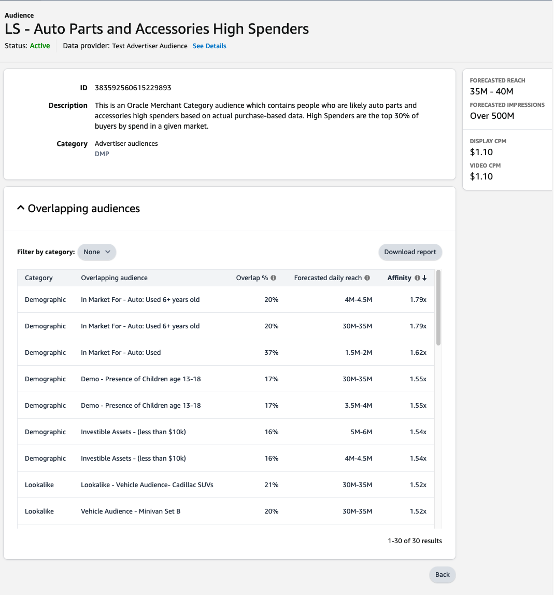

# （従来）Amazon Adsとの連携 {#amazon-ads}

## 概要 {#overview}

[!DNL Amazon Ads]では、登録販売者、ベンダー、ブックベンダー、Kindle Direct Publishing （KDP）の作成者、アプリ開発者、代理店に対して、広告目標を達成するための様々なオプションを提供しています。

>[!IMPORTANT]
>
>[[!DNL Amazon Ads v2]](./amazon-ads-v2.md)は、すべての新しい[!DNL Amazon Ads]接続の現在の宛先です。 既存の（レガシー） [!DNL Amazon Ads]接続がある場合、必要な変更を加えずに引き続き機能します。 [[!DNL Amazon Ads v2]](./amazon-ads-v2.md)は[!DNL Ads Data Manager]に接続します。これにより、[!DNL Amazon Ads]製品でのID タイプの拡張、アドレス関連フィールド、データ共有がサポートされ、この従来の宛先と比較してターゲティングとオーディエンスの一致率が向上します。
>
>2026年4月末以降、[!DNL Amazon Ads v2]の名前は[!DNL Amazon Ads]に変更され、レガシーカードは非表示になり、カタログに1つの宛先カードが残ります。 既存のレガシーデータフローは引き続き機能し、その日付以降は&#x200B;**[!UICONTROL Browse]** タブで管理できます。

[!DNL Amazon Ads]と[!DNL Adobe Experience Platform]の統合により、[!DNL Amazon Ads] （ADSP）や[!DNL Amazon DSP] （AMC）など、[!DNL Amazon Marketing Cloud]製品へのターンキー統合が可能になります。

[!DNL Amazon Ads]の[!DNL Adobe Experience Platform]宛先を使用して、[!DNL Amazon DSP]でのターゲティングとアクティベーション用に広告主オーディエンスを定義できます。 データを[!DNL Amazon Marketing Cloud]にアップロードして、オーディエンス、広告主が提供したディメンション、Amazon セグメントのメンバーシップ、またはAMCで利用可能なその他のシグナルによるパフォーマンスを把握することもできます。 広告主オーディエンスをAMCにアップロードした後、ユーザーは[!DNL Amazon Marketing Cloud]を使用して、[!DNL Amazon Marketing Cloud]内からAmazon シグナルを使用して、オーディエンスメンバーに変更、強化、または追加できます。

AMCは、ディスプレイ、動画、ストリーミング TV、オーディオ、スポンサー広告などのメディアを含む、Amazonが所有および運営するプロパティ全体からの独自のシグナルを集約しています。 オーディエンスの市場内グループ、ライフスタイルのコホート、ブランドエンゲージメントパターンなどの学習を強化するために、[!DNL Adobe Experience Platform]からAMCに厳選されたセグメントを送信できます。 拡張セグメントを使用して、[!DNL Amazon DSP]でのメディアのアクティベーションを最適化します。

>[!IMPORTANT]
>
>この宛先コネクタとドキュメント ページは、*[!DNL Amazon Ads]* チームによって作成および管理されています。 問い合わせや更新のリクエストについては、*`amc-support@amazon.com`.*&#x200B;から直接連絡してください。

## ユースケース {#use-cases}

*[!DNL Amazon Ads]*&#x200B;宛先を使用する方法とタイミングをより理解しやすくするために、[!DNL Adobe Experience Platform]のお客様がこの宛先を使用して解決できるユースケースの例を次に示します。

### アクティブ化とターゲティング {#activation-and-targeting}

[!DNL Amazon DSP]との統合により、[!DNL Amazon Ads]人の広告主が[!DNL Adobe Experience Platform]から[!DNL Amazon DSP]までの広告主CDP オーディエンスを渡して、広告ターゲティング用の広告主オーディエンスを作成できるようになります。 ポジティブなターゲティングとネガティブなターゲティング（抑制）には、[!DNL Amazon DSP]内のオーディエンスを選択できます。

### 分析と測定 {#analytics-and-measurement}

[!DNL Amazon Marketing Cloud] （AMC）との統合により、[!DNL Amazon Ads]人の広告主が[!DNL Adobe Experience Platform]からAMCにCDP セグメントを渡すことができます。 その後、CDPの入力に[!DNL Amazon Ads]個のシグナルを結合し、メディアの影響、オーディエンスセグメント、カスタマージャーニーなどのトピックに関するカスタム分析を、プライバシーに準拠した形式で実行できます。 例えば、既存顧客のリストをアップロードすることで、広告キャンペーンの成果を集計したり、商品詳細ページの閲覧、ショッピングカートへの商品の追加、商品の購入など、Amazon上のコンバージョンイベントに関する集計された統計を把握したりできます。

### Advertising optimization {#advertising-optimization}

この[!DNL Amazon Marketing Cloud] （AMC）との統合により、広告主は独自の顧客リストをアップロードし、[!DNL Amazon Marketing Cloud] SQLを使用して、Amazon DSPでアクティベーション可能なオーディエンスを作成する前に、オーディエンスに対して重複の分析、抑制、追加、最適化を定期的に実行できます。

## 前提条件 {#prerequisites}

[!DNL Amazon Ads]接続を[!DNL Adobe Experience Platform]で使用するには、まずユーザーが[!DNL Amazon DSP]広告主アカウントまたは[!DNL Amazon Marketing Cloud] インスタンスにアクセスできる必要があります。 これらのインスタンスをプロビジョニングするには、[!DNL Amazon Ads] web サイトの次のページにアクセスしてください。

* [Amazon DSP - デマンドサイドプラットフォームで広告を始める](https://advertising.amazon.com/solutions/products/amazon-dsp)
* [Amazon Marketing Cloudの基本を学ぶ](https://advertising.amazon.com/solutions/products/amazon-marketing-cloud)

## サポートされている ID {#supported-identities}

*[!DNL Amazon Ads]*&#x200B;接続では、次の表に示すIDのアクティブ化がサポートされています。 ID の詳細は[こちら](/help/identity-service/features/namespaces.md)から。[!DNL Amazon Ads]がサポートするIDについて詳しくは、[Amazon DSP サポート センター](https://advertising.amazon.com/dsp/help/ss/en/audiences#GA6BC9BW52YFXBNE)を参照してください。

| ターゲット ID | 説明 | 注意点 |
|---|---|---|
| phone_sha256 | SHA256 アルゴリズムでハッシュ化された電話番号 | プレーンテキストとSHA256 ハッシュ化された電話番号の両方が[!DNL Adobe Experience Platform]でサポートされています。 ソースフィールドにハッシュ化されていない属性が含まれている場合は、**[!UICONTROL Apply transformation]** オプションをチェックして、[!DNL Experience Platform]がアクティベーション時にデータを自動的にハッシュします。 |
| email_lc_sha256 | SHA256 アルゴリズムでハッシュ化されたメールアドレス | プレーンテキストとSHA256 ハッシュ化された電子メールアドレスの両方が[!DNL Adobe Experience Platform]でサポートされています。 ソースフィールドにハッシュ化されていない属性が含まれている場合は、**[!UICONTROL Apply transformation]** オプションをチェックして、[!DNL Experience Platform]がアクティベーション時にデータを自動的にハッシュします。 |
| `firstName` | ユーザーの名 | プレーンテキストまたはSHA256をサポートしています。 プレーンテキストを使用する場合は、**[!UICONTROL Apply transformation]** UIで[!DNL Adobe Experience Platform]を有効にします。 |
| `lastName` | ユーザーの姓 | プレーンテキストまたはSHA256をサポートしています。 プレーンテキストを使用する場合は、**[!UICONTROL Apply transformation]** UIで[!DNL Adobe Experience Platform]を有効にします。 |
| `street` | ユーザーのストリートレベルのアドレス | SHA256 ハッシュ化された入力のみがサポートされます。 ハッシュ化する前に正規化します。 **not**&#x200B;でAdobe側の変換を有効にします。 |
| `city` | ユーザーの市区町村 | プレーンテキストまたはSHA256をサポートしています。 プレーンテキストを使用する場合は、**[!UICONTROL Apply transformation]** UIで[!DNL Adobe Experience Platform]を有効にします。 |
| `state` | ユーザーの都道府県 | プレーンテキストまたはSHA256をサポートしています。 プレーンテキストを使用する場合は、**[!UICONTROL Apply transformation]** UIで[!DNL Adobe Experience Platform]を有効にします。 |
| `zip` | ユーザーの郵便番号 | プレーンテキストまたはSHA256をサポートしています。 プレーンテキストを使用する場合は、**[!UICONTROL Apply transformation]** UIで[!DNL Adobe Experience Platform]を有効にします。 |
| `country` | ユーザーの国 | プレーンテキストまたはSHA256をサポートしています。 プレーンテキストを使用する場合は、**[!UICONTROL Apply transformation]** UIで[!DNL Adobe Experience Platform]を有効にします。 |

{style="table-layout:auto"}

## サポートされるオーディエンス {#supported-audiences}

この節では、この宛先に書き出すことができるオーディエンスのタイプについて説明します。 以下の2つの表は、このコネクタがサポートするオーディエンスを示しています。オーディエンスの由来&#x200B;_と_ オーディエンスに含まれるプロファイルタイプ _:_

| オーディエンスの由来 | サポートあり | 説明 |
|---------|----------|----------|
| [!DNL Segmentation Service] | ○ | Experience Platform [ セグメント化サービス ](../../../segmentation/home.md)を通じて生成されたオーディエンス。 |
| その他すべてのオーディエンスの生成元 | ○ | このカテゴリには、[!DNL Segmentation Service]を通じて生成されたオーディエンス以外のすべてのオーディエンスのオリジンが含まれます。 [様々なオーディエンスの起源](/help/segmentation/ui/audience-portal.md#customize)について読みます。 次に例を示します。 <ul><li> カスタムアップロードオーディエンス [がCSV ファイルからExperience Platformに](../../../segmentation/ui/audience-portal.md#import-audience)をインポートしました。</li><li> 類似オーディエンス， </li><li> 連合オーディエンス， </li><li> [!DNL Adobe Journey Optimizer]などの他のExperience Platform アプリで生成されたオーディエンス </li><li> その他。 </li></ul> |

{style="table-layout:auto"}

オーディエンスのデータタイプ別にサポートされるオーディエンス：

| オーディエンスのデータタイプ | サポートあり | 説明 | ユースケース |
|--------------------|-----------|-------------|-----------|
| [人物オーディエンス ](/help/segmentation/types/people-audiences.md) | ○ | 顧客プロファイルにもとづいて、マーケティング施策の特定のグループをターゲットにすることができます。 | 買い物客やカートの放棄が多い |
| [ アカウントオーディエンス ](/help/segmentation/types/account-audiences.md) | × | アカウントベースドマーケティング戦略のために、特定の組織内の個人をターゲットにします。 | B2B マーケティング |
| [見込みオーディエンス ](/help/segmentation/types/prospect-audiences.md) | × | まだ顧客ではないが、ターゲットオーディエンスと特徴を共有する個人をターゲットにします。 | サードパーティデータによる見込み顧客の開拓 |
| [ データセットの書き出し](/help/catalog/datasets/overview.md) | × | [!DNL Adobe Experience Platform] データ レイクに保存されている構造化データのコレクション。 | レポート，データサイエンスワークフロー |

{style="table-layout:auto"}

## 書き出しのタイプと頻度 {#export-type-frequency}

宛先の書き出しのタイプと頻度について詳しくは、以下の表を参照してください。

| 項目 | タイプ | メモ |
| ---------|----------|---------|
| 書き出しタイプ | **[!UICONTROL Audience export]** | *[!DNL Amazon Ads]* 宛先で使用される識別子（氏名、電話番号など）を使用して、オーディエンスのすべてのメンバーを書き出します。 |
| 書き出し頻度 | **[!UICONTROL Streaming]** | ストリーミングの宛先は常に、API ベースの接続です。オーディエンス評価に基づいて Experience Platform 内でプロファイルが更新されるとすぐに、コネクタは更新を宛先プラットフォームに送信します。詳しくは、[ストリーミングの宛先](/help/destinations/destination-types.md#streaming-destinations)を参照してください。 |

{style="table-layout:auto"}

## 宛先への接続 {#connect}

>[!IMPORTANT]
>
>宛先に接続するには、**[!UICONTROL View Destinations]**&#x200B;および&#x200B;**[!UICONTROL Manage Destinations]** [ アクセス制御権限](/help/access-control/home.md#permissions)が必要です。 詳しくは、[アクセス制御の概要](/help/access-control/ui/overview.md)または製品管理者に問い合わせて、必要な権限を取得してください。

この宛先に接続するには、[宛先設定のチュートリアル](/help/destinations/ui/connect-destination.md)の手順に従ってください。宛先の設定ワークフローで、以下の 2 つのセクションにリストされているフィールドに入力します。

### 宛先に対する認証 {#authenticate}

宛先に対して認証を行うには、必須フィールドに入力し、**[!UICONTROL Connect to destination]**&#x200B;を選択します。

最初に接続する広告主アカウントを選択する[!DNL Amazon Ads]接続インターフェイスに移動します。 接続時に、選択した広告主アカウントのIDが指定された新しい接続で[!DNL Adobe Experience Platform]にリダイレクトされます。 宛先の設定画面で適切な広告主アカウントを選択して続行します。

### 宛先の詳細を入力 {#destination-details}

宛先の詳細を設定するには、以下の必須フィールドとオプションフィールドに入力します。UI のフィールドの横のアスタリスクは、そのフィールドが必須であることを示します。

* **[!UICONTROL Name]**：この宛先を識別する名前。
* **[!UICONTROL Description]**：この宛先の特定に役立つ説明です。
* **[!UICONTROL Amazon Ads Connection]**：宛先に使用するターゲット [!DNL Amazon Ads] アカウントのIDを選択します。

>[!NOTE]
>
>宛先設定を保存した後、Amazon アカウントを通じて再認証を行っても、[!DNL Amazon Ads]広告主IDを変更することはできません。 別の[!DNL Amazon Ads]広告主IDを使用するには、新しい宛先接続を作成する必要があります。 既にADSPとの統合を設定している広告主は、オーディエンスをAMCまたは別のADSP アカウントに配信する場合は、新しい宛先フローを作成する必要があります。

* **[!UICONTROL Advertiser Region]**：広告主がホストされている適切な地域を選択します。 各地域でサポートされているマーケットプレイスについて詳しくは、[Amazon Ads ドキュメント](https://advertising.amazon.com/API/docs/en-us/info/api-overview#api-endpoints)を参照してください。

* **[!UICONTROL Amazon Ads Consent Signal]**：この接続を介して送信されたすべてのデータが、広告目的で使用する個人データの使用に同意していることを確認してください。 「付与」とは、Amazonがお客様の個人情報を広告に使用することに同意することを示します。 許可される値は「付与」と「拒否」です。 「拒否」の接続を介して送信されたレコードは、[!DNL Amazon Ads]内でさらに使用するために拒否されます。

### アラートの有効化 {#enable-alerts}

アラートを有効にすると、宛先へのデータフローのステータスに関する通知を受け取ることができます。リストからアラートを選択して、データフローのステータスに関する通知を受け取るよう登録します。アラートについて詳しくは、[UI を使用した宛先アラートの購読](/help/destinations/ui/alerts.md)に関するガイドを参照してください。

宛先接続の詳細の提供が完了したら、**[!UICONTROL Next]**&#x200B;を選択します。

## この宛先に対してオーディエンスをアクティブ化 {#activate}

>[!IMPORTANT]
>
>* データをアクティブ化するには、**[!UICONTROL View Destinations]**、**[!UICONTROL Activate Destinations]**、**[!UICONTROL View Profiles]**&#x200B;および&#x200B;**[!UICONTROL View Segments]** [ アクセス制御権限](/help/access-control/home.md#permissions)が必要です。 [アクセス制御の概要](/help/access-control/ui/overview.md)を参照するか、製品管理者に問い合わせて必要な権限を取得してください。
>* *ID*&#x200B;をエクスポートするには、**[!UICONTROL View Identity Graph]** [ アクセス制御権限](/help/access-control/home.md#permissions)が必要です。  {width="100" zoomable="yes"}

この宛先にオーディエンスをアクティベートする手順は、[ストリーミングオーディエンスの書き出し宛先へのプロファイルとオーディエンスのアクティベート](/help/destinations/ui/activate-segment-streaming-destinations.md)を参照してください。

### 属性と ID のマッピング {#map}

[!DNL Amazon Ads]接続では、ID照合目的でハッシュ化された電子メールアドレスとハッシュ化された電話番号がサポートされています。 次のスクリーンショットは、[!DNL Amazon Ads]接続と互換性のある一致する例を示しています。

* ハッシュ化されたメールアドレスをマッピングするには、`Email_LC_SHA256` ID 名前空間をソースフィールドとして選択します。
* ハッシュ化された電話番号をマッピングするには、`Phone_SHA256` ID 名前空間をソースフィールドとして選択します。
* ハッシュ化されていない電子メールアドレスまたは電話番号をマッピングするには、対応するID名前空間をソースフィールドとして選択し、**[!UICONTROL Apply transformation]** オプションをオンにして、アクティブ化時に[!DNL Experience Platform]個のIDをハッシュ化します。
* *NEW 2024年9月リリース*&#x200B;以降：Amazon Adsでは、ID解決プロセスを促進するために、2文字のISO フォーマットで`countryCode`値を含むフィールドをマッピングする必要があります（例：US、GB、MX、CAなど）。 `countryCode` マッピングのない接続は、ID一致率に悪影響を及ぼします。

>[!NOTE]
>
>これらのフィールドを使用するには：
> 
>* すべてのID値は、取り込み前に正規化する必要があります。 [正規化ガイド ](https://advertising.amazon.com/help/GCCXMZYCK4RXWS6C)を参照してください。
>* SHA256 ハッシュは、クライアントサイドで、またはAdobeの変換設定を有効にすることで必要です。
>* Adobe UIには、コネクタの設定中にID フィールドごとに変換を適用するためのチェックボックスが用意されています。

[!DNL Amazon Ads] コネクタの宛先設定で、特定のターゲットフィールドを1回だけ選択します。 例えば、ビジネスメールを送信する場合、同じ宛先設定で個人メールをマッピングすることもできません。

できるだけ多くのフィールドをマッピングする： 利用可能なソース属性が1つしかない場合は、1つのフィールドをマッピングできます。 [!DNL Amazon Ads]の宛先は、マッピングの目的でマッピングされたすべてのフィールドを使用します。より多くのフィールドが指定された場合、一致率が高くなります。 使用できる識別子について詳しくは、[Amazon Ads のハッシュ化されたオーディエンスのヘルプページ](https://advertising.amazon.com/dsp/help/ss/en/audiences#GA6BC9BW52YFXBNE)を参照してください。

## 書き出されたデータ／データ書き出しの検証 {#exported-data}

オーディエンスがアップロードされたら、次の手順を使用して、オーディエンスが作成され、正しくアップロードされていることを確認します。

**の[!DNL Amazon DSP]**

**[!UICONTROL Advertiser ID]** > **[!UICONTROL Audiences]** > **[!UICONTROL Advertiser Audiences]**&#x200B;に移動します。 オーディエンスが正常に作成され、オーディエンスメンバーの最小数を満たしている場合は、ステータスが`Active`になります。 オーディエンスのサイズとリーチに関する追加の詳細は、[!DNL Amazon DSP] ユーザーインターフェイスの右側にある予測リーチ パネルにあります。

**の[!DNL Amazon Marketing Cloud]**

左側のスキーマブラウザーで、**[!UICONTROL Advertiser Uploaded]** > **[!UICONTROL aep_audiences]**&#x200B;の下にあるオーディエンスを見つけます。 その後、次の句を使用して、AMC SQL エディターでオーディエンスをクエリできます。

`select count(user_id) from adobeexperienceplatf_audience_view_000xyz where external_audience_segment_name = '1234567'`

## データの使用とガバナンス {#data-usage-governance}

[!DNL Adobe Experience Platform] のすべての宛先は、データを処理する際のデータ使用ポリシーに準拠しています。[!DNL Adobe Experience Platform] がどのように データガバナンスを実施するかについて詳しくは、[データガバナンスの概要](/help/data-governance/home.md)を参照してください。

## その他のリソース {#additional-resources}

その他のヘルプドキュメントについては、次の[!DNL Amazon Ads] ヘルプリソースを参照してください。

* [Amazon DSP ヘルプセンター](https://www.amazon.com/ap/signin?openid.pape.max_auth_age=28800&openid.return_to=https%3A%2F%2Fadvertising.amazon.com%2Fdsp%2Fhelp%2Fss%2Fen%2Faudiences&openid.identity=http%3A%2F%2Fspecs.openid.net%2Fauth%2F2.0%2Fidentifier_select&openid.assoc_handle=amzn_bt_desktop_us&openid.mode=checkid_setup&openid.claimed_id=http%3A%2F%2Fspecs.openid.net%2Fauth%2F2.0%2Fidentifier_select&openid.ns=http%3A%2F%2Fspecs.openid.net%2Fauth%2F2.0)

## 変更ログ {#changelog}

この節では、この宛先コネクタに対する機能の概要と重要なドキュメントの更新について説明します。

+++ 変更ログを表示

| リリース月 | 更新タイプ | 説明 |
|---|---|---|
| 2025年10月 | 追加のID フィールドにサポートを追加しました | `firstName`、`lastName`、`street`、`city`、`state`、`zip`、`country`などの個人識別子のサポートを追加しました。 これらのフィールドをマッピングすることで、オーディエンスの一致率を向上させることができます。 |
| 2025年2月 | データフローを書き出すために&#x200B;**[!UICONTROL Amazon Ads Consent Signal]**&#x200B;を追加する要件を追加し、宛先をベータ版から一般公開に昇格しました。 |  |
| 2024年5月 | 機能とドキュメントの更新 | `countryCode` パラメーターをAmazon Adsに書き出すマッピングオプションを追加しました。 `countryCode` マッピング手順[の](#map)を使用して、AmazonとのIDの一致率を向上させます。 |
| 2024年3月 | 機能とドキュメントの更新 | [!DNL Amazon Marketing Cloud] （AMC）で使用するオーディエンスを書き出すオプションを追加しました。 |
| 2023年5月 | 機能とドキュメントの更新 | <ul><li>[宛先接続ワークフロー](#destination-details)での広告主地域選択のサポートを追加しました。</li><li>広告主地域の選択の追加を反映するようにドキュメントを更新しました。正しい広告主地域選択について詳しくは、[Amazon ドキュメント](https://advertising.amazon.com/API/docs/en-us/info/api-overview#api-endpoints)を参照してください。</li></ul> |
| 2023年3月 | 初回リリース | 宛先の初回リリースとドキュメントを公開しました。 |

{style="table-layout:auto"}

+++
