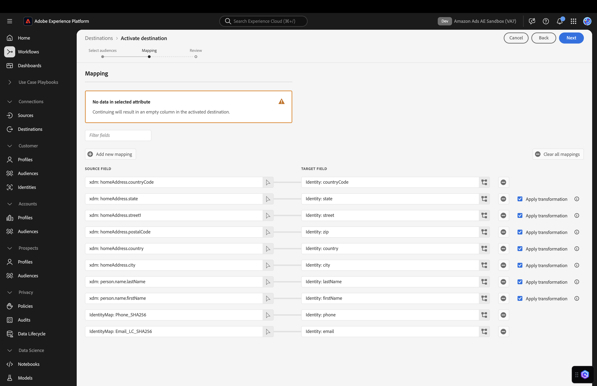

# Amazon Ads 接続 {#amazon-ads}

## 概要 {#overview}

[!DNL Amazon Ads] には、登録販売者、ベンダー、書籍ベンダー、Kindle ダイレクトパブリッシング（KDP）の作成者、アプリ開発者、代理店への広告掲載の目標を達成するのに役立つ様々なオプションが用意されています。

Adobe Experience Platformとの [!DNL Amazon Ads] 統合により、Amazon DSP（ADSP）やAmazon Marketing Cloud（AMC）などの [!DNL Amazon Ads] 製品へのターンキー統合が可能になります。

Adobe Experience Platformで [!DNL Amazon Ads] の宛先を使用すると、ターゲティングとアクティブ化のための広告主オーディエンスをAmazon DSPで定義できます。  さらに、ユーザーは、オーディエンス、広告主が提供したディメンション、Amazon セグメントのメンバーシップ、または AMC で使用可能なその他のシグナルによるパフォーマンスを理解するために、データを [!DNL Amazon Marketing Cloud] にアップロードできます。 広告主オーディエンスを AMC にアップロードした後、[!DNL Amazon Marketing Cloud] を使用して、[!DNL Amazon Marketing Cloud] 内からAmazonのシグナルを使用して、オーディエンスメンバーに対して変更、強化または追加を行うことができます。

AMC は、ディスプレイ、ビデオ、ストリーミング TV、オーディオ、スポンサー付き広告など、Amazonが所有および運営する施設を横断する独自の信号を統合します。 ユーザーは、Adobe Experience Platformから AMC にキュレートされたセグメントを簡単に送信して、オーディエンスの市場内グループ、ライフスタイルコホート、ブランドエンゲージメントパターンなどのラーニングを強化できます。 拡張セグメントを使用すると、Amazon DSPでメディアのアクティベーションを最適化できます。

>[!IMPORTANT]
>
>この宛先コネクタとドキュメントページは、*[!DNL Amazon Ads]* チームが作成および管理します。 お問い合わせや更新のリクエストについては、*`amc-support@amazon.com`まで直接ご連絡ください。*

## ユースケース {#use-cases}

*[!DNL Amazon Ads]* の宛先を使用する方法とタイミングをより深く理解するために、Adobe Experience Platformのお客様がこの宛先を使用して解決できるユースケースのサンプルを以下に示します。

### アクティブ化とターゲティング {#activation-and-targeting}

このAmazon DSPとの統合により、[!DNL Amazon Ads] 広告主は広告主 CDP オーディエンスをAdobe Experience PlatformからAmazonのDSPに渡して、広告ターゲティング用の広告主オーディエンスを作成できます。 オーディエンスは、Amazon DSP 内でポジティブターゲティングとネガティブターゲティング（抑制）のために選択できます。

### 分析と測定 {#analytics-and-measurement}

この [!DNL Amazon Marketing Cloud] （AMC）との統合により、[!DNL Amazon Ads] の広告主は CDP セグメントをAdobe Experience Platform フォームから AMC に渡すことができます。 その後、広告主は CDP の入力を [!DNL Amazon Ads] のシグナルで結合し、メディアへの影響、オーディエンスセグメント、プライバシーに準拠した形式のカスタマージャーニーなどのトピックに関してカスタム分析を実行できます。 例えば、広告主は、既存の顧客のリストをアップロードして、広告キャンペーンのパフォーマンスの集計や、オンAmazonのコンバージョンイベントの集計統計（商品の詳細ページの表示、買い物かごへの商品の追加、商品の購入など）を把握できます。

### Advertisingの最適化

この [!DNL Amazon Marketing Cloud] （AMC）との統合により、広告主は、独自の顧客リストをアップロードし、[!DNL Amazon Marketing Cloud] SQL を使用して、オーディエンスに対して重複分析、抑制、追加または最適化を繰り返し実行してから、Amazon DSPでターゲティング用のアクティブ化に対応したオーディエンスを作成できます。

## 前提条件 {#prerequisites}

Adobe Experience Platformで [!DNL Amazon Ads] 接続を使用するには、まずAmazon DSP広告主アカウントまたは [!DNL Amazon Marketing Cloud] インスタンスにアクセスできる必要があります。 これらのインスタンスをプロビジョニングするには、[!DNL Amazon Ads] web サイトの次のページにアクセスします。

* [Amazon DSP - デマンドサイドプラットフォームで広告を始める](https://advertising.amazon.com/solutions/products/amazon-dsp)
* [Amazon Marketing Cloudの概要 ](https://advertising.amazon.com/solutions/products/amazon-marketing-cloud)

## サポートされている ID {#supported-identities}

*[!DNL Amazon Ads]* 接続では、以下の表で説明する ID のアクティブ化をサポートしています。 ID の詳細は[こちら](/help/identity-service//features/namespaces.md)から。[!DNL Amazon Ads] でサポートされている ID について詳しくは、[Amazon DSP サポートセンター ](https://advertising.amazon.com/dsp/help/ss/en/audiences#GA6BC9BW52YFXBNE) を参照してください。

| ターゲット ID | 説明 | 注意点 |
|---|---|---|
| phone_sha256 | SHA256 アルゴリズムでハッシュ化された電話番号 | Adobe Experience Platform では、プレーンテキストと SHA256 でハッシュ化された電話番号の両方がサポートされています。ハッシュ化されていない属性がソースフィールドに含まれている場合は、「**[!UICONTROL 変換を適用]**」オプションをオンにして、アクティブ化時に [!DNL Experience Platform] がデータを自動的にハッシュ化するように設定します。 |
| email_lc_sha256 | SHA256 アルゴリズムでハッシュ化されたメールアドレス | Adobe Experience Platform では、プレーンテキストと SHA256 でハッシュ化されたメールアドレスの両方がサポートされています。ハッシュ化されていない属性がソースフィールドに含まれている場合は、「**[!UICONTROL 変換を適用]**」オプションをオンにして、アクティブ化時に [!DNL Experience Platform] がデータを自動的にハッシュ化するように設定します。 |
| `firstName` | ユーザーの名 | プレーンテキストまたは SHA256 をサポートします。 プレーンテキストを使用する場合は、Adobe UI で「[!UICONTROL  変換を適用 ]」を有効にします。 |
| `lastName` | ユーザーの姓 | プレーンテキストまたは SHA256 をサポートします。 プレーンテキストを使用する場合は、Adobe UI で「[!UICONTROL  変換を適用 ]」を有効にします。 |
| `street` | ユーザーの住所（番地） | SHA256 ハッシュ化された入力のみがサポートされます。 ハッシュ前に正規化します。 Adobe側の変換を有効に **ない** ください。 |
| `city` | ユーザーの都市 | プレーンテキストまたは SHA256 をサポートします。 プレーンテキストを使用する場合は、Adobe UI で「[!UICONTROL  変換を適用 ]」を有効にします。 |
| `state` | ユーザーの都道府県 | プレーンテキストまたは SHA256 をサポートします。 プレーンテキストを使用する場合は、Adobe UI で「[!UICONTROL  変換を適用 ]」を有効にします。 |
| `zip` | ユーザーの郵便番号 | プレーンテキストまたは SHA256 をサポートします。 プレーンテキストを使用する場合は、Adobe UI で「[!UICONTROL  変換を適用 ]」を有効にします。 |
| `country` | ユーザーの国 | プレーンテキストまたは SHA256 をサポートします。 プレーンテキストを使用する場合は、Adobe UI で「[!UICONTROL  変換を適用 ]」を有効にします。 |

{style="table-layout:auto"}

## 書き出しのタイプと頻度 {#export-type-frequency}

宛先の書き出しのタイプと頻度について詳しくは、以下の表を参照してください。

| 項目 | タイプ | メモ |
| ---------|----------|---------|
| 書き出しタイプ | **[!UICONTROL オーディエンスの書き出し]** | *[!DNL Amazon Ads]* 宛先で使用される識別子（氏名、電話番号など）を使用して、オーディエンスのすべてのメンバーを書き出します。 |
| 書き出し頻度 | **[!UICONTROL ストリーミング]** | ストリーミングの宛先は常に、API ベースの接続です。オーディエンス評価に基づいて Experience Platform 内でプロファイルが更新されるとすぐに、コネクタは更新を宛先プラットフォームに送信します。詳しくは、[ストリーミングの宛先](/help/destinations/destination-types.md#streaming-destinations)を参照してください。 |

{style="table-layout:auto"}

## 宛先への接続 {#connect}

>[!IMPORTANT]
> 
>宛先に接続するには、**[!UICONTROL 宛先の表示]** および **[!UICONTROL 宛先の管理]**[ アクセス制御権限 ](/help/access-control/home.md#permissions) が必要です。 詳しくは、[アクセス制御の概要](/help/access-control/ui/overview.md)または製品管理者に問い合わせて、必要な権限を取得してください。

この宛先に接続するには、[宛先設定のチュートリアル](../../ui/connect-destination.md)の手順に従ってください。宛先の設定ワークフローで、以下の 2 つのセクションにリストされているフィールドに入力します。

### 宛先に対する認証 {#authenticate}

宛先に対して認証するには、必須フィールドに入力し、「**[!UICONTROL 宛先に接続]**」を選択します。

[!DNL Amazon Ads] 接続インターフェイスに移動するので、まず接続先の広告主アカウントを選択します。 接続すると、選択した広告主アカウントの ID が付与された新しい接続で Adobe Experience Platform にリダイレクトされます。宛先の設定画面で適切な広告主アカウントを選択して続行します。

### 宛先の詳細を入力 {#destination-details}

宛先の詳細を設定するには、以下の必須フィールドとオプションフィールドに入力します。UI のフィールドの横のアスタリスクは、そのフィールドが必須であることを示します。

* **[!UICONTROL 名前]**：今後この宛先を認識するための名前。
* **[!UICONTROL 説明]**：今後この宛先を識別するのに役立つ説明。
* **[!UICONTROL Amazon Ads Connection]**：宛先に使用するターゲット [!DNL Amazon Ads] アカウントの ID を選択します。

>[!NOTE]
>
>宛先設定を保存すると、Amazon アカウントを通じて再認証した場合でも、[!DNL Amazon Ads] 広告主 ID を変更できなくなります。 別の [!DNL Amazon Ads] 広告主 ID を使用するには、新しい宛先接続を作成する必要があります。 ADSP との統合に既に設定されていて、オーディエンスを AMC または別の ADSP アカウントに配信する場合は、新しい宛先フローを作成する必要がある広告主。

* **[!UICONTROL 広告主地域]**：広告主がホストされている適切な地域を選択します。各地域でサポートされているマーケットプレイスについて詳しくは、[Amazon Ads ドキュメント](https://advertising.amazon.com/API/docs/en-us/info/api-overview#api-endpoints)を参照してください。

* **[!UICONTROL Amazon Ads 同意シグナル]**：この接続を通じて送信されたすべてのデータが、広告目的で個人データを使用することに同意していることを確認します。 「許可」とは、Amazonが顧客の個人情報を広告に使用することに同意することを示します。 指定できる値は、「GRANTED」と「DENIED」です。 「拒否」に設定されたコネクションを介して送信されたレコードは、Amazon Ads 内での使用を目的として拒否されます。

### アラートの有効化 {#enable-alerts}

アラートを有効にすると、宛先へのデータフローのステータスに関する通知を受け取ることができます。リストからアラートを選択して、データフローのステータスに関する通知を受け取るよう登録します。アラートについて詳しくは、[UI を使用した宛先アラートの購読](../../ui/alerts.md)についてのガイドを参照してください。

宛先接続の詳細の入力を終えたら「**[!UICONTROL 次へ]**」を選択します。

## この宛先に対してオーディエンスをアクティブ化 {#activate}

>[!IMPORTANT]
> 
>* データをアクティブ化するには、**[!UICONTROL 宛先の表示]**、**[!UICONTROL 宛先のアクティブ化]**、**[!UICONTROL プロファイルの表示]** および **[!UICONTROL セグメントの表示]**[ アクセス制御権限 ](/help/access-control/home.md#permissions) が必要です。 [アクセス制御の概要](/help/access-control/ui/overview.md)を参照するか、製品管理者に問い合わせて必要な権限を取得してください。
>* *ID* を書き出すには、**[!UICONTROL ID グラフの表示]**[ アクセス制御権限 ](/help/access-control/home.md#permissions) が必要です。  {width="100" zoomable="yes"}

この宛先にオーディエンスをアクティベートする手順は、[ストリーミングオーディエンスの書き出し宛先へのプロファイルとオーディエンスのアクティベート](/help/destinations/ui/activate-segment-streaming-destinations.md)を参照してください。

### 属性と ID のマッピング {#map}

[!DNL Amazon Ads] 接続では、ID 照合のために、ハッシュ化されたメールアドレスとハッシュ化された電話番号をサポートしています。 以下のスクリーンショットは、[!DNL Amazon Ads] 接続と互換性のある照合の例を示しています。

* ハッシュ化されたメールアドレスをマッピングするには、`Email_LC_SHA256` ID 名前空間をソースフィールドとして選択します。
* ハッシュ化された電話番号をマッピングするには、`Phone_SHA256` ID 名前空間をソースフィールドとして選択します。
* ハッシュ化されていないメールアドレスまたは電話番号をマッピングするには、対応する ID 名前空間をソースフィールドとして選択し、「`Apply Transformation`」オプションをオンにして、アクティブ化時にExperience Platformで ID をハッシュ化するように設定します。
* *2024 年 9 月リリース以降の新機能*:Amazon Ads では、ID 解決プロセスを容易にするために、`countryCode` 値を含むフィールドを 2 文字の ISO 形式（例：US、GB、MX、CA など）でマッピングする必要があります。 `countryCode` マッピングを持たない接続は、ID 一致率に悪影響を与えます。

>[!NOTE]
>
>これらのフィールドを使用するには：
> 
>* すべての ID 値は、取り込み前に正規化する必要があります。 [ 正規化ガイド ](https://advertising.amazon.com/help/GCCXMZYCK4RXWS6C) を参照してください。
>* SHA256 ハッシュは、クライアント側で、またはAdobeの変換設定を有効にすることで必要になります。
>* Adobe UI には、コネクタの設定時に ID フィールドごとに変換を適用するためのチェックボックスが用意されています。

[!DNL Amazon Ads] コネクタの宛先設定では、特定のターゲットフィールドを 1 回だけ選択します。  例えば、ビジネスメールを送信する場合、個人のメールを同じ宛先設定にマッピングすることはできません。

使用できる限りのフィールドをマッピングすることを強くお勧めします。使用可能なソース属性が 1 つしかない場合は、1 つのフィールドだけをマッピングできます。[!DNL Amazon Ads] の宛先では、マッピングされたすべてのフィールドをマッピング目的で使用し、より多くのフィールドを指定するほどマッチ率が高くなります。 使用できる識別子について詳しくは、[Amazon Ads のハッシュ化されたオーディエンスのヘルプページ](https://advertising.amazon.com/dsp/help/ss/en/audiences#GA6BC9BW52YFXBNE)を参照してください。

## 書き出されたデータ／データ書き出しの検証 {#exported-data}

オーディエンスがアップロードされたら、オーディエンスが正しく作成およびアップロードされたことを次の手順に従って検証できます。

**Amazon DSP の場合**

**[!UICONTROL 広告主 ID]**/**[!UICONTROL オーディエンス]**/**[!UICONTROL 広告主オーディエンス]** に移動します。 オーディエンスが正常に作成され、オーディエンスメンバーの最小数を満たしている場合は、`Active` のステータスが表示されます。オーディエンスのサイズとリーチについて詳しくは、Amazon DSP ユーザーインターフェイスの右側にある予測リーチパネルを参照してください。

**[!DNL Amazon Marketing Cloud]** 用

左側のスキーマブラウザーで、**[!UICONTROL Advertiser Uploaded]**/**[!UICONTROL aep_audiences]** の下にオーディエンスを見つけます。 その後、次の句を使用して AMC SQL エディターでオーディエンスに対してクエリを実行します。

`select count(user_id) from adobeexperienceplatf_audience_view_000xyz where external_audience_segment_name = '1234567'`

## データの使用とガバナンス {#data-usage-governance}

[!DNL Adobe Experience Platform] のすべての宛先は、データを処理する際のデータ使用ポリシーに準拠しています。[!DNL Adobe Experience Platform] がどのように データガバナンスを実施するかについて詳しくは、[データガバナンスの概要](/help/data-governance/home.md)を参照してください。

## その他のリソース {#additional-resources}

その他のヘルプドキュメントについては、次の [!DNL Amazon Ads] ヘルプリソースを参照してください。

* [Amazon DSP ヘルプセンター](https://www.amazon.com/ap/signin?openid.pape.max_auth_age=28800&openid.return_to=https%3A%2F%2Fadvertising.amazon.com%2Fdsp%2Fhelp%2Fss%2Fen%2Faudiences&openid.identity=http%3A%2F%2Fspecs.openid.net%2Fauth%2F2.0%2Fidentifier_select&openid.assoc_handle=amzn_bt_desktop_us&openid.mode=checkid_setup&openid.claimed_id=http%3A%2F%2Fspecs.openid.net%2Fauth%2F2.0%2Fidentifier_select&openid.ns=http%3A%2F%2Fspecs.openid.net%2Fauth%2F2.0)

## 変更ログ {#changelog}

この節では、この宛先コネクタに対する機能の概要と重要なドキュメントの更新について説明します。

+++ 変更ログを表示

| リリース月 | 更新タイプ | 説明 |
|---|---|---|
| 2025年10月 | 追加の ID フィールドへのサポートの追加 | `firstName`、`lastName`、`street`、`city`、`state`、`zip`、`country` など、個人の識別子に対するサポートを追加しました。 これらのフィールドをマッピングすると、オーディエンスの一致率を向上させることができます。 |
| 2025年2月 | データフローを書き出し、宛先をベータ版から一般公開に昇格するための **[!UICONTROL 0}Amazon広告の同意シグナル } を追加する要件が追加されました。]** |
| 2024年5月 | 機能とドキュメントの更新 | パラメーターをAmazon Ads に書き出 `countryCode` マッピングオプションを追加しました。 `countryCode` マッピング手順 [ で ](#map) を使用して、Amazonでの ID 一致率を改善します。 |
| 2024年3月 | 機能とドキュメントの更新 | [!DNL Amazon Marketing Cloud] （AMC）で使用するオーディエンスを書き出すオプションを追加しました。 |
| 2023年5月 | 機能とドキュメントの更新 | <ul><li>[宛先接続ワークフロー](#destination-details)での広告主地域選択のサポートを追加しました。</li><li>広告主地域の選択の追加を反映するようにドキュメントを更新しました。正しい広告主地域選択について詳しくは、[Amazon ドキュメント](https://advertising.amazon.com/API/docs/en-us/info/api-overview#api-endpoints)を参照してください。</li></ul> |
| 2023年3月 | 初回リリース | 宛先の初回リリースとドキュメントを公開しました。 |

{style="table-layout:auto"}

+++
