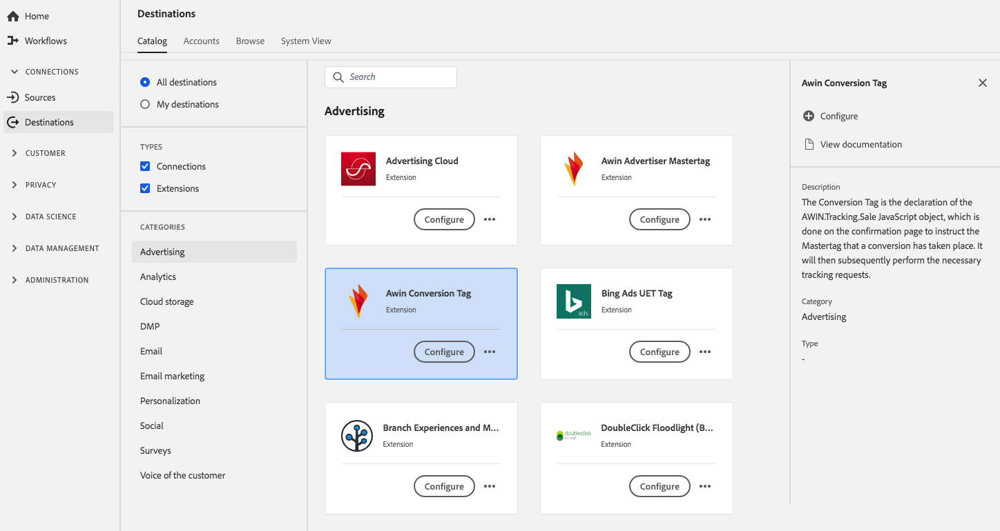

# Awin Advertiser Conversion Tag 拡張機能 {#awin-conversiontag-extension}

## 概要 {#overview}

コンバージョンタグは、AWIN.Tracking.Sale JavaScript オブジェクトの宣言です。この宣言は、確認ページで実行され、コンバージョンがおこなわれたことをマスタータグに指示します。その後、必要なトラッキングリクエストが実行されます。

Awin Advertiser Conversion Tagは、[!DNL Adobe Experience Platform]の広告拡張機能です。 拡張機能について詳しくは、[Adobe Exchange](https://exchange.adobe.com/experiencecloud.details.103240.awin-conversion-tag.html) の拡張機能のページを参照してください。

この宛先はタグ拡張機能です。 Experience Platformでのタグ拡張機能の仕組みについて詳しくは、[&#x200B; タグ拡張機能の概要](../launch-extensions/overview.md)を参照してください。

## 前提条件 {#prerequisites}

この拡張機能は、Experience Platformを購入したすべてのユーザーの宛先カタログで利用できます。

この拡張機能を使用するには、Experience Platformのタグにアクセスする必要があります。 タグは、含まれている付加価値機能として[!DNL Adobe Experience Cloud]のお客様に提供されます。 組織の管理者に連絡して、UIのデータ収集機能にアクセスし、拡張機能をインストールできるように&#x200B;**[!UICONTROL manage_properties]**&#x200B;権限を付与するように依頼してください。

## 拡張機能のインストール {#install-extension}

[!DNL Awin Advertiser Conversion Tag] 拡張機能をインストールします。

[Experience Platform インターフェイス &#x200B;](https://platform.adobe.com/)で、**[!UICONTROL Destinations]** > **[!UICONTROL Catalog]**&#x200B;に移動します。

カタログから拡張機能を選択するか、検索バーを使用します。

宛先を選択し、右側のパネルで「**[!UICONTROL Configure]**」を選択します。 **[!UICONTROL Configure]** コントロールがグレー表示されている場合、**[!UICONTROL manage_properties]**&#x200B;権限がありません。 [前提条件](#prerequisites)を確認してください。

拡張機能をインストールするタグプロパティを選択します。 また、新しいプロパティを作成するオプションもあります。プロパティは、ルール、データ要素、設定された拡張機能、環境およびライブラリの集まりです。プロパティについて詳しくは、[&#x200B; タグのドキュメント &#x200B;](../../../tags/ui/administration/companies-and-properties.md)を参照してください。

このワークフローでは、データ収集UIに移動して、インストールを完了します。

拡張機能の設定オプションとインストールのサポートについて詳しくは、「[Adobe Exchange の Awin Advertiser コンバージョンタグページ](https://exchange.adobe.com/experiencecloud.details.103240.awin-conversion-tag.html)」を参照してください。

拡張機能は、[データ収集 UI](https://experience.adobe.com/#/data-collection/) で直接インストールできます。詳しくは、[新しい拡張機能の追加](../../../tags/ui/managing-resources/extensions/overview.md#add-a-new-extension)に関するガイドを参照してください。

## 拡張機能の使用方法 {#how-to-use}

拡張機能をインストールしたら、ルールの設定を開始できます。 データ収集UIでは、特定の状況でのみ拡張機能の宛先にイベントデータを送信するように、インストール済みの拡張機能のルールを設定できます。 拡張機能のルールの設定について詳しくは、タグのドキュメントの[&#x200B; ルール &#x200B;](../../../tags/ui/managing-resources/rules.md)の概要を参照してください。

## 拡張機能の設定、アップグレード、削除 {#configure-upgrade-delete}

データ収集 UI で、拡張機能の設定、アップグレードおよび削除を行うことができます。

>[!TIP]
>
>拡張機能が既にいずれかのプロパティにインストールされている場合でも、UIには拡張機能の&#x200B;**[!UICONTROL Install]**&#x200B;が表示されます。 [拡張機能のインストール](#install-extension)の説明に従ってインストールワークフローを開始し、拡張機能を設定または削除します。

拡張機能をアップグレードするには、[拡張機能のアップグレードプロセス](../../../tags/ui/managing-resources/extensions/extension-upgrade.md) （タグドキュメント）のガイドを参照してください。
