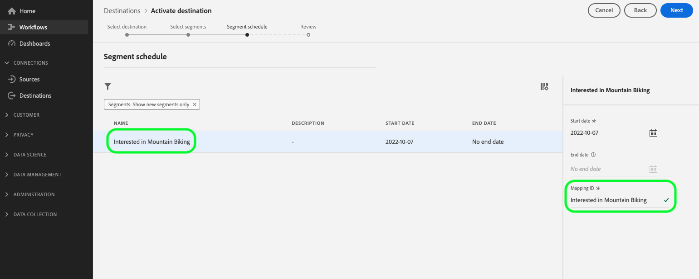

# [!DNL Microsoft Bing] 接続 {#bing-destination}

## 概要 {#overview}

[!DNL Microsoft Bing]宛先を使用して、[!DNL Microsoft Advertising Network]、[!DNL Display Advertising]、[!DNL Search]を含む[!DNL Native]全体にプロファイルデータを送信します。

[!DNL Microsoft Bing]の宛先は、Microsoftに&#x200B;*[!DNL Custom Audiences]*&#x200B;を作成します。 これらは、[!DNL Microsoft Search Network]Microsoft Advertising ドキュメント [!DNL Audience Network]に記載されている[!DNL Native]および[!DNL Display] （[!DNL Programmatic] /[&#x200B; /](https://help.ads.microsoft.com/#apex/ads/en/56892/1-500)）の両方で使用できます。

プロファイルデータを[!DNL Microsoft Bing]に送信するには、まず宛先に接続する必要があります。

## ユースケース {#use-cases}

マーケターとして、[!DNL Microsoft Advertising IDs]から構築されたオーディエンスを使用して、[!DNL Microsoft Advertising] チャネルにわたるディスプレイ広告や検索広告でユーザーをターゲティングできるようにしたいと考えています。

## サポートされている ID {#supported-identities}

[!DNL Microsoft Bing]は、次の表に示すIDに基づいてオーディエンスをアクティブ化することをサポートしています。 [ID](/help/identity-service/features/namespaces.md) についての詳細情報。

以下の表のすべてのIDは、アクティベーション時に事前設定され、自動的にマッピングされます。 これらのマッピングを手動で設定する必要はありません。

| ID | 説明 | 注意点 |
|---|---|---|
| MAID | MICROSOFT ADVERTISING ID | Microsoft Advertising IDがプロファイルに存在する場合にアクティブ化されます。 |
| ECID | Experience Cloud ID | **必須。**&#x200B;すべてのプロファイルには、エクスポートする対応するMicrosoft Advertising ID マッピングを含むECIDが必要です。 |

{style="table-layout:auto"}

## サポートされるオーディエンス {#supported-audiences}

この節では、この宛先に書き出すことができるオーディエンスのタイプについて説明します。

| オーディエンスの由来 | サポートあり | 説明 |
|---------|----------|----------|
| [!DNL Segmentation Service] | ○ | Experience Platform [&#x200B; セグメント化サービス &#x200B;](../../../segmentation/home.md)を通じて生成されたオーディエンス。 |
| その他すべてのオーディエンスの生成元 | ○ | このカテゴリには、[!DNL Segmentation Service]を通じて生成されたオーディエンス以外のすべてのオーディエンスのオリジンが含まれます。 [様々なオーディエンスの起源](/help/segmentation/ui/audience-portal.md#customize)について読みます。 次に例を示します。 <ul><li> カスタムアップロードオーディエンス [がCSV ファイルからExperience Platformに](../../../segmentation/ui/audience-portal.md#import-audience)をインポートしました。</li><li> 類似オーディエンス， </li><li> 連合オーディエンス， </li><li> [!DNL Adobe Journey Optimizer]などの他のExperience Platform アプリで生成されたオーディエンス </li><li> その他。 </li></ul> |

{style="table-layout:auto"}

オーディエンスのデータタイプ別にサポートされるオーディエンス：

| オーディエンスのデータタイプ | サポートあり | 説明 | ユースケース |
|--------------------|-----------|-------------|-----------|
| [人物オーディエンス &#x200B;](/help/segmentation/types/people-audiences.md) | ○ | 顧客プロファイルにもとづいて、マーケティング施策の特定のグループをターゲットにすることができます。 | 買い物客やカートの放棄が多い |
| [&#x200B; アカウントオーディエンス &#x200B;](/help/segmentation/types/account-audiences.md) | × | アカウントベースドマーケティング戦略のために、特定の組織内の個人をターゲットにします。 | B2B マーケティング |
| [見込みオーディエンス &#x200B;](/help/segmentation/types/prospect-audiences.md) | × | まだ顧客ではないが、ターゲットオーディエンスと特徴を共有する個人をターゲットにします。 | サードパーティデータによる見込み顧客の開拓 |
| [&#x200B; データセットの書き出し](/help/catalog/datasets/overview.md) | × | [!DNL Adobe Experience Platform] データ レイクに保存されている構造化データのコレクション。 | レポート，データサイエンスワークフロー |

{style="table-layout:auto"}

## 書き出しのタイプと頻度 {#export-type-frequency}

**[!DNL Audience Export]** - オーディエンスのすべてのメンバーを[!DNL Microsoft Bing]宛先に書き出しています。

宛先の書き出しのタイプと頻度について詳しくは、以下の表を参照してください。

| 項目 | タイプ | メモ |
|---------|----------|---------|
| 書き出しタイプ | **[!UICONTROL Audience export]** | オーディエンスのすべてのメンバーを[!DNL Microsoft Bing]宛先に書き出しています。 |
| 書き出し頻度 | **[!UICONTROL Streaming]** | ストリーミングの宛先は常に、API ベースの接続です。オーディエンス評価に基づいて Experience Platform 内でプロファイルが更新されるとすぐに、コネクタは更新を宛先プラットフォームに送信します。[ストリーミングの宛先](/help/destinations/destination-types.md#streaming-destinations)の詳細についてはこちらを参照してください。 |

{style="table-layout:auto"}

## 前提条件 {#prerequisites}

[!DNL Microsoft Bing]の宛先を正しく機能させるには、次の設定が必要です：

1. **ID同期機能を有効にする**：これが初めて[!DNL Microsoft Bing]のアクティベーションを設定する場合で、過去に（Adobe Audience Managerまたはその他のアプリケーションで）Experience Cloud ID サービスで[ID同期機能](https://experienceleague.adobe.com/docs/id-service/using/id-service-api/methods/idsync.html?lang=ja)を有効にしていない場合は、Adobe Consultingまたはカスタマーケアにお問い合わせください。
   * 以前にAudience Managerで[!DNL Microsoft Bing]統合を設定した場合、既存のID同期は自動的にExperience Platformに引き継がれます。

2. **プロファイルでECIDを確保**：すべてのプロファイルにECIDが存在する必要があります。ECIDが存在しない場合、正常にエクスポートされます。 この宛先のECIDは&#x200B;**必須**&#x200B;です。

宛先を設定する際には、次の情報を指定する必要があります。

* [!UICONTROL Account ID]：これは[!DNL Bing Ads CID]の整数形式です。

## 宛先への接続 {#connect}

>[!IMPORTANT]
>
>宛先に接続するには、**[!UICONTROL View Destinations]**&#x200B;および&#x200B;**[!UICONTROL Manage Destinations]** [&#x200B; アクセス制御権限](/help/access-control/home.md#permissions)が必要です。 [アクセス制御の概要](/help/access-control/ui/overview.md)を参照するか、製品管理者に問い合わせて必要な権限を取得してください。

この宛先に接続するには、[宛先設定のチュートリアル](../../ui/connect-destination.md)の手順に従ってください。

### 宛先の詳細の入力 {#parameters}

この宛先を[設定](../../ui/connect-destination.md)するとき、次の情報を指定する必要があります。

* **[!UICONTROL Name]**：今後この宛先を認識する際に使用する名前。
* **[!UICONTROL Description]**：今後この宛先を特定するのに役立つ説明です。
* **[!UICONTROL Account ID]**：あなたの[!DNL Bing Ads Customer ID] （CID）。 CIDは整数です。[!DNL Microsoft Advertising]にログインすると、URLに表示されます。

### アラートの有効化 {#enable-alerts}

アラートを有効にすると、宛先へのデータフローのステータスに関する通知を受け取ることができます。リストからアラートを選択して、データフローのステータスに関する通知を受け取るよう登録します。アラートについて詳しくは、[UI を使用した宛先アラートの購読](../../ui/alerts.md)についてのガイドを参照してください。

宛先接続の詳細の提供が完了したら、**[!UICONTROL Next]**&#x200B;を選択します。

## この宛先に対してオーディエンスをアクティブ化 {#activate}

>[!CONTEXTUALHELP]
>id="platform_destinations_bing_mapping_id"
>title="マッピング ID"
>abstract="選択したセグメントをマッピングする、数値の Bing オーディエンス ID を入力します。指定された[!UICONTROL Mapping ID]がBing宛先のオーディエンス IDに対応しない場合、Bing アカウントに期待されるオーディエンスデータは表示されません。"

>[!CONTEXTUALHELP]
>id="platform_destinations_required_mappings_bing"
>title="事前設定済みのマッピングセット"
>abstract="これら 2 つのマッピングセットは、事前に設定されています。 Microsoft Bing に対してデータをアクティブ化する場合、アクティブ化されたオーディエンスに適合するプロファイルが正常に宛先に書き出されるには、少なくともプロファイルに関連付けられた ECID が必要です。"
>additional-url="https://experienceleague.adobe.com/ja/docs/experience-platform/destinations/catalog/advertising/bing#preconfigured-mappings" text="詳しくは、事前設定されたマッピングを参照してください。"

>[!IMPORTANT]
>
>データをアクティブ化するには、**[!UICONTROL View Destinations]**、**[!UICONTROL Activate Destinations]**、**[!UICONTROL View Profiles]**&#x200B;および&#x200B;**[!UICONTROL View Segments]** [&#x200B; アクセス制御権限](/help/access-control/home.md#permissions)が必要です。 [アクセス制御の概要](/help/access-control/ui/overview.md)を参照するか、製品管理者に問い合わせて必要な権限を取得してください。

この宛先にオーディエンスをアクティブ化する手順については、[ストリーミングオーディエンス書き出し宛先に対するオーディエンスデータのアクティブ化](../../ui/activate-segment-streaming-destinations.md)を参照してください。

[&#x200B; オーディエンススケジュール &#x200B;](../../ui/activate-segment-streaming-destinations.md#scheduling)手順では、[!UICONTROL Mapping ID] フィールドにオーディエンス名を手動でマッピングする必要があります。 これにより、オーディエンスのメタデータが正しく[!DNL Bing]に渡されます。

オーディエンス名をBing マッピング IDにマッピングする例を示すオーディエンススケジュール画面を示す

### 事前設定済みマッピング {#preconfigured-mappings}

次のID マッピングは、オーディエンスのアクティブ化ワークフロー中に&#x200B;**事前設定され、自動的に入力されます**。

* **MAID** （Microsoft Advertising ID）
* **ECID** （Experience Cloud ID）

これらのマッピングはグレー表示され、読み取り専用です。 この手順で設定する必要はありません。 続行するには、**[!UICONTROL Next]**&#x200B;を選択してください。

>[!IMPORTANT]
>
>書き出しを成功させるには、**ECIDが必要です。ECIDを持たない、またはECIDとMicrosoft Advertising ID間のID同期マッピングを持たない** プロファイルはエクスポートされません。

### アクティベーションの例 {#activation-examples}

* ECIDとMicrosoft Advertising ID マッピングを持つ&#x200B;**プロファイル：** プロファイルは正常にエクスポートされ、アクティブ化されました
* ECIDのみを持つ&#x200B;**プロファイル （Microsoft Advertising ID マッピングなし）:** プロファイルは&#x200B;**エクスポートされていません**。 ECIDとMAID間のID同期マッピングが必要です。
* ECIDのない&#x200B;**プロファイル：** プロファイルは&#x200B;**エクスポートされていません**。 この宛先にはECIDが必須です。

## 書き出したデータ {#exported-data}

データがに正常に [!DNL Microsoft Bing] の宛先に書き出されたかどうかを確認するには、[!DNL Microsoft Bing Ads] アカウントを確認します。 アクティベーションに成功すると、オーディエンスがお使いのアカウントに入力されます。
