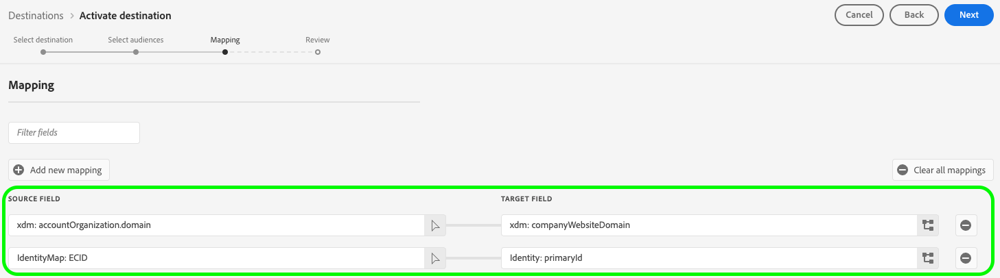

# Bombora ABM オーディエンス接続 {#bombora}

>[!AVAILABILITY]
>
>Real-Time Customer Data Platformの [Business-to-Business](/help/rtcdp/overview.md#rtcdp-b2b) 版と [Business-to-Person](/help/rtcdp/overview.md#rtcdp-b2p) 版を購入する企業は、Bombora ABM オーディエンスの宛先に対してアカウントオーディエンスをアクティブ化する機能を利用できます。

[&#x200B; アカウントオーディエンス &#x200B;](/help/segmentation/types/account-audiences.md) に基づいて、オーディエンスのターゲティング、パーソナライゼーションおよび抑制を行うための、Bombora キャンペーン用のプロファイルをアクティブ化します。

## ユースケース {#use-case}

Bombora の宛先を使用する方法とタイミングをより深く理解するために、Adobe Experience Platformのお客様がこの宛先を使用して解決できるユースケースのサンプルを以下に示します。

### DSPの統合 {#dsp-integration}

B2B マーケターは、Real-time CDP でアカウントリストを作成して、製品に対して高い意図を示す会社を特定し、この宛先を使用して Bombora でこのリストをアクティブ化できます。

Bombora と DSP の統合により、Bombora データを使用してターゲット広告キャンペーンを実行できます。 これにより、コンバージョンの可能性が最も高い企業に広告費用が集中するようになります。

### Account-Based Marketing {#abm}

B2B マーケターは、CRM とマーケティングのシグナルに基づいてアカウントリストを作成できます。 次に、この宛先を使用して、Bombora でこのリストをアクティブ化できます。このリストでは、ABM 対応のコントロールを使用して、これらの会社の意思決定者をターゲットに設定できます。

### マルチチャネルアカウントベースのマーケティングアクティベーション {#multi-channel-abm}

B2B マーケターは、Real-time CDP でアカウントリストを作成して、目的の高い企業を特定できます。 次に、この宛先を使用して、Bombora のリストをアクティブ化し、複数のチャネルでターゲットキャンペーンを実行できます。

有料ソーシャルメディアでは、[!DNL LinkedIn] や [!DNL Facebook] などのプラットフォームのターゲットアカウントで、パーソナライズされた広告を専門家に提供できます。 ネイティブの広告プラットフォームを使用すると、コンテンツが関連する意思決定者に確実に届くようにできます。

また、キャンペーンを高度なテレビに拡張して、主要アカウントに広告を配信することもできます。

このマルチチャネルアプローチにより、プラットフォーム間で一貫したメッセージングが保証され、エンゲージメントとコンバージョン率が最大化されます。

## サポートされるオーディエンス {#supported-audiences}

この節では、この宛先に書き出すことができるオーディエンスのタイプについて説明します。

| オーディエンスオリジン | サポートあり | 説明 |
|---------|----------|----------|
| [!DNL Segmentation Service] | ○ | Experience Platform [&#x200B; セグメント化サービス &#x200B;](../../../segmentation/home.md) を通じて生成されたオーディエンス。 |
| その他すべてのオーディエンスの接触チャネル | ○ | このカテゴリには、[!DNL Segmentation Service] を通じて生成されたオーディエンス以外のすべてのオーディエンスの接触チャネルが含まれます。 [&#x200B; 様々なオーディエンスのオリジン &#x200B;](/help/segmentation/ui/audience-portal.md#customize) について確認する。 次に例を示します。 <ul><li> csv ファイルからExperience Platformへのカスタムアップロードオーディエンス [&#x200B; 読み込み &#x200B;](../../../segmentation/ui/audience-portal.md#import-audience)</li><li> 類似オーディエンス、 </li><li> 連合オーディエンス、 </li><li> Adobe Journey Optimizerなど、他のExperience Platform アプリで生成されたオーディエンス。 </li><li> その他。 </li></ul> |

{style="table-layout:auto"}

オーディエンスデータタイプでサポートされるオーディエンス：

| オーディエンスデータタイプ | サポートあり | 説明 | ユースケース |
|--------------------|-----------|-------------|-----------|
| [&#x200B; 人物オーディエンス &#x200B;](/help/segmentation/types/people-audiences.md) | ○ | 顧客プロファイルに基づき、マーケティングキャンペーンの対象となる人物のグループを指定できます。 | 頻繁な購入、買い物かごの放棄 |
| [&#x200B; アカウントオーディエンス &#x200B;](/help/segmentation/types/account-audiences.md) | × | アカウントベースのマーケティング戦略では、特定の組織内の個人をターゲットに設定します。 | B2B マーケティング |
| [&#x200B; 見込み客オーディエンス &#x200B;](/help/segmentation/types/prospect-audiences.md) | × | まだ顧客ではないものの、ターゲットオーディエンスと特性を共有する個人をターゲットに設定します。 | サードパーティデータを使用した予測 |
| [&#x200B; データセットの書き出し &#x200B;](/help/catalog/datasets/overview.md) | × | Adobe Experience Platform Data Lake に保存された構造化データのコレクション。 | レポート、データサイエンスワークフロー |

{style="table-layout:auto"}

## サポートされている ID {#supported-identities}

Bombora では、以下の表で説明されているターゲット ID のマッピングが必要です。 [ID](/help/identity-service/features/namespaces.md) についての詳細情報。

| ターゲット ID | 説明 |
|---|---|
| `primaryId` | Bombora が正しく機能するには、このターゲット ID のマッピングが必要です。 この ID に任意のソースフィールドをマッピングできます。 このマッピングは必須ですが、Bombora にデータを書き出すものではありません。 |

{style="table-layout:auto"}

## 書き出しのタイプと頻度 {#export-type-and-frequency}

宛先の書き出しのタイプと頻度について詳しくは、以下の表を参照してください。

| 項目 | タイプ | メモ |
|---------|----------|---------|
| 書き出しタイプ | **[!UICONTROL Audience export]** | [!DNL Bombora] 宛先で使用される識別子（氏名、電話番号など）を使用して、オーディエンスのすべてのメンバーを書き出します。 |
| 書き出し頻度 | **[!UICONTROL Streaming]** | ストリーミングの宛先は常に、API ベースの接続です。オーディエンス評価に基づいて Experience Platform 内でプロファイルが更新されるとすぐに、コネクタは更新を宛先プラットフォームに送信します。[ストリーミングの宛先](/help/destinations/destination-types.md#streaming-destinations)の詳細についてはこちらを参照してください。 |

{style="table-layout:auto"}

## 前提条件 {#prerequisites}

アカウントオーディエンスを Bombora に書き出すには、次の情報が必要です。

1. Bombora アカウント。 お持ちでない場合は、[Bombora オーディエンスアクティベーションリクエストフォーム &#x200B;](https://customers.bombora.com/artcdp/audience-activation-request) を使用して Bombora アカウントをリクエストできます。
2. ボンボラの **[!UICONTROL client ID]** と **[!UICONTROL client secret]**。
3. Bombora に送信されるデータは、データセットがプロファイルに含まれるように **プロファイル対応** のデータセットから取得する必要があります。 この宛先に対してオーディエンスをアクティブ化する前に、データセットが [&#x200B; プロファイルに対して有効 &#x200B;](/help/catalog/datasets/enable-for-profile.md) になっていることを確認します。

## 宛先への接続 {#connect}

>[!IMPORTANT]
> 
>宛先に接続するには、**[!UICONTROL View Destinations]** および **[!UICONTROL Manage Destinations]**&#x200B;[&#x200B; アクセス制御権限 &#x200B;](/help/access-control/home.md#permissions) が必要です。 詳しくは、[アクセス制御の概要](/help/access-control/ui/overview.md)または製品管理者に問い合わせて、必要な権限を取得してください。

この宛先に接続するには、[宛先設定のチュートリアル](../../ui/connect-destination.md)の手順に従ってください。宛先の設定ワークフローで、以下の 2 つのセクションにリストされているフィールドに入力します。

### 宛先に対する認証 {#authenticate}

宛先に対する認証を行うには、必須フィールドに入力し、「**[!UICONTROL Connect to destination]**」を選択します。

* **[!UICONTROL Client ID]**:[!DNL Bombora] のクライアント ID を入力します。
* **[!UICONTROL Client secret]**: [!DNL Bombora] クライアントの秘密鍵を入力します。

### 宛先の詳細を入力 {#destination-details}

宛先の詳細を設定するには、以下の必須フィールドとオプションフィールドに入力します。UI のフィールドの横のアスタリスクは、そのフィールドが必須であることを示します。

* **[!UICONTROL Name]**：今後この宛先を認識するための名前。
* **[!UICONTROL Description]**：今後この宛先を識別するのに役立つ説明。

これで、Bombora 内でオーディエンスをアクティブ化する準備が整いました。

## この宛先に対してオーディエンスをアクティブ化 {#activate}

>[!IMPORTANT]
> 
>* データをアクティブ化するには、**[!UICONTROL View Destinations]**、**[!UICONTROL Activate Destinations]**、**[!UICONTROL View Profiles]**、**[!UICONTROL View Segments]** [&#x200B; アクセス制御権限 &#x200B;](/help/access-control/home.md#permissions) が必要です。 [アクセス制御の概要](/help/access-control/ui/overview.md)を参照するか、製品管理者に問い合わせて必要な権限を取得してください。
>* *ID* を書き出すには、**[!UICONTROL View Identity Graph]** [&#x200B; アクセス制御権限 &#x200B;](/help/access-control/home.md#permissions) が必要です。  {width="100" zoomable="yes"}

この宛先にアカウントオーディエンスをアクティブ化する手順については、[&#x200B; アカウントオーディエンスのアクティブ化 &#x200B;](/help/destinations/ui/activate-account-audiences.md) をお読みください。

### 必須のマッピング {#mapping}

Bombora の宛先では、データのアクティベーションを成功させるために、次のマッピングを設定する必要があります。

| ソースフィールド | ターゲットフィールド | 説明 |
|---------|----------|---------|
| 任意の値 | `Identity: primaryId` | このマッピングは、Experience Platformが Bombora との接続を確立するために必須です。 この値は Bombora に書き出されませんが、宛先設定に必要です。 ソースフィールドの任意の属性を選択できます。 |
| `xdm: accountOrganization.domain` | `xdm: companyWebsiteDomain` | Bombora はウェブサイトまたはドメインアドレスを使用してアカウントリストを作成します。 |

## オーディエンス同期動作 {#sync-behavior}

最初のオーディエンスのアクティベーション後、Experience Platformのその後のオーディエンスの更新は、Bombora に増分的に同期されます。 次の動作が適用されます。

* **オーディエンスに追加されたアカウント**：アカウントがExperience Platformのオーディエンスに追加されると、Bombora の対応するオーディエンスに自動的に追加されます。
* **削除されたアカウント、またはアカウントの資格を失ったアカウント**：アカウントがオーディエンスの資格を失ったり、Experience Platformのオーディエンスから削除されたりすると、Bombora の対応するオーディエンスから削除されます。
* **アカウントまたはプロファイルが削除されました**：アカウントまたはプロファイルがExperience Platformから削除され、そのアカウントがオーディエンスの資格を失うと、Bombora の対応するオーディエンスから削除されます。

### オーディエンスの削除と接続解除動作 {#deletion-disconnect}

Experience Platformでオーディエンスを削除したり、Bombora アクティベーションデータフローからオーディエンスを削除したりすると、Bombora アカウントからオーディエンスが削除されます。

## 追加のメモと重要な引き出し {#additional-notes}

同じ名前のアカウントオーディエンスが以前に Bombora に対してアクティブ化された場合、Bombora 宛先への別のデータフローを通じてもう一度有効にしようとすると、エラーが発生します。
