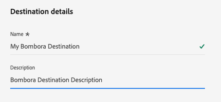
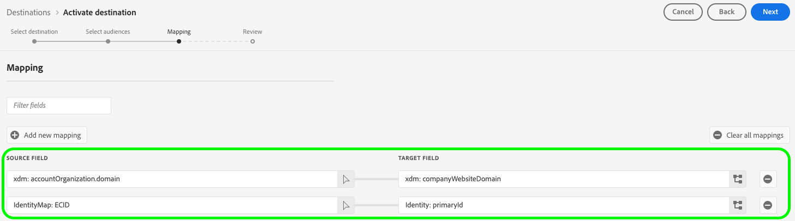

# Bombora ABM オーディエンス接続 {#bombora}

>[!AVAILABILITY]
>
>Bombora ABM Audiences宛先にアカウントオーディエンスをアクティブ化する機能は、[の](/help/rtcdp/overview.md#rtcdp-b2b)Business-to-Business[および](/help/rtcdp/overview.md#rtcdp-b2p)Business-to-Person[!DNL Real-Time Customer Data Platform] エディションを購入する企業で利用できます。

[&#x200B; アカウントオーディエンス &#x200B;](/help/segmentation/types/account-audiences.md)に基づいて、オーディエンスのターゲティング、パーソナライゼーション、抑制のために、Bombora キャンペーンのプロファイルをアクティベートします。

## ユースケース {#use-case}

Bomboraの宛先を使用する方法とタイミングをより深く理解するために、この宛先を使用して[!DNL Adobe Experience Platform]のお客様が解決できるユースケースの例を次に示します。

### DSPとの連携 {#dsp-integration}

B2B マーケターは、Adobe Real-Time CDPでアカウントリストを作成し、製品に高い関心を示している企業を特定し、その宛先を活用してBomboraでこのリストを活用することができます。

BomboraとDSPの統合により、Bomboraのデータを使用してターゲットを絞った広告キャンペーンを実施することができます。 これにより、広告費をコンバージョンに達する可能性が最も高い企業に集中させることができます。

### Account-Based Marketing {#abm}

B2B マーケターは、CRMとマーケティングのシグナルにもとづいてアカウントリストを構築できます。 次に、この宛先を使用してBomboraでこのリストをアクティベートします。ABM対応コントロールは、これらの企業の意思決定者をターゲットにするのに役立ちます。

### マルチチャネルのアカウントベースドマーケティングのアクティベーション {#multi-channel-abm}

B2B マーケターは、Adobe Real-Time CDPでアカウントリストを作成し、購買意欲の高い企業を特定することができます。 次に、この宛先を使用してBomboraでリストをアクティベートし、複数のチャネルでターゲットを絞ったキャンペーンを実行できます。

有料ソーシャルメディアでは、[!DNL LinkedIn]や[!DNL Facebook]などのプラットフォームで、ターゲットアカウントのプロフェッショナルにパーソナライズされた広告を配信することができます。 ネイティブの広告プラットフォームを利用することで、コンテンツを意思決定者に確実に届けることができます。

また、キャンペーンを高度なTVに拡張し、主要なアカウントに広告を配信することもできます。

このマルチチャネルのアプローチにより、プラットフォーム間で一貫したメッセージを確保し、エンゲージメントとコンバージョン率を最大化できます。

## サポートされるオーディエンス {#supported-audiences}

この節では、この宛先に書き出すことができるオーディエンスのタイプについて説明します。

| オーディエンスの由来 | サポートあり | 説明 |
|---------|----------|----------|
| [!DNL Segmentation Service] | ○ | Experience Platform [&#x200B; セグメント化サービス &#x200B;](../../../segmentation/home.md)を通じて生成されたオーディエンス。 |
| その他すべてのオーディエンスの生成元 | ○ | このカテゴリには、[!DNL Segmentation Service]を通じて生成されたオーディエンス以外のすべてのオーディエンスのオリジンが含まれます。 [様々なオーディエンスの起源](/help/segmentation/ui/audience-portal.md#customize)について読みます。 次に例を示します。 <ul><li> カスタムアップロードオーディエンス [がCSV ファイルからExperience Platformに](../../../segmentation/ui/audience-portal.md#import-audience)をインポートしました。</li><li> 類似オーディエンス， </li><li> 連合オーディエンス， </li><li> [!DNL Adobe Journey Optimizer]などの他のExperience Platform アプリで生成されたオーディエンス </li><li> その他。 </li></ul> |

{style="table-layout:auto"}

オーディエンスのデータタイプ別にサポートされるオーディエンス：

| オーディエンスのデータタイプ | サポートあり | 説明 | ユースケース |
|--------------------|-----------|-------------|-----------|
| [人物オーディエンス &#x200B;](/help/segmentation/types/people-audiences.md) | ○ | 顧客プロファイルにもとづいて、マーケティング施策の特定のグループをターゲットにすることができます。 | 買い物客やカートの放棄が多い |
| [&#x200B; アカウントオーディエンス &#x200B;](/help/segmentation/types/account-audiences.md) | × | アカウントベースドマーケティング戦略のために、特定の組織内の個人をターゲットにします。 | B2B マーケティング |
| [見込みオーディエンス &#x200B;](/help/segmentation/types/prospect-audiences.md) | × | まだ顧客ではないが、ターゲットオーディエンスと特徴を共有する個人をターゲットにします。 | サードパーティデータによる見込み顧客の開拓 |
| [&#x200B; データセットの書き出し](/help/catalog/datasets/overview.md) | × | [!DNL Adobe Experience Platform] データ レイクに保存されている構造化データのコレクション。 | レポート，データサイエンスワークフロー |

{style="table-layout:auto"}

## サポートされている ID {#supported-identities}

Bomboraでは、以下の表に記載されているターゲット IDのマッピングが必要です。 [ID](/help/identity-service/features/namespaces.md) についての詳細情報。

| ターゲット ID | 説明 |
|---|---|
| `primaryId` | Bomboraは、統合が正しく機能するために、このターゲット IDのマッピングを必要とします。 任意のソースフィールドをこのIDにマッピングできます。 このマッピングは必須ですが、Bomboraにデータをエクスポートしません。 |

{style="table-layout:auto"}

## 書き出しのタイプと頻度 {#export-type-and-frequency}

宛先の書き出しのタイプと頻度について詳しくは、以下の表を参照してください。

| 項目 | タイプ | メモ |
|---------|----------|---------|
| 書き出しタイプ | **[!UICONTROL Audience export]** | [!DNL Bombora] 宛先で使用される識別子（氏名、電話番号など）を使用して、オーディエンスのすべてのメンバーを書き出します。 |
| 書き出し頻度 | **[!UICONTROL Streaming]** | ストリーミングの宛先は常に、API ベースの接続です。オーディエンス評価に基づいて Experience Platform 内でプロファイルが更新されるとすぐに、コネクタは更新を宛先プラットフォームに送信します。[ストリーミングの宛先](/help/destinations/destination-types.md#streaming-destinations)の詳細についてはこちらを参照してください。 |

{style="table-layout:auto"}

## 前提条件 {#prerequisites}

アカウントオーディエンスをBomboraにエクスポートするには、次の情報が必要です。

1. Bombora アカウント。 お持ちでない場合は、[Bombora オーディエンスのアクティベーション申請フォーム &#x200B;](https://customers.bombora.com/artcdp/audience-activation-request)を使用してBombora アカウントをリクエストできます。
2. ボンボラ **[!UICONTROL client ID]**&#x200B;と&#x200B;**[!UICONTROL client secret]**。
3. Bomboraに送信するデータは、**プロファイル対応**&#x200B;のデータセットから送信する必要があるので、データセットはプロファイルに含まれます。 この宛先に対するオーディエンスをアクティブ化する前に、データセットがプロファイル [に対して](/help/catalog/datasets/enable-for-profile.md)有効になっていることを確認してください。

## 宛先への接続 {#connect}

>[!IMPORTANT]
>
>宛先に接続するには、**[!UICONTROL View Destinations]**&#x200B;および&#x200B;**[!UICONTROL Manage Destinations]** [&#x200B; アクセス制御権限](/help/access-control/home.md#permissions)が必要です。 詳しくは、[アクセス制御の概要](/help/access-control/ui/overview.md)または製品管理者に問い合わせて、必要な権限を取得してください。

この宛先に接続するには、[宛先設定のチュートリアル](../../ui/connect-destination.md)の手順に従ってください。宛先の設定ワークフローで、以下の 2 つのセクションにリストされているフィールドに入力します。

### 宛先に対する認証 {#authenticate}

宛先に対して認証を行うには、必須フィールドに入力し、**[!UICONTROL Connect to destination]**&#x200B;を選択します。

* **[!UICONTROL Client ID]**: [!DNL Bombora] クライアント IDを入力します。
* **[!UICONTROL Client secret]**: [!DNL Bombora] クライアントの秘密鍵を入力します。

### 宛先の詳細を入力 {#destination-details}

宛先の詳細を設定するには、以下の必須フィールドとオプションフィールドに入力します。UI のフィールドの横のアスタリスクは、そのフィールドが必須であることを示します。

* **[!UICONTROL Name]**：今後この宛先を認識する際に使用する名前。
* **[!UICONTROL Description]**：今後この宛先を特定するのに役立つ説明です。

これで、Bombora内のオーディエンスをアクティブ化する準備が整います。

## この宛先に対してオーディエンスをアクティブ化 {#activate}

>[!IMPORTANT]
>
>* データをアクティブ化するには、**[!UICONTROL View Destinations]**、**[!UICONTROL Activate Destinations]**、**[!UICONTROL View Profiles]**&#x200B;および&#x200B;**[!UICONTROL View Segments]** [&#x200B; アクセス制御権限](/help/access-control/home.md#permissions)が必要です。 [アクセス制御の概要](/help/access-control/ui/overview.md)を参照するか、製品管理者に問い合わせて必要な権限を取得してください。
>* *ID*&#x200B;をエクスポートするには、**[!UICONTROL View Identity Graph]** [&#x200B; アクセス制御権限](/help/access-control/home.md#permissions)が必要です。  {width="100" zoomable="yes"}

この宛先に対してアカウントオーディエンスをアクティブ化する手順については、[&#x200B; アカウントオーディエンスをアクティブ化](/help/destinations/ui/activate-account-audiences.md)を参照してください。

### 必須マッピング {#mapping}

Bomboraの宛先では、データのアクティベーションを成功させるために次のマッピングを設定する必要があります。

| ソースフィールド | ターゲットフィールド | 説明 |
|---------|----------|---------|
| 任意の値 | `Identity: primaryId` | このマッピングは、Experience Platformがボンボラとのつながりを確立するために必須です。 この値はBomboraに書き出されませんが、宛先設定に必要です。 ソースフィールドの任意の属性を選択できます。 |
| `xdm: accountOrganization.domain` | `xdm: companyWebsiteDomain` | Bomboraは、アカウントリストの作成にweb サイトまたはドメインのアドレスを使用します。 |

## オーディエンスの同期動作 {#sync-behavior}

最初のオーディエンスのアクティベーション後、Experience Platformのオーディエンスに対するその後の更新は、Bomboraに段階的に同期されます。 次の動作が適用されます。

* **アカウントがオーディエンスに追加されました**: アカウントがExperience Platformのオーディエンスに追加されると、Bomboraの対応するオーディエンスに自動的に追加されます。
* **アカウントが削除されたか、アカウントが資格を失った**：アカウントがオーディエンスに適格でなくなったり、Experience Platformのオーディエンスから削除されたりすると、Bomboraの対応するオーディエンスから削除されます。
* **アカウントまたはプロファイルが削除されました**：アカウントまたはプロファイルがExperience Platformから削除され、そのアカウントがオーディエンスに適格でなくなると、Bomboraの対応するオーディエンスから削除されます。

### オーディエンスの削除と分断の行動 {#deletion-disconnect}

Experience Platformでオーディエンスを削除するか、Bombora アクティベーションデータフローからオーディエンスを削除すると、Bombora アカウントからオーディエンスが削除されます。

## その他のメモと重要なコールアウト {#additional-notes}

同じ名前のアカウントオーディエンスが以前にBomboraに対してアクティベートされた場合、別のデータフローを通じてBomboraの宛先に対して再度アクティベートしようとすると、エラーが表示されます。
