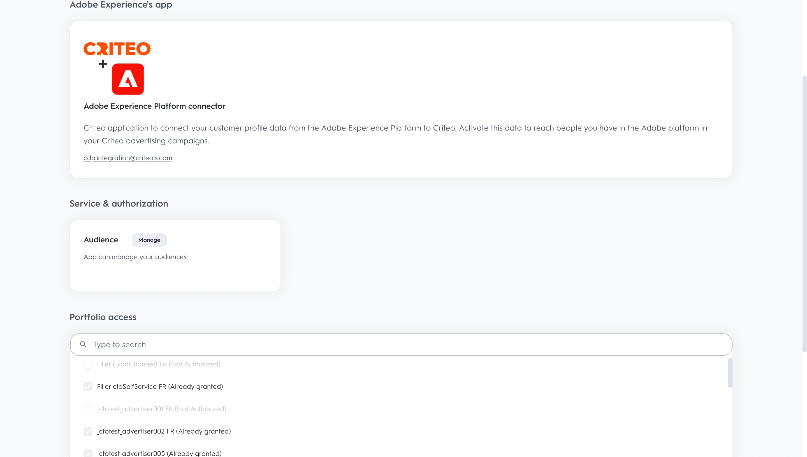

# （ベータ版）Criteo 接続

## 概要 {#overview}

>[!IMPORTANT]
>
>このドキュメントページは Criteo が作成しました。 現在はベータ版の製品であり、機能は変更される場合があります。 お問い合わせや更新のご依頼については、Criteo に直接お問い合わせください [ここ](mailto:criteoTechnicalPartnerships@criteo.com).

Criteo は、信頼できる効果的な広告を提供し、オープンインターネットを介してすべての消費者に豊かなエクスペリエンスを提供します。 世界最大のコマースデータセットとクラス最高の AI を備えた Criteo は、ショッピングジャーニー全体の各タッチポイントをパーソナライズし、適切な広告を適切なタイミングで顧客に届けます。

## 前提条件 {#prerequisites}

* の管理者ユーザーアカウントが必要です [Criteo 管理センター](https://marketing.criteo.com).
* Criteo 広告主 ID が必要です（この ID を持っていない場合は、Criteo の連絡先にお問い合わせください）。
* 次を提供する必要があります： [!DNL GUM caller ID]を使用する場合は、 [!DNL GUM ID] を識別子として使用します。

## 制限事項 {#limitations}

* 条件は次のみを受け入れます [!DNL SHA-256] — ハッシュ化されたテキスト形式の E メール ( 変換後： [!DNL SHA-256] （送信前）。 PII（個人の名前や電話番号など、個人を特定できる情報）は送信しないでください。
* Criteo は、クライアントから提供される識別子を少なくとも 1 つ必要とします。 優先順位付け [!DNL GUM ID] を、ハッシュ化された電子メールを介した識別子として使用することで、一致率が向上します。


## サポートされる ID {#supported-identities}

Criteo では、以下の表で説明する ID のアクティブ化をサポートしています。 詳細情報： [id](https://experienceleague.adobe.com/docs/experience-platform/identity/namespaces.html?lang=ja#getting-started).

| ターゲット ID | 説明 | 注意点 |
| --- | --- | --- |
| `email_sha256` | SHA-256 アルゴリズムでハッシュ化された電子メールアドレス | プレーンテキストと SHA-256 ハッシュ化された電子メールアドレスの両方が、Adobe Experience Platformでサポートされています。 ソースフィールドにハッシュ化されていない属性が含まれている場合は、 [!UICONTROL 変換を適用] オプションを使用し、アクティベーション時に Platform が自動的にデータをハッシュ化する必要があります。 |
| `gum_id` | Criteo [!DNL GUM] cookie 識別子 | [!DNL GUM IDs] 顧客がユーザー識別システムと Criteo のユーザー ID([!DNL UID]) をクリックします。 識別子のタイプが `gum_id`、追加のパラメーター、 [!DNL GUM Caller ID]、も含める必要があります。 該当するについては、Criteo アカウントチームにお問い合わせください [!DNL GUM Caller ID] またはこの詳細を取得 [!DNL GUM ID] 同期（必要に応じて） |

## エクスポートのタイプと頻度 {#export-type-frequency}

宛先の書き出しのタイプと頻度について詳しくは、次の表を参照してください。

| 項目 | タイプ | 備考 |
| --- | --- | --- |
| 書き出しタイプ | セグメントエクスポート | セグメント（オーディエンス）のすべてのメンバーを、 [!DNL Criteo] 宛先。 |
| 書き出し頻度 | ストリーミング | ストリーミングの宛先は、API ベースの接続です。 セグメント評価に基づいてExperience Platform内でプロファイルが更新されるとすぐに、コネクタは更新を宛先プラットフォームに送信します。 詳細を表示 [ストリーミング先](../../destination-types.md#streaming-destinations). |

## ユースケース {#use-cases}

を使用する方法をより深く理解できるように、 [!DNL Criteo] の宛先として、Adobe Experience Platformのお客様が達成できる目標を以下に示します。 [!DNL Criteo]:

### 使用例 1 :トラフィックの取得

関連する製品オファーと柔軟なクリエイティブでビジネスを紹介します。 インテリジェントな製品レコメンデーションを使用すると、広告に、訪問やエンゲージメントをトリガーにする可能性が最も高い製品が自動的に表示されます。 柔軟なターゲティングにより、Criteo のコマースデータセット、または独自の見込み客リストやAdobeCDP セグメントからオーディエンスを構築できます。

### 使用例 2 :Web サイトのコンバージョンの増加

訪問者が Web サイトを離れたときに、特別サービスや関連性の高いオファーを次にどこに行くかで示すことでコンバージョンを増やすリターゲティング広告で何が欠けているかを通知します。 AdobeCDP セグメントを接続して、既存の顧客を再び関与させたり、最も常連の買い物客と同様にターゲット消費者を設定したりします。

## Criteo に接続 {#connect}

>[!IMPORTANT]
> 
>宛先に接続するには、 **[!UICONTROL 宛先の管理]** [アクセス制御権限](/help/access-control/home.md#permissions). 詳しくは、 [アクセス制御の概要](/help/access-control/ui/overview.md) または製品管理者に問い合わせて、必要な権限を取得してください。

この宛先に接続するには、[宛先設定のチュートリアル](../../ui/connect-destination.md)の手順に従ってください。

### Criteo への認証

接続の手順は次のとおりです。

1. Adobe Experience Platformにログインし、Criteo の宛先に接続します。

   

1. 接続を認証するために、Criteo にリダイレクトされます。 最初に Criteo の資格情報を使用してログインする必要が生じる場合があります。

   

   

   


### 接続パラメーター {#connection-parameters}

宛先の認証後、次の接続パラメーターを入力してください。


| フィールド | 説明 | 必須 |
| --- | --- | --- |
| 名前 | 将来この宛先を認識するのに役立つ名前です。 ここで選択する名前は、 [!DNL Audience] Criteo Management Center での名前。後の段階では変更できません。 | ○ |
| 説明 | 将来この宛先を識別するのに役立つ説明。 | × |
| 広告主 ID | 組織の Criteo 広告主 ID。 この情報を入手するには、Criteo のアカウントマネージャーにお問い合わせください。 | ○ |
| Criteo [!DNL GUM caller ID] | [!DNL GUM Caller ID] 組織内の 該当するについては、Criteo アカウントチームにお問い合わせください [!DNL GUM Caller ID] またはこの詳細を取得 [!DNL GUM] 同期（必要に応じて） | はい、いつでも [!DNL GUM ID] は識別子として指定されます |

### アラートの有効化 {#enable-alerts}

アラートを有効にして、宛先へのデータフローのステータスに関する通知を受け取ることができます。 リストからアラートを選択して、データフローのステータスに関する通知を受け取るよう登録します。アラートの詳細については、 [UI を使用した宛先アラートの購読](../../ui/alerts.md).

宛先接続の詳細の指定が完了したら、 **[!UICONTROL 次へ]**.

## この宛先に対してセグメントをアクティブ化 {#activate-segments}

>[!IMPORTANT]
> 
>データをアクティブ化するには、 **[!UICONTROL 宛先の管理]**, **[!UICONTROL 宛先のアクティブ化]**, **[!UICONTROL プロファイルの表示]**、および **[!UICONTROL セグメントを表示]** [アクセス制御権限](/help/access-control/home.md#permissions). 詳しくは、 [アクセス制御の概要](/help/access-control/ui/overview.md) または製品管理者に問い合わせて、必要な権限を取得してください。

読み取り [ストリーミングセグメントの書き出し先に対するプロファイルとセグメントのアクティブ化](../../ui/activate-segment-streaming-destinations.md) を参照してください。

## 書き出したデータ {#exported-data}

書き出されたセグメントは、 [条件管理センター](https://marketing.criteo.com/audience-manager/dashboard).

ユーザープロファイルを追加する要求本文で、 [!DNL Criteo] 接続は次のようになります。

```json
{
  "data": {
    "type": "ContactlistWithUserAttributesAmendment",
    "attributes": {
      "operation": "add",
      "identifierType": "gum",
      "gumCallerId": "123",
      "identifiers": [
        {
          "identifier": "456",
          "attributes": [
            { "key": "ctoid_GumCaller", "value": "123" },
            { "key": "ctoid_Gum", "value": "456" },
            {
              "key": "ctoid_HashedEmail",
              "value": "98833030dc03751f2b2c1a0017078975fdae951aa6908668b3ec422040f2d4be"
            }
          ]
        }
      ]
    }
  }
}
```

で受け取ったユーザープロファイルを削除するリクエスト本文 [!DNL Criteo] 接続は次のようになります。

```json
{
  "data": {
    "type": "ContactlistWithUserAttributesAmendment",
    "attributes": {
      "operation": "remove",
      "identifierType": "gum",
      "gumCallerId": "123",
      "identifiers": [
        {
          "identifier": "456",
          "attributes": [
            { "key": "ctoid_GumCaller", "value": "123" },
            { "key": "ctoid_Gum", "value": "456" },
            {
              "key": "ctoid_HashedEmail",
              "value": "98833030dc03751f2b2c1a0017078975fdae951aa6908668b3ec422040f2d4be"
            }
          ]
        }
      ]
    }
  }
}
```

## データの使用とガバナンス {#data-usage}

すべてのAdobe Experience Platformの宛先は、データの処理時にデータ使用ポリシーに準拠しています。 Adobe Experience Platformによるデータガバナンスの強制方法について詳しくは、 [データガバナンスの概要](https://experienceleague.adobe.com/docs/experience-platform/data-governance/home.html?lang=en).

## その他のリソース

* [Criteo ヘルプセンター](https://help.criteo.com/kb/en)
* [Criteo 開発者ポータル](https://developers.criteo.com)
