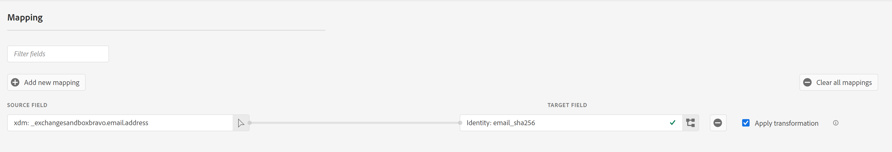
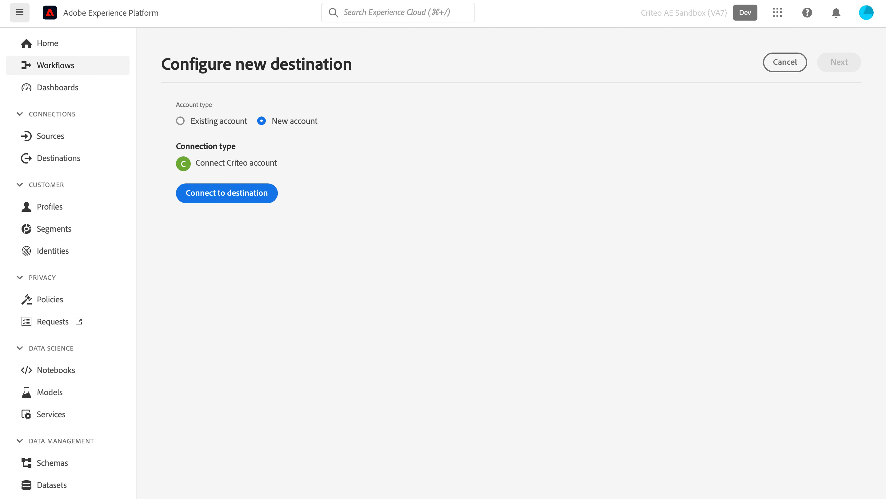
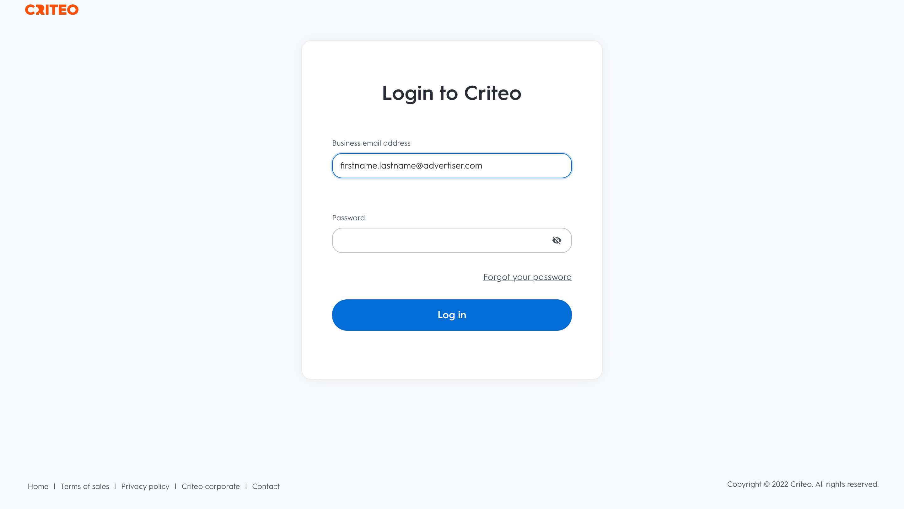
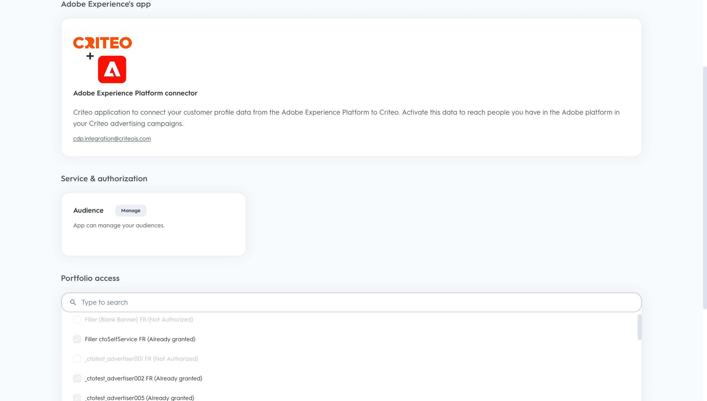
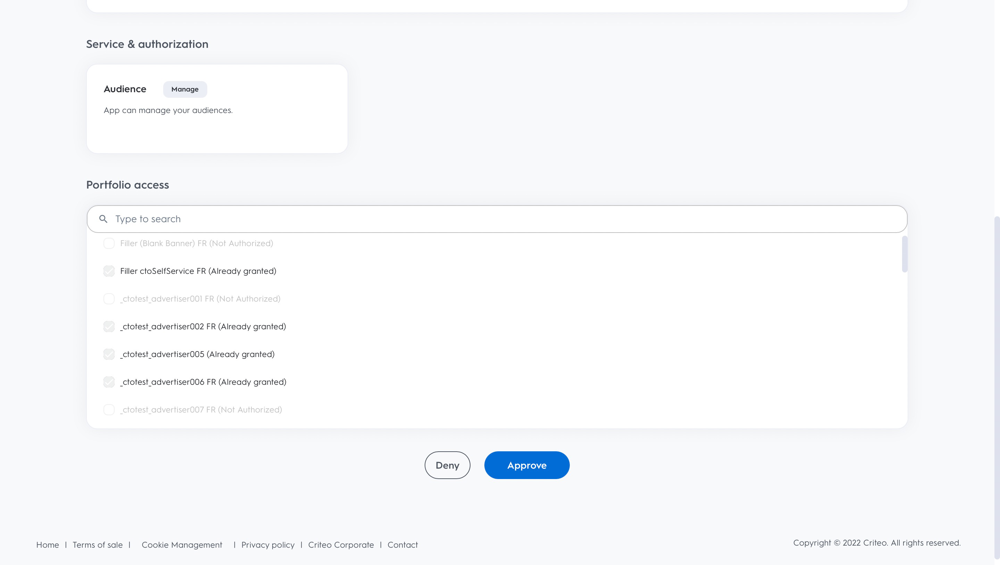
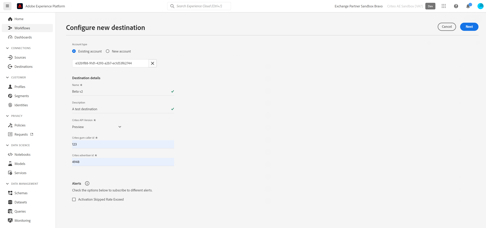

# Criteo接続

## 概要 {#overview}

>[!IMPORTANT]
>
>この宛先コネクタとドキュメントページは、Criteoによって作成および管理されます。 問い合わせやアップデートのリクエストについては、Criteoに直接お問い合わせください[こちら](mailto:criteoTechnicalPartnerships@criteo.com)。

Criteoは、信頼できるインパクトのある広告を通じて、オープンなインターネット上で、すべての消費者により豊かな体験をもたらします。 世界最大のコマースデータセットと業界最高峰のAIを備えたCriteoは、ショッピングジャーニー全体のあらゆる顧客接点をパーソナライズし、適切な広告をタイミングよく顧客に届けることができます。

## 前提条件 {#prerequisites}

* [Criteo Management Center](https://marketing.criteo.com)に管理者ユーザーアカウントが必要です。
* Criteo広告主IDが必要です（このIDをお持ちでない場合は、Criteoにお問い合わせください）。
* [!DNL GUM caller ID]を識別子として使用する場合は、[!DNL GUM ID]を指定する必要があります。

## 制限事項 {#limitations}

* Criteoは、[!DNL SHA-256]個のハッシュ化されたプレーンテキストの電子メールのみを受け付けます（送信する前に[!DNL SHA-256]に変換する必要があります）。 個人情報（個人の氏名や電話番号など）は送らないでください。
* Criteoは、クライアントから提供される識別子を少なくとも1つ必要とします。 マッチング率の向上に貢献するため、ハッシュ化された電子メールよりも[!DNL GUM ID]を識別子として優先します。



## サポートされている ID {#supported-identities}

Criteoは、以下の表に記載されているIDのアクティベーションをサポートしています。 [ID](https://experienceleague.adobe.com/docs/experience-platform/identity/namespaces.html#getting-started) についての詳細情報。

| ターゲット ID | 説明 | 注意点 |
| --- | --- | --- |
| `email_sha256` | SHA-256 アルゴリズムでハッシュ化されたメールアドレス | プレーンテキストとSHA-256 ハッシュ化された電子メールアドレスの両方が[!DNL Adobe Experience Platform]でサポートされています。 ソースフィールドにハッシュ化されていない属性が含まれている場合は、[!UICONTROL Apply transformation] オプションをオンにして、Experience Platformがアクティベーション時にデータを自動的にハッシュします。 |
| `gum_id` | Criteo [!DNL GUM] Cookie ID | [!DNL GUM IDs]では、クライアントがユーザー識別システムとCriteoのユーザー識別（[!DNL UID]）との通信を維持できます。 識別子の種類が`gum_id`の場合は、追加のパラメーター[!DNL GUM Caller ID]も含める必要があります。 適切な[!DNL GUM Caller ID]については、Criteo アカウントチームにお問い合わせいただくか、必要に応じて、この[!DNL GUM ID]同期に関する詳細情報を入手してください。 |

## サポートされるオーディエンス {#supported-audiences}

この節では、この宛先に書き出すことができるオーディエンスのタイプについて説明します。

| オーディエンスの由来 | サポートあり | 説明 |
|---------|----------|----------|
| [!DNL Segmentation Service] | ○ | Experience Platform [ セグメント化サービス ](../../../segmentation/home.md)を通じて生成されたオーディエンス。 |
| その他すべてのオーディエンスの生成元 | × | このカテゴリには、[!DNL Segmentation Service]を通じて生成されたオーディエンス以外のすべてのオーディエンスのオリジンが含まれます。 [様々なオーディエンスの起源](/help/segmentation/ui/audience-portal.md#customize)について読みます。 次に例を示します。 <ul><li> カスタムアップロードオーディエンス [がCSV ファイルからExperience Platformに](../../../segmentation/ui/audience-portal.md#import-audience)をインポートしました。</li><li> 類似オーディエンス， </li><li> 連合オーディエンス， </li><li> [!DNL Adobe Journey Optimizer]などの他のExperience Platform アプリで生成されたオーディエンス </li><li> その他。 </li></ul> |

{style="table-layout:auto"}


オーディエンスのデータタイプ別にサポートされるオーディエンス：

| オーディエンスのデータタイプ | サポートあり | 説明 | ユースケース |
|--------------------|-----------|-------------|-----------|
| [人物オーディエンス ](/help/segmentation/types/people-audiences.md) | ○ | 顧客プロファイルにもとづいて、マーケティング施策の特定のグループをターゲットにすることができます。 | 買い物客やカートの放棄が多い |
| [ アカウントオーディエンス ](/help/segmentation/types/account-audiences.md) | × | アカウントベースドマーケティング戦略のために、特定の組織内の個人をターゲットにします。 | B2B マーケティング |
| [見込みオーディエンス ](/help/segmentation/types/prospect-audiences.md) | × | まだ顧客ではないが、ターゲットオーディエンスと特徴を共有する個人をターゲットにします。 | サードパーティデータによる見込み顧客の開拓 |
| [ データセットの書き出し](/help/catalog/datasets/overview.md) | × | [!DNL Adobe Experience Platform] データ レイクに保存されている構造化データのコレクション。 | レポート，データサイエンスワークフロー |

{style="table-layout:auto"}


## 書き出しのタイプと頻度 {#export-type-frequency}

宛先の書き出しのタイプと頻度について詳しくは、以下の表を参照してください。

| 項目 | タイプ | メモ |
| --- | --- | --- |
| 書き出しタイプ | オーディエンスの書き出し | [!DNL Criteo] 宛先で使用される識別子（氏名、電話番号など）を使用して、オーディエンスのすべてのメンバーを書き出します。 |
| 書き出し頻度 | ストリーミング | ストリーミングの宛先は常に、API ベースの接続です。オーディエンス評価に基づいて Experience Platform 内でプロファイルが更新されるとすぐに、コネクタは更新を宛先プラットフォームに送信します。[ストリーミングの宛先](../../destination-types.md#streaming-destinations)の詳細についてはこちらを参照してください。 |

## ユースケース {#use-cases}

[!DNL Criteo]宛先の使用方法をより深く理解するために、[!DNL Adobe Experience Platform]のお客様が[!DNL Criteo]で達成できる目標を以下に示します。

### ユースケース 1：トラフィックの取得 {#use-case-1}

適切な商品オファーと柔軟なクリエイターでビジネスを紹介します。 インテリジェントな商品レコメンデーション機能を使用すれば、トリガーの訪問やエンゲージメントの可能性が最も高い商品を自動的に提示できます。 柔軟なターゲティングにより、Criteoのコマースデータセットや、自社の見込み客リストおよびAdobe CDP セグメントからオーディエンスを構築することができます。

### ユースケース 2 : web サイトのコンバージョンを向上 {#use-case-2}

訪問者がweb サイトを離れる際には、リターゲティング広告で何を欠いているのかをリマインドし、特別なセールや非常に関連性の高いオファーを次の段階で表示することで、コンバージョンを高めることができます。 Adobe AdobeのCDP オーディエンスを結び付けることで、既存顧客をリエンゲージしたり、優良顧客と類似する消費者をターゲティングしたりできます。

## Criteoに接続 {#connect}

>[!IMPORTANT]
>
>宛先に接続するには、**[!UICONTROL View Destinations]**&#x200B;および&#x200B;**[!UICONTROL Manage Destinations]** [ アクセス制御権限](/help/access-control/home.md#permissions)が必要です。 [アクセス制御の概要](/help/access-control/ui/overview.md)を参照するか、製品管理者に問い合わせて必要な権限を取得してください。

この宛先に接続するには、[宛先設定のチュートリアル](../../ui/connect-destination.md)の手順に従ってください。

### Criteoに認証 {#authenticate}

接続する手順は次のとおりです。

1. [!DNL Adobe Experience Platform]にログインし、Criteoの宛先に接続します。

   

1. 接続を承認するには、Criteoにリダイレクトされます。 最初にCriteoの資格情報でログインする必要がある場合があります。

   

   

   


### 接続パラメーター {#connection-parameters}

宛先に対する認証が完了したら、次の接続パラメーターを入力してください。



| フィールド | 説明 | 必須 |
| --- | --- | --- |
| 名前 | 将来この宛先を認識するのに役立つ名前。 ここで選択した名前は、Criteo Management Centerの[!DNL Audience]名となり、後の段階で変更することはできません。 | ○ |
| 説明 | 今後この宛先を特定するのに役立つ説明です。 | × |
| 広告主 ID | 組織のCriteo広告主ID。 この情報を入手するには、Criteoのアカウントマネージャーにお問い合わせください。 | ○ |
| Criteo [!DNL GUM caller ID] | 組織の[!DNL GUM Caller ID]です。 適切な[!DNL GUM Caller ID]については、Criteo アカウントチームにお問い合わせいただくか、必要に応じて、この[!DNL GUM]同期に関する詳細情報を入手してください。 | はい、[!DNL GUM ID]が識別子として指定されるたびに |

### アラートの有効化 {#enable-alerts}

アラートを有効にすると、宛先へのデータフローのステータスに関する通知を受け取ることができます。リストからアラートを選択して、データフローのステータスに関する通知を受け取るよう登録します。アラートについて詳しくは、[UI を使用した宛先アラートの購読](../../ui/alerts.md)についてのガイドを参照してください。

宛先接続の詳細の提供が完了したら、**[!UICONTROL Next]**&#x200B;を選択します。

## この宛先に対してオーディエンスをアクティブ化 {#activate-segments}

>[!IMPORTANT]
>
>* データをアクティブ化するには、**[!UICONTROL View Destinations]**、**[!UICONTROL Activate Destinations]**、**[!UICONTROL View Profiles]**&#x200B;および&#x200B;**[!UICONTROL View Segments]** [ アクセス制御権限](/help/access-control/home.md#permissions)が必要です。 [アクセス制御の概要](/help/access-control/ui/overview.md)を参照するか、製品管理者に問い合わせて必要な権限を取得してください。
>* *ID*&#x200B;をエクスポートするには、**[!UICONTROL View Identity Graph]** [ アクセス制御権限](/help/access-control/home.md#permissions)が必要です。<br> {width="100" zoomable="yes"}

この宛先にオーディエンスをアクティベートする手順は、[ストリーミングオーディエンスの書き出し宛先へのプロファイルとオーディエンスのアクティベート](../../ui/activate-segment-streaming-destinations.md)を参照してください。

## 書き出したデータ {#exported-data}

書き出されたオーディエンスは、[Criteo管理センター](https://marketing.criteo.com/audience-manager/dashboard)で確認できます。

[!DNL Criteo]接続で受信したユーザープロファイルを追加するリクエスト本文は、次のようになります。

```json
{
  "data": {
    "type": "ContactlistWithUserAttributesAmendment",
    "attributes": {
      "operation": "add",
      "identifierType": "gum",
      "gumCallerId": "123",
      "identifiers": [
        {
          "identifier": "456",
          "attributes": [
            { "key": "ctoid_GumCaller", "value": "123" },
            { "key": "ctoid_Gum", "value": "456" },
            {
              "key": "ctoid_HashedEmail",
              "value": "98833030dc03751f2b2c1a0017078975fdae951aa6908668b3ec422040f2d4be"
            }
          ]
        }
      ]
    }
  }
}
```

[!DNL Criteo]接続で受信したユーザープロファイルを削除するリクエスト本文は、次のようになります。

```json
{
  "data": {
    "type": "ContactlistWithUserAttributesAmendment",
    "attributes": {
      "operation": "remove",
      "identifierType": "gum",
      "gumCallerId": "123",
      "identifiers": [
        {
          "identifier": "456",
          "attributes": [
            { "key": "ctoid_GumCaller", "value": "123" },
            { "key": "ctoid_Gum", "value": "456" },
            {
              "key": "ctoid_HashedEmail",
              "value": "98833030dc03751f2b2c1a0017078975fdae951aa6908668b3ec422040f2d4be"
            }
          ]
        }
      ]
    }
  }
}
```

## データの使用とガバナンス {#data-usage}

[!DNL Adobe Experience Platform] のすべての宛先は、データを処理する際のデータ使用ポリシーに準拠しています。[!DNL Adobe Experience Platform] がどのように データガバナンスを実施するかについて詳しくは、[データガバナンスの概要](https://experienceleague.adobe.com/docs/experience-platform/data-governance/home.html?lang=ja)を参照してください。

## その他のリソース {#additional-resources}

* [Criteo ヘルプセンター](https://help.criteo.com/kb/en)
* [Criteo Developer Portal](https://developers.criteo.com)
