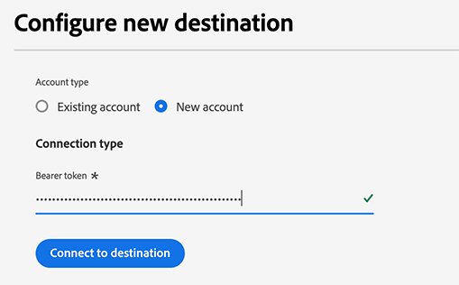
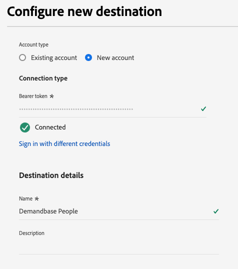

# Demandbase People接続 {#demandbase-people}

オーディエンスのターゲティング、パーソナライゼーション、抑制のために、デマンドベースキャンペーンのプロファイルをアクティベートします。

>[!IMPORTANT]
>
>アカウントオーディエンス [を](../../ui/activate-account-audiences.md) アクティブ化する必要があるB2B ユースケースの場合は、代わりに[Demandbase](demandbase.md)宛先コネクタを使用してください。

## ユースケース {#use-case}

マーケターは、Adobe [!DNL Real-Time CDP]を使用してファーストパーティの連絡先のユーザーリストを作成し、Demandbaseでアクティベートすることで、デマンドサイドプラットフォーム（DSP）やLinkedInなどの他のチャネルをまたいで、エンゲージメントを最適化およびオーケストレーションできます。

このアプローチにより、マーケターは、自社のCRMやマーケティングオートメーションシステムから調達した既知の個人に対してキャンペーン費用の優先順位を付けることができるため、マーケティング活動では価値の高い見込み客に集中することができます。

Demandbaseがアクティブ化されると、広告配信が最適化され、エンゲージメント、リーチ、コンバージョン率を最大化するためにターゲティング戦略が改善され、最終的にキャンペーンの効率が向上します。

## サポートされている ID {#supported-identities}

[!DNL Demandbase People]接続では、次の表に示すIDのアクティブ化がサポートされています。 [ID](/help/identity-service/features/namespaces.md) についての詳細情報。

| ターゲット ID | 説明 | 注意点 |
|---|---|---|
| メール | プレーンテキストのメールアドレス | プレーンテキストの電子メールアドレスのみが[!DNL Demandbase People]接続でサポートされています。 |

{style="table-layout:auto"}

## サポートされるオーディエンス {#supported-audiences}

この節では、この宛先に書き出すことができるオーディエンスのタイプについて説明します。

| オーディエンスの由来 | サポートあり | 説明 |
|---------|----------|----------|
| [!DNL Segmentation Service] | ○ | Experience Platform [&#x200B; セグメント化サービス &#x200B;](../../../segmentation/home.md)を通じて生成されたオーディエンス。 |
| その他すべてのオーディエンスの生成元 | ○ | このカテゴリには、[!DNL Segmentation Service]を通じて生成されたオーディエンス以外のすべてのオーディエンスのオリジンが含まれます。 [様々なオーディエンスの起源](/help/segmentation/ui/audience-portal.md#customize)について読みます。 次に例を示します。 <ul><li> カスタムアップロードオーディエンス [がCSV ファイルからExperience Platformに](../../../segmentation/ui/audience-portal.md#import-audience)をインポートしました。</li><li> 類似オーディエンス， </li><li> 連合オーディエンス， </li><li> [!DNL Adobe Journey Optimizer]などの他のExperience Platform アプリで生成されたオーディエンス </li><li> その他。 </li></ul> |

{style="table-layout:auto"}

オーディエンスのデータタイプ別にサポートされるオーディエンス：

| オーディエンスのデータタイプ | サポートあり | 説明 | ユースケース |
|--------------------|-----------|-------------|-----------|
| [人物オーディエンス &#x200B;](/help/segmentation/types/people-audiences.md) | ○ | 顧客プロファイルにもとづいて、マーケティング施策の特定のグループをターゲットにすることができます。 | 買い物客やカートの放棄が多い |
| [&#x200B; アカウントオーディエンス &#x200B;](/help/segmentation/types/account-audiences.md) | × | アカウントベースドマーケティング戦略のために、特定の組織内の個人をターゲットにします。 | B2B マーケティング |
| [見込みオーディエンス &#x200B;](/help/segmentation/types/prospect-audiences.md) | × | まだ顧客ではないが、ターゲットオーディエンスと特徴を共有する個人をターゲットにします。 | サードパーティデータによる見込み顧客の開拓 |
| [&#x200B; データセットの書き出し](/help/catalog/datasets/overview.md) | × | [!DNL Adobe Experience Platform] データ レイクに保存されている構造化データのコレクション。 | レポート，データサイエンスワークフロー |

{style="table-layout:auto"}

## 書き出しのタイプと頻度 {#export-type-and-frequency}

宛先の書き出しのタイプと頻度について詳しくは、以下の表を参照してください。

| 項目 | タイプ | メモ |
|--------------|-----------|---------------------------|
| 書き出しタイプ | オーディエンスの書き出し | *Demandbase*&#x200B;宛先で使用されている識別子（名前、電話番号など）を持つオーディエンスのすべてのメンバーを書き出しています。 |
| 頻度 | ストリーミング | ストリーミングの宛先は常に、API ベースの接続です。オーディエンス評価に基づいて Experience Platform 内でプロファイルが更新されるとすぐに、コネクタは更新を宛先プラットフォームに送信します。[ストリーミングの宛先](/help/destinations/destination-types.md#streaming-destinations)の詳細についてはこちらを参照してください。 |

{style="table-layout:auto"}

## 前提条件 {#prerequisites}

オーディエンスをDemandbaseに書き出すには、次のものが必要です。

1. Demandbase アカウント。
2. Demandbase API トークン。 DemandbaseでユーザーとAPI トークンを生成できます。 トークンを生成するには、Demandbase アカウントにログインした後、[&#x200B; マイプロファイル/API トークン &#x200B;](https://web.demandbase.com/o/ad/at)に移動します。

## 宛先への接続 {#connect}

>[!IMPORTANT]
>
>宛先に接続するには、**[!UICONTROL View Destinations]**&#x200B;および&#x200B;**[!UICONTROL Manage Destinations]** [&#x200B; アクセス制御権限](/help/access-control/home.md#permissions)が必要です。 詳しくは、[アクセス制御の概要](/help/access-control/ui/overview.md)または製品管理者に問い合わせて、必要な権限を取得してください。

この宛先に接続するには、[宛先設定のチュートリアル](../../ui/connect-destination.md)の手順に従ってください。宛先の設定ワークフローで、以下の 2 つのセクションにリストされているフィールドに入力します。

### 宛先に対する認証 {#authenticate}

宛先に対して認証を行うには、必須フィールドに入力し、**[!UICONTROL Connect to destination]**&#x200B;を選択します。

* **[!UICONTROL Bearer token]**: ベアラートークンを入力して、宛先に対する認証を行います。 トークンの取得方法について詳しくは、[前提条件](#prerequisites)を参照してください。

### 宛先の詳細を入力 {#destination-details}

宛先の詳細を設定するには、以下の必須フィールドとオプションフィールドに入力します。UI のフィールドの横のアスタリスクは、そのフィールドが必須であることを示します。

* **[!UICONTROL Name]**：今後この宛先を認識する際に使用する名前。
* **[!UICONTROL Description]**：今後この宛先を特定するのに役立つ説明です。

これで、Demandbase People内のオーディエンスをアクティブ化する準備が整います。

## この宛先に対してオーディエンスをアクティブ化 {#activate}

>[!IMPORTANT]
>
>* データをアクティブ化するには、**[!UICONTROL View Destinations]**、**[!UICONTROL Activate Destinations]**、**[!UICONTROL View Profiles]**&#x200B;および&#x200B;**[!UICONTROL View Segments]** [&#x200B; アクセス制御権限](/help/access-control/home.md#permissions)が必要です。 [アクセス制御の概要](/help/access-control/ui/overview.md)を参照するか、製品管理者に問い合わせて必要な権限を取得してください。
>* *ID*&#x200B;をエクスポートするには、**[!UICONTROL View Identity Graph]** [&#x200B; アクセス制御権限](/help/access-control/home.md#permissions)が必要です。  {width="100" zoomable="yes"}

この宛先にオーディエンスをアクティベートする手順は、[ストリーミングオーディエンスの書き出し宛先へのプロファイルとオーディエンスのアクティベート](/help/destinations/ui/activate-segment-streaming-destinations.md)を参照してください。

### 必須マッピング {#mandatory-mappings}

[!DNL Demandbase People]宛先に対してオーディエンスをアクティブ化する場合は、マッピング手順で次の必須フィールドマッピングを設定する必要があります。

| ソースフィールド | ターゲットフィールド | 説明 |
|--------------|--------------|-------------|
| `xdm: workEmail.address` | `Identity: email` | 人物の仕事用メールアドレス |
| `xdm: b2b.personKey.sourceKey` | `xdm: externalPersonId` | 個人の一意のID |

### 推奨マッピング {#recommended-mappings}

最適なマッチング精度を得るには、上記の[必須マッピング &#x200B;](#mandatory-mappings)に加えて、アクティベーションフローに次のオプションマッピングを含めます。

| ソースフィールド | ターゲットフィールド | 説明 |
|--------------|--------------|-------------|
| `xdm: person.name.lastName` | `xdm: lastName` | 人物の姓 |
| `xdm: person.name.firstName` | `xdm: firstName` | 人物の名前 |

### マッピングのベストプラクティス {#mapping-best-practices}

フィールドを[!DNL Demandbase People]にマッピングする場合は、次の一致する動作を考慮してください。

* **一致するプライマリ**: Demandbaseは、人物の照合用のプライマリ IDとして`externalPersonId`を使用します。
* **フォールバックマッチング**: `externalPersonId`が利用できない場合、Demandbaseは`email` フィールドを識別に使用します。
* **推奨フィールド**: `email`と`externalPersonId`のみが必要ですが、Adobeでは、一致の精度とキャンペーンのパフォーマンスを向上させるために、上記の推奨マッピング テーブルから使用可能なすべてのフィールドをマッピングすることをお勧めします。

宛先が正しく機能するためには、これらのマッピングが必要であり、アクティベーションワークフローを続行する前に設定する必要があります。

## その他のメモと重要なコールアウト {#additional-notes}

* **Demandbase APIのガードレール**: Experience PlatformでオーディエンスをDemandbaseに書き出したが、すべてのデータがDemandbaseに到達しない場合、Demandbase側でAPIのスロットリングが発生した可能性があります。 明確にするために、顧客にリーチする：
* **リストの削除**：人物リストは一意であるため、既に使用されている名前で新しいリストを再作成することはできません。 リストからユーザーを削除すると、そのユーザーは使用できなくなります。ただし、削除されることはありません。
* **アクティベーション時間**: Demandbaseでのデータの読み込みは一晩で処理される可能性があります。
* **オーディエンスの命名**：同じ名前の人物オーディエンスがDemandbaseに対して以前にアクティブ化された場合、Demandbaseの宛先に対して別のデータフローを介して再びアクティブ化することはできません。
