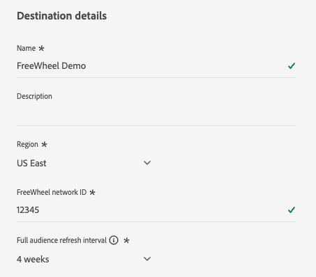
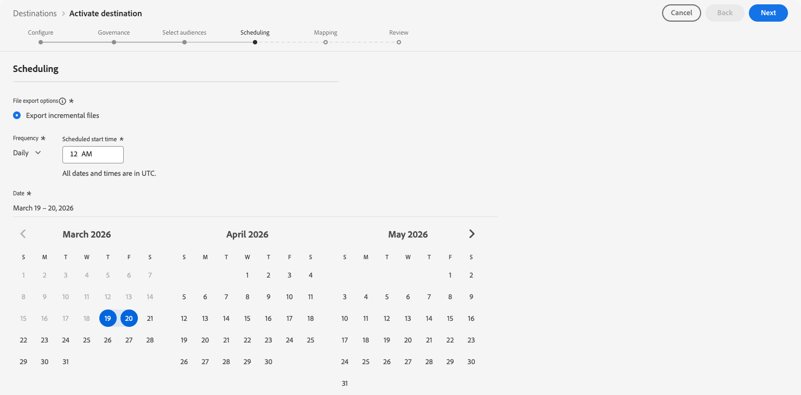

# [!DNL FreeWheel] 接続 {#freewheel}

>[!AVAILABILITY]
>
>[!DNL FreeWheel] の宛先は現在Betaにあり、一部のお客様のみご利用いただけます。 アクセス権をリクエストするには、Adobe担当者にお問い合わせください。

## 概要 {#overview}

[!DNL FreeWheel] は、コネクテッド テレビ（CTV）、ビデオ、ディスプレイのインベントリ全体でプログラムによる売買を強化する、グローバルな広告テクノロジープラットフォームです。 [!DNL FreeWheel] は、世界中の広告主とプレミアムメディアオーナーを結ぶデータ駆動型のマーケットプレイスを提供しています。

Adobe Experience Platformから [!DNL FreeWheel] にオーディエンスを送信する場合は、この宛先を使用します。 オーディエンスは毎日のバッチファイルとして配信され、[!DNL FreeWheel] しい取引やキャンペーンでターゲティングに使用できます。

## 前提条件 {#prerequisites}

[!DNL FreeWheel] に対してオーディエンスをアクティブ化する前に、次の要件を確認してください。

* **FreeWheel ネットワーク ID**：有効な [!DNL FreeWheel] ネットワーク ID が必要です。 これは、アカウントの設定時に [!DNL FreeWheel] によって提供されます。

## サポートされている ID {#supported-identities}

[!DNL FreeWheel] では、以下の表で説明する ID のアクティブ化をサポートしています。 これらの ID に加えて、[!DNL FreeWheel] アカウントで使用可能な任意の ID を使用できます。 以下の表にない ID をマッピングする方法については、[ 属性と ID のマッピング ](#map) を参照してください。 [ID](/help/identity-service/features/namespaces.md) についての詳細情報。

| ターゲット ID | 説明 | 注意点 |
|---|---|---|
| `idfa` | Apple の広告主 ID | ソース ID が IDFA 名前空間の場合は、このターゲット ID を選択します。 |
| `aaid` | ANDROID ADVERTISING ID | ソース ID が GAID 名前空間の場合は、このターゲット ID を選択します。 |
| `ctv` | 接続されている TV デバイス ID | CTV デバイスをターゲティングする場合は、このターゲット ID を選択します。 |
| `ip` | IPv4 アドレス | このターゲット ID を選択すると、IP アドレスに基づいてユーザーをターゲットに設定できます。 有効な IPv4 アドレスを含むプロファイル属性をマッピングするか、計算フィールドを使用して値を導き出します。 |
| `ipv6` | IPv6 アドレス | このターゲット ID を選択すると、IPv6 アドレスに基づいてユーザーをターゲットに設定できます。 有効な IPv6 アドレスを含むプロファイル属性をマッピングするか、計算フィールドを使用して値を導き出します。 |

{style="table-layout:auto"}

## サポートされるオーディエンス {#supported-audiences}

この節では、この宛先に書き出すことができるオーディエンスのタイプについて説明します。

| オーディエンスオリジン | サポートあり | 説明 |
|---------|----------|----------|
| [!DNL Segmentation Service] | ○ | Experience Platform [ セグメント化サービス ](../../../segmentation/home.md) を通じて生成されたオーディエンス。 |
| その他すべてのオーディエンスの接触チャネル | ○ | このカテゴリには、[!DNL Segmentation Service] を通じて生成されたオーディエンス以外のすべてのオーディエンスの接触チャネルが含まれます。 [ 様々なオーディエンスのオリジン ](/help/segmentation/ui/audience-portal.md#customize) について確認する。 次に例を示します。 <ul><li>csv ファイルからExperience Platformへのカスタムアップロードオーディエンス [ 読み込み ](../../../segmentation/ui/audience-portal.md#import-audience)</li><li>類似オーディエンス、</li><li>連合オーディエンス、</li><li>Adobe Journey Optimizerなど、他のExperience Platform アプリで生成されたオーディエンス。</li><li>その他。</li></ul> |

{style="table-layout:auto"}

オーディエンスデータタイプでサポートされるオーディエンス：

| オーディエンスデータタイプ | サポートあり | 説明 | ユースケース |
|--------------------|-----------|-------------|-----------|
| [ 人物オーディエンス ](/help/segmentation/types/people-audiences.md) | ○ | 顧客プロファイルに基づき、マーケティングキャンペーンの対象となる人物のグループを指定できます。 | CTV リターゲティング、リーチ抑制 |
| [ アカウントオーディエンス ](/help/segmentation/types/account-audiences.md) | × | アカウントベースのマーケティング戦略では、特定の組織内の個人をターゲットに設定します。 | B2B マーケティング |
| [ 見込み客オーディエンス ](/help/segmentation/types/prospect-audiences.md) | × | まだ顧客ではないものの、ターゲットオーディエンスと特性を共有する個人をターゲットに設定します。 | サードパーティデータを使用した予測 |
| [ データセットの書き出し ](/help/catalog/datasets/overview.md) | × | Adobe Experience Platform Data Lake に保存された構造化データのコレクション。 | レポート、データサイエンスワークフロー |

{style="table-layout:auto"}

## 書き出しのタイプと頻度 {#export-type-frequency}

宛先の書き出しのタイプと頻度について詳しくは、以下の表を参照してください。

| 項目 | タイプ | メモ |
|---------|----------|---------|
| 書き出しタイプ | **[!UICONTROL Profile-based]** | [ 宛先のアクティベーションワークフロー ](/help/destinations/ui/activate-batch-profile-destinations.md#select-attributes) のマッピング手順で選択したように、オーディエンスのすべてのメンバーを目的の ID フィールドと共に書き出します。 |
| 書き出し頻度 | **[!UICONTROL Batch]** | 最初の書き出しは、アクティブ化されたオーディエンスに該当するすべてのプロファイルの完全なスナップショットです。 以降の書き出しは、新しいオーディエンスの選定（追加）とオーディエンスの終了（削除）を含む、毎日の増分更新です。 設定可能な完全なオーディエンス更新間隔（4 週間、8 週間または 12 週間）も使用でき、毎日の増分に加えて定期的な完全な書き出しをトリガーします。 完全な書き出しには、現在認定されているプロファイルのみが含まれます。 オーディエンスの離脱は含まれず、毎日の増分更新でのみ配信されます。 詳しくは、[バッチ（ファイルベース）宛先](/help/destinations/destination-types.md#file-based)を参照してください。 |

{style="table-layout:auto"}

## 宛先への接続 {#connect}

>[!IMPORTANT]
>
>宛先に接続するには、**[!UICONTROL View Destinations]** および **[!UICONTROL Manage Destinations]**[ アクセス制御権限 ](/help/access-control/home.md#permissions) が必要です。 詳しくは、[アクセス制御の概要](/help/access-control/ui/overview.md)または製品管理者に問い合わせて、必要な権限を取得してください。

この宛先に接続するには、[宛先設定のチュートリアル](../../ui/connect-destination.md)の手順に従ってください。宛先の設定ワークフローで、以下の 2 つのセクションにリストされているフィールドに入力します。

### 宛先に対する認証 {#authenticate}

[!DNL FreeWheel] の宛先への認証は、Adobeによって自動的に処理されます。 認証中に資格情報や API キーは必要ありません。 Adobeは、お客様に代わって [!DNL FreeWheel] への安全な接続を管理します。


「**[!UICONTROL Connect to destination]**」を選択して、宛先の詳細手順に進みます。

### 宛先の詳細を入力 {#destination-details}

>[!CONTEXTUALHELP]
>id="platform_destinations_freewheel_backfill"
>title="完全なオーディエンスの更新間隔"
>abstract="毎日の増分更新に加えて、完全なオーディエンスの書き出しが [!DNL FreeWheel] に送信される間隔を選択します。 完全なオーディエンスの書き出しを使用すると、オーディエンスメンバーの有効期限が [!DNL FreeWheel] に切れるのを防ぐので、キャンペーンの実行中にターゲットメンバーの急激な減少が発生することはありません。 4 週間、8 週間、12 週間から選択できます。"

宛先の詳細を設定するには、以下の必須フィールドとオプションフィールドに入力します。UI のフィールドの横のアスタリスクは、そのフィールドが必須であることを示します。



* **[!UICONTROL Name]**：今後この宛先を認識するための名前。
* **[!UICONTROL Description]**：今後この宛先を識別するのに役立つ説明。
* **[!UICONTROL Region]**: アカウントがホストされている [!DNL FreeWheel] 地域。 次のいずれかのオプションを選択します。
   * **[!UICONTROL US East]**
   * **[!UICONTROL Europe]**
   * **[!UICONTROL Asia Pacific]**
* **[!UICONTROL FreeWheel network ID]**:[!DNL FreeWheel] ネットワーク ID。 この値は [!DNL FreeWheel] によって提供され、[!DNL FreeWheel] プラットフォームで組織を一意に識別します。
* **[!UICONTROL Full audience refresh interval]**：毎日の増分更新に加えて、完全なオーディエンスの書き出しが [!DNL FreeWheel] に送信される頻度。 完全なオーディエンスの書き出しを使用すると、オーディエンスメンバーの有効期限が [!DNL FreeWheel] に切れるのを防ぐので、キャンペーンの実行中にターゲットメンバーの急激な減少が発生することはありません。 ドロップダウンから間隔を選択します。

### アラートの有効化 {#enable-alerts}

アラートを有効にすると、宛先へのデータフローのステータスに関する通知を受け取ることができます。リストからアラートを選択して、データフローのステータスに関する通知を受け取るよう登録します。アラートについて詳しくは、[UI を使用した宛先アラートの購読](../../ui/alerts.md)についてのガイドを参照してください。

宛先接続への詳細の入力を終えたら「**[!UICONTROL Next]**」を選択します。

## この宛先に対してオーディエンスをアクティブ化 {#activate}

>[!IMPORTANT]
>
>* データをアクティブ化するには、**[!UICONTROL View Destinations]**、**[!UICONTROL Activate Destinations]**、**[!UICONTROL View Profiles]**、**[!UICONTROL View Segments]** [ アクセス制御権限 ](/help/access-control/home.md#permissions) が必要です。 [アクセス制御の概要](/help/access-control/ui/overview.md)を参照するか、製品管理者に問い合わせて必要な権限を取得してください。
>* *ID* を書き出すには、**[!UICONTROL View Identity Graph]** [ アクセス制御権限 ](/help/access-control/home.md#permissions) が必要です。<br> {width="100" zoomable="yes"}

この宛先に対してオーディエンスをアクティブ化する手順については、[バッチプロファイル書き出し宛先に対するオーディエンスデータのアクティブ化](/help/destinations/ui/activate-batch-profile-destinations.md)を参照してください。

### オーディエンス書き出しのスケジュール設定 {#schedule}



**[!UICONTROL Scheduling]** の手順では、各オーディエンスの書き出しスケジュールを設定します。 [!DNL FreeWheel] ではハイブリッド書き出しモデルを使用します。アクティブ化された各オーディエンスの最初の書き出しは完全なスナップショットで、その後は毎日増分更新が行われます。

次のフィールドを設定します。

* **[!UICONTROL File export options]**: **[!UICONTROL Export incremental files]** は事前に選択されており、サポートされている唯一のオプションです。 最初の書き出しには、すべての対象プロファイルの完全なスナップショットが自動的に含まれます。 以降の書き出しでは、新しいオーディエンスの選定と前回の書き出し以降の終了のみが提供されます。
* **[!UICONTROL Frequency]**: 「**[!UICONTROL Daily]**」を選択します。 [!DNL FreeWheel] では、毎日の増分ファイル配信が想定されています。
* **[!UICONTROL Scheduled start time]**：日別の書き出しを実行する時刻を UTC で入力します。
* **[!UICONTROL Date]**: アクティベーションの開始日と終了日を設定します。 開始日によって、最初の完全なスナップショットの書き出しが送信されるタイミングが決まります。

>[!NOTE]
>
>完全な書き出し（初回スナップショットと定期的な完全な更新の両方）には、現在認定されているプロファイルのみが含まれています。 オーディエンスの離脱は完全な書き出しに含まれず、毎日の増分更新によってのみ配信されます。

### 属性と ID のマッピング {#map}

マッピング手順では、Experience Platform プロファイルからソースフィールドを選択して、[!DNL FreeWheel] でサポートされる ID タイプにマッピングします。 少なくとも 1 つのマッピングが必要です。

>[!IMPORTANT]
>
>[!DNL FreeWheel] でサポートされる ID タイプは、ID 名前空間としてではなく、マッピング UI で **ターゲット属性** として表示されます。

[!DNL FreeWheel] アカウントが [ サポートされている ID](#supported-identities) テーブルに表示されていない ID タイプをサポートしている場合は、事前定義済みリストから選択する代わりに、ターゲットフィールドに ID 名を手動で入力することでマッピングできます。


以下はマッピングの例です。 実際のマッピングは、プロファイルスキーマと、[!DNL FreeWheel] アカウントがサポートする ID タイプによって異なります。

| ソースフィールド | ターゲットフィールド |
| --- | --- |
| `identityMap.IDFA` | `idfa` |
| `identityMap.GAID` | `aaid` |
| `homeAddress.ipAddress` | `ip` |

{style="table-layout:auto"}

>[!NOTE]
>
>必須のマッピングは適用されません。 ただし、少なくとも 1 つの有効な ID マッピングを持たないプロファイルは、書き出されたファイルに含まれません。

## 書き出されたデータ／データ書き出しの検証 {#exported-data}

書 [!DNL FreeWheel] 出しごとに 2 種類のファイルを受け取ります。 どちらのファイルタイプも自動的に生成および配信されます。 ユーザー側に必要なアクションはありません。

**ID （データ）ファイル** には、オーディエンスメンバーシップデータが含まれます。 各行は、ユーザー ID を 1 つ以上のオーディエンス ID にマッピングします。 ファイルは、列ヘッダーを含まない CSV 形式で [!DNL FreeWheel] に配信されます。 書き出しに含まれる ID タイプごとに別個のファイルが作成されます（例えば、`aaid` 用のファイルと `idfa` 用のファイルが 1 つずつなど）。

データファイル形式の例：

```csv
aebc1234-56f7-89ab-cdef-0123456789ab,segment_1,segment_2
f7c9a8b0-4d33-11ec-81d3-0242ac130003,segment_1,segment_3
123e4567-e89b-12d3-a456-426614174000,segment_2
```

**分類ファイル** 書き出しに含まれるオーディエンスを記述します。 これらのファイルはデータファイルと共に配信され、オーディエンス ID、名前および TTL （有効期間）が日数で含まれます。 [!DNL FreeWheel] でサポートされている最大 TTL は 90 日です。 次の例の値は例を示しています。

分類ファイル形式の例：

```csv
Segment ID,Segment Name,TTL
segment_1,my_first_segment,30
segment_2,my_second_segment,30
segment_3,my_third_segment,30
```

## データの使用とガバナンス {#data-usage-governance}

[!DNL Adobe Experience Platform] のすべての宛先は、データを処理する際のデータ使用ポリシーに準拠しています。[!DNL Adobe Experience Platform] がどのようにデータガバナンスを実施するかについて詳しくは、[データガバナンスの概要](/help/data-governance/home.md)を参照してください。

## その他のリソース {#additional-resources}

[!DNL FreeWheel] とその広告テクノロジープラットフォームについて詳しくは、[FreeWheel web サイト ](https://www.freewheel.com){target="_blank"} を参照してください。
