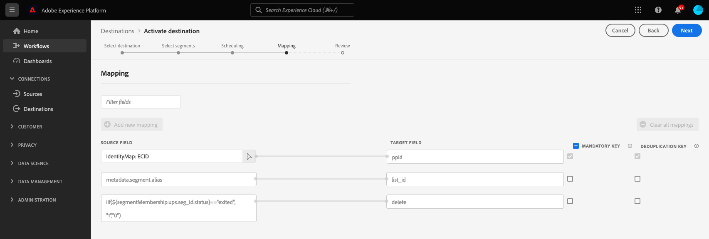

# （ベータ版）[!DNL Google Ad Manager 360] 接続

>[!IMPORTANT]
>
> Googleは、欧州連合（[EU ユーザーの同意ポリシー](https://developers.google.com/google-ads/api/docs/start)）の[ デジタル市場法](https://ads-developers.googleblog.com/2023/10/updates-to-customer-match-conversion.html) （DMA）で定義されているコンプライアンスと同意に関する要件をサポートするために、[Google Ads API](https://developers.google.com/display-video/api/guides/getting-started/overview)、[Customer Match](https://digital-markets-act.ec.europa.eu/index_en)、および[Display &amp; Video 360 API](https://www.google.com/about/company/user-consent-policy/)に対する変更をリリースしています。 これらの変更の同意要件への適用は、2024年3月6日現在で有効です。
> 
>EUのユーザー同意方針に準拠し、欧州経済地域（EEA）のユーザーに対してオーディエンスリストの作成を継続するには、広告主とパートナーは、オーディエンスデータをアップロードする際に、エンドユーザーの同意を確実に渡す必要があります。 Adobeは、Googleパートナーとして、欧州連合のDMAに基づく同意要件に準拠するために必要なツールを提供します。
> 
>Adobe Privacy &amp; Security Shieldを購入し、同意のないプロファイルを除外するように[同意ポリシー](../../../data-governance/enforcement/auto-enforcement.md#consent-policy-evaluation)を設定しているお客様は、何らかの操作を行う必要はありません。
> 
>Adobe Privacy &amp; Security Shieldを購入していないお客様は、既存の[ Google宛先を中断なく引き続き使用するために、同意のないプロファイルを除外するために、](../../../segmentation/home.md#segment-definitions) セグメントビルダー[内の](../../../segmentation/ui/segment-builder.md) セグメント定義[!DNL Real-Time CDP]機能を使用する必要があります。

[!DNL Google Ad Manager 360] 接続では、[!DNL Google Cloud Storage] を介して、[!DNL Google Ad Manager 360] への [!DNL publisher provided identifiers]（PPID）のバッチアップロードが可能です。

媒体社が提供した ID が Google Ad Manager 360 でどのように機能するかについて詳しくは、[公式 Google ドキュメント](https://support.google.com/admanager/answer/2880055?hl=ja)を参照してください。

>[!IMPORTANT]
>
>この宛先は現在ベータ版で、一部のお客様のみご利用いただけます。[!DNL Google Ad Manager 360] 接続へのアクセスをリクエストするには、アドビ担当者に連絡し、お使いの [!DNL organization ID] を提供します。

[!DNL Google Ad Manager 360] 宛先では、[!DNL CSV] ファイルをお使いの [!DNL Google Cloud Storage] バケットに書き出します。[!DNL CSV] ファイルを書き出したら、お使いの [!DNL Google Ad Manager 360] アカウントに読み込む必要があります。

## 宛先の詳細 {#specifics}

[!DNL Google Ad Manager 360] 宛先に固有の次の詳細事項に注意してください。

* この宛先は、現在[ オンデマンドでファイルを書き出す](../../ui/export-file-now.md)機能をサポートしていません。
* アクティブ化されたオーディエンスは、Google プラットフォームでプログラムにより作成され、CSV ファイルに入力されます。

## サポートされる ID {#supported-identities}

[!DNL This integration] では、以下の表で説明する ID のアクティベーションをサポートしています。

| ターゲット ID | 説明 | 注意点 |
|---|---|---|
| PPID | [!DNL Publisher provided ID] | オーディエンスを [!DNL Google Ad Manager 360] に送信するには、このターゲット ID を選択します。 |

{style="table-layout:auto"}

## サポートされるオーディエンス {#supported-audiences}

この節では、この宛先に書き出すことができるオーディエンスのタイプについて説明します。

| オーディエンスの由来 | サポートあり | 説明 |
|---------|----------|----------|
| [!DNL Segmentation Service] | ○ | Experience Platform [ セグメント化サービス ](../../../segmentation/home.md)を通じて生成されたオーディエンス。 |
| その他すべてのオーディエンスの生成元 | ○ | このカテゴリには、[!DNL Segmentation Service]を通じて生成されたオーディエンス以外のすべてのオーディエンスのオリジンが含まれます。 [様々なオーディエンスの起源](/help/segmentation/ui/audience-portal.md#customize)について読みます。 次に例を示します。 <ul><li> カスタムアップロードオーディエンス [がCSV ファイルからExperience Platformに](../../../segmentation/ui/audience-portal.md#import-audience)をインポートしました。</li><li> 類似オーディエンス， </li><li> 連合オーディエンス， </li><li> [!DNL Adobe Journey Optimizer]などの他のExperience Platform アプリで生成されたオーディエンス </li><li> その他。 </li></ul> |

{style="table-layout:auto"}

オーディエンスのデータタイプ別にサポートされるオーディエンス：

| オーディエンスのデータタイプ | サポートあり | 説明 | ユースケース |
|--------------------|-----------|-------------|-----------|
| [人物オーディエンス ](/help/segmentation/types/people-audiences.md) | ○ | 顧客プロファイルにもとづいて、マーケティング施策の特定のグループをターゲットにすることができます。 | 買い物客やカートの放棄が多い |
| [ アカウントオーディエンス ](/help/segmentation/types/account-audiences.md) | × | アカウントベースドマーケティング戦略のために、特定の組織内の個人をターゲットにします。 | B2B マーケティング |
| [見込みオーディエンス ](/help/segmentation/types/prospect-audiences.md) | × | まだ顧客ではないが、ターゲットオーディエンスと特徴を共有する個人をターゲットにします。 | サードパーティデータによる見込み顧客の開拓 |
| [ データセットの書き出し](/help/catalog/datasets/overview.md) | × | [!DNL Adobe Experience Platform] データ レイクに保存されている構造化データのコレクション。 | レポート，データサイエンスワークフロー |

{style="table-layout:auto"}

## 書き出しのタイプと頻度 {#export-type-frequency}

宛先の書き出しのタイプと頻度について詳しくは、以下の表を参照してください。

| 項目 | タイプ | メモ |
|---------|----------|---------|
| 書き出しタイプ | **[!UICONTROL Profile-based]** | [宛先のアクティベーションワークフロー](/help/destinations/ui/activate-batch-profile-destinations.md#select-attributes)のプロファイル属性の選択画面で選択したように、該当するスキーマフィールド（例：PPID）と共に、セグメントのすべてのメンバーを書き出しています。 |
| 書き出し頻度 | **[!UICONTROL Batch]** | バッチ宛先では、ファイルが 3 時間、6 時間、8 時間、12 時間、24 時間の単位でダウンストリームプラットフォームに書き出されます。 詳しくは、[バッチ（ファイルベース）宛先](/help/destinations/destination-types.md#file-based)を参照してください。 |

{style="table-layout:auto"}

## 前提条件 {#prerequisites}

### 許可リストへの登録 {#allow-listing}

許可リストへの登録は、Experience Platformで最初の[!DNL Google Ad Manager 360]の宛先を設定する前に必須です。 宛先を作成する前に、以下に説明する許可リストへの登録プロセスを必ず完了してください。

>[!NOTE]
>
>このルールの例外は、既存の[Audience Manager](https://experienceleague.adobe.com/docs/audience-manager/user-guide/aam-home.html?lang=ja)のお客様です。 この Google の宛先への接続を Audience Manager で既に作成している場合は、許可リストへの登録プロセスを再度実行する必要はありません。次の手順に進んでください。

1. [Google Ad Manager ドキュメント ](https://support.google.com/admanager/answer/3289669?hl=ja)に記載されている手順に従って、Adobe as a Link Data Management Platform （DMP）を追加します。
2. [!DNL Google Ad Manager] インターフェイスで、**[!UICONTROL Admin]** > **[!UICONTROL Global Settings]** > **[!UICONTROL Network Settings]**&#x200B;に移動し、**[!UICONTROL API Access]** スライダーを有効にします。

## 宛先への接続 {#connect}

>[!IMPORTANT]
>
>宛先に接続するには、**[!UICONTROL View Destinations]**&#x200B;および&#x200B;**[!UICONTROL Manage Destinations]** [ アクセス制御権限](/help/access-control/home.md#permissions)が必要です。 詳しくは、[アクセス制御の概要](/help/access-control/ui/overview.md)または製品管理者に問い合わせて、必要な権限を取得してください。

この宛先に接続するには、[宛先設定のチュートリアル](https://experienceleague.adobe.com/docs/experience-platform/destinations/ui/connect-destination.html?lang=ja)の手順に従ってください。宛先の設定ワークフローで、以下の 2 つの節でリストされているフィールドに入力します。

### 宛先に対する認証 {#authenticate}

宛先に対して認証を行うには、必須フィールドに入力し、**[!UICONTROL Connect to destination]**&#x200B;を選択します。

* **[!UICONTROL Access key ID]**: [!DNL Google Cloud Storage] アカウントをExperience Platformに認証するために使用される61文字の英数字の文字列。
* **[!UICONTROL Secret access key]**: [!DNL Google Cloud Storage] アカウントをExperience Platformに認証するために使用される、40文字のbase64 エンコードされた文字列。

これらの値について詳しくは、[Google Cloud Storage の HMAC キー](https://cloud.google.com/storage/docs/authentication/hmackeys#overview)ガイドを参照してください。独自のアクセスキーIDとシークレットアクセスキーを生成する手順については、[[!DNL Google Cloud Storage]  ソースの概要](/help/sources/connectors/cloud-storage/google-cloud-storage.md)を参照してください。

### 宛先の詳細の入力 {#destination-details}

>[!CONTEXTUALHELP]
>id="platform_destinations_gam360_appendSegmentID"
>title="オーディエンス名へのオーディエンス ID の追加"
>abstract="この宛先のオーディエンス名に Experience Platform のオーディエンス ID を含める（`Audience Name (Audience ID)` など）には、このオプションを選択します。"

宛先の詳細を設定するには、以下の必須フィールドとオプションフィールドに入力します。UI のフィールドの横のアスタリスクは、そのフィールドが必須であることを示します。

* **[!UICONTROL Name]**：この宛先の優先名を入力します。
* **[!UICONTROL Description]**：オプション。例えば、この宛先を使用しているキャンペーンを指定できます。
* **[!UICONTROL Folder path]**：書き出されたファイルをホストする宛先フォルダーへのパスを入力します。
* **[!UICONTROL Bucket name]**：この宛先で使用する[!DNL Google Cloud Storage] バケットの名前を入力します。
* **[!UICONTROL Account ID]**: [!DNL Audience Link ID] アカウントから[!DNL Google]を入力します。 これは、[!DNL Google Ad Manager] ネットワークに関連付けられている特定の識別子です（[!DNL Network code]ではありません）。 これは、**[!UICONTROL Admin > Global settings]** インターフェイスの[!DNL Google Ad Manager]で見つけることができます。
* **[!UICONTROL Account Type]**: [!DNL Google] アカウントに応じて、オプションを選択します：
   * [!DNL Google AdX] に `AdX buyer` を使用する
   * [!DNL DoubleClick] for Publishers に `DFP by Google` を使用する
* **[!UICONTROL Append audience ID to audience name]**：次のように、Google Ad Manager 360のオーディエンス名にExperience Platformのオーディエンス IDを含めるには、このオプションを選択します：`Audience Name (Audience ID)`。

### アラートの有効化 {#enable-alerts}

アラートを有効にすると、宛先へのデータフローのステータスに関する通知を受け取ることができます。リストからアラートを選択して、データフローのステータスに関する通知を受け取るよう登録します。アラートについて詳しくは、[UI を使用した宛先アラートの購読](../../ui/alerts.md)についてのガイドを参照してください。

宛先接続の詳細の提供が完了したら、**[!UICONTROL Next]**&#x200B;を選択します。

## この宛先に対してオーディエンスをアクティブ化 {#activate}

>[!IMPORTANT]
>
>* データをアクティブ化するには、**[!UICONTROL View Destinations]**、**[!UICONTROL Activate Destinations]**、**[!UICONTROL View Profiles]**&#x200B;および&#x200B;**[!UICONTROL View Segments]** [ アクセス制御権限](/help/access-control/home.md#permissions)が必要です。 [アクセス制御の概要](/help/access-control/ui/overview.md)を参照するか、製品管理者に問い合わせて必要な権限を取得してください。
>* *ID*&#x200B;をエクスポートするには、**[!UICONTROL View Identity Graph]** [ アクセス制御権限](/help/access-control/home.md#permissions)が必要です。  {width="100" zoomable="yes"}

この宛先に対するオーディエンスのアクティブ化の手順については、[ バッチプロファイル書き出し宛先に対するオーディエンスデータのアクティブ化](../../ui/activate-batch-profile-destinations.md)を参照してください。

ID マッピングステップでは、次の事前入力済みマッピングが表示されます。

| 事前入力済みマッピング | 説明 |
|---------|----------|
| `ECID` -> `ppid` | ユーザーによる編集が可能な事前入力済みのマッピングは、これだけです。Experience Platformから任意の属性またはID名前空間を選択し、`ppid`にマッピングできます。 |
| `metadata.segment.alias` -> `list_id` | Experience Platformのオーディエンス名を、Google プラットフォームのオーディエンス IDにマッピングします。 |
| `iif(${segmentMembership.ups.seg_id.status}=="exited", "1","0")` -> `delete` | 不適格なユーザーをセグメントから削除するタイミングを Google プラットフォームに指示します。 |

{style="table-layout:auto"}

これらのマッピングは[!DNL Google Ad Manager 360]によって必要であり、[!DNL Adobe Experience Platform]によってすべての[!DNL Google Ad Manager 360]接続に対して自動的に作成されます。

## 書き出したデータ {#exported-data}

データが正常に書き出されたかどうかを確認するには、[!DNL Google Cloud Storage] バケットを確認し、書き出されたファイルに想定どおりのプロファイル母集団が含まれていることを確認します。

## トラブルシューティング {#troubleshooting}

この宛先の使用中にエラーが発生し、AdobeまたはGoogleのいずれかに連絡する必要がある場合は、次のIDを手元に置いてください。

AdobeのGoogle アカウント ID:

* **[!UICONTROL Account ID]**: 87933855
* **[!UICONTROL Customer ID]**: 89690775