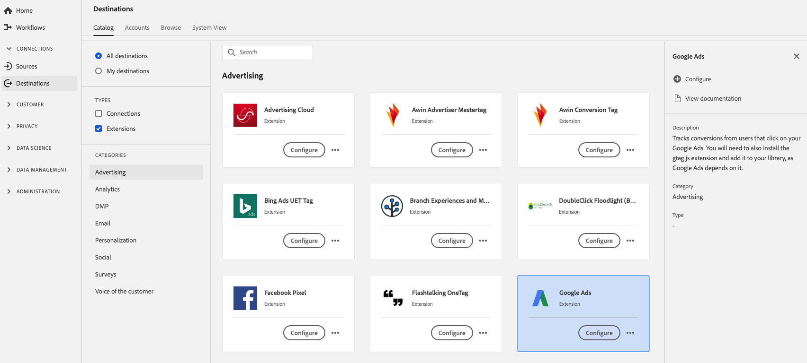

# [!DNL Google Ads] 拡張機能

## 概要 {#overview}

この拡張機能は、 [!DNL Google Ads]. また、gtag.js 拡張機能をインストールし、ライブラリに追加する必要があります。 [!DNL Google Ads] それに依存している。

[!DNL Google Ads] は、Adobe Experience Platformの広告拡張機能です。 拡張機能について詳しくは、[Adobe Exchange](https://www.adobeexchange.com/experiencecloud.details.101383.google-ads.html) の拡張機能のページを参照してください。

この宛先はタグ拡張です。 Platform でのタグ拡張の仕組みについて詳しくは、 [タグ拡張機能の概要](../launch-extensions/overview.md).

## 前提条件 {#prerequisites}

この拡張機能は、Platform を購入したすべての顧客が、宛先カタログで使用できます。

この拡張機能を使用するには、Adobe Experience Platformのタグにアクセスする必要があります。 タグは、Adobe Experience Cloudのお客様に、付属の付加価値機能として提供されます。 組織の管理者に問い合わせてタグへのアクセス権を取得し、 **[!UICONTROL manage_properties]** 権限を持つユーザーが拡張機能をインストールできるようにする。

## 拡張機能のインストール {#install-extension}

をインストールするには、以下を実行します。 [!DNL Google Ads] 拡張子：

内 [Platform インターフェイス](https://platform.adobe.com/)に移動します。 **[!UICONTROL 宛先]** > **[!UICONTROL カタログ]**.

カタログから拡張機能を選択するか、検索バーを使用します。

宛先をクリックしてハイライトし、「 」を選択します。 **[!UICONTROL 設定]** をクリックします。 この **[!UICONTROL 設定]** コントロールが灰色表示になっているので、次の項目はありません： **[!UICONTROL manage_properties]** 権限。 [前提条件](#prerequisites)を確認してください。

拡張機能をインストールするプロパティを選択します。 また、新しいプロパティを作成することもできます。 プロパティは、ルール、データ要素、設定された拡張機能、環境およびライブラリの集まりです。のプロパティについて [プロパティページセクション](../../../tags/ui/administration/companies-and-properties.md#properties-page) 」の「 」を参照してください。

このワークフローでは、インストールを完了する手順について説明します。

この拡張機能の設定オプションとインストールのサポートについて詳しくは、Adobe Exchange の [Google 広告ページ](https://www.adobeexchange.com/experiencecloud.details.101383.google-ads.html)を参照してください。

拡張機能は、 [データ収集 UI](https://experience.adobe.com/#/data-collection/). 詳しくは、 [新しい拡張機能の追加](../../../tags/ui/managing-resources/extensions/overview.md#add-a-new-extension) （タグドキュメント）を参照してください。

## 拡張機能の使用方法 {#how-to-use}

拡張機能をインストールしたら、ルールの設定を開始できます。

特定の状況でのみ拡張機能の宛先にイベントデータを送信するよう、インストールした拡張機能のルールを設定できます。 拡張機能のルールの設定について詳しくは、 [タグドキュメント](../../../tags/ui/managing-resources/rules.md).

## 拡張機能の設定、アップグレード、削除 {#configure-upgrade-delete}

データ収集 UI で、拡張機能の設定、アップグレード、削除をおこなうことができます。

>[!TIP]
>
>拡張機能が既にいずれかのプロパティにインストールされている場合、Platform UI は表示されます **[!UICONTROL インストール]** 拡張機能用。 インストールワークフローを開始します ( [拡張機能のインストール](#install-extension) 拡張機能を設定または削除するには、以下を実行します。

拡張機能をアップグレードするには、 [拡張機能のアップグレードプロセス](../../../tags/ui/managing-resources/extensions/extension-upgrade.md) （タグドキュメント）を参照してください。
