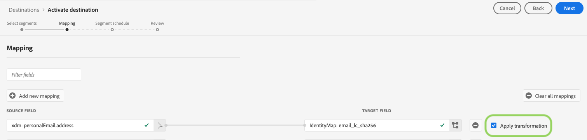
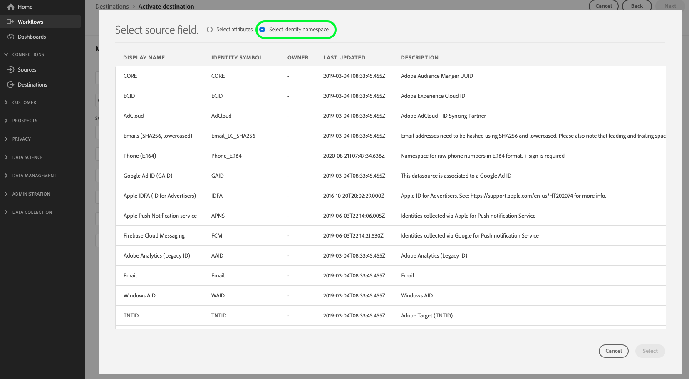
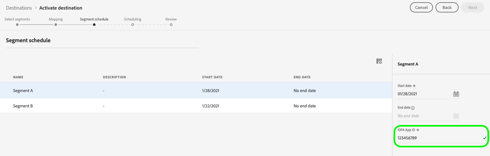
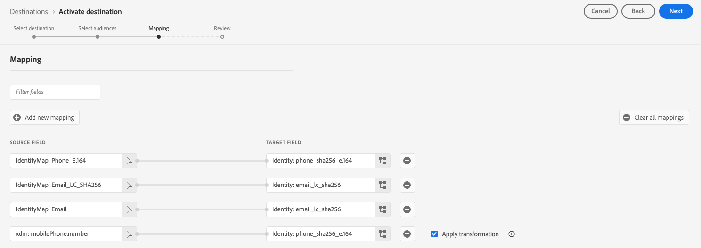
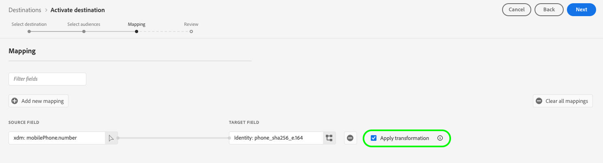

# [!DNL Google Customer Match + Display & Video 360] 接続

>[!NOTE]
>
>**Google Customer Match + Display &amp; Video 360 コネクタの使用制限**  Googleとの統合に関する成熟ライフサイクル全体を進める中で、導入を拡大する前に修正が必要な実装の弱点を示すデータが見られます。 これらの懸念を考慮して、Adobeはこの目的地の可視性を限られた数のお客様に限定しました。 「顧客体験の向上を目指して、Googleと積極的に話し合っています。 これは残念なニュースかもしれませんが、お客様に高品質で信頼性の高い体験を提供することは、責任あるアプローチであると考えています。 

この宛先を使用して、ファーストパーティ PII ベースの[[!DNL Google Customer Match]](https://support.google.com/google-ads/answer/6379332?hl=en) リストを[!DNL Google Display & Video 360]、[!DNL Search]、[!DNL YouTube]、[!DNL Gmail]などの[!DNL Google Display Network] プロパティに直接アクティブ化します。

Adobe [!DNL Real-Time CDP]など、Googleと統合された一部のサードパーティは、[!DNL Google Audience Partner API]を使用して、顧客の[!DNL Customer Match] アカウントで直接[!DNL Display & Video 360] オーディエンスを作成できます。

[!DNL Customer Matched]全体で[!DNL Display & Video 360]人のオーディエンスを利用できる新しく導入された機能により、在庫ソースのリストを拡大してオーディエンスをターゲットにできるようになりました。

## EUにおける同意要件の更新に関連するGoogleの宛先の変更に関する重要なお知らせ {#eu-consent-notice}

>[!IMPORTANT]
>
> Googleは、欧州連合（[EU ユーザーの同意ポリシー](https://developers.google.com/google-ads/api/docs/start)）の[&#x200B; デジタル市場法](https://ads-developers.googleblog.com/2023/10/updates-to-customer-match-conversion.html) （DMA）で定義されているコンプライアンスと同意に関する要件をサポートするために、[Google Ads API](https://developers.google.com/display-video/api/guides/getting-started/overview)、[Customer Match](https://digital-markets-act.ec.europa.eu/index_en)、および[Display &amp; Video 360 API](https://www.google.com/about/company/user-consent-policy/)に対する変更をリリースしています。 これらの変更の同意要件への適用は、2024年3月6日現在で有効です。
> 
>EUのユーザー同意方針に準拠し、欧州経済地域（EEA）のユーザーに対してオーディエンスリストの作成を継続するには、広告主とパートナーは、オーディエンスデータをアップロードする際に、エンドユーザーの同意を確実に渡す必要があります。 Adobeは、Googleパートナーとして、欧州連合のDMAに基づく同意要件に準拠するために必要なツールを提供します。
> 
>Adobe Privacy &amp; Security Shieldを購入し、同意のないプロファイルを除外するように[同意ポリシー](../../../data-governance/enforcement/auto-enforcement.md#consent-policy-evaluation)を設定しているお客様は、何らかの操作を行う必要はありません。
> 
>Adobe Privacy &amp; Security Shieldを購入していないお客様は、既存の[&#x200B; Google宛先を中断なく引き続き使用するために、同意のないプロファイルを除外するために、](../../../segmentation/home.md#segment-definitions) セグメントビルダー[内の](../../../segmentation/ui/segment-builder.md) セグメント定義[!DNL Real-Time CDP]機能を使用する必要があります。

## この宛先の使用状況 {#when-to-use}

宛先カタログには、Googleとの統合機能がいくつか用意されており、使用可能なGoogleの各宛先を使用するタイミングを把握するのが難しい場合があります。 次の表の情報を読んで、様々なユースケースを理解してください。

| [Google カスタマーマッチ](/help/destinations/catalog/advertising/google-customer-match.md) | [Google Display と Video 360](/help/destinations/catalog/advertising/google-dv360.md) | [!DNL Google Customer Match] + [!DNL Display & Video 360] （このコネクタ） |
|---------|----------|---------|
| PII ベースのオーディエンスをエクスポートし、[!DNL Google Customer Match]で利用可能なインベントリでリーチします。 | [!DNL Google Display & Video 360]経由で、Googleが所有および運営するYoutubeや[!DNL Search]などのプロパティで利用可能な、インベントリ全体でCookie ベースのオーディエンスにリーチします。 | [!DNL Google Customer Match]でPII ベースのオーディエンスを作成し、[!DNL Google Display & Video 360]で利用可能なインベントリで、Googleが所有および運営するプロパティでのみリーチします。 |

## ユースケース {#use-cases}

この宛先を使用する方法とタイミングをより深く理解するために、この機能を使用して[!DNL Adobe Experience Platform]のお客様が解決できるユースケースの例を次に示します。

### ユースケース #1 {#use-case-1}

スポーツ衣料品ブランドが、[!DNL Google Search]と[!DNL Google Shopping]を通じて既存顧客にリーチし、過去の購入履歴や閲覧履歴にもとづいてオファーや商品をパーソナライズしたいと考えています。 アパレル企業は、自社のCRMからAdobe Experience Platformにメールアドレスを取り込み、そのオフラインデータからオーディエンスを構築することができます。 次に、これらのオーディエンスを[!DNL Google Customer Match + Display & Video 360]宛先に送信して、[!DNL Google Display & Video 360]、[!DNL Search]、[!DNL YouTube]、および[!DNL Gmail]などの[!DNL Google Display Network] プロパティで使用できます。

### ユースケース #2 {#use-case-2}

大手テクノロジー企業が新しい携帯電話を発売しました。 この新しい携帯電話モデルを宣伝するために、彼らは携帯電話の以前のモデルを所有している顧客に携帯電話の新機能と機能の認識を促進することを目指しています。

リリースを促進するために、CRM データベースからExperience Platformにメールアドレスをアップロードし、そのメールアドレスをIDとして使用します。 オーディエンスは、古いモデルの所有者に基づいて作成されます。 その後、オーディエンスが[!DNL Google Customer Match]に送信されるので、現在の顧客、古い電話モデルを所有している顧客、および類似の顧客を[!DNL Google Display & Video 360]、[!DNL Search]、[!DNL YouTube]、[!DNL Gmail]などの[!DNL Google Display Network]のプロパティでターゲットにすることができます。

## サポートされている ID {#supported-identities}

[!DNL Google Customer Match]は、次の表に示すIDのアクティブ化をサポートしています。 [ID](/help/identity-service/features/namespaces.md) についての詳細情報。

| ターゲット ID | 説明 | 注意点 |
|---|---|---|
| GAID | GOOGLE ADVERTISING ID | ソース IDがGAID名前空間である場合は、GAID ターゲット IDを選択します。 |
| IDFA | Apple の広告主 ID | ソース IDがIDFA名前空間の場合は、IDFA ターゲット IDを選択します。 |
| phone_sha256_e.164 | SHA256 アルゴリズムでハッシュ化されたE164形式の電話番号 | プレーンテキストとSHA256 ハッシュ化された電話番号の両方が[!DNL Adobe Experience Platform]でサポートされています。 「[IDに一致する要件](#id-matching-requirements-id-matching-requirements)」セクションの手順に従い、プレーンテキストとハッシュ化された電話番号にそれぞれ適切な名前空間を使用します。 ソースフィールドにハッシュ化されていない属性が含まれている場合は、**[!UICONTROL Apply transformation]** オプションをチェックして、[!DNL Experience Platform]がアクティベーション時にデータを自動的にハッシュします。 |
| email_lc_sha256 | SHA256 アルゴリズムでハッシュ化されたメールアドレス | プレーンテキストとSHA256 ハッシュ化された電子メールアドレスの両方が[!DNL Adobe Experience Platform]でサポートされています。 「[IDに一致する要件](#id-matching-requirements-id-matching-requirements)」セクションの手順に従い、プレーンテキストとハッシュ化された電子メールアドレスにそれぞれ適切な名前空間を使用します。 ソースフィールドにハッシュ化されていない属性が含まれている場合は、**[!UICONTROL Apply transformation]** オプションをチェックして、[!DNL Experience Platform]がアクティベーション時にデータを自動的にハッシュします。 |

{style="table-layout:auto"}

## サポートされるオーディエンス {#supported-audiences}

この節では、この宛先に書き出すことができるオーディエンスのタイプについて説明します。

| オーディエンスの由来 | サポートあり | 説明 |
|---------|----------|----------|
| [!DNL Segmentation Service] | ○ | Experience Platform [&#x200B; セグメント化サービス &#x200B;](../../../segmentation/home.md)を通じて生成されたオーディエンス。 |
| その他すべてのオーディエンスの生成元 | ○ | このカテゴリには、[!DNL Segmentation Service]を通じて生成されたオーディエンス以外のすべてのオーディエンスのオリジンが含まれます。 [様々なオーディエンスの起源](/help/segmentation/ui/audience-portal.md#customize)について読みます。 次に例を示します。 <ul><li> カスタムアップロードオーディエンス [がCSV ファイルからExperience Platformに](../../../segmentation/ui/audience-portal.md#import-audience)をインポートしました。</li><li> 類似オーディエンス， </li><li> 連合オーディエンス， </li><li> [!DNL Adobe Journey Optimizer]などの他のExperience Platform アプリで生成されたオーディエンス </li><li> その他。 </li></ul> |

{style="table-layout:auto"}

オーディエンスのデータタイプ別にサポートされるオーディエンス：

| オーディエンスのデータタイプ | サポートあり | 説明 | ユースケース |
|--------------------|-----------|-------------|-----------|
| [人物オーディエンス &#x200B;](/help/segmentation/types/people-audiences.md) | ○ | 顧客プロファイルにもとづいて、マーケティング施策の特定のグループをターゲットにすることができます。 | 買い物客やカートの放棄が多い |
| [&#x200B; アカウントオーディエンス &#x200B;](/help/segmentation/types/account-audiences.md) | × | アカウントベースドマーケティング戦略のために、特定の組織内の個人をターゲットにします。 | B2B マーケティング |
| [見込みオーディエンス &#x200B;](/help/segmentation/types/prospect-audiences.md) | × | まだ顧客ではないが、ターゲットオーディエンスと特徴を共有する個人をターゲットにします。 | サードパーティデータによる見込み顧客の開拓 |
| [&#x200B; データセットの書き出し](/help/catalog/datasets/overview.md) | × | [!DNL Adobe Experience Platform] データ レイクに保存されている構造化データのコレクション。 | レポート，データサイエンスワークフロー |

{style="table-layout:auto"}

## 書き出しのタイプと頻度 {#export-type-frequency}

宛先の書き出しのタイプと頻度について詳しくは、以下の表を参照してください。

| 項目 | タイプ | メモ |
|---------|----------|---------|
| 書き出しタイプ | **[!UICONTROL Audience export]** | [!DNL Google Customer Match]宛先で使用されている識別子（名前、電話番号など）を持つオーディエンスのすべてのメンバーを書き出します。 |
| 書き出し頻度 | **[!UICONTROL Streaming]** | ストリーミングの宛先は常に、API ベースの接続です。オーディエンス評価に基づいて Experience Platform 内でプロファイルが更新されるとすぐに、コネクタは更新を宛先プラットフォームに送信します。[ストリーミングの宛先](/help/destinations/destination-types.md#streaming-destinations)の詳細についてはこちらを参照してください。 |

{style="table-layout:auto"}

## [!DNL Google Customer Match] アカウントの前提条件 {#google-account-prerequisites}

Experience Platformで[!DNL Google Customer Match]の宛先を設定する前に、[!DNL Customer Match]Google サポート ドキュメント [に記載されている](https://support.google.com/google-ads/answer/6299717)の使用に関するGoogleのポリシーを必ずお読みください。

次に、[!DNL Google] アカウントが[!DNL Standard]以上の権限レベルに設定されていることを確認します。 詳しくは、[Google広告ドキュメント &#x200B;](https://support.google.com/google-ads/answer/9978556?visit_id=637611563637058259-4176462731&rd=1)を参照してください。

### アカウントリンクの要件 {#linking}

この宛先コネクタを設定する前に、Google アカウント IDをAdobeのGoogle アカウント ID `4641108541`にリンクする必要があります。

Google アカウントがAdobe アカウント IDに正しくリンクされていない場合、データの書き出しは失敗します。

>[!NOTE]
>
>このコネクタのベータプログラムに参加していたお客様の場合：Adobeは、Google パートナーアカウント IDを`6219889373`から`4641108541`に更新しました。
>
>**お客様がGoogle Customer Match + Display &amp; Video 360 コネクタのベータプログラムに参加しており、お客様のGoogle アカウントが現在、古いAdobe パートナーアカウント ID （`6219889373`）にリンクされている場合は、次の手順に従います。**
>
>1. 古いGoogle パートナーアカウント ID （`6219889373`）からAdobe アカウントのリンクを解除します
>2. Google アカウントを新しいAdobe パートナーアカウント ID （`4641108541`）にリンクします
>3. 既存のデータフローからすべてのオーディエンスを削除
>4. 新しいデータフローの作成とオーディエンスのマッピング
>
>Google アカウントが新しいAdobe パートナーアカウント ID （`4641108541`）に既にリンクされている場合、このコネクタを使用するための操作は必要ありません。

**マネージャーアカウントを持つ組織の場合：**

組織で[manager [!DNL Google]  アカウント &#x200B;](https://support.google.com/google-ads/answer/6139186)を使用して複数のクライアントアカウントを管理する場合は、次の固有のリンク要件に従います。

* **特定のクライアントアカウントに書き出すには：**&#x200B;個々のクライアントアカウント（マネージャーアカウントではなく）をAdobeのGoogle アカウント ID: `4641108541`にリンクします
* **Manager アカウントのリンクだけでは不十分です**。データの書き出しに失敗します

### 許可リスト {#allowlist}

Experience Platformで[!DNL Google Customer Match]宛先を作成する前に、[!DNL Google Ads] アカウントが[[!DNL Google Customer Match]  ポリシー](https://support.google.com/google-ads/answer/6299717/customer-match-policy)に準拠していることを確認してください。

コンプライアンスを遵守しているアカウントを持つお客様には、Googleが自動的に許可リストに加えるします。

## ID一致の要件 {#id-matching-requirements}

[!DNL Google]では、個人を特定できる情報（PII）が明確に送信されていないことが必要です。 したがって、[!DNL Google Customer Match]にアクティブ化されたオーディエンスは、ハッシュ化された電子メールアドレスや電話番号などの&#x200B;*ハッシュ化された*&#x200B;識別子にキーを設定する必要があります。

[!DNL Adobe Experience Platform]に取り込むIDの種類に応じて、対応する要件を遵守する必要があります。

### 電話番号のハッシュ要件 {#phone-number-hashing-requirements}

[!DNL Google Customer Match]で電話番号をアクティブ化するには、次の2つの方法があります。

* **未加工の電話番号を取り込む**: [!DNL E.164]形式の未加工の電話番号を[!DNL Experience Platform]に取り込むことができ、アクティベーション時に自動的にハッシュ化されます。 このオプションを選択した場合は、必ず未加工の電話番号を`Phone_E.164`名前空間に取り込んでください。
* **ハッシュ化された電話番号の取り込み**: [!DNL Experience Platform]に取り込む前に、電話番号を事前にハッシュ化できます。 このオプションを選択した場合は、ハッシュ化された電話番号を常に`PHONE_SHA256_E.164`名前空間に取り込んでください。

>[!NOTE]
>
>`Phone`名前空間に取り込まれた電話番号は、[!DNL Google Customer Match + DV360]宛先に対してアクティブ化できません。

### メールハッシュ要件 {#hashing-requirements}

メールアドレスを[!DNL Adobe Experience Platform]に取り込む前にハッシュ化するか、Experience Platformでクリアなメールアドレスを使用して、アクティベーション時に[!DNL Experience Platform]個ハッシュ化します。

Googleのハッシュ要件とアクティベーションに関するその他の制限について詳しくは、Google ドキュメントの次の節を参照してください。

* [[!DNL Customer Match] 電子メールアドレス、アドレス、またはユーザーID](https://developers.google.com/google-ads/api/docs/remarketing/audience-types/customer-match#customer_match_with_email_address_address_or_user_id)
* [[!DNL Customer Match] 考慮事項](https://developers.google.com/google-ads/api/docs/remarketing/audience-types/customer-match#customer_match_considerations)
* [[!DNL Customer Match] 電話番号](https://developers.google.com/google-ads/api/docs/remarketing/audience-types/customer-match#customer_match_with_phone_number)
* [[!DNL Customer Match]  モバイルデバイス ID](https://developers.google.com/google-ads/api/docs/remarketing/audience-types/customer-match#customer_match_with_mobile_device_ids)

Experience Platformでのメールアドレスの取り込みについて詳しくは、[&#x200B; バッチ取り込みの概要](../../../ingestion/batch-ingestion/overview.md)および[&#x200B; ストリーミング取り込みの概要](../../../ingestion/streaming-ingestion/overview.md)を参照してください。

自分でメールアドレスをハッシュ化することを選択した場合は、上記のリンクに記載されているGoogleの要件に準拠してください。

<!-- 
### Using custom namespaces {#custom-namespaces}

Before you can use the `User_ID` namespace to send data to Google, make sure you synchronize your own identifiers using [!DNL gTag]. Refer to the [Google official documentation](https://support.google.com/google-ads/answer/9199250) for detailed information. 
-->

<!-- 
Data from unhashed namespaces is automatically hashed by [!DNL Experience Platform] upon activation.

Attribute source data is not automatically hashed. When your source field contains unhashed attributes, check the **[!UICONTROL Apply transformation]** option, to have [!DNL Experience Platform] automatically hash the data on activation.
 
-->

<!-- 
## Configure destination - video walkthrough {#video}

The video below demonstrates the steps to configure a [!DNL Google Customer Match] destination and activate audiences. The steps are also laid out sequentially in the next sections.

>[!VIDEO](https://video.tv.adobe.com/v/332599/?quality=12&learn=on&captions=eng) 
-->

## 宛先への接続 {#connect}

>[!CONTEXTUALHELP]
>id="platform_destinations_gcm_dv360_accountID"
>title="Google と Adobe アカウントのリンク"
>abstract="ここで入力する Google アカウント ID が、既に Adobe アカウントにリンクされていることを確認してください。複数のクライアントアカウントがあるマネージャー Google アカウントを持つユーザーが、Experience Platform から特定のクライアントアカウントにデータを書き出す場合は、このクライアントアカウントを Adobe アカウントにリンクし、ここでアカウント ID を入力する必要があります。"

>[!IMPORTANT]
>
>宛先に接続するには、**[!UICONTROL View Destinations]**&#x200B;および&#x200B;**[!UICONTROL Manage Destinations]** [&#x200B; アクセス制御権限](/help/access-control/home.md#permissions)が必要です。 [アクセス制御の概要](/help/access-control/ui/overview.md)を参照するか、製品管理者に問い合わせて必要な権限を取得してください。

この宛先に接続するには、[宛先設定のチュートリアル](../../ui/connect-destination.md)の手順に従ってください。

### 接続パラメーター {#parameters}

この宛先を[設定](../../ui/connect-destination.md)するとき、次の情報を指定する必要があります。

* **[!UICONTROL Name]**：この宛先接続の名前を指定してください
* **[!UICONTROL Description]**：この宛先接続の説明を入力してください
* **[!UICONTROL Account ID]**: [Google Adsのお客様ID](https://support.google.com/google-ads/answer/1704344?hl=en)。 IDの形式はxxx-xxx-xxxxです。 [!DNL Google Ads Manager Account (My Client Center)]を使用している場合は、マネージャーアカウント IDを使用しないでください。 代わりに、[Google Ads customer ID](https://support.google.com/google-ads/answer/1704344?hl=en)を使用してください。
* **[!UICONTROL Account type]**：お使いのGoogle アカウントの種類。 Googleを使用した広告アカウントの種類に応じて、オプションを選択します。
   * **[!UICONTROL Display Video Partner]**
   * **[!UICONTROL Display Video Advertiser]**

### アラートの有効化 {#enable-alerts}

アラートを有効にすると、宛先へのデータフローのステータスに関する通知を受け取ることができます。リストからアラートを選択して、データフローのステータスに関する通知を受け取るよう登録します。アラートについて詳しくは、[UI を使用した宛先アラートの購読](../../ui/alerts.md)についてのガイドを参照してください。

宛先接続の詳細の提供が完了したら、**[!UICONTROL Next]**&#x200B;を選択します。

## この宛先に対してオーディエンスをアクティブ化 {#activate}

>[!IMPORTANT]
>
>* データをアクティブ化するには、**[!UICONTROL View Destinations]**、**[!UICONTROL Activate Destinations]**、**[!UICONTROL View Profiles]**&#x200B;および&#x200B;**[!UICONTROL View Segments]** [&#x200B; アクセス制御権限](/help/access-control/home.md#permissions)が必要です。 [アクセス制御の概要](/help/access-control/ui/overview.md)を参照するか、製品管理者に問い合わせて必要な権限を取得してください。
>* *ID*&#x200B;を宛先にエクスポートするには、**[!UICONTROL View Identity Graph]** [&#x200B; アクセス制御権限](/help/access-control/home.md#permissions)が必要です。  {width="100" zoomable="yes"}

この宛先にオーディエンスをアクティブ化する手順については、[ストリーミングオーディエンス書き出し宛先に対するオーディエンスデータのアクティブ化](../../ui/activate-segment-streaming-destinations.md)を参照してください。

<!-- 
In the **[!UICONTROL Segment schedule]** step, you must provide the [!UICONTROL App ID] when sending [!DNL IDFA] or [!DNL GAID] audiences to [!DNL Google Customer Match].

For details on how to find the [!DNL App ID], refer to the [Google official documentation](https://developers.google.com/adwords/api/docs/reference/v201809/AdwordsUserListService.CrmBasedUserList#appid) or ask your Google representative. 
-->

### マッピングの例：[!DNL Google Customer Match + Display & Video 360]でのオーディエンスデータのアクティブ化 {#example-gcm}

これは、[!DNL Google Customer Match + Display & Video 360]でオーディエンスデータをアクティブ化する際の正しいID マッピングの例です。

ソースフィールドの選択：

* 使用している電子メールアドレスがハッシュ化されていない場合は、`Email`名前空間をソース IDとして選択します。
* `Email_LC_SHA256` [!DNL Experience Platform]電子メールハッシュ要件[!DNL Google Customer Match]に従って、データ取り込み時に顧客の電子メールアドレスを[にハッシュ化した場合は、](#hashing-requirements)名前空間をソース IDとして選択します。
* データがハッシュ化されていない電話番号で構成されている場合は、ソース IDとして`PHONE_E.164`名前空間を選択します。 [!DNL Experience Platform]は、[!DNL Google Customer Match]要件に準拠するために電話番号をハッシュします。
* `Phone_SHA256_E.164` [!DNL Experience Platform]電話番号ハッシュ要件[!DNL Facebook]に従って、[へのデータ取り込み時に電話番号をハッシュ化した場合、](#phone-number-hashing-requirements)名前空間をソース IDとして選択します。

ターゲットフィールドの選択：

* ソース名前空間が`Email_LC_SHA256`または`Email`の場合、`Email_LC_SHA256`名前空間をターゲット IDとして選択します。
* ソース名前空間が`Phone_SHA256_E.164`または`PHONE_E.164`の場合、`Phone_SHA256_E.164`名前空間をターゲット IDとして選択します。

ハッシュ化されていない名前空間からのデータは、アクティベーション時に[!DNL Experience Platform]によって自動的にハッシュ化されます。

属性ソースデータは自動的にハッシュ化されません。 ソースフィールドにハッシュ化されていない属性が含まれている場合は、**[!UICONTROL Apply transformation]** オプションをチェックして、[!DNL Experience Platform]がアクティベーション時にデータを自動的にハッシュします。

## 宛先の監視 {#monitor-destination}

宛先に接続して宛先データフローを確立した後、[の](/help/dataflows/ui/monitor-destinations.md)監視機能[!DNL Real-Time CDP]を使用して、各データフロー実行で宛先にアクティブ化されたプロファイルレコードに関する詳細な情報を取得できます。

[!DNL Google Customer Match + Display & Video 360]接続の監視情報には、各データフローおよびデータフロー実行でアクティブ化、除外、失敗したIDに関連するオーディエンスレベルの情報が含まれます。 [機能について詳しくは](/help/dataflows/ui/monitor-destinations.md#segment-level-view)を参照してください。

## オーディエンスのアクティブ化が成功したことを確認します {#verify-activation}

アクティベーションフローが完了したら、**[!UICONTROL Google Ads]** アカウントに切り替えます。 アクティブ化されたオーディエンスは、Google アカウントにカスタマーリストとして表示されます。 オーディエンスのサイズによっては、1,000人を超えるアクティブユーザーがいない限り、一部のオーディエンスは登録されません。 詳しくは、[Google Audience Partner ドキュメント &#x200B;](https://developers.google.com/audience-partner/api/docs/customer-match/get-started#verify-list)を参照してください。 Googleにリンクのドキュメントへのアクセス権を求める必要があることに注意してください。

## データガバナンス {#data-governance}

Experience Platformの一部の宛先には、宛先プラットフォームに送信または受信したデータに対して特定のルールと義務があります。 お客様は、お客様のデータの制限と義務、および[!DNL Adobe Experience Platform]とその宛先プラットフォームでのデータの使用方法を理解する責任があります。 [!DNL Adobe Experience Platform]には、これらのデータ使用義務の一部を管理するのに役立つデータ ガバナンス ツールが用意されています。 データガバナンスツールとポリシーについて[詳細](../../../data-governance/labels/overview.md)を見る。

## トラブルシューティング {#troubleshooting}

### 400 Bad Request エラーメッセージ {#bad-request}

この宛先を設定する際に、次のエラーが発生する場合があります。

`{"message":"Google Customer Match Error: OperationAccessDenied.ACTION_NOT_PERMITTED","code":"400 BAD_REQUEST"}`

このエラーは、顧客アカウントが[の前提条件](#google-account-prerequisites)に準拠していない場合に発生します。 この問題を解決するには、Googleに連絡し、アカウントが許可リストに登録されており、[!DNL Standard]以上の権限レベルに設定されていることを確認してください。 詳しくは、[Google広告ドキュメント &#x200B;](https://support.google.com/google-ads/answer/9978556?visit_id=637611563637058259-4176462731&rd=1)を参照してください。
