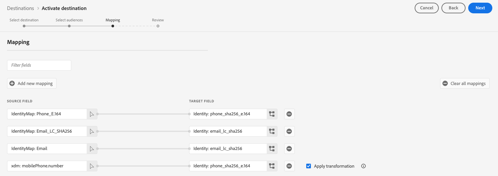

# [!DNL Google Customer Match + Display & Video 360] 接続

この宛先を使用して、ファーストパーティ PII ベースをアクティブ化します [[!DNL Google Customer Match]](https://support.google.com/google-ads/answer/6379332?hl=en) に直接リストします [!DNL Google Display & Video 360] 次のようなプロパティ [!DNL Search], [!DNL YouTube], [!DNL Gmail]、および [!DNL Google Display Network].

Adobe Real-Time CDPなど、Googleと統合された特定のサードパーティは、 [!DNL Google Audience Partner API] 作成対象 [!DNL Customer Match] 顧客のオーディエンスに直接 [!DNL Display & Video 360] アカウント。

新たに導入した機能により、 [!DNL Customer Matched] オーディエンスの範囲 [!DNL Display & Video 360]を使用して、インベントリソースの幅広いリストにわたってオーディエンスをターゲットに設定できるようになりました。

>[!IMPORTANT]
>
>この宛先コネクタはベータ版で、一部のお客様のみご利用いただけます。 アクセス権をリクエストするには、Adobe担当者にお問い合わせください。

## 欧州連合（EU）での同意要件の更新に関連するGoogleの宛先の変更に関する重要な通知

>[!IMPORTANT]
>
> Googleは、に対する変更をリリースしています [Google広告 API](https://developers.google.com/google-ads/api/docs/start), [カスタマーマッチ](https://ads-developers.googleblog.com/2023/10/updates-to-customer-match-conversion.html)、および [ディスプレイおよびビデオ 360 API](https://developers.google.com/display-video/api/guides/getting-started/overview) に基づいて定義されるコンプライアンスおよび同意関連の要件をサポートするため [デジタル市場法](https://digital-markets-act.ec.europa.eu/index_en) （DMA）の適用（[EU ユーザー同意ポリシー](https://www.google.com/about/company/user-consent-policy/)）に設定します。 同意要件に対するこれらの変更の適用は 2024 年 3 月 6 日（PT）から開始されます。
> 
>EU のユーザー同意ポリシーに準拠し、欧州経済領域（EEA）のユーザーに対するオーディエンスリストの作成を続行するには、広告主およびパートナーは、オーディエンスデータをアップロードする際にエンドユーザーの同意を渡していることを確認する必要があります。 Google パートナーとして、Adobeは、欧州連合の DMA に基づくこれらの同意要件に準拠するために必要なツールを提供します。
> 
>Adobeのプライバシーとセキュリティシールドを購入し、 [同意ポリシー](../../../data-governance/enforcement/auto-enforcement.md#consent-policy-evaluation) 同意されていないプロファイルを除外するには、何もする必要はありません。
> 
>Adobeプライバシーおよびセキュリティシールドを購入していないお客様は、を使用する必要があります [セグメント定義](../../../segmentation/home.md#segment-definitions) 内の機能 [セグメントビルダー](../../../segmentation/ui/segment-builder.md) 中断することなく既存のReal-Time CDP Google宛先を引き続き使用するために、同意されていないプロファイルを除外します。

## この宛先を使用するタイミング

宛先カタログではGoogleとのいくつかの統合機能を利用できます。使用可能な各Google宛先を使用するタイミングを理解するのは難しい場合があります。 次の表の情報を読んで、様々なユースケースを理解します。

| [Google カスタマーマッチ](/help/destinations/catalog/advertising/google-customer-match.md) | [Google Display と Video 360](/help/destinations/catalog/advertising/google-dv360.md) | [!DNL Google Customer Match] + [!DNL Display & Video 360] （このコネクタ） |
|---------|----------|---------|
| PII ベースのオーディエンスを書き出し、で使用可能な在庫で到達する [!DNL Google Customer Match]. | を介して利用可能なインベントリ全体で cookie ベースのオーディエンスに到達する [!DNL Google Display & Video 360]Google :Youtube や [!DNL Search]、およびそれ以降。 | で PII ベースのオーディエンスを作成 [!DNL Google Customer Match] で利用可能なインベントリにアクセスします。 [!DNL Google Display & Video 360]（Googleが所有および運営するプロパティのみ）。 |

## ユースケース {#use-cases}

この宛先を使用する方法とタイミングをより深く理解するために、Adobe Experience Platformのお客様がこの機能を使用して解決できるユースケースのサンプルを以下に示します。

### のユースケース#1

アスレチックアパレルブランドは、次を通じて既存の顧客にリーチしたいと考えています [!DNL Google Search] および [!DNL Google Shopping] 過去の購入とブラウジング履歴に基づいてオファーと項目をパーソナライズする。 アパレルブランドは、メールアドレスを独自の CRM からExperience Platformに取り込み、独自のオフラインデータからオーディエンスを作成できます。 その後、オーディエンスをに送信できます。 [!DNL Google Customer Match + Display & Video 360] 全体で使用される宛先 [!DNL Google Display & Video 360] 次のようなプロパティ [!DNL Search], [!DNL YouTube], [!DNL Gmail]、および [!DNL Google Display Network].

### のユースケース#2

ある有名なテクノロジー会社が新しい電話を発売しました。 この新しい電話モデルを宣伝するために、彼らは電話の新機能と機能を彼らの電話の以前のモデルを所有しているお客様に認識を高めることを目指しています。

リリースを促進するために、メールアドレスを識別子として使用して、CRM データベースからExperience Platformにメールアドレスをアップロードします。 オーディエンスは、古い電話モデルを所有する顧客に基づいて作成されます。 その後、オーディエンスはに送信されます [!DNL Google Customer Match]を使用すると、現在の顧客、古いモデルの電話を所有する顧客など、に類似する顧客をターゲットにすることができます [!DNL Google Display & Video 360] 次のようなプロパティ [!DNL Search], [!DNL YouTube], [!DNL Gmail]、および [!DNL Google Display Network].

## サポートされている ID {#supported-identities}

[!DNL Google Customer Match] では、以下の表で説明する ID のアクティブ化をサポートしています。 [ID](/help/identity-service/features/namespaces.md) についての詳細情報。

| ターゲット ID | 説明 | 注意点 |
|---|---|---|
| phone_sha256_e.164 | SHA256 アルゴリズムでハッシュ化された E164 形式の電話番号 | Adobe Experience Platform では、プレーンテキストと SHA256 でハッシュ化された電話番号の両方がサポートされています。の指示に従います [ID の一致要件](#id-matching-requirements-id-matching-requirements) およびは、プレーンテキストとハッシュ化された電話番号に適した名前空間をそれぞれ使用します。 ハッシュ化されていない属性がソースフィールドに含まれている場合は、「**[!UICONTROL 変換を適用]**」オプションをオンにして、アクティブ化時に [!DNL Platform] がデータを自動的にハッシュ化するように設定します。 |
| email_lc_sha256 | SHA256 アルゴリズムでハッシュ化されたメールアドレス | Adobe Experience Platform では、プレーンテキストと SHA256 でハッシュ化されたメールアドレスの両方がサポートされています。の指示に従います [ID の一致要件](#id-matching-requirements-id-matching-requirements) およびは、プレーンテキストとハッシュ化されたメールアドレスに適した名前空間をそれぞれ使用します。 ハッシュ化されていない属性がソースフィールドに含まれている場合は、「**[!UICONTROL 変換を適用]**」オプションをオンにして、アクティブ化時に [!DNL Platform] がデータを自動的にハッシュ化するように設定します。 |

{style="table-layout:auto"}

<!-- not supported in beta

|GAID|Google Advertising ID|Select this target identity when your source identity is a GAID namespace.|
|IDFA|Apple ID for Advertisers|Select this target identity when your source identity is an IDFA namespace.|
|user_id|Custom user IDs|Select this target identity when your source identity is a custom namespace.| 

-->

## サポートされるオーディエンス {#supported-audiences}

この節では、この宛先に書き出すことができるオーディエンスのタイプについて説明します。

| オーディエンスオリジン | サポートあり | 説明 |
|---------|----------|----------|
| [!DNL Segmentation Service] | ✓ | Experience Platformを通じて生成されたオーディエンス [セグメント化サービス](../../../segmentation/home.md). |
| カスタムアップロード | ✓ | CSV ファイルから Experience Platform に[読み込まれた](../../../segmentation/ui/audience-portal.md#import-audience)オーディエンス。 |

{style="table-layout:auto"}

## 書き出しのタイプと頻度 {#export-type-frequency}

宛先の書き出しのタイプと頻度について詳しくは、以下の表を参照してください。

| 項目 | タイプ | メモ |
---------|----------|---------|
| 書き出しタイプ | **[!UICONTROL オーディエンスの書き出し]** | で使用される識別子（名前、電話番号など）を使用して、オーディエンスのすべてのメンバーを書き出します [!DNL Google Customer Match] の宛先。 |
| 書き出し頻度 | **[!UICONTROL ストリーミング]** | ストリーミングの宛先は常に、API ベースの接続です。オーディエンス評価に基づいて Experience Platform 内でプロファイルが更新されるとすぐに、コネクタは更新を宛先プラットフォームに送信します。[ストリーミングの宛先](/help/destinations/destination-types.md#streaming-destinations)の詳細についてはこちらを参照してください。 |

{style="table-layout:auto"}

## [!DNL Google Customer Match] アカウントの前提条件 {#google-account-prerequisites}

の設定前に [!DNL Google Customer Match] 宛先Experience Platformで、を使用するGoogleのポリシーを読み、遵守してください [!DNL Customer Match]、で説明されています [Google サポートドキュメント](https://support.google.com/google-ads/answer/6299717).

次に、 [!DNL Google] アカウントはに対して設定されています [!DNL Standard] 以上の権限レベル。 を参照してください。 [Google Ads ドキュメント](https://support.google.com/google-ads/answer/9978556?visit_id=637611563637058259-4176462731&amp;rd=1) を参照してください。

### 許可リスト {#allowlist}

を作成する前に [!DNL Google Customer Match] Experience Platformの宛先、必ずを使用してください [!DNL Google Ads] アカウントはに準拠しています [[!DNL Google Customer Match] 保険証書](https://support.google.com/google-ads/answer/6299717/customer-match-policy).

準拠しているアカウントを持つお客様は、Googleによって自動的に許可リストに加えるされます。

## ID の一致要件 {#id-matching-requirements}

[!DNL Google] では、個人を特定できる情報（PII）を明確に送信しないようにする必要があります。 したがって、オーディエンスはに対してアクティブ化されました [!DNL Google Customer Match] キーオフする必要があります *ハッシュ化* 識別子（ハッシュ化されたメールアドレスや電話番号など）。

Adobe Experience Platformに取り込む ID のタイプに応じて、対応する要件に従う必要があります。

### 電話番号のハッシュ要件 {#phone-number-hashing-requirements}

で電話番号を有効にする方法は 2 つあります [!DNL Google Customer Match]:

* **生の電話番号の取り込み**：で生の電話番号を取り込むことができます [!DNL E.164] フォーマット先 [!DNL Platform]、アクティブ化時に自動的にハッシュ化されます。 このオプションを選択した場合は、必ず生の電話番号をに取り込んでください `Phone_E.164` 名前空間。
* **ハッシュ化された電話番号の取り込み**：に取り込む前に、電話番号を事前にハッシュ化できます [!DNL Platform]. このオプションを選択した場合は、ハッシュ化された電話番号を常にに取り込んでください `PHONE_SHA256_E.164` 名前空間。

>[!NOTE]
>
>に取り込まれた電話番号 `Phone` に対して名前空間をアクティブ化できません [!DNL Google Customer Match + DV360] の宛先。

### メールハッシュ要件 {#hashing-requirements}

メールアドレスをAdobe Experience Platformに取り込む前にハッシュ化したり、メールアドレスをExperience Platformで明確に使用したりできます。 [!DNL Platform] アクティブ化時にハッシュ化します。

Googleのハッシュ要件およびその他のアクティベーションに関する制限事項について詳しくは、Googleのドキュメントの次の節を参照してください。

* [[!DNL Customer Match] メールアドレス、アドレスまたはユーザー ID を使用](https://developers.google.com/google-ads/api/docs/remarketing/audience-types/customer-match#customer_match_with_email_address_address_or_user_id)
* [[!DNL Customer Match] 検討事項](https://developers.google.com/google-ads/api/docs/remarketing/audience-types/customer-match#customer_match_considerations)
* [[!DNL Customer Match] （電話番号を使用）](https://developers.google.com/google-ads/api/docs/remarketing/audience-types/customer-match#customer_match_with_phone_number)
* [[!DNL Customer Match] モバイルデバイス ID を使用](https://developers.google.com/google-ads/api/docs/remarketing/audience-types/customer-match#customer_match_with_mobile_device_ids)

Experience Platformでのメールアドレスの取り込みについては、以下を参照してください [バッチ取り込みの概要](../../../ingestion/batch-ingestion/overview.md) および [ストリーミング取得の概要](../../../ingestion/streaming-ingestion/overview.md).

メールアドレスを自分でハッシュ化する場合は、上記のリンクで概説されているGoogleの要件に必ず準拠してください。

<!-- ### Using custom namespaces {#custom-namespaces}

Before you can use the `User_ID` namespace to send data to Google, make sure you synchronize your own identifiers using [!DNL gTag]. Refer to the [Google official documentation](https://support.google.com/google-ads/answer/9199250) for detailed information. -->

<!-- Data from unhashed namespaces is automatically hashed by [!DNL Platform] upon activation.

Attribute source data is not automatically hashed. When your source field contains unhashed attributes, check the **[!UICONTROL Apply transformation]** option, to have [!DNL Platform] automatically hash the data on activation.
 -->

<!-- ## Configure destination - video walkthrough {#video}

The video below demonstrates the steps to configure a [!DNL Google Customer Match] destination and activate audiences. The steps are also laid out sequentially in the next sections.

>[!VIDEO](https://video.tv.adobe.com/v/332599/?quality=12&learn=on&captions=eng) -->

## 宛先への接続 {#connect}

>[!IMPORTANT]
> 
>宛先に接続するには、 **[!UICONTROL 宛先の表示]** および **[!UICONTROL 宛先の管理]** [アクセス制御権限](/help/access-control/home.md#permissions). [アクセス制御の概要](/help/access-control/ui/overview.md)を参照するか、製品管理者に問い合わせて必要な権限を取得してください。

この宛先に接続するには、[宛先設定のチュートリアル](../../ui/connect-destination.md)の手順に従ってください。

### 接続パラメーター {#parameters}

この宛先を[設定](../../ui/connect-destination.md)するとき、次の情報を指定する必要があります。

* **[!UICONTROL 名前]**：この宛先接続の名前を指定します
* **[!UICONTROL 説明]**：この宛先接続の説明を入力
* **[!UICONTROL アカウント ID]**：自分 [Google Ads 顧客 ID](https://support.google.com/google-ads/answer/1704344?hl=en). ID の形式は xxx-xxx-xxxx です。 を使用する場合 [!DNL Google Ads Manager Account (My Client Center)]マネージャーのアカウント ID は使用しないでください。 の使用 [Google Ads 顧客 ID](https://support.google.com/google-ads/answer/1704344?hl=en) その代わり。
* **[!UICONTROL アカウントタイプ]**:Google アカウントのタイプ。 Googleでの広告アカウントの種類に応じて、次のいずれかのオプションを選択します。
   * **[!UICONTROL ビデオ パートナーの表示]**
   * **[!UICONTROL ビデオ広告主を表示]**

### アラートの有効化 {#enable-alerts}

アラートを有効にすると、宛先へのデータフローのステータスに関する通知を受け取ることができます。リストからアラートを選択して、データフローのステータスに関する通知を受け取るよう登録します。アラートについて詳しくは、[UI を使用した宛先アラートの購読](../../ui/alerts.md)についてのガイドを参照してください。

宛先接続の詳細の入力を終えたら「**[!UICONTROL 次へ]**」を選択します。

## この宛先に対してオーディエンスをアクティブ化 {#activate}

>[!IMPORTANT]
> 
>* データをアクティブ化するには、 **[!UICONTROL 宛先の表示]**, **[!UICONTROL 宛先のアクティブ化]**, **[!UICONTROL プロファイルの表示]**、および **[!UICONTROL セグメントの表示]** [アクセス制御権限](/help/access-control/home.md#permissions). [アクセス制御の概要](/help/access-control/ui/overview.md)を参照するか、製品管理者に問い合わせて必要な権限を取得してください。
>* エクスポートする *id* 宛先には、 **[!UICONTROL ID グラフの表示]** [アクセス制御権限](/help/access-control/home.md#permissions).   {width="100" zoomable="yes"}

この宛先にオーディエンスをアクティブ化する手順については、[ストリーミングオーディエンス書き出し宛先に対するオーディエンスデータのアクティブ化](../../ui/activate-segment-streaming-destinations.md)を参照してください。

<!-- In the **[!UICONTROL Segment schedule]** step, you must provide the [!UICONTROL App ID] when sending [!DNL IDFA] or [!DNL GAID] audiences to [!DNL Google Customer Match].

For details on how to find the [!DNL App ID], refer to the [Google official documentation](https://developers.google.com/adwords/api/docs/reference/v201809/AdwordsUserListService.CrmBasedUserList#appid) or ask your Google representative. -->

### マッピング例：でのオーディエンスデータのアクティブ化 [!DNL Google Customer Match + Display & Video 360] {#example-gcm}

これは、でオーディエンスデータをアクティブ化する際の、正しい ID マッピングの例です。 [!DNL Google Customer Match + Display & Video 360].

ソースフィールドを選択中：

* 「」を選択します `Email` 使用しているメールアドレスがハッシュ化されていない場合の、ソース id としての名前空間。
* 「」を選択します `Email_LC_SHA256` へのデータ取り込み時に顧客のメールアドレスをハッシュ化した場合のソース id としての名前空間 [!DNL Platform]に従う [!DNL Google Customer Match] [メールハッシュ要件](#hashing-requirements).
* 「」を選択します `PHONE_E.164` ハッシュ化されていない電話番号でデータが構成されている場合、ソース id としての名前空間。 [!DNL Platform] は準拠する電話番号をハッシュ化します [!DNL Google Customer Match] 要件
* 「」を選択します `Phone_SHA256_E.164` へのデータ取り込みで電話番号をハッシュ化した場合のソース ID としての名前空間 [!DNL Platform]に従う [!DNL Facebook] [電話番号のハッシュ要件](#phone-number-hashing-requirements).

ターゲットフィールドを選択：

* 「」を選択します `Email_LC_SHA256` ソース名前空間が次のいずれかである場合の、ターゲット id としての名前空間 `Email` または `Email_LC_SHA256`.
* 「」を選択します `Phone_SHA256_E.164` ソース名前空間が次のいずれかである場合の、ターゲット id としての名前空間 `PHONE_E.164` または `Phone_SHA256_E.164`.

ハッシュ化されていない名前空間のデータは、によって自動的にハッシュ化されます [!DNL Platform] アクティブ化時。

属性ソースデータは、自動的にはハッシュ化されません。 ハッシュ化されていない属性がソースフィールドに含まれている場合は、「**[!UICONTROL 変換を適用]**」オプションをオンにして、アクティブ化時に [!DNL Platform] がデータを自動的にハッシュ化するように設定します。

## Audience Activation が成功したことの確認 {#verify-activation}

アクティベーションフローが完了したら、 **[!UICONTROL Google広告]** アカウント。 アクティブ化されたオーディエンスは、Google アカウントに顧客リストとして表示されます。 オーディエンスサイズによっては、提供するアクティブユーザーが 1000 人以上でない限り、一部のオーディエンスが入力されない場合があります。 詳しくは、を参照してください。 [Google Audience パートナードキュメント](https://developers.google.com/audience-partner/api/docs/customer-match/get-started#verify-list). リンク内のドキュメントにアクセスするには、Googleに問い合わせる必要があります。

## データガバナンス

Experience Platformの一部の宛先には、宛先プラットフォームに送信される、または宛先プラットフォームから受信されるデータに対する特定のルールと義務があります。 お客様は、お客様のデータの制限事項や義務を理解し、Adobe Experience Platformおよび宛先プラットフォームでのデータの使用方法を理解する責任を負います。 Adobe Experience Platformには、これらのデータ使用義務の一部を管理するのに役立つデータガバナンスツールが用意されています。 [詳細情報](../../../data-governance/labels/overview.md) データガバナンスツールとポリシーについて

## トラブルシューティング {#troubleshooting}

### 400 Bad Request エラーメッセージ {#bad-request}

この宛先を設定する際に、次のエラーが発生する場合があります。

`{"message":"Google Customer Match Error: OperationAccessDenied.ACTION_NOT_PERMITTED","code":"400 BAD_REQUEST"}`

このエラーは、カスタマーアカウントが準拠していない場合に発生します [前提条件](#google-account-prerequisites). この問題を修正するには、Googleに連絡して、お使いのアカウントが許可リストに登録され、に対応するよう設定されていることを確認してください [!DNL Standard] 以上の権限レベル。 を参照してください。 [Google Ads ドキュメント](https://support.google.com/google-ads/answer/9978556?visit_id=637611563637058259-4176462731&amp;rd=1) を参照してください。
