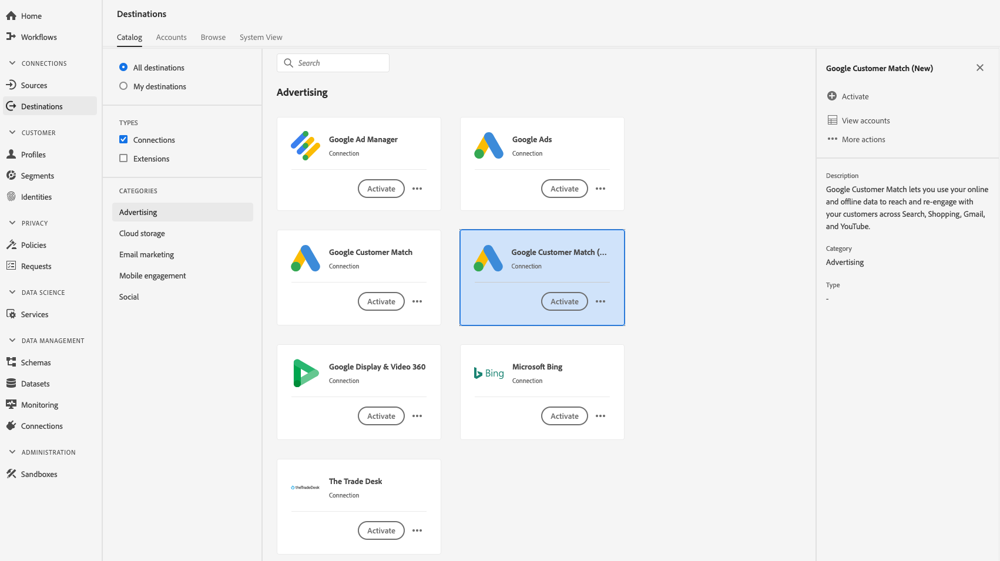
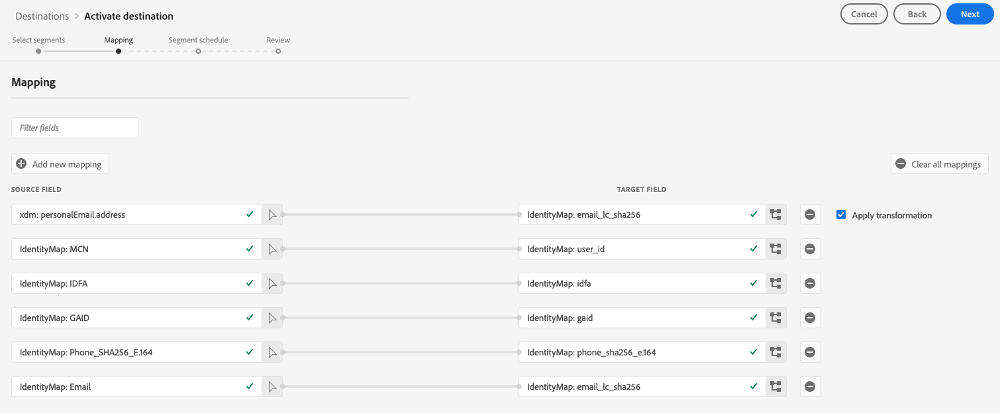
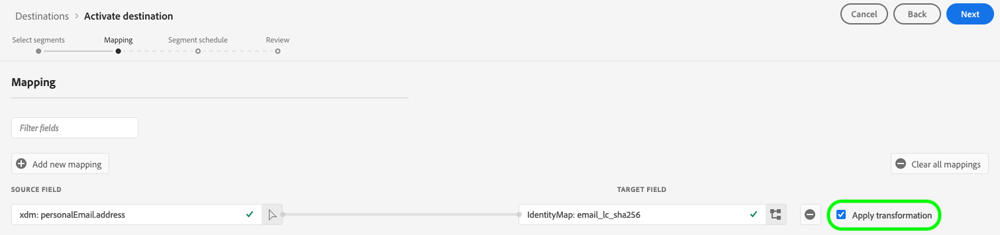

# [!DNL Google Customer Match] 接続

>[!IMPORTANT]
>
> Googleは、欧州連合（[EU ユーザーの同意ポリシー](https://developers.google.com/google-ads/api/docs/start)）の[ デジタル市場法](https://ads-developers.googleblog.com/2023/10/updates-to-customer-match-conversion.html) （DMA）で定義されているコンプライアンスと同意に関する要件をサポートするために、[Google Ads API](https://developers.google.com/display-video/api/guides/getting-started/overview)、[Customer Match](https://digital-markets-act.ec.europa.eu/index_en)、および[Display &amp; Video 360 API](https://www.google.com/about/company/user-consent-policy/)に対する変更をリリースしています。 これらの変更の同意要件への適用は、2024年3月6日現在で有効です。
> 
>EUのユーザー同意方針に準拠し、欧州経済地域（EEA）のユーザーに対してオーディエンスリストの作成を継続するには、広告主とパートナーは、オーディエンスデータをアップロードする際に、エンドユーザーの同意を確実に渡す必要があります。 Adobeは、Googleパートナーとして、欧州連合のDMAに基づく同意要件に準拠するために必要なツールを提供します。
> 
>Adobe Privacy &amp; Security Shieldを購入し、同意のないプロファイルを除外するように[同意ポリシー](../../../data-governance/enforcement/auto-enforcement.md#consent-policy-evaluation)を設定しているお客様は、何らかの操作を行う必要はありません。
> 
>Adobe Privacy &amp; Security Shieldを購入していないお客様は、既存の[ Google宛先を中断なく引き続き使用するために、同意のないプロファイルを除外するために、](../../../segmentation/home.md#segment-definitions) セグメントビルダー[内の](../../../segmentation/ui/segment-builder.md) セグメント定義[!DNL Real-Time CDP]機能を使用する必要があります。

[[!DNL Google Customer Match]](https://support.google.com/google-ads/answer/6379332?hl=en)は、オンラインとオフラインのデータを使用して、次のようなGoogleの所有および運営されているプロパティで顧客にリーチし、リエンゲージメントします：[!DNL Search]、[!DNL Shopping]、および[!DNL Gmail]。

>[!TIP]
>
>[!DNL YouTube]のインベントリで顧客にリーチするには、[Google Customer Match + DV360](/help/destinations/catalog/advertising/google-customer-match-dv360.md)の宛先を使用します。この宛先は、Google Audience Partner APIを使用します。

## ユースケース {#use-cases}

[!DNL Google Customer Match]宛先を使用する方法とタイミングをより深く理解するために、[!DNL Adobe Experience Platform]のお客様がこの機能を使用して解決できるユースケースの例を次に示します。

### ユースケース #1 {#use-case-1}

スポーツ衣料品ブランドが、[!DNL Google Search]と[!DNL Google Shopping]を通じて既存顧客にリーチし、過去の購入履歴や閲覧履歴にもとづいてオファーや商品をパーソナライズしたいと考えています。 アパレル企業は、自社のCRMからAdobe Experience Platformにメールアドレスを取り込み、そのオフラインデータからオーディエンスを構築することができます。 次に、これらのオーディエンスを[!DNL Google Customer Match]に送信して[!DNL Search]と[!DNL Shopping]全体で使用し、広告費を最適化できます。

### ユースケース #2 {#use-case-2}

>[!TIP]
>
>このユースケースを[!DNL YouTube] インベントリで実行するには、Google Audience Partner APIを使用する新しい[Google Customer Match + DV360](/help/destinations/catalog/advertising/google-customer-match-dv360.md)宛先を使用します。

ある大手テクノロジー企業が新しい携帯電話を発売しました。 この新しい携帯電話モデルを宣伝するために、彼らは携帯電話の以前のモデルを所有している顧客に携帯電話の新機能と機能の認識を促進することを目指しています。

リリースを促進するために、CRM データベースからExperience Platformにメールアドレスをアップロードし、そのメールアドレスをIDとして使用します。 オーディエンスは、古いモデルの所有者に基づいて作成されます。 その後、オーディエンスが[!DNL Google Customer Match]に送信されるので、現在の顧客、古い電話モデルを所有している顧客、および[!DNL YouTube]上の類似の顧客をターゲットにすることができます。

## [!DNL Google Customer Match]宛先のデータガバナンス {#data-governance}

Experience Platformの一部の宛先には、宛先プラットフォームに送信または受信したデータに対して特定のルールと義務があります。 お客様は、お客様のデータの制限と義務、および[!DNL Adobe Experience Platform]とその宛先プラットフォームでのデータの使用方法を理解する責任があります。 [!DNL Adobe Experience Platform]には、これらのデータ使用義務の一部を管理するのに役立つデータ ガバナンス ツールが用意されています。 データガバナンスツールとポリシーについて[詳細](../../../data-governance/labels/overview.md)を見る。

## サポートされている ID {#supported-identities}

[!DNL Google Customer Match]は、次の表に示すIDのアクティブ化をサポートしています。 [ID](/help/identity-service/features/namespaces.md) についての詳細情報。

| ターゲット ID | 説明 | 注意点 |
|---|---|---|
| `GAID` | GOOGLE ADVERTISING ID | ソース ID が GAID 名前空間の場合は、このターゲット ID を選択します。 |
| `IDFA` | Apple の広告主 ID | ソース ID が IDFA 名前空間の場合は、このターゲット ID を選択します。 |
| `phone_sha256_e.164` | SHA256 アルゴリズムでハッシュ化されたE164形式の電話番号 | プレーンテキストとSHA256 ハッシュ化された電話番号の両方が[!DNL Adobe Experience Platform]でサポートされています。 「[IDに一致する要件](#id-matching-requirements-id-matching-requirements)」セクションの手順に従い、プレーンテキストとハッシュ化された電話番号にそれぞれ適切な名前空間を使用します。 ソースフィールドにハッシュ化されていない属性が含まれている場合は、**[!UICONTROL Apply transformation]** オプションをチェックして、[!DNL Experience Platform]がアクティベーション時にデータを自動的にハッシュします。 |
| `email_lc_sha256` | SHA256 アルゴリズムでハッシュ化されたメールアドレス | プレーンテキストとSHA256 ハッシュ化された電子メールアドレスの両方が[!DNL Adobe Experience Platform]でサポートされています。 「[IDに一致する要件](#id-matching-requirements-id-matching-requirements)」セクションの手順に従い、プレーンテキストとハッシュ化された電子メールアドレスにそれぞれ適切な名前空間を使用します。 ソースフィールドにハッシュ化されていない属性が含まれている場合は、**[!UICONTROL Apply transformation]** オプションをチェックして、[!DNL Experience Platform]がアクティベーション時にデータを自動的にハッシュします。 |
| `user_id` | カスタムユーザーID | ソース IDがカスタム名前空間である場合は、このターゲット IDを選択します。 |
| `address_info_first_name` | ユーザーの名 | このターゲット IDは、`address_info_last_name`、`address_info_country_code`、`address_info_postal_code`と共に、宛先に郵送先住所データを送信する場合に使用します。   Googleがアドレスと一致するように、4つのアドレスフィールド （`address_info_first_name`、`address_info_last_name`、`address_info_country_code`、および`address_info_postal_code`）をすべてマッピングし、これらのフィールドが書き出されたプロファイルのデータを欠落していないことを確認する必要があります。  いずれかのフィールドがマッピングされていないか、不足しているデータが含まれている場合、Googleはアドレスと一致しません。 |
| `address_info_last_name` | ユーザーの姓 | このターゲット IDは、`address_info_first_name`、`address_info_country_code`、`address_info_postal_code`と共に、宛先に郵送先住所データを送信する場合に使用します。   Googleがアドレスと一致するように、4つのアドレスフィールド （`address_info_first_name`、`address_info_last_name`、`address_info_country_code`、および`address_info_postal_code`）をすべてマッピングし、これらのフィールドが書き出されたプロファイルのデータを欠落していないことを確認する必要があります。  いずれかのフィールドがマッピングされていないか、不足しているデータが含まれている場合、Googleはアドレスと一致しません。 |
| `address_info_country_code` | ユーザーアドレスの国コード | このターゲット IDは、`address_info_first_name`、`address_info_last_name`、`address_info_postal_code`と共に、宛先に郵送先住所データを送信する場合に使用します。   Googleがアドレスと一致するように、4つのアドレスフィールド （`address_info_first_name`、`address_info_last_name`、`address_info_country_code`、および`address_info_postal_code`）をすべてマッピングし、これらのフィールドが書き出されたプロファイルのデータを欠落していないことを確認する必要があります。  いずれかのフィールドがマッピングされていないか、不足しているデータが含まれている場合、Googleはアドレスと一致しません。   使用可能な形式：小文字の2文字の国コード （ISO 3166-1 alpha-2[形式）。](https://en.wikipedia.org/wiki/ISO_3166-1_alpha-2) |
| `address_info_postal_code` | ユーザーの住所の郵便番号 | このターゲット IDは、`address_info_first_name`、`address_info_last_name`、`address_info_country_code`と共に、宛先に郵送先住所データを送信する場合に使用します。   Googleがアドレスと一致するように、4つのアドレスフィールド （`address_info_first_name`、`address_info_last_name`、`address_info_country_code`、および`address_info_postal_code`）をすべてマッピングし、これらのフィールドが書き出されたプロファイルのデータを欠落していないことを確認する必要があります。  いずれかのフィールドがマッピングされていないか、不足しているデータが含まれている場合、Googleはアドレスと一致しません。 |

{style="table-layout:auto"}

## サポートされるオーディエンス {#supported-audiences}

この節では、この宛先に書き出すことができるオーディエンスのタイプについて説明します。

| オーディエンスの由来 | サポートあり | 説明 |
|---------|----------|----------|
| [!DNL Segmentation Service] | ○ | Experience Platform [ セグメント化サービス ](../../../segmentation/home.md)を通じて生成されたオーディエンス。 |
| その他すべてのオーディエンスの生成元 | ○ | このカテゴリには、[!DNL Segmentation Service]を通じて生成されたオーディエンス以外のすべてのオーディエンスのオリジンが含まれます。 [様々なオーディエンスの起源](/help/segmentation/ui/audience-portal.md#customize)について読みます。 次に例を示します。 <ul><li> カスタムアップロードオーディエンス [がCSV ファイルからExperience Platformに](../../../segmentation/ui/audience-portal.md#import-audience)をインポートしました。</li><li> 類似オーディエンス， </li><li> 連合オーディエンス， </li><li> [!DNL Adobe Journey Optimizer]などの他のExperience Platform アプリで生成されたオーディエンス </li><li> その他。 </li></ul> |

{style="table-layout:auto"}

オーディエンスのデータタイプ別にサポートされるオーディエンス：

| オーディエンスのデータタイプ | サポートあり | 説明 | ユースケース |
|--------------------|-----------|-------------|-----------|
| [人物オーディエンス ](/help/segmentation/types/people-audiences.md) | ○ | 顧客プロファイルにもとづいて、マーケティング施策の特定のグループをターゲットにすることができます。 | 買い物客やカートの放棄が多い |
| [ アカウントオーディエンス ](/help/segmentation/types/account-audiences.md) | × | アカウントベースドマーケティング戦略のために、特定の組織内の個人をターゲットにします。 | B2B マーケティング |
| [見込みオーディエンス ](/help/segmentation/types/prospect-audiences.md) | × | まだ顧客ではないが、ターゲットオーディエンスと特徴を共有する個人をターゲットにします。 | サードパーティデータによる見込み顧客の開拓 |
| [ データセットの書き出し](/help/catalog/datasets/overview.md) | × | [!DNL Adobe Experience Platform] データ レイクに保存されている構造化データのコレクション。 | レポート，データサイエンスワークフロー |

{style="table-layout:auto"}

## 書き出しのタイプと頻度 {#export-type-frequency}

宛先の書き出しのタイプと頻度について詳しくは、以下の表を参照してください。

| 項目 | タイプ | メモ |
|---------|----------|---------|
| 書き出しタイプ | **[!UICONTROL Audience export]** | [!DNL Google Customer Match]宛先で使用されている識別子（名前、電話番号など）を持つオーディエンスのすべてのメンバーを書き出します。 |
| 書き出し頻度 | **[!UICONTROL Streaming]** | ストリーミングの宛先は常に、API ベースの接続です。オーディエンス評価に基づいて Experience Platform 内でプロファイルが更新されるとすぐに、コネクタは更新を宛先プラットフォームに送信します。[ストリーミングの宛先](/help/destinations/destination-types.md#streaming-destinations)の詳細についてはこちらを参照してください。 |

{style="table-layout:auto"}

## [!DNL Google Customer Match] アカウントの前提条件 {#google-account-prerequisites}

Experience Platformで[!DNL Google Customer Match]の宛先を設定する前に、[!DNL Customer Match]Google サポート ドキュメント [に記載されている](https://support.google.com/google-ads/answer/6299717)の使用に関するGoogleのポリシーを必ずお読みください。

次に、[!DNL Google] アカウントが[!DNL Standard]以上の権限レベルに設定されていることを確認します。 詳しくは、[Google広告ドキュメント ](https://support.google.com/google-ads/answer/9978556?visit_id=637611563637058259-4176462731&rd=1)を参照してください。

### 許可リスト {#allowlist}

Experience Platformで[!DNL Google Customer Match]宛先を作成する前に、[!DNL Google Ads] アカウントが[[!DNL Google Customer Match]  ポリシー](https://support.google.com/google-ads/answer/6299717/customer-match-policy)に準拠していることを確認してください。

コンプライアンスを遵守しているアカウントを持つお客様には、Googleが自動的に許可リストに加えるします。

## ID一致の要件 {#id-matching-requirements}

[!DNL Google]では、個人を特定できる情報（PII）が明確に送信されていないことが必要です。 したがって、[!DNL Google Customer Match]にアクティブ化されたオーディエンスは、電子メールアドレスや電話番号などの&#x200B;*ハッシュ*&#x200B;識別子にキーを設定できます。

[!DNL Adobe Experience Platform]に取り込むIDの種類に応じて、対応する要件を遵守する必要があります。

### 電話番号のハッシュ要件 {#phone-number-hashing-requirements}

[!DNL Google Customer Match]で電話番号をアクティブ化するには、次の2つの方法があります。

* **未加工の電話番号を取り込む**: [!DNL E.164]形式の未加工の電話番号を[!DNL Experience Platform]に取り込むことができ、アクティベーション時に自動的にハッシュ化されます。 このオプションを選択した場合は、必ず未加工の電話番号を`Phone_E.164`名前空間に取り込んでください。
* **ハッシュ化された電話番号の取り込み**: [!DNL Experience Platform]に取り込む前に、電話番号を事前にハッシュ化できます。 このオプションを選択した場合は、ハッシュ化された電話番号を常に`PHONE_SHA256_E.164`名前空間に取り込んでください。

>[!NOTE]
>
>`Phone`名前空間に取り込まれた電話番号は、[!DNL Google Customer Match]ではアクティブ化できません。

### メールハッシュ要件 {#hashing-requirements}

メールアドレスを[!DNL Adobe Experience Platform]に取り込む前にハッシュ化するか、Experience Platformでクリアなメールアドレスを使用して、アクティベーション時に[!DNL Experience Platform]個ハッシュ化します。

Googleのハッシュ要件とアクティベーションに関するその他の制限について詳しくは、Google ドキュメントの次の節を参照してください。

* [[!DNL Customer Match] 電子メールアドレス、アドレス、またはユーザーID](https://developers.google.com/google-ads/api/docs/remarketing/audience-types/customer-match#customer_match_with_email_address_address_or_user_id)
* [[!DNL Customer Match] 考慮事項](https://developers.google.com/google-ads/api/docs/remarketing/audience-types/customer-match#customer_match_considerations)
* [[!DNL Customer Match] 電話番号](https://developers.google.com/google-ads/api/docs/remarketing/audience-types/customer-match#customer_match_with_phone_number)
* [[!DNL Customer Match]  モバイルデバイス ID](https://developers.google.com/google-ads/api/docs/remarketing/audience-types/customer-match#customer_match_with_mobile_device_ids)

Experience Platformでのメールアドレスの取り込みについて詳しくは、[ バッチ取り込みの概要](../../../ingestion/batch-ingestion/overview.md)および[ ストリーミング取り込みの概要](../../../ingestion/streaming-ingestion/overview.md)を参照してください。

自分でメールアドレスをハッシュ化することを選択した場合は、上記のリンクに記載されているGoogleの要件に準拠してください。

### アドレスフィールドハッシュ要件 {#address-field-hashing}

アドレス関連のフィールドを[!DNL Google Customer Match]にマッピングする場合、Experience Platform **は**&#x200B;と`address_info_first_name`の値を自動的に`address_info_last_name` ハッシュ化してからGoogleに送信します。 この自動ハッシュ処理は、Googleのセキュリティおよびプライバシー要件に準拠するために必要です。

**not**&#x200B;では、`address_info_first_name`または`address_info_last_name`に事前ハッシュ化された値を指定してください。 既にハッシュ化された値を指定した場合、一致するプロセスは失敗します。

### カスタム名前空間の使用 {#custom-namespaces}

`User_ID`名前空間を使用してGoogleにデータを送信する前に、[!DNL gTag]を使用して独自のIDを同期してください。 詳しくは、[Googleの公式ドキュメント ](https://support.google.com/google-ads/answer/9199250)を参照してください。

<!-- 
Data from unhashed namespaces is automatically hashed by [!DNL Experience Platform] upon activation.

Attribute source data is not automatically hashed. When your source field contains unhashed attributes, check the **[!UICONTROL Apply transformation]** option, to have [!DNL Experience Platform] automatically hash the data on activation.
 
-->

<!-- 
## Configure destination - video walkthrough {#video}

The video below demonstrates the steps to configure a [!DNL Google Customer Match] destination and activate audiences. The steps are also laid out sequentially in the next sections.

>[!VIDEO](https://video.tv.adobe.com/v/332599/?quality=12&learn=on&captions=eng) 
-->

## ビデオの概要 {#video-overview}

Google Customer Matchの利点とデータをアクティベートする方法については、次のビデオをご覧ください。

>[!VIDEO](https://video.tv.adobe.com/v/38180/)

## 宛先への接続 {#connect}

>[!IMPORTANT]
>
>宛先に接続するには、**[!UICONTROL View Destinations]**&#x200B;および&#x200B;**[!UICONTROL Manage Destinations]** [ アクセス制御権限](/help/access-control/home.md#permissions)が必要です。 [アクセス制御の概要](/help/access-control/ui/overview.md)を参照するか、製品管理者に問い合わせて必要な権限を取得してください。

この宛先に接続するには、[宛先設定のチュートリアル](../../ui/connect-destination.md)の手順に従ってください。

### 接続パラメーター {#parameters}

この宛先を[設定](../../ui/connect-destination.md)するとき、次の情報を指定する必要があります。

* **[!UICONTROL Name]**：この宛先接続の名前を指定してください
* **[!UICONTROL Description]**：この宛先接続の説明を入力してください
* **[!UICONTROL Account ID]**: [Google Adsのお客様ID](https://support.google.com/google-ads/answer/1704344?hl=en)。 IDの形式はxxx-xxx-xxxxです。 [!DNL Google Ads Manager Account (My Client Center)]を使用している場合は、マネージャーアカウント IDを使用しないでください。 代わりに、[Google Ads customer ID](https://support.google.com/google-ads/answer/1704344?hl=en)を使用してください。

>[!NOTE]
>
>OAuth2接続プロセス中に、「Marketo テスト」がGoogle OAuth プロジェクト名として表示される場合があります。 Adobeでは、このプロジェクト名をGoogle Customer Match統合に使用するので、これは通常の動作です。 これは、宛先設定には影響しません。

>[!IMPORTANT]
>
> * **[!UICONTROL Combine with PII]** マーケティングアクションは、[!DNL Google Customer Match]宛先に対してデフォルトで選択されており、削除できません。

### 認証と権限 {#authentication-permissions}

Google Ads アカウントを接続すると、Googleは、Adobe アプリケーションへのアクセス権を付与するよう求めるメッセージを表示します。 Adobeがカスタマーリストを作成および管理できるように、Google Ads API権限を承認する必要があります。 アクティベートする対象のお客様アカウントで、Standard以上のアクセス権を持つGoogle Ads ユーザーを使用します。 マネージャーアカウント（MCC）を使用している場合は、顧客アカウントのユーザーでログインし、顧客アカウント ID （MCC IDではなく）を指定します。

OAuth フロー中にGoogle Ads権限が付与されない場合、アクティベーションは後でGoogle Ads APIのエラーで失敗する可能性があります。 権限に関連するエラーを解決する方法について詳しくは、[ トラブルシューティングの節](#troubleshooting)を参照してください。

### アラートの有効化 {#enable-alerts}

アラートを有効にすると、宛先へのデータフローのステータスに関する通知を受け取ることができます。リストからアラートを選択して、データフローのステータスに関する通知を受け取るよう登録します。アラートについて詳しくは、[UI を使用した宛先アラートの購読](../../ui/alerts.md)についてのガイドを参照してください。

宛先接続の詳細の提供が完了したら、**[!UICONTROL Next]**&#x200B;を選択します。

## この宛先に対してオーディエンスをアクティブ化 {#activate}

>[!IMPORTANT]
>
>* データをアクティブ化するには、**[!UICONTROL View Destinations]**、**[!UICONTROL Activate Destinations]**、**[!UICONTROL View Profiles]**&#x200B;および&#x200B;**[!UICONTROL View Segments]** [ アクセス制御権限](/help/access-control/home.md#permissions)が必要です。 [アクセス制御の概要](/help/access-control/ui/overview.md)を参照するか、製品管理者に問い合わせて必要な権限を取得してください。
>* *ID*&#x200B;を宛先にエクスポートするには、**[!UICONTROL View Identity Graph]** [ アクセス制御権限](/help/access-control/home.md#permissions)が必要です。  {width="100" zoomable="yes"}

この宛先にオーディエンスをアクティブ化する手順については、[ストリーミングオーディエンス書き出し宛先に対するオーディエンスデータのアクティブ化](../../ui/activate-segment-streaming-destinations.md)を参照してください。

**[!UICONTROL Segment schedule]** ステップでは、[!UICONTROL App ID]または[!DNL IDFA] オーディエンスを[!DNL GAID]に送信する際に[!DNL Google Customer Match]を指定する必要があります。

アクティブ化ワークフローのセグメントスケジュール手順で、

[!DNL App ID]の検索方法について詳しくは、[Googleの公式ドキュメント ](https://developers.google.com/adwords/api/docs/reference/v201809/AdwordsUserListService.CrmBasedUserList#appid)を参照するか、Google担当者にお問い合わせください。

### マッピングの例：[!DNL Google Customer Match]でのオーディエンスデータのアクティブ化 {#example-gcm}

これは、[!DNL Google Customer Match]でオーディエンスデータをアクティブ化する際の正しいID マッピングの例です。

ソースフィールドの選択：

* 使用している電子メールアドレスがハッシュ化されていない場合は、`Email`名前空間をソース IDとして選択します。
* `Email_LC_SHA256` [!DNL Experience Platform]電子メールハッシュ要件[!DNL Google Customer Match]に従って、データ取り込み時に顧客の電子メールアドレスを[にハッシュ化した場合は、](#hashing-requirements)名前空間をソース IDとして選択します。
* データがハッシュ化されていない電話番号で構成されている場合は、ソース IDとして`PHONE_E.164`名前空間を選択します。 [!DNL Experience Platform]は、[!DNL Google Customer Match]要件に準拠するために電話番号をハッシュします。
* `Phone_SHA256_E.164` [!DNL Experience Platform]電話番号ハッシュ要件[!DNL Google Customer Match]に従って、[へのデータ取り込み時に電話番号をハッシュ化した場合、](#phone-number-hashing-requirements)名前空間をソース IDとして選択します。
* データが`IDFA` デバイス IDで構成されている場合は、[!DNL Apple]名前空間をソース IDとして選択します。
* データが`GAID` デバイス IDで構成されている場合は、[!DNL Android]名前空間をソース IDとして選択します。
* データが他のタイプのIDで構成されている場合は、ソース IDとして`Custom`名前空間を選択します。

ターゲットフィールドの選択：

* ソース名前空間が`Email_LC_SHA256`または`Email`の場合、`Email_LC_SHA256`名前空間をターゲット IDとして選択します。
* ソース名前空間が`Phone_SHA256_E.164`または`PHONE_E.164`の場合、`Phone_SHA256_E.164`名前空間をターゲット IDとして選択します。
* ソース名前空間が`IDFA`または`GAID`の場合、`IDFA`または`GAID`名前空間をターゲット IDとして選択します。
* ソース名前空間がカスタム名前空間の場合は、ターゲット IDとして`User_ID`名前空間を選択します。

ハッシュ化されていない名前空間からのデータは、アクティベーション時に[!DNL Experience Platform]によって自動的にハッシュ化されます。

属性ソースデータは自動的にハッシュ化されません。 ソースフィールドにハッシュ化されていない属性が含まれている場合は、**[!UICONTROL Apply transformation]** オプションをチェックして、[!DNL Experience Platform]がアクティベーション時にデータを自動的にハッシュします。

## 宛先の監視 {#monitor-destination}

宛先に接続して宛先データフローを確立した後、[の](/help/dataflows/ui/monitor-destinations.md)監視機能[!DNL Real-Time CDP]を使用して、各データフロー実行で宛先にアクティブ化されたプロファイルレコードに関する詳細な情報を取得できます。

>[!IMPORTANT]
>
>アドレスに関連する4つのターゲット ID （`address_info_first_name`、`address_info_last_name`、`address_info_country_code`、および`address_info_postal_code`）をマッピングすると、データフロー監視ページの各プロファイルに対して個別の個人IDとしてカウントされます。

## オーディエンスのアクティブ化が成功したことを確認します {#verify-activation}

アクティベーションフローが完了したら、**[!UICONTROL Google Ads]** アカウントに切り替えます。 アクティブ化されたオーディエンスは、Google アカウントにカスタマーリストとして表示されます。 オーディエンスのサイズによっては、100人を超えるアクティブユーザーがいない限り、オーディエンスの一部が表示されません。

オーディエンスを[!DNL IDFA]と[!DNL GAID] モバイル IDの両方にマッピングする場合、[!DNL Google Customer Match]はID マッピングごとに個別のオーディエンスを作成します。 お使いの[!DNL Google Ads] アカウントには、2つの異なるセグメントが表示されています。[!DNL IDFA]用と[!DNL GAID] マッピング用の1つです。

## トラブルシューティング {#troubleshooting}

### 400 Bad Request エラーメッセージ {#bad-request}

この宛先を設定する際に、次のエラーが発生する場合があります。

`{"message":"Google Customer Match Error: OperationAccessDenied.ACTION_NOT_PERMITTED","code":"400 BAD_REQUEST"}`

このエラーは、顧客アカウントが[の前提条件](#google-account-prerequisites)に準拠していない場合に発生します。 この問題を解決するには、Googleに連絡し、アカウントが許可リストに登録されており、[!DNL Standard]以上の権限レベルに設定されていることを確認してください。 詳しくは、[Google広告ドキュメント ](https://support.google.com/google-ads/answer/9978556?visit_id=637611563637058259-4176462731&rd=1)を参照してください。

### 500内部サーバーエラー – 認証範囲が不十分 {#insufficient-scopes}

この宛先に対してオーディエンスをアクティブ化すると、次のエラーが表示される場合があります。

`{"message":"com.google.api.gax.rpc.PermissionDeniedException: io.grpc.StatusRuntimeException: PERMISSION_DENIED: Request had insufficient authentication scopes.","code":"500 INTERNAL_SERVER_ERROR"}`

このエラーは、この宛先接続に使用されるGoogle OAuth トークンが、必要なGoogle Ads API スコープなしで作成された場合、またはサインインユーザーがターゲットカスタマーアカウントに対する十分な権限を持っていない場合に発生します。

この問題を修正するには、次の手順に従います。

1. **この宛先アカウントのGoogle認証**&#x200B;を再生成し、要求されたGoogle Ads権限を承認していることを確認します：
   * Experience Platformで、**[!UICONTROL Destinations]** > **[!UICONTROL Accounts]**&#x200B;に移動します
   * Google Customer Match アカウントを探す
   * **[!UICONTROL More actions]** （⋯） > **[!UICONTROL Edit]** > **[!UICONTROL Renew]**&#x200B;を選択
   * Googleへのログインと同意のフローを完了し、要求されたすべての権限を承認します
2. マネージャーアカウント （MCC）を介して広告を管理する場合は、ターゲット顧客アカウントへの[!DNL Standard]以上のアクセス権を持ち、宛先で設定された&#x200B;**[!UICONTROL Account ID]**&#x200B;が顧客アカウント ID （MCC IDではなく）であることを確認します。
3. アクティベーションを再実行します。

問題が解決しない場合：

* Google Ads アカウントがCustomer Match用に許可リストに加えるされ、[ ポリシー要件](#google-account-prerequisites)を満たしていることを確認します。
* Google Adsのお客様アカウントで、ユーザーのアクセスレベルが[!DNL Standard]以上であることを確認します。 詳しくは、[Google広告ドキュメント ](https://support.google.com/google-ads/answer/9978556?visit_id=637611563637058259-4176462731&rd=1)を参照してください。