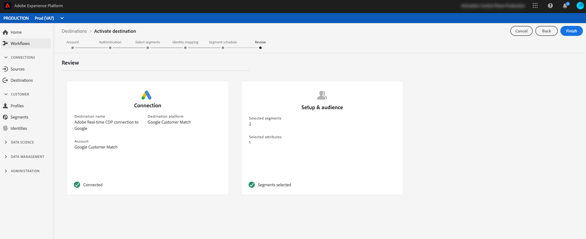

# Googleの顧客一致先

## 概要 {#overview}

[Google Customer Match](https://support.google.com/google-ads/answer/6379332?hl=en) では、オンラインおよびオフラインのデータを使用して、Googleが所有し、運営する次のようなプロパティを通じて顧客に連絡し、顧客と再び関与させることができます。 [!DNL Search]、 [!DNL Shopping]、、 [!DNL Gmail]および [!DNL YouTube]。

## 使用例

To help you better understand how and when you should use the [!DNL Google Customer Match] destination, here are sample use cases that Real-time Customer Data Platform customers can solve by using this feature.

### ユースケース 1

スポーツアパレルのブランドは、過去の購入や閲覧履歴に基づいてオファーやアイテムをパーソナライズす [!DNL Google Search] るこ [!DNL Google Shopping] とを通じて既存の顧客に届けたいと考えています。 アパレル・ブランドは、自社のCRMからReal-time CDPにEメール・アドレスを取り込み、独自のオフライン・データからセグメントを構築し、これらのセグメントを使用 [!DNL Google Customer Match] し [!DNL Search] て広告費用を最適化でき [!DNL Shopping]ます。

### ユースケース 2

有名なテクノロジー会社が、新しい電話を発売したばかり。 この新しい電話モデルを推進するために、電話の新機能を、以前のモデルの電話を所有するお客様に知らせたいと考えています。

このリリースを促進するために、CRMデータベースからEメールアドレスを識別子として使用し、Real-time CDPにアップロードします。 セグメントは、古い電話モデルを所有し、に送信された顧客に基づいて作成され、現在の顧客、古い電話モデルを所有する顧客、同様の顧客をターゲットで [!DNL Google Customer Match] きるようにし [!DNL YouTube]ます。

## 宛先のデータ・ガバナンス [!DNL Google Customer Match] {#data-governance}

リアルタイムCDPの宛先には、宛先プラットフォームに送信または受信するデータに対する特定のルールと義務が含まれている場合があります。 データの制約事項と義務、およびそのデータをAdobe Experience Platformや目的地プラットフォームでどのように使用するかについては、責任を持って理解してください。 Adobe Experience Platformは、データ使用上の義務の一部を管理するのに役立つデータ管理ツールを提供しています。 [データ管理ツールとポリシーの詳細](../../..//data-governance/labels/overview.md) 。

## タイプとIDの書き出し {#export-type}

**セグメントエクスポート** — セグメント(オーディエンス)のすべてのメンバーを、識別子（名前、電話番号など）と共にエクスポートします。 used in the [!DNL Google Customer Match] destination.

**ID** - Googleで顧客IDとして生の電子メールまたはハッシュされた電子メールを使用できます。

## [!DNL Google Customer Match] アカウントの前提条件 {#google-account-prerequisites}

Real-time CDPで [!DNL Google Customer Match] 宛先を設定する前に、 [!DNL Customer Match]Googleサポートドキュメントで概要を説明している、Googleの使用に関するポリシーを読み、遵守し [ていることを確認してください](https://support.google.com/google-ads/answer/6299717)。

### 許可リスト {#allowlist}

>[!NOTE]
>
>Real-time CDPで最初の宛先を設定する前に、Googleの許可リストに追加する必要があり [!DNL Google Customer Match] ます。 リンク先を作成する前に、Googleが以下に説明する許可リストプロセスを完了していることを確認してください。

Real-time CDPで [!DNL Google Customer Match] 宛先を作成する前に、Googleに連絡し、「Use Customer Match partners  」の許可リスト手順に従ってGoogleドキュメントにデータをアップロードする必要があります。

### 電子メールハッシュ要件 {#hashing-requirements}

<!--

>[!IMPORTANT]
>
> When using mobile device IDs as identifiers, an AppId must be provided in the activation flow. For more information, see step 6 in the [Activate segments](#activate-segments) section of this page.

-->

Googleでは、個人を特定できる情報(PII)を明確に送信しないよう求めています。 したがって、にアクティブ化するオーディエンスは、ハッシュ化された [!DNL Google Customer Match] 電子メールアドレスからキーオフにする ** 必要があります。 電子メールアドレスをAdobe Experience Platformに取り込む前にハッシュするか、Experience Platform内で電子メールアドレスを明確に扱ってアクティベーション上でアルゴリズムハッシュするかを選択できます。

Googleのハッシュ要件およびアクティベーションに関するその他の制限について詳しくは、Googleのドキュメントの次の節を参照してください。

* [[!DNL Customer Match] 電子メールアドレス、アドレスまたはユーザーIDを含む](https://developers.google.com/adwords/api/docs/guides/remarketing#customer_match_with_email_address_address_or_user_id)
* [[!DNL Customer Match] 考慮事項](https://developers.google.com/adwords/api/docs/guides/remarketing#customer_match_considerations)

<!--

Links to be added when activation based on phone number and device IDs becomes available.

* [Customer Match with phone number](https://developers.google.com/adwords/api/docs/guides/remarketing#customer_match_with_phone_number)
* [Customer Match with mobile device IDs](https://developers.google.com/adwords/api/docs/guides/remarketing#customer_match_with_mobile_device_ids)

-->

電子メールアドレスのExperience Platformでの取り込みについては、 [バッチインジェストの概要](../../../ingestion/batch-ingestion/overview.md) 、ストリーミングインジェストの概要を参照してください 。

電子メールアドレスを自分でハッシュする場合は、上のリンクで説明したGoogleの要件に準拠していることを確認してください。

>[!IMPORTANT]
>
>Eメールアドレスをハッシュしない場合は、にセグメントをアクティブ化する際に、Real-time CDPがこれを行い [!DNL Google Customer Match]ます。 [アクティベーションワークフロー](#activate-segments) （手順5を参照）で、プレーンテキストの電子メールアドレス `Email` 、およびハッシュされた電子メールアドレスに対して、次に示すよう *なオプションを選択*`Email_LC_SHA256`**&#x200B;します。

## 宛先に接続 {#connect-destination}

「 **[!UICONTROL Destinations]** / **[!UICONTROL Catalog]**」で、「 **[!UICONTROL Advertising]** 」カテゴリまでスクロールします。 を選択 [!DNL Google Customer Match]し、「 **[!UICONTROL 設定]**」を選択します。

>[!NOTE]
>
>この宛先との接続が既に存在する場合は、宛先カードに **[!UICONTROL 「アクティブ化]** 」ボタンが表示されます。 「 **[!UICONTROL アクティブ化]** 」と「 **[!UICONTROL 設定]**」の違いについて詳しくは、表示先ワークスペースのドキュメントの「 [カタログ](../../ui/destinations-workspace.md#catalog) 」セクションを参照してください。

In the **Account** step, if you had previously set up a connection to your [!DNL Google Customer Match] destination, select **[!UICONTROL Existing Account]** and select your existing connection. Or, you can select **[!UICONTROL New Account]** to set up a new connection to [!DNL Google Customer Match]. [宛先に **[!UICONTROL 接続]** ]を選択してログインし、Adobe Experience Cloudを [!DNL Google Ad] アカウントに接続します。

>[!NOTE]
>
>Real-time CDP supports credentials validation in the authentication process and displays an error message if you input incorrect credentials to your [!DNL Google Ad] account. このため、間違った資格情報を使用すると、ワークフローを完了することができません。

Once your credentials are confirmed and Adobe Experience Cloud is connected to your Google account, you can select **[!UICONTROL Next]** to proceed to the **[!UICONTROL Setup]** step.

「 **[!UICONTROL Authentication]** ( [!UICONTROL 認証] )」手順で、アクティベーションフローの [!UICONTROL 名前と説明を入力し、Googleに]Account IDを入力します。

また、この手順では、この宛先に適用する **[!UICONTROL マーケティングの使用例]** を選択できます。 マーケティングの使用例は、データがエクスポート先にエクスポートされる意図を示します。 Adobe定義のマーケティングの使用例から選択するか、独自のマーケティングの使用例を作成することができます。 マーケティングの使用例の詳細については、Real-time CDP [（リアルタイムCDP）ページの「](../../../rtcdp/privacy/data-governance-overview.md#destinations) Data Governance（データ・ガバナンス）」を参照してください。 個々のAdobe定義マーケティングの使用例について詳しくは、 [データ使用ポリシーの概要を参照してください](../../../data-governance/policies/overview.md#core-actions)。

上記のフィールドに入力した後、「**[!UICONTROL 宛先を作成]**」を選択します。

>[!IMPORTANT]
>
> * 「 **[!UICONTROL PIIと]** 組み合わせ [!DNL Google Customer Match] 」マーケティングの使用例は、デフォルトで宛先に対して選択されており、削除できません。
> * 目的 [!DNL Google Customer Match] 地用。 **[!UICONTROL アカウントID]** は、Googleを使用する顧客のクライアントIDです。 IDの形式はxxx-xxx-xxxxです。

これで宛先が作成されました。後でセグメントをアクティブにする場合は、「**[!UICONTROL 保存して終了]**」を選択します。また、「**[!UICONTROL 次へ]**」を選択してワークフローを続行し、アクティブ化するセグメントを選択することもできます。In either case, see the next section, [Activate segments to [!DNL Google Customer Match]](#activate-segments), for the rest of the workflow.

## Activate segments to [!DNL Google Customer Match] {#activate-segments}

セグメントをアクティブ化するに [!DNL Google Customer Match]は、次の手順に従います。

**[!UICONTROL 宛先／参照]**&#x200B;で、セグメントをアクティブ化する宛先を選択します。[!DNL Google Customer Match]

宛先の名前をクリックします。これにより、「アクティブ化」のフローに移動します。

宛先に対するアクティベーションフローが既に存在する場合は、その宛先に現在送信されているセグメントを確認できます。右側のパネルで「**[!UICONTROL アクティベーションの編集]**」を選択し、以下の手順に従ってアクティベーションの詳細を変更します。

Select **[!UICONTROL Activate]**. In the **[!UICONTROL Activate destination]** workflow, on the **[!UICONTROL Select Segments]** page, select which segments to send to [!DNL Google Customer Match].

「 **[!UICONTROL IDマッピング]** 」の手順で、この宛先にIDとして含める属性を選択します。 **** 追加新しいマッピングを選択し、スキーマを参照し、電子メールやハッシュ化された電子メールを選択して、対応するターゲットIDにマッピングします。

**プライマリID**:スキーマで主なIDとしてプレーンテキスト（ハッシュ化されていない）電子メールアドレスが存在する場合、「 **[!UICONTROL ソース属性]** 」で電子メールフィールドを選択し、 **[!UICONTROL ターゲットID]**(ID)の右の列にある電子メールフィールドに次のようにマップします。

**プライマリID**:スキーマで電子メールアドレスを主IDとしてハッシュ化している場合は、次に示すように、「 **[!UICONTROL ソース属性]** 」でハッシュ化された電子メールフィールドを選択し、「 **[!UICONTROL ターゲットID]**」の右列にある「Email_LC_SHA256」フィールドにマップします。

「 **[!UICONTROL セグメントスケジュール]** 」ページで、送信先にデータを送信する開始日を設定できます。

「**[!UICONTROL 確認]**」ページには、選択の概要が表示されます。「**[!UICONTROL キャンセル]**」を選択してフローを分割するか、「**[!UICONTROL 戻る]**」を選択して設定を変更する、または、「**[!UICONTROL 完了]**」を選択して確定し、宛先へのデータの送信を開始します。

>[!IMPORTANT]
>
>この手順では、リアルタイムCDPがデータ使用ポリシー違反をチェックします。 次に、ポリシー違反の例を示します。 セグメントアクティベーションのワークフローは、違反を解決するまで完了できません。 ポリシー違反の解決方法について詳しくは、「データ管理ドキュメント」の「 [ポリシーの適用](../../../rtcdp/privacy/data-governance-overview.md#enforcement) 」を参照してください。

ポリシー違反が検出されなかった場合は、「 **[!UICONTROL Finish]** 」を選択して、選択を確定し、開始が宛先にデータを送信することを確認します。

<!--

Insert in Step 6 when mobile device ID activation is available

    >[!IMPORTANT]
    >
    >If you select mobile device IDs (GAID or IDFA) as primary identity in the Identity mapping step, you must also provide an Application Id in this step. If you selected GAID as identity, see [Set the Application ID](https://developer.android.com/studio/build/application-id) in the Android developer documentation. IF you selected IDFA as identity, see [App ID](https://developer.android.com/studio/build/application-id) in the Apple developer documentation.

     

-->

## セグメントのアクティベーションが成功したことを確認します。 {#verify-activation}

アクティベーションのフローが完了したら、 **[!UICONTROL Google Ads]** アカウントに切り替えます。 アクティブ化されたセグメントは、Googleアカウントに顧客リストとして表示されます。 セグメントサイズに応じて、提供するアクティブなオーディエンスが100人を超えない限り、一部のユーザーは入力されないことに注意してください。

## その他のリソース {#additional-resources}

* [Google顧客マッチの統合 — ビデオチュートリアル](https://experienceleague.adobe.com/docs/platform-learn/tutorials/rtcdp/integrate-with-google-customer-match.html)