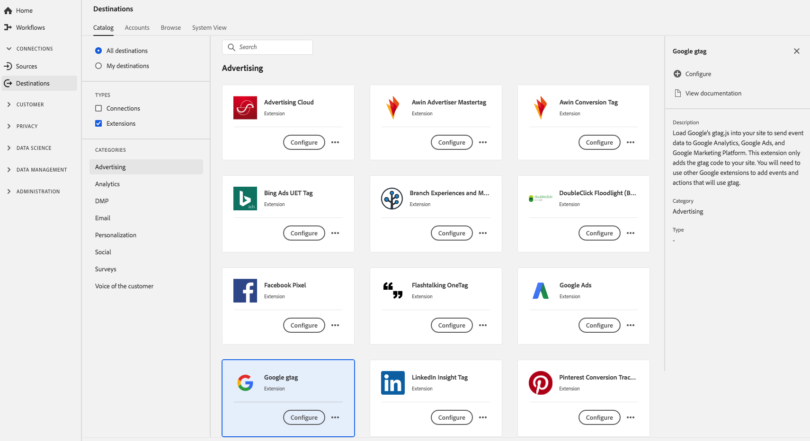

# Google gtag 拡張機能 {#gtag-advertising-extension}

>[!IMPORTANT]
>
>ここで説明するGoogle gtag 拡張機能は廃止され、[!DNL Acronym] が開発した [[!DNL Google Global Site Tag (gtag)]](https://exchange.adobe.com/apps/ec/101437/google-global-site-tag-gtag) 拡張機能に置き換えられました。データ収集 UI または Experience Platform UI の[[!UICONTROL タグ]](../../../tags/home.md)ワークスペース内で、[!DNL Google Global Site Tag (gtag)] 拡張機能を見つけることができます。

## 概要 {#overview}

Google の `gtag.js` をサイトに読み込んで、イベントデータを、[!DNL Google Analytics]、Google 広告および [!DNL Google Marketing Platform] に送信します。この拡張機能は、gtag コードをサイトに追加するだけです。他の Google 拡張機能を使用して、gtag を使用するイベントやアクションを追加する必要があります。

Google gtag は、Adobe Experience Platform の広告拡張機能です。拡張機能について詳しくは、[Adobe Exchange](https://exchange.adobe.com/experiencecloud.details.102805.google-gtag.html) の拡張機能のページを参照してください。

この宛先はタグ拡張機能です。 Platform でのタグ拡張の仕組みについて詳しくは、[タグ拡張機能の概要](../launch-extensions/overview.md)を参照してください。

## 前提条件 {#prerequisites}

プラットフォームを購入したすべての顧客は、この拡張機能を [!DNL Destinations] カタログから利用できます。

この拡張機能を使用するには、Adobe Experience Platform でタグにアクセスする必要があります。 タグは、標準装備の付加価値機能として Adobe Experience Cloud の顧客に提供されます。組織の管理者に問い合わせてタグへのアクセス権を取得し、拡張機能をインストールできるよう **[!UICONTROL manage_properties]** 権限の付与を依頼します。

## 拡張機能のインストール {#install-extension}

Google gtag 拡張機能をインストールするには：

[Platform インターフェイス](https://platform.adobe.com/)で、**[!UICONTROL 宛先]**／**[!UICONTROL カタログ]**&#x200B;に移動します。

カタログから拡張機能を選択するか、検索バーを使用します。

宛先をクリックしてハイライトしてから、右側のパネルで「**[!UICONTROL 設定]**」を選択します。**[!UICONTROL 設定]**&#x200B;コントロールがグレー表示になっている場合は、**[!UICONTROL manage_properties]** 権限がありません。[前提条件](#prerequisites)を確認してください。

拡張機能をインストールするプロパティを選択します。 また、新しいプロパティを作成するオプションもあります。プロパティは、ルール、データ要素、設定された拡張機能、環境およびライブラリの集まりです。プロパティについては、タグドキュメントの [「プロパティ」ページに関する節](../../../tags/ui/administration/companies-and-properties.md#properties-page) を参照してください。

このワークフローでは、インストールを完了する手順について説明します。

拡張機能の設定オプションとインストールのサポートについて詳しくは、[Adobe Exchange の Google gtag ページ](https://exchange.adobe.com/experiencecloud.details.102805.google-gtag.html)を参照してください。

拡張機能は、[データ収集 UI](https://experience.adobe.com/#/data-collection/) で直接インストールできます。詳しくは、[新しい拡張機能の追加](../../../tags/ui/managing-resources/extensions/overview.md#add-a-new-extension) （タグドキュメント）を参照してください。

## 拡張機能の使用方法 {#how-to-use}

拡張機能をインストールしたら、ルールの設定を開始できます。

特定の状況でのみ拡張機能の宛先にイベントデータを送信するように、インストール済みの拡張機能のルールを設定できます。拡張機能のルールの設定について詳しくは、[ルールに関するドキュメント](../../../tags/ui/managing-resources/rules.md)を参照してください。

## 拡張機能の設定、アップグレード、削除 {#configure-upgrade-delete}

データ収集 UI で、拡張機能の設定、アップグレードおよび削除を行うことができます。

>[!TIP]
>
>拡張機能がいずれかのプロパティに既にインストールされている場合、Platform UI ではその拡張機能に引き続き「**[!UICONTROL インストール]**」が表示されます。[拡張機能のインストール](#install-extension)の説明に従ってインストールワークフローを開始し、拡張機能を設定または削除します。

拡張機能をアップグレードするには、[拡張機能のアップグレードプロセス](../../../tags/ui/managing-resources/extensions/extension-upgrade.md) （タグドキュメント）のガイドを参照してください。
