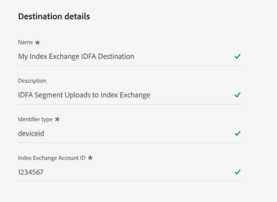
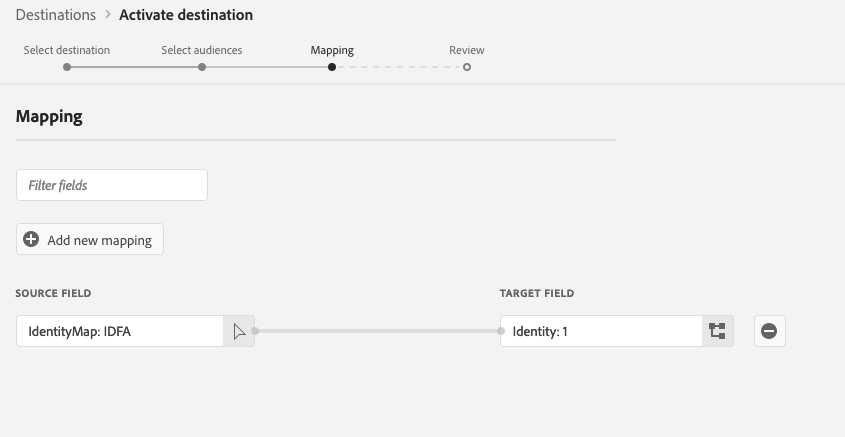

# [!DNL Index Exchange] {#index-exchange}

## 概要 {#overview}

[!DNL Index]は、メディア所有者があらゆるスクリーンでコンテンツの価値を最大化できるよう支援する、グローバルな広告供給側プラットフォームです。 20年以上にわたる業界リーダーシップにより、[!DNL Index]は世界有数のブランドとプレミアム顧客体験メーカーをつなぎ合わせ、高品質な消費者体験を提供しています。

この宛先コネクタを使用して、[!DNL Adobe Experience Platform]から[!DNL Index Exchange]のプログラマティック広告プラットフォームにオーディエンスセグメントを直接書き出します。

書き出されたオーディエンスセグメントは、メディア所有者やマーケットプレイスパートナーが対象とするか、マーケットプレイスベンダーがメディア企業やキュレーターと共有します。

>[!IMPORTANT]
>
>宛先コネクタとドキュメント ページは、[!DNL Index] チームによって作成および管理されます。 質問または更新リクエストについては、[technical_am_marketplace@indexexchange.com](mailto:technical_am_marketplace@indexexchange.com)から直接お問い合わせください。

## ユースケース {#use-cases}

[!DNL Index Exchange]宛先を使用する方法とタイミングをより深く理解するために、Experience Platformのお客様がこの宛先を使用して解決できるユースケースの例を次に示します。

### モバイル、web、CTV プラットフォームの利用者をターゲットにする {#targeting-users}

Experience Platformから[!DNL Index]にオーディエンスを送信し、モバイル、web、CTVのプラットフォームでオーディエンスをターゲティングするメディアオーナー、マーケットプレイスパートナー、マーケットプレイスベンダーは、さまざまな識別子を使用します。

### モバイル、web、CTV プラットフォームでの特定のコンテンツのターゲティング {#targeting-content}

特定のURL、アプリバンドル、コンテンツ IDを使用して、モバイル、web、CTVのプラットフォームをまたいで特定のコンテンツを閲覧しているユーザーをターゲットに、Experience Platformから[!DNL Index]にオーディエンスを送信するメディアオーナー、マーケットプレイスパートナー、マーケットプレイスベンダー。

## 前提条件 {#prerequisites}

オーディエンスセグメントは、アカウントに表示される前に、この宛先を使用する際に追加のプロセスを使用して[!DNL Index]に登録する必要があります。 このプロセスに関するサポートについては、[!DNL Index Exchange] アカウント担当者にお問い合わせください。

## サポートされている ID {#supported-identities}

[!DNL Index]は、次の表に示すIDのアクティブ化をサポートしています。 [ID](/help/identity-service/features/namespaces.md) についての詳細情報。

>[!NOTE]
>
>[!DNL Index Exchange]の宛先では、アップロードごとに1つのID タイプのみをサポートします。 宛先の詳細を設定する際に、適切な識別子の種類を指定する必要があります（以下の「[ 「宛先の詳細を入力する」 ](#destination-details)」セクションを参照）。

複数のID タイプをアップロードするには、ID タイプごとに[!DNL Index Exchange]宛先の個別のインスタンスを作成します。

| ターゲット ID | 説明 | 注意点 |
| --- | --- | --- |
| GAID | GOOGLE ADVERTISING ID | ソース IDがGAID名前空間の場合は、ターゲット IDとして「GAID」を選択します。 |
| IDFA | Apple の広告主 ID | ソース IDがIDFA名前空間の場合は、IDFA ターゲット IDを選択します。 |
| Windows AID | Windows Advertising ID | ソース IDがWindows AID名前空間である場合は、Windows AID ターゲット IDを選択します。 |
| extern_id | カスタムユーザーID | ソース IDがカスタム名前空間である場合は、このターゲット IDを選択します。 |

{style="table-layout:auto"}

## サポートされるオーディエンス {#supported-audiences}

このセクションでは、この宛先に書き出すことができるオーディエンスタイプについて説明します。

| オーディエンスの由来 | サポートあり | 説明 |
| --------- | ---------- | ---------- |
| [!DNL Segmentation Service] | ○ | Experience Platform [ セグメント化サービス ](../../../segmentation/home.md)を通じて生成されたオーディエンス。 |
| その他すべてのオーディエンスの生成元 | ○ | このカテゴリには、[!DNL Segmentation Service]を通じて生成されたオーディエンス以外のすべてのオーディエンスのオリジンが含まれます。 [様々なオーディエンスの起源](/help/segmentation/ui/audience-portal.md#customize)について読みます。 次に例を示します。 <ul><li> カスタムアップロードオーディエンス [がCSV ファイルからExperience Platformに](../../../segmentation/ui/audience-portal.md#import-audience)をインポートしました。</li><li> 類似オーディエンス， </li><li> 連合オーディエンス， </li><li> [!DNL Adobe Journey Optimizer]などの他のExperience Platform アプリで生成されたオーディエンス </li><li> その他。 </li></ul> |

{style="table-layout:auto"}

オーディエンスのデータタイプ別にサポートされるオーディエンス：

| オーディエンスのデータタイプ | サポートあり | 説明 | ユースケース |
|--------------------|-----------|-------------|-----------|
| [人物オーディエンス ](/help/segmentation/types/people-audiences.md) | ○ | 顧客プロファイルにもとづいて、マーケティング施策の特定のグループをターゲットにすることができます。 | 買い物客やカートの放棄が多い |
| [ アカウントオーディエンス ](/help/segmentation/types/account-audiences.md) | × | アカウントベースドマーケティング戦略のために、特定の組織内の個人をターゲットにします。 | B2B マーケティング |
| [見込みオーディエンス ](/help/segmentation/types/prospect-audiences.md) | × | まだ顧客ではないが、ターゲットオーディエンスと特徴を共有する個人をターゲットにします。 | サードパーティデータによる見込み顧客の開拓 |
| [ データセットの書き出し](/help/catalog/datasets/overview.md) | × | [!DNL Adobe Experience Platform] データ レイクに保存されている構造化データのコレクション。 | レポート，データサイエンスワークフロー |

{style="table-layout:auto"}

## 書き出しのタイプと頻度 {#export-type-frequency}

宛先の書き出しのタイプと頻度について詳しくは、以下の表を参照してください。

| 項目 | タイプ | メモ |
| --------- | ---------- | --------- |
| 書き出しタイプ | **[!UICONTROL Segment export]** | [!DNL Index Exchange]宛先で使用されている識別子（IDFA、GAIDなど）を使用して、セグメント（オーディエンス）のすべてのメンバーを書き出します。 |
| 書き出し頻度 | **[!UICONTROL Batch]** | ファイルを3、6、8、12、または24時間間隔でダウンストリームプラットフォームに書き出します。 詳しくは、[バッチ（ファイルベース）宛先](/help/destinations/destination-types.md#file-based)を参照してください。 |

{style="table-layout:auto"}

## 宛先への接続 {#connect}

>[!IMPORTANT]
>
>宛先に接続するには、**[!UICONTROL View Destinations]**&#x200B;および&#x200B;**[!UICONTROL Manage Destinations]** [ アクセス制御権限](/help/access-control/home.md#permissions)が必要です。 詳しくは、[アクセス制御の概要](/help/access-control/ui/overview.md)または製品管理者に問い合わせて、必要な権限を取得してください。

この宛先に接続するには、[宛先設定のチュートリアル](../../ui/connect-destination.md)の手順に従ってください。宛先の設定ワークフローで、以下の 2 つのセクションにリストされているフィールドに入力します。

### 宛先の詳細の入力 {#destination-details}

宛先の詳細を設定するには、以下のフィールドに入力します。 UI のフィールドの横のアスタリスクは、そのフィールドが必須であることを示します。

* [!UICONTROL Name]：後でこの宛先を認識できるように、名前を入力してください。
* [!UICONTROL Description]：後でこの宛先を特定するのに役立つ説明を入力します。
* [!UICONTROL Identifier Type]: [!DNL Index]に送信する識別子に一致する、インデックスが提供する識別子タイプを選択します。 以下のサポートされる識別子タイプの表を参照してください。 使用する識別子の種類がわからない場合は、[!DNL Index]担当者にお問い合わせください。 複数の識別子タイプを送信するには、この宛先の個別のインスタンスを作成します。
* [!UICONTROL Account ID]: [!DNL Index] アカウント IDを入力してください。 これはパブリッシャーIDと同じではありません。 使用するIDが不明な場合は、[!DNL Index]担当者にお問い合わせください。

#### サポートされている識別子タイプ {#supported-identifier-types}

| 識別子タイプ | 説明 |
|------------------ | ------------- |
| [!DNL appbundle] | モバイルアプリバンドル |
| [!DNL contentid] | コンテンツ ID |
| [!DNL deviceid] | デバイス ID （例： IDFA、GAID、WAIDなど） |
| [!DNL ip] | IP アドレス |
| [!DNL postcode] | 郵便番号 |
| [!DNL url] | サイト URL |
| [!DNL ppid_xxx] | PPID ID IDについては、[!DNL Index Exchange] アカウント担当者にお問い合わせください。 |

{style="table-layout:auto"}

### アラートの有効化 {#enable-alerts}

この宛先へのデータフローのステータスに関する通知を受け取るアラートを有効にすることができます。 リストから1つ以上のアラートを選択して、データフローのステータス通知を購読します。 詳しくは、UI[を使用した宛先アラートの](../../ui/alerts.md)購読に関するガイドを参照してください。
宛先接続の詳細の提供が完了したら、**[!UICONTROL Next]**&#x200B;を選択します。

## この宛先に対してオーディエンスをアクティブ化 {#activate}

>[!IMPORTANT]
>
>* データをアクティブ化するには、**[!UICONTROL View Destinations]**、**[!UICONTROL Activate Destinations]**、**[!UICONTROL View Profiles]**&#x200B;および&#x200B;**[!UICONTROL View Segments]** [ アクセス制御権限](/help/access-control/home.md#permissions)が必要です。 [アクセス制御の概要](/help/access-control/ui/overview.md)を参照するか、製品管理者に問い合わせて必要な権限を取得してください。
>* *ID*&#x200B;をエクスポートするには、**[!UICONTROL View Identity Graph]** [ アクセス制御権限](/help/access-control/home.md#permissions)が必要です。  {width="100" zoomable="yes"}

この宛先に対してオーディエンスセグメントをアクティブ化する手順については、[バッチプロファイル書き出し宛先に対するオーディエンスデータのアクティブ化](/help/destinations/ui/activate-batch-profile-destinations.md)を参照してください。

### 属性と ID のマッピング {#map}

ソースフィールドの選択：

* 識別子（通常はIDFAやカスタム ID名前空間などの名前空間）を選択します。 これは、宛先の設定時に選択した識別子タイプに対応する必要があります。 例えば、IDFA識別子をソースフィールドとして使用する場合、宛先は「deviceid」識別子タイプで設定されている必要があります。

ターゲットフィールドの選択：

* ターゲットフィールドの名前は無視され、重要ではありません。 宛先は、送信される識別子のタイプのみを重視します。これは、宛先の設定時に選択した識別子タイプによって決定されます。

### [!DNL Index]でセグメントを登録 {#register-segments}

宛先へのデータのアクティベーションの前または後に、[!DNL Index]担当者に連絡して、アクティベートするセグメントを登録してください。 名前、ID、説明、価格など、セグメントの詳細を登録する方法に関する説明を、担当者が説明します（該当する場合）。

## 書き出されたデータ／データ書き出しの検証 {#exported-data}

登録が完了すると、セグメントは[!DNL Index] アカウントでターゲティングできるようになります。 データが正しく受信されていることを確認するには、受信したセグメントデータの量の詳細を提供できる[!DNL Index]担当者にお問い合わせください。

## データの使用とガバナンス {#data-usage-governance}

Experience Platformのすべての宛先は、データを処理する際のデータ使用ポリシーに準拠しています。 Experience Platformによるデータガバナンスの適用方法について詳しくは、[ データガバナンスの概要](/help/data-governance/home.md)を参照してください。
