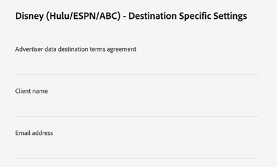

# [!DNL LiveRamp - Distribution] 接続 {#liveramp-onboarding}

The [!DNL LiveRamp - Distribution] 接続を使用すると、モバイル、Web、ディスプレイ、接続されたテレビメディアをまたいで、Experience Platformからプレミアムパブリッシャーに対してオーディエンスをアクティブ化できます。

>[!IMPORTANT]
>
>この宛先コネクタとドキュメントページは、LiveRamp によって作成および管理されます。 お問い合わせや更新リクエストについては、LiveRamp に直接お問い合わせください。 [ここ](mailto:example@email.com).

## サポートされる宛先 {#supported-destinations}

[!DNL LiveRamp - Distribution] は、現在、次のプラットフォームに対するオーディエンスのアクティベーションをサポートしています。

* [!DNL 4C Insights]
* [!DNL Acast]
* [!DNL Amobee]
* [!DNL Ampersand.tv]
* [!DNL Captify]
* [!DNL Cardlytics]
* [[!DNL Disney (Hulu/ESPN/ABC)]](#disney)
* [!DNL iHeartMedia]
* [!DNL Index Exchange]
* [!DNL Magnite CTV Platform]
* [!DNL Magnite DV+ (Rubicon Project)]
* [!DNL One Fox]
* [!DNL Pandora]
* [!DNL Reddit]
* [[!DNL Roku]](#roku)
* [!DNL Spotify]
* [!DNL Taboola]
* [!DNL TargetSpot]
* [!DNL Teads]
* [!DNL WB Discovery]

## ユースケース {#use-cases}

[!DNL LiveRamp - Distribution] 宛先を使用する方法とタイミングを理解しやすくするために、Adobe Experience Platform のお客様がこの宛先を使用して解決できるユースケースのサンプルを以下に示します。

スポーツアパレル小売業者のマーケティングチームが、 [LiveRamp - Onboarding](liveramp-onboarding.md) 接続を使用して、Experience Platformから LiveRamp アカウントにオーディエンスを送信する。

を通じて [!DNL LiveRamp - Distribution] 接続を利用して、オンボードオーディエンスの有効化をこのページの上部に記載されている宛先にトリガーできるようになりました。これにより、モバイル、オープンな web、ソーシャル、 [!DNL CTV] プラットフォーム。

## オーディエンスを LiveRamp にオンボーディングする {#onboarding}

を通じてオーディエンスをアクティブ化する前に [!DNL LiveRamp - Distribution] 接続、 [LiveRamp - Onboarding](liveramp-onboarding.md) 接続を使用して、Experience Platformオーディエンスを LiveRamp に書き出すことができます。

オーディエンスを LiveRamp にオンボーディングした後、 [宛先に接続](#connect) 手順

## 宛先への接続 {#connect}

>[!CONTEXTUALHELP]
>id="platform_destinations_liveramp_distribution_identifier_settings"
>title="識別子設定"
>abstract="宛先でサポートされている識別子を選択します。各宛先でサポートされる識別子の完全なリストについては、ドキュメントを参照してください。"

>[!IMPORTANT]
> 
>宛先に接続するには、**[!UICONTROL 宛先の管理]** [アクセス制御権限](/help/access-control/home.md#permissions)が必要です。詳しくは、[アクセス制御の概要](/help/access-control/ui/overview.md)または製品管理者に問い合わせて、必要な権限を取得してください。

この宛先に接続するには、[宛先設定のチュートリアル](../../ui/connect-destination.md)の手順に従ってください。宛先の設定ワークフローで、以下の 2 つのセクションにリストされているフィールドに入力します。

### LiveRamp に対する認証 {#authenticate}

宛先に対して認証するには、必須フィールドに入力し、「**[!UICONTROL 宛先に接続]**」を選択します。

* **[!UICONTROL トークン URL]**:LiveRamp トークンの URL。
* **[!UICONTROL LiveRamp 組織 ID]**:LiveRamp アカウントの組織 ID。
* **[!UICONTROL ユーザー名]**:LiveRamp アカウントのユーザー名。
* **[!UICONTROL パスワード]**:LiveRamp アカウントのパスワード。

### 宛先の詳細を設定 {#destination-details}

LiveRamp アカウントに正常に接続したら、オーディエンスをアクティブ化する宛先に接続するために必要な情報を入力します。

* **[!UICONTROL 名前]**：宛先接続の名前を入力します。
* **[!UICONTROL 説明]**：宛先についての説明を入力します。この宛先の目的を簡単に識別できる説明を使用します。
* **[!UICONTROL 宛先]**：ドロップダウンメニューを使用して、オーディエンスをアクティブ化する宛先を選択します。 ここで選択する宛先は、 [宛先固有の設定](#destination-settings) 画面。
* **[!UICONTROL 統合]**：宛先に使用する統合アカウントを選択します。
* **[!UICONTROL 識別子]**：宛先でサポートされている識別子を選択します。 現在、すべての宛先には、ドロップダウンメニューで事前に入力された、サポートされている識別子があります。

## 宛先固有の設定 {#destination-settings}

各宛先 [サポート](#supported-destinations) 作成者 [!DNL LiveRamp - Onboarding] では、特定の設定オプションを入力する必要があります。

各宛先の設定方法に関する詳細なガイダンスについては、以下の節を参照してください。

### [!DNL 4C Insights] {#insights}

>[!CONTEXTUALHELP]
>id="platform_destinations_liveramp_distribution_4cinsights_profile_id"
>title="4C ブランドプロファイル ID"
>abstract="4C ブランドプロファイルに関連付けられている数値 ID を入力します。 この ID をお持ちでない場合は、4C クライアントサービス担当者にお問い合わせください。"

宛先の詳細を設定するには、以下の必須フィールドとオプションフィールドに入力します。UI のフィールドの横のアスタリスクは、そのフィールドが必須であることを示します。

### [!DNL Acast] {#acast}

>[!CONTEXTUALHELP]
>id="platform_destinations_liveramp_distribution_acast_client"
>title="クライアント名"
>abstract="宛先パートナーに表示する広告主のアカウント名。会社名を使用します。スペースや特殊文字は使用しないでください。"

### [!DNL Amobee] {#amobee}

### [!DNL Ampersand.tv] {#ampersand-tv}

### [!DNL Captify] {#captify}

>[!CONTEXTUALHELP]
>id="platform_destinations_liveramp_distribution_captify_client"
>title="クライアント名"
>abstract="宛先パートナーに表示する広告主のアカウント名。会社名を使用します。スペースや特殊文字は使用しないでください。"

### [!DNL Cardlytics] {#cardlytics}

>[!CONTEXTUALHELP]
>id="platform_destinations_liveramp_distribution_cardlytics_client"
>title="クライアント名"
>abstract="宛先パートナーに表示する広告主のアカウント名。会社名を使用します。スペースや特殊文字は使用しないでください。"

### [!DNL Disney (Hulu/ESPN/ABC)] {#disney}

>[!CONTEXTUALHELP]
>id="platform_destinations_liveramp_distribution_agreement"
>title="広告主データの宛先に関する利用規約"
>abstract="`I AGREE` と入力して、Disney 広告主のデータ規約への承認と同意を確認します。"
>additional-url="https://www.disneyadvertising.com/ADVERTISER-DATA-DESTINATION-TERMS/" text="契約書を読む"

>[!CONTEXTUALHELP]
>id="platform_destinations_liveramp_distribution_disney_client"
>title="クライアント名"
>abstract="宛先パートナーに表示する広告主のアカウント名。会社名を使用します。スペースや特殊文字は使用しないでください。"

>[!CONTEXTUALHELP]
>id="platform_destinations_liveramp_distribution_disney_email"
>title="メールアドレス"
>abstract="個人に関連付けられたメールアドレスを入力します。このメールアドレスは、広告主データの利用規約への署名として機能します。このメールアドレスは、必要に応じて連絡する際に使用されます。"

宛先の詳細を設定するには、以下のフィールドに入力します。

* **[!UICONTROL 広告主データの宛先に関する利用条件の契約]**：に入力します。 `I AGREE` をクリックして、Disney 広告主のデータ利用条件に対する確認および同意を確認します。
* **[!UICONTROL クライアント名]**：宛先パートナーに表示する会社名を入力します。
* **[!UICONTROL 電子メールアドレス]**：個人に関連付けられた電子メールアドレスを入力します。 このメールアドレスは、広告主データの利用規約への署名として機能します。

### [!DNL iHeartMedia] {#iheartmedia}

>[!CONTEXTUALHELP]
>id="platform_destinations_liveramp_distribution_iheartmedia_client"
>title="クライアント名"
>abstract="宛先パートナーに表示する広告主のアカウント名。会社名を使用します。スペースや特殊文字は使用しないでください。"

### [!DNL Index Exchange] {#index-exchange}

### [!DNL Magnite CTV Platform] {#magnite}

### [!DNL Magnite DV+ (Rubicon Project)] {#magnite-dv}

### [!DNL One Fox] {#fox}

### [!DNL Pandora] {#pandora}

>[!CONTEXTUALHELP]
>id="platform_destinations_liveramp_distribution_pandora_data_provider_name"
>title="データプロバイダー名"
>abstract="Pandora に表示したい会社名。名前には、最大 40 文字の小文字および英数字を使用できます（例：My_Company）。"

>[!CONTEXTUALHELP]
>id="platform_destinations_liveramp_distribution_pandora_rep_email"
>title="アカウント担当者のメールアドレス"
>abstract="Pandora のアカウント担当者のメールアドレス。このアドレスは、分類の更新を送信するために使用されます。複数のアドレスを入力する場合は、コンマで区切ります。"

>[!CONTEXTUALHELP]
>id="platform_destinations_liveramp_distribution_email"
>title="メールアドレス"
>abstract="このアドレスは、分類の更新を送信するために使用されます。複数のアドレスを入力する場合は、コンマで区切ります。"

>[!CONTEXTUALHELP]
>id="platform_destinations_liveramp_distribution_pandora_account_name"
>title="アカウント名"
>abstract="お客様の Pandora アカウントの名前。アカウント名が不明な場合は、Pandora のアカウント担当者にお問い合わせください。スペースや特殊文字は使用しないでください。"

### [!DNL Reddit] {#reddit}

>[!CONTEXTUALHELP]
>id="platform_destinations_liveramp_distribution_reddit_advertiser_id"
>title="Reddit の広告主 ID"
>abstract="Reddit の広告主 ID。「t2_」または「a2_」で始まる必要があります。広告主 ID が不明な場合は、Reddit の担当者にお問い合わせください。"

>[!CONTEXTUALHELP]
>id="platform_destinations_liveramp_distribution_reddit_advertiser_name"
>title="Reddit の広告主名"
>abstract="Reddit の広告主名。スペースや特殊文字は使用しないでください。"

### Roku {#roku}

>[!CONTEXTUALHELP]
>id="platform_destinations_liveramp_distribution_roku_email"
>title="Roku アカウントのメールアドレス"
>abstract="Roku アカウントに関連付けられたメールアドレスを入力します。"

>[!CONTEXTUALHELP]
>id="platform_destinations_liveramp_distribution_roku_representative_email"
>title="Roku アカウント担当者のメールアドレス"
>abstract="Roku アカウント担当者のメールアドレスを入力します。このアドレスは、分類の更新を送信するために使用されます。複数のアドレスを入力する場合は、コンマで区切ります。"

宛先の詳細を設定するには、以下のフィールドに入力します。

* **[!UICONTROL Roku アカウントの電子メールアドレス]**:Roku アカウントに関連付けられている電子メールアドレスを入力します。
* **[!UICONTROL Roku アカウント担当者の電子メールアドレス]**:Roku アカウント担当者の電子メールアドレスを入力します。 複数のアドレスを入力する場合は、コンマで区切ります。

### [!DNL Spotify] {#spotify}

>[!CONTEXTUALHELP]
>id="platform_destinations_liveramp_distribution_spotify_client"
>title="クライアント名"
>abstract="宛先パートナーに表示する広告主のアカウント名。会社名を使用します。スペースや特殊文字は使用しないでください。"

>[!CONTEXTUALHELP]
>id="platform_destinations_liveramp_distribution_spotify_account_token"
>title="アカウントトークン"
>abstract="データを移植する場所と、このワークフローの使用を検証したことを Spotify に通知する英数字の識別子。このトークンを取得するには、Spotify のアカウントマネージャーにお問い合わせください。"

### [!DNL Taboola] {#taboola}

>[!CONTEXTUALHELP]
>id="platform_destinations_liveramp_distribution_taboola_rep_email"
>title="アカウントマネージャーのメールアドレス"
>abstract="Taboola アカウントマネージャーのメールアドレス。"

### [!DNL TargetSpot] {#targetspot}

>[!CONTEXTUALHELP]
>id="platform_destinations_liveramp_distribution_targetspot_client"
>title="クライアント名"
>abstract="宛先パートナーに表示する広告主のアカウント名。会社名を使用します。スペースや特殊文字は使用しないでください。"

### [!DNL Teads] {#teads}

### [!DNL WB Discovery] {#wb-discovery}

>[!CONTEXTUALHELP]
>id="platform_destinations_liveramp_distribution_wb_client"
>title="クライアント名"
>abstract="宛先パートナーに表示する広告主のアカウント名。会社名を使用します。スペースや特殊文字は使用しないでください。"

### アラートの有効化 {#enable-alerts}

アラートを有効にすると、宛先へのデータフローのステータスに関する通知を受け取ることができます。リストからアラートを選択して、データフローのステータスに関する通知を受け取るよう登録します。アラートについて詳しくは、[UI を使用した宛先アラートの購読](../../ui/alerts.md)に関するガイドを参照してください。

宛先接続の詳細の入力を終えたら「**[!UICONTROL 次へ]**」を選択します。

## この宛先に対してオーディエンスをアクティブ化 {#activate}

>[!IMPORTANT]
> 
>データをアクティブ化するには、**[!UICONTROL 宛先の管理]**、**[!UICONTROL 宛先のアクティブ化]**、**[!UICONTROL プロファイルの表示]**&#x200B;および&#x200B;**[!UICONTROL セグメントの表示]** [に対するアクセス制御権限](/help/access-control/home.md#permissions)が必要です。詳しくは、[アクセス制御の概要](/help/access-control/ui/overview.md)または製品管理者に問い合わせて、必要な権限を取得してください。

The [!DNL LiveRamp - Distribution] 接続は、 [LiveRamp - Onboarding](liveramp-onboarding.md) 接続。

オーディエンスを正常にアクティブ化するには、この手順で、 **同じオーディエンス** 以前に LiveRamp にオンボーディングした

>[!IMPORTANT]
>
>以前に LiveRamp にオンボーディングされていないオーディエンスを選択しても、新しいオーディエンスのオンボーディングはトリガーされません。

## 書き出されたデータ／データ書き出しの検証 {#exported-data}

オーディエンスのアクティベーションを確認および監視するには、LiveRamp アカウントにログインし、アクティベーション指標を確認します。

オーディエンスのアクティベーションに関するご質問は、LiveRamp アカウント担当者にお問い合わせください。

## データの使用とガバナンス {#data-usage-governance}

[!DNL Adobe Experience Platform] のすべての宛先は、データを処理する際のデータ使用ポリシーに準拠しています。[!DNL Adobe Experience Platform] がどのように データガバナンスを実施するかについて詳しくは、[データガバナンスの概要](/help/data-governance/home.md)を参照してください。

## その他のリソース {#additional-resources}

[!DNL LiveRamp - Onboarding] ストレージの設定方法について詳しくは、[公式ドキュメント](https://docs.liveramp.com/connect/en/upload-a-file-via-liveramp-s-sftp.html)を参照してください。
