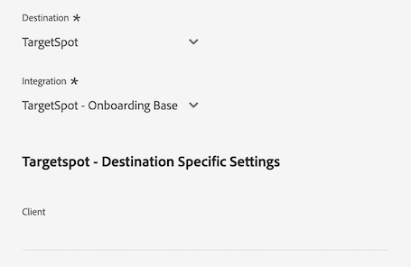

# [!DNL LiveRamp - Distribution] 接続

[!DNL LiveRamp - Distribution] 接続を使用すると、モバイル、web、ディスプレイ、接続された TV メディアをまたいで、Experience Platformからプレミアム パブリッシャーまでオーディエンスをアクティブ化できます。

>[!IMPORTANT]
>
>この宛先コネクタとドキュメントページは、LiveRamp によって作成および管理されます。 お問い合わせや更新のリクエストについては、LiveRamp に直接お問い合わせください [ こちら ](mailto:adobertcdp@liveramp.com)。

## サポートされる宛先 {#supported-destinations}

[!DNL LiveRamp - Distribution] は現在、次のプラットフォームへの audience activation をサポートしています。

* [[!DNL 4C Insights]](#insights)
* [[!DNL Acast]](#acast)
* [[!DNL Nexxen]](#nexxen)
* [[!DNL Ampersand.tv]](#ampersand-tv)
* [[!DNL Captify]](#captify)
* [[!DNL Cardlytics]](#cardlytics)
* [[!DNL Disney (Hulu/ESPN/ABC)]](#disney)
* [[!DNL iHeartMedia]](#iheartmedia)
* [[!DNL Index Exchange]](#index-exchange)
* [[!DNL Magnite CTV Platform]](#magnite)
* [[!DNL Magnite DV+ (Rubicon Project)]](#magnite-dv)
* [[!DNL One Fox]](#fox)
* [[!DNL Pandora]](#pandora)
* [[!DNL Reddit]](#reddit)
* [[!DNL Roku]](#roku)
* [[!DNL Spotify]](#spotify)
* [[!DNL Taboola]](#taboola)
* [[!DNL TargetSpot]](#targetspot)
* [[!DNL Teads]](#teads)
* [[!DNL WB Discovery]](#wb-discovery)

## ユースケース {#use-cases}

[!DNL LiveRamp - Distribution] 宛先を使用する方法とタイミングを理解しやすくするために、Adobe Experience Platform のお客様がこの宛先を使用して解決できるユースケースのサンプルを以下に示します。

スポーツアパレル小売業者のマーケティングチームは、[LiveRamp - オンボーディング ](liveramp-onboarding.md) 接続を使用して、オーディエンスをExperience Platformから LiveRamp アカウントに送信しました。

[!DNL LiveRamp - Distribution] 接続を通じて、オンボーディングされたオーディエンスのアクティベーションを [ サポートされている宛先 ](#supported-destinations) にトリガーできるようになりました。 次に、モバイル、オープン web、ソーシャルおよび [!DNL CTV] プラットフォームでユーザーをターゲットに設定できます。

## LiveRamp へのオーディエンスのオンボーディング {#onboarding}

[!DNL LiveRamp - Distribution] 接続を通じてオーディエンスをアクティブ化する前に、[LiveRamp - Onboarding](liveramp-onboarding.md) 接続を使用して、Experience Platformオーディエンスを LiveRamp に書き出します。

オーディエンスを LiveRamp にオンボーディングしたら、[ 宛先に接続 ](#connect) ステップのアクティベーションワークフローを続行して、データのアクティベーション用にターゲットの宛先プラットフォームを選択および設定します。

## 宛先への接続 {#connect}

>[!CONTEXTUALHELP]
>id="platform_destinations_liveramp_distribution_identifier_settings"
>title="識別子設定"
>abstract="宛先でサポートされている識別子を選択します。各宛先でサポートされる識別子の完全なリストについては、ドキュメントを参照してください。"

>[!IMPORTANT]
> 
>宛先に接続するには、**[!UICONTROL 宛先の表示]** および **[!UICONTROL 宛先の管理]**[ アクセス制御権限 ](/help/access-control/home.md#permissions) が必要です。 詳しくは、[アクセス制御の概要](/help/access-control/ui/overview.md)または製品管理者に問い合わせて、必要な権限を取得してください。

この宛先に接続するには、[宛先設定のチュートリアル](../../ui/connect-destination.md)の手順に従ってください。宛先の設定ワークフローで、以下の 2 つのセクションにリストされているフィールドに入力します。

### LiveRamp への認証 {#authenticate}

宛先に対して認証するには、必須フィールドに入力し、「**[!UICONTROL 宛先に接続]**」を選択します。

* **[!UICONTROL LiveRamp 組織 ID]**:LiveRamp アカウントの組織 ID （LiveRamp から提供された資格情報では _owner_org_ としてリストされています）。
* **[!UICONTROL パスワード]**:LiveRamp アカウントのパスワード（LiveRamp から提供された資格情報では _secret_key_ としてリストされています）。
* **[!UICONTROL トークン URL]**:LiveRamp トークン URL。
* **[!UICONTROL ユーザー名]**:LiveRamp アカウントのユーザー名（LiveRamp から提供された資格情報では _account_id_ としてリストされています）。

### 宛先の詳細を設定 {#destination-details}

LiveRamp アカウントへの接続が正常に完了したら、オーディエンスをアクティブ化する宛先への接続に必要な情報を入力します。

* **[!UICONTROL 名前]**：宛先接続の名前を入力します。

>[!NOTE]
>
>宛先に名前を付ける場合、Adobeでは次の形式に従うことをお勧めします。`LiveRamp - Downstream Destination Name` この命名パターンにより、宛先ワークスペースの [ 参照 ](../../ui/destinations-workspace.md#browse) タブで宛先をすばやく識別することができます。
> 
>例：`LiveRamp - Roku`。

* **[!UICONTROL 説明]**：宛先についての説明を入力します。この宛先の目的を簡単に識別できるように、説明を使用します。
* **[!UICONTROL 宛先]**：ドロップダウンメニューを使用して、オーディエンスをアクティブ化する宛先を選択します。 ここで選択する宛先は、[ 宛先固有の設定 ](#destination-settings) 画面に表示されるものに直接影響します。
* **[!UICONTROL 統合]**：宛先に使用する統合アカウントを選択します。
* **[!UICONTROL 識別子]**：宛先でサポートされている識別子を選択します。 現在、すべての宛先では、サポートされる識別子がドロップダウンメニューに事前入力されています。

## 宛先固有の設定 {#destination-settings}

[!DNL LiveRamp - Distribution] での各宛先 [ サポート対象 ](#supported-destinations) では、特定の設定オプションを入力する必要があります。

各宛先の設定方法について詳しくは、以下の節を参照してください。

### [!DNL 4C Insights] {#insights}

>[!CONTEXTUALHELP]
>id="platform_destinations_liveramp_distribution_4cinsights_profile_id"
>title="4C ブランドプロファイル ID"
>abstract="4C ブランドプロファイルに関連付けられている数値 ID を入力します。 この ID をお持ちでない場合は、4C クライアントサービス担当者にお問い合わせください。"

宛先の詳細を設定するには、以下のフィールドを入力します。

* **[!UICONTROL 4C ブランドプロファイル ID]**:4C ブランドプロファイルに関連付けられた数値の ID を入力します。 この ID をお持ちでない場合は、4C クライアントサービス担当者にお問い合わせください。

### [!DNL Acast] {#acast}

>[!CONTEXTUALHELP]
>id="platform_destinations_liveramp_distribution_acast_client"
>title="クライアント名"
>abstract="宛先パートナーに表示する広告主のアカウント名。会社名を使用します。スペースや特殊文字は使用しないでください。"

宛先の詳細を設定するには、以下のフィールドを入力します。

* **[!UICONTROL クライアント名]**：宛先パートナーに表示する広告主アカウント名。 会社名を使用します。スペースや特殊文字は使用しないでください。

### [!DNL Ampersand.tv] {#ampersand-tv}

>[!CONTEXTUALHELP]
>id="platform_destinations_liveramp_distribution_ampersand_company_name"
>title="会社名"
>abstract="宛先パートナーに表示す会社名。スペースや特殊文字は使用しないでください。"

宛先の詳細を設定するには、以下のフィールドを入力します。

* **[!UICONTROL 会社名]**：宛先パートナーに表示する会社名。 スペースや特殊文字は使用しないでください。

### [!DNL Captify] {#captify}

>[!CONTEXTUALHELP]
>id="platform_destinations_liveramp_distribution_captify_client"
>title="クライアント名"
>abstract="宛先パートナーに表示する広告主のアカウント名。会社名を使用します。スペースや特殊文字は使用しないでください。"

宛先の詳細を設定するには、以下のフィールドを入力します。

* **[!UICONTROL クライアント名]**：宛先パートナーに表示する広告主アカウント名。 会社名を使用します。スペースや特殊文字は使用しないでください。

### [!DNL Cardlytics] {#cardlytics}

>[!CONTEXTUALHELP]
>id="platform_destinations_liveramp_distribution_cardlytics_client"
>title="クライアント名"
>abstract="宛先パートナーに表示する広告主のアカウント名。会社名を使用します。スペースや特殊文字は使用しないでください。"

宛先の詳細を設定するには、以下のフィールドを入力します。

* **[!UICONTROL クライアント名]**：宛先パートナーに表示する広告主アカウント名。 会社名を使用します。スペースや特殊文字は使用しないでください。

### [!DNL Disney (Hulu/ESPN/ABC)] {#disney}

>[!CONTEXTUALHELP]
>id="platform_destinations_liveramp_distribution_agreement"
>title="広告主データの宛先に関する利用規約"
>abstract="`I AGREE` と入力して、Disney の広告主データ規約への承認と同意を確認します。"

<!-- >additional-url="<https://www.disneyadvertising.com/ADVERTISER-DATA-DESTINATION-TERMS/>" text="Read the agreement" -->

>[!CONTEXTUALHELP]
>id="platform_destinations_liveramp_distribution_disney_client"
>title="クライアント名"
>abstract="宛先パートナーに表示する広告主のアカウント名。会社名を使用します。スペースや特殊文字は使用しないでください。"

>[!CONTEXTUALHELP]
>id="platform_destinations_liveramp_distribution_disney_email"
>title="メールアドレス"
>abstract="個人に関連付けられたメールアドレスを入力します。このメールアドレスは、広告主データの利用規約への署名として機能します。このメールアドレスは、必要に応じて連絡する際にも使用されます。"

宛先の詳細を設定するには、以下のフィールドを入力します。

* **[!UICONTROL 広告主データ宛先の利用条件]**:Disney 広告主データ条件に対する確認と同意を確認するために、`I AGREE` を入力します。
* **[!UICONTROL クライアント名]**：宛先パートナーに表示する会社名を入力します。
* **[!UICONTROL メールアドレス]**：個人に関連付けられたメールアドレスを入力します。 このメールアドレスは、広告主データ利用規約契約書への署名として機能します。

### [!DNL iHeartMedia] {#iheartmedia}

>[!CONTEXTUALHELP]
>id="platform_destinations_liveramp_distribution_iheartmedia_client"
>title="クライアント名"
>abstract="宛先パートナーに表示する広告主のアカウント名。会社名を使用します。スペースや特殊文字は使用しないでください。"

宛先の詳細を設定するには、以下のフィールドを入力します。

* **[!UICONTROL クライアント名]**：宛先パートナーに表示する広告主アカウント名。 会社名を使用します。スペースや特殊文字は使用しないでください。

### [!DNL Index Exchange] {#index-exchange}

>[!CONTEXTUALHELP]
>id="platform_destinations_liveramp_distribution_index_advertiseraccountname"
>title="アカウント名"
>abstract="Index Exchange クライアントアカウント名。スペースや特殊文字は使用しないでください。"

宛先の詳細を設定するには、以下のフィールドを入力します。

* **[!UICONTROL アカウント名]**：お使いのインデックス交換クライアントのアカウント名。 スペースや特殊文字は使用しないでください。

### [!DNL Magnite CTV Platform] {#magnite}

>[!CONTEXTUALHELP]
>id="platform_destinations_liveramp_distribution_magnitectv_client"
>title="クライアント"
>abstract="宛先パートナーに表示するクライアント名。会社名を使用します。スペースや特殊文字は使用しないでください。"

宛先の詳細を設定するには、以下のフィールドを入力します。

* **[!UICONTROL クライアント]**：宛先パートナーに表示するクライアント名。 会社名を使用します。スペースや特殊文字は使用しないでください。

### [!DNL Magnite DV+ (Rubicon Project)] {#magnite-dv}

>[!CONTEXTUALHELP]
>id="platform_destinations_liveramp_distribution_magnitedv+_partnerid"
>title="パートナー ID"
>abstract="セグメント／データを所有するパブリッシャーに関連付けられた Rubicon プロジェクトパートナー ID。使用すべき値が不明な場合は、Rubicon プロジェクトアカウント担当者にお問い合わせください。"

>[!CONTEXTUALHELP]
>id="platform_destinations_liveramp_distribution_magnitedv+_seatid"
>title="シート ID"
>abstract="Magnite アカウントマネージャーが提供する Magnite DV とシート ID"

宛先の詳細を設定するには、以下のフィールドを入力します。

* **[!UICONTROL パートナー ID]**：セグメントやデータを所有するパブリッシャーに関連付けられた Rubicon プロジェクトのパートナー ID。 使用すべき値が不明な場合は、Rubicon プロジェクトアカウント担当者にお問い合わせください。
* **[!UICONTROL シート ID]**:Magnite DV+ Magnite アカウントマネージャーから提供されたシート ID

### [!DNL Nexxen (formerly known as [!DNL Amobee])] {#nexxen}

>[!CONTEXTUALHELP]
>id="platform_destinations_liveramp_distribution_nexxen_ratetype"
>title="レートタイプ"
>abstract="レートタイプは、データ使用量の請求方法を表します。0.00 ドルの料金はすべて定額料金にする必要があります。使用するレートタイプが不明な場合は、Nexxen の担当者に確認してください。"

>[!CONTEXTUALHELP]
>id="platform_destinations_liveramp_distribution_nexxen_marketid"
>title="マーケット ID"
>abstract="Nexxen データ契約を作成するマーケット ID を数値で入力します。Nexxen プラットフォームのすべての市場で「AlwaysOn」シンジケーションを実行する場合は、「-1」と入力します。"

>[!CONTEXTUALHELP]
>id="platform_destinations_liveramp_distribution_nexxen_advertiserid"
>title="広告主 ID"
>abstract="Nexxen プラットフォームの単一の広告主にデータを送信する場合は、数値の Amobee 広告主 ID を入力します。データをマーケット内のすべての広告主が利用できるようにする場合、またはこれらのセグメントが「AlwaysOn」の場合は、「-1」と入力してください。"

>[!CONTEXTUALHELP]
>id="platform_destinations_liveramp_distribution_nexxen_contactemail"
>title="連絡先メール"
>abstract="Nexxen がデータ契約の詳細を送信する際に使用するメールアドレスを入力します。ほとんどの場合、これは自分のメールアドレスですが、メールのエイリアスでも構いません。受信者が複数の場合は、コンマ（`email1@domain.com`、`email2@domain.com` など）で区切ります。"

宛先の詳細を設定するには、以下のフィールドを入力します。

* **[!UICONTROL 料金タイプ]**：料金タイプは、データ使用量に対する請求の方法を表します。 0.00 ドルの料金はすべて定額料金にする必要があります。使用するレートタイプが不明な場合は、Nexxen の担当者に確認してください。
* **[!UICONTROL マーケット ID]**: Nexxen データコントラクトを作成する数値のマーケット ID を入力します。 Nexxen プラットフォームのすべての市場で「AlwaysOn」シンジケーションを実行する場合は、「-1」と入力します。
* **[!UICONTROL 広告主 ID]**:Nexxen プラットフォームの 1 人の広告主にデータを送信する場合は、数値の Nexxen 広告主 ID を入力します。 マーケット内のすべての広告主がデータを利用できるようにする場合や、これらのセグメントが「AlwaysOn」の場合は、-1 と入力します。
* **[!UICONTROL 連絡先メール]**: Nexxen がデータ契約の詳細を送信するために使用する必要があるメールアドレスを入力します。 ほとんどの場合、これは自分のメールアドレスですが、メールのエイリアスでも構いません。複数の受信者の場合は、コンマ（`email1@domain.com`、`email2@domain.com`）を使用して区切ります。

### [!DNL One Fox] {#fox}

>[!CONTEXTUALHELP]
>id="platform_destinations_liveramp_distribution_fox_client"
>title="クライアント"
>abstract="パートナーに表示する会社／配信アカウントの名前。使用する名前が不明な場合は、パートナーアカウント担当者にお問い合わせください。スペースや特殊文字は使用しないでください。"

宛先の詳細を設定するには、以下のフィールドを入力します。

* **[!UICONTROL クライアント]**：パートナーに表示する会社/配布アカウントの名前。 デフォルトでは会社名を使用します。 使用する名前が不明な場合は、パートナーアカウント担当者にお問い合わせください。スペースや特殊文字は使用しないでください。

### [!DNL Pandora] {#pandora}

>[!CONTEXTUALHELP]
>id="platform_destinations_liveramp_distribution_pandora_account_name"
>title="アカウント名"
>abstract="お客様の Pandora アカウントの名前。アカウント名が不明な場合は、Pandora のアカウント担当者にお問い合わせください。スペースや特殊文字は使用しないでください。"

宛先の詳細を設定するには、以下のフィールドを入力します。

* **[!UICONTROL アカウント名]**:Pandora アカウントの名前。 アカウント名が不明な場合は、Pandora のアカウント担当者にお問い合わせください。スペースや特殊文字は使用しないでください。

### [!DNL Reddit] {#reddit}

>[!CONTEXTUALHELP]
>id="platform_destinations_liveramp_distribution_reddit_advertiser_id"
>title="Reddit の広告主 ID"
>abstract="Reddit の広告主 ID。「t2_」または「a2_」で始まる必要があります。広告主 ID が不明な場合は、Reddit の担当者にお問い合わせください。"

>[!CONTEXTUALHELP]
>id="platform_destinations_liveramp_distribution_reddit_advertiser_name"
>title="Reddit の広告主名"
>abstract="Reddit の広告主名。スペースや特殊文字は使用しないでください。"

宛先の詳細を設定するには、以下のフィールドを入力します。

* **[!UICONTROL Reddit 広告主 ID]**:Reddit 広告主 ID。 「t2_」または「a2_」で始まる必要があります。広告主 ID が不明な場合は、Reddit の担当者にお問い合わせください。
* **[!UICONTROL Reddit 広告主名]**:Reddit 広告主名。 スペースや特殊文字は使用しないでください。

### [!DNL Roku] {#roku}

>[!CONTEXTUALHELP]
>id="platform_destinations_liveramp_distribution_roku_email"
>title="Roku アカウントのメールアドレス"
>abstract="Roku アカウントに関連付けられたメールアドレスを入力します。"

>[!CONTEXTUALHELP]
>id="platform_destinations_liveramp_distribution_roku_representative_email"
>title="Roku アカウント担当者のメールアドレス"
>abstract="Roku アカウント担当者のメールアドレスを入力します。このアドレスは、分類の更新を送信するために使用されます。複数のアドレスを入力する場合は、コンマで区切ります。"

宛先の詳細を設定するには、以下のフィールドを入力します。

* **[!UICONTROL Roku アカウントのメールアドレス]**:Roku アカウントに関連付けられているメールアドレスを入力します。
* **[!UICONTROL Roku アカウント担当者のメールアドレス]**:Roku アカウント担当者のメールアドレスを入力します。 複数のアドレスを入力する場合は、コンマで区切ります。

### [!DNL Spotify] {#spotify}

>[!CONTEXTUALHELP]
>id="platform_destinations_liveramp_distribution_spotify_client"
>title="クライアント名"
>abstract="宛先パートナーに表示する広告主のアカウント名。会社名を使用します。スペースや特殊文字は使用しないでください。"

宛先の詳細を設定するには、以下のフィールドを入力します。

* **[!UICONTROL クライアント名]**：宛先パートナーに表示する広告主アカウント名。 会社名を使用します。スペースや特殊文字は使用しないでください。

### [!DNL Taboola] {#taboola}

>[!CONTEXTUALHELP]
>id="platform_destinations_liveramp_distribution_taboola_rep_email"
>title="アカウントマネージャーのメールアドレス"
>abstract="Taboola アカウントマネージャーのメールアドレス。"

>[!CONTEXTUALHELP]
>id="platform_destinations_liveramp_distribution_taboola_seg_type"
>title="セグメントタイプ"
>abstract="セグメントタイプ。現在、ファーストパーティセグメントのみがサポートされています。"

宛先の詳細を設定するには、以下のフィールドを入力します。

* **[!UICONTROL アカウントマネージャーのメールアドレス]**:Taboola アカウントマネージャーのメールアドレス。
* **[!UICONTROL セグメントタイプ]**：セグメントタイプ。 現在、ファーストパーティセグメントのみがサポートされています。

### [!DNL TargetSpot] {#targetspot}

>[!CONTEXTUALHELP]
>id="platform_destinations_liveramp_distribution_targetspot_client"
>title="クライアント名"
>abstract="宛先パートナーに表示する広告主のアカウント名。会社名を使用します。スペースや特殊文字は使用しないでください。"

宛先の詳細を設定するには、以下のフィールドを入力します。

* **[!UICONTROL クライアント名]**：宛先パートナーに表示する広告主アカウント名。 会社名を使用します。スペースや特殊文字は使用しないでください。

### [!DNL Teads] {#teads}

>[!CONTEXTUALHELP]
>id="platform_destinations_liveramp_distribution_teads_teadsid"
>title="Teads D"
>abstract="あなたの Teads ID"

宛先の詳細を設定するには、以下のフィールドを入力します。

* **[!UICONTROL Teads ID]**：お使いの Teads ID

### [!DNL WB Discovery] {#wb-discovery}

>[!CONTEXTUALHELP]
>id="platform_destinations_liveramp_distribution_wb_client"
>title="クライアント名"
>abstract="宛先パートナーに表示する広告主のアカウント名。会社名を使用します。スペースや特殊文字は使用しないでください。"

宛先の詳細を設定するには、以下のフィールドを入力します。

* **[!UICONTROL クライアント名]**：宛先パートナーに表示する広告主アカウント名。 会社名を使用します。スペースや特殊文字は使用しないでください。

### アラートの有効化 {#enable-alerts}

アラートを有効にすると、宛先へのデータフローのステータスに関する通知を受け取ることができます。データフローのステータスに関する通知を受け取るには、リストからアラートを選択します。 アラートについて詳しくは、[UI を使用した宛先アラートの購読](../../ui/alerts.md)に関するガイドを参照してください。

宛先接続の詳細の入力を終えたら「**[!UICONTROL 次へ]**」を選択します。

## この宛先に対してオーディエンスをアクティブ化 {#activate}

>[!IMPORTANT]
> 
>データをアクティブ化するには、**[!UICONTROL 宛先の表示]**、**[!UICONTROL 宛先のアクティブ化]**、**[!UICONTROL プロファイルの表示]** および **[!UICONTROL セグメントの表示]**[ アクセス制御権限 ](/help/access-control/home.md#permissions) が必要です。 [アクセス制御の概要](/help/access-control/ui/overview.md)を参照するか、製品管理者に問い合わせて必要な権限を取得してください。

[!DNL LiveRamp - Distribution] 接続は、[LiveRamp - Onboarding](liveramp-onboarding.md) 接続を通じて既に LiveRamp アカウントにオンボーディングされているオーディエンスをアクティブ化します。

オーディエンスを正常にアクティブ化するには、LiveRamp に **以前にオンボーディングした**[ 同じオーディエンス ](liveramp-onboarding.md) を選択する必要があります。

>[!IMPORTANT]
>
>[LiveRamp - オンボーディング ](liveramp-onboarding.md) 接続からオンボーディングされていないオーディエンスを選択しても、新しいオーディエンスのオンボーディングはトリガーになりません。

## 書き出されたデータ／データ書き出しの検証 {#exported-data}

オーディエンスのアクティベーションを検証および監視するには、LiveRamp アカウントにログインし、アクティベーション指標を確認します。

Audience Activation について質問がある場合は、LiveRamp アカウント担当者にお問い合わせください。

## データの使用とガバナンス {#data-usage-governance}

[!DNL Adobe Experience Platform] のすべての宛先は、データを処理する際のデータ使用ポリシーに準拠しています。[!DNL Adobe Experience Platform] がどのように データガバナンスを実施するかについて詳しくは、[データガバナンスの概要](/help/data-governance/home.md)を参照してください。

## その他のリソース {#additional-resources}

[!DNL LiveRamp - Onboarding] の宛先の設定方法について詳しくは、[LiveRamp - オンボーディングドキュメント ](liveramp-onboarding.md) を参照してください。
